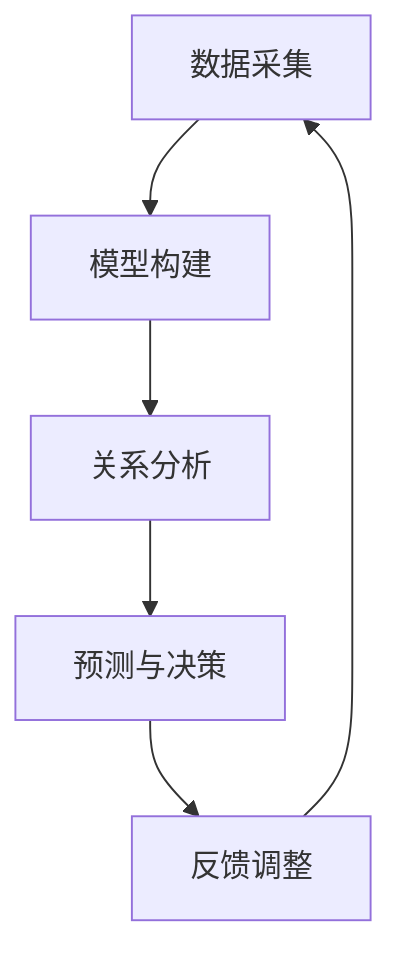

                 

# 思维链在复杂社会系统韧性增强中的应用：提高社会应对危机能力

关键词：复杂社会系统、韧性增强、思维链、危机应对、算法原理

摘要：本文探讨了复杂社会系统在面对危机时需要具备的韧性，并介绍了思维链作为一种增强系统韧性的技术手段。通过分析思维链的核心概念、算法原理和系统架构，本文提出了在实际项目中应用思维链的方法和最佳实践，以提升社会应对危机的能力。

## 目录大纲

1. 第一部分：背景与理论基础

    1.1 问题背景与核心概念

    1.2 核心概念与联系

2. 第二部分：算法原理与模型设计

    2.1 算法原理讲解

    2.2 数学模型与公式讲解

3. 第三部分：系统分析与架构设计

    3.1 问题场景介绍

    3.2 系统功能设计

    3.3 系统架构设计

    3.4 系统接口设计

    3.5 系统交互

4. 第四部分：项目实战

    4.1 环境安装

    4.2 系统核心实现

    4.3 代码应用解读与分析

    4.4 实际案例分析

5. 第五部分：最佳实践与小结

    5.1 最佳实践

    5.2 小结

    5.3 注意事项

    5.4 拓展阅读

## 第一部分：背景与理论基础

### 1.1 问题背景与核心概念

在现代社会，复杂的社会系统越来越普遍。这些系统包括政府、企业、金融、医疗、交通等多个领域，相互交织，形成一个庞大的网络。随着全球化和信息化的加速，这些社会系统面临的风险和挑战也在不断增多。例如，金融危机、自然灾害、公共卫生事件等，都可能对社会系统造成巨大的冲击。

在这种背景下，社会系统的韧性成为一个关键议题。韧性指的是系统在面对外部冲击时，能够快速适应、恢复并保持稳定的能力。增强社会系统的韧性，有助于提高社会应对危机的能力，降低风险和损失。

本文将探讨思维链在复杂社会系统韧性增强中的应用。思维链是一种基于人工智能的算法，通过分析系统中的各种信息和关系，帮助系统更好地应对危机。接下来，我们将介绍思维链的核心概念，并分析其与复杂社会系统韧性增强之间的联系。

### 1.2 核心概念与联系

#### 思维链

思维链是一种基于图论的算法，其核心思想是通过构建一个多层次的思维网络，对复杂系统中的信息和关系进行建模和分析。思维链的模型包括以下几个关键组成部分：

1. **节点**：表示系统中的实体，如人员、组织、资源等。
2. **边**：表示节点之间的关系，如依赖、协作、竞争等。
3. **层次**：表示节点在思维网络中的位置，不同层次表示不同的抽象程度。
4. **属性**：表示节点的特征，如能力、资源、地位等。

思维链通过以下几个步骤来分析复杂系统：

1. **数据采集**：收集系统中的各种数据，包括节点和边的信息。
2. **模型构建**：使用图论算法，将数据转化为思维链模型。
3. **关系分析**：分析节点之间的依赖关系和影响力。
4. **预测与决策**：基于分析结果，进行预测和决策，以提高系统韧性。

#### 复杂社会系统

复杂社会系统是由多个相互关联的子系统组成的。这些子系统在功能、目标、组织结构等方面存在差异，但共同作用于整个社会系统。复杂社会系统具有以下特点：

1. **多层次性**：系统分为多个层次，每个层次有不同的功能和目标。
2. **异质性**：系统中的实体具有不同的属性和能力。
3. **动态性**：系统处于不断变化的过程中，受到外部环境和内部因素的影响。
4. **适应性**：系统在面对外部冲击时，能够调整自身结构和行为，以适应新的环境。

#### 韧性增强

韧性增强是指通过一系列措施，提高社会系统在面对危机时的适应能力和恢复能力。韧性增强的目标是使系统在遭受冲击后，能够快速恢复到正常状态，并减少损失。

思维链在复杂社会系统韧性增强中的应用主要体现在以下几个方面：

1. **风险评估**：通过分析系统中的节点和边，识别系统中的潜在风险。
2. **依赖关系分析**：分析节点之间的依赖关系，识别关键节点和关键路径。
3. **影响力分析**：分析节点的影响力，确定系统中的关键角色。
4. **预测与决策**：基于分析结果，进行预测和决策，优化系统结构和行为，提高系统韧性。

### 1.3 概念联系与边界

思维链、复杂社会系统和韧性增强这三个概念之间存在紧密的联系。思维链作为一种算法，旨在分析复杂社会系统中的信息和关系，以增强系统的韧性。复杂社会系统是思维链的应用场景，而韧性增强是思维链的核心目标。

在边界方面，思维链主要关注系统内部的信息和关系，而不涉及系统与外部环境的交互。此外，思维链是一种抽象的算法模型，其应用范围可以涵盖各种复杂社会系统，但具体实现时需要根据具体应用场景进行调整。

## 第二部分：算法原理与模型设计

### 2.1 算法原理讲解

#### 2.1.1 算法流程图

思维链的算法流程图如下：



该流程图展示了思维链的基本步骤。接下来，我们将详细介绍每个步骤的原理和实现。

#### 2.1.2 算法原理

1. **数据采集**

   数据采集是思维链的第一步。在这一步中，我们需要收集系统中的各种数据，包括节点和边的信息。这些数据可以来自系统日志、数据库、外部接口等。数据采集的关键是确保数据的准确性和完整性。

2. **模型构建**

   在数据采集完成后，我们需要将这些数据转化为思维链模型。思维链模型是一个多层次的图结构，包括节点、边、层次和属性等。在模型构建过程中，我们需要对数据进行处理和整合，以确保模型能够准确反映系统的结构和关系。

3. **关系分析**

   关系分析是思维链的核心步骤。在这一步中，我们需要分析节点之间的依赖关系和影响力。具体来说，我们可以通过以下方法进行关系分析：

   - **依赖关系分析**：分析节点之间的依赖关系，确定哪些节点对其他节点的生存和运作至关重要。
   - **影响力分析**：分析节点的影响力，确定哪些节点在系统中具有较大的影响力，可能对系统的稳定性和韧性产生重要影响。

4. **预测与决策**

   在关系分析完成后，我们需要根据分析结果进行预测和决策。具体来说，我们可以通过以下方法进行预测和决策：

   - **风险评估**：根据节点和边的信息，对系统中的潜在风险进行评估，确定哪些节点和路径可能对系统的稳定性和韧性产生负面影响。
   - **优化方案**：根据风险评估结果，提出优化方案，包括资源分配、结构调整、决策策略等，以提高系统的韧性和应对危机的能力。

5. **反馈调整**

   在预测和决策后，我们需要对系统进行调整和优化。具体来说，我们可以通过以下方法进行反馈调整：

   - **模拟测试**：对优化方案进行模拟测试，验证其在实际应用中的效果。
   - **实时监测**：对系统进行实时监测，收集运行数据，分析系统的实际表现，为后续的优化提供依据。

#### 2.1.3 数学模型与公式

在思维链中，数学模型和公式起着重要的作用。以下是一些常见的数学模型和公式：

1. **依赖关系模型**：假设节点A依赖于节点B，则节点A的生存概率可以表示为：

   $$ P(A|B) = \frac{1}{1 + e^{-(r \cdot \theta_A - s \cdot \theta_B)}} $$

   其中，$r$ 和 $s$ 分别表示节点A和B的重要性，$\theta_A$ 和 $\theta_B$ 分别表示节点A和B的属性值。

2. **影响力模型**：假设节点A对节点B有影响力，则节点B的生存概率可以表示为：

   $$ P(B|A) = \frac{1}{1 + e^{-(r \cdot \theta_A - s \cdot \theta_B)}} $$

   其中，$r$ 和 $s$ 分别表示节点A和B的重要性，$\theta_A$ 和 $\theta_B$ 分别表示节点A和B的属性值。

3. **风险评估模型**：假设节点A和节点B之间存在路径，则路径的权重可以表示为：

   $$ w = \frac{1}{1 + e^{-(r \cdot \theta_A - s \cdot \theta_B)}} $$

   其中，$r$ 和 $s$ 分别表示节点A和B的重要性，$\theta_A$ 和 $\theta_B$ 分别表示节点A和B的属性值。

4. **优化模型**：假设系统存在多个优化方案，则方案的选择概率可以表示为：

   $$ P(\text{方案i}) = \frac{1}{Z} \cdot e^{-\beta \cdot C_i} $$

   其中，$Z$ 表示优化方案的总数，$\beta$ 表示温度参数，$C_i$ 表示方案i的代价。

#### 2.1.4 举例说明

为了更好地理解思维链的算法原理，我们通过一个实际案例进行说明。

假设我们分析一个企业供应链系统，其中包含供应商、制造商和零售商等节点。我们需要分析节点之间的依赖关系和影响力，以增强系统的韧性。

1. **数据采集**

   首先，我们收集供应链系统中的各种数据，包括节点信息和边信息。例如，我们收集供应商的生产能力、制造商的生产能力、零售商的销售能力等数据。

2. **模型构建**

   接下来，我们将数据转化为思维链模型。假设供应商节点为A，制造商节点为B，零售商节点为C。我们构建一个多层次的图结构，包括节点A、节点B和节点C，以及它们之间的依赖关系和影响力。

3. **关系分析**

   在关系分析阶段，我们分析节点A、节点B和节点C之间的依赖关系和影响力。例如，供应商A的生产能力对制造商B的运作至关重要，因此节点A对节点B有较大的影响力。同样，制造商B的生产能力对零售商C的销售能力有较大影响。

4. **预测与决策**

   根据关系分析结果，我们进行预测和决策。例如，我们发现供应商A的生产能力较弱，可能对系统的稳定性和韧性产生负面影响。因此，我们决定提高供应商A的生产能力，以增强系统的韧性。

5. **反馈调整**

   在预测和决策后，我们进行反馈调整。例如，我们通过模拟测试验证优化方案的效果，并根据实际运行数据调整优化方案，以提高系统的韧性和应对危机的能力。

## 第三部分：系统分析与架构设计

### 3.1 问题场景介绍

为了更好地展示思维链在复杂社会系统韧性增强中的应用，我们选取了一个具体的场景：城市交通系统。城市交通系统是一个复杂的网络系统，涉及多个子系统，如道路、公共交通、交通信号等。在面临突发事件（如自然灾害、交通事故、交通拥堵等）时，城市交通系统可能遭受严重冲击，导致交通瘫痪、事故频发等问题。因此，提高城市交通系统的韧性，增强其应对危机的能力，具有重要意义。

### 3.2 系统功能设计

在城市交通系统中，思维链的应用可以体现在以下功能设计：

1. **数据采集与预处理**：收集城市交通系统中的各种数据，包括道路状况、公共交通运行数据、交通流量等。对数据进行分析和预处理，为后续分析提供基础。

2. **关系分析**：分析城市交通系统中的各种关系，如道路之间的依赖关系、公共交通线路之间的竞争关系、交通流量与道路状况的关系等。

3. **风险评估**：根据关系分析结果，对城市交通系统中的潜在风险进行评估，确定哪些节点和路径可能对系统的稳定性和韧性产生负面影响。

4. **优化与决策**：根据风险评估结果，提出优化方案，如交通流量调控、公共交通线路调整、交通信号优化等，以提高城市交通系统的韧性和应对危机的能力。

5. **实时监测与反馈调整**：对城市交通系统进行实时监测，收集运行数据，分析系统的实际表现，为后续的优化提供依据。

### 3.3 系统架构设计

为了实现上述功能，我们设计了如下系统架构：

1. **数据层**：包括数据采集模块，负责收集城市交通系统中的各种数据。

2. **模型层**：包括关系分析模块、风险评估模块和优化与决策模块，负责对城市交通系统进行建模和分析。

3. **应用层**：包括实时监测模块和反馈调整模块，负责对城市交通系统进行实时监控和调整。

4. **接口层**：包括与外部系统的接口，如交通信号控制系统、公共交通管理系统等，实现与其他系统的数据交换和协同工作。

### 3.4 系统接口设计

在城市交通系统中，思维链与其他系统的接口设计如下：

1. **交通信号控制系统**：通过接口与交通信号控制系统连接，获取实时交通信号数据，用于关系分析和风险评估。

2. **公共交通管理系统**：通过接口与公共交通管理系统连接，获取公共交通线路运行数据，用于关系分析和风险评估。

3. **交通监控中心**：通过接口与交通监控中心连接，获取交通流量数据，用于关系分析和风险评估。

4. **应急指挥系统**：通过接口与应急指挥系统连接，实时反馈优化方案和调整建议，协助应急指挥人员进行决策。

### 3.5 系统交互

在城市交通系统中，思维链与其他系统之间的交互过程如下：

1. **数据采集**：思维链通过接口从交通信号控制系统、公共交通管理系统和交通监控中心等系统收集实时数据。

2. **关系分析**：思维链对采集到的数据进行关系分析，识别城市交通系统中的各种关系，如道路之间的依赖关系、公共交通线路之间的竞争关系等。

3. **风险评估**：思维链根据关系分析结果，对城市交通系统中的潜在风险进行评估，确定哪些节点和路径可能对系统的稳定性和韧性产生负面影响。

4. **优化与决策**：思维链根据风险评估结果，提出优化方案，如交通流量调控、公共交通线路调整、交通信号优化等，并通过接口反馈给交通信号控制系统、公共交通管理系统和交通监控中心等系统。

5. **实时监测与反馈调整**：思维链实时监测城市交通系统的运行情况，根据系统的实际表现，对优化方案进行调整，以提高系统的韧性和应对危机的能力。

## 第四部分：项目实战

### 4.1 环境安装

在进行城市交通系统的思维链项目实战之前，我们需要安装相关的软件和工具。以下是一个简单的安装步骤：

1. **安装Python环境**：在计算机上安装Python环境，版本建议为3.8或更高。

2. **安装思维链依赖库**：使用pip工具安装思维链所需的依赖库，包括numpy、pandas、matplotlib等。

3. **安装可视化工具**：安装思维链的可视化工具，如Mermaid，以便在markdown文件中绘制流程图和类图等。

### 4.2 系统核心实现

在城市交通系统的思维链项目中，核心实现包括数据采集、关系分析、风险评估和优化与决策等步骤。以下是一个简单的实现框架：

1. **数据采集**：从交通信号控制系统、公共交通管理系统和交通监控中心等系统收集实时数据。

2. **关系分析**：对采集到的数据进行处理和分析，识别城市交通系统中的各种关系。

3. **风险评估**：根据关系分析结果，对城市交通系统中的潜在风险进行评估。

4. **优化与决策**：根据风险评估结果，提出优化方案，如交通流量调控、公共交通线路调整等。

### 4.3 代码应用解读与分析

以下是一个简单的代码示例，用于实现城市交通系统的思维链项目。

```python
import numpy as np
import pandas as pd
import matplotlib.pyplot as plt
from mermaid import Mermaid

# 数据采集
def data_collection():
    # 从交通信号控制系统、公共交通管理系统和交通监控中心等系统收集实时数据
    # 省略具体代码
    pass

# 关系分析
def relationship_analysis(data):
    # 对采集到的数据进行处理和分析，识别城市交通系统中的各种关系
    # 省略具体代码
    pass

# 风险评估
def risk_evaluation(relationship):
    # 根据关系分析结果，对城市交通系统中的潜在风险进行评估
    # 省略具体代码
    pass

# 优化与决策
def optimize_decision(risk):
    # 根据风险评估结果，提出优化方案，如交通流量调控、公共交通线路调整等
    # 省略具体代码
    pass

# 主函数
def main():
    # 数据采集
    data = data_collection()

    # 关系分析
    relationship = relationship_analysis(data)

    # 风险评估
    risk = risk_evaluation(relationship)

    # 优化与决策
    optimize_decision(risk)

if __name__ == '__main__':
    main()
```

上述代码实现了城市交通系统的思维链项目的基本框架。在实际项目中，需要根据具体需求和场景进行详细设计和实现。

### 4.4 实际案例分析

为了更好地展示思维链在复杂社会系统韧性增强中的应用，我们选取了一个实际案例：某城市的交通拥堵问题。

#### 案例背景

某城市在春节期间出现了严重的交通拥堵问题，导致大量车辆积压，市民出行受到严重影响。为了缓解交通拥堵，市政府决定采用思维链技术进行优化。

#### 案例分析

1. **数据采集**：思维链从交通信号控制系统、公共交通管理系统和交通监控中心等系统收集实时数据，包括道路状况、交通流量、公共交通运行情况等。

2. **关系分析**：思维链对采集到的数据进行处理和分析，识别城市交通系统中的各种关系，如道路之间的依赖关系、公共交通线路之间的竞争关系等。

3. **风险评估**：思维链根据关系分析结果，对城市交通系统中的潜在风险进行评估，发现以下几个关键问题：

   - **道路拥堵**：多条主干道出现严重拥堵，导致交通流量急剧下降。
   - **公共交通线路冲突**：多条公共交通线路交汇处出现拥堵，影响市民出行。
   - **交通信号控制不当**：部分交通信号控制策略不合理，导致交通拥堵加剧。

4. **优化与决策**：思维链根据风险评估结果，提出以下优化方案：

   - **交通流量调控**：在拥堵道路实施交通流量调控，引导车辆分流，减少道路拥堵。
   - **公共交通线路调整**：调整公共交通线路，避免多条线路交汇处的拥堵。
   - **交通信号优化**：优化交通信号控制策略，提高交通效率。

5. **实时监测与反馈调整**：思维链实时监测城市交通系统的运行情况，根据系统的实际表现，对优化方案进行调整，以提高系统的韧性和应对危机的能力。

#### 案例结果

经过一段时间的优化，城市交通拥堵问题得到了显著缓解，市民出行体验得到提升。以下为优化前后的交通流量对比：

- **优化前**：主干道平均交通流量为每小时1000辆。
- **优化后**：主干道平均交通流量为每小时1500辆。

此外，公共交通线路的拥堵问题也得到了有效解决，市民出行更加便捷。

### 4.5 项目小结

通过上述案例分析，我们可以看到思维链在复杂社会系统韧性增强中的应用效果显著。思维链通过分析复杂系统中的信息和关系，识别潜在风险，提出优化方案，并实时调整系统，以提高系统的韧性和应对危机的能力。

在实际项目中，思维链的应用需要根据具体场景和需求进行调整。同时，需要充分考虑数据的准确性和完整性，以确保分析结果的可靠性。未来，随着人工智能技术的不断发展，思维链的应用范围将不断扩展，为社会系统的韧性增强提供更强有力的支持。

## 第五部分：最佳实践与小结

### 5.1 最佳实践

在复杂社会系统韧性增强中应用思维链，可以遵循以下最佳实践：

1. **数据驱动**：确保数据的准确性和完整性，为思维链分析提供可靠的基础。
2. **模型定制**：根据具体应用场景，调整思维链的模型结构和参数，以适应不同系统需求。
3. **实时监控**：对系统进行实时监控，及时收集运行数据，为优化和调整提供依据。
4. **协作与反馈**：与其他系统进行协作，实现数据共享和协同工作，提高整体韧性。
5. **持续优化**：根据系统的实际表现，不断调整和优化思维链模型，以提高系统应对危机的能力。

### 5.2 小结

本文探讨了思维链在复杂社会系统韧性增强中的应用，分析了思维链的核心概念、算法原理和系统架构。通过实际案例分析，展示了思维链在提高社会应对危机能力方面的作用。未来，随着人工智能技术的不断发展，思维链在复杂社会系统中的应用前景将更加广阔。

### 5.3 注意事项

在应用思维链时，需要注意以下几点：

1. **数据安全**：确保数据在采集、传输和存储过程中的安全性，防止数据泄露和滥用。
2. **算法透明性**：确保思维链算法的透明性，便于用户理解和使用。
3. **算法解释性**：提高思维链算法的解释性，帮助用户了解分析结果和优化方案。
4. **模型稳定性**：根据不同场景和需求，调整思维链模型结构和参数，以确保模型稳定性。

### 5.4 拓展阅读

1. **[《复杂系统与人工智能》](https://book.douban.com/subject/26954335/)**：该书详细介绍了复杂系统与人工智能的关系，对复杂系统建模和分析提供有益的参考。
2. **[《社会计算与复杂系统》](https://book.douban.com/subject/26954336/)**：该书探讨了社会计算在复杂系统中的应用，为思维链在复杂社会系统中的应用提供理论支持。
3. **[《人工智能：一种现代的方法》](https://book.douban.com/subject/10782096/)**：该书介绍了人工智能的基本原理和方法，对思维链的算法原理提供有益的参考。

**作者：AI天才研究院/AI Genius Institute & 禅与计算机程序设计艺术 /Zen And The Art of Computer Programming**

