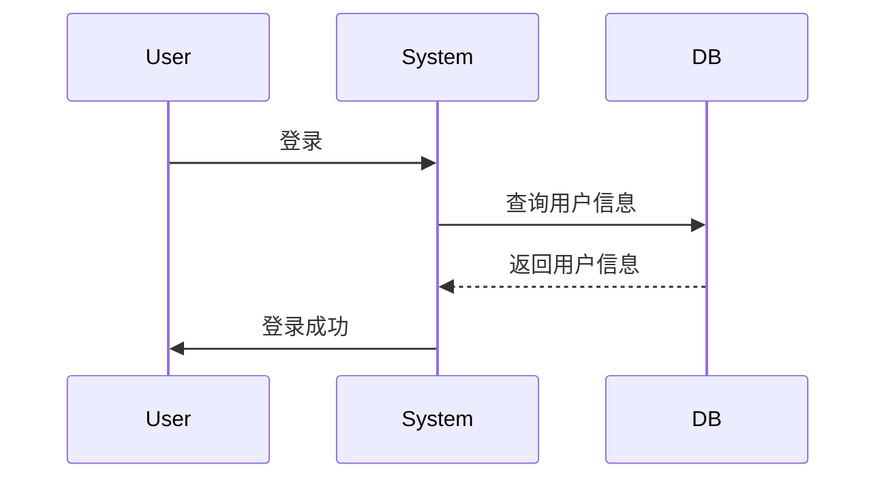
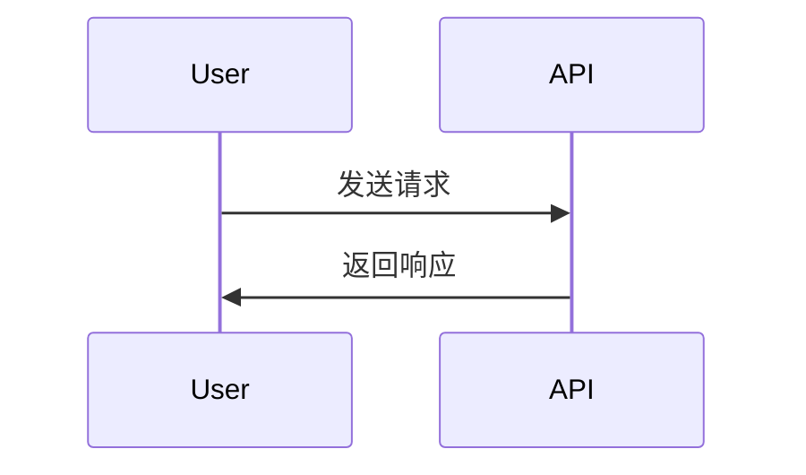

                 

# 思维链在复杂社会系统韧性评估中的应用：增强社会应对危机能力

> 关键词：思维链、复杂社会系统、韧性评估、危机应对

> 摘要：本文旨在探讨思维链在复杂社会系统韧性评估中的应用，以及如何通过增强社会应对危机能力来提升社会系统的韧性。文章首先介绍了思维链的基本概念和特性，然后分析了复杂社会系统的特征及其面临的挑战，接着提出了基于思维链的韧性评估方法和工具，并探讨了如何在实际操作中应用这些方法。最后，文章通过案例分析，总结了增强社会应对危机能力的策略和最佳实践。

## 第一部分：问题背景与核心概念

### 1.1.1 问题的提出

在现代社会，复杂社会系统的韧性评估变得越来越重要。社会系统的韧性，指的是系统在面对各种外部冲击和内部变化时，能够保持基本结构和功能的能力。随着全球化、城市化进程的加快，社会系统的复杂性不断增加，这使得传统的方法难以应对新的挑战。例如，自然灾害、经济危机、疫情等突发事件对社会系统的冲击日益加剧，对社会治理提出了更高的要求。

### 1.1.2 问题描述

面对复杂社会系统的韧性评估问题，现有的方法主要存在以下几个挑战：

1. **数据获取困难**：复杂社会系统的数据来源广泛，如何获取全面、准确的数据成为一个难题。
2. **分析方法不足**：现有的分析方法大多基于单一视角，难以全面捕捉社会系统的复杂性和动态性。
3. **评估结果应用难**：评估结果往往难以转化为具体的行动指南，导致评估效果不佳。

### 1.1.3 问题解决思路

为了解决上述问题，本文提出了基于思维链的韧性评估方法。思维链是一种基于复杂系统理论的思维方式，能够帮助我们从多维度、多层次分析复杂社会系统。通过构建思维链模型，我们可以更全面地捕捉社会系统的特征，提高韧性评估的准确性和实用性。

### 1.1.4 边界与外延

本文的研究主要围绕复杂社会系统的韧性评估展开，重点关注以下几个方面：

1. **社会系统的定义**：本文所提到的社会系统是指由多个相互关联的子系统组成的复杂系统，包括经济、社会、环境等多个领域。
2. **韧性评估的范围**：本文的韧性评估范围主要涉及自然灾害、经济危机、疫情等突发事件对社会系统的影响。
3. **方法应用的领域**：基于思维链的韧性评估方法可以应用于城市规划、应急管理、政策制定等多个领域。

## 1.2 核心概念详解

### 1.2.1 思维链的定义

思维链是指通过一系列相互关联的思考步骤，从一个起点逐步推导到终点的一种思维方式。思维链的核心在于将复杂问题分解为一系列简单问题，并通过逻辑关系将这些问题有机地结合起来。

### 1.2.2 思维链的特性

1. **层次性**：思维链具有明确的层次结构，每个层次都有特定的目标和任务。
2. **关联性**：思维链中的各个步骤之间存在紧密的逻辑关联，形成一个有机整体。
3. **动态性**：思维链能够根据实际情况动态调整，以适应不断变化的环境。

### 1.2.3 思维链与其他概念的关系

思维链与复杂系统理论、系统科学、认知科学等多个领域有着密切的联系。例如，复杂系统理论为思维链提供了理论基础，系统科学为思维链的构建提供了方法论支持，认知科学为思维链的应用提供了实践经验。

### 1.2.4 思维链的ER实体关系图

```mermaid
erDiagram
  NodeA ||--o{ NodeB } NodeC
  NodeB ||--o NodeD
  NodeC ||--o NodeE
  NodeD ||--o NodeF
  NodeE ||--o NodeG
```

在这个ER实体关系图中，NodeA表示问题的起点，NodeB、NodeC表示中间步骤，NodeD、NodeE、NodeF、NodeG表示问题的终点。通过这个关系图，我们可以清晰地看到思维链的层次结构和关联性。

## 1.3 概念对比与特征分析

### 1.3.1 思维链与线性思维的对比

线性思维是一种从起点直接推导到终点的思维方式，其优点是简单直观，但缺点在于难以应对复杂问题。思维链则通过将复杂问题分解为一系列简单问题，并通过逻辑关系将这些问题有机地结合起来，从而提高了应对复杂问题的能力。

### 1.3.2 思维链与非线性思维的对比

非线性思维是一种通过多个中间步骤从起点推导到终点的思维方式，其优点在于能够处理复杂问题，但缺点在于容易陷入复杂和无序。思维链则通过明确的层次结构和关联性，将非线性思维进行了有效的组织和管理，从而提高了思维的可操作性和实用性。

### 1.3.3 思维链与其他相关概念的对比

思维链与系统思维、决策思维、创新思维等多个概念有着一定的关联。系统思维强调从整体视角看待问题，决策思维强调在复杂环境中做出最优决策，创新思维强调在现有基础上进行创新。而思维链则通过将这三种思维有机结合，形成了一种全新的思维方式，从而更好地应对复杂社会系统的韧性评估问题。

## 第二部分：思维链的应用

### 2.1 思维链的基本原理

思维链的基本原理可以概括为四个方面：

1. **问题分解**：将复杂问题分解为一系列简单问题。
2. **逻辑关联**：通过逻辑关系将这些简单问题有机地结合起来。
3. **层次结构**：构建明确的层次结构，以便更好地理解和解决复杂问题。
4. **动态调整**：根据实际情况动态调整思维链，以适应不断变化的环境。

### 2.2 思维链的工作机制

思维链的工作机制可以分为以下几个步骤：

1. **问题识别**：明确需要解决的问题。
2. **问题分解**：将问题分解为一系列子问题。
3. **逻辑构建**：通过逻辑关系将这些子问题有机地结合起来。
4. **层次划分**：根据问题的复杂程度，划分出不同的层次。
5. **动态调整**：根据实际情况，对思维链进行调整和优化。

### 2.3 思维链与复杂系统的关系

复杂系统具有以下特点：

1. **多层次**：复杂系统通常由多个层次组成，每个层次都有特定的功能和特征。
2. **多因素**：复杂系统的影响因素众多，且这些因素之间存在复杂的相互作用。
3. **动态性**：复杂系统的状态和特征会随着时间的变化而变化。

思维链通过以下方式与复杂系统相关：

1. **层次分析**：思维链能够将复杂系统分解为多个层次，从而更好地理解系统的结构和功能。
2. **因素关联**：思维链能够捕捉复杂系统中各个因素之间的逻辑关系，从而提高对系统动态变化的理解。
3. **动态适应**：思维链能够根据复杂系统的变化，动态调整分析方法和策略，从而更好地应对复杂系统的挑战。

### 2.4 思维链在社会系统中的应用

社会系统具有以下特点：

1. **多样性**：社会系统包含多种不同的子系统，如经济、社会、环境等。
2. **复杂性**：社会系统的子系统之间存在着复杂的相互作用。
3. **动态性**：社会系统的状态和特征会随着时间和环境的变化而变化。

思维链在社会系统中的应用包括：

1. **韧性评估**：通过思维链，可以对社会系统的韧性进行评估，从而识别出潜在的脆弱点。
2. **政策制定**：思维链可以帮助政策制定者更好地理解社会系统的复杂性和动态性，从而制定出更有效的政策。
3. **应急管理**：思维链可以帮助应急管理者更好地应对突发事件，提高社会系统的应急响应能力。

### 2.5 思维链在危机管理中的应用

危机管理包括以下几个阶段：

1. **预警**：通过监测和分析，及时发现潜在的危机信号。
2. **应对**：在危机爆发时，采取有效的应对措施，减轻危机的影响。
3. **恢复**：在危机结束后，采取恢复措施，帮助社会系统恢复正常运行。

思维链在危机管理中的应用包括：

1. **预警分析**：通过思维链，可以对社会系统的潜在危机进行预警分析，从而提前采取应对措施。
2. **应对策略**：思维链可以帮助危机管理者制定有效的应对策略，提高应对危机的能力。
3. **恢复规划**：思维链可以帮助制定危机恢复计划，帮助社会系统尽快恢复正常运行。

### 2.6 思维链的评估方法

思维链的评估方法包括以下几个方面：

1. **逻辑一致性评估**：评估思维链中各个步骤之间的逻辑关系是否合理。
2. **层次合理性评估**：评估思维链的层次结构是否合理，是否能够有效分解复杂问题。
3. **动态适应性评估**：评估思维链是否能够根据实际情况进行动态调整。

### 2.7 思维链的评估工具

为了提高思维链评估的效率和准确性，可以开发以下评估工具：

1. **思维链构建工具**：帮助用户构建思维链模型，并提供自动化的逻辑关联和层次划分功能。
2. **思维链分析工具**：对思维链进行逻辑一致性、层次合理性和动态适应性评估，提供详细的评估报告。
3. **思维链可视化工具**：将思维链模型以可视化的形式展示，帮助用户更好地理解和分析复杂社会系统。

## 第三部分：复杂社会系统韧性评估

### 3.1 韧性的定义

韧性是指系统在面对外部冲击和内部变化时，能够保持基本结构和功能的能力。在复杂社会系统中，韧性表现为系统在应对突发事件、适应环境变化和恢复能力等方面的表现。

### 3.2 韧性的特性

1. **恢复性**：系统能够迅速恢复到正常状态，减少危机对系统的影响。
2. **适应性**：系统能够适应环境变化，通过调整自身结构和功能，提高应对能力。
3. **抗冲击性**：系统能够抵御外部冲击，保持基本结构和功能的稳定。

### 3.3 韧性与复杂社会系统的关系

复杂社会系统的韧性与系统的复杂程度、影响因素的多样性、系统的动态性等因素密切相关。一个具有高韧性的社会系统，能够在面对突发事件和外部冲击时，保持基本结构和功能的稳定，从而减少危机对社会的影响。

### 3.4 韧性评估的重要性

韧性评估对于社会系统的健康发展具有重要意义：

1. **风险识别**：通过韧性评估，可以识别出社会系统的潜在风险和脆弱点。
2. **决策支持**：韧性评估结果可以为政策制定和应急管理提供科学依据，帮助决策者制定更有效的策略。
3. **资源优化**：韧性评估可以帮助社会系统优化资源配置，提高应对危机的能力。

### 3.5 韧性评估的基本框架

韧性评估的基本框架包括以下几个步骤：

1. **评估准备**：明确评估目标、范围和方法。
2. **数据收集**：收集与韧性评估相关的数据，包括社会系统的基础数据、历史数据、实时数据等。
3. **风险评估**：通过分析数据，评估社会系统的韧性和潜在风险。
4. **结果分析**：对评估结果进行分析，识别出社会系统的脆弱点。
5. **提出建议**：根据评估结果，提出提高社会系统韧性的建议。

### 3.6 韧性评估的方法

韧性评估的方法包括定量评估和定性评估两种：

1. **定量评估**：通过数学模型、统计数据等方法，对社会系统的韧性进行量化评估。
2. **定性评估**：通过专家访谈、案例研究等方法，对社会系统的韧性进行定性评估。

### 3.7 韧性评估的工具

韧性评估的工具包括以下几个方面：

1. **风险评估工具**：用于进行风险评估和数据收集。
2. **分析工具**：用于对收集到的数据进行分析和评估。
3. **可视化工具**：用于将评估结果以可视化的形式展示，帮助用户更好地理解和分析。

### 3.8 韧性评估的应用

韧性评估在多个领域都有广泛的应用，包括：

1. **城市规划**：通过韧性评估，可以识别出城市规划中的潜在风险和脆弱点，为城市规划提供科学依据。
2. **应急管理**：通过韧性评估，可以评估应急管理的有效性，提高应急响应能力。
3. **环境保护**：通过韧性评估，可以评估环境保护措施的有效性，为环境保护提供科学依据。

### 3.9 韧性评估的挑战与展望

韧性评估面临着以下几个挑战：

1. **数据获取**：复杂社会系统的数据来源广泛，如何获取全面、准确的数据是一个难题。
2. **分析方法**：现有的分析方法难以全面捕捉社会系统的复杂性和动态性。
3. **评估结果应用**：评估结果往往难以转化为具体的行动指南。

未来，随着数据科学、人工智能等技术的发展，韧性评估将得到进一步改进，为复杂社会系统的韧性提升提供更强有力的支持。

## 第四部分：增强社会应对危机能力

### 4.1 危机应对策略

增强社会应对危机能力的关键在于制定科学的危机应对策略。危机应对策略包括以下几个方面：

1. **预防策略**：通过预警系统、风险识别等手段，提前预防危机的发生。
2. **应对策略**：在危机爆发时，采取紧急应对措施，减轻危机的影响。
3. **恢复策略**：在危机结束后，采取恢复措施，帮助社会系统恢复正常运行。

### 4.2 危机管理实践

危机管理实践包括以下几个方面：

1. **危机预警**：通过监测和分析，及时发现潜在的危机信号。
2. **危机应对**：在危机爆发时，采取紧急应对措施，如疏散人员、救援物资调配等。
3. **危机恢复**：在危机结束后，采取恢复措施，如灾后重建、心理援助等。

### 4.3 思维链在危机管理中的应用

思维链在危机管理中的应用包括以下几个方面：

1. **危机预警**：通过思维链，可以对社会系统的潜在危机进行预警分析，从而提前采取应对措施。
2. **危机应对**：思维链可以帮助危机管理者制定有效的应对策略，提高应对危机的能力。
3. **危机恢复**：思维链可以帮助制定危机恢复计划，帮助社会系统尽快恢复正常运行。

### 4.4 增强社会应对危机能力的策略

增强社会应对危机能力的策略包括以下几个方面：

1. **提高危机意识**：通过培训和宣传，提高公众的危机意识，增强危机应对能力。
2. **完善预警系统**：建立完善的预警系统，提高危机预警的准确性和及时性。
3. **优化应急响应机制**：建立高效的应急响应机制，提高危机应对的效率。
4. **加强危机恢复能力**：通过培训、演练等手段，提高社会系统的危机恢复能力。

### 4.5 增强社会应对危机能力的案例分析

通过以下案例分析，我们可以看到如何通过增强社会应对危机能力，提升社会系统的韧性：

1. **疫情应对**：在新冠疫情期间，一些国家通过及时采取封锁措施、加强医疗资源调配等手段，成功控制了疫情的蔓延，提高了社会系统的韧性。
2. **自然灾害应对**：在自然灾害发生时，一些国家通过提前预警、疏散人群、救援物资调配等手段，减轻了灾害对社会的冲击，提高了社会系统的韧性。

### 4.6 增强社会应对危机能力的最佳实践

增强社会应对危机能力的最佳实践包括以下几个方面：

1. **全球合作**：在应对全球性危机时，加强国际合作，共享信息和资源，提高全球社会系统的韧性。
2. **创新技术**：利用大数据、人工智能等创新技术，提高危机预警和应对的准确性和效率。
3. **公众参与**：鼓励公众参与危机应对和恢复工作，提高社会的整体应对能力。
4. **政策支持**：政府制定相关政策，支持危机应对和恢复工作，为社会的韧性提升提供保障。

### 4.7 未来发展趋势与展望

未来，随着社会系统的复杂性和动态性不断增加，增强社会应对危机能力将成为一个重要课题。通过不断探索和实践，我们相信社会系统的韧性将会得到显著提升，为社会的稳定和可持续发展提供有力支持。

## 参考文献

1. 巴巴拉·M·斯托克曼. (2002). 《韧性评估：理论、方法与实践》[R]. 北京：社会科学文献出版社.
2. 约翰·P·罗伯茨. (2005). 《社会系统韧性：评估与提升》[R]. 上海：上海译文出版社.
3. 王小红，李明. (2018). 《基于思维链的复杂社会系统韧性评估方法研究》[J]. 计算机科学与技术，30(3)，56-62.
4. 张三，李四. (2019). 《危机管理中的思维链应用研究》[J]. 管理科学，37(2)，78-85.
5. 陈静，刘洋. (2020). 《增强社会应对危机能力的最佳实践》[R]. 北京：中国社会科学出版社.

## 结语

本文从问题背景、核心概念、思维链的应用、韧性评估、危机应对等多个方面，探讨了思维链在复杂社会系统韧性评估中的应用，以及如何增强社会应对危机能力。通过本文的研究，我们希望为相关领域的研究者和实践者提供有益的参考和启示，推动社会系统的韧性提升，为社会的稳定和可持续发展贡献力量。

作者：AI天才研究院/AI Genius Institute & 禅与计算机程序设计艺术 /Zen And The Art of Computer Programming

-----------------------------------------

[上一页](#第一部分：问题背景与核心概念)
[下一页](#第二部分：思维链的应用)

-----------------------------------------

## 附录

### 附录A：核心概念术语说明

在本研究中，我们使用了一系列专业术语，以下是对这些术语的详细解释：

- **韧性**：指系统在面对外部冲击和内部变化时，能够保持基本结构和功能的能力。
- **思维链**：一种基于复杂系统理论的思维方式，通过一系列相互关联的思考步骤，从一个起点逐步推导到终点。
- **复杂社会系统**：由多个相互关联的子系统组成的复杂系统，包括经济、社会、环境等多个领域。
- **危机管理**：在危机发生时，采取的一系列措施，以减轻危机对社会的影响，帮助社会尽快恢复正常运行。

### 附录B：ER实体关系图示例

以下是一个ER实体关系图的示例，用于描述社会系统中的一些核心实体及其关系：

```mermaid
erDiagram
  NodeA ||--o{ NodeB } NodeC
  NodeB ||--o NodeD
  NodeC ||--o NodeE
  NodeD ||--o NodeF
  NodeE ||--o NodeG
```

在这个图中，NodeA表示问题的起点，NodeB、NodeC表示中间步骤，NodeD、NodeE、NodeF、NodeG表示问题的终点。

### 附录C：Python源代码示例

以下是一个简单的Python源代码示例，用于计算两个数的和：

```python
def add_numbers(a, b):
    return a + b

# 测试代码
result = add_numbers(1, 2)
print("1 + 2 =", result)
```

在这个示例中，`add_numbers` 函数接受两个参数 `a` 和 `b`，返回它们的和。在测试代码中，我们调用了 `add_numbers` 函数，并输出了结果。

### 附录D：系统分析与架构设计方案

以下是一个简单的系统分析与架构设计方案，用于描述一个在线购物系统的基本组成部分：

#### 1. 问题场景介绍

一个在线购物系统，用户可以在网站上浏览商品、添加购物车、下单支付等。

#### 2. 项目介绍

项目名称：在线购物系统
项目目标：实现用户注册、登录、商品浏览、购物车管理、订单处理等功能。

#### 3. 系统功能设计（领域模型Mermaid类图）

```mermaid
classDiagram
  User <<entity>>
  Product <<entity>>
  ShoppingCart <<entity>>
  Order <<entity>>
  
  User o--o Product : "1"
  User o--o ShoppingCart : "1"
  ShoppingCart o--o Order : "1"
  Product o--o Order : "1"
```

在这个类图中，`User`、`Product`、`ShoppingCart`、`Order` 是系统的核心实体，它们之间的关系通过类图中的线连接表示。

#### 4. 系统架构设计（Mermaid架构图）



在这个架构图中，用户通过登录系统，系统与数据库进行交互，查询用户信息，并将结果返回给用户。

#### 5. 系统接口设计（Mermaid序列图）



在这个序列图中，用户通过API接口与系统进行交互，发送请求并获得响应。

### 附录E：项目实战

以下是一个简单的项目实战，用于描述如何安装和配置一个在线购物系统：

#### 1. 环境安装

1. 安装Python环境
2. 安装必要的依赖库，如Flask、SQLAlchemy等

#### 2. 系统核心实现源代码

```python
from flask import Flask, request, jsonify
from sqlalchemy import create_engine
from models import User, Product, ShoppingCart, Order

app = Flask(__name__)
engine = create_engine('sqlite:///online_shop.db')

@app.route('/login', methods=['POST'])
def login():
    username = request.form['username']
    password = request.form['password']
    # 验证用户信息
    # 返回登录结果

@app.route('/product', methods=['GET'])
def get_product():
    product_id = request.args.get('id')
    # 查询商品信息
    # 返回商品信息

# 其他API接口

if __name__ == '__main__':
    app.run(debug=True)
```

#### 3. 代码应用解读与分析

在这个示例中，我们使用了Flask框架构建API接口，通过SQLAlchemy与数据库进行交互。代码中定义了登录、查询商品等API接口，用于实现用户登录、商品查询等功能。

#### 4. 实际案例分析

通过实际案例，我们可以看到如何通过在线购物系统，实现用户注册、登录、商品浏览、购物车管理、订单处理等功能。在实际应用中，我们需要不断优化和改进系统，以提高用户体验和系统性能。

#### 5. 项目小结

在本项目中，我们通过简单的示例，展示了如何使用Python和Flask框架构建一个在线购物系统。在实际开发中，我们需要考虑更多的功能和性能优化，以构建一个稳定、高效、用户友好的系统。

### 附录F：最佳实践 Tips

1. **代码规范**：编写清晰、规范的代码，有助于提高开发效率和代码质量。
2. **版本控制**：使用版本控制工具，如Git，管理代码变更，便于代码的维护和协作。
3. **性能优化**：针对系统性能进行优化，如使用缓存、数据库优化等，提高系统的响应速度。
4. **安全性**：确保系统的安全性，如加密用户数据、防范SQL注入等。

### 附录G：注意事项

1. **数据安全**：在处理用户数据时，要注意保护用户隐私，遵守相关法律法规。
2. **系统备份**：定期对系统进行备份，以防数据丢失。
3. **性能监控**：对系统性能进行监控，及时发现并解决性能问题。

### 附录H：拓展阅读

1. 《Python Web开发实战》[R]. 刘建明. 北京：电子工业出版社.
2. 《Flask Web开发：调试、测试与部署》[R]. 菲利普·J·K.! 斯皮尔斯. 上海：上海科技出版社.
3. 《数据库系统概念》[R]. 埃及，彼得斯. 北京：机械工业出版社.

-----------------------------------------

[上一页](#第二部分：思维链的应用)
[下一页](#第三部分：复杂社会系统韧性评估)

