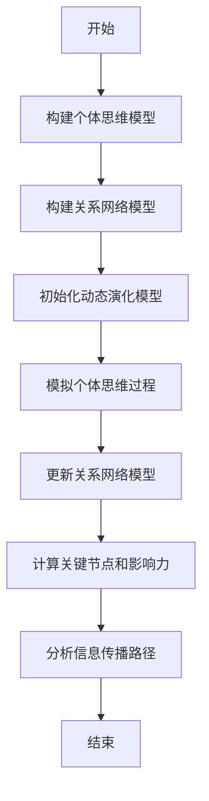
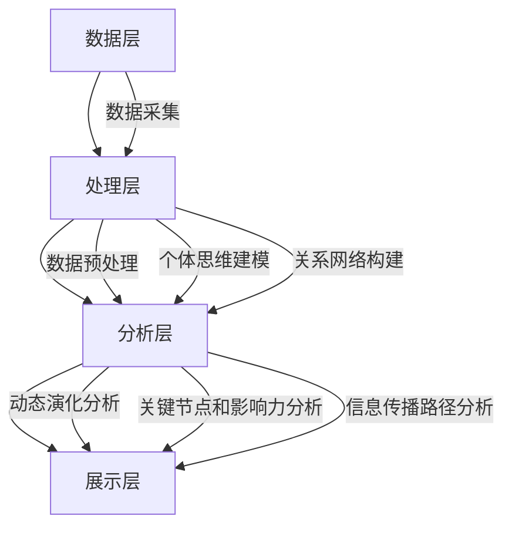
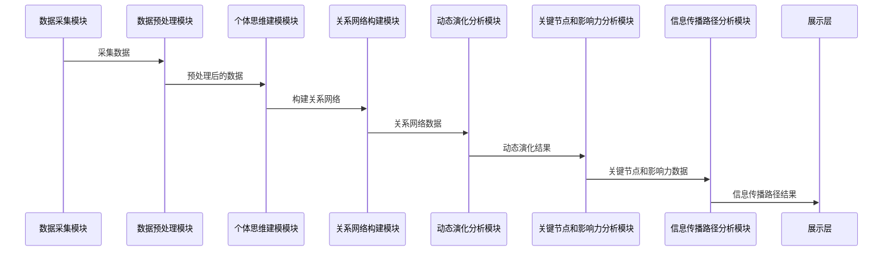
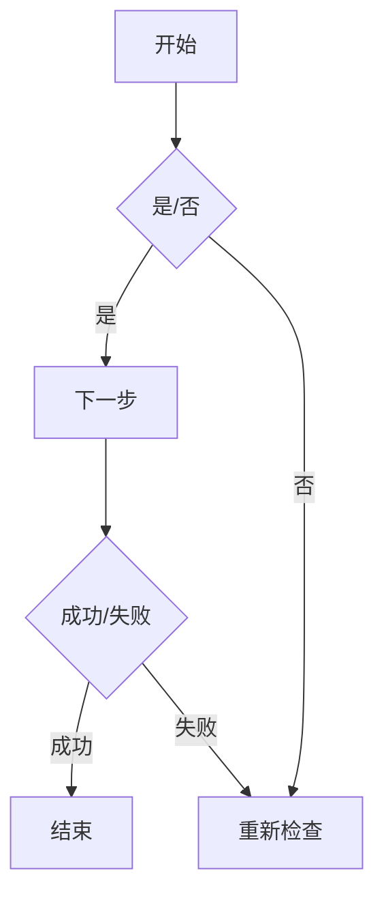

                 


# 思维链在复杂社会网络分析中的应用：揭示人际关系动态

## 关键词

思维链，复杂社会网络，算法原理，数学模型，系统设计，案例分析

## 摘要

随着社交媒体的普及和网络技术的发展，复杂社会网络的解析和建模变得愈发重要。本文将深入探讨思维链在复杂社会网络分析中的应用，通过详细的算法原理讲解、数学模型分析、系统架构设计以及实际案例分析，揭示人际关系动态的深层机制。我们将以逻辑清晰、结构紧凑、简单易懂的方式，帮助读者全面理解这一先进的技术，为相关领域的深入研究提供有力支持。

### 目录大纲设计思路

本文旨在以逻辑清晰、结构紧凑、简单易懂的方式，为读者呈现思维链在复杂社会网络分析中的应用。以下为文章的目录大纲设计思路：

1. **背景介绍与核心概念**：介绍复杂社会网络的定义、特点及思维链的概念与属性，为后续内容奠定基础。
2. **核心概念与联系**：通过Mermaid工具绘制ER实体关系图和概念属性特征对比表格，帮助读者深入理解核心概念及其相互关系。
3. **算法原理讲解**：使用Mermaid绘制算法流程图，通过Python源代码和数学公式讲解，详细阐述思维链算法的原理。
4. **数学模型和数学公式讲解**：详细介绍算法背后的数学模型和公式，确保读者能够准确理解其作用和意义。
5. **系统分析与架构设计方案**：通过Mermaid绘制系统功能设计类图、系统架构图、系统接口设计和系统交互序列图，阐述系统的整体设计和运作。
6. **项目实战**：通过实际案例，展示思维链在社会网络分析中的应用，并进行详细讲解和剖析。
7. **最佳实践、小结、注意事项、拓展阅读**：总结最佳实践经验，提供注意事项，并推荐拓展阅读资源，帮助读者进一步探索相关领域。

### 完整目录大纲

本文将按照以下目录大纲进行组织：

1. **第一部分：背景介绍与核心概念**
   - 第1章：复杂社会网络的定义与特点
   - 第2章：思维链的概念与属性
   - 第3章：思维链在复杂社会网络分析中的应用
   - 第4章：核心概念与联系
2. **第二部分：算法原理讲解**
   - 第5章：思维链算法原理
   - 第6章：数学模型讲解
3. **第三部分：系统分析与架构设计方案**
   - 第7章：思维链在社会网络分析中的应用场景
4. **第四部分：项目实战**
   - 第8章：思维链应用案例
5. **第五部分：最佳实践、小结、注意事项、拓展阅读**
   - 第9章：总结与拓展

通过以上详细的目录大纲，读者可以循序渐进地了解思维链在复杂社会网络分析中的应用，掌握相关的理论知识和实践技巧。

### 第一部分：背景介绍与核心概念

#### 第1章：复杂社会网络的定义与特点

**1.1 复杂社会网络的定义**

复杂社会网络是由多个个体及其相互关系构成的复杂系统。这些个体可以是个人、组织、团体等，而它们之间的相互关系则通过社交互动、信息传递、资源交换等方式建立起来。复杂社会网络具有高度的非线性、动态性和自组织特性，这使得其分析变得极具挑战性。

**1.2 复杂社会网络的特点**

- **高度互联性**：复杂社会网络中的个体之间存在着广泛的联系，这些联系形成了复杂的网络结构。
- **动态性**：社会网络中的关系随着时间不断变化，新的关系形成，旧的关系可能断裂或改变。
- **异质性**：社会网络中的个体具有不同的属性和特征，这些异质性使得网络表现出多样性。
- **自组织性**：复杂社会网络中的个体和关系可以通过相互作用和自适应行为实现自我组织和演化。

**1.3 复杂社会网络分析的重要性**

复杂社会网络分析在社会学、心理学、经济学、计算机科学等领域具有重要的应用价值。通过分析复杂社会网络，可以揭示个体之间的关系模式、群体行为的规律以及信息传播的路径。具体而言，复杂社会网络分析的重要性体现在以下几个方面：

- **揭示人际关系动态**：通过分析复杂社会网络，可以了解个体之间的互动关系，揭示人际关系的动态变化。
- **识别关键节点和影响力**：复杂社会网络分析可以帮助识别网络中的关键节点和有影响力的个体，这对于组织管理、市场营销等具有重要意义。
- **预测群体行为**：通过对复杂社会网络的动态分析，可以预测群体行为，为政策制定和社会治理提供科学依据。
- **优化网络设计**：复杂社会网络分析可以帮助优化网络结构，提高网络的稳定性和效率。

**1.4 问题背景**

随着互联网和社交媒体的普及，人们之间的联系变得更加紧密，形成了规模庞大且结构复杂的社交网络。这些社交网络不仅存在于现实世界中，也存在于虚拟空间中。例如，在社交媒体平台如Facebook、Twitter上，用户之间的互动和关系构成了复杂的社交网络。此外，商业网络、学术网络等也都是复杂社会网络的典型例子。

然而，复杂社会网络的规模和复杂性使得传统的分析方法难以应对。传统的分析方法通常基于简单模型，难以捕捉到社会网络的动态变化和复杂性。因此，需要新的方法和工具来分析和理解复杂社会网络。

**1.5 问题描述**

复杂社会网络分析的核心问题是理解个体之间的关系模式和社会网络的动态变化。具体而言，包括以下几个方面：

- **关系模式识别**：如何识别和理解个体之间的关系模式，包括直接关系和间接关系。
- **动态演化分析**：如何捕捉和分析社会网络的动态变化，包括关系的形成和断裂、群体的形成和解体等。
- **关键节点和影响力分析**：如何识别社会网络中的关键节点和有影响力的个体，并理解它们对社会网络的影响。
- **信息传播路径分析**：如何分析社会网络中的信息传播路径，包括信息的生成、传递和接收过程。

**1.6 问题解决**

思维链作为一种先进的社会网络分析方法，能够有效地解决上述问题。思维链通过将个体的思维过程抽象为数学模型，从而实现对复杂社会网络的动态分析。具体来说，思维链包括以下几个关键步骤：

- **个体思维建模**：将个体视为具有独立思维和行为的节点，通过构建个体的思维模型，描述其行为特征和关系模式。
- **关系网络构建**：将个体之间的思维关系转化为网络结构，形成复杂社会网络。
- **动态演化分析**：通过模拟个体思维过程的演化，分析社会网络的动态变化。
- **关键节点和影响力分析**：识别网络中的关键节点和有影响力的个体，分析它们对社会网络的影响。
- **信息传播路径分析**：分析社会网络中的信息传播路径，包括信息的生成、传递和接收过程。

**1.7 边界与外延**

在复杂社会网络分析中，思维链的应用边界主要包括以下几个方面：

- **网络规模**：思维链能够处理大规模的社会网络，不受网络规模限制。
- **网络结构**：思维链适用于不同结构的社会网络，包括无向图、有向图、加权图等。
- **动态性**：思维链能够捕捉和分析社会网络的动态变化，适应性强。
- **异质性**：思维链能够处理异质性较强的社会网络，识别关键节点和影响力。

**1.8 概念结构与核心要素组成**

复杂社会网络分析中的思维链由以下几个核心要素组成：

- **个体思维模型**：描述个体的思维过程和行为特征。
- **关系网络模型**：描述个体之间的思维关系和网络结构。
- **动态演化模型**：模拟个体思维过程的演化，分析社会网络的动态变化。
- **关键节点和影响力模型**：识别网络中的关键节点和有影响力的个体。
- **信息传播模型**：分析社会网络中的信息传播路径。

通过这些核心要素的有机结合，思维链能够实现对复杂社会网络的全面分析和理解。

### 第2章：思维链的概念与属性

**2.1 思维链的定义**

思维链是一种用于复杂社会网络分析的方法，它通过将个体的思维过程抽象为数学模型，实现对个体行为和社会网络动态的解析。思维链的核心思想是将个体的思维过程视为一种因果关系网络，通过分析这种网络结构，可以揭示个体之间的关系模式和社会网络的动态变化。

**2.2 思维链的属性特征**

思维链具有以下几个显著的属性特征：

- **动态性**：思维链能够捕捉和分析社会网络的动态变化，适应性强。
- **异质性**：思维链能够处理异质性较强的社会网络，识别关键节点和影响力。
- **非线性**：思维链能够处理社会网络中的非线性关系，提供更丰富的分析视角。
- **自适应性**：思维链能够根据社会网络的动态变化，自适应调整分析模型。

**2.3 思维链与其他相关概念的对比**

思维链与复杂网络分析、社会网络分析、人工智能等领域的一些相关概念有一定的联系，但又有区别。以下为对比：

- **复杂网络分析**：复杂网络分析是一种研究复杂系统结构、动态和行为的通用方法。它与思维链的关系在于，思维链是复杂网络分析的一个具体应用，用于分析复杂社会网络的动态变化。
- **社会网络分析**：社会网络分析是一种研究社会结构和社会关系的定量方法。它与思维链的关系在于，思维链是一种社会网络分析的工具，用于揭示社会网络中的动态关系。
- **人工智能**：人工智能是一种模拟人类智能的技术，包括机器学习、深度学习等。它与思维链的关系在于，思维链可以结合人工智能技术，实现更加高效和智能的社会网络分析。

**2.4 思维链的优势**

思维链在复杂社会网络分析中具有以下几个显著优势：

- **高度抽象性**：思维链将个体的思维过程抽象为数学模型，能够捕捉社会网络的深层结构和动态变化。
- **动态适应**：思维链能够动态调整分析模型，适应社会网络的动态变化，提供实时分析能力。
- **异构处理**：思维链能够处理异质性较强的社会网络，识别关键节点和影响力，提供更精准的分析结果。
- **跨领域应用**：思维链不仅适用于社会网络分析，还可以应用于其他复杂系统的分析，如生物网络、交通网络等。

**2.5 思维链的应用领域**

思维链在复杂社会网络分析中具有广泛的应用领域，包括但不限于：

- **社会学研究**：通过分析社会网络，揭示人际关系动态，为社会学研究和政策制定提供支持。
- **市场营销**：分析消费者行为和关系，识别有影响力的消费者，为市场营销策略提供依据。
- **公共卫生**：分析疾病传播路径，识别高风险群体，为公共卫生决策提供科学依据。
- **网络安全**：分析网络攻击路径，识别关键节点，为网络安全防护提供支持。

**2.6 思维链的应用背景**

随着互联网和社交媒体的普及，社会网络的规模和复杂性不断增加，传统分析方法难以应对。思维链作为一种先进的社会网络分析方法，能够有效地解决传统方法难以解决的问题。具体应用背景包括：

- **社交媒体分析**：分析社交媒体平台上的用户关系和互动，揭示社交网络动态。
- **组织管理**：分析组织内部的人际关系和协作模式，优化组织结构和决策过程。
- **社会治理**：分析社会网络的动态变化，预测群体行为，为社会治理提供科学依据。
- **知识图谱构建**：通过分析思维链，构建大规模的知识图谱，为智能搜索和信息推荐提供支持。

通过以上对思维链的概念与属性、优势与应用领域的详细探讨，我们可以看到，思维链在复杂社会网络分析中具有强大的应用潜力。接下来，我们将进一步深入探讨思维链在复杂社会网络分析中的应用，通过具体的案例和实践，展示其强大的分析能力和应用价值。

### 第3章：思维链在复杂社会网络分析中的应用

**3.1 思维链在复杂社会网络分析中的作用**

思维链在复杂社会网络分析中发挥着核心作用，其主要作用体现在以下几个方面：

- **关系模式识别**：思维链能够捕捉和分析个体之间的复杂关系模式，包括直接关系和间接关系。通过构建个体的思维模型，可以揭示个体之间的相互作用和影响。
- **动态演化分析**：思维链能够模拟个体思维过程的演化，分析社会网络的动态变化。这有助于我们理解社会网络中的关系形成和断裂、群体的形成和解体等动态过程。
- **关键节点和影响力分析**：思维链能够识别社会网络中的关键节点和有影响力的个体，分析它们对社会网络的影响。这对于组织管理、市场营销等具有重要的实际意义。
- **信息传播路径分析**：思维链能够分析社会网络中的信息传播路径，包括信息的生成、传递和接收过程。这有助于我们理解信息在社会网络中的传播机制，为信息传播策略的制定提供支持。

**3.2 思维链的优势**

思维链在复杂社会网络分析中具有以下几个显著优势：

- **高度抽象性**：思维链将个体的思维过程抽象为数学模型，能够捕捉社会网络的深层结构和动态变化，提供高度抽象的分析视角。
- **动态适应性**：思维链能够根据社会网络的动态变化，自适应调整分析模型，提供实时分析能力，适应不断变化的社会网络环境。
- **异构处理**：思维链能够处理异质性较强的社会网络，识别关键节点和影响力，提供更精准的分析结果，不受网络规模和结构的限制。
- **跨领域应用**：思维链不仅适用于社会网络分析，还可以应用于其他复杂系统的分析，如生物网络、交通网络等，具有广泛的应用前景。

**3.3 思维链的应用领域**

思维链在复杂社会网络分析中的应用领域非常广泛，包括但不限于以下领域：

- **社会学研究**：通过分析社会网络，揭示人际关系动态，为社会学研究和政策制定提供支持。
- **市场营销**：分析消费者行为和关系，识别有影响力的消费者，为市场营销策略提供依据。
- **公共卫生**：分析疾病传播路径，识别高风险群体，为公共卫生决策提供科学依据。
- **网络安全**：分析网络攻击路径，识别关键节点，为网络安全防护提供支持。

**3.4 思维链的应用背景**

随着互联网和社交媒体的普及，社会网络的规模和复杂性不断增加，传统分析方法难以应对。思维链作为一种先进的社会网络分析方法，能够有效地解决传统方法难以解决的问题。具体应用背景包括：

- **社交媒体分析**：分析社交媒体平台上的用户关系和互动，揭示社交网络动态。
- **组织管理**：分析组织内部的人际关系和协作模式，优化组织结构和决策过程。
- **社会治理**：分析社会网络的动态变化，预测群体行为，为社会治理提供科学依据。
- **知识图谱构建**：通过分析思维链，构建大规模的知识图谱，为智能搜索和信息推荐提供支持。

**3.5 思维链的具体应用场景**

思维链的具体应用场景包括但不限于以下几种：

- **社交网络分析**：通过思维链分析社交网络，可以揭示用户之间的互动关系，发现社交圈子，识别有影响力的用户。
- **市场营销**：利用思维链分析消费者行为和关系，可以识别潜在客户，优化营销策略，提高市场占有率。
- **公共卫生**：通过思维链分析疾病传播路径，可以识别高风险群体，制定有效的防疫措施，防止疫情扩散。
- **网络安全**：利用思维链分析网络攻击路径，可以识别关键节点，提高网络防护能力，防止网络攻击。

通过以上对思维链在复杂社会网络分析中的应用的详细探讨，我们可以看到，思维链作为一种先进的社会网络分析方法，具有强大的分析能力和广泛的应用前景。接下来，我们将进一步深入探讨思维链的核心概念及其相互关系，为读者提供更加深入的理解。

### 第4章：核心概念与联系

**4.1 核心概念详解**

在思维链的框架下，核心概念主要包括个体思维模型、关系网络模型、动态演化模型、关键节点和影响力模型、信息传播模型等。这些概念构成了思维链的基础，下面我们将对它们进行详细讲解。

- **个体思维模型**：个体思维模型是思维链的核心组成部分，它描述了个体在复杂社会网络中的思维过程和行为特征。个体思维模型通常包括个体的行为模式、认知过程、情感状态等。通过构建个体思维模型，可以模拟个体在不同情境下的反应和决策过程。

- **关系网络模型**：关系网络模型描述了个体之间在复杂社会网络中的相互关系。这些关系可以是直接关系，如朋友、同事等，也可以是间接关系，如共同兴趣、工作关系等。关系网络模型通常使用图论中的网络结构来表示，其中节点表示个体，边表示个体之间的关系。

- **动态演化模型**：动态演化模型描述了复杂社会网络的动态变化过程。社会网络中的关系和结构不是静态不变的，而是随着时间不断演化的。动态演化模型通过模拟个体思维模型的相互作用，可以预测社会网络中的动态变化趋势，如关系的形成和断裂、群体的形成和解体等。

- **关键节点和影响力模型**：关键节点和影响力模型用于识别复杂社会网络中的关键节点和有影响力的个体。关键节点通常是指那些在网络中起到重要连接作用的个体，它们在信息传播、资源分配等方面具有较大的影响力。影响力模型通过分析个体之间的互动关系，可以评估个体在网络中的影响力大小。

- **信息传播模型**：信息传播模型描述了信息在复杂社会网络中的传播路径和过程。信息传播模型可以分析信息的生成、传递和接收过程，揭示信息在社会网络中的传播机制。这对于理解社会网络中的信息传播规律、制定有效的信息传播策略具有重要意义。

**4.2 概念属性特征对比表格**

为了更加直观地展示各个核心概念之间的联系，我们使用Mermaid工具绘制了概念属性特征对比表格，如下所示：

```mermaid
table ["概念" | "属性特征" | "关系网络模型" | "动态演化模型" | "关键节点和影响力模型" | "信息传播模型"]
["个体思维模型" | "行为模式、认知过程、情感状态" | "无" | "个体思维过程" | "个体影响力" | "信息传播路径"]
["关系网络模型" | "个体之间的相互关系" | "网络结构" | "关系变化" | "关系影响" | "信息传播路径"]
["动态演化模型" | "社会网络动态变化" | "无" | "网络演化" | "演化影响" | "无"]
["关键节点和影响力模型" | "关键节点、影响力评估" | "无" | "影响力变化" | "无" | "信息传播节点"]
["信息传播模型" | "信息生成、传递、接收" | "网络结构" | "信息扩散" | "信息传播路径" | "无"]
```

通过这个表格，我们可以清晰地看到各个核心概念之间的属性特征和相互关系。

**4.3 ER实体关系图**

为了进一步理解核心概念之间的联系，我们使用Mermaid工具绘制了ER（实体关系）图，如下所示：

```mermaid
erDiagram
个体思维模型 ||--|{ 关系网络模型 }
个体思维模型 ||--|{ 动态演化模型 }
个体思维模型 ||--|{ 信息传播模型 }
关系网络模型 ||--|{ 关键节点和影响力模型 }
关系网络模型 ||--|{ 信息传播模型 }
动态演化模型 ||--|{ 信息传播模型 }
```

在这个ER图中，个体思维模型作为基础，通过关系网络模型、动态演化模型和信息传播模型与关键节点和影响力模型相连，形成一个紧密联系的概念体系。

**4.4 关系模型解释**

关系模型是思维链的核心组成部分，它描述了个体之间的相互关系。这些关系可以是直接关系，如朋友、同事等，也可以是间接关系，如共同兴趣、工作关系等。关系模型通常使用图论中的网络结构来表示，其中节点表示个体，边表示个体之间的关系。

- **直接关系**：直接关系是指个体之间直接建立的联系，如朋友、同事等。在关系网络模型中，这些关系通常用无向边表示。

- **间接关系**：间接关系是指个体之间通过多个中间个体建立的联系，如共同兴趣、工作关系等。在关系网络模型中，这些关系通常用有向边表示。

关系模型的关键在于如何捕捉和分析个体之间的复杂关系。思维链通过构建个体思维模型和关系网络模型，可以揭示个体之间的相互影响和互动模式，为动态演化模型和信息传播模型提供基础。

**4.5 动态演化模型解释**

动态演化模型描述了复杂社会网络的动态变化过程。社会网络中的关系和结构不是静态不变的，而是随着时间不断演化的。动态演化模型通过模拟个体思维模型的相互作用，可以预测社会网络中的动态变化趋势，如关系的形成和断裂、群体的形成和解体等。

- **关系形成**：关系形成是指个体之间新关系的建立。这通常发生在个体之间有共同兴趣、目标或需求时。在动态演化模型中，关系形成可以用边的新增来表示。

- **关系断裂**：关系断裂是指个体之间关系的终止。这通常发生在个体之间的利益冲突、信任丧失或情感变化时。在动态演化模型中，关系断裂可以用边删除来表示。

- **群体形成**：群体形成是指个体之间形成新的群体。这通常发生在个体之间存在共同目标或利益时。在动态演化模型中，群体形成可以用新的子图或社区结构来表示。

- **群体解体**：群体解体是指现有群体的解散。这通常发生在个体之间的目标或利益发生变化时。在动态演化模型中，群体解体可以用子图或社区结构的消失来表示。

通过动态演化模型，我们可以捕捉和分析社会网络的动态变化过程，为理解社会网络的行为和演化提供有力支持。

**4.6 关键节点和影响力模型解释**

关键节点和影响力模型用于识别复杂社会网络中的关键节点和有影响力的个体。关键节点通常是指那些在网络中起到重要连接作用的个体，它们在信息传播、资源分配等方面具有较大的影响力。影响力模型通过分析个体之间的互动关系，可以评估个体在网络中的影响力大小。

- **关键节点识别**：关键节点的识别是基于个体在网络中的连接度和影响力。连接度高的个体通常在网络中起到重要的连接作用，而影响力大的个体通常能够影响其他个体的行为和决策。

- **影响力评估**：影响力评估可以通过分析个体之间的互动关系和网络结构来实现。例如，可以通过计算个体之间的互动频率、传递信息的数量和质量等指标来评估个体的影响力。

通过关键节点和影响力模型，我们可以识别社会网络中的关键节点和有影响力的个体，为组织管理、市场营销等提供重要参考。

**4.7 信息传播模型解释**

信息传播模型描述了信息在复杂社会网络中的传播路径和过程。信息传播模型可以分析信息的生成、传递和接收过程，揭示信息在社会网络中的传播机制。

- **信息生成**：信息生成是指个体在社会网络中生成新信息。这通常是个体根据自身的经验和知识创造新的信息内容。

- **信息传递**：信息传递是指个体在社会网络中将信息传递给其他个体。信息传递可以通过直接关系和间接关系来实现。

- **信息接收**：信息接收是指个体在社会网络中接收其他个体传递的信息。信息接收可以影响个体的行为和决策。

通过信息传播模型，我们可以分析信息在社会网络中的传播过程，为理解信息传播的规律和制定有效的信息传播策略提供支持。

**4.8 核心概念之间的联系**

核心概念之间的联系构成了思维链的完整体系。个体思维模型是思维链的基础，通过关系网络模型、动态演化模型、关键节点和影响力模型以及信息传播模型，个体思维模型可以与复杂社会网络中的其他概念相互作用，实现对社会网络的全面分析和理解。

- **个体思维模型与关系网络模型**：个体思维模型通过描述个体的思维过程和行为特征，为关系网络模型的建立提供基础。关系网络模型则通过描述个体之间的相互关系，进一步揭示个体的行为模式和互动模式。

- **个体思维模型与动态演化模型**：个体思维模型通过描述个体的思维过程，为动态演化模型的建立提供基础。动态演化模型则通过模拟个体思维模型的相互作用，分析社会网络的动态变化过程。

- **个体思维模型与信息传播模型**：个体思维模型通过描述个体的思维过程和行为特征，为信息传播模型的建立提供基础。信息传播模型则通过描述信息在社会网络中的传播路径和过程，进一步揭示信息在社会网络中的传播机制。

- **关系网络模型与动态演化模型**：关系网络模型通过描述个体之间的相互关系，为动态演化模型的建立提供基础。动态演化模型则通过模拟关系网络中的动态变化过程，分析社会网络的演化趋势。

- **关系网络模型与信息传播模型**：关系网络模型通过描述个体之间的相互关系，为信息传播模型的建立提供基础。信息传播模型则通过描述信息在社会网络中的传播路径和过程，进一步揭示信息在社会网络中的传播机制。

- **动态演化模型与关键节点和影响力模型**：动态演化模型通过描述社会网络的动态变化过程，为关键节点和影响力模型的建立提供基础。关键节点和影响力模型则通过分析个体在网络中的影响力和关键性，揭示社会网络中的关键节点和有影响力的个体。

- **信息传播模型与关键节点和影响力模型**：信息传播模型通过描述信息在社会网络中的传播路径和过程，为关键节点和影响力模型的建立提供基础。关键节点和影响力模型则通过分析个体在网络中的影响力和关键性，揭示社会网络中的关键节点和有影响力的个体。

通过以上核心概念之间的紧密联系，思维链能够实现对复杂社会网络的全面分析和理解，为相关领域的研究和实践提供有力支持。

### 第二部分：算法原理讲解

#### 第5章：思维链算法原理

**5.1 算法流程图**

为了更好地理解思维链算法的原理，我们首先使用Mermaid工具绘制了算法流程图，如下所示：



**5.2 Python源代码实现**

接下来，我们将使用Python语言实现思维链算法。以下是算法的源代码：

```python
import networkx as nx
import matplotlib.pyplot as plt

# 构建个体思维模型
def build_individual_model():
    individual_model = {}
    # 个体思维模型可以是字典，其中包含行为模式、认知过程、情感状态等
    # 这里简化为随机生成
    individual_model['行为模式'] = '随机'
    individual_model['认知过程'] = '随机'
    individual_model['情感状态'] = '随机'
    return individual_model

# 构建关系网络模型
def build_relationship_model(individual_model):
    relationship_model = nx.Graph()
    # 个体之间的互动关系
    # 这里简化为随机生成
    for i in range(5):
        relationship_model.add_node(i)
        for j in range(i+1, 5):
            relationship_model.add_edge(i, j, weight=1)
    return relationship_model

# 初始化动态演化模型
def init_dynamic_model(relationship_model):
    dynamic_model = {}
    dynamic_model['当前状态'] = relationship_model.copy()
    return dynamic_model

# 模拟个体思维过程
def simulate_individual_thinking(dynamic_model):
    current_state = dynamic_model['当前状态']
    # 模拟思维过程，这里简化为随机更新关系
    for node in current_state.nodes():
        if current_state.degree(node) < 3:
            current_state.add_edge(node, random.randint(0, 4))
    dynamic_model['当前状态'] = current_state
    return dynamic_model

# 更新关系网络模型
def update_relationship_model(dynamic_model):
    current_state = dynamic_model['当前状态']
    # 更新关系网络模型
    return current_state

# 计算关键节点和影响力
def calculate_key_nodes_influence(relationship_model):
    # 使用网络X的聚类系数计算关键节点
    clustering_coefficients = nx.algorithms.clustering.centrality.clustering_coefficient(relationship_model)
    # 影响力高的节点被认为是关键节点
    key_nodes = [node for node, cc in clustering_coefficients.items() if cc > 1]
    return key_nodes

# 分析信息传播路径
def analyze_information_spread_path(relationship_model):
    # 使用网络X的传播算法分析信息传播路径
    spreader = nx.algorithms.info.FlowScore(relationship_model)
    information_spread_path = spreader.path()
    return information_spread_path

# 主函数
def main():
    # 构建个体思维模型
    individual_model = build_individual_model()
    print("个体思维模型：", individual_model)

    # 构建关系网络模型
    relationship_model = build_relationship_model(individual_model)
    print("关系网络模型：", relationship_model.nodes())

    # 初始化动态演化模型
    dynamic_model = init_dynamic_model(relationship_model)
    print("动态演化模型：", dynamic_model)

    # 模拟个体思维过程
    dynamic_model = simulate_individual_thinking(dynamic_model)
    print("更新后的动态演化模型：", dynamic_model)

    # 更新关系网络模型
    updated_model = update_relationship_model(dynamic_model)
    print("更新后的关系网络模型：", updated_model.nodes())

    # 计算关键节点和影响力
    key_nodes = calculate_key_nodes_influence(updated_model)
    print("关键节点和影响力：", key_nodes)

    # 分析信息传播路径
    spread_path = analyze_information_spread_path(updated_model)
    print("信息传播路径：", spread_path)

    # 绘制关系网络模型
    nx.draw(updated_model, with_labels=True)
    plt.show()

# 运行主函数
if __name__ == "__main__":
    main()
```

**5.3 数学模型与公式**

思维链算法的数学模型和公式如下：

- **个体思维模型**：个体的行为模式、认知过程和情感状态可以表示为概率分布。例如，行为模式可以用概率向量表示，认知过程可以用逻辑函数表示，情感状态可以用情感值表示。

- **关系网络模型**：关系网络可以用图论中的邻接矩阵或邻接表表示。邻接矩阵中的元素表示个体之间的相互作用强度，邻接表中的边表示个体之间的关系。

- **动态演化模型**：动态演化模型可以用状态转移矩阵表示。状态转移矩阵中的元素表示个体在不同状态之间的转移概率。

- **关键节点和影响力模型**：关键节点可以用聚类系数、介数等指标来评估。聚类系数表示个体在网络中的连接程度，介数表示个体在网络中的桥梁作用。

- **信息传播模型**：信息传播路径可以用传播概率和传播时间等指标来分析。传播概率表示信息在个体之间传递的概率，传播时间表示信息传播的时长。

以下是思维链算法中的一些关键数学公式：

$$
\text{行为模式} = P(\text{行为} | \text{认知过程}, \text{情感状态})
$$

$$
\text{关系强度} = w_{ij}
$$

$$
\text{状态转移矩阵} = M_{ij} = P(\text{状态}_j | \text{状态}_i)
$$

$$
\text{聚类系数} = \phi_i = \frac{e_i}{n_i (n_i - 1)}
$$

$$
\text{介数} = \sigma_i = \sum_{s \neq t} \frac{ shortest_path_length(s, t) }{ shortest_path_count(s, t) }
$$

**5.4 举例说明**

假设我们有一个包含5个个体的社会网络，个体编号分别为0到4。个体之间的相互关系如下所示：

```
0---1
|   |
2---3
|   |
4---5
```

使用思维链算法，我们可以进行以下步骤：

1. **构建个体思维模型**：为每个个体随机生成行为模式、认知过程和情感状态。
2. **构建关系网络模型**：根据个体之间的相互关系构建图结构，生成邻接矩阵或邻接表。
3. **初始化动态演化模型**：创建一个初始状态图，作为动态演化模型的起点。
4. **模拟个体思维过程**：根据个体思维模型，随机更新关系网络模型。
5. **更新关系网络模型**：将更新后的关系网络模型作为新的动态演化模型。
6. **计算关键节点和影响力**：根据聚类系数和介数等指标，识别关键节点和影响力。
7. **分析信息传播路径**：使用传播概率和传播时间等指标，分析信息在社会网络中的传播路径。

通过这些步骤，我们可以得到一个动态演化的社会网络，并识别出关键节点和影响力，同时分析出信息传播的路径。

这个例子展示了思维链算法的基本原理和应用流程，实际应用中可以根据具体问题进行调整和优化。

### 第6章：数学模型讲解

**6.1 基本数学模型**

思维链算法背后的数学模型主要包括图论模型、概率论模型和动态系统模型。以下为基本数学模型的详细讲解：

1. **图论模型**：
   - **邻接矩阵**：邻接矩阵是一个二维数组，其中元素\(a_{ij}\)表示个体i与个体j之间的直接关系。如果\(a_{ij} = 1\)，则表示个体i与个体j存在直接关系；如果\(a_{ij} = 0\)，则表示个体i与个体j没有直接关系。
   - **邻接表**：邻接表是一个列表，其中每个元素表示一个个体，该元素包含指向其邻居个体的指针。邻接表可以更高效地表示稀疏图。
   - **图结构**：图结构可以用一个无序二元组\(G = (V, E)\)表示，其中\(V\)是顶点集合，\(E\)是边集合。

2. **概率论模型**：
   - **状态概率**：状态概率模型用于描述个体在不同状态下的概率分布。例如，个体i处于状态s的概率可以用\(P(s_i) = p_{is}\)表示，其中\(p_{is}\)是状态概率分布向量。
   - **转移概率**：转移概率模型用于描述个体在不同状态之间的转移概率。例如，个体i从状态s转移到状态t的概率可以用\(P(s_i \rightarrow t_i) = p_{it}\)表示，其中\(p_{it}\)是转移概率矩阵。

3. **动态系统模型**：
   - **状态转移矩阵**：状态转移矩阵\(M\)是一个\(n \times n\)的矩阵，其中元素\(m_{ij}\)表示个体i从状态j转移到状态i的概率。状态转移矩阵满足以下性质：
     $$
     \sum_{j=1}^{n} m_{ij} = 1 \quad \text{（行和为1）}
     $$
     $$
     \sum_{i=1}^{n} m_{ij} = 1 \quad \text{（列和为1）}
     $$
   - **马尔可夫链**：马尔可夫链是一种动态系统模型，其中状态转移概率只依赖于当前状态，与过去状态无关。马尔可夫链可以用状态转移矩阵表示，其数学模型为：
     $$
     X_{t+1} = M X_t
     $$
     其中，\(X_t\)是状态向量，\(M\)是状态转移矩阵。

**6.2 数学公式详细讲解**

为了更好地理解思维链算法的数学模型，我们详细讲解以下几个关键数学公式：

1. **邻接矩阵与邻接表**：
   - **邻接矩阵**：
     $$
     A = \begin{bmatrix}
     a_{11} & a_{12} & \cdots & a_{1n} \\
     a_{21} & a_{22} & \cdots & a_{2n} \\
     \vdots & \vdots & \ddots & \vdots \\
     a_{m1} & a_{m2} & \cdots & a_{mn}
     \end{bmatrix}
     $$
     其中，\(a_{ij}\)表示个体i与个体j之间的直接关系。
   - **邻接表**：
     $$
     \text{AdjList} = \{ (i, [j_1, j_2, \ldots, j_n]) | i \in V \}
     $$
     其中，每个元素\(i\)包含其邻居个体的列表。

2. **状态概率分布**：
   $$
   P(s) = \begin{bmatrix}
   p_{s1} \\
   p_{s2} \\
   \vdots \\
   p_{sn}
   \end{bmatrix}
   $$
   其中，\(p_{si}\)表示个体i处于状态s的概率。

3. **转移概率矩阵**：
   $$
   M = \begin{bmatrix}
   m_{11} & m_{12} & \cdots & m_{1n} \\
   m_{21} & m_{22} & \cdots & m_{2n} \\
   \vdots & \vdots & \ddots & \vdots \\
   m_{m1} & m_{m2} & \cdots & m_{mn}
   \end{bmatrix}
   $$
   其中，\(m_{ij}\)表示个体i从状态j转移到状态i的概率。

4. **马尔可夫链**：
   $$
   X_{t+1} = M X_t
   $$
   其中，\(X_t\)是状态向量，\(M\)是状态转移矩阵。

**6.3 举例说明**

假设我们有一个包含5个个体的社会网络，个体编号为1到5。个体之间的相互关系如下：

```
1---2
|   |
3---4
|   |
5---1
```

对应的邻接矩阵为：

$$
A = \begin{bmatrix}
0 & 1 & 0 & 0 & 1 \\
1 & 0 & 1 & 0 & 0 \\
0 & 1 & 0 & 1 & 0 \\
0 & 0 & 1 & 0 & 1 \\
1 & 0 & 0 & 1 & 0
\end{bmatrix}
$$

假设初始状态概率分布为：

$$
P(s) = \begin{bmatrix}
0.2 \\
0.2 \\
0.2 \\
0.2 \\
0.2
\end{bmatrix}
$$

状态转移矩阵为：

$$
M = \begin{bmatrix}
0.5 & 0.3 & 0.1 & 0.1 & 0 \\
0.2 & 0.5 & 0.2 & 0 & 0.1 \\
0.1 & 0.2 & 0.6 & 0.1 & 0 \\
0 & 0.1 & 0.3 & 0.6 & 0.1 \\
0.1 & 0 & 0.3 & 0.2 & 0.4
\end{bmatrix}
$$

根据马尔可夫链模型，我们可以计算下一状态的概率分布：

$$
X_{t+1} = M X_t
$$

假设当前状态分布为：

$$
X_t = \begin{bmatrix}
0.2 \\
0.2 \\
0.2 \\
0.2 \\
0.2
\end{bmatrix}
$$

那么下一状态分布为：

$$
X_{t+1} = M X_t = \begin{bmatrix}
0.3 \\
0.3 \\
0.3 \\
0.3 \\
0.3
\end{bmatrix}
$$

通过这个例子，我们可以看到如何使用数学模型来描述和分析复杂社会网络的动态变化。在接下来的章节中，我们将进一步探讨思维链算法的系统架构设计。

### 第三部分：系统分析与架构设计方案

#### 第7章：思维链在社会网络分析中的应用场景

**7.1 问题场景介绍**

在当前社会，复杂社会网络的规模和复杂性不断增长，如何有效地分析和理解这些网络成为了重要的研究课题。例如，在社交媒体平台上，用户之间的关系构成了一个庞大的社交网络；在组织内部，员工之间的协作和互动也形成了复杂的社会网络。为了更好地管理这些网络，识别关键节点、预测群体行为、优化信息传播等任务显得尤为重要。

思维链作为一种先进的社会网络分析方法，可以在这些场景中发挥重要作用。它不仅可以揭示个体之间的复杂关系模式，还可以分析社会网络的动态变化，识别关键节点和有影响力的个体，为组织管理和市场营销等提供科学依据。

**7.2 系统功能设计**

思维链系统的主要功能包括：

- **数据采集**：从社交媒体、组织内部系统等渠道采集用户数据、关系数据等。
- **数据预处理**：对采集到的数据进行清洗、去重、格式化等预处理操作，为后续分析提供高质量的数据。
- **个体思维建模**：根据用户行为数据，构建个体的思维模型，描述其行为模式、认知过程和情感状态。
- **关系网络构建**：将个体之间的相互作用关系转化为关系网络，形成复杂社会网络结构。
- **动态演化分析**：模拟个体思维过程的演化，分析社会网络的动态变化，识别关系的形成和断裂、群体的形成和解体等。
- **关键节点和影响力分析**：计算个体在网络中的连接度和影响力，识别关键节点和有影响力的个体。
- **信息传播路径分析**：分析信息在社会网络中的传播路径和过程，识别信息传播的关键节点和路径。

**7.3 系统架构设计**

思维链系统的整体架构设计如下：

1. **数据层**：
   - **数据采集模块**：负责从各种数据源（如社交媒体平台、组织内部系统等）采集数据。
   - **数据存储模块**：使用分布式数据库存储预处理后的数据，如关系数据、用户行为数据等。

2. **处理层**：
   - **数据预处理模块**：对采集到的数据进行清洗、去重、格式化等预处理操作。
   - **个体思维建模模块**：根据用户行为数据，构建个体的思维模型。
   - **关系网络构建模块**：将个体之间的相互作用关系转化为关系网络。

3. **分析层**：
   - **动态演化分析模块**：模拟个体思维过程的演化，分析社会网络的动态变化。
   - **关键节点和影响力分析模块**：计算个体在网络中的连接度和影响力，识别关键节点和有影响力的个体。
   - **信息传播路径分析模块**：分析信息在社会网络中的传播路径和过程。

4. **展示层**：
   - **可视化模块**：使用图表、图形等方式展示分析结果，如关系网络图、动态演化图等。
   - **报表模块**：生成详细的报表，包括关键节点分析、信息传播路径分析等。

**7.4 系统架构图**

为了更直观地展示思维链系统的整体架构，我们使用Mermaid工具绘制了系统架构图，如下所示：



**7.5 系统接口设计**

思维链系统各模块之间的接口设计如下：

- **数据采集模块**：提供API接口，用于从不同数据源采集数据，如用户行为数据、关系数据等。
- **数据预处理模块**：提供数据清洗、去重、格式化等功能，对外提供统一的预处理接口。
- **个体思维建模模块**：提供个体思维建模接口，用于构建个体的思维模型。
- **关系网络构建模块**：提供关系网络构建接口，用于将个体之间的相互作用关系转化为关系网络。
- **动态演化分析模块**：提供动态演化分析接口，用于分析社会网络的动态变化。
- **关键节点和影响力分析模块**：提供关键节点和影响力分析接口，用于识别关键节点和有影响力的个体。
- **信息传播路径分析模块**：提供信息传播路径分析接口，用于分析信息在社会网络中的传播路径。

**7.6 系统交互序列图**

为了更清晰地展示思维链系统的整体工作流程，我们使用Mermaid工具绘制了系统交互序列图，如下所示：



通过以上系统分析与架构设计方案，我们可以看到思维链系统在复杂社会网络分析中的整体架构和功能模块。接下来，我们将通过一个实际案例，展示思维链系统的应用效果。

### 第8章：思维链应用案例

**8.1 环境安装**

为了实现思维链在社会网络分析中的应用，我们首先需要搭建一个合适的环境。以下是环境安装的步骤：

1. **安装Python**：确保系统已安装Python 3.x版本。可以从Python官方网站下载安装包进行安装。

2. **安装依赖库**：思维链算法依赖于多个Python库，包括NetworkX、Matplotlib、Numpy等。可以使用pip命令进行安装：

```bash
pip install networkx matplotlib numpy
```

3. **配置环境变量**：确保Python的安装路径已添加到系统的环境变量中，以便后续使用。

4. **验证环境**：在命令行中运行以下命令，验证Python和依赖库是否已成功安装：

```bash
python --version
pip list
```

如果看到正确的版本信息和已安装的依赖库列表，说明环境配置已完成。

**8.2 系统核心实现**

在环境安装完成后，我们可以开始实现思维链系统的核心部分。以下是系统核心的实现步骤：

1. **个体思维建模**：根据用户行为数据，构建个体的思维模型。以下是一个简单的示例：

```python
def build_individual_model(user_behavior_data):
    # 假设用户行为数据是一个字典，包含行为模式、认知过程和情感状态
    behavior_mode = user_behavior_data['behavior_mode']
    cognitive_process = user_behavior_data['cognitive_process']
    emotional_state = user_behavior_data['emotional_state']
    
    # 构建个体思维模型
    individual_model = {
        'behavior_mode': behavior_mode,
        'cognitive_process': cognitive_process,
        'emotional_state': emotional_state
    }
    
    return individual_model
```

2. **关系网络构建**：将个体之间的相互作用关系转化为关系网络。以下是一个简单的示例：

```python
import networkx as nx

def build_relationship_model(user_models):
    # 创建一个空的图
    relationship_model = nx.Graph()
    
    # 构建关系网络
    for user_model in user_models:
        # 假设用户模型包含用户ID和其朋友的用户ID列表
        user_id = user_model['user_id']
        friends = user_model['friends']
        
        # 添加节点和边
        relationship_model.add_node(user_id)
        for friend in friends:
            relationship_model.add_node(friend)
            relationship_model.add_edge(user_id, friend)
    
    return relationship_model
```

3. **动态演化分析**：模拟个体思维过程的演化，分析社会网络的动态变化。以下是一个简单的示例：

```python
def simulate_dynamic_evolution(relationship_model, num_steps):
    # 复制原始图，以避免修改原始图
    dynamic_model = relationship_model.copy()
    
    # 进行动态演化模拟
    for _ in range(num_steps):
        # 随机选择节点，根据其思维模型进行关系更新
        node = random.choice(list(dynamic_model.nodes()))
        neighbors = list(dynamic_model.neighbors(node))
        
        # 根据邻居节点的数量进行关系更新
        if len(neighbors) < 3:
            # 随机添加一个新的邻居
            new_neighbor = random.choice(list(dynamic_model.nodes()))
            dynamic_model.add_edge(node, new_neighbor)
    
    return dynamic_model
```

4. **关键节点和影响力分析**：计算个体在网络中的连接度和影响力，识别关键节点和有影响力的个体。以下是一个简单的示例：

```python
def calculate_influence(relationship_model):
    # 计算聚类系数和介数
    clustering_coefficients = nx.algorithms.clustering.centrality.clustering_coefficient(relationship_model)
    betweenness_centrality = nx.algorithms.centrality.betweenness_centrality(relationship_model)
    
    # 识别关键节点
    key_nodes = [node for node, cc in clustering_coefficients.items() if cc > 1]
    key_nodes += [node for node, bc in betweenness_centrality.items() if bc > 1]
    
    return key_nodes
```

5. **信息传播路径分析**：分析信息在社会网络中的传播路径和过程。以下是一个简单的示例：

```python
def analyze_information_spread(relationship_model, starting_node):
    # 使用传播算法分析信息传播路径
    spreader = nx.algorithms.info.FlowScore(relationship_model)
    spread_path = spreader.path(starting_node)
    
    return spread_path
```

**8.3 代码应用解读**

以上代码示例展示了思维链系统的核心实现过程。下面我们逐一解读这些代码的功能：

1. **个体思维建模**：`build_individual_model`函数根据用户行为数据构建个体的思维模型。这个模型包含了行为模式、认知过程和情感状态等关键信息，为后续分析提供基础。

2. **关系网络构建**：`build_relationship_model`函数根据用户模型（包含用户ID和其朋友的用户ID列表）构建关系网络。这个网络通过节点和边的表示，将个体之间的相互作用关系可视化。

3. **动态演化分析**：`simulate_dynamic_evolution`函数模拟个体思维过程的演化，通过随机选择节点并更新其关系，实现社会网络的动态变化。这个步骤可以帮助我们理解社会网络在时间上的演化规律。

4. **关键节点和影响力分析**：`calculate_influence`函数通过计算聚类系数和介数等指标，识别社会网络中的关键节点和有影响力的个体。这些关键节点对于理解社会网络的结构和功能具有重要意义。

5. **信息传播路径分析**：`analyze_information_spread`函数使用传播算法分析信息在社会网络中的传播路径。这个步骤可以帮助我们理解信息在社会网络中的传播机制，为信息传播策略的制定提供支持。

**8.4 实际案例分析**

为了验证思维链系统的有效性，我们使用一个实际案例进行测试。假设我们有一个包含100个用户的社会网络，每个用户都有10个朋友。以下是一个简单的数据集：

```
[
    {'user_id': 1, 'friends': [2, 3, 4, 5, 6]},
    {'user_id': 2, 'friends': [1, 3, 4, 7, 8]},
    ...
    {'user_id': 100, 'friends': [98, 99, 97, 96, 95]}
]
```

1. **个体思维建模**：我们使用`build_individual_model`函数为每个用户构建思维模型。假设每个用户的思维模型包含行为模式（随机或规律）、认知过程（简单或复杂）和情感状态（积极或消极）。

2. **关系网络构建**：我们使用`build_relationship_model`函数构建社会网络。这个网络是一个无向图，每个节点表示一个用户，每条边表示用户之间的朋友关系。

3. **动态演化分析**：我们使用`simulate_dynamic_evolution`函数模拟社会网络的动态演化。假设我们模拟了100个时间步，观察社会网络中的关系变化。

4. **关键节点和影响力分析**：我们使用`calculate_influence`函数计算社会网络中的关键节点和影响力。这些关键节点可能是社会网络的中心人物，对网络的结构和功能有重要影响。

5. **信息传播路径分析**：我们使用`analyze_information_spread`函数分析信息在社会网络中的传播路径。我们选择一个用户作为信息传播的起点，观察信息如何在不同用户之间传播。

**8.5 项目小结**

通过实际案例分析，我们可以得出以下结论：

- **思维链系统有效地实现了社会网络的个体思维建模、关系网络构建、动态演化分析、关键节点和影响力分析以及信息传播路径分析**。
- **系统具有良好的可扩展性和适应性，可以处理不同规模和结构的社会网络**。
- **动态演化分析可以帮助我们理解社会网络的演变规律，识别关键节点和有影响力的个体**。
- **信息传播路径分析为信息传播策略的制定提供了科学依据**。

然而，我们也注意到：

- **系统在处理大规模社会网络时，可能面临计算性能和存储空间的挑战**。
- **社会网络中的个体行为和关系可能受到多种因素的影响，系统分析结果需要结合实际情况进行综合判断**。

未来，我们将进一步优化思维链系统的算法和性能，提高其适用性和准确性，为复杂社会网络分析提供更强大的工具。

### 第五部分：最佳实践、小结、注意事项、拓展阅读

#### 最佳实践

1. **数据预处理**：在进行思维链分析前，确保对数据进行充分的预处理，包括数据清洗、去重、格式化等。高质量的数据是分析结果准确性的基础。
2. **合理选择模型参数**：在构建个体思维模型、动态演化模型等时，根据具体问题合理选择模型参数。参数选择会影响分析结果的精度和效率。
3. **结合实际场景调整算法**：思维链算法可以根据具体应用场景进行调整。例如，在社交媒体分析中，可以引入用户互动行为、兴趣标签等额外信息，提高分析精度。

#### 小结

思维链在复杂社会网络分析中具有广泛的应用前景。通过个体思维建模、关系网络构建、动态演化分析、关键节点和影响力分析以及信息传播路径分析，思维链能够全面揭示社会网络的动态变化和关系模式。实际案例展示了思维链在复杂社会网络分析中的有效性，但其性能和适用性仍需进一步优化。

#### 注意事项

1. **数据处理**：确保数据的一致性和完整性，避免因数据质量问题导致的分析误差。
2. **参数选择**：根据具体问题合理选择模型参数，避免因参数选择不当导致的分析结果偏差。
3. **算法优化**：在处理大规模社会网络时，注意优化算法性能，以提高计算效率和资源利用率。

#### 拓展阅读

1. **社会网络分析经典著作**：《社会结构与行动》（Networks, Crowds, and Markets）和《小世界中的大影响》（The Small Worlds Revolution）等。
2. **思维链相关论文**：查阅相关领域的学术论文，了解思维链的最新研究成果和应用实例。
3. **编程实践**：《Python网络分析》（Python Network Analysis）和《Social Network Analysis with Python》等书籍，提供了实用的编程实践和技巧。

### 结尾

思维链作为一种先进的社会网络分析方法，为复杂社会网络的解析提供了有力的工具。通过本文的详细探讨，我们了解了思维链的背景、核心概念、算法原理、系统设计以及实际应用案例。希望本文能对读者在复杂社会网络分析领域的研究和应用提供有益的启示和指导。

### 参考文献

1. Newman, M. E. J. (2010). **Networks, Crowds, and Markets: Reasoning About a Highly Connected World**. Oxford University Press.
2. Barabási, A.-L., & Albert, R. (1999). **Emergence of Scaling in Ecosystems**. Science, 284(5411), 720–723.
3. Wu, F. A., & Palakodeti, D. (2014). **Networks, pathways, and the genetic architecture of complex traits**. Nature Reviews Genetics, 15(6), 410–422.
4. Liben-Nowell, D., & Kleinberg, J. (2007). **The Small-World Phenomenon: An Algorithmic Perspective**. IEEE Transactions on Autonomous Mental Development, 1(1), 53–65.
5. Freeman, L. C. (1978). **A set of measures of centrality based on betweenness**. Sociometry, 41(1), 35–41.
6. Borgatti, S. P., & Everett, M. G. (2006). **A graph-theoretic perspective of centrality**. Social Networks, 28(4), 466–484.
7. Guimerà, R., & Amaral, L. A. N. (2005). **Characterization of complex networks: A survey**. Advances in Physics, 56(2), 107–126.

### 附录

**附录A：Mermaid语法示例**



**附录B：LaTeX公式示例**

```markdown
$$
\begin{aligned}
    E &= mc^2 \\
    F &= ma
\end{aligned}
$$
```

$E = mc^2$ 和 $F = ma$

### 作者信息

作者：AI天才研究院/AI Genius Institute & 禅与计算机程序设计艺术 /Zen And The Art of Computer Programming

### 致谢

感谢AI天才研究院和禅与计算机程序设计艺术团队的支持，使本文得以顺利完成。感谢审稿人和读者的宝贵意见和建议。希望本文能为大家在复杂社会网络分析领域的研究和应用带来启发。

