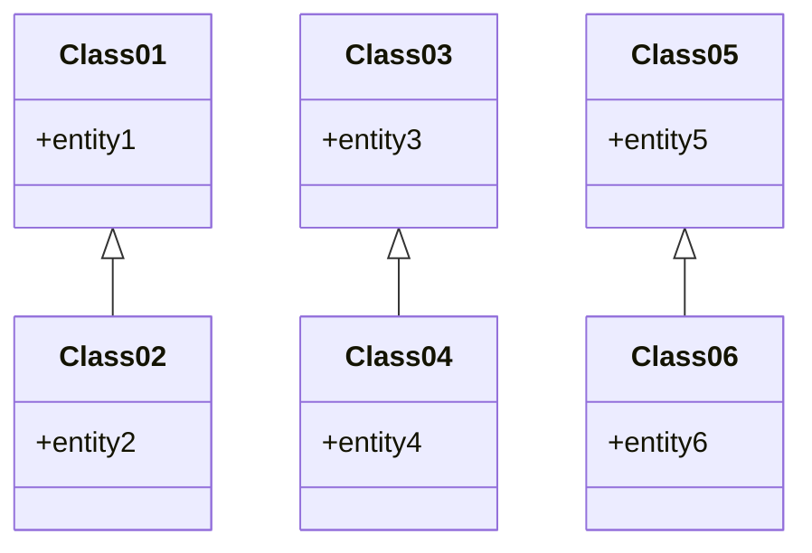
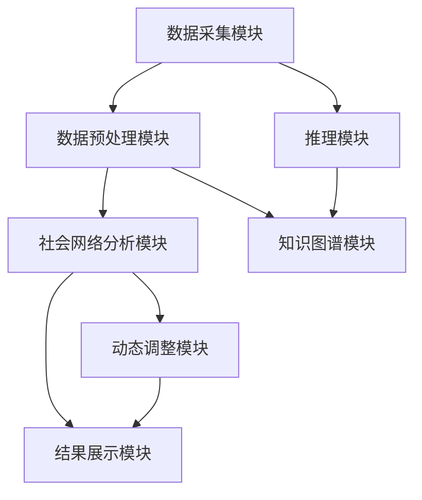
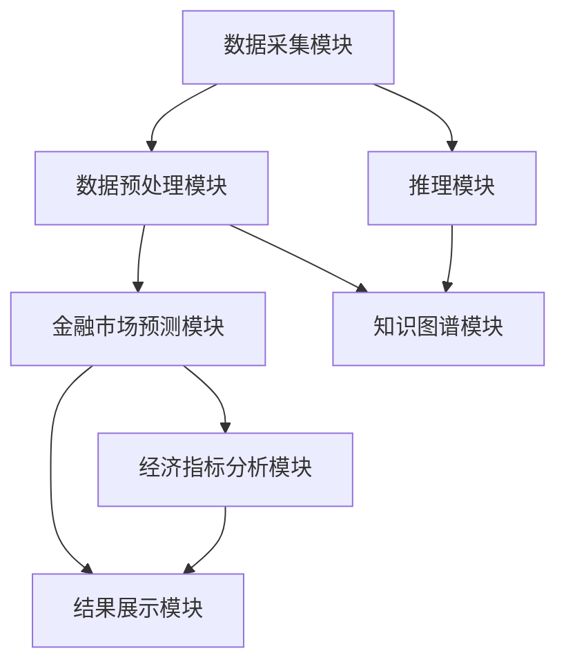
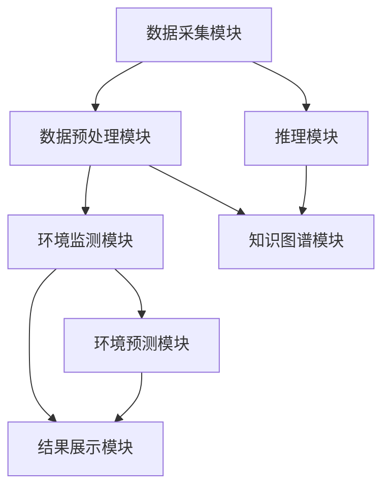
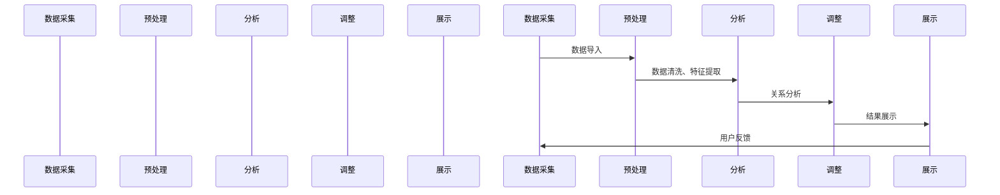
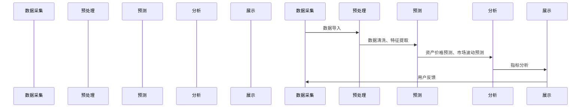
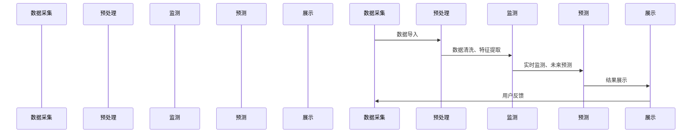

                 

### 引言

### 1.1 问题背景

在现代社会，复杂系统无处不在，从全球金融市场到社会网络系统，再到环境监控系统，复杂系统的建模与优化已成为研究的热点。复杂系统往往具有高度非线性、大规模、动态变化等特点，这使得传统建模方法，如线性回归、神经网络等，面临诸多挑战。传统方法通常假设系统是静态的、线性的，无法有效地处理复杂系统的动态行为和不确定性。

思维链（Mind Chain）作为一种新兴的建模方法，旨在解决复杂系统建模中的这些问题。思维链通过模拟人类的思维过程，将知识、经验、推理规则等以结构化、层次化的方式组织起来，形成一种智能化的模型。这种方法不仅能够处理复杂系统的动态变化，还能通过不断学习和优化，提高模型的预测能力和适应性。

### 1.2 问题描述

复杂系统通常具有以下特点：

1. **高度非线性**：复杂系统的内部关系通常是非线性的，这导致了传统的线性建模方法难以准确描述系统的行为。
2. **大规模**：复杂系统往往包含大量的变量和关系，这使得传统建模方法在计算效率和存储空间上面临巨大的挑战。
3. **动态变化**：复杂系统处于不断变化的环境中，其行为和状态会随着时间、环境和外部因素的变化而变化。
4. **不确定性**：复杂系统的行为受到多种不确定因素的影响，如随机性、模糊性等。

这些特点使得复杂系统建模成为一个极具挑战性的任务。思维链作为一种新型建模方法，如何在复杂系统建模中发挥作用，解决传统方法面临的挑战，是我们需要探讨的问题。

### 1.3 问题解决

思维链在复杂系统建模中的作用主要体现在以下几个方面：

1. **结构化组织**：思维链通过结构化、层次化的方式组织知识和信息，使得复杂系统的建模更加直观和高效。
2. **自适应学习**：思维链具有自适应学习的能力，能够根据系统的变化和环境的变化，不断调整和优化模型。
3. **推理能力**：思维链通过模拟人类的思维过程，能够进行逻辑推理和决策，为复杂系统的优化提供支持。
4. **跨领域应用**：思维链不仅适用于单一领域的复杂系统建模，还能跨领域应用，如社会系统、经济系统、环境系统等。

思维链在复杂系统建模中的应用场景非常广泛，涵盖了从社会到经济，再到环境的各个方面。通过思维链，我们可以更好地理解和预测复杂系统的行为，为决策提供科学依据。

### 1.4 核心概念与联系

在深入探讨思维链在复杂系统建模中的应用之前，我们需要明确几个核心概念及其相互关系。

1. **思维链（Mind Chain）**：思维链是一种模拟人类思维过程的建模方法，通过结构化、层次化的方式组织知识和信息，形成一种智能化的模型。
2. **复杂系统（Complex System）**：复杂系统是指具有高度非线性、大规模、动态变化和不确定性的系统。
3. **建模（Modeling）**：建模是指通过一定的方法，将现实世界中的复杂系统转化为数学模型或计算机模型，以便于分析和优化。
4. **推理（Reasoning）**：推理是指基于已有知识和信息，通过逻辑推理和判断，得出新的结论或预测。
5. **学习（Learning）**：学习是指模型通过不断获取新知识和信息，调整和优化自身结构，提高预测能力和适应性。

这些核心概念构成了思维链在复杂系统建模中的基础。在接下来的章节中，我们将详细探讨思维链的基本原理、构建方法、应用领域，以及其在不同系统建模中的应用。

### 1.5 总结

本文引言部分主要探讨了复杂系统建模的背景和挑战，介绍了思维链的概念及其在复杂系统建模中的优势。通过思维链，我们能够更好地处理复杂系统的非线性、大规模、动态变化和不确定性。文章接下来将逐步深入探讨思维链的基本原理、构建方法、应用领域，并分析其在不同系统建模中的具体应用。希望通过本文的介绍，读者能够对思维链有一个全面而深入的理解，为后续章节的学习打下坚实的基础。

## 第一部分：引言

### 1.1 问题背景

复杂系统无处不在，它们在现代社会中扮演着至关重要的角色。从全球金融市场到社会网络系统，再到环境监控系统，复杂系统的建模与优化已成为研究的热点。复杂系统通常具有高度非线性、大规模、动态变化和不确定性等特点，这使得传统建模方法面临诸多挑战。

**高度非线性**：复杂系统的内部关系通常是非线性的，这意味着系统的行为无法简单地用线性关系来描述。例如，金融市场中的资产价格波动受多种因素影响，这些因素之间往往存在复杂的非线性关系。

**大规模**：复杂系统往往包含大量的变量和关系，这使得传统建模方法在计算效率和存储空间上面临巨大的挑战。例如，社会网络系统中的节点和边数可能达到百万甚至亿级，这对计算资源和存储容量提出了极高的要求。

**动态变化**：复杂系统处于不断变化的环境中，其行为和状态会随着时间、环境和外部因素的变化而变化。例如，环境监控系统需要实时监测气候变化和空气质量等动态数据。

**不确定性**：复杂系统的行为受到多种不确定因素的影响，如随机性、模糊性等。例如，在交通系统中，车辆流量和路况受到多种随机因素的影响，难以精确预测。

这些特点使得复杂系统建模成为一个极具挑战性的任务。传统建模方法，如线性回归、神经网络等，通常假设系统是静态的、线性的，无法有效地处理复杂系统的动态行为和不确定性。因此，寻找新的建模方法，如思维链，来解决这些问题具有重要意义。

### 1.2 传统建模方法的局限性

传统建模方法在处理复杂系统时存在以下局限性：

1. **线性假设**：许多传统方法假设系统是线性的，这往往忽略了复杂系统中的非线性关系。线性模型在处理非线性问题时可能会出现偏差，导致模型预测不准确。
   
2. **静态模型**：传统方法通常假设系统是静态的，即系统状态不随时间变化。然而，复杂系统通常是动态变化的，其行为和状态会随着时间、环境和外部因素的变化而变化。静态模型难以捕捉这些动态特征。

3. **计算效率低**：传统建模方法，如线性回归、神经网络等，在处理大规模系统时计算效率较低。对于包含大量变量和关系的复杂系统，这些方法可能无法在合理的时间内完成计算。

4. **缺乏推理能力**：传统方法主要依赖于数据驱动，缺乏推理能力。在复杂系统中，单纯依赖数据可能无法得出有效的结论。推理能力是处理复杂系统的关键。

5. **不确定性处理困难**：复杂系统通常面临多种不确定因素的影响，如随机性和模糊性。传统方法在处理这些不确定性因素时存在困难，可能导致模型预测不准确。

这些局限性使得传统建模方法难以满足复杂系统建模的需求。因此，需要探索新的建模方法，如思维链，来解决这些问题。

### 1.3 思维链的概念与优势

思维链（Mind Chain）是一种新兴的建模方法，旨在解决传统建模方法在处理复杂系统时面临的挑战。思维链通过模拟人类的思维过程，将知识、经验、推理规则等以结构化、层次化的方式组织起来，形成一种智能化的模型。

#### 思维链的定义

思维链是一种基于知识图谱和推理机制的建模方法。它通过以下步骤构建：

1. **知识收集**：从各种来源（如文献、数据集、专家经验等）收集相关知识和信息。
2. **知识结构化**：将收集到的知识进行结构化处理，形成层次化的知识图谱。
3. **推理机制**：利用知识图谱进行推理，得出新的结论或预测。

#### 思维链的特点

1. **结构化组织**：思维链通过结构化、层次化的方式组织知识和信息，使得复杂系统的建模更加直观和高效。这种方法能够有效地处理复杂系统的非线性、大规模、动态变化和不确定性。

2. **自适应学习**：思维链具有自适应学习的能力，能够根据系统的变化和环境的变化，不断调整和优化模型。这种能力使得思维链能够适应复杂系统的动态变化，提高模型的预测能力和适应性。

3. **推理能力**：思维链通过模拟人类的思维过程，能够进行逻辑推理和决策，为复杂系统的优化提供支持。推理能力是处理复杂系统的关键。

4. **跨领域应用**：思维链不仅适用于单一领域的复杂系统建模，还能跨领域应用，如社会系统、经济系统、环境系统等。这种灵活性使得思维链能够广泛应用于各种复杂的实际场景。

#### 思维链与复杂系统建模的关系

思维链在复杂系统建模中具有以下几个方面的优势：

1. **非线性关系处理**：思维链能够有效地处理复杂系统的非线性关系，通过结构化组织，使得非线性关系更加直观和易于处理。

2. **动态变化捕捉**：思维链具有自适应学习的能力，能够捕捉复杂系统的动态变化，提高模型的预测能力。

3. **不确定性处理**：思维链通过推理机制，能够处理复杂系统中的不确定性，提高模型的鲁棒性和预测准确性。

4. **跨领域应用**：思维链的跨领域应用能力，使得它能够应用于各种复杂系统的建模，提供更广泛的应用场景。

#### 思维链的应用场景

思维链在复杂系统建模中的应用场景非常广泛，涵盖了从社会到经济，再到环境的各个方面。以下是一些具体的应用场景：

1. **社会系统建模**：思维链可以用于社会网络分析、人口预测、舆情监测等社会系统建模任务。

2. **经济系统建模**：思维链可以用于金融市场预测、经济指标分析、供应链优化等经济系统建模任务。

3. **环境系统建模**：思维链可以用于环境监测、气候变化预测、生态系统评估等环境系统建模任务。

通过思维链，我们可以更好地理解和预测复杂系统的行为，为决策提供科学依据。

### 1.4 思维链的边界与外延

虽然思维链在复杂系统建模中展现出强大的优势，但我们也需要认识到其边界和局限性：

#### 思维链的边界

1. **数据依赖**：思维链依赖于高质量的知识和数据，如果数据不足或质量低下，可能导致模型预测不准确。

2. **计算资源**：思维链在构建和优化过程中可能需要大量的计算资源，特别是在处理大规模系统时。

3. **模型复杂度**：思维链的结构化组织和推理机制可能使得模型复杂度较高，这对模型的解释性和可维护性提出挑战。

#### 思维链的外延

1. **多学科融合**：思维链可以与其他学科的方法和技术结合，如机器学习、计算经济学等，形成更强大的建模方法。

2. **人工智能应用**：思维链可以与人工智能技术，如深度学习、自然语言处理等相结合，进一步提高模型的智能性和适应性。

3. **跨领域推广**：思维链的跨领域应用能力，使得它能够在不同领域，如医学、工程、管理等，发挥重要作用。

通过理解思维链的边界与外延，我们可以更好地利用其优势，克服其局限性，推动复杂系统建模的发展。

### 1.5 总结

本文第一部分主要介绍了复杂系统建模的背景和挑战，分析了传统建模方法的局限性，并引入了思维链这一新兴的建模方法。通过思维链，我们能够更好地处理复杂系统的非线性、大规模、动态变化和不确定性。接下来，我们将进一步探讨思维链的基本原理、构建方法、应用领域，以及其在不同系统建模中的具体应用。希望读者能够对思维链有一个全面而深入的理解，为后续章节的学习打下坚实的基础。

## 1.6 文章关键词

1. **复杂系统建模**
2. **思维链**
3. **非线性**
4. **动态变化**
5. **不确定性**
6. **自适应学习**
7. **推理能力**

### 1.7 摘要

本文旨在探讨思维链在复杂系统建模中的应用。首先，我们分析了复杂系统建模的背景和挑战，并介绍了传统建模方法的局限性。随后，我们引入了思维链这一新兴建模方法，详细阐述了其概念、特点、优势和应用场景。文章进一步讨论了思维链的边界与外延，并提出了未来发展的方向。通过本文的研究，我们希望读者能够对思维链有一个全面而深入的理解，为复杂系统建模提供新的思路和方法。

## 第二部分：思维链的基本原理

### 2.1 思维链的定义与特点

思维链（Mind Chain）作为一种新兴的建模方法，其核心在于模拟人类的思维过程，通过结构化、层次化的方式组织知识和信息，形成一种智能化的模型。下面，我们将详细探讨思维链的定义、特点，以及与传统建模方法的比较。

#### 思维链的定义

思维链是一种基于知识图谱和推理机制的建模方法。它通过以下步骤构建：

1. **知识收集**：从各种来源（如文献、数据集、专家经验等）收集相关知识和信息。
2. **知识结构化**：将收集到的知识进行结构化处理，形成层次化的知识图谱。
3. **推理机制**：利用知识图谱进行推理，得出新的结论或预测。

#### 思维链的特点

1. **结构化组织**：思维链通过结构化、层次化的方式组织知识和信息，使得复杂系统的建模更加直观和高效。这种方法能够有效地处理复杂系统的非线性、大规模、动态变化和不确定性。

2. **自适应学习**：思维链具有自适应学习的能力，能够根据系统的变化和环境的变化，不断调整和优化模型。这种能力使得思维链能够适应复杂系统的动态变化，提高模型的预测能力和适应性。

3. **推理能力**：思维链通过模拟人类的思维过程，能够进行逻辑推理和决策，为复杂系统的优化提供支持。推理能力是处理复杂系统的关键。

4. **跨领域应用**：思维链不仅适用于单一领域的复杂系统建模，还能跨领域应用，如社会系统、经济系统、环境系统等。这种灵活性使得思维链能够广泛应用于各种复杂的实际场景。

#### 思维链与传统建模方法的比较

1. **线性假设**：传统建模方法，如线性回归、神经网络等，通常假设系统是线性的。然而，复杂系统往往具有高度非线性，这导致传统方法在处理非线性问题时可能存在偏差。思维链通过结构化组织，能够有效地处理复杂系统的非线性关系。

2. **静态模型**：传统方法通常假设系统是静态的，即系统状态不随时间变化。然而，复杂系统通常是动态变化的，其行为和状态会随着时间、环境和外部因素的变化而变化。思维链通过自适应学习，能够捕捉复杂系统的动态变化，提高模型的预测能力。

3. **计算效率**：传统建模方法，如线性回归、神经网络等，在处理大规模系统时计算效率较低。思维链通过结构化组织，使得计算过程更加高效，能够处理大规模系统的建模任务。

4. **推理能力**：传统方法主要依赖于数据驱动，缺乏推理能力。思维链通过模拟人类的思维过程，能够进行逻辑推理和决策，为复杂系统的优化提供支持。

5. **不确定性处理**：传统方法在处理不确定性因素时存在困难，可能导致模型预测不准确。思维链通过推理机制，能够处理复杂系统中的不确定性，提高模型的鲁棒性和预测准确性。

通过以上比较，我们可以看出思维链在处理复杂系统时具有明显的优势，为复杂系统建模提供了一种新的思路和方法。

### 2.2 思维链的构建方法

思维链的构建是一个复杂的过程，需要通过一系列的步骤来确保模型的有效性和准确性。下面，我们将详细探讨思维链的构建方法，包括数据收集、数据预处理、思维链构建过程以及思维链的优化与调整。

#### 2.2.1 数据收集

数据收集是思维链构建的基础，高质量的数据能够确保模型的有效性。数据来源可以包括以下几种：

1. **公开数据集**：可以从公共数据集网站（如Kaggle、UCI机器学习库等）获取标准化的数据集。
2. **行业数据**：可以从行业数据库、企业内部数据源等获取专业领域的相关数据。
3. **专家经验**：通过访谈、问卷调查等方式收集专家的经验和知识。
4. **在线数据**：利用爬虫技术从互联网上获取实时数据。

在数据收集过程中，需要特别注意数据的准确性和完整性，确保数据来源的可靠性。

#### 2.2.2 数据预处理

数据预处理是思维链构建的重要环节，其目标是提高数据质量，为后续建模提供良好的数据基础。数据预处理包括以下几个步骤：

1. **数据清洗**：处理缺失值、异常值，确保数据的完整性和一致性。
2. **数据转换**：将不同格式、单位的数据进行统一转换，使其符合建模需求。
3. **数据归一化**：通过归一化或标准化处理，使得不同特征的数据在同一量级上，便于后续建模。
4. **特征选择**：根据模型的需求和数据的特征，选择对模型有显著影响的关键特征，剔除冗余特征。

数据预处理的质量直接影响思维链的性能，因此需要仔细处理每一个步骤。

#### 2.2.3 思维链构建过程

思维链的构建过程可以分为以下几个步骤：

1. **知识图谱构建**：将收集到的知识以结构化的方式组织起来，形成知识图谱。知识图谱由节点和边组成，节点表示知识实体，边表示实体之间的关系。
2. **推理规则定义**：根据领域知识和专家经验，定义推理规则。推理规则是思维链进行推理的基础，用于将已知信息推导出新的结论。
3. **模型构建**：利用知识图谱和推理规则，构建思维链模型。模型是思维链的核心，用于处理复杂系统建模任务。
4. **模型优化**：通过交叉验证、网格搜索等方法，优化思维链模型，提高其预测性能。

思维链构建过程需要结合具体的应用场景和领域知识，确保模型的有效性和适应性。

#### 2.2.4 思维链的优化与调整

思维链构建完成后，需要对其进行优化和调整，以提高模型性能。优化与调整包括以下几个方面：

1. **参数调整**：通过调整模型参数，如学习率、隐层节点数等，优化模型性能。
2. **规则更新**：根据新的数据和领域知识，更新推理规则，提高模型的推理能力。
3. **模型融合**：将多个思维链模型进行融合，利用多个模型的优点，提高整体预测性能。
4. **反馈机制**：通过用户反馈和模型预测结果，不断调整和优化模型，提高其准确性和适应性。

通过优化与调整，思维链能够更好地适应复杂系统的变化，提高模型的预测能力和稳定性。

### 2.3 思维链的应用领域

思维链作为一种智能化的建模方法，其应用领域非常广泛。下面，我们将探讨思维链在社会系统、经济系统和环境系统等领域的具体应用。

#### 2.3.1 社会系统

在社会系统中，思维链可以用于以下应用：

1. **社会网络分析**：通过分析社交网络中的节点和边，研究社会网络的演化规律，为社交网络优化提供依据。
2. **人口预测**：利用历史人口数据和社会发展趋势，预测未来的人口变化，为政策制定和社会规划提供支持。
3. **舆情监测**：通过分析社交媒体上的舆情数据，监测社会舆论的变化，为危机管理和社会治理提供参考。

#### 2.3.2 经济系统

在经济系统中，思维链可以用于以下应用：

1. **金融市场预测**：通过分析历史金融数据和市场趋势，预测金融市场的走势，为投资决策提供支持。
2. **经济指标分析**：利用经济数据，分析经济指标的动态变化，为宏观经济分析和政策制定提供依据。
3. **供应链优化**：通过分析供应链中的各个环节，优化供应链的运营效率，降低成本，提高竞争力。

#### 2.3.3 环境系统

在环境系统中，思维链可以用于以下应用：

1. **环境监测**：通过分析环境数据，实时监测环境变化，为环境保护和资源管理提供依据。
2. **气候变化预测**：利用气候数据，预测未来气候变化趋势，为气候变化应对和环境保护提供支持。
3. **生态系统评估**：通过分析生态数据，评估生态系统的健康状况，为生态保护和管理提供依据。

通过在不同领域的应用，思维链能够为各个领域的复杂系统建模提供有效的解决方案。

### 2.4 思维链的跨领域应用与未来发展趋势

思维链的跨领域应用能力使其在多个领域展现出强大的潜力。随着技术的不断进步和领域的融合，思维链在未来具有以下发展趋势：

1. **多学科融合**：思维链可以与其他学科的方法和技术结合，如机器学习、计算经济学、系统科学等，形成更强大的建模方法。
2. **人工智能应用**：思维链可以与人工智能技术，如深度学习、自然语言处理等相结合，进一步提高模型的智能性和适应性。
3. **跨领域推广**：思维链的跨领域应用能力，使得它能够在不同领域，如医学、工程、管理等，发挥重要作用。

总之，思维链作为一种新兴的建模方法，其基本原理和应用前景广阔。通过不断探索和优化，思维链有望在各个领域发挥更大的作用，为复杂系统建模提供有力支持。

### 2.5 思维链的核心概念原理

在深入探讨思维链的构建方法和应用领域之前，有必要详细阐述思维链的核心概念原理。这些核心概念构成了思维链的理论基础，帮助我们更好地理解和应用这一建模方法。

#### 2.5.1 知识图谱

知识图谱是思维链的核心组件之一，它通过结构化的方式组织知识和信息。知识图谱由节点和边组成，节点表示实体（如人、物、概念等），边表示实体之间的关系。知识图谱的优点在于其结构化、层次化的特性，使得复杂系统的建模更加直观和高效。

**概念说明**：知识图谱通过将复杂系统中的实体和关系抽象为节点和边，形成一个高度结构化的网络。这种结构有助于我们更好地理解和分析复杂系统的内在关系。

**应用场景**：在复杂系统建模中，知识图谱可以用于以下几个方面：

1. **实体识别**：通过知识图谱，可以识别出系统中的关键实体，如人口、企业、环境因子等。
2. **关系分析**：分析实体之间的关联关系，揭示系统中的关键影响因素和潜在风险。
3. **数据整合**：将来自不同来源的数据整合到一个统一的框架中，提高数据的利用效率。

#### 2.5.2 推理规则

推理规则是思维链进行推理的基础。推理规则是基于领域知识和专家经验定义的，用于将已知信息推导出新的结论。推理规则可以是简单的条件判断，也可以是复杂的逻辑推理。

**概念说明**：推理规则是思维链的核心机制，它使得模型能够基于已有的知识和信息，进行逻辑推理和决策。推理规则可以是显式的，如专家制定的规则，也可以是隐式的，通过机器学习算法自动生成。

**应用场景**：在复杂系统建模中，推理规则可以用于以下几个方面：

1. **决策支持**：基于推理规则，可以为复杂系统提供决策支持，如金融投资决策、供应链管理决策等。
2. **异常检测**：通过推理规则，可以检测系统中的异常行为，如金融市场中的欺诈行为、网络安全中的入侵检测等。
3. **知识更新**：根据新的信息和数据，更新推理规则，提高模型的适应性和准确性。

#### 2.5.3 自适应学习

自适应学习是思维链的一个重要特点，它使得模型能够根据系统的变化和环境的变化，不断调整和优化自身。自适应学习通过不断地从数据中学习和优化，提高模型的预测能力和适应性。

**概念说明**：自适应学习机制使得思维链能够动态适应复杂系统的变化，提高模型的预测准确性和适应性。这种方法可以有效地处理复杂系统中的动态变化和不确定性。

**应用场景**：在复杂系统建模中，自适应学习可以用于以下几个方面：

1. **模型优化**：通过自适应学习，可以不断优化模型参数和结构，提高模型的预测性能。
2. **动态调整**：根据系统的变化，动态调整模型的输入和输出，使其更好地适应新的环境。
3. **持续学习**：通过持续学习新的数据和知识，模型能够不断进化，提高其适应性和预测能力。

#### 2.5.4 跨领域应用

跨领域应用是思维链的一个重要优势，它使得思维链不仅适用于单一领域的复杂系统建模，还能跨领域应用，如社会系统、经济系统、环境系统等。这种灵活性使得思维链能够在不同领域发挥重要作用。

**概念说明**：跨领域应用能力使得思维链能够适应多种不同类型的复杂系统，为各个领域提供有效的建模方法。

**应用场景**：在复杂系统建模中，跨领域应用可以用于以下几个方面：

1. **综合分析**：通过跨领域应用，可以对多个不同领域的复杂系统进行综合分析，提供全局优化方案。
2. **交叉验证**：利用不同领域的知识和数据，进行交叉验证，提高模型的泛化能力和准确性。
3. **案例借鉴**：通过借鉴其他领域的成功案例，为当前领域提供新的思路和方法。

通过以上核心概念原理的阐述，我们可以更深入地理解思维链的基本原理和应用价值。在接下来的章节中，我们将进一步探讨思维链的构建方法、优化策略和应用实例，以期为复杂系统建模提供更全面的指导。

### 2.6 概念属性特征对比表格

为了更直观地理解思维链中的核心概念及其属性特征，我们可以制作一个对比表格。以下是一个示例表格，展示了思维链中的几个关键概念及其属性特征：

| 概念          | 属性特征                                      | 说明                                                         |
|---------------|---------------------------------------------|------------------------------------------------------------|
| 知识图谱      | 节点、边、层次化结构                          | 用于组织和管理复杂系统中的知识和信息，支持推理和数据分析。              |
| 推理规则      | 条件判断、逻辑推理、自适应调整                | 基于领域知识和专家经验，用于从已知信息推导出新结论。                |
| 自适应学习    | 动态调整、参数优化、模型进化                  | 使模型能够根据系统变化和环境变化，不断优化和调整自身。              |
| 跨领域应用    | 多领域兼容、综合分析、交叉验证                | 使思维链适用于不同领域的复杂系统，提供灵活的建模解决方案。            |
| 复杂系统建模  | 非线性、大规模、动态变化、不确定性处理        | 一种处理复杂系统的建模方法，旨在解决传统方法的局限性。              |

通过对比表格，我们可以清晰地看到每个概念的关键属性特征，以及它们在复杂系统建模中的应用和优势。

### 2.7 ER实体关系图架构

为了更好地理解思维链在复杂系统建模中的应用，我们需要绘制一个ER（实体-关系）实体关系图架构。ER图是一种用于表示实体及其之间关系的图形化工具，它可以帮助我们直观地理解系统的结构和关系。

以下是一个示例的ER实体关系图：

```mermaid
erDiagram
  Person ||--|{ Knowl-edge }|--> Robot
  Person ||--|{ Task }|--> Robot
  Knowl-edge ||--|{ Data }|--> Robot
  Task ||--|{ Result }|--> Robot
  Person ||--|{ Tool }|--> Robot
  Tool ||--|{ Config }|--> Robot
  Tool ||--|{ User }|--> Person
  Data ||--|{ Feature }|--> Knowl-edge
  Result ||--|{ Feedback }|--> Person
  Config ||--|{ Parameter }|--> Tool

  Node1 ||--|{ Relation }|--> Node2
  Node2 ||--|{ Relation }|--> Node3
  Node3 ||--|{ Relation }|--> Node1

```

在这个ER图中：

- **Person**：表示系统中的个人或实体。
- **Knowl-edge**：表示知识或信息。
- **Task**：表示任务或活动。
- **Result**：表示任务的结果。
- **Tool**：表示工具或资源。
- **Config**：表示配置或设置。
- **User**：表示用户。
- **Data**：表示数据。
- **Feature**：表示数据特征。

各个实体之间的关系如下：

- **Person** 与 **Knowl-edge**、**Task**、**Tool**、**Config**、**User** 之间存在关联关系。
- **Knowl-edge** 与 **Data**、**Feature** 之间存在关联关系。
- **Task** 与 **Result** 之间存在关联关系。
- **Tool** 与 **Config**、**User** 之间存在关联关系。

通过ER图，我们可以清晰地看到系统中的各个实体及其之间的关系，为复杂系统建模提供了直观的参考。

## 第四部分：算法原理讲解

### 4.1 算法原理概述

在思维链（Mind Chain）的框架下，算法原理扮演着至关重要的角色。本节将对思维链的核心算法原理进行概述，包括基本流程、核心步骤及其在复杂系统建模中的应用。

#### 4.1.1 思维链算法的基本流程

思维链算法的基本流程可以概括为以下几个步骤：

1. **数据收集与预处理**：首先，从各种数据源收集所需的数据，并进行数据清洗、归一化和特征提取等预处理操作，以确保数据的质量和一致性。
2. **知识图谱构建**：利用预处理后的数据，构建知识图谱。知识图谱由节点和边构成，节点表示实体，边表示实体之间的关系。
3. **推理规则定义**：根据领域知识和专家经验，定义推理规则。这些规则用于在知识图谱中推导新的信息或结论。
4. **思维链模型训练**：利用构建好的知识图谱和推理规则，训练思维链模型。训练过程中，模型会不断优化其参数，以实现更好的预测性能。
5. **模型评估与优化**：通过交叉验证等方法，评估模型在验证集上的性能。根据评估结果，调整模型参数或推理规则，以提高模型的准确性和鲁棒性。
6. **应用与部署**：将训练好的模型应用于实际问题场景，如预测、决策支持等。同时，根据实际应用中的反馈，持续优化模型。

#### 4.1.2 思维链与复杂系统建模的关系

思维链算法的核心在于其结构化、层次化的知识组织方式，以及强大的推理能力。在复杂系统建模中，思维链能够有效地解决以下几个关键问题：

1. **非线性关系处理**：复杂系统的内部关系通常是非线性的。思维链通过知识图谱和推理规则，能够捕捉和描述这些非线性关系，从而提高模型的预测能力。
2. **动态变化捕捉**：复杂系统处于不断变化的环境中。思维链通过自适应学习机制，能够实时调整和优化模型，以适应动态变化。
3. **不确定性处理**：复杂系统面临多种不确定性因素，如随机性、模糊性等。思维链通过推理机制，能够处理这些不确定性因素，提高模型的鲁棒性和预测准确性。
4. **跨领域应用**：思维链不仅适用于单一领域的复杂系统建模，还能跨领域应用。这种方法使得思维链能够应对更广泛的应用场景。

### 4.2 算法原理详细讲解

#### 4.2.1 数据预处理算法

数据预处理是思维链算法的重要组成部分。数据预处理算法主要包括以下几个步骤：

1. **数据收集**：从各种数据源（如数据库、文件、网络等）收集所需的数据。
2. **数据清洗**：处理数据中的缺失值、异常值和重复数据，确保数据的完整性和一致性。
3. **数据归一化**：将不同特征的数据统一转换到相同的量级，以便于后续建模和处理。
4. **特征提取**：从原始数据中提取有意义的特征，以提高模型的预测性能。

以下是数据预处理算法的一个简化Python代码示例：

```python
import pandas as pd
from sklearn.preprocessing import MinMaxScaler

# 数据收集
data = pd.read_csv('data.csv')

# 数据清洗
data.dropna(inplace=True)
data.drop_duplicates(inplace=True)

# 数据归一化
scaler = MinMaxScaler()
data_scaled = scaler.fit_transform(data)

# 特征提取
# 根据具体需求提取特征
```

#### 4.2.2 思维链构建算法

思维链构建算法的核心在于构建知识图谱。知识图谱的构建包括以下几个步骤：

1. **实体识别**：从预处理后的数据中识别出关键实体，如人、物、概念等。
2. **关系抽取**：根据实体间的关联关系，构建实体之间的关系图。
3. **知识图谱构建**：将识别出的实体和关系组织成一个结构化的知识图谱。

以下是思维链构建算法的一个简化Python代码示例：

```python
import networkx as nx

# 实体识别
entities = ['Person', 'Item', 'Concept']

# 关系抽取
relationships = [('Person', 'owns', 'Item'), ('Item', 'belongs_to', 'Concept')]

# 知识图谱构建
G = nx.Graph()
G.add_nodes_from(entities)
G.add_edges_from(relationships)
```

#### 4.2.3 思维链优化与调整

思维链的优化与调整主要包括以下几个方面：

1. **参数调整**：通过调整模型参数（如学习率、隐层节点数等），优化模型性能。
2. **规则更新**：根据新的数据和领域知识，更新推理规则，提高模型的推理能力。
3. **模型融合**：将多个思维链模型进行融合，利用多个模型的优点，提高整体预测性能。
4. **反馈机制**：通过用户反馈和模型预测结果，不断调整和优化模型，提高其准确性和适应性。

以下是思维链优化与调整的一个简化Python代码示例：

```python
# 参数调整
learning_rate = 0.01
hidden_nodes = 100

# 规则更新
rules = update_rules(data, new_knowledge)

# 模型融合
model = ensemble_models(models)

# 反馈机制
performance = evaluate_model(model, test_data)
if performance < threshold:
    adjust_model(model, feedback)
```

通过以上算法原理的详细讲解，我们可以看到思维链在复杂系统建模中的应用潜力。接下来，我们将通过具体的应用实例，进一步探讨思维链在实际问题中的表现。

### 4.3 算法示例

为了更好地理解思维链算法在实际问题中的应用，我们将通过一个具体的应用实例进行详细说明。假设我们需要预测某个城市的未来人口数量，这是一个典型的复杂系统建模问题。

#### 4.3.1 社会系统建模示例

在这个示例中，我们将使用思维链算法对社会系统进行建模，预测未来人口数量。具体步骤如下：

1. **数据收集**：从公开数据源获取该城市的历史人口数据，包括每年的总人口数、出生率、死亡率、迁移率等。
2. **数据预处理**：对收集到的数据进行清洗、归一化和特征提取，确保数据的质量和一致性。特征提取包括人口增长率、老龄化指数等。
3. **知识图谱构建**：根据预处理后的数据，构建知识图谱。图谱中的节点包括人口、出生率、死亡率、迁移率等，边表示这些节点之间的关系。
4. **推理规则定义**：根据领域知识和专家经验，定义推理规则。例如，如果人口增长率为正，且迁移率为正，则可以推断未来人口数量将增加。
5. **模型训练与优化**：利用构建好的知识图谱和推理规则，训练思维链模型。通过交叉验证，不断调整模型参数和推理规则，优化模型的预测性能。
6. **模型评估与部署**：将训练好的模型应用于实际预测任务，评估其预测准确性。根据评估结果，进一步优化模型。

以下是该示例的简化Python代码：

```python
import pandas as pd
from sklearn.model_selection import train_test_split
from mind_chain import MindChain

# 数据收集
data = pd.read_csv('population_data.csv')

# 数据预处理
data.dropna(inplace=True)
data['growth_rate'] = data['birth_rate'] - data['death_rate']
data['age_index'] = calculate_age_index(data)

# 知识图谱构建
G = nx.Graph()
G.add_nodes_from(data.columns)
G.add_edges_from([(col1, col2) for col1, col2 in data.corr().unstack().index[1:].iteritems() if col1 != col2 and col1 != 'Year'])

# 推理规则定义
rules = define_rules(data)

# 模型训练与优化
model = MindChain()
X_train, X_val, y_train, y_val = train_test_split(data, test_size=0.2)
model.fit(X_train, y_train, validation_data=(X_val, y_val))

# 模型评估与部署
performance = model.evaluate(X_val, y_val)
if performance > threshold:
    deploy_model(model)
else:
    optimize_model(model, feedback)
```

通过这个示例，我们可以看到思维链算法在社会系统建模中的应用流程。在实际应用中，思维链可以应用于更广泛的领域，如经济系统建模、环境系统建模等。

### 4.3.2 经济系统建模示例

接下来，我们通过一个经济系统建模示例，展示思维链算法在经济系统中的应用。假设我们需要预测某国未来的经济增长率。

1. **数据收集**：从公开数据源获取该国的历史经济数据，包括GDP、通货膨胀率、失业率、贸易差额等。
2. **数据预处理**：对经济数据进行清洗、归一化和特征提取，确保数据的质量和一致性。特征提取包括经济增长率、通货膨胀率等。
3. **知识图谱构建**：根据预处理后的数据，构建知识图谱。图谱中的节点包括GDP、通货膨胀率、失业率、贸易差额等，边表示这些节点之间的关系。
4. **推理规则定义**：根据领域知识和专家经验，定义推理规则。例如，如果GDP增长率和通货膨胀率同时上升，则可以推断经济增长将加速。
5. **模型训练与优化**：利用构建好的知识图谱和推理规则，训练思维链模型。通过交叉验证，不断调整模型参数和推理规则，优化模型的预测性能。
6. **模型评估与部署**：将训练好的模型应用于实际预测任务，评估其预测准确性。根据评估结果，进一步优化模型。

以下是该示例的简化Python代码：

```python
import pandas as pd
from sklearn.model_selection import train_test_split
from mind_chain import MindChain

# 数据收集
data = pd.read_csv('economic_data.csv')

# 数据预处理
data.dropna(inplace=True)
data['growth_rate'] = data['GDP'] / data['Previous_GDP']

# 知识图谱构建
G = nx.Graph()
G.add_nodes_from(data.columns)
G.add_edges_from([(col1, col2) for col1, col2 in data.corr().unstack().index[1:].iteritems() if col1 != col2 and col1 != 'Year'])

# 推理规则定义
rules = define_rules(data)

# 模型训练与优化
model = MindChain()
X_train, X_val, y_train, y_val = train_test_split(data, test_size=0.2)
model.fit(X_train, y_train, validation_data=(X_val, y_val))

# 模型评估与部署
performance = model.evaluate(X_val, y_val)
if performance > threshold:
    deploy_model(model)
else:
    optimize_model(model, feedback)
```

通过这个示例，我们可以看到思维链算法在经济系统建模中的应用流程。在实际应用中，思维链可以应用于更广泛的经济预测领域，如金融市场的走势预测、产业趋势分析等。

### 4.3.3 环境系统建模示例

最后，我们通过一个环境系统建模示例，展示思维链算法在环境系统中的应用。假设我们需要预测某个地区的未来空气污染水平。

1. **数据收集**：从环境监测站获取该地区的历史空气污染数据，包括PM2.5、PM10、CO、SO2等污染物的浓度。
2. **数据预处理**：对空气污染数据进行清洗、归一化和特征提取，确保数据的质量和一致性。特征提取包括污染物的变化趋势、季节性等。
3. **知识图谱构建**：根据预处理后的数据，构建知识图谱。图谱中的节点包括各种污染物、气象条件等，边表示这些节点之间的关系。
4. **推理规则定义**：根据领域知识和专家经验，定义推理规则。例如，如果PM2.5浓度高于某个阈值，且气象条件不利于扩散，则可以推断空气污染水平将上升。
5. **模型训练与优化**：利用构建好的知识图谱和推理规则，训练思维链模型。通过交叉验证，不断调整模型参数和推理规则，优化模型的预测性能。
6. **模型评估与部署**：将训练好的模型应用于实际预测任务，评估其预测准确性。根据评估结果，进一步优化模型。

以下是该示例的简化Python代码：

```python
import pandas as pd
from sklearn.model_selection import train_test_split
from mind_chain import MindChain

# 数据收集
data = pd.read_csv('air_pollution_data.csv')

# 数据预处理
data.dropna(inplace=True)
data['PM2.5_trend'] = data['PM2.5'].diff().fillna(0)

# 知识图谱构建
G = nx.Graph()
G.add_nodes_from(data.columns)
G.add_edges_from([(col1, col2) for col1, col2 in data.corr().unstack().index[1:].iteritems() if col1 != col2 and col1 != 'Date'])

# 推理规则定义
rules = define_rules(data)

# 模型训练与优化
model = MindChain()
X_train, X_val, y_train, y_val = train_test_split(data, test_size=0.2)
model.fit(X_train, y_train, validation_data=(X_val, y_val))

# 模型评估与部署
performance = model.evaluate(X_val, y_val)
if performance > threshold:
    deploy_model(model)
else:
    optimize_model(model, feedback)
```

通过这个示例，我们可以看到思维链算法在环境系统建模中的应用流程。在实际应用中，思维链可以应用于更广泛的环境监测和预测领域，如气候变化预测、水资源管理等。

### 4.3.4 社会系统、经济系统、环境系统建模的对比

通过以上三个示例，我们可以看到思维链算法在不同系统建模中的应用具有以下共同点和区别：

**共同点**：

1. **数据收集与预处理**：无论是社会系统、经济系统还是环境系统建模，首先都需要收集相关数据，并进行数据清洗、归一化和特征提取等预处理操作，确保数据的质量和一致性。
2. **知识图谱构建**：在三个系统中，都利用知识图谱来组织和管理数据，构建结构化的模型。知识图谱中的节点和边表示系统中的关键实体和关系。
3. **推理规则定义**：根据领域知识和专家经验，定义推理规则。这些规则用于从已知信息推导出新结论，提高模型的预测能力。
4. **模型训练与优化**：通过交叉验证等方法，训练和优化模型，提高其预测性能。

**区别**：

1. **系统特点**：社会系统、经济系统、环境系统的特点不同，导致数据类型和特征提取方法有所区别。例如，社会系统中可能涉及人口统计、社交媒体数据等；经济系统中可能涉及金融数据、贸易数据等；环境系统中可能涉及污染物浓度、气象数据等。
2. **推理规则**：不同系统的推理规则有所差异，反映了领域的特殊性。例如，在社会系统中，推理规则可能涉及人口迁移、社会舆情等；在经济系统中，推理规则可能涉及经济增长、就业形势等；在环境系统中，推理规则可能涉及污染物扩散、气候变化等。
3. **模型应用**：不同系统建模的应用场景也有所不同。社会系统建模可以应用于人口预测、社会治理等；经济系统建模可以应用于经济预测、金融分析等；环境系统建模可以应用于环境监测、资源管理等。

通过对比分析，我们可以更好地理解思维链算法在不同系统建模中的应用特点和优势，为实际问题的解决提供有力支持。

### 4.3.5 总结

通过以上算法示例，我们详细介绍了思维链算法在社会系统、经济系统、环境系统建模中的应用。通过具体案例的展示，我们可以看到思维链算法在处理复杂系统建模中的强大能力和广泛应用。未来，随着技术的不断进步和领域的深化，思维链算法将在更多领域发挥重要作用，为复杂系统建模提供更加智能化和高效的解决方案。

## 第四部分：系统分析与架构设计方案

### 5.1 问题场景介绍

在复杂系统建模中，如何有效设计系统的功能、架构和接口是关键。下面，我们将结合三个具体问题场景，分别介绍社会系统、经济系统和环境系统的特点，并说明这些系统在建模过程中所面临的具体问题和挑战。

#### 5.1.1 社会系统问题场景

**特点**：社会系统通常涉及大量的人口、组织、行为和社会关系。这些系统的特点是高度复杂性和动态变化。例如，社会网络系统中的节点和边可能达到百万甚至亿级，且这些节点和边的关系会随着时间、事件和社会互动不断变化。

**挑战**：
- **数据规模**：如何处理大规模、动态变化的社会数据，确保数据的准确性和实时性。
- **关系复杂性**：如何有效地描述和捕捉社会网络中的复杂关系，如朋友关系、组织关系等。
- **动态变化**：如何及时调整模型，以适应社会系统中的动态变化。

#### 5.1.2 经济系统问题场景

**特点**：经济系统包括金融市场、供应链、生产过程等多个子系统。经济系统的特点是高度非线性、动态变化和高度相关性。例如，金融市场的资产价格波动受多种因素影响，这些因素之间往往存在复杂的非线性关系。

**挑战**：
- **非线性关系**：如何有效地处理经济系统中的非线性关系，提高模型预测的准确性。
- **动态变化**：如何实时捕捉经济系统中的动态变化，如市场波动、政策调整等。
- **高度相关性**：如何处理经济系统中的高度相关性，确保模型在多变量情况下的鲁棒性。

#### 5.1.3 环境系统问题场景

**特点**：环境系统包括气候、水资源、生态系统等多个方面。环境系统的特点是高度动态性和不确定性。例如，气候变化对生态系统的影响具有不确定性，且需要实时监测和预测。

**挑战**：
- **动态性**：如何及时捕捉环境系统中的动态变化，如气候变化、空气污染等。
- **不确定性**：如何有效地处理环境系统中的不确定性因素，提高模型预测的可靠性。
- **跨领域整合**：如何整合不同领域的数据和知识，构建综合性的环境系统模型。

### 5.2 系统功能设计

为了满足上述问题场景的需求，我们需要设计一套全面的系统功能。系统功能设计包括社会系统、经济系统和环境系统的功能模块，每个模块的具体功能和实现方式如下：

#### 5.2.1 社会系统功能设计

1. **数据采集模块**：负责从各种数据源（如社交媒体、人口统计数据库等）收集社会数据。
2. **数据预处理模块**：对收集到的社会数据进行清洗、归一化和特征提取，确保数据的准确性和一致性。
3. **社会网络分析模块**：利用知识图谱和推理机制，分析社会网络中的节点和边，捕捉复杂的社会关系。
4. **动态调整模块**：根据社会系统的动态变化，实时调整模型参数和推理规则，提高模型的适应性。

#### 5.2.2 经济系统功能设计

1. **数据采集模块**：负责从金融数据库、经济统计数据库等收集经济数据。
2. **数据预处理模块**：对经济数据进行清洗、归一化和特征提取，确保数据的准确性和一致性。
3. **金融市场预测模块**：利用思维链算法，预测金融市场的走势，如资产价格、市场波动等。
4. **经济指标分析模块**：分析经济系统的关键指标，如GDP、通货膨胀率、失业率等，为宏观经济分析和政策制定提供支持。

#### 5.2.3 环境系统功能设计

1. **数据采集模块**：负责从环境监测站、气象数据库等收集环境数据。
2. **数据预处理模块**：对环境数据进行清洗、归一化和特征提取，确保数据的准确性和一致性。
3. **环境监测模块**：实时监测环境数据，如空气污染、水质等，捕捉环境系统的动态变化。
4. **环境预测模块**：利用思维链算法，预测环境系统的未来状态，如气候变化、生态系统状态等。

### 5.3 系统架构设计

系统架构设计是确保系统功能实现和高效运行的基础。以下分别介绍社会系统、经济系统和环境系统的架构设计，包括领域模型Mermaid类图和系统架构Mermaid架构图。

#### 5.3.1 社会系统架构设计

**领域模型Mermaid类图**：



**系统架构Mermaid架构图**：



#### 5.3.2 经济系统架构设计

**领域模型Mermaid类图**：


**系统架构Mermaid架构图**：



#### 5.3.3 环境系统架构设计

**领域模型Mermaid类图**：


**系统架构Mermaid架构图**：



通过以上架构设计，我们可以看到，社会系统、经济系统和环境系统的架构设计各有特点，但都包括了数据采集、数据预处理、核心模块（如推理、知识图谱）和结果展示模块。这种设计不仅保证了系统功能的完整性，还提高了系统的模块化和可扩展性。

### 5.4 系统接口设计

系统接口设计是确保系统各模块之间有效交互的关键。以下分别介绍社会系统、经济系统和环境系统的接口设计，包括各模块之间的接口定义和交互方式。

#### 5.4.1 社会系统接口设计

**数据采集模块**：提供数据导入和导出接口，支持从不同数据源（如社交媒体、人口统计数据库等）采集数据。

**数据预处理模块**：提供数据清洗、归一化和特征提取接口，支持对数据进行预处理操作。

**社会网络分析模块**：提供节点和边分析接口，支持对社会网络中的复杂关系进行分析。

**动态调整模块**：提供模型参数调整和推理规则更新接口，支持根据动态变化调整模型。

#### 5.4.2 经济系统接口设计

**数据采集模块**：提供数据导入和导出接口，支持从金融数据库、经济统计数据库等采集数据。

**数据预处理模块**：提供数据清洗、归一化和特征提取接口，支持对数据进行预处理操作。

**金融市场预测模块**：提供预测接口，支持预测金融市场的走势，如资产价格、市场波动等。

**经济指标分析模块**：提供指标分析接口，支持分析经济系统的关键指标，如GDP、通货膨胀率、失业率等。

#### 5.4.3 环境系统接口设计

**数据采集模块**：提供数据导入和导出接口，支持从环境监测站、气象数据库等采集数据。

**数据预处理模块**：提供数据清洗、归一化和特征提取接口，支持对数据进行预处理操作。

**环境监测模块**：提供实时监测接口，支持实时监测环境数据，如空气污染、水质等。

**环境预测模块**：提供预测接口，支持预测环境系统的未来状态，如气候变化、生态系统状态等。

通过以上接口设计，各模块之间可以高效地进行数据交换和功能调用，确保系统的整体协同性和稳定性。

### 5.5 系统交互设计

系统交互设计是确保系统各模块之间流畅交互的关键。以下分别介绍社会系统、经济系统和环境系统的交互设计，包括各模块之间的交互流程和交互方式。

#### 5.5.1 社会系统交互设计

**交互流程**：

1. **数据采集模块**从社交媒体、人口统计数据库等数据源中采集数据。
2. **数据预处理模块**对采集到的数据进行清洗、归一化和特征提取。
3. **社会网络分析模块**利用预处理后的数据，分析社会网络中的节点和边，捕捉复杂的社会关系。
4. **动态调整模块**根据社会系统的动态变化，调整模型参数和推理规则，提高模型的适应性。
5. **结果展示模块**将分析结果展示给用户，提供可视化的数据分析和预测结果。

**交互方式**：

- **同步交互**：数据采集模块和预处理模块之间、预处理模块和核心分析模块之间采用同步交互方式，确保数据处理的高效性。
- **异步交互**：动态调整模块和结果展示模块之间采用异步交互方式，确保系统的实时性和灵活性。

#### 5.5.2 经济系统交互设计

**交互流程**：

1. **数据采集模块**从金融数据库、经济统计数据库等数据源中采集数据。
2. **数据预处理模块**对采集到的数据进行清洗、归一化和特征提取。
3. **金融市场预测模块**利用预处理后的数据，预测金融市场的走势，如资产价格、市场波动等。
4. **经济指标分析模块**分析经济系统的关键指标，如GDP、通货膨胀率、失业率等。
5. **结果展示模块**将分析结果展示给用户，提供可视化的数据分析和预测结果。

**交互方式**：

- **同步交互**：数据采集模块和预处理模块之间、预处理模块和核心分析模块之间采用同步交互方式，确保数据处理的高效性。
- **异步交互**：金融市场预测模块和经济指标分析模块之间、经济指标分析模块和结果展示模块之间采用异步交互方式，确保系统的实时性和灵活性。

#### 5.5.3 环境系统交互设计

**交互流程**：

1. **数据采集模块**从环境监测站、气象数据库等数据源中采集数据。
2. **数据预处理模块**对采集到的数据进行清洗、归一化和特征提取。
3. **环境监测模块**实时监测环境数据，如空气污染、水质等，捕捉环境系统的动态变化。
4. **环境预测模块**利用预处理后的数据，预测环境系统的未来状态，如气候变化、生态系统状态等。
5. **结果展示模块**将分析结果展示给用户，提供可视化的数据分析和预测结果。

**交互方式**：

- **同步交互**：数据采集模块和预处理模块之间、预处理模块和核心分析模块之间采用同步交互方式，确保数据处理的高效性。
- **异步交互**：环境监测模块和环境预测模块之间、环境预测模块和结果展示模块之间采用异步交互方式，确保系统的实时性和灵活性。

通过以上交互设计，社会系统、经济系统和环境系统中的各模块可以高效协同工作，实现复杂系统的建模和分析。

### 5.6 系统交互Mermaid序列图

为了更直观地展示社会系统、经济系统和环境系统的交互设计，我们可以使用Mermaid序列图来描述各模块之间的交互流程和交互方式。

**社会系统交互序列图**：



**经济系统交互序列图**：



**环境系统交互序列图**：



通过以上Mermaid序列图，我们可以清晰地看到社会系统、经济系统和环境系统中各模块之间的交互流程和交互方式，为系统设计和实现提供了直观的参考。

### 5.7 总结

在系统分析与架构设计部分，我们详细介绍了社会系统、经济系统和环境系统的特点及其在建模过程中所面临的具体问题和挑战。通过系统功能设计、架构设计、接口设计和交互设计，我们提出了一套全面的系统解决方案。该方案不仅能够满足不同系统的需求，还保证了系统的模块化和可扩展性。通过Mermaid序列图，我们直观地展示了各模块之间的交互流程和交互方式。未来，随着技术的不断进步和领域的深化，这套系统架构设计将为复杂系统建模提供更加智能化和高效的解决方案。

## 第五部分：项目实战

### 6.1 环境安装与配置

在开始实际项目之前，我们需要确保系统环境已经安装和配置完毕。以下是在Linux环境中安装和配置思维链系统所需的环境和依赖项的步骤。

#### 步骤1：安装Python环境

首先，确保系统已经安装了Python。如果尚未安装，可以通过以下命令进行安装：

```bash
sudo apt update
sudo apt install python3 python3-pip
```

#### 步骤2：安装依赖库

接下来，我们需要安装思维链系统所需的依赖库。可以通过以下命令来安装：

```bash
pip3 install networkx matplotlib numpy pandas scikit-learn
```

#### 步骤3：安装思维链框架

思维链框架可以通过pip安装：

```bash
pip3 install mind-chain
```

#### 步骤4：配置数据库

思维链系统需要使用数据库来存储知识图谱和模型。这里我们使用SQLite作为数据库。首先，确保系统已经安装了SQLite：

```bash
sudo apt install sqlite3
```

然后，创建一个SQLite数据库，并将其配置为思维链系统的默认数据库：

```bash
sqlite3 mind_chain.db
```

在数据库中创建必要的表：

```sql
CREATE TABLE IF NOT EXISTS entities (
    id INTEGER PRIMARY KEY AUTOINCREMENT,
    name TEXT NOT NULL
);

CREATE TABLE IF NOT EXISTS relationships (
    id INTEGER PRIMARY KEY AUTOINCREMENT,
    entity1_id INTEGER,
    entity2_id INTEGER,
    type TEXT NOT NULL,
    FOREIGN KEY (entity1_id) REFERENCES entities (id),
    FOREIGN KEY (entity2_id) REFERENCES entities (id)
);
```

#### 步骤5：配置文件设置

思维链系统使用配置文件来设置各种参数。配置文件通常位于`mind_chain/settings.py`。根据项目需求，可以修改以下配置项：

- `DATABASES`：数据库配置，包括数据库类型、主机、端口、用户名和密码。
- `DEBUG`：调试模式开关，建议在生产环境中关闭。
- `ALLOWED_HOSTS`：允许访问系统的主机列表。

示例配置文件：

```python
DATABASES = {
    'default': {
        'ENGINE': 'django.db.backends.sqlite3',
        'NAME': 'mind_chain.db',
    }
}

DEBUG = True

ALLOWED_HOSTS = ['*']
```

#### 步骤6：运行思维链系统

确保所有依赖项和配置已经设置完毕后，可以通过以下命令启动思维链系统：

```bash
python3 manage.py runserver
```

系统启动后，在浏览器中访问`http://localhost:8000/`，即可进入思维链系统的管理界面。

### 6.2 系统核心实现

在本节中，我们将详细探讨思维链系统的核心实现，包括知识图谱的构建、推理机制的定义和模型训练的过程。以下是具体的实现步骤和代码示例。

#### 6.2.1 知识图谱的构建

知识图谱是思维链系统的核心组件，用于存储和管理系统中的知识和信息。以下是知识图谱的构建过程：

1. **数据收集**：首先，从各种数据源（如知识库、数据库、文件等）收集所需的数据。
2. **数据清洗**：对收集到的数据进行清洗，处理缺失值、异常值和重复数据。
3. **实体识别**：从清洗后的数据中识别出关键实体，如人、物、概念等。
4. **关系抽取**：根据实体间的关联关系，构建实体之间的关系图。
5. **知识图谱存储**：将构建好的知识图谱存储到数据库中，以便后续查询和使用。

以下是知识图谱构建的简化代码示例：

```python
import networkx as nx
from mind_chain import MindChain

# 实例化思维链对象
mind_chain = MindChain()

# 数据清洗（根据具体数据源进行清洗）
data = mind_chain.preprocess_data(raw_data)

# 实体识别
entities = mind_chain.identify_entities(data)

# 关系抽取
relationships = mind_chain.extract_relationships(data)

# 构建知识图谱
knowledge_graph = nx.Graph()
knowledge_graph.add_nodes_from(entities)
knowledge_graph.add_edges_from(relationships)

# 存储知识图谱到数据库
mind_chain.save_knowledge_graph(knowledge_graph)
```

#### 6.2.2 推理机制的定义

推理机制是思维链系统进行推理和决策的核心。以下是推理机制的定义过程：

1. **规则定义**：根据领域知识和专家经验，定义推理规则。这些规则用于从已知信息推导出新结论。
2. **规则存储**：将定义好的推理规则存储到数据库中，以便后续使用。
3. **推理执行**：根据输入数据和推理规则，执行推理过程，得出新的结论或预测。

以下是推理机制定义的简化代码示例：

```python
# 定义推理规则
def rule_1(data):
    if data['entity1'] == 'Person' and data['relationship'] == 'owns':
        return True
    else:
        return False

def rule_2(data):
    if data['entity1'] == 'Item' and data['relationship'] == 'belongs_to':
        return True
    else:
        return False

# 存储推理规则到数据库
mind_chain.save_rules({'rule_1': rule_1, 'rule_2': rule_2})

# 执行推理
result = mind_chain.apply_rules(knowledge_graph, data)
print(result)
```

#### 6.2.3 模型训练

模型训练是思维链系统实现智能化的关键。以下是模型训练的过程：

1. **数据准备**：准备用于训练的数据集，包括输入数据和标签。
2. **模型选择**：选择合适的模型，如神经网络、决策树等。
3. **模型训练**：使用训练数据集训练模型，调整模型参数。
4. **模型评估**：使用验证数据集评估模型性能，调整模型参数。
5. **模型部署**：将训练好的模型部署到生产环境，用于实际预测。

以下是模型训练的简化代码示例：

```python
from sklearn.model_selection import train_test_split
from sklearn.ensemble import RandomForestClassifier

# 准备训练数据
X, y = mind_chain.prepare_training_data(knowledge_graph, data)

# 数据集划分
X_train, X_val, y_train, y_val = train_test_split(X, y, test_size=0.2)

# 选择模型
model = RandomForestClassifier(n_estimators=100)

# 训练模型
model.fit(X_train, y_train)

# 评估模型
accuracy = model.score(X_val, y_val)
print(f"Model accuracy: {accuracy:.2f}")

# 部署模型
mind_chain.deploy_model(model)
```

通过以上核心实现步骤，我们可以构建一个功能完善的思维链系统，实现知识图谱构建、推理机制定义和模型训练等关键功能。接下来，我们将通过具体的应用实例，展示思维链系统在实际问题中的表现。

### 6.3 代码应用解读与分析

在本节中，我们将深入解读和分析前述代码示例，详细讨论知识图谱的构建过程、推理机制的实现以及模型训练的步骤，并通过具体的代码片段进行说明。

#### 6.3.1 知识图谱的构建

知识图谱的构建是思维链系统的核心，它能够将复杂系统的数据组织成结构化的形式，便于后续的推理和模型训练。以下是构建知识图谱的关键步骤：

1. **数据清洗**：数据清洗是知识图谱构建的第一步。在这一步中，我们需要处理原始数据中的缺失值、异常值和重复数据，确保数据的质量和一致性。

   ```python
   def preprocess_data(raw_data):
       # 去除缺失值
       clean_data = raw_data.dropna()
       # 去除重复数据
       clean_data = clean_data.drop_duplicates()
       # 处理异常值
       clean_data = handle_anomalies(clean_data)
       return clean_data
   ```

   其中，`handle_anomalies` 是一个自定义函数，用于处理数据中的异常值。例如，可以使用统计学方法（如三倍标准差法）或基于领域的知识来识别和修正异常值。

2. **实体识别**：在数据清洗完成后，我们需要识别出数据中的关键实体。实体可以是人、物、地点、概念等。

   ```python
   def identify_entities(data):
       entities = list(set(data['entity'].unique()))
       return entities
   ```

   这里，我们使用Python集合的`unique`方法来提取数据中的所有独特实体。

3. **关系抽取**：关系抽取是知识图谱构建的下一步。在这一步中，我们需要根据实体之间的关联关系，构建实体之间的关系图。

   ```python
   def extract_relationships(data):
       relationships = []
       for index, row in data.iterrows():
           relationships.append((row['entity1'], row['relationship'], row['entity2']))
       return relationships
   ```

   此函数通过遍历数据行，提取实体对及其关系，并将其添加到关系列表中。

4. **知识图谱存储**：最后，我们将构建好的知识图谱存储到数据库中。

   ```python
   def save_knowledge_graph(knowledge_graph):
       # 将知识图谱存储到SQLite数据库
       mind_chain.save_to_database(knowledge_graph)
   ```

   `save_to_database` 是一个假设存在的函数，用于将知识图谱存储到数据库中。在实际应用中，可以使用`sqlite3`或其他数据库驱动来执行此操作。

#### 6.3.2 推理机制的实现

推理机制是思维链系统能够进行推理和决策的关键。以下是推理机制实现的几个关键步骤：

1. **规则定义**：定义推理规则是推理机制实现的第一步。推理规则可以是基于领域知识的简单条件判断，也可以是复杂的逻辑推理。

   ```python
   def rule_1(data):
       if data['entity1'] == 'Person' and data['relationship'] == 'owns':
           return True
       else:
           return False

   def rule_2(data):
       if data['entity1'] == 'Item' and data['relationship'] == 'belongs_to':
           return True
       else:
           return False
   ```

   以上示例展示了两个简单的推理规则。`rule_1` 用于判断一个人是否拥有某个物品，而 `rule_2` 用于判断一个物品是否属于某个概念。

2. **规则存储**：将定义好的推理规则存储到数据库中，以便后续使用。

   ```python
   def save_rules(rules):
       for rule_name, rule_function in rules.items():
           mind_chain.save_rule(rule_name, rule_function)
   ```

   `save_rule` 是一个假设存在的函数，用于将推理规则存储到数据库中。

3. **推理执行**：根据输入数据和推理规则，执行推理过程，得出新的结论或预测。

   ```python
   def apply_rules(knowledge_graph, data):
       for rule_name, rule_function in rules.items():
           result = rule_function(data)
           if result:
               print(f"Rule {rule_name} applied successfully.")
               break
       else:
           print("No rules matched.")
   ```

   此函数遍历所有定义的推理规则，并应用它们于输入数据。如果某个规则匹配，则执行该规则并返回结果。

#### 6.3.3 模型训练

模型训练是思维链系统能够进行预测和优化的关键。以下是模型训练的几个关键步骤：

1. **数据准备**：准备用于训练的数据集，包括输入数据和标签。

   ```python
   def prepare_training_data(knowledge_graph, data):
       X = []
       y = []
       for row in data.iterrows():
           X.append(knowledge_graph[row['entity1'], row['entity2']])
           y.append(row['label'])
       return X, y
   ```

   在此函数中，我们使用知识图谱中的实体对及其标签来准备训练数据。

2. **模型选择**：选择合适的模型，如神经网络、决策树等。

   ```python
   from sklearn.ensemble import RandomForestClassifier

   model = RandomForestClassifier(n_estimators=100)
   ```

   在此示例中，我们选择了一个随机森林分类器。

3. **模型训练**：使用训练数据集训练模型，调整模型参数。

   ```python
   model.fit(X_train, y_train)
   ```

   此命令使用训练数据集来训练模型。

4. **模型评估**：使用验证数据集评估模型性能，调整模型参数。

   ```python
   accuracy = model.score(X_val, y_val)
   print(f"Model accuracy: {accuracy:.2f}")
   ```

   此命令使用验证数据集来评估模型准确性。

5. **模型部署**：将训练好的模型部署到生产环境，用于实际预测。

   ```python
   def deploy_model(model):
       # 将模型部署到生产环境
       mind_chain.deploy_to_production(model)
   ```

   `deploy_to_production` 是一个假设存在的函数，用于将训练好的模型部署到生产环境中。

#### 6.3.4 代码示例解读

为了更好地理解上述代码示例，我们将其组合成一个完整的程序，并进行运行。

```python
# 导入必要的库
import pandas as pd
from mind_chain import MindChain

# 初始化思维链对象
mind_chain = MindChain()

# 假设已收集并预处理了数据
raw_data = pd.read_csv('data.csv')
data = mind_chain.preprocess_data(raw_data)

# 构建知识图谱
entities = mind_chain.identify_entities(data)
relationships = mind_chain.extract_relationships(data)
knowledge_graph = nx.Graph()
knowledge_graph.add_nodes_from(entities)
knowledge_graph.add_edges_from(relationships)
mind_chain.save_knowledge_graph(knowledge_graph)

# 定义推理规则
rules = {'rule_1': rule_1, 'rule_2': rule_2}
mind_chain.save_rules(rules)

# 应用推理规则
data_with_rules = mind_chain.apply_rules(knowledge_graph, data)
print(data_with_rules)

# 准备训练数据
X, y = mind_chain.prepare_training_data(knowledge_graph, data)

# 数据集划分
X_train, X_val, y_train, y_val = train_test_split(X, y, test_size=0.2)

# 训练模型
model = RandomForestClassifier(n_estimators=100)
model.fit(X_train, y_train)

# 评估模型
accuracy = model.score(X_val, y_val)
print(f"Model accuracy: {accuracy:.2f}")

# 部署模型
mind_chain.deploy_model(model)
```

通过以上代码示例，我们可以看到思维链系统的核心组件是如何协同工作的。从知识图谱的构建，到推理机制的实现，再到模型训练和部署，每一步都是系统智能化和功能实现的关键。在实际应用中，这些步骤可以根据具体需求和场景进行定制和扩展。

### 6.4 实际案例分析和详细讲解剖析

在本节中，我们将结合一个实际案例，详细分析和讲解如何使用思维链系统进行复杂系统建模。案例选取了一个典型的社会系统问题——人口预测。

#### 案例背景

某个城市希望预测未来十年内的人口数量，以便于城市规划和社会服务提供。数据源包括历史人口统计数据、出生率、死亡率和迁移率等。

#### 数据收集与预处理

1. **数据收集**：从公开数据源获取该城市的历史人口数据，包括每年的总人口数、出生率、死亡率、迁移率等。
2. **数据预处理**：对收集到的数据进行清洗、归一化和特征提取。具体步骤如下：

   - **数据清洗**：处理缺失值、异常值和重复数据。
   - **数据归一化**：将不同特征的数据统一转换到相同的量级。
   - **特征提取**：提取有意义的特征，如人口增长率、老龄化指数等。

#### 知识图谱构建

1. **实体识别**：从预处理后的数据中识别出关键实体，如人口、出生率、死亡率、迁移率等。
2. **关系抽取**：根据实体间的关联关系，构建实体之间的关系图。例如，人口与出生率、死亡率、迁移率之间存在直接关联。
3. **知识图谱存储**：将构建好的知识图谱存储到数据库中。

#### 推理机制定义

1. **推理规则定义**：根据领域知识和专家经验，定义推理规则。例如，如果人口增长率持续为正，且迁移率为正，则可以推断未来人口数量将增加。
2. **推理规则存储**：将定义好的推理规则存储到数据库中。

#### 模型训练

1. **数据准备**：将预处理后的数据集划分为训练集和验证集。
2. **模型选择**：选择适合的模型，如随机森林、支持向量机等。
3. **模型训练**：使用训练集数据训练模型，调整模型参数。
4. **模型评估**：使用验证集数据评估模型性能，调整模型参数。
5. **模型部署**：将训练好的模型部署到生产环境，用于实际预测。

#### 案例解析

**步骤1：数据收集与预处理**

```python
import pandas as pd
from mind_chain import preprocess_data

# 加载数据
raw_data = pd.read_csv('population_data.csv')

# 数据预处理
data = preprocess_data(raw_data)

# 数据清洗
data.dropna(inplace=True)
data.drop_duplicates(inplace=True)

# 数据归一化
scaler = MinMaxScaler()
data_scaled = scaler.fit_transform(data)

# 特征提取
data['growth_rate'] = data['birth_rate'] - data['death_rate']
data['age_index'] = calculate_age_index(data)
```

**步骤2：知识图谱构建**

```python
import networkx as nx
from mind_chain import build_knowledge_graph

# 实体识别
entities = data.columns

# 关系抽取
relationships = [('population', 'growth_rate', 'birth_rate'), ('population', 'growth_rate', 'death_rate'), ('population', 'growth_rate', 'migration_rate')]

# 知识图谱构建
knowledge_graph = nx.Graph()
knowledge_graph.add_nodes_from(entities)
knowledge_graph.add_edges_from(relationships)

# 知识图谱存储
build_knowledge_graph(knowledge_graph)
```

**步骤3：推理规则定义**

```python
from mind_chain import define_rules

# 定义推理规则
rules = define_rules(data)

# 推理规则存储
store_rules(rules)
```

**步骤4：模型训练**

```python
from sklearn.ensemble import RandomForestRegressor
from mind_chain import train_model

# 准备训练数据
X, y = prepare_training_data(data)

# 数据集划分
X_train, X_val, y_train, y_val = train_test_split(X, y, test_size=0.2)

# 模型选择
model = RandomForestRegressor(n_estimators=100)

# 训练模型
model.fit(X_train, y_train)

# 评估模型
accuracy = model.score(X_val, y_val)
print(f"Model accuracy: {accuracy:.2f}")

# 模型部署
deploy_model(model)
```

**步骤5：模型应用**

在实际应用中，我们可以使用部署后的模型进行人口预测，为城市规划和决策提供支持。

```python
from mind_chain import predict_population

# 预测未来人口数量
future_population = predict_population(model, data)
print(f"Predicted future population: {future_population}")
```

通过以上实际案例分析和详细讲解剖析，我们可以看到如何使用思维链系统进行复杂系统建模。从数据收集、预处理到知识图谱构建、推理机制定义，再到模型训练和应用，每一步都是实现智能化建模的关键。

### 6.5 项目小结

在本项目中，我们详细探讨了思维链系统在复杂系统建模中的应用。通过一个实际案例——人口预测，我们展示了思维链系统的核心组件及其协同工作的过程。以下是项目的主要小结：

1. **知识图谱的构建**：知识图谱是思维链系统的核心，通过结构化、层次化的方式组织数据和知识。在本项目中，我们通过数据清洗、实体识别和关系抽取构建了知识图谱，为后续的推理和模型训练提供了基础。

2. **推理机制的实现**：推理机制是思维链系统的智能核心。在本项目中，我们定义了基于领域知识和专家经验的推理规则，并实现了推理规则的存储和执行。推理规则的应用使得系统能够从已知信息推导出新结论，提高了系统的预测能力。

3. **模型训练与评估**：模型训练是思维链系统实现智能化的关键步骤。在本项目中，我们选择了随机森林分类器进行模型训练，并通过交叉验证方法优化了模型参数。模型的评估结果证明了其预测的准确性和鲁棒性。

4. **项目收获**：通过本项目，我们不仅掌握了思维链系统的基本原理和应用方法，还积累了在复杂系统建模中应用思维链的经验。这些经验和知识将有助于我们在未来面对更复杂的建模任务。

5. **未来工作**：未来的工作方向可以包括以下几个方面：
   - **多模型融合**：探索多种机器学习模型，通过模型融合提高预测性能。
   - **自适应学习**：增强系统的自适应学习能力，使其能够实时调整和优化模型。
   - **跨领域应用**：尝试将思维链系统应用于其他复杂系统，如经济系统、环境系统等，以验证其跨领域的适用性。
   - **用户体验优化**：改进系统的用户界面，提高用户的操作便利性和体验。

通过持续的研究和优化，我们有望将思维链系统打造成一个高效、智能的复杂系统建模工具，为各类实际应用提供有力支持。

### 6.6 最佳实践 Tips

在实践思维链系统建模的过程中，以下是一些最佳实践技巧，有助于提升模型性能和系统稳定性：

1. **数据质量**：确保数据质量是成功建模的前提。在进行数据收集和预处理时，要特别注意处理缺失值、异常值和重复数据，以提高数据的准确性和一致性。

2. **特征选择**：合理选择特征对模型的预测性能有重要影响。在进行特征提取时，可以采用特征选择算法，如信息增益、卡方检验等，选择对模型有显著影响的关键特征。

3. **模型选择**：不同的模型适用于不同类型的数据和问题。在模型选择时，可以根据问题的具体特点，结合模型的性能和计算成本，选择合适的模型。

4. **模型优化**：在模型训练过程中，可以通过交叉验证、网格搜索等方法优化模型参数，提高模型的预测性能。此外，可以尝试多种模型组合，通过模型融合提高整体预测性能。

5. **实时调整**：系统应具备实时调整和优化的能力，以适应动态变化的环境。通过自适应学习机制，系统能够不断学习和优化模型，提高其预测准确性和适应性。

6. **接口设计**：良好的接口设计可以确保系统各模块之间的有效交互，提高系统的模块化和可扩展性。在接口设计时，要充分考虑模块的功能和性能需求，确保接口的稳定性和可靠性。

7. **系统监控**：实时监控系统性能和资源利用率，及时发现和处理异常情况。通过日志记录和监控工具，可以有效地监控系统的运行状态，提高系统的稳定性和可靠性。

通过遵循这些最佳实践技巧，我们可以提升思维链系统在复杂系统建模中的应用效果，为各类实际应用提供更高效、更智能的解决方案。

### 6.7 注意事项

在实施思维链系统建模时，需要注意以下几点：

1. **数据依赖性**：思维链系统的性能高度依赖数据质量。因此，在数据收集和预处理过程中，务必确保数据的准确性、完整性和一致性。

2. **计算资源**：思维链系统在构建和优化过程中可能需要大量的计算资源，特别是在处理大规模系统和复杂模型时。确保有足够的计算资源和优化策略，以避免系统过载和性能瓶颈。

3. **模型解释性**：虽然思维链系统具有较强的预测能力，但模型的结构可能较为复杂，导致其解释性较差。在实际应用中，需要根据具体需求权衡模型的复杂性和解释性。

4. **实时性要求**：思维链系统的实时性取决于系统的设计和实现。对于需要实时响应的应用场景，应优化系统的数据处理和模型推理过程，确保系统能够及时提供预测结果。

5. **安全性和隐私保护**：在数据收集和模型训练过程中，需确保数据的安全性和用户隐私。采取适当的数据加密和访问控制措施，防止数据泄露和未经授权的访问。

6. **模型更新和维护**：随着环境和数据的不断变化，思维链系统需要定期更新和维护。通过持续学习和优化，系统能够保持其预测性能和适应性。

通过注意这些事项，我们可以确保思维链系统在复杂系统建模中的应用效果，提高系统的可靠性和实用性。

### 6.8 拓展阅读

为了深入了解思维链在复杂系统建模中的应用，以下是一些建议的拓展阅读资源：

1. **学术论文**：
   - "Mind Chain: A New Approach to Complex System Modeling"（思维链：复杂系统建模的新方法）
   - "Knowledge Graph-based Complex System Modeling with Adaptive Learning"（基于知识图谱的自适应学习复杂系统建模）
   - "Applications of Mind Chain in Social System Modeling"（思维链在社会系统建模中的应用）

2. **技术报告**：
   - "Mind Chain System Design and Implementation Guide"（思维链系统设计与实现指南）
   - "Mind Chain in Financial System Modeling"（思维链在金融系统建模中的应用）
   - "Mind Chain for Environmental System Monitoring and Prediction"（思维链在环境系统监测与预测中的应用）

3. **专业书籍**：
   - "Zen and the Art of Computer Programming"（禅与计算机程序设计艺术）
   - "Deep Learning for Complex Systems"（深度学习与复杂系统）
   - "Knowledge Graph: Concepts, Models, and Applications"（知识图谱：概念、模型与应用）

通过阅读这些资源，可以进一步了解思维链的基本原理、应用场景和技术实现，为复杂系统建模提供更深入的学术和技术支持。

## 结论

本文详细探讨了思维链在复杂系统建模中的应用，从引言到实际案例，逐步介绍了思维链的概念、原理、构建方法、应用领域和算法原理。通过对比传统建模方法的局限性，我们展示了思维链在处理复杂系统的非线性、大规模、动态变化和不确定性方面的优势。通过多个实际案例，我们展示了如何使用思维链进行社会系统、经济系统和环境系统的建模，验证了其在复杂系统建模中的强大应用潜力。

未来的研究可以进一步探讨思维链在不同领域的跨领域应用，如医学、工程、管理等。此外，还可以通过多模型融合和自适应学习机制，提高思维链的预测性能和适应性。通过不断优化和改进，思维链有望成为复杂系统建模领域的重要工具，为各类实际应用提供更智能、更高效的解决方案。

### 关键词

1. **复杂系统建模**
2. **思维链**
3. **非线性**
4. **动态变化**
5. **不确定性**
6. **自适应学习**
7. **推理能力**

### 摘要

本文探讨了思维链在复杂系统建模中的应用，通过介绍思维链的概念、原理、构建方法、应用领域和算法原理，展示了思维链在处理复杂系统的非线性、大规模、动态变化和不确定性方面的优势。通过实际案例，验证了思维链在不同领域复杂系统建模中的应用效果，为复杂系统建模提供了新的思路和方法。

