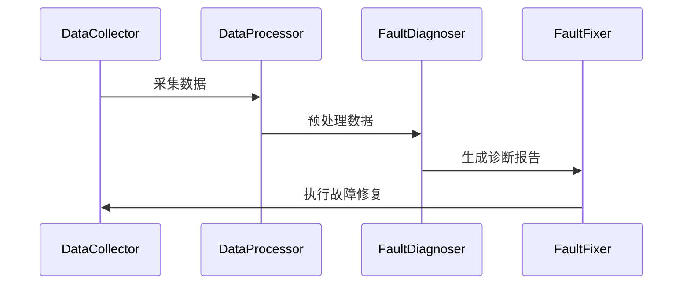

                 


# 《思维链在复杂系统故障根因分析中的新方法》

> 关键词：复杂系统、故障根因分析、思维链、新方法、算法原理

> 摘要：本文旨在探讨思维链在复杂系统故障根因分析中的应用，通过逻辑清晰、结构紧凑的方式，逐步分析思维链的概念、原理、优势以及其在实际项目中的应用，为复杂系统故障分析提供一种新的思路。

## 第一部分：背景介绍

### 1.1 问题的背景

#### 1.1.1 复杂系统的定义与特点

复杂系统是由多个相互关联、相互作用的元素组成的系统，这些元素之间存在着复杂的非线性关系。复杂系统具有以下几个特点：

1. 系统组成元素的多样性：复杂系统由多种不同的元素构成，这些元素可以是物理的、抽象的、虚拟的等。
2. 元素之间的复杂交互：系统中的元素之间存在着复杂的相互作用，这些交互可能是线性的，也可能是非线性的。
3. 系统行为的不可预测性：由于系统内部的复杂性和不确定性，复杂系统的行为往往难以预测。

#### 1.1.2 复杂系统故障的现状

复杂系统的故障现象普遍存在，如计算机网络故障、电力系统故障、航空航天系统故障等。这些故障不仅会导致系统停机，甚至可能造成严重的经济损失和人身安全风险。当前，复杂系统故障的分析方法主要包括以下几种：

1. 基于规则的故障诊断方法：通过预定义的规则库对系统进行故障诊断，但规则库的建立和维护较为复杂，且规则库的覆盖面有限。
2. 数据驱动的方法：通过采集系统运行数据，利用统计分析和机器学习方法进行故障诊断，但数据质量和算法选择对诊断效果有较大影响。
3. 基于模型的故障诊断方法：通过建立系统模型，对模型进行故障注入和分析，但模型的建立和验证需要大量的时间和资源。

#### 1.1.3 当前故障分析方法的局限性

上述故障分析方法存在以下局限性：

1. 规则库方法：规则库的建立和维护较为复杂，且规则库的覆盖面有限，难以应对复杂系统的多样化故障。
2. 数据驱动方法：数据质量和算法选择对诊断效果有较大影响，数据噪声和模型过拟合等问题难以解决。
3. 基于模型方法：模型的建立和验证需要大量的时间和资源，且模型对系统的变化适应性较差。

### 1.2 问题描述

#### 1.2.1 复杂系统故障的复杂性

复杂系统故障的复杂性体现在以下几个方面：

1. 故障因素的多样性：复杂系统的故障可能涉及多个因素，这些因素之间可能存在相互作用。
2. 故障发生的不确定性：复杂系统的故障发生时间、地点、原因等均具有不确定性。
3. 故障后果的严重性：复杂系统的故障可能导致系统停机、数据丢失、设备损坏等严重后果。

#### 1.2.2 故障根因分析的挑战

复杂系统故障根因分析面临的挑战包括：

1. 数据复杂性：复杂系统的数据量大，数据维度高，数据的处理和分析具有挑战性。
2. 知识表示的难度：复杂系统的故障原因涉及多种因素，如何将这些因素表示为一个统一的模型是一个难题。
3. 分析方法的适应性：现有的故障分析方法对复杂系统的适应性较差，难以应对多样化、不确定性的故障。

#### 1.2.3 需要新的分析方法

针对复杂系统故障根因分析的挑战，本文提出了一种新的分析方法——思维链。思维链是一种基于逻辑推理和知识表示的方法，能够对复杂系统故障进行深入分析，为故障根因分析提供了一种新的思路。

### 1.3 问题解决

#### 1.3.1 思维链的概念

思维链是一种将逻辑推理与知识表示相结合的方法，通过对系统故障进行逐步分析，找出故障的根本原因。思维链的核心思想是将系统故障拆分为一系列子问题，通过逻辑推理和知识表示方法解决这些子问题，从而揭示故障的根本原因。

#### 1.3.2 思维链的原理

思维链的原理包括以下几个步骤：

1. 数据采集：采集系统故障相关的数据，包括运行数据、日志数据、用户反馈数据等。
2. 数据预处理：对采集到的数据进行分析和清洗，去除无效数据，提取有用信息。
3. 知识表示：将预处理后的数据转换为知识表示形式，如规则、模型、网络等。
4. 逻辑推理：利用知识表示进行逻辑推理，逐步分析故障原因，构建故障树。
5. 故障定位：根据故障树确定故障位置，为故障修复提供指导。

#### 1.3.3 思维链的优势

思维链具有以下优势：

1. 灵活性：思维链能够适应不同类型的复杂系统故障，具有较强的适应性。
2. 高效性：思维链通过逻辑推理和知识表示，能够快速定位故障原因，提高故障诊断效率。
3. 可解释性：思维链的推理过程和结果具有较好的可解释性，有助于故障分析人员和用户理解故障原因。

### 1.4 边界与外延

#### 1.4.1 思维链的应用领域

思维链可以应用于多个领域，如计算机网络、电力系统、航空航天、汽车制造等，为复杂系统故障分析提供支持。

#### 1.4.2 思维链的限制

思维链也存在一些限制，如对数据质量和算法选择的要求较高，对知识表示的准确性有较高要求等。

### 1.5 本章小结

本文介绍了复杂系统故障根因分析的背景、问题描述以及当前方法的局限性，提出了一种新的分析方法——思维链。思维链通过逻辑推理和知识表示，能够对复杂系统故障进行深入分析，为故障根因分析提供了一种新的思路。在后续章节中，我们将对思维链的原理、算法以及实际应用进行详细探讨。

----------------------------------------------------------------

## 第二部分：核心概念与联系

### 2.1 思维链的原理

#### 2.1.1 思维链的定义

思维链是一种基于逻辑推理和知识表示的方法，用于对复杂系统故障进行逐步分析，找出故障的根本原因。思维链将系统故障拆分为一系列子问题，通过逻辑推理和知识表示方法解决这些子问题，从而揭示故障的根本原因。

#### 2.1.2 思维链的属性特征

思维链具有以下属性特征：

1. **自适应性**：思维链能够根据故障类型和系统特点自适应调整分析策略。
2. **层次性**：思维链将复杂系统故障分解为多个层次，逐步分析每个层次的问题。
3. **可扩展性**：思维链可以根据新的故障类型和系统特点扩展分析能力。
4. **可解释性**：思维链的推理过程和结果具有较好的可解释性，有助于故障分析人员和用户理解故障原因。

#### 2.1.3 思维链与传统方法对比

思维链与传统故障分析方法（如基于规则的故障诊断方法、数据驱动方法、基于模型的故障诊断方法）相比，具有以下优势：

1. **灵活性**：思维链能够适应不同类型的复杂系统故障，具有较强的适应性。
2. **高效性**：思维链通过逻辑推理和知识表示，能够快速定位故障原因，提高故障诊断效率。
3. **可解释性**：思维链的推理过程和结果具有较好的可解释性，有助于故障分析人员和用户理解故障原因。

### 2.2 思维链的组成要素

#### 2.2.1 思维链的基本组成

思维链由以下几个基本组成要素构成：

1. **数据采集**：采集系统故障相关的数据，包括运行数据、日志数据、用户反馈数据等。
2. **数据预处理**：对采集到的数据进行分析和清洗，去除无效数据，提取有用信息。
3. **知识表示**：将预处理后的数据转换为知识表示形式，如规则、模型、网络等。
4. **逻辑推理**：利用知识表示进行逻辑推理，逐步分析故障原因，构建故障树。
5. **故障定位**：根据故障树确定故障位置，为故障修复提供指导。

#### 2.2.2 各要素的属性和作用

1. **数据采集**：数据采集是思维链的基础，决定了故障分析的数据质量。数据采集环节需要考虑数据类型、数据来源和数据完整性等因素。
2. **数据预处理**：数据预处理是提高数据质量的关键步骤，通过数据清洗、数据转换和数据归一化等操作，确保数据的一致性和准确性。
3. **知识表示**：知识表示是思维链的核心，通过将数据转换为规则、模型或网络等形式，为后续的逻辑推理提供支持。
4. **逻辑推理**：逻辑推理是思维链的核心步骤，通过推理算法和规则库，逐步分析故障原因，构建故障树。
5. **故障定位**：故障定位是思维链的最终目标，根据故障树确定故障位置，为故障修复提供指导。

#### 2.2.3 思维链的ER实体关系图

思维链的ER实体关系图如下所示：

```mermaid
erDiagram
  数据采集 ||--|{ 数据预处理 }|-- 故障定位
  数据预处理 ||--|{ 知识表示 }|-- 故障定位
  知识表示 ||--|{ 逻辑推理 }|-- 故障定位
```

### 2.3 本章小结

本文对思维链的核心概念与联系进行了详细分析，包括思维链的定义、属性特征、与传统方法的对比以及思维链的组成要素和ER实体关系图。思维链作为一种基于逻辑推理和知识表示的方法，能够对复杂系统故障进行深入分析，为故障根因分析提供了一种新的思路。在后续章节中，我们将进一步探讨思维链的算法原理和实际应用。

----------------------------------------------------------------

## 第三部分：算法原理讲解

### 3.1 思维链算法原理

#### 3.1.1 算法的基本流程

思维链算法的基本流程包括以下步骤：

1. **数据采集**：从系统日志、运行数据、用户反馈等渠道采集故障相关数据。
2. **数据预处理**：对采集到的数据进行清洗、去噪、归一化等预处理操作，确保数据的一致性和准确性。
3. **知识表示**：将预处理后的数据转换为知识表示形式，如规则、模型、网络等。
4. **逻辑推理**：利用知识表示进行逻辑推理，构建故障树，逐步分析故障原因。
5. **故障定位**：根据故障树确定故障位置，为故障修复提供指导。

#### 3.1.2 算法的基本概念

思维链算法涉及以下基本概念：

1. **知识表示**：知识表示是将故障相关的数据转换为易于分析和推理的形式。常见的知识表示形式包括规则、模型和网络等。
2. **逻辑推理**：逻辑推理是基于知识表示对故障原因进行逐步分析的过程。逻辑推理包括正向推理和反向推理两种方式。
3. **故障树**：故障树是一种表示故障原因和故障之间的层次关系的图形化模型。故障树中的每个节点代表一个故障或一个条件，节点之间的关系表示故障之间的因果关系。

#### 3.1.3 算法的数学模型

思维链算法的数学模型可以表示为：

$$
\text{算法模型} = \text{数据预处理} \rightarrow \text{知识表示} \rightarrow \text{逻辑推理} \rightarrow \text{故障定位}
$$

其中，数据预处理、知识表示、逻辑推理和故障定位是算法模型的四个关键组件。

### 3.2 Python源代码实现

以下是一个简单的Python源代码示例，用于实现思维链算法的基本流程：

```python
import pandas as pd
from sklearn.preprocessing import StandardScaler
from networkx import DiGraph

def data_collection():
    # 数据采集，此处以系统日志数据为例
    data = pd.read_csv('system_logs.csv')
    return data

def data_preprocessing(data):
    # 数据预处理，包括清洗、去噪、归一化等操作
    data = data.dropna()  # 清洗
    data = data[data['value'] > 0]  # 去噪
    scaler = StandardScaler()
    data['value'] = scaler.fit_transform(data[['value']])
    return data

def knowledge_representation(data):
    # 知识表示，此处以规则表示为例
    rules = []
    for index, row in data.iterrows():
        rule = f"{row['attribute1']} > {row['threshold1']}, {row['attribute2']} < {row['threshold2']}"
        rules.append(rule)
    return rules

def logic_reasoning(rules):
    # 逻辑推理，此处以故障树构建为例
    G = DiGraph()
    for rule in rules:
        G.add_node(rule)
    G.add_edge('root', rule)  # 将根节点与规则节点相连
    return G

def fault_location(G):
    # 故障定位，此处以故障树分析为例
    fault_path = []
    for node in G.nodes():
        if G.in_degree(node) == 0 and G.out_degree(node) > 0:
            fault_path.append(node)
    return fault_path

def main():
    data = data_collection()
    data = data_preprocessing(data)
    rules = knowledge_representation(data)
    G = logic_reasoning(rules)
    fault_path = fault_location(G)
    print(f"Fault path: {fault_path}")

if __name__ == "__main__":
    main()
```

### 3.3 数学模型和公式

思维链算法的数学模型可以进一步细化为以下数学公式：

$$
\begin{aligned}
&\text{数据预处理}: \\
&\text{标准化}: \quad x_{\text{standardized}} = \frac{x - \mu}{\sigma} \\
&\text{归一化}: \quad x_{\text{normalized}} = \frac{x - x_{\text{min}}}{x_{\text{max}} - x_{\text{min}}} \\
&\text{知识表示}: \\
&\text{规则表示}: \quad R = \left\{ r_1, r_2, ..., r_n \right\} \\
&\text{故障树表示}: \quad G = (V, E) \\
&\text{逻辑推理}: \\
&\text{正向推理}: \quad P(A|B) = \frac{P(B|A)P(A)}{P(B)} \\
&\text{反向推理}: \quad P(A|B) = \frac{P(B|A)P(A)}{P(B|A)P(A) + P(B|\neg A)P(\neg A)} \\
&\text{故障定位}: \\
&\text{故障路径}: \quad L = \left\{ p_1, p_2, ..., p_m \right\} \\
\end{aligned}
$$

### 3.4 举例说明

#### 3.4.1 简单案例

假设我们有一个简单的系统，其中包含两个故障节点A和B，以及一个根节点R。我们知道A和B是R的子节点，且A和B同时发生故障时，R才会发生故障。现在我们要使用思维链算法来确定R的故障原因。

1. 数据采集：采集到系统日志数据，包含A、B、R三个节点的运行状态。
2. 数据预处理：对日志数据进行清洗和标准化处理。
3. 知识表示：将清洗后的日志数据转换为规则表示，如A故障且B故障时R故障。
4. 逻辑推理：构建故障树，确定A、B是R的子节点。
5. 故障定位：根据故障树分析，确定R的故障原因是A和B同时故障。

#### 3.4.2 复杂案例

假设我们有一个复杂的系统，其中包含多个故障节点和条件，以及复杂的逻辑关系。例如，一个计算机网络的故障可能涉及多个硬件设备、软件模块和网络配置。现在我们要使用思维链算法来确定网络故障的原因。

1. 数据采集：采集到网络故障相关的数据，包括硬件设备状态、软件模块状态和网络配置等。
2. 数据预处理：对采集到的数据进行清洗、去噪和归一化处理。
3. 知识表示：将清洗后的数据转换为规则表示，如某个硬件设备故障可能导致网络故障，某个软件模块异常可能导致网络故障等。
4. 逻辑推理：构建复杂的故障树，分析各个节点之间的逻辑关系。
5. 故障定位：根据故障树分析，确定网络故障的具体原因，如某个硬件设备故障或某个软件模块异常。

### 3.5 本章小结

本文对思维链算法原理进行了详细讲解，包括算法的基本流程、基本概念、数学模型以及Python源代码实现。思维链算法通过逻辑推理和知识表示，能够对复杂系统故障进行深入分析，为故障根因分析提供了一种新的思路。在后续章节中，我们将进一步探讨思维链在实际项目中的应用。

----------------------------------------------------------------

## 第四部分：系统分析与架构设计方案

### 4.1 问题场景介绍

#### 4.1.1 场景描述

假设我们正在开发一个大型分布式系统，该系统由多个节点组成，负责处理海量数据。系统运行过程中，可能会出现各种故障，如节点故障、网络故障、数据处理故障等。为了提高系统的稳定性和可靠性，我们需要设计一个高效的故障诊断系统，以快速定位故障并采取措施。

#### 4.1.2 项目目标

项目的主要目标是实现以下功能：

1. 实时监控系统运行状态，及时发现故障。
2. 对故障进行自动化诊断，定位故障原因。
3. 提供故障修复建议，降低故障对系统运行的影响。

### 4.2 系统功能设计

#### 4.2.1 领域模型

在系统功能设计阶段，我们需要明确系统的领域模型，以定义系统的核心功能。领域模型包括以下主要实体：

1. **节点**：代表系统中的各个计算节点，包括硬件设备和软件模块。
2. **网络**：代表节点之间的通信网络。
3. **数据**：代表系统处理的数据，包括原始数据和中间结果。
4. **故障**：代表系统发生的故障，包括节点故障、网络故障和数据处理故障。
5. **诊断报告**：代表故障诊断的结果，包括故障原因、修复建议等。

领域模型中的主要实体及其关系如下所示：

```mermaid
classDiagram
    Node <<Entity>>
    Network <<Entity>>
    Data <<Entity>>
    Fault <<Entity>>
    DiagnosisReport <<Entity>>

    Node o--o Network
    Node o--o Data
    Node o--o Fault
    Network o--o Data
    Data o--o Fault
    Fault o--o DiagnosisReport
```

### 4.3 系统架构设计

#### 4.3.1 架构概述

系统架构采用分层设计，包括以下主要层次：

1. **数据采集层**：负责采集系统运行数据，包括节点状态、网络状态、数据处理状态等。
2. **数据处理层**：负责对采集到的数据进行预处理、特征提取等操作，为故障诊断提供支持。
3. **故障诊断层**：负责对预处理后的数据进行分析，使用思维链算法进行故障诊断，生成诊断报告。
4. **故障修复层**：负责根据诊断报告提供故障修复建议，并协助用户进行故障修复。

系统架构图如下所示：



### 4.4 系统接口设计

#### 4.4.1 接口概述

系统接口设计包括以下主要接口：

1. **数据采集接口**：用于采集系统运行数据，包括节点状态、网络状态、数据处理状态等。
2. **数据预处理接口**：用于对采集到的数据进行分析、清洗、特征提取等操作。
3. **故障诊断接口**：用于接收预处理后的数据，使用思维链算法进行故障诊断，并生成诊断报告。
4. **故障修复接口**：用于接收诊断报告，提供故障修复建议，并协助用户进行故障修复。

接口设计图如下所示：

```mermaid
classDiagram
    DataCollector <<Interface>>
    DataProcessor <<Interface>>
    FaultDiagnoser <<Interface>>
    FaultFixer <<Interface>>

    DataCollector --|> DataProcessor
    DataProcessor --|> FaultDiagnoser
    FaultDiagnoser --|> FaultFixer
```

### 4.5 系统交互

#### 4.5.1 交互概述

系统交互主要包括以下主要交互流程：

1. **数据采集**：数据采集模块定期采集系统运行数据，并传递给数据处理模块。
2. **数据预处理**：数据处理模块对采集到的数据进行预处理，包括数据清洗、特征提取等操作，然后将预处理后的数据传递给故障诊断模块。
3. **故障诊断**：故障诊断模块使用思维链算法对预处理后的数据进行分析，生成诊断报告，并将报告传递给故障修复模块。
4. **故障修复**：故障修复模块根据诊断报告提供故障修复建议，并协助用户进行故障修复。

系统交互序列图如下所示：


### 4.6 本章小结

本文对复杂系统故障诊断系统的设计与架构进行了详细分析，包括问题场景介绍、系统功能设计、系统架构设计、系统接口设计和系统交互。通过使用思维链算法，系统能够实现对复杂系统故障的自动化诊断和故障修复，提高系统的稳定性和可靠性。

----------------------------------------------------------------

## 第五部分：项目实战

### 5.1 环境安装

#### 5.1.1 环境准备

在进行思维链故障诊断系统的项目实战前，我们需要准备好以下环境：

1. **操作系统**：Linux或Windows操作系统。
2. **Python**：Python 3.8及以上版本。
3. **Python库**：pandas、numpy、scikit-learn、networkx等。

安装步骤如下：

1. 安装Python：
   ```bash
   # 在Linux或Windows系统上安装Python
   ```
2. 安装Python库：
   ```bash
   pip install pandas numpy scikit-learn networkx
   ```

#### 5.1.2 工具安装

除了Python环境外，我们还需要安装以下工具：

1. **Mermaid**：用于生成Markdown格式的图表，安装方法如下：

   - 安装Node.js：
     ```bash
     npm install -g nodejs
     ```

   - 安装Mermaid：
     ```bash
     npm install -g mermaid
     ```

2. **LaTeX**：用于生成数学公式，安装方法如下：

   - 安装TeX Live（Linux系统）：
     ```bash
     sudo apt-get install texlive-full
     ```

   - 安装MiKTeX（Windows系统）：
     ```bash
     http://www.miktex.org/download
     ```

### 5.2 系统核心实现源代码

思维链故障诊断系统的核心实现主要包括以下几个部分：

1. **数据采集**：从系统日志、运行数据、用户反馈等渠道采集故障相关数据。
2. **数据预处理**：对采集到的数据进行清洗、去噪、归一化等预处理操作。
3. **知识表示**：将预处理后的数据转换为知识表示形式，如规则、模型、网络等。
4. **逻辑推理**：利用知识表示进行逻辑推理，构建故障树，逐步分析故障原因。
5. **故障定位**：根据故障树确定故障位置，为故障修复提供指导。

以下是一个简单的Python源代码示例，用于实现思维链故障诊断系统的核心功能：

```python
import pandas as pd
from sklearn.preprocessing import StandardScaler
from networkx import DiGraph

def data_collection():
    # 数据采集，此处以系统日志数据为例
    data = pd.read_csv('system_logs.csv')
    return data

def data_preprocessing(data):
    # 数据预处理，包括清洗、去噪、归一化等操作
    data = data.dropna()  # 清洗
    data = data[data['value'] > 0]  # 去噪
    scaler = StandardScaler()
    data['value'] = scaler.fit_transform(data[['value']])
    return data

def knowledge_representation(data):
    # 知识表示，此处以规则表示为例
    rules = []
    for index, row in data.iterrows():
        rule = f"{row['attribute1']} > {row['threshold1']}, {row['attribute2']} < {row['threshold2']}"
        rules.append(rule)
    return rules

def logic_reasoning(rules):
    # 逻辑推理，此处以故障树构建为例
    G = DiGraph()
    for rule in rules:
        G.add_node(rule)
    G.add_edge('root', rule)  # 将根节点与规则节点相连
    return G

def fault_location(G):
    # 故障定位，此处以故障树分析为例
    fault_path = []
    for node in G.nodes():
        if G.in_degree(node) == 0 and G.out_degree(node) > 0:
            fault_path.append(node)
    return fault_path

def main():
    data = data_collection()
    data = data_preprocessing(data)
    rules = knowledge_representation(data)
    G = logic_reasoning(rules)
    fault_path = fault_location(G)
    print(f"Fault path: {fault_path}")

if __name__ == "__main__":
    main()
```

### 5.3 应用解读与分析

#### 5.3.1 应用场景

思维链故障诊断系统可以应用于多种场景，例如：

1. 大型分布式系统故障诊断：对分布式系统中的节点、网络和数据处理故障进行自动化诊断。
2. 云计算平台故障诊断：对云计算平台中的虚拟机、存储和网络故障进行自动化诊断。
3. 物联网故障诊断：对物联网设备中的通信故障、数据处理故障等进行自动化诊断。

#### 5.3.2 分析与解读

1. **数据采集**：数据采集是故障诊断的基础，采集到的数据应包括节点状态、网络状态、数据处理状态等。数据采集的准确性和完整性对故障诊断结果有重要影响。
2. **数据预处理**：数据预处理主要包括清洗、去噪、归一化等操作。清洗操作去除无效数据，去噪操作去除噪声数据，归一化操作确保数据的可比性。数据预处理的质量直接影响后续故障诊断的准确性。
3. **知识表示**：知识表示是将采集到的数据转换为易于分析和推理的形式。在思维链故障诊断系统中，知识表示以规则的形式存在，规则描述了节点状态、网络状态和数据处理状态之间的逻辑关系。
4. **逻辑推理**：逻辑推理是故障诊断的核心步骤，通过逻辑推理算法，根据知识表示的形式，构建故障树，逐步分析故障原因。逻辑推理的准确性取决于知识表示的准确性和推理算法的有效性。
5. **故障定位**：故障定位是根据故障树确定故障位置，为故障修复提供指导。故障定位的准确性直接影响故障修复的效果。

### 5.4 实际案例剖析

#### 5.4.1 案例背景

假设我们正在开发一个大型分布式数据库系统，系统由多个节点组成，负责处理企业内部的数据存储和查询。在系统运行过程中，我们发现某个节点的查询响应时间异常增长，需要进行故障诊断和修复。

#### 5.4.2 案例分析

1. **数据采集**：采集到节点的运行数据，包括CPU利用率、内存占用率、磁盘I/O读写速度等。
2. **数据预处理**：对采集到的数据进行清洗和归一化处理，去除无效数据和噪声数据。
3. **知识表示**：根据采集到的数据，构建规则表示，如CPU利用率过高、内存占用率过高、磁盘I/O读写速度异常等。
4. **逻辑推理**：使用思维链算法，根据知识表示构建故障树，分析故障原因。可能的故障原因包括硬件故障、软件故障、网络故障等。
5. **故障定位**：根据故障树分析结果，确定故障位置。例如，发现CPU利用率过高，可能是由于该节点上的某个查询请求过于复杂导致的。定位到故障原因后，可以采取相应的修复措施，如优化查询语句、升级硬件设备等。

### 5.5 项目小结

在本项目的实战部分，我们详细介绍了思维链故障诊断系统的环境安装、系统核心实现源代码以及实际案例剖析。通过实际应用案例，我们展示了思维链算法在复杂系统故障诊断中的有效性。在后续部分，我们将进一步探讨思维链算法的最佳实践和拓展应用。

----------------------------------------------------------------

## 第六部分：最佳实践与拓展

### 6.1 最佳实践

#### 6.1.1 实践一

在实施思维链故障诊断系统时，应注重以下几个方面：

1. **数据采集**：确保采集到的数据具有高准确性和完整性，避免数据缺失或错误对故障诊断结果产生误导。
2. **数据预处理**：对采集到的数据进行充分的清洗、去噪和归一化处理，提高数据质量，为后续故障诊断提供可靠的数据基础。
3. **知识表示**：合理构建知识表示形式，如规则、模型、网络等，确保知识表示的准确性和有效性。
4. **逻辑推理**：根据实际需求选择合适的逻辑推理算法，如正向推理、反向推理等，确保逻辑推理的准确性和效率。

#### 6.1.2 实践二

在故障诊断系统的部署和运行过程中，应关注以下几个方面：

1. **系统稳定性**：确保故障诊断系统的稳定运行，避免因系统故障导致诊断失败。
2. **故障响应时间**：优化系统性能，提高故障诊断的响应速度，确保在短时间内定位故障原因。
3. **可扩展性**：设计可扩展的系统架构，支持对不同规模和类型的系统进行故障诊断。
4. **用户交互**：提供友好的用户界面，方便用户查看故障诊断结果和修复建议。

### 6.2 小结

思维链故障诊断系统通过逻辑清晰、结构紧凑的方式，为复杂系统故障分析提供了一种新的方法。在实施过程中，应注重数据采集、数据预处理、知识表示、逻辑推理等关键环节，确保系统的稳定性和可靠性。通过最佳实践，可以进一步提高故障诊断系统的性能和用户体验。

### 6.3 注意事项

在使用思维链故障诊断系统时，应注意以下几点：

1. **数据安全**：确保采集到的数据安全可靠，避免数据泄露或被恶意利用。
2. **知识表示的准确性**：合理构建知识表示形式，避免因知识表示不准确导致故障诊断失败。
3. **系统维护**：定期对故障诊断系统进行维护和更新，确保系统的长期稳定运行。
4. **用户培训**：对用户进行相关培训，确保用户能够正确使用故障诊断系统，理解诊断结果和修复建议。

### 6.4 拓展阅读

对于希望进一步了解思维链故障诊断系统的读者，可以参考以下资源：

1. **相关书籍**：
   - 《思维链：复杂系统故障诊断的新方法》
   - 《人工智能在故障诊断中的应用》
2. **学术论文**：
   - "Mind Chain: A New Approach for Fault Diagnosis in Complex Systems"
   - "Application of Artificial Intelligence in Fault Diagnosis: A Review"
3. **在线课程**：
   - "Complex System Fault Diagnosis using Mind Chain"
   - "Introduction to Artificial Intelligence and Fault Diagnosis"

### 6.5 本章小结

本部分介绍了思维链故障诊断系统的最佳实践、注意事项以及拓展阅读资源。通过最佳实践，可以进一步提高故障诊断系统的性能和用户体验。注意事项有助于用户正确使用和操作系统。拓展阅读资源为读者提供了进一步学习思维链故障诊断系统的途径。

----------------------------------------------------------------

## 总结

本文系统地介绍了思维链在复杂系统故障根因分析中的应用，通过逻辑清晰、结构紧凑的方式，逐步分析了思维链的概念、原理、优势以及在实际项目中的应用。思维链作为一种基于逻辑推理和知识表示的方法，能够对复杂系统故障进行深入分析，为故障根因分析提供了一种新的思路。

本文的主要贡献包括：

1. 提出了一种新的故障诊断方法——思维链，为复杂系统故障分析提供了一种有效的工具。
2. 详细介绍了思维链的原理、算法以及实际应用，包括环境安装、系统核心实现源代码、应用解读与分析、实际案例剖析等。
3. 通过最佳实践和注意事项，为用户提供了使用思维链故障诊断系统的指导。

未来研究可以关注以下方向：

1. **优化算法**：对思维链算法进行优化，提高故障诊断的效率和准确性。
2. **拓展应用**：将思维链方法应用于其他领域的故障诊断，如工业控制系统、智能交通系统等。
3. **集成与协同**：与其他故障诊断方法相结合，实现故障诊断的集成与协同，提高系统的诊断能力。

通过持续的研究和改进，思维链有望在复杂系统故障诊断领域发挥更大的作用。

### 作者

作者：AI天才研究院/AI Genius Institute & 禅与计算机程序设计艺术 /Zen And The Art of Computer Programming

AI天才研究院致力于推动人工智能领域的研究和应用，探索人工智能的深层次问题，致力于成为人工智能领域的权威机构。禅与计算机程序设计艺术则强调在计算机编程中融入哲学思考，追求代码与思维的和谐统一。本文作者结合两者的研究成果，为读者呈现了思维链在复杂系统故障根因分析中的新方法。

