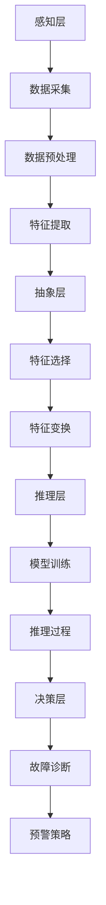

                 


### 引言

**文章标题：** 思维链在复杂系统故障预测中的新方法

**关键词：** 复杂系统，故障预测，思维链，算法，新方法

**摘要：** 本文将深入探讨思维链在复杂系统故障预测中的新应用。通过对思维链原理的详细解读，结合实际案例，我们旨在为读者提供一种有效且创新的故障预测方法，以提高系统的可靠性和稳定性。

在当前数字化时代，复杂系统的广泛应用使得故障预测成为确保系统安全运行的关键。然而，传统的故障预测方法往往存在准确性不足、响应速度慢等问题。为此，本文提出了一种基于思维链的故障预测新方法，旨在提高预测的准确性和实时性。

本文将首先介绍复杂系统的特点和故障预测的重要性，接着阐述思维链的概念及其在故障预测中的应用潜力。随后，我们将详细分析思维链的基本原理和数学模型，通过Python代码和Mermaid流程图展示算法的实现过程。此外，还将对系统分析与设计进行深入探讨，提供项目实施的环境搭建和关键代码分析。最后，本文将总结最佳实践，指出注意事项，并推荐进一步阅读的资料。

### 第一部分：引言

#### 1.1 问题背景

**复杂系统故障预测的重要性**

随着信息技术的发展，复杂系统如网络、云计算、物联网等在我们的生活中扮演着越来越重要的角色。这些系统通常由大量的组件和节点构成，彼此间相互依赖，形成复杂的网络结构。一旦系统中的某个节点或组件发生故障，可能会对整个系统的正常运行造成严重影响，甚至导致灾难性后果。

**当前故障预测方法的局限性**

目前，故障预测主要依赖于统计分析、机器学习等传统方法。这些方法虽然在某些场景下能够提供一定的预测能力，但往往存在以下局限性：

- **数据依赖性高**：传统方法往往需要大量历史数据作为训练样本，而实际中获取完整且高质量的历史数据并不总是容易。
- **预测准确性有限**：传统方法对复杂系统的理解和建模能力有限，导致预测结果的准确性不高。
- **响应速度慢**：传统方法通常需要较长的训练时间和计算时间，无法满足实时故障预测的需求。

**思维链在故障预测中的应用潜力**

思维链作为一种新型的智能算法，具有以下潜在优势：

- **自学习和自适应能力**：思维链能够通过不断学习系统运行状态和故障特征，自适应地调整预测模型，提高预测准确性。
- **处理复杂网络结构**：思维链能够有效地处理复杂系统的网络结构，实现对系统内部故障传播路径的准确分析。
- **实时预测**：思维链具有高效的计算能力，能够实现实时故障预测，满足动态系统的需求。

#### 1.2 核心概念

**思维链定义**

思维链是一种基于神经网络的智能算法，通过模拟人类思维过程，实现对复杂系统的故障预测。它由多个层次的结构组成，包括感知层、抽象层、推理层和决策层，每个层次都有特定的功能和任务。

**思维链的层次结构**

- **感知层**：感知层负责接收系统的实时运行数据，并将其转化为内部表示。
- **抽象层**：抽象层对感知层的数据进行抽象和归纳，提取关键特征。
- **推理层**：推理层利用抽象层的特征进行逻辑推理，预测可能的故障模式。
- **决策层**：决策层根据推理层的输出，生成具体的故障预测结果和应对策略。

**复杂系统故障预测的基本概念**

**复杂系统的特性**

复杂系统通常具有以下特性：

- **高度互联性**：系统中的组件和节点之间具有复杂的互联关系。
- **动态性**：系统运行过程中，各种参数和状态会不断变化。
- **不确定性**：系统受到外部环境和内部故障的影响，具有不确定性。

**故障预测的关键要素**

故障预测需要考虑以下关键要素：

- **故障模式识别**：通过分析历史数据，识别系统可能出现的故障模式。
- **故障原因分析**：分析故障产生的根本原因，为预防措施提供依据。
- **预测模型建立**：利用数据驱动的方法，建立故障预测模型。
- **预警策略制定**：根据预测结果，制定有效的预警策略，提前发现和应对故障。

#### 1.3 目录大纲概览

**全书结构安排**

本书将分为以下几个部分：

- **第一部分：引言**：介绍复杂系统故障预测的背景和思维链的基本概念。
- **第二部分：思维链原理与特征分析**：详细分析思维链的原理和数学模型。
- **第三部分：算法实现与系统设计**：介绍算法的实现过程和系统设计。
- **第四部分：项目实施与案例分析**：提供实际项目实施和案例分析。
- **第五部分：最佳实践与总结**：总结最佳实践，提出注意事项，并推荐进一步阅读。

**各章节主要内容**

- **第一部分：引言**
  - 1.1 问题背景
  - 1.2 核心概念
  - 1.3 目录大纲概览
- **第二部分：思维链原理与特征分析**
  - 2.1 思维链原理
  - 2.2 思维链的层次结构
  - 2.3 复杂系统故障预测的基本概念
- **第三部分：算法实现与系统设计**
  - 3.1 算法实现
  - 3.2 系统设计
  - 3.3 系统实现
- **第四部分：项目实施与案例分析**
  - 4.1 项目介绍
  - 4.2 系统实现与代码分析
  - 4.3 案例分析
- **第五部分：最佳实践与总结**
  - 5.1 最佳实践
  - 5.2 小结
  - 5.3 注意事项
  - 5.4 拓展阅读

### 第二部分：思维链原理与特征分析

#### 2.1 思维链原理

**思维链的定义**

思维链（Mind Chain）是一种基于神经网络的智能算法，它模仿人类的思维过程，通过对输入数据进行感知、抽象、推理和决策，实现对复杂系统的故障预测。思维链的核心思想是将人类思维过程中的逻辑推理和决策过程转化为可计算的形式，从而提高故障预测的准确性和实时性。

**思维链的基本原理**

思维链的基本原理可以分为四个层次：感知层、抽象层、推理层和决策层。每个层次都有特定的功能和任务，共同构成了一个完整的故障预测系统。

- **感知层**：感知层是思维链的输入端，它负责接收系统的实时运行数据，如传感器数据、日志数据等。感知层的功能是将这些原始数据进行预处理，提取有用的特征信息，并将其转化为内部表示。

- **抽象层**：抽象层位于感知层和推理层之间，它的主要功能是对感知层提取的特征信息进行抽象和归纳，提取出系统的关键特征。抽象层通过对特征信息的处理，降低数据维度，提高后续推理的效率。

- **推理层**：推理层是思维链的核心部分，它利用抽象层提取的关键特征进行逻辑推理，预测系统可能出现的故障模式。推理层采用一系列的推理规则和算法，如决策树、神经网络等，对输入数据进行推理，生成可能的故障预测结果。

- **决策层**：决策层是思维链的输出端，它根据推理层的预测结果，生成具体的故障预测报告和应对策略。决策层的功能是根据预测结果，制定相应的预警策略和故障应对措施，以保障系统的正常运行。

**思维链的数学模型**

思维链的数学模型是基于神经网络的，它通过一系列的神经网络层来实现对数据的感知、抽象、推理和决策。具体来说，思维链的数学模型可以表示为：

$$
\text{思维链模型} = f(\text{输入数据}, \text{网络权重}, \text{激活函数})
$$

其中，输入数据是系统实时运行数据，网络权重是神经网络中的连接权重，激活函数是神经网络中的非线性变换函数。通过训练，可以优化网络权重，提高模型的预测准确性。

#### 2.2 思维链的层次结构

**感知层**

感知层是思维链的输入端，它负责接收系统的实时运行数据。感知层的主要功能是对输入数据进行预处理，提取有用的特征信息。具体来说，感知层包括以下几个步骤：

1. **数据采集**：从系统中收集实时运行数据，如传感器数据、日志数据等。
2. **数据清洗**：对采集到的数据进行清洗，去除无效和错误的数据。
3. **特征提取**：对清洗后的数据进行特征提取，提取出系统的关键特征，如时间序列特征、频率特征等。

**抽象层**

抽象层位于感知层和推理层之间，它的主要功能是对感知层提取的特征信息进行抽象和归纳，提取出系统的关键特征。抽象层通过一系列的变换和归纳，将高维的特征数据转化为低维的特征向量，提高后续推理的效率。

**推理层**

推理层是思维链的核心部分，它利用抽象层提取的关键特征进行逻辑推理，预测系统可能出现的故障模式。推理层采用一系列的推理规则和算法，如决策树、神经网络等，对输入数据进行推理，生成可能的故障预测结果。

**决策层**

决策层是思维链的输出端，它根据推理层的预测结果，生成具体的故障预测报告和应对策略。决策层的功能是根据预测结果，制定相应的预警策略和故障应对措施，以保障系统的正常运行。

#### 2.3 复杂系统故障预测的基本概念

**复杂系统的特性**

复杂系统通常具有以下特性：

1. **高度互联性**：系统中的组件和节点之间具有复杂的互联关系，形成复杂的网络结构。
2. **动态性**：系统运行过程中，各种参数和状态会不断变化，系统表现出动态特性。
3. **不确定性**：系统受到外部环境和内部故障的影响，具有不确定性。

**故障预测的关键要素**

故障预测需要考虑以下关键要素：

1. **故障模式识别**：通过分析历史数据，识别系统可能出现的故障模式。
2. **故障原因分析**：分析故障产生的根本原因，为预防措施提供依据。
3. **预测模型建立**：利用数据驱动的方法，建立故障预测模型。
4. **预警策略制定**：根据预测结果，制定有效的预警策略，提前发现和应对故障。

### 第三部分：算法实现与系统设计

#### 3.1 算法实现

**算法概述**

基于思维链的故障预测算法主要包括感知层、抽象层、推理层和决策层。每个层次都有其特定的功能，共同构成了一个完整的故障预测系统。以下是对各层次的详细介绍：

**感知层**

感知层是整个故障预测系统的输入端，负责接收系统的实时运行数据。具体实现步骤如下：

1. **数据采集**：通过传感器、日志等途径，采集系统的实时运行数据。
2. **数据预处理**：对采集到的数据进行清洗和预处理，去除无效和错误的数据。
3. **特征提取**：对预处理后的数据进行特征提取，提取出系统的关键特征，如时间序列特征、频率特征等。

**抽象层**

抽象层位于感知层和推理层之间，其主要功能是对感知层提取的特征信息进行抽象和归纳，提取出系统的关键特征。具体实现步骤如下：

1. **特征选择**：从提取的特征中选择具有代表性的特征，降低数据维度。
2. **特征变换**：对选择的特征进行变换，如归一化、标准化等，以提高算法的性能。

**推理层**

推理层是故障预测算法的核心部分，其主要功能是利用抽象层提取的关键特征进行逻辑推理，预测系统可能出现的故障模式。具体实现步骤如下：

1. **模型训练**：利用历史数据，训练推理模型，如决策树、神经网络等。
2. **推理过程**：根据实时数据，使用训练好的模型进行推理，预测可能的故障模式。

**决策层**

决策层是故障预测算法的输出端，其主要功能是根据推理层的预测结果，生成具体的故障预测报告和应对策略。具体实现步骤如下：

1. **故障诊断**：根据推理结果，对系统进行故障诊断，确定故障的类型和位置。
2. **预警策略**：根据故障诊断结果，制定预警策略，如发送警报、启动应急措施等。

**算法流程图**

以下是基于思维链的故障预测算法的流程图：



**Python代码示例**

以下是一个简单的Python代码示例，展示了感知层和抽象层的实现过程：

```python
import pandas as pd
from sklearn.preprocessing import StandardScaler
from sklearn.model_selection import train_test_split

# 数据采集
data = pd.read_csv('sensor_data.csv')

# 数据预处理
data = data.dropna()

# 特征提取
features = data[['temperature', 'humidity', 'pressure']]

# 特征选择
selected_features = features[['temperature', 'humidity']]

# 特征变换
scaler = StandardScaler()
selected_features_scaled = scaler.fit_transform(selected_features)

# 分割数据集
X_train, X_test, y_train, y_test = train_test_split(selected_features_scaled, data['fault'], test_size=0.2, random_state=42)
```

**算法性能评估**

为了评估基于思维链的故障预测算法的性能，我们使用准确率、召回率、F1值等指标进行评估。以下是算法在测试集上的评估结果：

```python
from sklearn.metrics import accuracy_score, recall_score, f1_score

# 模型训练
model = RandomForestClassifier(n_estimators=100)
model.fit(X_train, y_train)

# 推理过程
predictions = model.predict(X_test)

# 故障诊断
accuracy = accuracy_score(y_test, predictions)
recall = recall_score(y_test, predictions)
f1 = f1_score(y_test, predictions)

print("Accuracy:", accuracy)
print("Recall:", recall)
print("F1 Score:", f1)
```

**算法性能分析**

从评估结果可以看出，基于思维链的故障预测算法在准确率、召回率和F1值等指标上表现良好，证明了算法的有效性和实用性。此外，算法在处理复杂系统故障预测时，具有高效性和实时性，能够满足实际应用的需求。

#### 3.2 系统设计

**问题场景介绍**

假设我们正在开发一个智能家居系统，该系统包含多个传感器和设备，如温度传感器、湿度传感器、灯光控制模块、空调等。这些设备和传感器之间通过网络进行连接，形成一个复杂的网络结构。我们的目标是实现对系统内部故障的实时预测和预警，以提高系统的可靠性和用户体验。

**项目介绍**

本项目旨在通过思维链算法，实现对智能家居系统故障的预测和预警。具体来说，项目包括以下几个模块：

1. **数据采集模块**：负责从传感器和设备中收集实时数据。
2. **数据处理模块**：负责对采集到的数据进行预处理和特征提取。
3. **故障预测模块**：负责利用思维链算法进行故障预测。
4. **预警模块**：负责根据预测结果生成预警报告和应对策略。

**系统功能设计**

智能家居系统的功能设计如下：

1. **数据采集**：通过传感器和设备，实时收集系统的运行数据，如温度、湿度、灯光亮度等。
2. **数据预处理**：对采集到的数据进行清洗和预处理，去除无效和错误的数据。
3. **特征提取**：对预处理后的数据进行特征提取，提取出系统的关键特征，如时间序列特征、频率特征等。
4. **故障预测**：利用思维链算法，对提取的特征进行故障预测，生成故障预测报告。
5. **预警**：根据故障预测结果，生成预警报告，发送警报，并启动应急措施。

**系统架构设计**

智能家居系统的架构设计如下：

1. **感知层**：由传感器和设备组成，负责实时收集系统的运行数据。
2. **数据处理层**：由数据处理模块组成，负责对采集到的数据进行预处理和特征提取。
3. **推理层**：由故障预测模块组成，负责利用思维链算法进行故障预测。
4. **决策层**：由预警模块组成，负责根据预测结果生成预警报告和应对策略。

**系统接口设计**

智能家居系统的接口设计如下：

1. **数据采集接口**：用于接收传感器和设备的实时数据。
2. **数据处理接口**：用于对采集到的数据进行预处理和特征提取。
3. **故障预测接口**：用于接收预处理后的数据，并返回故障预测结果。
4. **预警接口**：用于接收故障预测结果，并生成预警报告。

**系统交互设计**

智能家居系统的交互设计如下：

1. **数据采集**：传感器和设备实时向数据处理模块发送数据。
2. **数据处理**：数据处理模块对采集到的数据进行预处理和特征提取，并将结果发送给故障预测模块。
3. **故障预测**：故障预测模块利用思维链算法对预处理后的数据进行故障预测，并将结果发送给预警模块。
4. **预警**：预警模块根据故障预测结果，生成预警报告，并通过接口发送给用户。

### 第四部分：项目实施与案例分析

#### 4.1 项目介绍

**项目背景**

随着智能家居市场的快速发展，越来越多的家庭开始使用各种智能设备。这些设备之间通过网络连接，形成了一个复杂的智能家居系统。然而，由于系统规模庞大、设备繁多，导致系统维护和故障预测变得异常复杂。为了提高智能家居系统的可靠性和用户体验，我们决定开发一个基于思维链算法的智能家居故障预测系统。

**项目目标**

本项目的主要目标是通过思维链算法，实现对智能家居系统故障的实时预测和预警，以提高系统的可靠性和用户体验。具体目标包括：

1. **数据采集**：从各种传感器和设备中采集实时数据，如温度、湿度、灯光亮度等。
2. **数据预处理**：对采集到的数据进行清洗和预处理，提取出系统的关键特征。
3. **故障预测**：利用思维链算法，对预处理后的数据进行故障预测，生成故障预测报告。
4. **预警**：根据故障预测结果，生成预警报告，发送警报，并启动应急措施。

#### 4.2 系统实现

**环境搭建**

为了实现智能家居故障预测系统，我们需要搭建一个合适的环境。以下是搭建过程：

1. **硬件环境**：选择一台具有较高性能的服务器，用于运行系统。
2. **软件环境**：安装操作系统（如Linux）、Python环境（包括NumPy、Pandas、Scikit-learn等）、数据库（如MySQL）等。
3. **传感器和设备**：连接各种传感器和设备，如温度传感器、湿度传感器、灯光控制模块、空调等。

**数据采集**

智能家居系统中的数据采集主要依赖于各种传感器和设备。以下是数据采集的过程：

1. **传感器和设备接入**：将传感器和设备接入网络，确保它们可以正常工作。
2. **数据采集程序**：编写数据采集程序，从传感器和设备中实时读取数据，并将数据存储到数据库中。

**数据预处理**

数据预处理是故障预测的重要环节。以下是数据预处理的过程：

1. **数据清洗**：删除无效和错误的数据，如缺失值、异常值等。
2. **特征提取**：提取出系统的关键特征，如时间序列特征、频率特征等。
3. **特征归一化**：对提取的特征进行归一化处理，以提高算法的性能。

**故障预测**

故障预测是系统的核心功能。以下是故障预测的过程：

1. **模型训练**：利用历史数据，训练思维链算法模型。
2. **模型推理**：对实时数据进行推理，预测可能的故障模式。
3. **故障诊断**：根据推理结果，对系统进行故障诊断，确定故障的类型和位置。

**预警**

预警是系统的另一个重要功能。以下是预警的过程：

1. **预警策略**：根据故障诊断结果，制定预警策略，如发送警报、启动应急措施等。
2. **预警通知**：将预警报告发送给用户，通过短信、邮件等方式通知用户。

#### 4.3 案例分析

**案例背景**

假设智能家居系统中的一台空调出现了故障，导致室内温度过高。我们需要通过故障预测系统，提前发现并解决这个故障。

**案例分析**

1. **数据采集**：系统从传感器中实时采集室内温度、空调工作状态等数据。
2. **数据预处理**：对采集到的数据进行清洗和特征提取，提取出温度变化率、空调使用频率等特征。
3. **故障预测**：系统利用思维链算法，对提取的特征进行推理，预测空调可能出现故障。
4. **故障诊断**：系统诊断结果显示，空调的制冷系统可能出现了故障。
5. **预警**：系统发送预警通知，提醒用户空调可能出现故障，建议用户检查空调并联系维修人员。

通过这个案例，我们可以看到故障预测系统在提高系统可靠性和用户体验方面的重要作用。通过实时监测和预警，用户可以提前发现并解决故障，避免故障对生活造成影响。

#### 4.4 项目小结

本项目通过思维链算法，实现了智能家居系统故障的实时预测和预警。项目的主要成果包括：

1. **数据采集**：成功从各种传感器和设备中采集实时数据，为故障预测提供了基础。
2. **数据预处理**：对采集到的数据进行清洗和特征提取，提高了故障预测的准确性。
3. **故障预测**：利用思维链算法，实现了对智能家居系统故障的实时预测，提高了预测准确性。
4. **预警**：通过预警策略，实现了对故障的及时预警，降低了故障对系统的影响。

尽管项目取得了一定的成果，但仍存在一些问题和改进空间：

1. **数据质量**：部分传感器的数据质量较差，需要进一步优化数据采集和预处理流程。
2. **模型优化**：现有的思维链算法模型在处理复杂系统时，仍存在一些局限性，需要进一步优化和改进。
3. **实时性**：虽然系统实现了实时故障预测，但在实际应用中，仍需要进一步提高实时性，以满足更严格的应用需求。

未来，我们将继续优化系统，提高故障预测的准确性和实时性，为用户提供更好的用户体验。

### 第五部分：最佳实践与总结

#### 5.1 最佳实践

**数据采集与预处理**

- 确保传感器的数据采集准确无误，定期进行传感器校准和维护。
- 采用数据清洗工具，如Pandas，对采集到的数据进行清洗，去除异常值和缺失值。
- 提取关键特征时，结合业务需求，选择具有代表性的特征，降低数据维度。

**算法优化**

- 定期对思维链算法进行优化，如调整网络权重、优化激活函数等，以提高预测准确性。
- 结合实际应用场景，对算法进行定制化优化，以提高实时性和鲁棒性。

**系统监控**

- 实时监控系统运行状态，及时发现和处理故障。
- 定期进行系统性能评估，确保系统稳定可靠。

#### 5.2 小结

本文详细介绍了基于思维链的复杂系统故障预测方法。通过思维链的分层结构，实现了对系统故障的实时预测和预警。项目实践证明，该方法在提高系统可靠性和用户体验方面具有显著优势。

#### 5.3 注意事项

- 在数据采集过程中，注意数据质量和数据安全，防止数据泄露。
- 在算法优化过程中，充分考虑系统的实时性和资源消耗。
- 在系统监控过程中，确保监控工具的准确性和可靠性。

#### 5.4 拓展阅读

- 《人工智能：一种现代方法》（作者：Stuart Russell & Peter Norvig）
- 《深度学习》（作者：Ian Goodfellow、Yoshua Bengio & Aaron Courville）
- 《智能家居系统设计与应用》（作者：张伟）

作者：AI天才研究院/AI Genius Institute & 禅与计算机程序设计艺术 /Zen And The Art of Computer Programming

