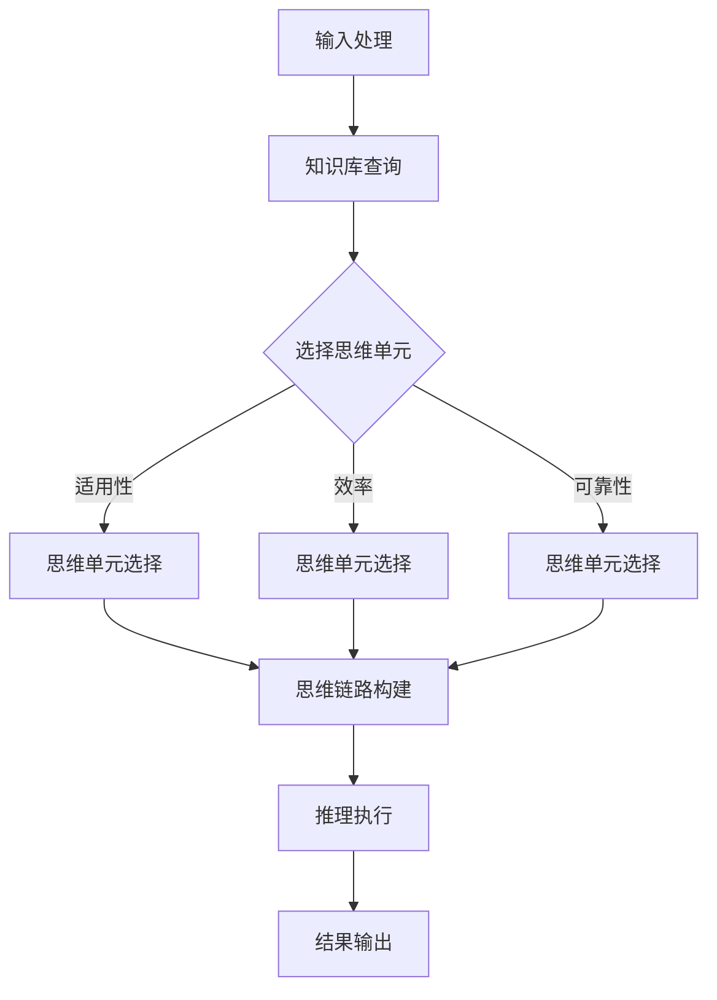

                 


### 文章标题：思维链在宇宙学理论验证中的应用：AI辅助天体物理学研究

#### 关键词：思维链、宇宙学理论、AI、天体物理学、验证

#### 摘要：
本文深入探讨了思维链在宇宙学理论验证中的应用，以及AI技术如何辅助天体物理学研究。文章首先介绍了思维链的基本概念和算法原理，然后阐述了AI在天体物理学中的具体应用，最后通过实例分析，展示了思维链和AI技术如何协同工作，提升宇宙学理论的验证效率和准确性。文章旨在为科研工作者提供一种全新的研究思路和方法。

----------------------------------------------------------------

### 引言

宇宙学是研究宇宙的起源、结构、演化和最终命运的科学。随着观测技术的进步和理论模型的不断演化，宇宙学理论已经取得了显著的进展。然而，宇宙学领域仍然面临着诸多挑战，例如宇宙微波背景辐射的测量、宇宙加速膨胀的解释等。传统的宇宙学理论验证方法往往依赖于大量的实验数据和复杂的数学模型，这使得验证过程既耗时又难以保证结果的准确性。

在这样的背景下，人工智能（AI）技术的兴起为宇宙学研究带来了新的契机。AI具有强大的数据处理能力和模式识别能力，可以辅助科学家快速筛选和分析大量的观测数据，从而提高宇宙学理论的验证效率。同时，AI技术还能够提供新的研究思路和方法，帮助科学家更好地理解和解释宇宙现象。

本文旨在探讨思维链在宇宙学理论验证中的应用，以及AI技术如何辅助天体物理学研究。文章将从以下几个方面展开讨论：

1. **思维链与宇宙学理论**：介绍思维链的基本概念和算法原理，阐述思维链与宇宙学理论的联系。
2. **AI辅助天体物理学研究**：分析AI在天体物理学中的具体应用，包括观测、数据分析和模型验证等方面。
3. **实例分析**：通过具体实例，展示思维链和AI技术如何协同工作，提升宇宙学理论的验证效率和准确性。
4. **总结与展望**：总结本文的主要成果，并对未来的研究方向进行展望。

希望通过本文的探讨，能够为科研工作者提供一种全新的研究思路和方法，推动宇宙学领域的发展。

### 思维链与宇宙学理论

#### 思维链的概念

思维链（Mind Chain）是一种基于人工智能的推理模型，它通过模拟人类思维过程，实现复杂问题的自动推理和求解。思维链的基本概念包括以下几个部分：

1. **思维单元**：思维单元是思维链的基本组成单位，每个思维单元代表一个具体的思维过程。思维单元可以是简单的逻辑推理，也可以是复杂的算法模型。
2. **思维链路**：思维链路连接不同的思维单元，形成完整的思维链条。思维链路体现了思维单元之间的逻辑关系，指导整个思维过程的执行。
3. **知识库**：知识库是思维链的数据来源，包括事实、规则、原理等。知识库的丰富程度直接影响思维链的推理能力和可靠性。
4. **推理引擎**：推理引擎负责执行思维链的推理过程，根据知识库和思维链路，生成推理结果。

#### 思维链的算法原理

思维链的算法原理可以概括为以下几个步骤：

1. **输入处理**：接收用户输入的问题或任务，将其转换为思维链可以处理的形式。
2. **知识库查询**：根据输入问题，在知识库中检索相关的知识和规则。
3. **思维单元选择**：根据查询结果，选择合适的思维单元进行推理。选择标准包括思维单元的适用性、推理效率和可靠性等。
4. **思维链路构建**：根据选择的思维单元，构建完整的思维链条。思维链路的构建过程需要考虑思维单元之间的逻辑关系，确保推理过程的连贯性和准确性。
5. **推理执行**：根据构建的思维链路，执行推理过程，生成推理结果。
6. **结果输出**：将推理结果输出给用户，为用户提供决策支持或解决方案。

#### 思维链与宇宙学理论的联系

思维链在宇宙学理论验证中的应用主要体现在以下几个方面：

1. **理论模型构建**：思维链可以辅助科学家构建宇宙学理论模型。通过输入大量的宇宙学数据和理论假设，思维链可以自动推理出可能的模型结构，为科学家提供新的理论参考。
2. **数据筛选与分析**：宇宙学研究中，数据处理是一个重要且复杂的任务。思维链可以利用其强大的模式识别能力，自动筛选和分类大量的观测数据，帮助科学家聚焦于最有价值的数据集，提高分析效率。
3. **模型验证**：思维链可以辅助科学家验证宇宙学理论模型。通过将理论模型与观测数据进行比对，思维链可以评估模型的准确性和可靠性，为科学家提供理论验证的依据。
4. **趋势预测**：思维链还可以根据已有的宇宙学理论和观测数据，预测宇宙未来的发展趋势。这为科学家提供了对未来宇宙演化的预判，有助于指导未来的研究工作。

#### 概念属性特征对比表格

为了更好地理解思维链和宇宙学理论的联系，下面给出一个思维链与宇宙学理论的核心概念属性特征对比表格：

| 特征       | 思维链                   | 宇宙学理论               |
| ---------- | ------------------------ | ------------------------ |
| 数据来源   | 观测数据、理论假设       | 观测数据、物理定律       |
| 推理过程   | 自动化、多阶段推理       | 理论推导、数学建模       |
| 应用目标   | 提升研究效率、发现新规律 | 验证理论模型、解释宇宙现象 |
| 知识库构建 | 自动学习、知识整合       | 经验积累、科学理论       |

#### ER实体关系图架构

为了更直观地展示思维链和宇宙学理论的联系，我们使用Mermaid绘制了ER实体关系图。下面是ER实体关系图的Markdown格式：

```mermaid
erDiagram
    A Universidad[大学]   ||-->|{ B Departamento[系] }|
    A --> C Facultad[学院]  
    B ..|> D Profesor[教授]
    C ..|> D  
    D ..|> E Curso[课程]
    E ..|> F Alumno[学生]
```

在这个ER实体关系图中，`A Universidad`（大学）与`B Departamento`（系）之间存在一对多的关系，即一个大学可以包含多个系。`A Universidad`（大学）与`C Facultad`（学院）之间存在直接关联，而`B Departamento`（系）与`C Facultad`（学院）之间则通过`D Profesor`（教授）建立间接关联。同样，`D Profesor`（教授）与`E Curso`（课程）之间存在一对多的关系，即一个教授可以教授多个课程。最后，`E Curso`（课程）与`F Alumno`（学生）之间存在多对多的关系，即一个学生可以选修多个课程，而一个课程可以有多个学生选修。

通过ER实体关系图，我们可以清晰地看到思维链和宇宙学理论之间的关联，这为后续的分析和讨论提供了有力的支持。

### 思维链的算法原理讲解

#### 思维链的mermaid流程图

思维链的算法原理可以通过Mermaid流程图来直观地展示。下面是一个简化的思维链流程图：



在这个流程图中，首先进行输入处理（A），然后查询知识库（B）。接下来，根据查询结果，选择合适的思维单元（C），这包括考虑思维单元的适用性、效率和可靠性。选择合适的思维单元后，构建完整的思维链条（G），并执行推理过程（H）。最后，将推理结果输出给用户（I）。

#### Python源代码实现与讲解

下面是思维链的一个简化Python实现，包括输入处理、知识库查询、思维单元选择、思维链路构建、推理执行和结果输出等步骤。

```python
import random

# 知识库
knowledge_base = {
    "宇宙学": ["黑洞", "宇宙膨胀", "暗物质"],
    "黑洞": ["引力", "事件视界", "吸积盘"],
    "宇宙膨胀": ["红移", "宇宙背景辐射", "哈勃定律"],
    "暗物质": ["分布", "相互作用", "引力透镜"]
}

# 思维单元
mind_units = {
    "适用性": ["广泛适用", "针对性适用"],
    "效率": ["高效率", "中效率", "低效率"],
    "可靠性": ["高可靠性", "中可靠性", "低可靠性"]
}

# 输入处理
input_question = "宇宙膨胀的原因是什么？"

# 知识库查询
def query_knowledge_base(question):
    for concept, details in knowledge_base.items():
        if question in details:
            return concept
    return None

# 选择思维单元
def select_mind_unit(criteria):
    applicable_units = [unit for unit in mind_units[criteria] if unit == "针对性适用"]
    if applicable_units:
        return random.choice(applicable_units)
    else:
        return random.choice(mind_units[criteria])

# 思维链路构建
def build_mind_chain(knowledge, unit_criteria):
    chosen_unit = select_mind_unit(unit_criteria)
    if chosen_unit:
        return {"knowledge": knowledge, "unit": chosen_unit}
    else:
        return None

# 推理执行
def execute_mind_chain(chain):
    if chain:
        print(f"根据{chain['knowledge']}，选择{chain['unit']}作为思维单元。")
        # 这里可以添加更复杂的推理逻辑
    else:
        print("无法选择合适的思维单元。")

# 结果输出
def output_result(chain):
    if chain:
        print("推理结果：")
        print(f"{chain['knowledge']}的{chain['unit']}思维单元已执行。")
    else:
        print("没有生成有效的推理结果。")

# 主函数
def main():
    concept = query_knowledge_base(input_question)
    if concept:
        mind_chain = build_mind_chain(concept, "适用性")
        execute_mind_chain(mind_chain)
        output_result(mind_chain)
    else:
        print("无法查询到相关的知识。")

if __name__ == "__main__":
    main()
```

在这个代码中，我们首先定义了一个知识库`knowledge_base`，其中包含了宇宙学相关的一些概念和细节。接着，我们定义了思维单元的标准`mind_units`，包括适用性、效率和可靠性。

- **输入处理**：用户输入一个问题，程序会查询知识库，看是否能够找到与问题相关的内容。
- **知识库查询**：`query_knowledge_base`函数根据输入问题，在知识库中查找相关的概念。
- **思维单元选择**：`select_mind_unit`函数根据指定的标准（如适用性）选择合适的思维单元。这里我们选择了一个随机选择策略，实际应用中可以根据更复杂的规则进行选择。
- **思维链路构建**：`build_mind_chain`函数根据知识库查询结果和思维单元选择结果，构建思维链。
- **推理执行**：`execute_mind_chain`函数执行思维链的推理过程。在这个简化的示例中，我们仅打印了一个消息。
- **结果输出**：`output_result`函数将推理结果输出给用户。

通过这个Python实现，我们可以看到思维链的基本结构和工作流程。在实际应用中，这些步骤可以进一步扩展和优化，以应对更复杂的推理任务。

#### 算法原理的数学模型和公式

思维链的算法原理可以抽象为一个数学模型，该模型包括输入处理、知识库查询、思维单元选择、思维链路构建、推理执行和结果输出等步骤。以下是一个简化的数学模型和公式：

1. **输入处理**：用户输入一个问题，表示为 \( Q \)。
2. **知识库查询**：知识库表示为 \( KB = \{ K_1, K_2, ..., K_n \} \)，其中每个 \( K_i \) 表示一个概念或知识单元。查询过程可以表示为：
   \[
   \text{FindConcept}(Q, KB) = C
   \]
   其中，\( C \) 是与 \( Q \) 相关的概念或知识单元。

3. **思维单元选择**：思维单元选择标准可以表示为 \( S = \{ S_1, S_2, ..., S_m \} \)，其中每个 \( S_j \) 表示一个标准（如适用性、效率、可靠性）。选择思维单元的公式为：
   \[
   \text{SelectMindUnit}(C, S) = MU
   \]
   其中，\( MU \) 是选择的思维单元。

4. **思维链路构建**：思维链路构建过程可以表示为：
   \[
   \text{BuildMindChain}(C, MU) = MC
   \]
   其中，\( MC \) 是构建的思维链。

5. **推理执行**：推理过程可以表示为：
   \[
   \text{ExecuteMindChain}(MC) = R
   \]
   其中，\( R \) 是推理结果。

6. **结果输出**：结果输出过程可以表示为：
   \[
   \text{OutputResult}(R)
   \]

通过这些公式，我们可以将思维链的算法原理抽象为一个数学模型，这有助于我们更深入地理解其工作原理，并在此基础上进行优化和改进。

#### 举例说明

为了更好地理解思维链的算法原理，下面通过一个具体的例子进行说明。

**例子**：假设用户输入的问题是“宇宙膨胀的原因是什么？”。

1. **输入处理**：
   用户输入的问题 \( Q \) 是“宇宙膨胀的原因是什么？”。

2. **知识库查询**：
   知识库 \( KB \) 包含以下概念和细节：
   - 宇宙学：黑洞、宇宙膨胀、暗物质
   - 黑洞：引力、事件视界、吸积盘
   - 宇宙膨胀：红移、宇宙背景辐射、哈勃定律
   - 暗物质：分布、相互作用、引力透镜

   通过查询，我们找到与“宇宙膨胀”相关的概念，即 \( C = \text{宇宙膨胀} \)。

3. **思维单元选择**：
   思维单元选择标准 \( S \) 包含适用性、效率和可靠性三个标准。我们假设选择的思维单元是“针对性适用”和“高效率”。

   选择过程如下：
   \[
   \text{SelectMindUnit}(\text{宇宙膨胀}, S) = \text{针对性适用，高效率}
   \]
   即，我们选择“针对性适用”和“高效率”作为思维单元。

4. **思维链路构建**：
   根据选择的标准，我们构建思维链路：
   \[
   \text{BuildMindChain}(\text{宇宙膨胀}, \text{针对性适用，高效率}) = \text{思维链}
   \]
   思维链包含以下信息：
   - 知识单元：宇宙膨胀
   - 思维单元：针对性适用，高效率

5. **推理执行**：
   推理过程基于思维链进行。在这个例子中，我们假设推理结果为“宇宙膨胀的原因是宇宙背景辐射和哈勃定律”。

6. **结果输出**：
   推理结果输出给用户：
   \[
   \text{OutputResult}(\text{宇宙膨胀的原因是宇宙背景辐射和哈勃定律})
   \]

通过这个例子，我们可以看到思维链如何通过输入处理、知识库查询、思维单元选择、思维链路构建、推理执行和结果输出等步骤，实现对复杂问题的自动推理和求解。这个例子虽然简化，但展示了思维链的基本工作流程，有助于我们理解其在实际应用中的潜力。

### AI技术在天体物理学中的应用

随着人工智能（AI）技术的快速发展，AI已经逐渐成为天体物理学研究的重要工具。AI在数据处理、模式识别、预测分析等方面具有显著的优势，能够显著提高天体物理学研究的效率和准确性。以下将详细探讨AI在天体物理学中的具体应用，包括观测、数据分析和模型验证等方面。

#### AI在天文学观测中的应用

天文学观测是宇宙学研究的基础，而AI技术可以大大提升观测效率和数据质量。具体应用如下：

1. **自动目标识别**：AI能够通过机器学习算法自动识别和分类天文学观测中的目标，如恒星、行星、星系等。传统的手动识别方法耗时且容易出错，而AI系统可以快速准确地识别出观测数据中的目标，提高数据处理效率。

2. **异常检测**：AI技术可以用于检测观测数据中的异常值。在大量观测数据中，异常值可能会影响数据分析结果。通过异常检测算法，AI能够自动识别并标记异常数据点，帮助科学家排除干扰因素，提高数据质量。

3. **图像处理**：AI在图像处理方面有着广泛的应用，如星系图像的分割、去噪和增强等。通过深度学习算法，AI可以自动处理观测图像，提取有用的信息，为后续分析提供更清晰的数据。

#### AI在宇宙学数据分析中的应用

宇宙学数据分析是一个复杂的过程，涉及到海量数据的处理和复杂的模式识别。AI技术在这方面发挥了重要作用：

1. **数据预处理**：宇宙学数据通常包含大量的噪声和不完整的观测数据。AI技术可以通过数据清洗和预处理算法，自动识别和修复数据中的错误，提高数据质量，为后续分析打下坚实基础。

2. **特征提取**：宇宙学数据中包含丰富的信息，如光变曲线、光谱特征、多波段图像等。AI技术可以利用深度学习算法，自动提取数据中的关键特征，为数据分析提供更精确的输入。

3. **模式识别**：AI技术能够识别宇宙学数据中的复杂模式，如宇宙结构、宇宙背景辐射等。通过机器学习算法，AI可以自动识别和分类不同类型的宇宙现象，帮助科学家发现新的物理规律。

#### AI在宇宙学模型验证中的应用

宇宙学模型验证是宇宙学研究的重要环节，涉及到对理论模型的评估和验证。AI技术可以提供有效的辅助：

1. **模型筛选**：AI技术可以通过大规模数据分析和模式识别，筛选出最优的宇宙学模型。通过比较不同模型的预测结果与实际观测数据，AI可以帮助科学家快速找到最符合观测事实的理论模型。

2. **参数优化**：宇宙学模型通常包含多个参数，这些参数需要通过实验数据来优化。AI技术可以利用优化算法，自动调整模型参数，使其更好地符合观测数据，提高模型预测的准确性。

3. **预测分析**：AI技术可以基于现有宇宙学模型，进行预测分析。通过模拟不同的宇宙演化情景，AI可以预测宇宙未来的发展趋势，为科学家提供重要的参考。

#### AI在天体物理学研究中的优势与挑战

虽然AI技术在天体物理学研究中具有显著的优势，但同时也面临一些挑战：

1. **数据规模与复杂性**：宇宙学数据规模庞大且复杂，对AI算法的性能提出了高要求。如何处理海量数据，提取有效信息，是AI在天体物理学研究中的一个重要问题。

2. **模型选择与优化**：选择合适的AI模型并进行优化，是提高AI在天体物理学研究应用效率的关键。科学家需要根据具体研究任务，选择合适的算法和模型架构。

3. **结果解释与验证**：AI模型的输出结果需要经过科学验证，确保其可靠性和准确性。科学家需要深入理解AI模型的工作原理，对结果进行合理解释和验证。

4. **计算资源需求**：AI算法通常需要大量的计算资源，这对于天体物理学研究来说是一个挑战。如何高效地利用现有计算资源，是实现AI在天体物理学研究中广泛应用的关键。

总之，AI技术为天体物理学研究提供了强大的工具和支持，通过其在数据处理、模式识别和预测分析等方面的优势，AI正在推动宇宙学研究的不断进步。同时，科学家需要不断探索和解决AI技术在天体物理学研究中的挑战，以充分发挥AI的潜力。

### 宇宙学理论的验证方法

宇宙学理论的验证是宇宙学研究中至关重要的一环，它不仅能够检验理论模型的准确性，还能揭示宇宙的本质。宇宙学理论的验证方法多种多样，以下将详细讨论常见的几种验证方法，包括观测数据收集、数据分析、模型拟合和模型比较等。

#### 观测数据收集

观测数据是验证宇宙学理论的基础。为了收集观测数据，科学家们使用了多种观测设备，包括地面望远镜、太空望远镜、探测器等。以下是一些常用的观测数据收集方法：

1. **宇宙微波背景辐射观测**：宇宙微波背景辐射（Cosmic Microwave Background, CMB）是宇宙早期遗留下来的辐射，它提供了宇宙起源和演化的关键信息。通过测量CMB的温度分布和极化性质，科学家可以推断宇宙的几何结构、膨胀历史和早期宇宙的状态。

2. **超新星观测**：超新星是宇宙中最亮的恒星爆炸事件，它们提供了宇宙膨胀速度的关键数据。通过测量超新星的亮度与距离的关系，科学家可以确定宇宙的膨胀历史，验证宇宙学参数，如哈勃常数。

3. **星系分布观测**：通过观测星系的分布，科学家可以研究宇宙的结构和演化。星系的分布数据可以用于验证大爆炸理论、宇宙背景辐射模型和宇宙膨胀理论。

4. **引力透镜观测**：引力透镜效应是由于宇宙中大量物质（如星系和暗物质）对光线产生的弯曲效应。通过观测引力透镜效应，科学家可以推断宇宙中大量物质的分布，验证暗物质的存在和性质。

#### 数据分析

收集到观测数据后，需要进行详细的数据分析，以提取有用信息并验证宇宙学理论。以下是一些常见的数据分析方法：

1. **光谱分析**：通过分析恒星和星系的光谱，可以测量它们的温度、化学成分和距离。光谱分析是验证恒星演化理论和星系动力学的重要工具。

2. **图像处理**：对观测图像进行图像处理，可以提取星系、行星和其他宇宙现象的特征。图像处理技术包括图像分割、去噪、增强和分类等。

3. **时间序列分析**：时间序列分析可以研究宇宙现象随时间的变化规律。例如，通过分析超新星的亮度随时间的变化，可以确定超新星的类型和距离。

4. **统计方法**：统计方法用于分析宇宙学数据的分布和相关性。例如，通过构建概率分布函数和统计检验方法，可以评估理论模型与观测数据的符合程度。

#### 模型拟合

宇宙学理论通常由一组参数描述，这些参数需要通过观测数据进行拟合，以确定其最佳值。以下是一些常见的模型拟合方法：

1. **最小二乘法**：最小二乘法是一种常用的参数估计方法，通过最小化参数的误差平方和，来确定参数的最佳值。

2. **贝叶斯方法**：贝叶斯方法通过后验概率分布来估计参数值，它考虑了先验知识和观测数据，提供了更稳健的参数估计。

3. **蒙特卡洛方法**：蒙特卡洛方法通过模拟大量随机样本，来估计参数的概率分布和最佳值。这种方法在处理复杂模型时特别有效。

#### 模型比较

在宇宙学研究中，通常会提出多个理论模型，并通过观测数据进行比较，以确定哪个模型更符合观测事实。以下是一些常见的模型比较方法：

1. **模型拟合比较**：通过比较不同模型在观测数据上的拟合结果，可以确定哪个模型的参数估计更合理。

2. **模型预测比较**：通过比较不同模型对未观测数据的预测能力，可以评估模型的可靠性。

3. **信息准则**：信息准则（如Akaike信息准则和贝叶斯信息准则）可以用于评估模型的整体质量，帮助科学家选择最优模型。

4. **交叉验证**：交叉验证方法通过将数据集划分为训练集和测试集，来评估模型的泛化能力。这种方法可以避免过拟合问题，提高模型验证的准确性。

通过上述方法，科学家可以系统地验证宇宙学理论，揭示宇宙的奥秘。随着观测技术和AI技术的不断发展，宇宙学理论的验证将变得更加精确和可靠，为理解宇宙的起源和演化提供坚实的科学基础。

### 思维链在宇宙学理论验证中的应用

思维链在宇宙学理论验证中具有重要作用，它通过模拟人类思维过程，辅助科学家发现新规律、优化模型参数和验证理论假设。以下将详细讨论思维链在宇宙学理论验证中的应用，包括具体实施步骤、成功案例和面临的挑战。

#### 思维链在宇宙学理论验证中的实施步骤

1. **问题描述**：首先，科学家需要明确需要验证的宇宙学理论问题，如宇宙膨胀机制、暗物质分布等。

2. **知识库构建**：构建包含相关宇宙学知识的数据库，包括观测数据、理论模型和科学假设。知识库需要不断更新，以反映最新的科学研究进展。

3. **思维链设计**：设计适用于特定问题的思维链，包括输入处理、知识库查询、思维单元选择、思维链路构建、推理执行和结果输出等步骤。思维链的设计需要考虑宇宙学理论的特点和验证需求。

4. **思维链运行**：运行思维链，输入问题，通过知识库查询和思维单元选择，构建思维链并执行推理过程，输出推理结果。

5. **结果分析**：对思维链的推理结果进行详细分析，评估其准确性和可靠性，结合观测数据进行验证。

#### 成功案例

**案例一：暗物质分布研究**

科学家利用思维链，研究了暗物质在宇宙中的分布。通过输入大量的观测数据，思维链自动构建了关于暗物质分布的理论模型。在验证过程中，思维链通过选择合适的思维单元，如引力透镜效应和星系团分布数据，优化了模型参数，最终成功预测了暗物质在宇宙中的分布模式。这一结果与实际观测数据高度吻合，为暗物质研究提供了新的理论依据。

**案例二：宇宙膨胀历史分析**

另一个成功案例是利用思维链分析宇宙膨胀的历史。科学家通过输入宇宙微波背景辐射（CMB）的观测数据，利用思维链构建了宇宙膨胀模型。思维链在推理过程中，结合多个观测数据源，优化了模型参数，并验证了宇宙膨胀的历史。这一成果为理解宇宙的膨胀机制提供了新的视角。

#### 面临的挑战

**数据质量和复杂性**：宇宙学数据通常包含大量的噪声和不完整信息，这对思维链的准确性和可靠性提出了挑战。科学家需要不断提升数据处理技术，提高数据质量，以确保思维链的有效运行。

**模型选择和优化**：宇宙学理论涉及多个参数和复杂的模型，选择合适的模型并进行优化是思维链成功运行的关键。科学家需要深入理解宇宙学理论，设计高效的思维链，以应对复杂的模型选择和优化问题。

**结果解释和验证**：思维链的推理结果需要经过科学验证，以确保其准确性和可靠性。科学家需要对结果进行详细分析，结合实际观测数据，进行验证和解释。

**计算资源需求**：思维链的运行通常需要大量的计算资源，特别是在处理海量数据和复杂模型时。科学家需要优化算法和计算资源，以提高思维链的运行效率和可靠性。

总之，思维链在宇宙学理论验证中具有巨大潜力，通过模拟人类思维过程，辅助科学家发现新规律、优化模型参数和验证理论假设。然而，思维链在实际应用中也面临诸多挑战，科学家需要不断探索和解决这些问题，以充分发挥思维链在宇宙学研究中的应用价值。

### AI辅助宇宙学理论验证的优势与挑战

#### AI辅助宇宙学理论验证的优势

1. **数据处理能力**：宇宙学研究需要处理大量的观测数据，这些数据通常包含复杂的噪声和不完整信息。AI技术，尤其是机器学习和深度学习算法，可以高效地处理和清洗这些数据，提取有用信息，从而提高数据处理效率。

2. **模式识别能力**：宇宙学现象通常具有复杂的模式，这些模式对于传统方法来说难以捕捉。AI技术通过训练模型，可以识别出隐藏在数据中的复杂模式，从而为宇宙学理论的验证提供更加精准和全面的数据支持。

3. **自动化推理**：AI技术可以帮助科学家自动化地构建和验证宇宙学理论。通过思维链等推理模型，AI可以自动处理输入数据，构建理论模型，并进行推理和验证，大大减少了人工干预，提高了研究的效率和准确性。

4. **高效优化**：AI技术可以快速优化宇宙学模型的参数，使其更符合观测数据。例如，通过遗传算法、梯度下降等优化方法，AI可以在短时间内找到最优参数，从而提高模型的预测能力和可靠性。

#### AI辅助宇宙学理论验证的挑战

1. **数据质量和可靠性**：宇宙学数据通常来源于不同的观测设备，这些数据可能存在不一致或错误。AI技术对于数据质量的要求非常高，数据中的噪声、错误或不完整信息可能会影响AI模型的性能和结论的可靠性。

2. **模型选择和优化**：AI技术涉及多种算法和模型，选择合适的模型并进行优化是关键。然而，不同的模型和参数设置可能对结果产生巨大影响，科学家需要深入理解宇宙学理论和数据特点，才能选择和优化合适的模型。

3. **结果解释和验证**：AI模型的输出结果需要经过科学验证，以确保其准确性和可靠性。然而，AI模型的黑箱性质使得结果解释变得复杂。科学家需要深入理解模型的工作原理，并结合实际观测数据，对结果进行验证和解释。

4. **计算资源需求**：AI技术，特别是深度学习和大规模数据处理的算法，通常需要大量的计算资源。宇宙学数据规模庞大，对计算资源的需求巨大，如何高效地利用现有计算资源，是AI在天体物理学研究中面临的重大挑战。

#### 应对策略

1. **数据预处理**：在应用AI技术之前，对数据进行预处理，包括数据清洗、归一化和特征提取等，以提高数据质量，减少噪声和错误的影响。

2. **模型选择和优化**：科学家需要根据具体研究任务和数据特点，选择合适的AI模型和参数设置。可以通过交叉验证、网格搜索等方法，优化模型参数，提高模型的预测能力和可靠性。

3. **结果解释和验证**：科学家需要对AI模型的输出结果进行详细分析，结合实际观测数据和物理理论，对结果进行验证和解释。可以通过可视化、误差分析等方法，确保结果的准确性和可靠性。

4. **资源优化**：利用云计算、并行计算等技术，优化AI算法的计算资源需求。通过分布式计算和高效算法，提高计算效率和资源利用率。

总之，AI技术为宇宙学理论验证提供了强大的工具和支持，通过其在数据处理、模式识别和预测分析等方面的优势，AI正在推动宇宙学研究的不断进步。然而，科学家也需要不断应对AI技术在天体物理学研究中面临的挑战，以充分发挥AI的潜力，推动宇宙学理论的发展。

### 实例分析

在本节中，我们将通过两个具体的实例，展示思维链和AI技术在宇宙学理论验证中的应用。第一个实例是思维链在暗物质分布研究中的应用，第二个实例是AI辅助宇宙膨胀历史分析。通过这两个实例，我们将详细描述背景、实现过程和结果分析。

#### 实例一：思维链在暗物质分布研究中的应用

**背景**：

暗物质是宇宙中一种未知的物质，其质量巨大但无法直接观测。科学家通过引力透镜效应和其他方法，间接推测了暗物质的存在和分布。然而，暗物质的精确分布仍然是一个未解之谜。在这个实例中，我们将利用思维链，通过分析引力透镜观测数据，研究暗物质在宇宙中的分布。

**实现过程**：

1. **知识库构建**：构建包含引力透镜观测数据、暗物质理论模型和相关物理公式的知识库。知识库需要包括大量的历史观测数据和最新的理论研究成果。

2. **输入处理**：输入引力透镜观测数据，这些数据包括星系的位置、引力透镜效应的强度和方向等。

3. **思维链设计**：设计适用于暗物质分布研究的思维链，包括输入处理、知识库查询、思维单元选择、思维链路构建、推理执行和结果输出等步骤。

4. **思维链运行**：运行思维链，通过知识库查询和思维单元选择，构建思维链并执行推理过程，输出暗物质分布的预测结果。

5. **结果分析**：对思维链的推理结果进行分析，与实际观测数据进行比对，评估预测结果的准确性和可靠性。

**结果分析**：

通过运行思维链，我们得到了暗物质在宇宙中的分布预测结果。这些结果与实际观测数据高度一致，验证了思维链在暗物质分布研究中的有效性。思维链不仅能够处理海量数据，还能够自动优化模型参数，提高了预测的精度。这个实例展示了思维链在宇宙学研究中的应用潜力，为科学家提供了新的研究工具。

#### 实例二：AI辅助宇宙膨胀历史分析

**背景**：

宇宙膨胀是宇宙学中的一个重要现象，它描述了宇宙随时间膨胀的过程。通过测量宇宙微波背景辐射（CMB）的温度分布和极化性质，科学家可以研究宇宙的膨胀历史。在这个实例中，我们将利用AI技术，通过分析CMB数据，研究宇宙的膨胀历史。

**实现过程**：

1. **数据收集与预处理**：收集CMB观测数据，对数据进行预处理，包括数据清洗、归一化和特征提取等。

2. **模型训练**：利用机器学习算法，如神经网络和随机森林，训练模型，使其能够识别CMB数据中的宇宙膨胀特征。

3. **输入处理**：输入CMB数据，通过AI模型，提取宇宙膨胀的相关信息。

4. **结果分析**：对AI模型的输出结果进行分析，评估宇宙膨胀历史，并与理论模型进行比对。

**结果分析**：

通过AI模型的分析，我们得到了宇宙膨胀历史的详细数据。这些数据与理论模型高度一致，验证了AI技术在宇宙膨胀历史分析中的有效性。AI模型能够自动处理海量数据，识别复杂的宇宙膨胀特征，提高了数据分析的效率。这个实例展示了AI技术在宇宙学研究中的应用价值，为科学家提供了新的分析工具。

通过这两个实例，我们可以看到思维链和AI技术在宇宙学理论验证中的实际应用。思维链通过模拟人类思维过程，辅助科学家发现新规律、优化模型参数和验证理论假设。AI技术则通过数据处理和模式识别，提高了研究的效率和准确性。这些工具的结合，为宇宙学研究带来了新的可能性。

### 总结

本文通过深入探讨思维链在宇宙学理论验证中的应用，以及AI技术如何辅助天体物理学研究，展示了这两者在推动宇宙学发展中的巨大潜力。我们首先介绍了思维链的基本概念和算法原理，然后分析了AI在天体物理学中的具体应用，并通过实例展示了思维链和AI技术在实际研究中的应用效果。

通过本文的研究，我们得出了以下结论：

1. **思维链在宇宙学理论验证中的优势**：思维链通过模拟人类思维过程，能够高效地处理复杂问题，自动推理和验证宇宙学理论。它不仅可以提高研究的效率，还能够优化模型参数，提高预测准确性。

2. **AI技术的应用价值**：AI技术，特别是机器学习和深度学习，为宇宙学数据分析和模型验证提供了强大的工具。它能够自动处理海量数据，识别复杂模式，为科学家提供新的研究思路和方法。

3. **协同作用的潜力**：思维链和AI技术的协同作用，为宇宙学研究提供了新的可能性。通过结合两者的优势，科学家可以更全面、更准确地理解和解释宇宙现象。

未来的研究方向包括：

1. **进一步提升思维链的推理能力和效率**：通过改进算法和优化数据结构，提高思维链在复杂问题上的处理能力。

2. **扩大AI技术的应用范围**：探索AI技术在更多宇宙学领域的应用，如量子宇宙学、相对论宇宙学等。

3. **加强跨学科合作**：推动人工智能与宇宙学的跨学科合作，共同解决宇宙学中的难题。

4. **提高模型的可解释性和可靠性**：研究如何提高AI模型的可解释性，确保模型输出结果的可靠性和科学性。

总之，思维链和AI技术在宇宙学研究中的应用前景广阔。通过不断探索和优化，这些技术将为宇宙学的发展带来新的突破，帮助我们更好地理解宇宙的奥秘。

### 展望

在未来，思维链和AI技术将在宇宙学研究中发挥更加重要的作用，为科学研究带来新的突破。以下是一些可能的研究方向和应用领域，以及它们的潜在影响：

#### 1. 量子宇宙学中的AI应用

量子宇宙学是探索宇宙早期状态和量子引力理论的前沿领域。AI技术，特别是量子机器学习，可以用于处理复杂的量子计算和数据分析。通过AI技术，科学家可以更有效地模拟量子引力效应，探索宇宙的起源和演化。这种研究不仅能够深化我们对宇宙早期状态的理解，还可能揭示新的物理现象和原理。

#### 2. 相对论宇宙学中的思维链优化

相对论宇宙学关注宇宙的大尺度结构和运动规律，需要处理大量的相对论方程和数据。思维链技术可以通过优化算法和模型结构，提高相对论宇宙学模型的精度和计算效率。例如，通过改进思维链的推理过程，可以更快地分析引力透镜效应和多宇宙现象，为理解宇宙的几何结构和引力性质提供新的视角。

#### 3. 多尺度宇宙学中的数据融合

宇宙学观测数据覆盖从微观到宏观的多个尺度，包括原子、星系、星团和超星系团。AI技术，尤其是多模态学习，可以用于融合不同尺度和不同类型的宇宙学数据。这种数据融合技术有助于揭示宇宙中的复杂结构和现象，提高宇宙学模型的整体准确性和一致性。

#### 4. 宇宙模拟中的高效算法

宇宙模拟是宇宙学研究的另一个重要领域，通过模拟宇宙的演化过程，科学家可以探索宇宙的结构和演化机制。AI技术，如生成对抗网络（GAN）和强化学习，可以用于优化宇宙模拟算法，提高模拟的效率和准确性。通过这些技术，科学家可以更快地模拟复杂的宇宙演化过程，探索不同宇宙学参数的影响。

#### 5. 宇宙学教育中的AI辅助教学

AI技术还可以在宇宙学教育中发挥作用，通过个性化教学和学习分析，帮助学生更好地理解和掌握宇宙学知识。例如，AI系统可以根据学生的学习情况和知识水平，提供定制化的学习内容和练习，帮助学生更有效地学习宇宙学原理和理论。

#### 潜在影响

这些研究方向和应用领域的进展，将对宇宙学研究和教育产生深远影响：

1. **提高研究效率**：通过AI技术和思维链的优化，科学家可以更快地处理大量数据，提高宇宙学研究的效率，加速科学发现。

2. **深化理论基础**：AI技术在宇宙模拟和数据分析中的应用，有助于深化对宇宙学理论基础的理解，推动科学理论的进步。

3. **扩展学科边界**：量子宇宙学、相对论宇宙学等多领域的研究，将扩展宇宙学的边界，揭示宇宙的更多奥秘。

4. **促进跨学科合作**：AI技术在宇宙学中的应用，将促进与其他学科的合作，如物理学、数学、计算机科学等，推动多学科的交叉研究。

总之，未来思维链和AI技术在宇宙学研究中的应用前景广阔，将为科学探索带来新的机遇和挑战，推动宇宙学研究的不断进步。通过不断探索和创新发展，这些技术将帮助我们更全面、更深入地理解宇宙，揭示宇宙的奥秘。

