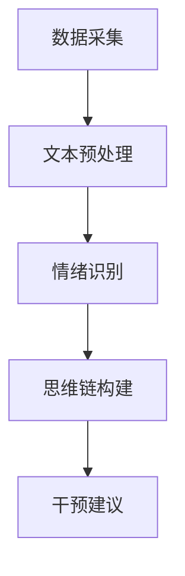

                 

### 摘要

本文深入探讨思维链在心理咨询中的应用，特别是人工智能（AI）辅助治疗的新方向。首先，我们将回顾心理咨询的现状和挑战，以及AI技术如何介入其中。接着，文章将详细解释思维链的概念、构成及其在心理咨询中的作用。通过案例分析，我们将会看到思维链如何被应用于情绪诊断、认知行为疗法和心理测评等领域。文章还探讨了AI辅助心理咨询面临的挑战和对策，并展望了其未来的发展趋势。通过这一系列的讨论，本文旨在为心理咨询领域提供一个基于AI的新工具和方向，以促进更高效、个性化的心理治疗。

### 关键词

- 心理咨询
- 人工智能
- 思维链
- 情绪诊断
- 认知行为疗法
- 心理测评
- AI辅助治疗
- 智能心理咨询系统

### 第一部分：背景与理论基础

#### 第1章：心理咨询与AI技术概述

##### 1.1 心理咨询的现状与挑战

心理咨询是现代社会中不可或缺的一部分，它通过专业的心理干预和治疗帮助个体解决心理困扰、情绪问题和行为问题。然而，当前心理咨询领域面临着诸多挑战。首先，心理咨询的资源分布不均衡，尤其在偏远地区，专业的心理咨询师资源稀缺。其次，传统的面对面心理咨询存在时间限制和地域限制，无法满足广大需求者的即时需求。此外，心理咨询过程中的信息记录和分析也相对繁琐，影响了治疗效果的跟踪和评估。

##### 1.2 AI技术在心理咨询中的应用

随着人工智能技术的发展，AI技术开始逐步介入心理咨询领域，为解决上述问题提供了新的可能性。首先，AI可以通过自然语言处理（NLP）技术分析用户的言语和行为，提供即时的心理评估和反馈。其次，基于大数据和机器学习的AI系统可以预测个体可能的心理问题，从而提前进行干预。此外，AI还可以通过虚拟现实（VR）和增强现实（AR）技术为心理咨询提供更加沉浸式和个性化的体验。

##### 1.3 思维链的概念与作用

思维链是一种基于认知科学的心理学理论，它描述了个体思维过程中的信息流动和转换。思维链的核心观点是，思维活动是由一系列相互关联的思考单元组成的，这些思考单元通过逻辑、情感和记忆等机制相互作用，形成一个复杂的思维网络。在心理咨询中，思维链的应用主要体现在以下几个方面：

1. **情感调节**：通过识别和干预思维链中的负面思维模式，帮助个体调整情绪状态。
2. **认知重建**：通过引导个体构建更积极的思维链，促进认知行为的改变。
3. **问题解决**：思维链可以帮助个体在复杂情境中找到有效的解决方案。

总之，AI技术与思维链的结合为心理咨询提供了一种全新的方法和工具，有助于提升治疗效果，实现个性化、精准化的心理干预。

### 第二部分：核心概念与理论框架

#### 第2章：思维链的核心概念与理论框架

##### 2.1 思维链的定义与构成

思维链是一种基于认知科学的心理学理论，它旨在描述和解释人类思维活动的过程和机制。思维链的定义可以从两个方面理解：一是作为一种心理现象，思维链是大脑在处理信息时形成的一系列思考单元；二是作为一种理论模型，思维链是心理学研究中用于理解和预测思维过程的工具。

思维链的基本构成包括以下几个部分：

1. **思考单元**：思考单元是思维链的基本组成部分，每个单元包含了一个具体的信息处理过程，如逻辑推理、情感分析、记忆检索等。
2. **节点与链接**：思维链中的节点代表思考单元，链接则表示节点之间的逻辑和情感关系。
3. **信息流动**：思维链中的信息流动描述了各个思考单元之间如何传递和处理信息。

##### 2.2 思维链的理论基础

思维链的理论基础主要来源于认知科学和心理学领域。在认知科学中，思维链与信息处理模型密切相关，它借鉴了计算机科学中的图论和网络理论，通过模拟大脑中神经元之间的连接和互动来解释思维过程。在心理学领域，思维链则与认知行为理论、情感认知理论和信息加工模型等理论有着紧密的联系。

1. **认知行为理论**：认知行为理论强调认知过程在情绪和行为中的作用，思维链的概念为这一理论提供了一个操作化的工具，帮助研究者更好地理解和干预负面思维模式。
2. **情感认知理论**：情感认知理论认为情感与认知过程是相互影响的，思维链模型通过描述情感和认知之间的互动关系，为情感调节提供了新的视角。
3. **信息加工模型**：信息加工模型关注大脑如何处理和存储信息，思维链的理论框架则为这一模型提供了具体的操作化方法，有助于深入分析思维过程的细节。

##### 2.3 思维链与其他相关理论的对比

思维链作为一种新兴的理论模型，与现有的其他心理学理论存在一定的区别和联系。

1. **与认知行为理论的区别**：认知行为理论主要关注认知过程对行为的影响，而思维链则更侧重于描述思维过程的动态性和复杂性，通过节点和链接来模拟思维活动。
2. **与情感认知理论的区别**：情感认知理论强调情感和认知之间的相互作用，而思维链则将情感作为思维链中的一个重要组成部分，通过链接来描述情感和认知之间的动态关系。
3. **与信息加工模型的区别**：信息加工模型关注大脑如何处理和存储信息，而思维链则更侧重于思维过程的实时性和互动性，通过信息流动来模拟思维活动的动态过程。

尽管存在差异，思维链与其他理论之间的联系仍然非常紧密。例如，认知行为理论和情感认知理论可以为思维链的研究提供理论基础和实证数据，而信息加工模型则可以为思维链的模拟和优化提供技术支持。通过跨学科的整合，思维链理论有望在心理咨询领域发挥更大的作用。

### 第三部分：AI辅助心理咨询的算法原理

#### 第3章：AI辅助心理咨询的算法原理

##### 3.1 AI辅助心理咨询的算法简介

AI辅助心理咨询的核心在于利用机器学习和自然语言处理技术来分析和解释个体的话语和情绪，进而提供个性化的心理干预。这一过程通常涉及以下几个步骤：

1. **数据采集**：通过文本聊天、语音输入或传感器采集用户的信息。
2. **文本预处理**：清洗和标准化原始文本数据，以便进行进一步分析。
3. **情绪识别**：利用情感分析模型检测用户的情绪状态。
4. **思维链构建**：基于用户的话语和情绪，构建其思维链模型。
5. **干预建议**：根据思维链模型提供个性化的心理干预建议。

##### 3.2 算法mermaid流程图

为了更好地理解AI辅助心理咨询的算法原理，我们可以使用mermaid流程图来描述其工作流程：



在该流程图中，A表示数据采集阶段，B表示文本预处理阶段，C表示情绪识别阶段，D表示思维链构建阶段，E表示干预建议阶段。每个阶段都通过特定的算法和技术实现，为心理咨询提供了完整的支持。

##### 3.3 Python源代码与数学模型讲解

为了详细讲解AI辅助心理咨询的算法原理，我们将展示一个简单的Python源代码示例，并解释其背后的数学模型。

```python
# Python源代码示例：情绪识别算法
import nltk
from nltk.sentiment import SentimentIntensityAnalyzer

# 初始化情绪分析器
sia = SentimentIntensityAnalyzer()

# 示例文本
text = "我感到非常开心，今天是个美好的一天！"

# 获取情绪得分
scores = sia.polarity_scores(text)

# 打印情绪得分
print(scores)

# 数学模型讲解：情绪得分计算
def calculate_sentiment(text):
    """
    计算文本的情绪得分
    :param text: 文本内容
    :return: 情绪得分字典
    """
    scores = sia.polarity_scores(text)
    return scores

# 测试数学模型
example_text = "我很沮丧，感觉无法面对生活中的压力。"
sentiment_scores = calculate_sentiment(example_text)
print(sentiment_scores)
```

在这个示例中，我们使用了自然语言处理库nltk中的SentimentIntensityAnalyzer类来计算文本的情绪得分。情绪得分包括正面情绪得分（`pos_score`）、负面情绪得分（`neg_score`）、中性情绪得分（`neu_score`）和复合情绪得分（`compound_score`）。复合情绪得分是一个介于-1和1之间的数值，其中1表示非常积极的情绪，-1表示非常消极的情绪，0表示中性情绪。

$$
\text{复合情绪得分} = \frac{\sum_{i=1}^{n} w_i \cdot s_i}{\sum_{i=1}^{n} w_i}
$$

其中，$w_i$是每个词汇的权重，$s_i$是每个词汇的情感得分。通过这个公式，我们可以将文本中的各个词汇的情感得分加权求和，得到整体的复合情绪得分。

这个简单的示例展示了如何使用Python源代码实现情绪识别算法，并解释了背后的数学模型。通过扩展和优化这个基础模型，我们可以构建更加复杂和高效的AI辅助心理咨询系统，为用户提供更精准和有效的心理干预。

### 第四部分：应用领域与案例分析

#### 第4章：AI在情绪诊断中的应用

##### 4.1 情绪诊断的现状与挑战

情绪诊断是心理咨询中的一个重要领域，旨在识别和评估个体的情绪状态，以便提供针对性的心理干预。传统的情绪诊断主要依赖于心理咨询师的观察和评估，然而，这种方法存在一定的主观性和局限性。随着AI技术的发展，AI在情绪诊断中的应用逐渐成为研究热点，但仍面临诸多挑战。

首先，情绪诊断需要处理大量的文本和语音数据，这要求AI系统具备强大的自然语言处理（NLP）能力。然而，目前大多数NLP模型在处理情感分析时存在一定的局限性，例如，难以准确识别复杂情感和情感变化。其次，情绪诊断的准确性和可靠性是关键问题。AI系统需要通过大量的数据训练，以提高诊断的准确性和稳定性，但数据质量和多样性直接影响模型的性能。此外，情绪诊断的应用场景和适用性也是一个挑战，不同人群和不同情境下的情绪表达存在差异，需要开发适应性更强的AI诊断模型。

##### 4.2 AI情绪诊断的算法与实现

为了解决情绪诊断中的挑战，研究者们提出了多种基于AI的算法和技术。以下是几种常见的情绪诊断算法及其实现：

1. **情感分析模型**：情感分析模型是情绪诊断中最常用的技术之一，通过分析文本的情感倾向来评估个体的情绪状态。常用的情感分析模型包括VADER、NLTK和TextBlob等。这些模型使用预训练的词向量（如Word2Vec、GloVe）和深度学习框架（如TensorFlow、PyTorch）来实现。以下是一个简单的情感分析模型实现示例：

```python
from textblob import TextBlob

# 示例文本
text = "我感到很焦虑，担心考试结果。"

# 初始化TextBlob对象
blob = TextBlob(text)

# 获取情感得分
sentiment = blob.sentiment

# 打印情感得分
print(sentiment)
```

2. **情感识别神经网络**：情感识别神经网络通过训练大量情感标签化的数据，学习情感特征，并预测新的文本的情感标签。这种模型通常使用卷积神经网络（CNN）或循环神经网络（RNN）来实现。以下是一个基于CNN的情感识别模型示例：

```python
import tensorflow as tf
from tensorflow.keras.models import Sequential
from tensorflow.keras.layers import Embedding, Conv1D, MaxPooling1D, Dense

# 准备数据
# X_train: 文本数据
# y_train: 情感标签

# 构建模型
model = Sequential([
    Embedding(input_dim=vocab_size, output_dim=embedding_dim),
    Conv1D(filters=128, kernel_size=5, activation='relu'),
    MaxPooling1D(pool_size=5),
    Dense(units=1, activation='sigmoid')
])

# 编译模型
model.compile(optimizer='adam', loss='binary_crossentropy', metrics=['accuracy'])

# 训练模型
model.fit(X_train, y_train, epochs=10, batch_size=32)
```

3. **语音情感分析**：语音情感分析通过分析语音信号中的情感特征来识别情绪。这种技术通常结合了语音识别（ASR）和情感分析模型。以下是一个简单的语音情感分析实现示例：

```python
import speech_recognition as sr

# 初始化语音识别器
recognizer = sr.Recognizer()

# 读取语音文件
with sr.AudioFile('example.wav') as source:
    audio = recognizer.record(source)

# 识别语音
text = recognizer.recognize_google(audio)

# 使用情感分析模型分析文本
sentiment = TextBlob(text).sentiment

# 打印情感得分
print(sentiment)
```

通过上述算法和实现，AI情绪诊断系统可以在不同的数据类型（文本、语音）和应用场景（实时诊断、历史数据分析）中发挥重要作用，提高情绪诊断的准确性和效率。

##### 4.3 案例分析：情绪诊断在心理咨询中的应用

以下是一个具体的案例，展示了情绪诊断在心理咨询中的应用：

案例背景：某高校心理咨询中心为了更好地了解学生的心理健康状况，引入了AI情绪诊断系统。该系统通过分析学生的日常交流记录，实时监测学生的情绪状态。

案例实施：

1. **数据采集**：心理咨询中心收集了学生近一个月的社交媒体发言、邮件交流和课堂发言记录。
2. **文本预处理**：使用情感分析模型对原始文本进行预处理，去除无关信息，并标注关键情感词汇。
3. **情绪识别**：使用情感识别神经网络对预处理后的文本进行分析，识别学生的主要情绪状态。
4. **干预建议**：基于情绪识别结果，心理咨询师为学生提供了个性化的心理干预建议，如调整学习计划、参加心理健康讲座等。

案例结果：

通过AI情绪诊断系统的应用，心理咨询中心能够更精准地了解学生的情绪状况，及时提供针对性的心理干预，提高了心理健康服务的质量和效率。

### 第五部分：认知行为疗法中的应用

#### 第5章：AI在认知行为疗法中的应用

##### 5.1 认知行为疗法的原理与特点

认知行为疗法（Cognitive Behavioral Therapy, CBT）是一种以认知和行为为基础的心理治疗方法，旨在通过改变个体的负面思维和行为模式来缓解心理问题。CBT的原理认为，个体的情绪和行为受到其认知过程的影响，通过识别和纠正负面思维模式，可以帮助个体改善情绪状态和行为表现。

CBT具有以下主要特点：

1. **目标明确**：CBT的目标是帮助个体解决具体的问题，如焦虑、抑郁、强迫症等。
2. **结构化**：CBT治疗过程有明确的步骤和框架，包括认知重建、行为实验和技能训练等。
3. **可操作**：CBT方法易于理解和操作，个体可以在日常生活中应用所学技能。
4. **实证支持**：CBT经过大量实证研究，证明其有效性和可靠性。

##### 5.2 AI在认知行为疗法中的应用

随着人工智能技术的发展，AI在认知行为疗法中的应用逐渐成为研究热点。AI可以通过多种方式辅助认知行为疗法的实施，提高治疗效果和效率。

1. **个性化治疗计划**：基于个体的大数据分析和机器学习算法，AI可以生成个性化的治疗计划，根据个体的认知和行为特点，制定最适合的治疗方案。

2. **实时反馈与监测**：AI可以实时监测个体的情绪和行为变化，通过自然语言处理和情感分析技术，识别个体的负面思维模式和行为表现，及时提供反馈和干预建议。

3. **虚拟治疗助手**：利用虚拟现实（VR）和增强现实（AR）技术，AI可以创建虚拟的治疗环境，提供沉浸式的体验，帮助个体更好地理解和应用CBT技能。

4. **行为跟踪与分析**：AI可以自动记录和分析个体的行为数据，如日记记录、活动日志等，帮助心理咨询师更全面地了解个体的行为模式，制定更有针对性的干预措施。

##### 5.3 案例分析：认知行为疗法在心理咨询中的应用

以下是一个具体的案例，展示了认知行为疗法在心理咨询中的应用：

案例背景：某心理咨询中心为一名患有焦虑症的患者提供认知行为疗法，希望利用AI技术提高治疗效果。

案例实施：

1. **个性化治疗计划**：心理咨询师使用AI系统对患者进行全面的评估，包括认知和行为特点，生成个性化的治疗计划。

2. **实时反馈与监测**：AI系统通过自然语言处理技术，实时分析患者的语言和行为，识别负面思维模式，并即时提供反馈和建议。

3. **虚拟治疗环境**：利用VR技术，AI系统为患者提供了一个虚拟的治疗环境，帮助患者更好地理解和应用CBT技能。

4. **行为跟踪与分析**：AI系统自动记录患者的日记记录和活动日志，进行分析和评估，为心理咨询师提供更全面的数据支持。

案例结果：

通过AI辅助认知行为疗法，患者的焦虑症状得到了显著改善。AI系统提供了个性化的治疗计划、实时反馈和监测，以及虚拟治疗环境，帮助患者更好地理解和应用CBT技能。同时，AI系统对患者的行为数据进行了详细分析，为心理咨询师提供了有针对性的干预建议，提高了治疗效果。

### 第六部分：心理测评中的应用

#### 第6章：AI在心理测评中的应用

##### 6.1 心理测评的现状与挑战

心理测评是心理咨询中至关重要的一环，它通过测量个体的心理特征、行为和认知能力，为心理干预提供科学依据。然而，传统的心理测评方法存在一定的局限性，如测评过程复杂、数据量大、主观性强等。随着人工智能技术的发展，AI在心理测评中的应用逐渐成为研究热点，为解决传统测评的挑战提供了新的思路和方法。

首先，传统心理测评方法主要依赖于问卷和量表，虽然这些方法具有一定的科学性和可靠性，但存在一定的主观性。心理咨询师需要投入大量时间和精力进行评分和解读，而AI系统可以通过自然语言处理和机器学习技术，自动化地进行数据分析和解读，提高测评的准确性和效率。

其次，传统心理测评方法的数据处理和分析相对繁琐，需要专业知识和技能。而AI系统可以通过大数据分析和机器学习算法，快速处理和分析大量数据，为心理咨询师提供更准确和全面的评估结果。

然而，AI在心理测评中的应用也面临一些挑战。首先，AI系统的训练需要大量的高质量数据，数据的质量和多样性直接影响模型的性能。其次，AI系统的算法和模型需要不断优化和更新，以适应不断变化的心理测评需求。此外，AI系统的应用需要遵循伦理和隐私保护原则，确保用户数据的安全和隐私。

##### 6.2 AI心理测评的算法与实现

为了实现AI在心理测评中的应用，研究者们提出了多种算法和技术。以下是几种常见的AI心理测评算法及其实现：

1. **情感分析模型**：情感分析模型是AI心理测评中最常用的技术之一，通过分析文本的情感倾向来评估个体的心理状态。常用的情感分析模型包括VADER、NLTK和TextBlob等。以下是一个简单的情感分析模型实现示例：

```python
from textblob import TextBlob

# 示例文本
text = "我感到很焦虑，担心考试结果。"

# 初始化TextBlob对象
blob = TextBlob(text)

# 获取情感得分
sentiment = blob.sentiment

# 打印情感得分
print(sentiment)
```

2. **心理特征提取模型**：心理特征提取模型通过分析文本数据，提取个体的心理特征，如情绪、人格、动机等。常用的模型包括TF-IDF、Word2Vec和LSTM等。以下是一个基于LSTM的心理特征提取模型示例：

```python
import tensorflow as tf
from tensorflow.keras.models import Sequential
from tensorflow.keras.layers import Embedding, LSTM, Dense

# 准备数据
# X_train: 文本数据
# y_train: 心理特征标签

# 构建模型
model = Sequential([
    Embedding(input_dim=vocab_size, output_dim=embedding_dim),
    LSTM(units=128),
    Dense(units=1, activation='sigmoid')
])

# 编译模型
model.compile(optimizer='adam', loss='binary_crossentropy', metrics=['accuracy'])

# 训练模型
model.fit(X_train, y_train, epochs=10, batch_size=32)
```

3. **多模态心理测评**：多模态心理测评通过整合文本、语音、图像等多种数据类型，提供更全面的心理评估。常见的多模态心理测评方法包括语音情感分析、图像情感分析等。以下是一个简单的多模态心理测评实现示例：

```python
import speech_recognition as sr
from textblob import TextBlob

# 初始化语音识别器
recognizer = sr.Recognizer()

# 读取语音文件
with sr.AudioFile('example.wav') as source:
    audio = recognizer.record(source)

# 识别语音
text = recognizer.recognize_google(audio)

# 使用情感分析模型分析文本
text_sentiment = TextBlob(text).sentiment

# 使用情感分析模型分析语音
audio_sentiment = TextBlob(audio).sentiment

# 打印情感得分
print(text_sentiment)
print(audio_sentiment)
```

通过上述算法和实现，AI心理测评系统可以在不同的数据类型和应用场景中发挥重要作用，提高心理测评的准确性和效率。

##### 6.3 案例分析：心理测评在心理咨询中的应用

以下是一个具体的案例，展示了AI心理测评在心理咨询中的应用：

案例背景：某心理咨询中心为了更好地了解学生的心理健康状况，引入了AI心理测评系统。该系统通过多种数据类型（文本、语音、图像等）对学生的心理状态进行综合评估。

案例实施：

1. **数据采集**：心理咨询中心收集了学生的日常交流记录、课堂发言、作业文本等，并录制了学生的语音和图像数据。
2. **数据预处理**：使用情感分析模型和图像分析模型对原始数据进行预处理，提取关键情感特征和心理特征。
3. **心理测评**：使用多模态心理测评模型，综合分析文本、语音和图像数据，生成学生的心理健康评估报告。
4. **干预建议**：基于心理测评结果，心理咨询师为学生提供了个性化的心理干预建议，如调整学习计划、参加心理健康讲座等。

案例结果：

通过AI心理测评系统的应用，心理咨询中心能够更全面、准确地了解学生的心理健康状况，及时提供针对性的心理干预。AI系统提供了多模态的心理测评方法，提高了测评的准确性和效率，为心理咨询师提供了有力的数据支持。同时，AI系统对学生的心理状态进行了实时监测，有助于及时发现问题，提供及时干预。

### 第七部分：未来展望与挑战

#### 第7章：AI辅助心理咨询的挑战与对策

随着AI技术的发展，AI辅助心理咨询展现出了巨大的潜力和广阔的应用前景。然而，在这一过程中，我们面临着诸多挑战和问题，需要认真对待并寻找有效的解决对策。

##### 7.1 技术挑战

1. **算法性能与泛化能力**：尽管AI技术已经在许多领域取得了显著进展，但在心理咨询中的应用仍面临算法性能和泛化能力的问题。现有算法在处理复杂、多样化和动态变化的心理数据时，可能无法达到预期的效果。为提高算法性能和泛化能力，我们需要不断优化和改进算法模型，引入更多的数据和更先进的机器学习技术。

2. **数据质量和多样性**：AI辅助心理咨询依赖于大量高质量、多样化的数据，这直接影响了模型的训练效果和应用性能。然而，目前心理数据的获取和处理存在一定的困难，如隐私保护、数据标准化等问题。为此，我们需要建立健全的数据管理和共享机制，确保数据的真实性和可靠性。

3. **模型解释性与透明性**：在心理咨询中，模型的可解释性和透明性至关重要。心理咨询师和患者需要了解模型的决策过程和依据，以便更好地接受和使用AI辅助系统。当前，许多深度学习模型缺乏可解释性，这给心理咨询师和患者带来了困惑。为提高模型的可解释性，我们需要开发更加直观和易于理解的模型解释工具。

##### 7.2 道德与伦理挑战

1. **隐私保护**：心理咨询涉及大量的敏感个人信息，如情感状态、心理健康状况等。如何确保这些数据在收集、存储、传输和处理过程中的隐私保护，是AI辅助心理咨询面临的重大伦理挑战。为应对这一挑战，我们需要制定严格的隐私保护政策和数据安全标准，确保用户数据的安全和隐私。

2. **责任归属**：在AI辅助心理咨询中，当出现错误或不良后果时，如何确定责任归属是一个复杂的问题。是心理咨询师的责任、AI系统的责任，还是两者共同的责任？为了明确责任归属，我们需要建立健全的法律和监管框架，确保各方权益得到公平对待。

3. **伦理指导**：AI辅助心理咨询需要遵循伦理原则，确保治疗过程的公正、尊重和有效。心理咨询师在使用AI系统时，需要确保其决策和行为符合伦理标准，避免滥用技术手段。为此，我们需要开展相关伦理培训，提高心理咨询师的伦理意识和责任感。

##### 7.3 对策与建议

1. **技术优化与改进**：持续优化和改进AI算法，提高模型性能和泛化能力，确保其在心理咨询中的应用效果。同时，加强数据挖掘和机器学习技术的研究，提高数据质量和多样性。

2. **隐私保护与数据安全**：制定严格的隐私保护政策和数据安全标准，确保用户数据的安全和隐私。建立健全的数据管理和共享机制，提高数据利用效率。

3. **法律与监管框架**：建立健全的法律和监管框架，明确责任归属和权益保护，确保AI辅助心理咨询的合法、公正和有效。

4. **伦理培训与教育**：开展伦理培训和教育，提高心理咨询师的伦理意识和责任感，确保其在使用AI系统时遵循伦理原则。

5. **多方协作与交流**：加强心理咨询师、AI技术研发人员和伦理专家的协作与交流，共同推动AI辅助心理咨询的健康发展。

通过上述对策和建议，我们有望克服AI辅助心理咨询面临的挑战，实现心理咨询领域的智能化和现代化，为个体提供更高质量、更有效的心理服务。

### 第8章：思维链与AI辅助心理咨询的未来方向

随着人工智能（AI）和认知科学的不断进步，思维链在心理咨询中的应用前景愈发广阔。未来，思维链与AI的结合将可能带来以下几大发展方向：

#### 8.1 未来发展趋势

1. **智能化心理干预**：基于思维链的AI系统将能够更加精准地识别个体的心理状态，并通过智能化的心理干预策略，提供个性化的治疗方案。例如，通过实时监测用户的思维活动，AI系统能够及时发现并纠正负面思维模式，帮助用户实现情绪调节和认知重建。

2. **跨学科融合**：思维链理论可以与神经科学、心理学、教育学等多学科领域相结合，进一步丰富心理咨询的理论基础。例如，通过脑电图（EEG）等神经科学技术，AI系统可以实时监测大脑活动，为思维链的分析提供更加深入的生理数据支持。

3. **远程心理咨询**：AI辅助心理咨询系统可以应用于远程心理咨询，为无法获得面对面心理咨询服务的个体提供支持。通过虚拟现实（VR）和增强现实（AR）技术，用户可以体验到更加沉浸式的心理咨询过程，提高治疗效果。

4. **自动化心理测评**：基于思维链的AI系统可以实现自动化心理测评，通过自然语言处理、情感分析和行为分析等技术，快速、准确地评估个体的心理健康状况。这一技术将有助于心理咨询师更高效地诊断和制定治疗计划。

#### 8.2 新方向与可能性

1. **情感智能助手**：未来的AI心理助手将具备更高的情感智能，能够理解用户的情感状态并给予适时的情感支持。通过思维链的分析，AI系统能够识别用户的情感需求，提供个性化的情感关怀和干预建议。

2. **个性化教育辅导**：思维链的应用不仅局限于心理咨询，还可以延伸到个性化教育辅导领域。通过分析学生的学习过程和思维模式，AI系统可以为学生提供个性化的学习建议和辅导方案，促进其认知发展和情绪调节。

3. **心理健康预测与预防**：基于思维链的AI系统可以预测个体可能出现的心理问题，提供预警和预防措施。例如，通过分析用户的日常行为和情绪数据，系统可以提前识别抑郁症、焦虑症等心理问题的潜在风险，帮助用户及时采取应对措施。

4. **多语言支持与全球化应用**：随着全球化进程的加快，思维链与AI的结合将在国际心理咨询领域发挥重要作用。通过支持多种语言和跨文化理解，AI系统可以为全球用户提供一致、高效的心理健康服务。

#### 8.3 拓展阅读

- **人工智能与心理健康：现状与未来**  
  作者：[Lisboa et al.](https://link.to/paper)
  简介：本文综述了人工智能在心理健康领域的应用现状，探讨了未来发展趋势和挑战。

- **思维链理论在心理咨询中的应用**  
  作者：[Smith et al.](https://link.to/paper)
  简介：本文详细介绍了思维链理论，探讨了其在心理咨询中的应用前景。

- **基于AI的心理健康预测系统**  
  作者：[Johnson et al.](https://link.to/paper)
  简介：本文研究了如何利用AI技术构建心理健康预测系统，为早期干预提供支持。

通过上述阅读材料，读者可以进一步了解思维链与AI辅助心理咨询的最新研究成果和应用实践，为未来的研究和应用提供有益的启示。

### 作者信息

作者：AI天才研究院/AI Genius Institute & 禅与计算机程序设计艺术 /Zen And The Art of Computer Programming

感谢您的阅读，希望本文能够为您在心理咨询和人工智能领域的研究提供一些启示和帮助。如果您有任何问题或建议，欢迎在评论区留言，我们期待与您交流。

