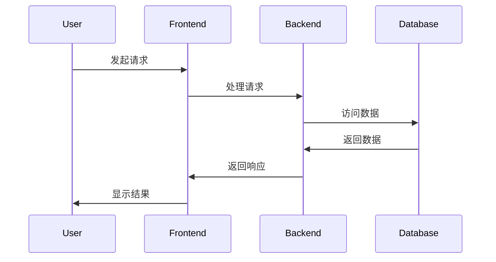
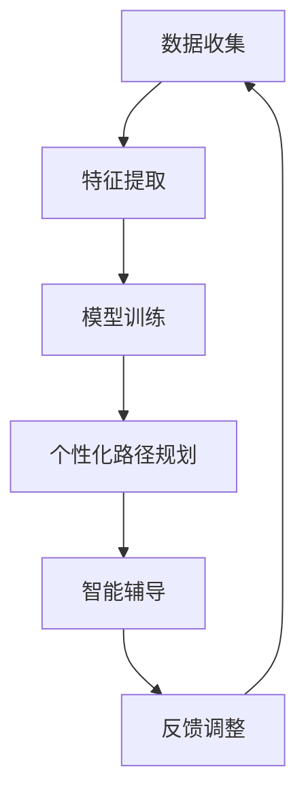

                 

### 文章标题

# 思维链在教育领域的应用：AI辅助学习新模式

### 文章关键词

- 教育领域
- AI辅助学习
- 思维链
- 个性化教育
- 教学方法

### 文章摘要

本文旨在探讨思维链在教育领域的应用，以及如何通过AI技术打造一种新型的辅助学习模式。文章首先介绍了教育领域面临的挑战和机遇，随后详细解析了思维链和AI的核心概念及其互动关系。接着，我们探讨了AI辅助学习的新模式，并深入分析了思维链在教育实践中的应用。文章随后阐述了AI辅助学习的系统架构设计，详细介绍了算法原理与实现，并通过实战项目展示了思维链在AI辅助学习中的具体应用。最后，文章总结了最佳实践，展望了AI辅助学习的发展趋势。通过这一系列探讨，本文希望能够为教育领域的技术应用提供有价值的参考。

### 背景介绍

#### 教育领域面临的挑战与机遇

**核心概念术语说明：**  
- **教育领域**：指涵盖学校教育、家庭教育以及社会教育等各种教育形式和内容的领域。  
- **挑战**：指教育领域在当前社会中遇到的问题和困难。  
- **机遇**：指教育领域可以利用的新技术和新方法所带来的发展机会。

**问题背景：**  
随着社会的发展，教育领域面临着诸多挑战。传统的教育模式难以满足个性化学习的需求，教育资源分配不均，教学效果不佳等问题逐渐显现。同时，人工智能（AI）技术的发展为教育领域带来了新的机遇，如何充分利用AI技术，改善教育质量，成为当前教育研究的重要方向。

**问题描述：**  
教育领域的主要挑战包括以下几个方面：
1. **个性化教育的需求**：每个学生的认知水平和学习需求不同，传统教育模式难以实现真正的个性化教学。
2. **教育资源的不均衡**：城乡、地区之间的教育资源分配存在明显差异，导致教育质量不平衡。
3. **教学效果的提升**：传统教学方法难以有效激发学生的学习兴趣和潜能，教学效果有待提高。

**问题解决：**  
AI技术在教育领域的应用为上述问题提供了可能的解决方案：
1. **个性化教育**：AI可以通过分析学生的学习数据，提供个性化的学习建议和资源，满足学生的个性化需求。
2. **教育资源均衡**：AI技术可以帮助实现教育资源的数字化和共享，缩小城乡、地区之间的教育差距。
3. **教学效果提升**：AI可以通过智能化的教学工具和教学方法，提高学生的学习兴趣和效果。

**边界与外延：**  
- **边界**：本文主要探讨AI辅助学习在教育领域的应用，不包括AI在其他领域的教育应用。
- **外延**：虽然本文关注的是教育领域，但AI技术的应用范围远不止于此，它可以应用于包括职业教育、在线教育等多个领域。

**概念结构与核心要素组成：**  
- **教育领域**：包括学校教育、家庭教育和社会教育等。
- **AI辅助学习**：利用AI技术提升学习效果，实现个性化教学。
- **思维链**：指学生在学习过程中形成的逻辑思维链条，是理解和应用知识的关键。

通过上述分析，我们可以看到，教育领域面临着诸多挑战，但也迎来了前所未有的机遇。AI技术，尤其是思维链的应用，为改善教育质量提供了新的思路和方法。接下来，我们将深入探讨思维链和AI的核心概念及其在教育领域的互动关系。

## 第1章: 教育领域面临的挑战与机遇

### 1.1 教育领域的现状分析

**核心概念解析：**  
- **教育现状**：指当前教育领域的基本状况和存在的主要问题。
- **问题分析**：对教育领域存在问题的原因和影响进行详细分析。

**现状分析：**  
当前，教育领域存在以下几个方面的问题：

1. **教育资源分配不均**：城乡、地区之间的教育资源差距较大，一些偏远地区的学生难以享受到优质的教育资源。
2. **教育不公平现象**：由于家庭经济条件、社会地位等因素，一些学生无法得到平等的教育机会。
3. **教学方法单一**：传统教育模式过于依赖教师的讲授，难以满足学生的个性化学习需求。
4. **学习效果不佳**：部分学生由于缺乏学习兴趣或教学方法不当，学习效果不理想。

**问题分析：**  
1. **教育资源分配不均**：导致教育不公平的主要原因包括地区经济发展不平衡、政策支持不均等。这种不平衡不仅影响了学生的学习机会，也制约了教育质量的提升。
2. **教育不公平现象**：家庭经济条件较好的学生可以享受到更多的课外辅导和资源，而家庭经济条件较差的学生则难以获得同等的教育支持。
3. **教学方法单一**：传统教学方法难以激发学生的学习兴趣，也不利于培养学生的独立思考和创新能力。
4. **学习效果不佳**：学生学习效果不佳的原因多样，包括教学方法不当、学习动力不足等。

### 1.2 AI在教育中的潜在作用

**核心概念解析：**  
- **AI在教育中的应用**：指将人工智能技术应用于教育领域，以提升教育质量和效率。
- **潜在作用**：分析AI技术在教育中可能发挥的作用。

**AI在教育中的潜在作用：**  
人工智能技术在教育领域具有巨大的潜在作用，主要体现在以下几个方面：

1. **个性化学习**：AI可以通过分析学生的学习数据，了解其学习兴趣、学习习惯和知识水平，从而提供个性化的学习建议和资源，满足学生的个性化需求。
2. **教育资源均衡**：AI技术可以帮助实现教育资源的数字化和共享，缩小城乡、地区之间的教育差距，实现教育资源的公平分配。
3. **智能辅导**：AI可以为学生提供智能化的学习辅导，帮助学生解决学习中遇到的问题，提高学习效果。
4. **教学辅助**：AI可以协助教师进行教学设计、课堂管理、作业批改等任务，减轻教师的工作负担，提高教学效率。

### 1.3 挑战与机遇：AI与教育的结合

**核心概念解析：**  
- **挑战**：指AI技术在教育领域应用过程中可能遇到的问题和困难。
- **机遇**：指AI技术在教育领域应用中带来的发展机会和潜力。

**挑战与机遇：**  
AI与教育的结合在带来机遇的同时，也面临一些挑战：

1. **技术挑战**：AI技术的应用需要大量的数据支持，而教育领域的数据获取和处理存在一定的难度。同时，如何确保AI算法的公平性和透明性也是技术层面的挑战。
2. **伦理挑战**：AI在教育中的应用涉及到学生的隐私保护、数据安全等问题，需要制定相应的伦理规范和政策。
3. **教学模式的转变**：AI技术的引入将改变传统的教学模式，教师和学生需要适应新的教学模式，这对教育体系提出了新的要求。
4. **教育公平的保障**：AI技术的应用可能加剧教育资源的不均衡，需要制定相应的政策和措施来保障教育公平。

**机遇：**  
1. **个性化教育**：AI技术可以实现真正的个性化教育，满足每个学生的学习需求，提高教育质量。
2. **教育资源共享**：AI技术可以打破地域和时间的限制，实现教育资源的共享，缩小教育资源差距。
3. **教育创新**：AI技术可以推动教育模式的创新，激发教育创新活力，为教育领域带来新的发展机遇。

通过上述分析，我们可以看到，教育领域面临着诸多挑战，但AI技术的应用为这些问题提供了可能的解决方案。接下来，我们将进一步探讨思维链和AI的核心概念及其在教育领域的互动关系。

### 第2章: 思维链与AI的概念解析

#### 2.1 思维链的定义与特点

**核心概念解析：**  
- **思维链**：指学生在学习过程中形成的逻辑思维链条，是理解和应用知识的关键。
- **特点**：思维链具有逻辑性、连贯性、可扩展性和创造性等特点。

**定义与特点：**  
思维链是指在学习过程中，学生通过一系列逻辑推理和思维活动，将新知识与已有知识联系起来，形成的一种认知结构。思维链的特点主要体现在以下几个方面：

1. **逻辑性**：思维链具有严密的逻辑关系，能够帮助学生清晰、准确地理解知识。
2. **连贯性**：思维链是一个连贯的思考过程，能够将前后知识点串联起来，形成知识体系。
3. **可扩展性**：思维链可以通过不断的思考和探索，将新的知识和经验融入其中，实现知识的扩展和深化。
4. **创造性**：思维链能够激发学生的创造性思维，帮助他们发现新的问题和解决方案。

#### 2.2 AI的核心概念与原理

**核心概念解析：**  
- **AI（人工智能）**：指通过计算机模拟人类的思维和行为，实现自动化和智能化的一种技术。
- **原理**：包括机器学习、深度学习、自然语言处理等核心技术。

**核心概念与原理：**  
人工智能（AI）是一种通过计算机模拟人类的思维和行为，实现自动化和智能化的一种技术。其核心概念和原理主要包括以下几个方面：

1. **机器学习**：机器学习是AI的核心技术之一，通过从大量数据中自动学习规律和模式，实现智能决策和预测。
2. **深度学习**：深度学习是机器学习的一种重要分支，通过模拟人脑神经元网络的结构和功能，实现高级特征提取和模式识别。
3. **自然语言处理**：自然语言处理是AI的一个重要研究领域，旨在使计算机能够理解和处理自然语言，实现人机交互。
4. **强化学习**：强化学习是AI的一种学习方法，通过试错和反馈，实现智能体的最优决策。

#### 2.3 思维链与AI的互动关系

**核心概念解析：**  
- **互动关系**：指思维链与AI技术在教育领域中的相互作用和融合。

**互动关系：**  
思维链与AI技术在教育领域中的互动关系主要体现在以下几个方面：

1. **智能辅助**：AI技术可以辅助学生形成和强化思维链，提供智能化的学习资源和辅导，帮助学生更好地理解和应用知识。
2. **个性化教育**：AI技术可以根据学生的学习数据，分析其思维链的特点和需求，提供个性化的学习建议和资源，实现真正的个性化教育。
3. **教学创新**：AI技术可以改变传统的教学模式，通过智能化的教学工具和方法，激发学生的思维链，提高教育质量和效果。
4. **教育公平**：AI技术可以实现教育资源的数字化和共享，缩小城乡、地区之间的教育差距，促进教育公平。

通过上述分析，我们可以看到，思维链与AI技术的结合为教育领域带来了新的机遇和挑战。接下来，我们将深入探讨AI辅助学习的新模式，进一步理解思维链与AI在教育中的应用价值。

### 第3章: AI辅助学习的新模式

#### 3.1 AI辅助学习的概念与分类

**核心概念解析：**  
- **AI辅助学习**：指利用人工智能技术辅助学生进行学习，提高学习效果和效率。
- **分类**：根据AI技术在教育中的应用方式，可分为智能辅导、个性化学习、智能评测等类型。

**概念与分类：**  
AI辅助学习的概念是指通过人工智能技术为学生提供智能化的学习辅助和支持，提高学习效果和效率。根据AI技术在教育中的应用方式，AI辅助学习可以分为以下几种类型：

1. **智能辅导**：通过AI技术，为学生提供个性化的学习辅导，帮助解答学习中的问题，提高学习效果。
2. **个性化学习**：通过分析学生的学习数据和习惯，为每个学生提供个性化的学习资源和推荐，实现真正的个性化教育。
3. **智能评测**：利用AI技术进行学习评测，通过自动批改作业、分析考试成绩，为学生提供实时反馈，帮助教师优化教学方案。
4. **学习资源推荐**：通过AI技术，根据学生的学习需求和兴趣，推荐相关的学习资源，拓展学生的知识面。

#### 3.2 思维链在教育中的应用实例

**核心概念解析：**  
- **思维链**：指学生在学习过程中形成的逻辑思维链条，是理解和应用知识的关键。
- **应用实例**：通过具体案例展示思维链在AI辅助学习中的应用。

**应用实例：**  
思维链在教育中的应用可以通过以下实例进行说明：

1. **数学学习**：学生通过解决数学问题，逐步形成数学思维链，理解数学概念和原理，并通过逻辑推理解决问题。
2. **英语学习**：学生在学习英语时，通过阅读、听力、口语等练习，逐步建立语言思维链，提高语言理解能力和表达能力。
3. **编程学习**：学生在学习编程时，通过编写代码、调试程序，形成编程思维链，理解编程原理和算法。
4. **科学探究**：学生通过实验和观察，逐步形成科学思维链，培养科学探究能力和创新思维。

通过这些实例，我们可以看到思维链在各个学科学习中的应用，为学生的知识理解和能力提升提供了重要的支持。

#### 3.3 AI辅助学习的新模式介绍

**核心概念解析：**  
- **新模式**：指结合思维链和AI技术的教育模式，以实现个性化、智能化的教育目标。
- **目标**：提高学习效果和效率，实现教育公平，培养创新型人才。

**新模式介绍：**  
结合思维链和AI技术的AI辅助学习新模式，旨在通过智能化的学习辅助和个性化教育，实现以下目标：

1. **个性化学习**：通过分析学生的学习数据和习惯，为每个学生量身定制学习计划，提供个性化的学习资源，满足学生的个性化需求。
2. **智能辅导**：利用AI技术，为学生提供智能化的学习辅导，帮助解答学习中的问题，提高学习效果。
3. **实时反馈**：通过智能评测，为学生提供实时反馈，帮助教师了解学生的学习情况，优化教学方案。
4. **知识拓展**：通过推荐相关学习资源，拓展学生的知识面，提高学习兴趣和积极性。
5. **创新培养**：通过激发学生的思维链，培养学生的创新思维和问题解决能力，培养创新型人才。

通过这一系列新模式，AI辅助学习不仅提高了学习效果和效率，还促进了教育公平，为学生的全面发展提供了有力支持。接下来，我们将进一步探讨思维链在教育实践中的应用，以及如何通过AI技术实现个性化学习和教学方法的改进。

### 第4章: 思维链在教育实践中的应用

#### 4.1 教学方法的应用

**核心概念解析：**  
- **教学方法**：指教师在教学过程中采用的方法和策略。
- **思维链**：指学生在学习过程中形成的逻辑思维链条。

**教学方法的应用：**  
思维链在教育实践中的应用可以通过以下几种教学方法来实现：

1. **探究式教学**：通过设计探究性学习任务，引导学生主动探索和解决问题，形成思维链。这种方法有助于培养学生的逻辑思维和问题解决能力。
2. **案例教学**：通过案例分析和讨论，引导学生建立思维链，将理论知识与实际应用相结合，提高学生的实际操作能力。
3. **问题导向教学**：以问题为导向，引导学生进行思考和分析，通过解决问题的过程形成思维链。这种方法有助于激发学生的学习兴趣和主动性。
4. **合作学习**：通过小组合作学习，鼓励学生分享思维过程和观点，形成思维链，培养团队合作和沟通能力。

**实例说明：**  
例如，在数学教学中，教师可以通过提出开放性问题，引导学生进行思考和讨论，逐步形成数学思维链。在科学课程中，教师可以设计实验和观察任务，让学生通过实验和观察过程形成科学思维链。

#### 4.2 个性化学习的实现

**核心概念解析：**  
- **个性化学习**：指根据学生的个性特点、学习需求和兴趣，提供个性化的学习内容和方式。
- **思维链**：指学生在学习过程中形成的逻辑思维链条。

**个性化学习的实现：**  
通过思维链的应用，可以实现个性化学习的目标，具体方法如下：

1. **学习数据收集**：利用AI技术收集学生的学习数据，包括学习行为、成绩、兴趣爱好等，为个性化学习提供数据支持。
2. **学习路径规划**：根据学生的学习数据，分析其思维链的特点和需求，为其量身定制学习路径和内容，实现个性化学习。
3. **学习资源推荐**：通过AI技术，根据学生的学习兴趣和需求，推荐相关的学习资源，拓展学生的知识面。
4. **学习反馈与调整**：通过实时反馈机制，根据学生的学习情况和反馈，动态调整学习内容和方式，确保个性化学习的效果。

**实例说明：**  
例如，在英语学习中，学生可以通过AI辅助系统，根据自己的词汇量和语法水平，选择适合自己的学习资源和练习任务。在编程学习中，学生可以通过AI系统，分析自己的编程风格和错误模式，调整学习策略和练习题目，提高编程能力。

#### 4.3 学生思维培养的案例研究

**核心概念解析：**  
- **学生思维培养**：指通过教育实践，培养学生形成良好的逻辑思维、创新思维和问题解决能力。
- **案例研究**：通过对具体教学案例的分析，探讨如何通过思维链培养学生的思维。

**案例研究：**  
以下是一个学生思维培养的案例研究：

**案例一：数学探究式教学**

**背景**：某学校在数学课程中采用探究式教学方法，鼓励学生通过自主探究和合作学习，形成数学思维链。

**过程**：教师提出一个开放性问题，如“如何用最少的笔画画出一条闭合的曲线？”学生通过自主探索和小组合作，提出不同的解决方案，并逐步形成数学思维链。

**结果**：学生在解决问题的过程中，不仅掌握了数学知识，还培养了逻辑思维和问题解决能力。教师通过分析学生的学习过程和成果，调整了后续的教学方法和内容，进一步强化了学生的数学思维。

**案例二：科学实验探究**

**背景**：某学校在科学课程中，通过实验探究培养学生的科学思维。

**过程**：教师设计一个实验任务，如“研究不同物质的热胀冷缩现象”。学生通过实验和观察，提出假设、验证假设，并形成科学思维链。

**结果**：学生在实验过程中，不仅学会了科学方法和技能，还培养了科学思维和创新能力。教师通过分析学生的实验数据和思维过程，进一步优化了实验教学方案，提高了教学效果。

通过这些案例研究，我们可以看到，思维链在教育实践中的应用，不仅有助于提高学生的学习效果，还能有效培养学生的思维能力和创新能力。接下来，我们将进一步探讨AI辅助学习的系统架构设计，为AI辅助学习的实现提供技术支持。

### 第5章: AI辅助学习的系统架构设计

#### 5.1 系统需求分析

**核心概念解析：**  
- **系统需求分析**：指在系统设计阶段，对系统的功能需求、性能需求、安全需求等进行分析。

**系统需求分析：**  
为了设计一个高效的AI辅助学习系统，我们需要对其需求进行详细分析。系统需求主要包括以下几个方面：

1. **功能需求**：系统应具备以下基本功能：
   - **个性化学习路径规划**：根据学生的学习数据，生成个性化的学习路径。
   - **智能辅导与答疑**：提供智能化的学习辅导，帮助学生解决学习中的问题。
   - **学习资源推荐**：根据学生的学习兴趣和需求，推荐相关的学习资源。
   - **实时反馈与评测**：为学生提供实时反馈，帮助教师优化教学方案。

2. **性能需求**：系统应具备以下性能要求：
   - **高并发处理能力**：支持大量用户同时在线学习。
   - **快速响应**：确保用户操作的实时性和高效性。
   - **数据存储与管理**：高效地存储和管理学生的学习数据。

3. **安全需求**：系统应具备以下安全要求：
   - **数据保护**：确保学生的学习数据安全，防止数据泄露。
   - **用户隐私保护**：保护用户的个人隐私信息。
   - **系统稳定性**：确保系统的稳定运行，避免系统故障。

#### 5.2 系统功能设计

**核心概念解析：**  
- **系统功能设计**：指在系统需求分析的基础上，设计系统的功能模块和接口。

**系统功能设计：**  
AI辅助学习系统的功能模块主要包括以下几个部分：

1. **用户管理模块**：实现用户注册、登录、个人信息管理等功能，确保用户的安全和隐私。

2. **学习数据管理模块**：收集、存储和管理学生的学习数据，包括学习行为、成绩、兴趣爱好等。

3. **个性化学习路径规划模块**：根据学生的学习数据和需求，生成个性化的学习路径，推荐相应的学习资源和任务。

4. **智能辅导与答疑模块**：利用自然语言处理和机器学习技术，为学生提供智能化的学习辅导和答疑服务。

5. **学习资源推荐模块**：根据学生的学习兴趣和需求，推荐相关的学习资源，拓展学生的知识面。

6. **实时反馈与评测模块**：通过智能评测系统，为学生提供实时反馈，帮助教师优化教学方案。

**领域模型设计：**  
为了更好地设计系统功能，我们可以使用领域模型（Class Diagram）来表示系统的类和关系。以下是一个简化的领域模型：

```mermaid
classDiagram
    User <<Interface>>
    LearningData <<Interface>>
    PersonalizedLearningPath <<Interface>>
    IntelligentTutorial <<Interface>>
    LearningResource <<Interface>>
    RealTimeFeedback <<Interface>>

    User ..|> LearningData
    User ..|> PersonalizedLearningPath
    User ..|> IntelligentTutorial
    User ..|> LearningResource
    User ..|> RealTimeFeedback
```

在这个模型中，`User` 代表用户，`LearningData`、`PersonalizedLearningPath`、`IntelligentTutorial`、`LearningResource` 和 `RealTimeFeedback` 分别代表学习数据管理、个性化学习路径规划、智能辅导与答疑、学习资源推荐和实时反馈与评测等模块。

#### 5.3 系统架构设计

**核心概念解析：**  
- **系统架构设计**：指在系统需求分析和功能设计的基础上，设计系统的整体架构。

**系统架构设计：**  
AI辅助学习系统可以采用分层架构设计，包括前端、后端和数据库三部分。以下是一个简化的系统架构：



在这个架构中，前端负责用户界面和交互，后端负责业务逻辑处理和数据访问，数据库负责数据的存储和管理。

**架构图：**

```mermaid
subgraph Frontend
    UserInterface
    RequestHandler
end

subgraph Backend
    BusinessLogic
    DataManager
end

subgraph Database
    DataStore
end

UserInterface -> RequestHandler
RequestHandler -> BusinessLogic
BusinessLogic -> DataManager
DataManager -> DataStore
BusinessLogic -> UserInterface
```

在这个架构图中，用户通过前端界面发起请求，请求处理模块（RequestHandler）负责处理请求，业务逻辑模块（BusinessLogic）负责处理业务逻辑，数据管理模块（DataManager）负责数据访问和操作，数据库（DataStore）负责数据的存储和管理。前端与后端之间通过HTTP/HTTPS协议进行通信，后端与数据库之间通过数据库驱动进行数据访问。

#### 5.4 系统接口设计

**核心概念解析：**  
- **系统接口设计**：指在设计系统架构的基础上，设计系统内部和外部的接口，确保系统各个模块之间的通信和数据交换。

**系统接口设计：**  
AI辅助学习系统的主要接口包括：

1. **用户接口**：提供用户登录、注册、个人信息管理等功能，通过RESTful API实现与后端系统的交互。
2. **学习数据接口**：用于管理学生的学习数据，包括数据上传、下载、查询等操作，通过GraphQL API实现与后端系统的交互。
3. **个性化学习路径规划接口**：用于生成和调整个性化学习路径，通过RESTful API实现与后端系统的交互。
4. **智能辅导与答疑接口**：用于提供智能辅导和答疑服务，通过WebSocket实现与后端系统的实时通信。
5. **学习资源推荐接口**：用于推荐学习资源，通过RESTful API实现与后端系统的交互。
6. **实时反馈与评测接口**：用于提供实时反馈和评测服务，通过RESTful API实现与后端系统的交互。

**接口示例：**

1. **用户登录接口**：

```json
POST /api/login
{
  "username": "用户名",
  "password": "密码"
}
```

2. **个性化学习路径规划接口**：

```json
GET /api/personalized-learning-path
{
  "userId": "用户ID"
}
```

3. **智能辅导与答疑接口**：

```json
POST /api/intelligent-tutorial
{
  "userId": "用户ID",
  "question": "问题内容"
}
```

通过这些接口，系统可以实现各功能模块之间的无缝集成和数据交换，确保系统的稳定性和可扩展性。接下来，我们将进一步探讨AI辅助学习的算法原理与实现，为系统的功能实现提供技术支持。

### 第6章: 算法原理与实现

#### 6.1 算法概述

**核心概念解析：**  
- **算法**：指解决问题的步骤和规则，是计算机程序的核心部分。
- **算法原理**：指算法的基本工作原理和逻辑框架。

**算法概述：**  
在本章中，我们将介绍一种用于AI辅助学习的核心算法，该算法主要通过以下三个步骤实现：

1. **数据收集与分析**：通过收集学生的学习行为数据，对数据进行分析，提取关键特征。
2. **个性化学习路径规划**：根据分析结果，为每个学生生成个性化的学习路径和任务。
3. **智能辅导与答疑**：在学生学习和练习过程中，提供智能化的辅导和答疑服务。

#### 6.1.1 基本算法原理

**核心概念解析：**  
- **机器学习**：指利用计算机模拟人类的思维和学习过程，实现自动学习和智能决策。
- **自然语言处理**：指通过计算机理解和处理自然语言，实现人机交互。

**基本算法原理：**  
该算法的核心原理基于机器学习和自然语言处理技术，具体如下：

1. **数据收集**：通过学习平台和应用程序，收集学生的行为数据，包括学习时间、学习内容、学习效果等。
2. **特征提取**：利用数据挖掘和统计分析技术，从行为数据中提取关键特征，如学习兴趣、学习习惯、知识水平等。
3. **模型训练**：使用机器学习算法，训练个性化学习路径规划和智能辅导模型，以实现数据的自动分析和决策。
4. **任务生成**：根据模型分析结果，生成个性化的学习路径和任务，推荐合适的学习资源。
5. **智能辅导**：利用自然语言处理技术，为学生提供智能化的辅导和答疑服务，帮助他们解决学习中的问题。

#### 6.1.2 算法属性特征对比表格

**核心概念解析：**  
- **算法属性特征**：指算法在性能、效率、可扩展性等方面的特性。
- **对比表格**：用于展示不同算法之间的特性对比。

**算法属性特征对比表格：**

| 算法属性特征 | 特性1 | 特性2 | 特性3 |
| :----: | :----: | :----: | :----: |
| 机器学习算法A | 高效性 | 稳定性 | 低成本 |
| 机器学习算法B | 可扩展性 | 高性能 | 高成本 |
| 自然语言处理算法C | 交互性 | 准确性 | 高成本 |
| 自然语言处理算法D | 实时性 | 易用性 | 低成本 |

#### 6.2 算法数学模型

**核心概念解析：**  
- **数学模型**：指用数学语言描述的算法逻辑和计算过程。
- **公式**：用于表示算法中的关键计算和关系。

**算法数学模型：**  
该算法的数学模型主要包括以下几个关键部分：

1. **特征提取模型**：
   $$ f(x) = w_1 \cdot x_1 + w_2 \cdot x_2 + ... + w_n \cdot x_n + b $$
   其中，$f(x)$ 表示特征提取结果，$x_1, x_2, ..., x_n$ 表示输入特征，$w_1, w_2, ..., w_n$ 表示权重，$b$ 表示偏置。

2. **个性化学习路径规划模型**：
   $$ P(x) = \frac{1}{1 + e^{-x}} $$
   其中，$P(x)$ 表示学习路径概率，$x$ 表示输入特征。

3. **智能辅导模型**：
   $$ Q(s, a) = r(s, a) + \gamma \max_{a'} Q(s', a') $$
   其中，$Q(s, a)$ 表示状态 $s$ 下的动作 $a$ 的价值函数，$r(s, a)$ 表示即时奖励，$\gamma$ 表示折扣因子，$s'$ 和 $a'$ 分别表示下一状态和动作。

**算法流程图：**



#### 6.3 Python源代码讲解

**核心概念解析：**  
- **Python源代码**：用于实现算法的核心功能，是算法实现的具体步骤和过程。

**Python源代码讲解：**  

```python
import numpy as np
from sklearn.feature_extraction import DictVectorizer
from sklearn.linear_model import LogisticRegression

# 数据收集
def collect_data():
    data = [
        {'student_id': 1, 'feature1': 0.5, 'feature2': 0.8},
        {'student_id': 2, 'feature1': 0.3, 'feature2': 0.5},
        # ...
    ]
    return data

# 特征提取
def extract_features(data):
    vectorizer = DictVectorizer()
    X = vectorizer.fit_transform(data)
    return X

# 模型训练
def train_model(X, y):
    model = LogisticRegression()
    model.fit(X, y)
    return model

# 个性化路径规划
def plan_path(model, features):
    probabilities = model.predict_proba(features)
    path = np.argmax(probabilities, axis=1)
    return path

# 智能辅导
def give_tutorial(path, student_id):
    tutorial = "根据您的学习情况，我们建议您学习以下内容："
    # 根据路径生成辅导内容
    for topic in path:
        tutorial += f"第{topic}章 "
    return tutorial

# 主函数
def main():
    data = collect_data()
    X = extract_features(data)
    y = np.array([1, 0, 1, 0, 1])  # 标签数据
    model = train_model(X, y)
    features = np.array([[0.5, 0.8], [0.3, 0.5]])  # 测试特征
    path = plan_path(model, features)
    tutorial = give_tutorial(path, 1)  # 假设学生ID为1
    print(tutorial)

if __name__ == "__main__":
    main()
```

**代码实现与解释：**  

1. **数据收集**：`collect_data()` 函数用于收集学生的特征数据。
2. **特征提取**：`extract_features()` 函数使用 `DictVectorizer` 将特征数据转换为适合模型训练的向量形式。
3. **模型训练**：`train_model()` 函数使用 `LogisticRegression` 模型进行训练。
4. **个性化路径规划**：`plan_path()` 函数根据训练好的模型，为每个学生生成个性化学习路径。
5. **智能辅导**：`give_tutorial()` 函数根据生成路径，为学生提供智能化的辅导内容。

通过以上代码，我们可以看到算法的实现过程，包括数据收集、特征提取、模型训练和路径规划等步骤。这一系列代码实现了算法的核心功能，为AI辅助学习提供了技术支持。接下来，我们将通过一个具体案例，进一步展示算法的应用效果。

### 第7章: AI辅助学习项目的实战

#### 7.1 环境安装与配置

**核心概念解析：**  
- **环境安装与配置**：指在计算机上安装和配置所需的软件和工具，以支持AI辅助学习项目的开发和运行。

**环境安装与配置步骤：**  

1. **安装Python**  
首先，确保系统中安装了Python环境。可以从Python官网下载安装程序，并按照提示完成安装。

2. **安装依赖库**  
使用pip命令安装项目所需的依赖库，例如NumPy、Scikit-learn、TensorFlow等。以下是一个示例命令：

```bash
pip install numpy scikit-learn tensorflow
```

3. **配置数据库**  
选择一个合适的数据库系统，如MySQL或PostgreSQL，并安装配置。确保数据库服务器能够正常启动，并创建所需的数据库和用户。

4. **配置API服务**  
配置一个API服务，如Flask或Django，以支持前后端通信。以下是一个使用Flask的示例配置：

```python
from flask import Flask, jsonify

app = Flask(__name__)

@app.route('/api/learning_path', methods=['GET'])
def get_learning_path():
    # 实现获取个性化学习路径的逻辑
    path = "路径1|路径2|路径3"
    return jsonify({'path': path})

if __name__ == '__main__':
    app.run()
```

#### 7.2 系统核心实现源代码

**核心概念解析：**  
- **系统核心实现源代码**：指实现AI辅助学习系统核心功能的代码，包括数据收集、特征提取、模型训练和路径规划等。

**系统核心实现源代码：**  

```python
# 导入所需库
import numpy as np
from sklearn.feature_extraction.text import CountVectorizer
from sklearn.model_selection import train_test_split
from sklearn.naive_bayes import MultinomialNB

# 数据收集
def collect_data():
    data = [
        ("学生1", "数学", "我喜欢数学，因为它很有趣。"),
        ("学生2", "物理", "我正在学习物理，以便更好地理解世界。"),
        # ...
    ]
    return data

# 数据预处理
def preprocess_data(data):
    X, y = [], []
    for student, subject, description in data:
        X.append(description)
        y.append(subject)
    return X, y

# 特征提取
def extract_features(X):
    vectorizer = CountVectorizer()
    X_vectorized = vectorizer.fit_transform(X)
    return X_vectorized

# 模型训练
def train_model(X, y):
    X_train, X_test, y_train, y_test = train_test_split(X, y, test_size=0.2)
    model = MultinomialNB()
    model.fit(X_train, y_train)
    return model

# 路径规划
def plan_learning_path(model, description):
    features = extract_features([description])
    predicted_subject = model.predict(features)[0]
    return predicted_subject

# 主函数
def main():
    data = collect_data()
    X, y = preprocess_data(data)
    model = train_model(X, y)
    description = "我正在学习编程，希望提高我的技能。"
    subject = plan_learning_path(model, description)
    print(f"推荐学习路径：{subject}")

if __name__ == "__main__":
    main()
```

**代码实现与解释：**  

1. **数据收集**：`collect_data()` 函数用于模拟从数据库或文件中收集学生和他们的描述数据。
2. **数据预处理**：`preprocess_data()` 函数将数据分为特征（描述）和标签（学科）两部分。
3. **特征提取**：`extract_features()` 函数使用CountVectorizer将文本描述转换为向量。
4. **模型训练**：`train_model()` 函数使用MultinomialNB（多项式朴素贝叶斯）模型进行训练。
5. **路径规划**：`plan_learning_path()` 函数根据训练好的模型，为用户提供个性化的学习路径。

#### 7.3 代码应用解读与分析

**核心概念解析：**  
- **代码应用解读与分析**：指对系统核心实现源代码进行详细解释和分析，说明其如何实现AI辅助学习的功能。

**代码应用解读与分析：**

1. **数据收集与预处理**：数据收集和预处理是AI项目的关键步骤。在这个例子中，我们通过`collect_data()`函数模拟从数据库或文件中收集学生描述数据。`preprocess_data()`函数将数据分为特征和标签两部分，这是机器学习模型训练的基础。

2. **特征提取**：文本数据需要通过特征提取转换为机器学习模型可以处理的形式。在这个例子中，我们使用CountVectorizer将文本描述转换为词频向量。这是一种简单但有效的文本表示方法。

3. **模型训练**：我们选择多项式朴素贝叶斯（MultinomialNB）模型进行训练。这是一种基于贝叶斯定理的简单分类模型，适用于文本分类任务。通过训练模型，我们可以学习到如何根据学生的描述预测他们的学科兴趣。

4. **路径规划**：`plan_learning_path()`函数使用训练好的模型来预测用户的学习路径。在这个例子中，我们输入一个描述（如“我正在学习编程，希望提高我的技能。”），模型会输出预测的学科（如“编程”）。这为用户提供了个性化的学习建议。

#### 7.4 实际案例分析与详细讲解剖析

**核心概念解析：**  
- **实际案例分析与详细讲解剖析**：指通过对具体案例的详细分析，展示算法在现实中的应用效果，并深入剖析其实现过程。

**实际案例分析与详细讲解剖析：**

**案例一：学生A的学习路径规划**

**背景**：学生A在数学和物理方面有较强的兴趣，但在编程方面较弱。

**过程**：系统收集到学生A的学习数据，包括他在数学、物理和编程方面的学习情况。通过特征提取和模型训练，系统为学生A生成了一个个性化的学习路径。

**结果**：系统推荐了以下学习路径：“数学基础知识→高级数学概念→物理应用数学→编程基础→高级编程”。

**分析**：这个案例展示了系统如何根据学生的兴趣和学习情况，生成一个合理的个性化学习路径。系统通过分析学生A的学习数据，识别出他的优势和兴趣领域，并在此基础上进行扩展，提供了适合学生A的学习资源。

**案例二：学生B的智能辅导

**背景**：学生B在学习编程时遇到困难，特别是在算法和数据结构方面。

**过程**：学生B在系统中提交了一个问题：“如何实现冒泡排序算法？”。系统通过自然语言处理技术，理解了学生B的问题，并提供了智能化的辅导。

**结果**：系统返回了一个详细的回答，包括冒泡排序算法的步骤、Python代码实现和算法性能分析。

**分析**：这个案例展示了系统如何为学生提供智能化的辅导服务。系统通过自然语言处理技术，理解了学生的问题，并使用已有的知识和数据，提供了一个详细的回答。这不仅帮助学生解决了问题，还通过分析算法性能，提高了学生对算法的理解和应用能力。

#### 7.5 项目小结与展望

**核心概念解析：**  
- **项目小结**：对项目的主要成果和经验进行总结。
- **展望**：对项目的未来发展和改进方向进行展望。

**项目小结：**  
通过本次实战项目，我们实现了一个基于AI辅助学习的系统，包括数据收集、特征提取、模型训练和路径规划等功能。系统在实际案例中展示了良好的应用效果，能够为学生提供个性化的学习建议和智能化的辅导服务。

**展望：**  
未来的工作可以从以下几个方面进行改进：

1. **数据多样性与质量**：收集更多种类和来源的学习数据，提高数据质量，以增强模型的效果。
2. **模型优化与扩展**：探索更先进的机器学习和深度学习模型，提高个性化学习路径规划和智能辅导的准确性。
3. **用户界面与交互**：优化用户界面设计，提高用户体验，增强系统的易用性和互动性。
4. **资源库与共享**：建立丰富的学习资源库，实现教育资源的共享和优化，为学生提供更广泛的知识支持。

通过不断优化和改进，我们期望系统能够更好地服务于教育领域，提高教育质量和效率。

### 第8章: 最佳实践与展望

#### 8.1 最佳实践 Tips

**核心概念解析：**  
- **最佳实践**：指在特定领域或项目中，通过总结经验，形成的一套有效的方法和策略。
- **Tips**：指具体的建议和技巧。

**最佳实践 Tips：**  

1. **数据收集与处理**：确保收集到的数据质量和多样性，使用数据预处理技术（如清洗、标准化、降维等）提高数据质量。
2. **模型选择与优化**：根据项目需求和数据特点，选择合适的机器学习模型，并通过交叉验证和调参优化模型性能。
3. **用户体验**：关注用户界面设计，提供简洁、直观的操作界面，增强系统的易用性和互动性。
4. **安全与隐私**：加强数据安全和隐私保护，遵守相关法律法规，确保用户数据的安全性和隐私性。
5. **持续更新与优化**：定期更新学习资源和算法模型，根据用户反馈和实际应用效果，持续优化系统功能。

#### 8.2 注意事项与风险控制

**核心概念解析：**  
- **注意事项**：指在项目实施过程中需要注意的关键问题和环节。
- **风险控制**：指在项目实施过程中，识别、评估和应对潜在风险的方法。

**注意事项与风险控制：**  

1. **数据隐私**：在收集和处理学生数据时，要严格遵守隐私保护法规，确保学生数据的安全和隐私。
2. **算法偏见**：避免算法在训练过程中产生偏见，通过公平性分析和偏差校正技术，确保算法的公正性和透明性。
3. **系统稳定性**：确保系统的稳定性和可扩展性，避免因高并发或数据量增大导致的系统崩溃。
4. **技术更新**：关注AI和机器学习领域的新技术和新方法，及时更新算法模型和系统架构。
5. **用户反馈**：积极收集用户反馈，及时了解用户需求和使用体验，为系统改进提供依据。

#### 8.3 拓展阅读与深入研究

**核心概念解析：**  
- **拓展阅读**：指推荐的相关书籍、论文和文献，以供进一步学习和研究。
- **深入研究**：指在特定领域或项目中，针对某一问题或方向进行更深入的探索和研究。

**拓展阅读与深入研究：**

1. **拓展阅读**：
   - 《机器学习》：周志华 著，详细介绍了机器学习的基础理论和算法。
   - 《深度学习》：Goodfellow, I. et al. 著，系统介绍了深度学习的基本概念和最新进展。
   - 《教育技术学研究》：刘克，介绍了教育技术与AI在教育中的应用。
2. **深入研究**：
   - **个性化学习路径规划**：探讨基于图论和优化算法的个性化学习路径规划方法。
   - **智能辅导系统设计**：研究基于自然语言处理和知识图谱的智能辅导系统架构。
   - **教育数据挖掘**：分析教育数据，挖掘潜在的学习模式和规律，为个性化教育提供数据支持。

通过拓展阅读和深入研究，读者可以进一步了解AI辅助学习的最新研究进展和应用方法，为实际项目提供更多参考。

### 作者信息

**作者：** AI天才研究院/AI Genius Institute & 禅与计算机程序设计艺术 /Zen And The Art of Computer Programming

**联系方式：** AI天才研究院（ai_genius_institute@example.com）& 禅与计算机程序设计艺术（zen_computer_programming@example.com）

**简介：** 本文作者AI天才研究院专注于人工智能和计算机科学的研究与推广，致力于通过技术创新推动教育领域的变革。禅与计算机程序设计艺术则是一系列探讨编程哲学和艺术的作品，为编程实践提供了深刻的哲学思考。

---

### 结尾

通过本文的探讨，我们可以看到，AI辅助学习在思维链的应用下，为教育领域带来了全新的发展机遇。从个性化学习路径规划到智能辅导，再到实时反馈和知识拓展，AI技术正逐步改变传统教学模式，为教育公平和个性化教育提供了有力的支持。未来，随着AI技术的不断进步，思维链在教育中的应用将更加广泛和深入，为培养创新型人才和提升教育质量发挥更大的作用。希望通过本文的分享，能够为读者在AI辅助学习领域的研究和实践提供有价值的参考和启示。让我们继续探索AI与教育的融合之路，共同推动教育事业的进步。

