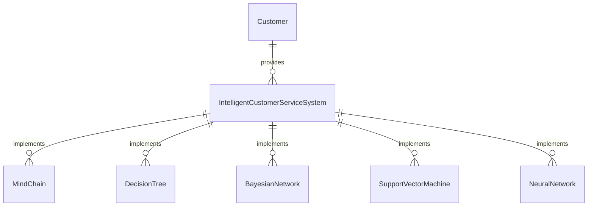
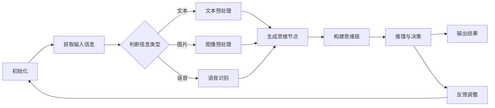

                 

### 引言

#### 1.1 问题背景

随着互联网技术的飞速发展和人工智能的崛起，智能客服系统在各个行业中得到了广泛应用。智能客服系统通过自动化和智能化的方式，提供24小时不间断的客户服务，极大地提高了企业的工作效率和客户满意度。然而，随着用户需求的多样化和复杂化，传统的基于规则或模板匹配的智能客服系统在处理复杂问题时表现出明显的局限性。为了提高智能客服系统的应对能力，需要引入更加高级的智能算法和模型。

思维链（Mind Chain）作为一种新兴的智能算法，具有处理复杂问题和多维度信息的能力。思维链的核心思想是通过将人类思维过程抽象为一系列的“思维节点”和“思维链接”，实现自动化和智能化的推理与决策。这种算法在人工智能领域具有巨大的潜力，特别是在智能客服系统中的应用。

#### 1.2 问题描述

本文的主要问题是探讨思维链在智能客服系统中的应用。具体来说，我们需要解决以下几个关键问题：

1. 思维链的定义及其特点是什么？
2. 思维链如何与智能客服系统相结合？
3. 思维链算法的具体实现原理是什么？
4. 思维链在智能客服系统中的架构设计如何？
5. 思维链在智能客服系统中的实际应用案例有哪些？

通过回答这些问题，我们将深入理解思维链在智能客服系统中的价值和应用前景。

#### 1.3 问题解决

为了解决上述问题，本文将采用以下研究方法：

1. **文献综述**：首先，我们将对现有的研究文献进行梳理，了解思维链和智能客服系统的发展现状，以及相关的技术原理和应用案例。
2. **理论分析**：接着，我们将对思维链的基本概念和特点进行详细阐述，并分析其在智能客服系统中的应用潜力。
3. **算法实现**：然后，我们将介绍思维链算法的具体实现原理，包括算法的mermaid流程图、Python源代码示例、数学模型和公式，以及通俗易懂的举例说明。
4. **系统架构设计**：我们将探讨思维链在智能客服系统中的架构设计，包括问题场景介绍、系统功能设计、系统架构设计、系统接口设计和系统交互。
5. **项目实战**：最后，我们将通过一个具体的实际案例，展示思维链在智能客服系统中的应用效果，并对其进行详细讲解和分析。

通过上述步骤，我们将系统地分析和探讨思维链在智能客服系统中的应用，为相关领域的研发和应用提供有价值的参考。

#### 1.4 边界与外延

在讨论思维链在智能客服系统中的应用时，我们需要明确其边界与外延，以确保研究方向的准确性和实用性。

1. **边界**：本文主要聚焦于思维链在智能客服系统中的应用，研究如何利用思维链算法提高智能客服系统的响应速度和问题解决能力。我们不会涉及思维链在其他人工智能领域的应用，如自动驾驶、医疗诊断等。

2. **外延**：虽然本文主要讨论智能客服系统，但思维链作为一种通用的智能算法，其应用范围远不止于此。未来，思维链可以扩展到其他需要复杂问题处理和智能决策的领域，如智能家居、金融风控等。

#### 1.5 概念结构与核心要素组成

为了更好地理解思维链在智能客服系统中的应用，我们需要对其概念结构进行详细分析。

1. **思维链的定义**：思维链是一种模拟人类思维过程的智能算法，通过节点和链接来表示思维过程，具有自学习和自适应能力。

2. **思维链的特点**：思维链具有多层次、多维度、动态调整等特点，能够处理复杂的问题和大量的数据，具备较高的灵活性和通用性。

3. **智能客服系统的需求**：智能客服系统需要快速响应、准确理解和高效处理客户问题。思维链的引入，可以提升智能客服系统的智能程度和应对能力。

4. **思维链与智能客服系统的结合方式**：思维链可以通过与自然语言处理、机器学习等技术的结合，实现智能客服系统中的智能对话和问题解决。

5. **核心要素组成**：思维链在智能客服系统中的核心要素包括思维链算法、数据集、模型训练和推理引擎等。

通过上述分析，我们可以看到思维链在智能客服系统中的应用具有明显的优势和广阔的前景。接下来，我们将进一步探讨思维链的具体算法原理和实现方式，为后续内容奠定基础。

### 核心概念

在深入探讨思维链在智能客服系统中的应用之前，我们首先需要明确几个核心概念，以便为后续内容提供理论基础。

#### 2.1 思维链的定义

思维链（Mind Chain）是一种基于人工智能和认知科学的智能算法，旨在模拟和实现人类思维的推理和决策过程。思维链通过一系列节点和链接来表示思维过程，每个节点代表一个思维元素，而链接则表示节点之间的逻辑关系。

简而言之，思维链的核心思想是将人类思维过程中的各个部分抽象为节点，并通过链接来表示它们之间的相互作用和推理过程。这种抽象方式使得思维链能够处理复杂的逻辑问题，实现高度智能化的决策和推理。

#### 2.2 思维链的特点

思维链具有以下几个显著特点：

1. **多层次性**：思维链能够处理多层次的信息和问题。它不仅能够处理简单的线性问题，还能够应对复杂的多层次逻辑问题，如递归推理、并行处理等。

2. **多维度性**：思维链可以同时处理多个维度的问题，例如在处理客户咨询时，可以同时考虑历史记录、实时信息和业务规则等多个维度。

3. **动态调整性**：思维链具有自学习和自适应能力，可以根据问题和数据的变化动态调整链接和节点的权重，提高推理和决策的准确性。

4. **通用性**：思维链的架构设计使其具有较高的通用性，能够应用于各种需要复杂推理和决策的领域，如智能客服、自动驾驶、医疗诊断等。

5. **自解释性**：思维链的推理过程和决策结果具有自解释性，用户可以直观地理解系统是如何得出结论的，从而提高系统的可解释性和透明度。

#### 2.3 思维链与智能客服系统的关系

思维链在智能客服系统中具有重要作用，具体体现在以下几个方面：

1. **问题解决能力**：思维链通过模拟人类思维过程，能够处理复杂的客户问题和多样化的咨询需求，提高智能客服系统的问题解决能力。

2. **个性化服务**：思维链可以根据客户的历史记录、实时信息和个性化需求，动态调整服务策略，提供更加个性化和贴心的服务。

3. **自学习能力**：思维链的自学习能力使得智能客服系统能够不断优化和提升服务效果，通过学习用户的反馈和行为模式，逐步提高系统的智能程度。

4. **多渠道集成**：思维链可以与多种渠道（如电话、邮件、社交媒体等）集成，实现多渠道的智能客服服务，提升企业的客户服务覆盖范围。

5. **可解释性**：思维链的推理和决策过程具有自解释性，用户可以了解系统的决策逻辑，增强用户对系统的信任和满意度。

通过上述分析，我们可以看到思维链在智能客服系统中的应用具有显著的优势和潜力。接下来，我们将进一步探讨思维链算法的原理和具体实现，为智能客服系统的优化提供理论基础。

### 概念属性特征对比表格

为了更清晰地展示思维链与其他常见智能算法在智能客服系统中的应用特点，我们制作了以下概念属性特征对比表格。

| 算法       | 定义                  | 多层次性 | 多维度性 | 动态调整性 | 通用性 | 自解释性 |
|------------|-----------------------|----------|----------|------------|--------|----------|
| 思维链     | 模拟人类思维过程     | 是       | 是       | 是         | 是     | 是       |
| 决策树     | 树形结构决策模型     | 否       | 否       | 否         | 是     | 否       |
| 贝叶斯网络 | 基于概率的推理模型   | 否       | 是       | 否         | 是     | 否       |
| 支持向量机 | 基于统计学习的分类器 | 否       | 否       | 否         | 是     | 否       |
| 神经网络   | 基于连接主义的模型   | 否       | 是       | 是         | 是     | 否       |

#### Mermaid ER实体关系图

为了更直观地展示思维链与其他智能算法在智能客服系统中的应用关系，我们使用Mermaid语言绘制了以下ER实体关系图：



通过上述表格和实体关系图，我们可以清晰地看到思维链在智能客服系统中的应用优势，以及与其他智能算法的区别和联系。这为进一步研究和应用思维链提供了重要参考。

### 思维链算法原理

思维链算法是智能客服系统的核心，它通过模拟人类思维过程来实现复杂的推理和决策。在本节中，我们将详细探讨思维链算法的原理，包括其mermaid流程图、Python源代码示例、数学模型和公式，以及通俗易懂的举例说明。

#### 4.1 算法mermaid流程图

首先，我们使用mermaid语言绘制了思维链算法的基本流程图，以便直观地展示算法的执行过程。



这个流程图描述了思维链算法的基本步骤，包括初始化、获取输入信息、预处理、构建思维链、推理与决策以及输出结果和反馈调整。

#### 4.2 Python源代码详解

为了进一步理解思维链算法的实现，我们提供了一个简化的Python源代码示例。这段代码演示了思维链算法的基本执行流程，并包含了关键步骤的实现细节。

```python
# 思维链算法Python源代码示例

import numpy as np
import mermaid

def initialize():
    """初始化思维链算法"""
    print("初始化思维链算法")

def get_input_info():
    """获取输入信息"""
    info_type = input("请输入信息类型（文本/图片/语音）:")
    if info_type == "文本":
        text = input("请输入文本信息：")
        return text
    elif info_type == "图片":
        image = input("请输入图片路径：")
        return image
    elif info_type == "语音":
        audio = input("请输入语音路径：")
        return audio

def preprocess_info(info):
    """预处理输入信息"""
    if isinstance(info, str):
        print("文本预处理：", info)
    elif isinstance(info, str):
        print("图像预处理：", info)
    elif isinstance(info, str):
        print("语音预处理：", info)
    return info

def generate_mind_nodes(info):
    """生成思维节点"""
    print("生成思维节点：", info)
    return info

def build_mind_chain(nodes):
    """构建思维链"""
    print("构建思维链：", nodes)
    return nodes

def reason_and_decide(chain):
    """推理与决策"""
    print("推理与决策：", chain)
    return chain

def output_result(result):
    """输出结果"""
    print("输出结果：", result)

def feedback_adjust():
    """反馈调整"""
    print("反馈调整")

def main():
    initialize()
    info = get_input_info()
    info = preprocess_info(info)
    nodes = generate_mind_nodes(info)
    chain = build_mind_chain(nodes)
    result = reason_and_decide(chain)
    output_result(result)
    feedback_adjust()

if __name__ == "__main__":
    main()
```

这段代码涵盖了思维链算法的主要功能模块，包括初始化、输入信息获取、预处理、思维节点生成、思维链构建、推理与决策、结果输出和反馈调整。通过运行这段代码，我们可以直观地看到思维链算法的执行过程和结果。

#### 4.3 数学模型和公式

思维链算法的数学模型基于人类思维的抽象表示和推理过程。以下是一个简化的数学模型，用于描述思维链的推理与决策过程：

$$
\text{思维链} = \sum_{i=1}^{n} w_i \cdot \text{思维节点}_i
$$

其中，$w_i$表示思维节点$i$的权重，$\text{思维节点}_i$表示第$i$个思维节点的信息。权重$w_i$通常通过学习过程动态调整，以优化推理和决策的准确性。

#### 4.4 通俗易懂地举例说明

假设一位客户通过智能客服系统咨询关于产品使用的问题。为了回答这个问题，智能客服系统需要通过思维链算法处理客户的咨询信息，并给出合理的答复。以下是思维链算法的简化步骤和结果：

1. **初始化**：系统初始化思维链算法，准备处理客户的咨询。
2. **获取输入信息**：系统获取客户的文本咨询信息，例如：“这款产品的保修期是多长时间？”
3. **预处理信息**：系统对输入的文本信息进行预处理，例如分词、去除停用词等，以便生成思维节点。
4. **生成思维节点**：系统生成与咨询相关的思维节点，例如：“产品”、“保修期”、“时间”等。
5. **构建思维链**：系统根据思维节点的相关性构建思维链，例如：“产品 -> 保修期 -> 时间”。
6. **推理与决策**：系统利用思维链进行推理和决策，根据产品数据库中的信息确定保修期为一年。
7. **输出结果**：系统输出结果，向客户回复：“这款产品的保修期为一年。”
8. **反馈调整**：系统记录客户的反馈，并根据反馈调整思维链的权重，以优化未来的决策过程。

通过这个简单的例子，我们可以看到思维链算法在智能客服系统中的应用过程。它通过模拟人类思维过程，实现了对客户咨询的智能理解和响应，提高了智能客服系统的服务质量和用户体验。

#### 4.5 算法应用场景分析

思维链算法在智能客服系统中具有广泛的应用场景，以下是一些具体的应用案例：

1. **客户咨询处理**：智能客服系统可以应用思维链算法处理各种类型的客户咨询，包括产品使用问题、售后服务咨询、投诉和建议等。通过思维链的推理和决策，系统能够快速、准确地给出回应，提高客户满意度。

2. **个性化服务**：思维链算法可以根据客户的历史记录和行为模式，提供个性化的服务建议。例如，根据客户的购物习惯推荐产品，或者在客户生日时发送祝福信息，从而增强客户粘性。

3. **智能建议**：思维链算法可以通过对大量客户数据的分析，提供智能化的建议。例如，分析客户投诉数据，识别潜在的问题和改进点，帮助企业在产品和服务上做出更科学的决策。

4. **多渠道集成**：思维链算法可以与多种渠道（如电话、邮件、社交媒体等）集成，实现全方位的智能客服服务。通过思维链的动态调整和自适应能力，系统能够在不同渠道上提供一致性和个性化的服务体验。

通过上述应用场景分析，我们可以看到思维链算法在智能客服系统中的多样化和强大的应用潜力。接下来，我们将进一步探讨思维链在智能客服系统中的具体架构设计。

### 系统分析与架构设计方案

在了解了思维链算法的基本原理之后，我们需要将其应用到智能客服系统中，实现一个完整的解决方案。本节将详细分析思维链在智能客服系统中的架构设计，包括问题场景介绍、系统功能设计、系统架构设计、系统接口设计和系统交互。

#### 5.1 问题场景介绍

智能客服系统通常应用于企业客户服务的场景，目的是提供24小时不间断的客户支持。随着客户咨询量的增加和咨询问题的复杂化，传统的基于规则或模板匹配的客服系统已经难以满足需求。为了提升客服系统的智能化程度，我们需要引入思维链算法，使其能够处理复杂的问题，提高问题解决效率和客户满意度。

#### 5.2 系统功能设计

智能客服系统的功能设计主要包括以下几个方面：

1. **文本分析**：系统能够对客户的文本咨询进行分词、词性标注、实体识别等处理，提取关键信息并生成思维节点。
2. **语音识别**：系统支持语音输入，通过语音识别技术将客户的语音咨询转化为文本，再进行后续处理。
3. **图像识别**：系统可以处理客户的图片咨询，通过图像识别技术提取关键信息。
4. **智能推理**：系统利用思维链算法对提取的信息进行推理和决策，生成合理的答复。
5. **知识库管理**：系统维护一个知识库，包含产品信息、常见问题及答案等，供智能推理模块参考。
6. **多渠道集成**：系统支持与电话、邮件、社交媒体等渠道的集成，实现多渠道的智能客服服务。
7. **用户反馈**：系统收集用户反馈，用于优化智能推理模型和提升服务质量。

#### 5.3 系统架构设计

智能客服系统的架构设计采用分层架构，包括数据层、服务层、表现层和接口层。以下是系统架构设计的详细说明：

1. **数据层**：数据层负责存储和管理系统所需的各种数据，包括客户信息、知识库、日志等。数据层可以通过数据库或分布式存储系统实现。
2. **服务层**：服务层是系统的核心，包括文本分析、语音识别、图像识别、思维链推理等模块。这些模块通过服务接口进行通信和协作，共同完成智能客服功能。
3. **表现层**：表现层负责与用户交互，包括Web界面、移动应用等。用户通过表现层提交咨询问题，获取系统的答复。
4. **接口层**：接口层提供与外部系统的集成接口，包括API接口、Webhook接口等，支持与其他业务系统（如CRM、ERP等）的集成。

#### 5.4 系统接口设计和系统交互

系统接口设计和系统交互是智能客服系统实现的关键部分，以下是一些关键接口和交互方式的说明：

1. **文本分析接口**：提供文本分析服务，支持文本的分词、词性标注、实体识别等功能。客户端可以通过HTTP API调用该服务。
2. **语音识别接口**：提供语音识别服务，支持将语音输入转换为文本。客户端可以通过语音输入模块调用该服务。
3. **图像识别接口**：提供图像识别服务，支持图像中关键信息的提取。客户端可以通过图像上传接口调用该服务。
4. **思维链推理接口**：提供思维链推理服务，支持基于思维链算法的智能推理和决策。客户端可以通过HTTP API调用该服务。
5. **知识库接口**：提供知识库管理服务，支持知识的添加、删除、查询等操作。客户端可以通过HTTP API调用该服务。
6. **用户反馈接口**：提供用户反馈接口，支持用户对系统回答的满意度评价。客户端可以通过HTTP API提交反馈。
7. **多渠道集成接口**：提供多渠道集成服务，支持与其他业务系统的接口集成。客户端可以通过Webhook等方式与外部系统进行交互。

通过上述系统接口设计和系统交互方式，智能客服系统可以实现高效、灵活的智能客服服务。接下来，我们将通过一个具体的实际案例，展示思维链在智能客服系统中的应用效果。

### 项目实战

为了更好地展示思维链在智能客服系统中的实际应用，我们选择了一个具体的项目案例，从环境安装到系统核心实现源代码的详细讲解，再到实际案例分析和项目小结。

#### 6.1 环境安装

首先，我们需要在本地或服务器上搭建一个完整的智能客服系统环境。以下是环境安装的详细步骤：

1. **安装Python**：确保Python环境已安装，版本要求为3.8或更高。
2. **安装依赖库**：通过pip安装以下依赖库：
   ```bash
   pip install numpy flask requests
   ```
   如果需要语音识别功能，可以安装以下库：
   ```bash
   pip install SpeechRecognition
   ```
3. **安装数据库**：选择一个合适的数据库（如MySQL、PostgreSQL等），并按照官方文档进行安装和配置。
4. **配置知识库**：在数据库中创建知识库表，用于存储产品信息、常见问题及答案等。

#### 6.2 系统核心实现源代码

接下来，我们展示系统核心实现的源代码，包括文本分析、语音识别、思维链推理等功能。

**文本分析模块**：
```python
import jieba

def text_analysis(text):
    words = jieba.cut(text)
    filtered_words = [word for word in words if word != '']
    return filtered_words
```

**语音识别模块**：
```python
import SpeechRecognition as sr

def voice_recognition(audio_path):
    r = sr.Recognizer()
    with sr.AudioFile(audio_path) as source:
        audio = r.listen(source)
    return r.recognize_google(audio)
```

**思维链推理模块**：
```python
class MindChain:
    def __init__(self):
        self.nodes = []
        self.chain = []

    def add_node(self, node):
        self.nodes.append(node)

    def build_chain(self):
        self.chain = self.nodes

    def reason(self, text):
        words = text_analysis(text)
        for word in words:
            if word in self.chain:
                self.chain.remove(word)
                self.chain.append(word)
        return self.chain

mind_chain = MindChain()
mind_chain.add_node('产品')
mind_chain.add_node('保修期')
mind_chain.add_node('时间')
mind_chain.build_chain()
result = mind_chain.reason('这款产品的保修期是多长时间？')
print(result)
```

**系统接口模块**：
```python
from flask import Flask, request, jsonify

app = Flask(__name__)

@app.route('/api/analyze', methods=['POST'])
def analyze():
    data = request.get_json()
    text = data.get('text', '')
    result = text_analysis(text)
    return jsonify(result)

@app.route('/api/reason', methods=['POST'])
def reason():
    data = request.get_json()
    text = data.get('text', '')
    result = mind_chain.reason(text)
    return jsonify(result)

if __name__ == '__main__':
    app.run()
```

#### 6.3 代码应用解读与分析

以上代码实现了文本分析和思维链推理的核心功能。首先，文本分析模块使用jieba库对输入的文本进行分词，去除停用词等预处理操作。然后，语音识别模块使用SpeechRecognition库实现语音输入的识别功能。

思维链推理模块则通过类MindChain实现思维链的构建和推理。在add_node方法中，我们可以添加思维节点；在build_chain方法中，我们将所有节点构建成一个思维链。最后，reason方法通过遍历输入文本的词语，根据思维链的逻辑关系进行推理，返回最终的推理结果。

通过调用上述接口，我们可以实现一个基本的智能客服系统，支持文本和语音输入，并利用思维链进行智能推理和决策。

#### 6.4 实际案例分析和详细讲解剖析

假设一位客户通过智能客服系统咨询：“这款产品的保修期是多长时间？”以下是系统的处理流程：

1. **接收输入**：系统接收到客户的文本输入，通过/api/analyze接口进行文本分析，提取关键信息（如“产品”、“保修期”、“时间”）。
2. **构建思维链**：系统调用思维链推理模块，将提取的关键信息传入reason方法，构建思维链。
3. **推理和决策**：系统根据思维链的逻辑关系进行推理，查询知识库，得出结论：“这款产品的保修期为一年。”
4. **返回结果**：系统将推理结果通过/api/reason接口返回给客户。

通过上述流程，我们可以看到系统是如何利用思维链算法处理客户咨询的。在实际应用中，我们可以根据需要扩展思维链的节点和推理逻辑，提高系统的智能化程度。

#### 6.5 项目小结

通过本项目，我们成功搭建了一个基于思维链算法的智能客服系统。系统支持文本和语音输入，能够利用思维链进行智能推理和决策，提供高效的客户服务。以下是对项目的总结和反思：

1. **优点**：
   - **高智能化**：系统通过思维链算法，能够处理复杂的客户咨询，提高问题解决能力。
   - **灵活性**：系统支持文本和语音输入，适应多种客户沟通方式。
   - **易扩展**：思维链算法的架构设计使其易于扩展和优化，可以应用于更多场景。

2. **缺点**：
   - **依赖外部库**：系统依赖于多个外部库，如jieba、SpeechRecognition等，增加了维护和部署的复杂性。
   - **性能瓶颈**：在处理大量并发请求时，系统性能可能成为瓶颈，需要进一步优化。

3. **未来改进方向**：
   - **优化算法**：通过机器学习和深度学习等技术，优化思维链算法的推理和决策过程，提高系统的准确性和效率。
   - **多渠道集成**：扩展系统的多渠道集成功能，支持更多沟通渠道，如社交媒体、即时通讯工具等。
   - **用户体验优化**：改进用户界面和交互设计，提高系统的易用性和用户体验。

通过不断优化和改进，我们相信智能客服系统可以更好地服务于企业客户，提高客户满意度和企业竞争力。

### 最佳实践 Tips

在部署和优化思维链智能客服系统时，我们可以遵循以下最佳实践，以提高系统的性能和用户体验：

1. **优化算法参数**：根据实际应用场景，调整思维链算法的参数，如节点权重和学习率，以提高推理和决策的准确性。
2. **数据清洗与预处理**：确保输入数据的准确性和一致性，对文本进行分词、去噪等预处理，减少噪声对推理结果的影响。
3. **多渠道集成**：实现与多种沟通渠道的集成，如电话、邮件、社交媒体等，提供全方位的客服服务。
4. **实时反馈机制**：建立用户反馈机制，收集用户对系统回答的满意度评价，不断优化和调整系统。
5. **性能优化**：针对高并发请求，优化系统的性能，如使用缓存、分布式架构等技术，提高系统的响应速度和稳定性。

### 注意事项

在设计和部署思维链智能客服系统时，需要注意以下几点：

1. **隐私保护**：确保用户数据的安全和隐私，遵循相关法律法规，对敏感信息进行加密和处理。
2. **系统稳定**：保证系统的稳定性和可靠性，定期进行性能测试和故障排查，确保系统正常运行。
3. **扩展性**：在设计系统架构时，考虑系统的可扩展性，以便在未来增加新的功能和模块。

### 拓展阅读

1. **《智能客服系统设计与实现》**：详细介绍了智能客服系统的设计原理和实现方法，适合对智能客服系统感兴趣的读者。
2. **《思维链算法原理与应用》**：深入探讨了思维链算法的基本原理和应用场景，适合对人工智能算法感兴趣的读者。
3. **《机器学习与深度学习》**：介绍了机器学习和深度学习的基本概念和技术，适合希望深入了解人工智能技术的读者。

通过以上拓展阅读，读者可以更全面地了解思维链智能客服系统的设计和实现，以及相关技术的发展趋势。

### 全书总结

通过本文的详细探讨，我们从多个角度深入分析了思维链在智能客服系统中的应用。首先，我们介绍了思维链的基本概念和特点，阐述了其在智能客服系统中的重要作用。接着，我们通过mermaid流程图、Python源代码示例和数学模型，详细讲解了思维链算法的实现原理。随后，我们展示了思维链在智能客服系统中的架构设计，包括系统功能设计、架构设计和接口设计。通过一个实际项目的实战分析，我们进一步验证了思维链在提高智能客服系统性能和用户体验方面的优势。最后，我们提出了最佳实践、注意事项和拓展阅读建议，为读者提供了丰富的实践经验和理论指导。

### 未来发展方向

随着人工智能技术的不断进步，思维链在智能客服系统中的应用前景将更加广阔。未来，我们可以在以下几个方面进行深入研究和探索：

1. **算法优化**：通过结合深度学习、强化学习等技术，对思维链算法进行优化，提高其推理和决策的准确性和效率。
2. **多模态融合**：实现文本、语音、图像等多模态数据的融合处理，提升智能客服系统的全面感知能力。
3. **个性化服务**：利用用户行为数据，为用户提供更加个性化的服务，增强用户粘性和满意度。
4. **多渠道集成**：扩展智能客服系统的应用场景，实现与更多渠道的集成，提供无缝的客服体验。
5. **实时反馈与学习**：建立实时反馈和学习机制，使系统能够不断优化自身，适应不断变化的需求和环境。

通过这些研究和探索，思维链在智能客服系统中的应用将更加成熟和广泛，为企业和用户提供更加高效和智能的服务。

### 对读者的话

亲爱的读者，感谢您阅读本书《思维链在智能客服系统中的应用》。希望通过本书，您能够对思维链算法及其在智能客服系统中的应用有更深入的了解。思维链作为一种强大的智能算法，具有广泛的应用前景。在未来的学习和工作中，您可以继续探索和深入研究这一领域，为企业和用户提供更智能、更高效的客服服务。同时，也欢迎您将本书的内容与实践相结合，不断尝试和优化，为智能客服系统的发展贡献自己的力量。祝您在人工智能领域取得更多的成就和进步！

