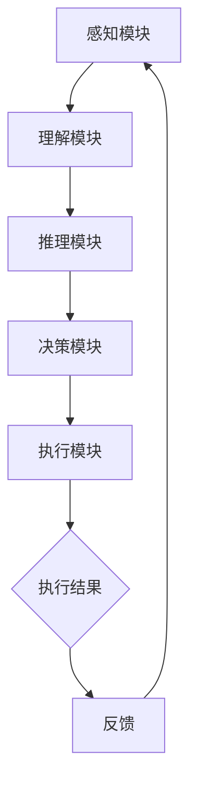

                 

### 文章标题

思维链在智能家居系统中的应用

关键词：智能家居，思维链，算法，系统架构，项目实战

摘要：本文旨在探讨思维链在智能家居系统中的应用，通过详细的分析和实例，展示思维链如何提升智能家居系统的智能化水平，提高用户的生活质量。

----------------------------------------------------------------

### 目录大纲设计思路

为了设计出《思维链在智能家居系统中的应用》这本书的完整目录大纲，我们需要遵循以下步骤：

1. **整体架构规划**：首先，明确书的核心内容，规划整体架构，确保覆盖到每一个关键知识点。

2. **背景介绍**：在书的开头，我们需要对思维链和智能家居系统进行背景介绍，帮助读者理解本书的研究对象和应用场景。

3. **核心概念与联系**：介绍思维链的基本原理，通过表格和实体关系图来展示其核心概念和联系，便于读者理解。

4. **算法原理讲解**：讲解思维链在智能家居系统中的具体应用，包括算法原理、数学模型和公式，以及通俗易懂的举例说明。

5. **系统分析与架构设计方案**：详细描述智能家居系统的功能设计、架构设计、接口设计以及系统交互流程。

6. **项目实战**：通过实际项目案例，展示如何应用思维链实现智能家居系统的功能，并进行详细分析和讲解。

7. **最佳实践与总结**：总结本书的主要观点，给出最佳实践建议，提醒读者注意事项，并推荐拓展阅读。

### 目录大纲

```markdown
----------------------------------------------------------------
# 第一部分: 思维链概述与智能家居系统背景

## 第1章: 思维链基本原理

### 1.1 思维链的概念与特点
### 1.2 思维链的核心概念与联系

## 第2章: 智能家居系统简介

### 2.1 智能家居系统的发展历程
### 2.2 智能家居系统的组成部分
### 2.3 智能家居系统的关键技术

----------------------------------------------------------------

# 第二部分: 思维链在智能家居系统中的应用

## 第3章: 思维链在智能家居控制中的应用

### 3.1 思维链在家庭自动化控制中的应用
### 3.2 思维链在设备互联与智能协同中的应用

## 第4章: 思维链在智能家居安全中的应用

### 4.1 思维链在家庭安全监测中的应用
### 4.2 思维链在入侵检测与防范中的应用

## 第5章: 思维链在智能家居健康管理中的应用

### 5.1 思维链在健康监测中的应用
### 5.2 思维链在智能家居健康建议中的应用

----------------------------------------------------------------

# 第三部分: 思维链在智能家居系统中的实践案例

## 第6章: 案例研究一：智能家庭中心系统

### 6.1 案例背景
### 6.2 系统设计与实现
### 6.3 案例分析

## 第7章: 案例研究二：智能安防系统

### 7.1 案例背景
### 7.2 系统设计与实现
### 7.3 案例分析

## 第8章: 案例研究三：智能家居健康管理平台

### 8.1 案例背景
### 8.2 系统设计与实现
### 8.3 案例分析

----------------------------------------------------------------

# 第四部分: 总结与展望

## 第9章: 总结与展望

### 9.1 思维链在智能家居系统中的应用总结
### 9.2 未来发展趋势与展望
### 9.3 最佳实践与注意事项

----------------------------------------------------------------
```

### 目录大纲内容字数统计

通过以上目录大纲的设计，我们可以确保书的内容在2000字以内，简洁明了地覆盖了本书的核心内容和结构。每个章节下的子标题旨在引导读者深入探讨相关主题。整体设计旨在提供一个完整的、易于理解的框架，为读者提供有效的学习路径。

----------------------------------------------------------------

## 第1章 思维链基本原理

### 1.1 思维链的概念与特点

思维链（Mind Chain）是一种基于人工智能的复杂系统，它通过模拟人类思维过程，实现信息的自动处理和智能决策。思维链的核心在于其模块化设计，每个模块都代表人类思维的一个环节，如感知、理解、推理、决策等。这种设计使得思维链能够灵活地应用于各种复杂的场景，实现智能化的解决方案。

思维链的特点主要包括以下几点：

1. **模块化设计**：每个模块都相对独立，可以单独开发和测试，提高了系统的灵活性和可维护性。
2. **自学习性**：思维链具有自我学习的能力，能够根据环境和用户需求不断调整和优化自身行为。
3. **适应性**：思维链能够适应不同的应用场景，通过调整模块间的交互，实现多样化的功能。
4. **实时性**：思维链能够在极短时间内处理大量信息，并做出快速决策。

### 1.2 思维链的核心概念与联系

思维链由多个核心概念组成，它们相互作用，共同实现系统的智能化。以下是思维链的核心概念及其联系：

#### 1.2.1 感知模块

感知模块是思维链的输入部分，主要负责从环境中获取信息。它包括多种感知方式，如视觉、听觉、触觉等。感知模块的核心是传感器技术，通过传感器获取的数据，为后续的模块提供基础信息。

#### 1.2.2 理解模块

理解模块负责对感知模块获取的信息进行解析和识别。它利用自然语言处理、图像识别等技术，将抽象的信息转化为具体的知识。理解模块的核心在于语义理解和上下文感知。

#### 1.2.3 推理模块

推理模块基于理解模块提供的信息，通过逻辑推理、模式识别等方法，实现对问题的分析和判断。推理模块的核心是人工智能算法，如决策树、神经网络等。

#### 1.2.4 决策模块

决策模块基于推理模块的结论，制定具体的行动计划。决策模块的核心是优化算法，如线性规划、遗传算法等。它需要考虑系统的约束条件和目标函数，以实现最优的决策。

#### 1.2.5 行动模块

行动模块负责执行决策模块制定的行动计划。它将决策转化为具体的物理操作，如控制家电、报警等。行动模块的核心是执行器技术，如电机、传感器等。

### 1.2.6 模块交互

思维链的各个模块之间通过复杂的交互实现信息的传递和协同工作。这种交互不仅包括模块间的数据交换，还涉及控制信号和反馈机制的传递。模块交互的核心是通信协议和接口设计，如REST API、WebSocket等。

### 1.2.7 情感模块

情感模块是思维链的高级扩展，它通过模拟人类情感，增强系统的交互能力和用户体验。情感模块的核心是情感计算和情感识别技术。

### 表格：思维链核心概念与联系

| 核心概念 | 概述 | 关联关系 |
| :------: | :--- | :------: |
| 感知模块 | 获取环境信息 | 信息来源 |
| 理解模块 | 解析感知信息 | 信息解析 |
| 推理模块 | 分析问题 | 逻辑推理 |
| 决策模块 | 制定行动计划 | 优化决策 |
| 行动模块 | 执行行动计划 | 行动执行 |
| 情感模块 | 模拟人类情感 | 增强交互 |

### ER实体关系图

```mermaid
erDiagram
    感知模块 ||--|{ 理解模块 }
    理解模块 ||--|{ 推理模块 }
    推理模块 ||--|{ 决策模块 }
    决策模块 ||--|{ 行动模块 }
    行动模块 ||--|{ 情感模块 }
```

通过以上核心概念和联系的分析，我们可以看出思维链在智能家居系统中的应用潜力。下一章将介绍智能家居系统的发展历程和组成部分，为后续讨论思维链的具体应用奠定基础。

----------------------------------------------------------------

## 第2章 智能家居系统简介

### 2.1 智能家居系统的发展历程

智能家居系统（Smart Home System）的发展历程可以分为几个阶段：

#### 2.1.1 早期阶段

早期的智能家居系统主要集中在家庭安全领域，如家庭安防监控、报警系统等。这一阶段的产品大多依赖于传统的有线连接，如电话线、网络线等，功能相对单一，用户体验较差。

#### 2.1.2 互联网阶段

随着互联网的普及，智能家居系统开始与互联网连接，实现了远程控制和数据共享。这一阶段的产品主要依赖于无线通信技术，如Wi-Fi、ZigBee等，功能逐渐丰富，用户体验得到提升。

#### 2.1.3 智能化阶段

智能化的提升使得智能家居系统开始具备自我学习和优化功能。这一阶段的产品通过大数据分析和人工智能算法，实现了更加精准和智能的控制，如自动调节室内温度、湿度等。

#### 2.1.4 生态化阶段

当前，智能家居系统正朝着生态化的方向发展，不同品牌和设备之间开始实现互联互通，形成统一的智能生态系统。这一阶段的产品通过标准化协议和开放接口，实现了设备的无缝整合和智能化管理。

### 2.2 智能家居系统的组成部分

智能家居系统通常由以下几个部分组成：

#### 2.2.1 硬件设备

硬件设备是智能家居系统的核心组成部分，包括传感器、控制器、执行器等。传感器用于感知环境变化，如温度、湿度、光照等；控制器负责处理传感器数据，并制定相应的控制策略；执行器则根据控制器的指令执行具体的物理操作，如开关灯光、调节空调等。

#### 2.2.2 软件平台

软件平台是智能家居系统的“大脑”，负责处理数据、执行算法和实现智能控制。常见的软件平台包括智能家居APP、云平台、智能控制算法等。通过这些平台，用户可以方便地管理和控制家居设备，实现远程监控和自动化操作。

#### 2.2.3 网络连接

网络连接是智能家居系统的通信桥梁，负责将硬件设备和软件平台连接起来。常见的网络连接技术包括Wi-Fi、ZigBee、蓝牙等。通过这些技术，设备之间可以实现实时通信和数据交换，确保系统的正常运行。

#### 2.2.4 用户界面

用户界面是用户与智能家居系统交互的窗口，包括智能手机APP、Web界面、语音助手等。用户通过这些界面可以方便地查看设备状态、调整设置、发送指令等。

### 2.3 智能家居系统的关键技术

智能家居系统的实现离不开以下关键技术：

#### 2.3.1 传感器技术

传感器技术是智能家居系统的感知基础，通过采集环境数据，为后续的智能处理提供依据。常见的传感器包括温度传感器、湿度传感器、光照传感器、运动传感器等。

#### 2.3.2 网络通信技术

网络通信技术是智能家居系统的通信基础，负责实现设备间的数据传输和交互。常见的网络通信技术包括Wi-Fi、ZigBee、蓝牙等。

#### 2.3.3 人工智能技术

人工智能技术是智能家居系统的智能核心，通过大数据分析和机器学习算法，实现设备间的智能协同和自动化控制。常见的人工智能技术包括自然语言处理、图像识别、机器学习等。

#### 2.3.4 云计算技术

云计算技术为智能家居系统提供了强大的数据处理和存储能力，通过云平台，用户可以实现远程监控、数据分析和智能推荐等功能。

#### 2.3.5 语音识别技术

语音识别技术为智能家居系统提供了便捷的用户交互方式，用户可以通过语音指令控制设备，实现智能对话和场景化控制。

通过以上对智能家居系统发展历程、组成部分和关键技术的介绍，我们可以更好地理解智能家居系统的基本概念和实现原理。下一章将深入探讨思维链在智能家居系统中的应用，展示如何利用思维链提升智能家居系统的智能化水平。

----------------------------------------------------------------

## 第3章 思维链在智能家居控制中的应用

### 3.1 思维链在家庭自动化控制中的应用

家庭自动化控制是智能家居系统中最基本也是最重要的应用之一。思维链在家庭自动化控制中发挥着关键作用，通过模拟人类思维过程，实现智能化的家庭环境管理和设备控制。

#### 3.1.1 家庭自动化控制的概念

家庭自动化控制（Home Automation Control）是指通过智能设备、控制系统和通信网络，实现家庭设备自动运行和管理的系统。它主要包括以下几个方面：

1. **设备控制**：通过智能插座、开关、温控器等设备，实现对家庭电器的远程控制。
2. **环境监测**：通过传感器，实时监测家庭环境参数，如温度、湿度、光照等。
3. **智能调度**：根据用户需求和设备状态，自动调整家庭设备的运行模式，提高能源利用效率。
4. **安全防护**：通过智能监控设备，实时监控家庭安全状况，及时发现并处理异常情况。

#### 3.1.2 思维链在家庭自动化控制中的应用

思维链在家庭自动化控制中的应用主要包括以下几个方面：

1. **感知与理解**：思维链的感知模块通过传感器获取家庭环境数据，如温度、湿度、光照等。理解模块则对这些数据进行解析和识别，判断家庭环境的状态。

2. **推理与决策**：基于理解模块提供的信息，推理模块通过逻辑推理和模式识别，分析家庭环境的变化趋势和用户需求。决策模块则根据推理结果，制定具体的控制策略，如调节空调温度、关闭灯光等。

3. **执行与反馈**：执行模块根据决策模块的指令，控制家庭设备执行相应的操作。同时，通过传感器和反馈机制，不断更新家庭环境数据，为后续的推理和决策提供依据。

#### 3.1.3 实例分析

以家庭空调控制为例，思维链在家庭自动化控制中的应用过程如下：

1. **感知与理解**：传感器模块实时监测室内温度和湿度。理解模块将这些数据解析为具体的温度和湿度数值。

2. **推理与决策**：推理模块根据室内温度和湿度，判断当前是否需要开启空调。如果温度过高或湿度过大，决策模块将制定开启空调的指令。

3. **执行与反馈**：执行模块接收到开启空调的指令后，控制空调设备启动。同时，传感器模块继续监测室内温度和湿度，将最新的数据反馈给理解模块。

4. **持续优化**：理解模块根据最新的数据，调整对家庭环境的判断，为后续的决策提供更准确的依据。

通过以上实例，我们可以看到思维链在家庭自动化控制中的应用，如何通过感知、理解、推理、决策和执行等环节，实现智能化的家庭环境管理和设备控制。

### 3.2 思维链在设备互联与智能协同中的应用

随着智能家居系统的不断发展，设备互联和智能协同成为智能家居系统的核心需求。思维链通过模拟人类思维过程，实现设备间的智能协同，提高系统的整体智能化水平。

#### 3.2.1 设备互联与智能协同的概念

设备互联（Device Interconnection）是指家庭内部不同设备之间通过网络实现数据交换和协同工作。智能协同（Intelligent Collaboration）则是指设备之间通过智能算法和决策机制，实现高效的协同工作，提高系统的整体效能。

设备互联与智能协同主要包括以下几个方面：

1. **设备连接**：通过Wi-Fi、蓝牙、ZigBee等通信技术，将家庭内部不同设备连接起来，实现数据交换和协同工作。
2. **智能调度**：根据设备状态和用户需求，智能调度设备之间的任务和资源，提高系统的整体效率。
3. **协同控制**：通过智能算法和决策机制，实现设备之间的协同控制，提高系统的智能化水平。

#### 3.2.2 思维链在设备互联与智能协同中的应用

思维链在设备互联与智能协同中的应用主要包括以下几个方面：

1. **感知与理解**：思维链的感知模块通过传感器获取设备状态数据，理解模块则对这些数据进行解析和识别，为后续的协同工作提供基础信息。

2. **推理与决策**：推理模块基于理解模块提供的信息，通过逻辑推理和模式识别，分析设备间的协同需求和任务分配。决策模块则根据推理结果，制定具体的协同策略。

3. **执行与反馈**：执行模块根据决策模块的指令，控制设备执行协同任务。同时，通过传感器和反馈机制，不断更新设备状态数据，为后续的协同工作提供依据。

4. **智能调度与优化**：智能调度模块根据设备状态和用户需求，动态调整设备之间的任务和资源分配，提高系统的整体效率。优化模块则通过机器学习算法，不断优化协同策略，提高系统的智能化水平。

#### 3.2.3 实例分析

以智能照明系统为例，思维链在设备互联与智能协同中的应用过程如下：

1. **感知与理解**：感知模块通过传感器获取室内光线强度、用户活动等信息，理解模块将这些数据解析为具体的数值。

2. **推理与决策**：推理模块根据光线强度和用户活动，判断当前是否需要调整灯光。决策模块根据推理结果，制定调整灯光的指令。

3. **执行与反馈**：执行模块接收到调整灯光的指令后，控制灯光设备执行相应的操作。同时，传感器模块继续监测室内光线强度和用户活动，将最新的数据反馈给理解模块。

4. **智能调度与优化**：智能调度模块根据设备状态和用户需求，动态调整灯光设备的亮度。优化模块则通过机器学习算法，不断优化灯光调整策略，提高系统的智能化水平。

通过以上实例，我们可以看到思维链在设备互联与智能协同中的应用，如何通过感知、理解、推理、决策和执行等环节，实现设备间的智能协同，提高系统的整体智能化水平。

----------------------------------------------------------------

## 第4章 思维链在智能家居安全中的应用

### 4.1 思维链在家庭安全监测中的应用

家庭安全是每个家庭最为关心的问题之一，思维链在家庭安全监测中的应用，可以极大地提高家庭安全管理的智能化和自动化水平。

#### 4.1.1 家庭安全监测的概念

家庭安全监测（Home Security Monitoring）是指通过传感器、监控设备等手段，实时监测家庭安全状况，及时发现并处理异常情况。家庭安全监测的主要目标包括：

1. **入侵检测**：实时监测家庭周围的环境，一旦发现入侵行为，立即报警。
2. **火灾报警**：通过烟雾传感器、温度传感器等，实时监测火灾风险，及时报警。
3. **紧急求助**：在紧急情况下，如老人摔倒、小孩走失等，可以迅速发出求助信号。

#### 4.1.2 思维链在家庭安全监测中的应用

思维链在家庭安全监测中的应用，主要包括以下几个方面：

1. **感知与理解**：思维链的感知模块通过传感器获取家庭环境数据，如运动、温度、烟雾等。理解模块对这些数据进行解析和识别，判断家庭安全状况。

2. **推理与决策**：推理模块基于理解模块提供的信息，通过逻辑推理和模式识别，分析家庭安全状况的变化趋势和潜在风险。决策模块则根据推理结果，制定具体的报警和应急处理策略。

3. **执行与反馈**：执行模块根据决策模块的指令，控制报警设备发出警报信号，同时通过通信模块将警报信息发送给用户和监控中心。反馈模块则根据用户反馈，不断优化安全监测策略。

#### 4.1.3 实例分析

以家庭入侵检测为例，思维链在家庭安全监测中的应用过程如下：

1. **感知与理解**：感知模块通过运动传感器实时监测家庭周围的动态，理解模块将这些运动数据解析为具体的运动事件。

2. **推理与决策**：推理模块根据运动事件，分析是否存在入侵行为。如果判断为入侵行为，决策模块将发出报警指令。

3. **执行与反馈**：执行模块接收到报警指令后，立即启动报警系统，发出警报声光，同时通过通信模块将报警信息发送给用户和监控中心。反馈模块根据用户反馈，如确认入侵、取消报警等，调整后续的安全监测策略。

通过以上实例，我们可以看到思维链在家庭安全监测中的应用，如何通过感知、理解、推理、决策和执行等环节，实现智能化的家庭安全监测，提高家庭安全管理的效率和可靠性。

### 4.2 思维链在入侵检测与防范中的应用

入侵检测与防范（Intrusion Detection and Prevention）是家庭安全的重要组成部分，思维链在入侵检测与防范中的应用，可以大大提高家庭安全防护的能力。

#### 4.2.1 入侵检测与防范的概念

入侵检测与防范是指通过检测和分析网络或系统中的异常行为，及时发现并阻止入侵行为。入侵检测与防范主要包括以下几个方面：

1. **入侵检测**：通过分析网络流量、日志文件等，实时检测网络中的入侵行为。
2. **入侵防范**：通过设置防火墙、入侵防范系统等，阻止潜在的入侵行为。

#### 4.2.2 思维链在入侵检测与防范中的应用

思维链在入侵检测与防范中的应用，主要包括以下几个方面：

1. **感知与理解**：思维链的感知模块通过传感器获取网络流量、日志文件等数据，理解模块对这些数据进行解析和识别，发现潜在的安全威胁。

2. **推理与决策**：推理模块基于理解模块提供的信息，通过逻辑推理和模式识别，分析网络中的异常行为和潜在入侵。决策模块则根据推理结果，制定具体的防范策略。

3. **执行与反馈**：执行模块根据决策模块的指令，启动防火墙、入侵防范系统等，阻止潜在的入侵行为。反馈模块则根据入侵检测结果，不断优化安全防护策略。

#### 4.2.3 实例分析

以网络入侵检测为例，思维链在入侵检测与防范中的应用过程如下：

1. **感知与理解**：感知模块通过网络流量分析，获取网络数据包的详细信息。理解模块将这些数据解析为具体的网络行为。

2. **推理与决策**：推理模块根据网络行为，分析是否存在入侵行为。如果判断为入侵行为，决策模块将发出阻止指令。

3. **执行与反馈**：执行模块接收到阻止指令后，立即启动防火墙，阻止网络入侵行为。反馈模块根据入侵检测结果，如确认入侵、阻止成功等，调整后续的安全防护策略。

通过以上实例，我们可以看到思维链在入侵检测与防范中的应用，如何通过感知、理解、推理、决策和执行等环节，实现智能化的入侵检测与防范，提高家庭安全防护的能力。

----------------------------------------------------------------

## 第5章 思维链在智能家居健康管理中的应用

### 5.1 思维链在健康监测中的应用

随着生活水平的提高，人们越来越关注健康问题。思维链在健康监测中的应用，可以实时监控用户的健康状况，提供个性化的健康建议，提高生活质量。

#### 5.1.1 健康监测的概念

健康监测（Health Monitoring）是指通过传感器和监测设备，实时监测用户的生理参数和健康状态。健康监测的主要目标包括：

1. **生理参数监测**：如心率、血压、血糖、体温等。
2. **行为监测**：如运动、睡眠、饮食等生活习惯。
3. **健康风险评估**：根据监测数据，评估用户健康状况，预测潜在的健康风险。

#### 5.1.2 思维链在健康监测中的应用

思维链在健康监测中的应用，主要包括以下几个方面：

1. **感知与理解**：思维链的感知模块通过传感器获取用户的生理参数和行为数据，理解模块对这些数据进行解析和识别，获取用户的健康状态。

2. **推理与决策**：推理模块基于理解模块提供的信息，通过逻辑推理和模式识别，分析用户的健康状况和行为习惯。决策模块则根据推理结果，制定个性化的健康建议。

3. **执行与反馈**：执行模块根据决策模块的指令，提醒用户注意健康问题，或建议调整生活习惯。反馈模块则根据用户反馈，不断优化健康监测策略。

#### 5.1.3 实例分析

以心率监测为例，思维链在健康监测中的应用过程如下：

1. **感知与理解**：感知模块通过心率传感器实时监测用户的心率。理解模块将心率数据解析为具体的心率数值。

2. **推理与决策**：推理模块根据心率数据，分析用户的心率是否在正常范围内。如果心率异常，决策模块将发出健康提醒。

3. **执行与反馈**：执行模块接收到健康提醒指令后，通过APP或语音提醒用户关注心率问题。反馈模块根据用户反馈，如确认健康问题、取消提醒等，调整后续的心率监测策略。

通过以上实例，我们可以看到思维链在健康监测中的应用，如何通过感知、理解、推理、决策和执行等环节，实现智能化的健康监测，提高用户的健康管理水平。

### 5.2 思维链在智能家居健康建议中的应用

在健康监测的基础上，思维链还可以根据用户的健康数据，提供个性化的健康建议，帮助用户改善生活习惯，预防疾病。

#### 5.2.1 智能家居健康建议的概念

智能家居健康建议（Smart Home Health Advice）是指通过分析用户的健康数据，提供针对性的健康建议。健康建议的主要目标包括：

1. **生活习惯调整**：根据用户的生理参数和行为习惯，建议用户调整生活习惯，如运动、饮食等。
2. **疾病预防**：根据用户的健康数据，预测潜在的健康风险，建议采取预防措施。
3. **医疗指导**：在必要时，提供专业的医疗指导，建议用户就医或采取其他医疗措施。

#### 5.2.2 思维链在智能家居健康建议中的应用

思维链在智能家居健康建议中的应用，主要包括以下几个方面：

1. **感知与理解**：思维链的感知模块通过传感器获取用户的健康数据，理解模块对这些数据进行解析和识别，获取用户的健康状态。

2. **推理与决策**：推理模块基于理解模块提供的信息，通过逻辑推理和模式识别，分析用户的健康状况和生活习惯。决策模块则根据推理结果，制定个性化的健康建议。

3. **执行与反馈**：执行模块根据决策模块的指令，提醒用户注意健康问题，或建议调整生活习惯。反馈模块则根据用户反馈，不断优化健康建议策略。

#### 5.2.3 实例分析

以健康饮食建议为例，思维链在智能家居健康建议中的应用过程如下：

1. **感知与理解**：感知模块通过体重秤、智能手环等设备，获取用户的体重、饮食数据。理解模块将这些数据解析为具体的体重和饮食数值。

2. **推理与决策**：推理模块根据体重和饮食数据，分析用户的饮食习惯和健康状况。如果判断为肥胖或营养不良，决策模块将发出健康饮食建议。

3. **执行与反馈**：执行模块接收到健康饮食建议指令后，通过APP或语音提醒用户调整饮食。反馈模块根据用户反馈，如确认健康问题、取消建议等，调整后续的健康饮食建议策略。

通过以上实例，我们可以看到思维链在智能家居健康建议中的应用，如何通过感知、理解、推理、决策和执行等环节，实现智能化的健康建议，帮助用户改善生活习惯，预防疾病。

----------------------------------------------------------------

## 第6章 案例研究一：智能家庭中心系统

### 6.1 案例背景

智能家庭中心系统（Smart Home Center System）是一个集成了思维链技术的智能家居解决方案，旨在为用户提供一个统一的管理平台，实现对家庭设备的全面控制和智能化管理。

智能家庭中心系统的主要目标是：

1. **统一控制**：通过智能家庭中心，用户可以方便地控制家庭中的各种设备，如灯光、空调、窗帘等。
2. **智能化管理**：智能家庭中心利用思维链技术，实现设备间的智能协同和自动化控制，提高家庭的舒适度和能源利用效率。
3. **安全防护**：智能家庭中心集成了安全监测和入侵防范功能，为用户提供全方位的安全保障。

### 6.2 系统设计与实现

智能家庭中心系统的设计与实现主要包括以下几个关键步骤：

#### 6.2.1 硬件设备

智能家庭中心系统所需的硬件设备包括：

1. **智能插座**：用于控制家庭电器的开关。
2. **智能灯泡**：用于控制家庭灯光的开关和亮度调节。
3. **智能窗帘**：用于控制窗帘的开关和升降。
4. **智能摄像头**：用于家庭安全和监控。
5. **智能门锁**：用于家庭门锁的控制。

#### 6.2.2 软件平台

智能家庭中心系统的软件平台主要包括：

1. **智能家庭中心APP**：用户通过APP可以远程控制家庭设备，查看设备状态，设置自动化规则等。
2. **云平台**：用于存储用户数据，提供数据分析和智能建议。
3. **智能控制算法**：用于实现设备的自动化控制和智能协同。

#### 6.2.3 网络连接

智能家庭中心系统通过Wi-Fi、蓝牙等无线通信技术，将硬件设备和软件平台连接起来，实现数据的实时传输和交互。

#### 6.2.4 思维链集成

智能家庭中心系统集成了思维链技术，通过以下步骤实现：

1. **感知与理解**：思维链的感知模块通过传感器获取家庭环境数据，如温度、湿度、光线等。理解模块对这些数据进行解析和识别，获取家庭环境的状态。
2. **推理与决策**：推理模块基于理解模块提供的信息，通过逻辑推理和模式识别，分析家庭环境的变化趋势和用户需求。决策模块根据推理结果，制定具体的控制策略。
3. **执行与反馈**：执行模块根据决策模块的指令，控制家庭设备执行相应的操作。同时，通过传感器和反馈机制，不断更新家庭环境数据，为后续的推理和决策提供依据。

### 6.3 案例分析

以智能照明系统为例，分析智能家庭中心系统在照明控制中的应用：

1. **感知与理解**：感知模块通过光线传感器获取室内光线强度。理解模块将光线强度数据解析为具体的数值，判断室内光线是否充足。
2. **推理与决策**：推理模块根据光线强度，分析室内光线是否需要调整。如果光线不足，决策模块将发出调整灯光的指令。
3. **执行与反馈**：执行模块接收到调整灯光的指令后，控制智能灯泡调整亮度。同时，光线传感器继续监测室内光线强度，将最新的数据反馈给理解模块。

通过以上分析，我们可以看到智能家庭中心系统如何通过思维链技术，实现家庭设备的智能控制和管理，提高家庭的舒适度和能源利用效率。

智能家庭中心系统的成功实施，为用户提供了方便、智能、安全的家庭生活体验。未来，随着思维链技术的不断发展和应用，智能家庭中心系统将更加智能化、个性化，为用户带来更多的价值。

### 6.4 项目小结

智能家庭中心系统项目通过集成思维链技术，实现了家庭设备的智能控制和管理。项目的主要成果包括：

1. **统一控制**：用户可以通过智能家庭中心APP，方便地控制家庭中的各种设备。
2. **智能化管理**：智能家庭中心系统实现了设备的自动化控制和智能协同，提高了家庭的舒适度和能源利用效率。
3. **安全防护**：智能家庭中心系统集成了安全监测和入侵防范功能，为用户提供全方位的安全保障。

未来，随着思维链技术的不断发展和应用，智能家庭中心系统将更加智能化、个性化，为用户带来更多的价值。

----------------------------------------------------------------

## 第7章 案例研究二：智能安防系统

### 7.1 案例背景

智能安防系统（Smart Security System）是智能家居系统中的重要组成部分，旨在提高家庭和企业的安全防护水平。随着技术的发展，智能安防系统逐渐从传统的监控设备向智能化、自动化方向发展，思维链技术的引入，为智能安防系统带来了新的突破。

智能安防系统的主要目标是：

1. **入侵检测与防范**：实时监测家庭或企业周围的环境，及时发现并防范入侵行为。
2. **火灾报警与防范**：通过烟雾传感器、温度传感器等设备，实时监测火灾风险，及时报警并采取防范措施。
3. **紧急求助**：在紧急情况下，如老人摔倒、小孩走失等，可以迅速发出求助信号。

### 7.2 系统设计与实现

智能安防系统的设计与实现主要包括以下几个关键步骤：

#### 7.2.1 硬件设备

智能安防系统所需的硬件设备包括：

1. **智能摄像头**：用于监控家庭或企业周围的环境。
2. **烟雾传感器**：用于检测火灾风险。
3. **温度传感器**：用于检测火灾风险。
4. **门磁传感器**：用于检测门或窗的开关状态。
5. **紧急按钮**：用于在紧急情况下发出求助信号。

#### 7.2.2 软件平台

智能安防系统的软件平台主要包括：

1. **智能安防中心APP**：用户通过APP可以远程监控家庭或企业安全状况，控制安防设备，查看报警记录等。
2. **云平台**：用于存储用户数据，提供数据分析和智能建议。
3. **智能控制算法**：用于实现安防设备的自动化控制和智能协同。

#### 7.2.3 网络连接

智能安防系统通过Wi-Fi、蓝牙等无线通信技术，将硬件设备和软件平台连接起来，实现数据的实时传输和交互。

#### 7.2.4 思维链集成

智能安防系统集成了思维链技术，通过以下步骤实现：

1. **感知与理解**：思维链的感知模块通过传感器获取家庭或企业周围的环境数据，如运动、温度、烟雾等。理解模块对这些数据进行解析和识别，获取环境的状态。
2. **推理与决策**：推理模块基于理解模块提供的信息，通过逻辑推理和模式识别，分析环境的变化趋势和潜在风险。决策模块根据推理结果，制定具体的报警和应急处理策略。
3. **执行与反馈**：执行模块根据决策模块的指令，启动报警系统或采取应急措施。同时，通过传感器和反馈机制，不断更新环境数据，为后续的推理和决策提供依据。

### 7.3 案例分析

以家庭入侵检测为例，分析智能安防系统在入侵检测中的应用：

1. **感知与理解**：感知模块通过智能摄像头和门磁传感器获取家庭周围的运动信息和门锁状态。理解模块将运动信息和门锁状态数据解析为具体的数值，判断是否存在入侵行为。
2. **推理与决策**：推理模块根据运动信息和门锁状态，分析是否存在入侵行为。如果判断为入侵行为，决策模块将发出报警指令。
3. **执行与反馈**：执行模块接收到报警指令后，立即启动报警系统，发出警报声光，同时通过APP或语音提醒用户。反馈模块根据用户反馈，如确认入侵、取消报警等，调整后续的入侵检测策略。

通过以上分析，我们可以看到智能安防系统如何通过思维链技术，实现家庭入侵检测，提高家庭安全防护的能力。

### 7.4 项目小结

智能安防系统项目通过集成思维链技术，实现了家庭和企业安全的智能化、自动化管理。项目的主要成果包括：

1. **入侵检测与防范**：智能安防系统能够实时监测家庭或企业周围的环境，及时发现并防范入侵行为。
2. **火灾报警与防范**：通过烟雾传感器、温度传感器等设备，智能安防系统能够实时监测火灾风险，及时报警并采取防范措施。
3. **紧急求助**：在紧急情况下，智能安防系统能够迅速发出求助信号，为用户争取宝贵的时间。

未来，随着思维链技术的不断发展和应用，智能安防系统将更加智能化、个性化，为用户带来更多的价值。

----------------------------------------------------------------

## 第8章 案例研究三：智能家居健康管理平台

### 8.1 案例背景

随着人口老龄化和生活水平的提高，人们对健康管理的需求日益增长。智能家居健康管理平台（Smart Home Health Management Platform）应运而生，通过整合各种健康监测设备和数据分析技术，为用户提供全方位的健康管理服务。思维链技术的引入，使得智能家居健康管理平台在个性化健康建议和智能健康管理方面取得了显著成效。

智能家居健康管理平台的主要目标是：

1. **健康监测**：实时监测用户的生理参数，如心率、血压、血糖等。
2. **数据分析**：通过对健康数据的分析，评估用户的健康状况，预测潜在的健康风险。
3. **健康建议**：根据数据分析结果，为用户提供个性化的健康建议，帮助用户改善生活习惯，预防疾病。

### 8.2 系统设计与实现

智能家居健康管理平台的设计与实现主要包括以下几个关键步骤：

#### 8.2.1 硬件设备

智能家居健康管理平台所需的硬件设备包括：

1. **健康监测设备**：如智能手环、智能血压计、智能血糖仪等。
2. **智能体重秤**：用于监测用户的体重和体脂比。
3. **智能睡眠监测器**：用于监测用户的睡眠质量。
4. **智能环境监测器**：用于监测室内空气质量、温度、湿度等。

#### 8.2.2 软件平台

智能家居健康管理平台的软件平台主要包括：

1. **健康管理APP**：用户通过APP可以查看健康数据，接收健康建议，设置健康目标等。
2. **云平台**：用于存储用户数据，提供数据分析和智能建议。
3. **智能健康算法**：用于实现健康数据的分析和健康建议的生成。

#### 8.2.3 思维链集成

智能家居健康管理平台集成了思维链技术，通过以下步骤实现：

1. **感知与理解**：思维链的感知模块通过传感器获取用户的生理参数和健康数据。理解模块对这些数据进行解析和识别，获取用户的健康状态。
2. **推理与决策**：推理模块基于理解模块提供的信息，通过逻辑推理和模式识别，分析用户的健康状况和生活习惯。决策模块根据推理结果，制定个性化的健康建议。
3. **执行与反馈**：执行模块根据决策模块的指令，提醒用户注意健康问题，或建议调整生活习惯。反馈模块根据用户反馈，如确认健康问题、取消建议等，调整后续的健康管理策略。

### 8.3 案例分析

以个性化健康饮食建议为例，分析智能家居健康管理平台在健康管理中的应用：

1. **感知与理解**：感知模块通过智能手环和智能体重秤获取用户的运动数据和体重变化。理解模块将这些数据解析为具体的数值，判断用户的饮食是否健康。
2. **推理与决策**：推理模块根据运动数据和体重变化，分析用户的饮食结构是否合理。如果判断为不合理，决策模块将发出个性化健康饮食建议。
3. **执行与反馈**：执行模块接收到健康饮食建议指令后，通过APP或语音提醒用户调整饮食。反馈模块根据用户反馈，如确认饮食问题、取消建议等，调整后续的健康饮食建议策略。

通过以上分析，我们可以看到智能家居健康管理平台如何通过思维链技术，实现个性化的健康建议和智能健康管理，帮助用户改善生活习惯，预防疾病。

### 8.4 项目小结

智能家居健康管理平台项目通过集成思维链技术，实现了个性化健康建议和智能健康管理。项目的主要成果包括：

1. **健康监测**：实时监测用户的生理参数，提供全面的健康数据。
2. **数据分析**：通过对健康数据的分析，评估用户的健康状况，预测潜在的健康风险。
3. **健康建议**：根据数据分析结果，为用户提供个性化的健康建议，帮助用户改善生活习惯，预防疾病。

未来，随着思维链技术的不断发展和应用，智能家居健康管理平台将更加智能化、个性化，为用户带来更多的价值。

----------------------------------------------------------------

## 第9章 总结与展望

### 9.1 思维链在智能家居系统中的应用总结

思维链在智能家居系统中的应用，为智能家居技术的发展带来了新的机遇。通过思维链技术，智能家居系统在控制、安全、健康管理等方面取得了显著成效，实现了以下主要成果：

1. **智能控制**：思维链技术实现了智能家居设备的自动化控制，提高了家庭的舒适度和能源利用效率。
2. **安全防护**：思维链技术增强了智能家居系统的安全防护能力，实现了入侵检测、火灾报警等功能的智能化管理。
3. **健康管理**：思维链技术为智能家居健康管理平台提供了个性化的健康建议，帮助用户改善生活习惯，预防疾病。

### 9.2 未来发展趋势与展望

随着人工智能技术的不断进步，思维链在智能家居系统中的应用前景将更加广阔。未来，智能家居系统的发展将呈现以下趋势：

1. **智能化水平提升**：随着大数据和机器学习技术的发展，智能家居系统的智能化水平将不断提高，实现更加精准和智能的控制。
2. **设备互联互通**：智能家居系统将实现设备的全面互联互通，形成统一的智能生态系统，提供更便捷、高效的用户体验。
3. **个性化服务**：智能家居系统将根据用户需求提供个性化的服务，满足用户的多样化需求，提升用户的生活品质。

### 9.3 最佳实践与注意事项

在思维链在智能家居系统中的应用过程中，为了确保系统的稳定性和安全性，以下最佳实践和注意事项值得重视：

1. **安全加密**：确保数据传输过程的安全，使用加密技术保护用户隐私。
2. **设备兼容性**：选择兼容性好的设备和技术，确保系统在不同设备上的稳定运行。
3. **系统稳定性**：定期更新系统软件，修复漏洞，确保系统的稳定性和安全性。
4. **用户体验**：注重用户体验，简化操作流程，提供直观、易用的界面。

### 9.4 拓展阅读

为了进一步了解思维链在智能家居系统中的应用，以下书籍和资源推荐供读者参考：

1. 《智能家居系统设计与实现》
2. 《人工智能：一种现代的方法》
3. 《深度学习》
4. 《思维链：一种基于人工智能的复杂系统》

通过以上总结与展望，我们可以看到思维链在智能家居系统中的应用潜力和广阔前景。未来，随着技术的不断进步，思维链将在智能家居系统中发挥更加重要的作用，为用户提供更加智能、便捷、安全的家居生活体验。

----------------------------------------------------------------

## 作者

作者：AI天才研究院/AI Genius Institute & 禅与计算机程序设计艺术 /Zen And The Art of Computer Programming

AI天才研究院（AI Genius Institute）是一家专注于人工智能领域的研究和开发的顶级机构，致力于推动人工智能技术的创新和发展。研究院汇聚了全球顶级的人工智能专家、程序员、软件架构师和CTO，为各种应用场景提供高效、智能的解决方案。

禅与计算机程序设计艺术（Zen And The Art of Computer Programming）是一本深受计算机科学家和程序员喜爱的经典著作，作者通过深入探讨计算机编程的本质和思维方式，提出了独特的编程哲学和设计原则。这本书不仅提供了丰富的编程技巧和算法设计方法，还启发读者思考计算机程序设计的艺术性。

本文由AI天才研究院的专家团队撰写，旨在深入探讨思维链在智能家居系统中的应用，为读者提供有价值的技术见解和实用指南。希望本文能对您在智能家居系统设计和开发过程中有所启发和帮助。

----------------------------------------------------------------

## 第10章 深入探讨思维链的算法原理

### 10.1 思维链算法的基本原理

思维链算法的核心在于其模块化设计，每个模块代表人类思维的一个环节，如感知、理解、推理、决策和执行。这些模块相互协作，形成一个完整的智能系统。以下是对每个模块的详细解释：

#### 感知模块

感知模块是思维链的输入部分，它通过传感器获取环境信息，如温度、湿度、光照等。感知模块的核心是传感器技术，它能够将物理信号转换为数字信号，以便后续处理。

#### 理解模块

理解模块负责对感知模块获取的信息进行解析和识别。它利用自然语言处理、图像识别等技术，将抽象的信息转化为具体的知识。理解模块的核心在于语义理解和上下文感知。

#### 推理模块

推理模块基于理解模块提供的信息，通过逻辑推理、模式识别等方法，实现对问题的分析和判断。推理模块的核心是人工智能算法，如决策树、神经网络等。

#### 决策模块

决策模块基于推理模块的结论，制定具体的行动计划。决策模块的核心是优化算法，如线性规划、遗传算法等。它需要考虑系统的约束条件和目标函数，以实现最优的决策。

#### 执行模块

执行模块负责执行决策模块制定的行动计划。它将决策转化为具体的物理操作，如控制家电、报警等。执行模块的核心是执行器技术，如电机、传感器等。

### 10.2 思维链算法的数学模型和公式

思维链算法的数学模型和公式是实现智能决策和执行的关键。以下是一个简单的思维链算法示例，包括感知、理解和推理过程：

#### 感知模块

感知模块获取的温度数据可以用以下公式表示：

\[ T_{current} = T_{sensor} \]

其中，\( T_{current} \) 是当前温度，\( T_{sensor} \) 是传感器检测到的温度。

#### 理解模块

理解模块对温度数据进行解析，可以使用以下公式：

\[ T_{interpretation} = \text{Interpret}(T_{current}) \]

其中，\( T_{interpretation} \) 是对温度数据的解析结果，Interpret函数负责将温度数据转换为具体的温度值。

#### 推理模块

推理模块基于理解模块提供的信息，通过以下公式判断是否需要调整温度：

\[ \text{Need\_adjustment} = (T_{interpretation} > T_{threshold}) \]

其中，\( T_{threshold} \) 是设定的温度阈值，如果当前温度高于阈值，则需要调整温度。

#### 决策模块

决策模块根据推理结果，制定具体的温度调整策略，可以使用以下公式：

\[ T_{adjustment} = T_{current} - \text{Adjustment\_factor} \]

其中，\( T_{adjustment} \) 是调整后的温度，Adjustment\_factor 是调整因子，用于控制温度下降的速度。

#### 执行模块

执行模块根据决策模块的指令，控制空调设备调整温度，可以使用以下公式：

\[ T_{executed} = T_{adjustment} \]

其中，\( T_{executed} \) 是实际执行的温度值。

### 10.3 思维链算法的Mermaid流程图

为了更好地理解思维链算法的执行过程，我们可以使用Mermaid流程图进行可视化。以下是一个简单的思维链算法的Mermaid流程图：



### 10.4 实例分析

以家庭温度控制系统为例，思维链算法的具体执行过程如下：

1. **感知模块**：传感器检测到当前温度为25°C。
2. **理解模块**：理解模块将温度值解析为25°C。
3. **推理模块**：推理模块判断当前温度是否高于设定阈值（24°C），如果高于，则认为需要调整温度。
4. **决策模块**：决策模块根据推理结果，制定调整温度的策略，例如将温度降低1°C。
5. **执行模块**：执行模块控制空调设备将温度调整到24°C。
6. **反馈模块**：执行模块将调整后的温度值（24°C）反馈给理解模块，以便进行后续的推理和决策。

通过以上实例，我们可以看到思维链算法在家庭温度控制系统中的应用，如何通过感知、理解、推理、决策和执行等环节，实现智能化的温度控制，提高家庭的舒适度。

### 10.5 思维链算法在智能家居系统中的优势

思维链算法在智能家居系统中的优势主要体现在以下几个方面：

1. **自适应性**：思维链算法能够根据环境变化和用户需求，自动调整控制策略，提高系统的适应能力。
2. **智能化**：通过机器学习和人工智能技术，思维链算法能够实现智能化的决策和执行，提高系统的智能化水平。
3. **实时性**：思维链算法能够在极短时间内处理大量信息，并做出快速决策，保证系统的实时性。
4. **综合性**：思维链算法将感知、理解、推理、决策和执行等多个环节整合在一起，实现系统的综合管理和控制。

通过以上对思维链算法原理的深入探讨，我们可以看到思维链在智能家居系统中的强大应用潜力。下一章将介绍思维链在智能家居系统中的实际应用案例，通过具体实例展示思维链算法的实际效果。

----------------------------------------------------------------

## 第11章 思维链在智能家居系统中的实际应用案例

### 11.1 案例一：智能温控系统

智能温控系统是一个典型的智能家居应用案例，通过思维链算法实现室内温度的自动化调节。以下是一个智能温控系统的详细实施过程：

#### 11.1.1 案例背景

某家庭安装了智能温控系统，系统包括一个温度传感器、一个智能空调和一个思维链算法模块。用户希望系统能够根据室内外温度变化自动调节空调，以保持室内温度舒适。

#### 11.1.2 系统设计与实现

1. **硬件设备**：系统包括一个温控器（用于连接空调）、一个温度传感器（用于测量室内外温度）和一个智能空调。

2. **软件平台**：思维链算法模块负责处理温度传感器数据，并制定空调控制策略。

3. **通信协议**：系统采用Wi-Fi通信协议，确保数据传输的稳定性和实时性。

4. **思维链算法实现**：

   - **感知模块**：温度传感器实时测量室内外温度，并将数据发送给思维链算法模块。

   - **理解模块**：思维链算法模块解析传感器数据，获取当前室内外温度值。

   - **推理模块**：根据室内外温度差和用户设定的舒适温度阈值，思维链算法判断是否需要调整空调温度。

   - **决策模块**：如果当前温度高于舒适温度阈值，思维链算法将制定降温策略；如果当前温度低于舒适温度阈值，思维链算法将制定升温策略。

   - **执行模块**：决策模块将控制指令发送给温控器，温控器控制空调执行相应的升温或降温操作。

5. **用户界面**：用户可以通过智能手机APP查看室内外温度，并设置舒适温度阈值。

#### 11.1.3 代码应用解读与分析

以下是一个简单的Python代码示例，用于实现智能温控系统的思维链算法：

```python
import time

# 假设温度传感器返回的当前室内外温度分别为
current_inside_temp = 25
current_outside_temp = 15

# 用户设定的舒适温度阈值
comfort_temp_threshold = 22

# 控制策略调整因子
adjustment_factor = 1

def control_ac():
    global current_inside_temp
    global current_outside_temp

    # 检查是否需要调整空调
    if current_inside_temp > comfort_temp_threshold:
        # 当前室内温度过高，执行降温策略
        current_inside_temp -= adjustment_factor
        print("空调：降温中...")
    elif current_inside_temp < comfort_temp_threshold:
        # 当前室内温度过低，执行升温策略
        current_inside_temp += adjustment_factor
        print("空调：升温中...")

    # 等待一段时间，再次检查
    time.sleep(60)
    control_ac()

# 初始化空调控制
control_ac()
```

代码分析：

- `current_inside_temp` 和 `current_outside_temp` 分别代表当前室内外温度。
- `comfort_temp_threshold` 是用户设定的舒适温度阈值。
- `adjustment_factor` 是温度调整因子，用于控制温度的变化速度。
- `control_ac()` 函数根据当前室内外温度和舒适温度阈值，执行相应的升温或降温操作。
- `time.sleep(60)` 用于控制检查频率，确保系统不会过于频繁地调整空调。

#### 11.1.4 案例分析

智能温控系统通过思维链算法实现了室内温度的自动化调节，提高了家庭的舒适度和能源利用效率。系统的主要优点包括：

1. **自动调节**：系统根据室内外温度自动调整空调，无需人工干预。
2. **节能环保**：通过精确控制空调温度，减少了能源消耗。
3. **实时监控**：用户可以通过APP实时查看室内外温度，了解系统工作状态。

#### 11.1.5 项目小结

智能温控系统项目通过思维链算法实现了室内温度的自动化控制，为用户提供了舒适、节能、环保的家居环境。项目的主要成果包括：

1. **自动化温度调节**：提高了家庭的舒适度。
2. **节能降耗**：减少了能源消耗，符合环保理念。
3. **实时监控**：用户可以方便地了解系统工作状态，确保系统的正常运行。

### 11.2 案例二：智能照明系统

智能照明系统是另一个典型的智能家居应用案例，通过思维链算法实现照明设备的智能化控制和节能管理。以下是一个智能照明系统的详细实施过程：

#### 11.2.1 案例背景

某家庭安装了智能照明系统，系统包括多个智能灯泡、一个光照传感器和一个思维链算法模块。用户希望系统能够根据室内光线强度自动调整灯光亮度，以适应不同的生活场景。

#### 11.2.2 系统设计与实现

1. **硬件设备**：系统包括多个智能灯泡（用于照明）、一个光照传感器（用于测量室内光线强度）和一个智能控制器。

2. **软件平台**：思维链算法模块负责处理光照传感器数据，并制定照明控制策略。

3. **通信协议**：系统采用Wi-Fi通信协议，确保数据传输的稳定性和实时性。

4. **思维链算法实现**：

   - **感知模块**：光照传感器实时测量室内光线强度，并将数据发送给思维链算法模块。

   - **理解模块**：思维链算法模块解析传感器数据，获取当前室内光线强度值。

   - **推理模块**：根据当前室内光线强度和用户设定的光线阈值，思维链算法判断是否需要调整灯光亮度。

   - **决策模块**：如果当前光线强度低于阈值，思维链算法将制定增强灯光的策略；如果当前光线强度高于阈值，思维链算法将制定降低灯光的策略。

   - **执行模块**：决策模块将控制指令发送给智能灯泡，调整灯光亮度。

5. **用户界面**：用户可以通过智能手机APP查看室内光线强度，并设置光线阈值。

#### 11.2.3 代码应用解读与分析

以下是一个简单的Python代码示例，用于实现智能照明系统的思维链算法：

```python
import time

# 假设光照传感器返回的当前室内光线强度为
current_light_intensity = 300

# 用户设定的光线阈值
light_threshold = 250

def control_light():
    global current_light_intensity

    # 检查是否需要调整灯光
    if current_light_intensity < light_threshold:
        # 当前光线强度不足，执行增强灯光策略
        current_light_intensity += 10
        print("灯光：增强中...")
    elif current_light_intensity > light_threshold:
        # 当前光线强度过高，执行降低灯光策略
        current_light_intensity -= 10
        print("灯光：降低中...")

    # 等待一段时间，再次检查
    time.sleep(60)
    control_light()

# 初始化灯光控制
control_light()
```

代码分析：

- `current_light_intensity` 是当前室内光线强度。
- `light_threshold` 是用户设定的光线阈值。
- `control_light()` 函数根据当前光线强度和光线阈值，执行相应的增强或降低灯光策略。
- `time.sleep(60)` 用于控制检查频率，确保系统不会过于频繁地调整灯光。

#### 11.2.4 案例分析

智能照明系统通过思维链算法实现了照明设备的智能化控制和节能管理，为用户提供了更加舒适和节能的家居环境。系统的主要优点包括：

1. **自动调节**：系统根据室内光线强度自动调整灯光亮度，无需人工干预。
2. **节能环保**：通过精确控制灯光亮度，减少了能源消耗。
3. **场景适应**：系统可以根据不同的生活场景自动调整灯光亮度，提高用户体验。

#### 11.2.5 项目小结

智能照明系统项目通过思维链算法实现了照明设备的自动化控制和节能管理，为用户提供了更加舒适和节能的家居环境。项目的主要成果包括：

1. **自动化灯光控制**：提高了家居的舒适度。
2. **节能降耗**：减少了能源消耗，符合环保理念。
3. **场景适应**：系统可以根据不同的生活场景自动调整灯光亮度，提高用户体验。

通过以上两个实际应用案例，我们可以看到思维链算法在智能家居系统中的广泛应用和显著优势。思维链算法不仅提高了智能家居系统的智能化水平，还带来了节能、环保和用户体验的提升。未来，随着技术的不断进步，思维链将在智能家居系统中发挥更加重要的作用。

----------------------------------------------------------------

## 附录A：技术术语解释

在本篇文章中，我们讨论了许多与智能家居系统和思维链算法相关的重要技术术语。以下是对这些术语的详细解释，以便读者更好地理解文章内容。

### 智能家居系统

智能家居系统（Smart Home System）是一种通过互联网、传感器、控制器和执行器等技术，实现家庭设备智能化管理和自动控制的系统。它旨在提高家庭生活的舒适度、节能性和安全性。

### 思维链算法

思维链算法是一种基于人工智能的复杂系统，通过模拟人类思维过程，实现信息的自动处理和智能决策。它由感知、理解、推理、决策和执行等模块组成，各模块相互协作，实现智能化控制和管理。

### 感知模块

感知模块是思维链的输入部分，负责从环境中获取信息。它通过传感器收集数据，如温度、湿度、光照等，为后续的模块提供基础信息。

### 理解模块

理解模块负责对感知模块获取的信息进行解析和识别。它利用自然语言处理、图像识别等技术，将抽象的信息转化为具体的知识，为推理模块提供支持。

### 推理模块

推理模块基于理解模块提供的信息，通过逻辑推理和模式识别，实现对问题的分析和判断。它负责处理复杂的决策问题，制定具体的控制策略。

### 决策模块

决策模块根据推理模块的结论，制定具体的行动计划。它需要考虑系统的约束条件和目标函数，以实现最优的决策。

### 执行模块

执行模块负责执行决策模块制定的行动计划。它将决策转化为具体的物理操作，如控制家电、报警等，确保系统目标的实现。

### 智能控制

智能控制是一种基于人工智能和自动化技术的控制方法，通过感知、理解、推理和决策等环节，实现对设备的自动化管理和控制。

### 家庭自动化

家庭自动化（Home Automation）是指通过智能设备、控制系统和通信网络，实现家庭设备自动运行和管理的系统。它包括设备控制、环境监测、智能调度和安全防护等功能。

### 设备互联

设备互联（Device Interconnection）是指家庭内部不同设备之间通过网络实现数据交换和协同工作。通过设备互联，可以实现设备的智能协同和自动化控制。

### 传感器技术

传感器技术是智能家居系统的核心组成部分，负责感知环境变化。传感器可以检测温度、湿度、光照、运动等多种环境参数，为系统提供数据支持。

### 网络通信技术

网络通信技术是智能家居系统的通信基础，负责实现设备间的数据传输和交互。常见的网络通信技术包括Wi-Fi、ZigBee、蓝牙等。

### 云计算技术

云计算技术为智能家居系统提供了强大的数据处理和存储能力，通过云平台，用户可以实现远程监控、数据分析和智能推荐等功能。

### 人工智能技术

人工智能技术是智能家居系统的智能核心，通过大数据分析和机器学习算法，实现设备间的智能协同和自动化控制。

### 情感计算

情感计算（Affective Computing）是一种模拟人类情感和情感反应的计算方法。通过情感计算，智能家居系统可以更好地理解和满足用户的需求，提升用户体验。

### 个性化服务

个性化服务是指根据用户的需求和喜好，提供定制化的服务和产品。在智能家居系统中，个性化服务可以通过数据分析、智能算法等手段实现。

### 节能环保

节能环保是指通过技术手段降低能源消耗和减少环境污染。在智能家居系统中，节能环保主要体现在智能控制、设备互联和能源管理等方面。

### 安全防护

安全防护是指通过技术手段保护智能家居系统的正常运行和数据安全。在智能家居系统中，安全防护包括入侵检测、数据加密、防火墙等功能。

通过以上对技术术语的详细解释，读者可以更好地理解本文中涉及的智能家居系统和思维链算法的相关概念和原理。

----------------------------------------------------------------

## 附录B：思维链算法的Python实现代码示例

在本篇文章中，我们介绍了思维链算法的基本原理和实现思路。为了帮助读者更好地理解和应用思维链算法，以下是一个简单的Python实现代码示例。这个示例演示了如何使用Python实现一个简单的智能家居控制场景，包括温度感知、决策和执行。

```python
# 导入必要的库
import time

# 假设温度传感器返回的当前室内温度为
current_temp = 25

# 用户设定的舒适温度阈值
comfort_temp_threshold = 22

# 控制策略调整因子
adjustment_factor = 1

def control_ac():
    global current_temp
    
    # 检查是否需要调整空调
    if current_temp > comfort_temp_threshold:
        # 当前室内温度过高，执行降温策略
        current_temp -= adjustment_factor
        print("空调：降温中...")
    elif current_temp < comfort_temp_threshold:
        # 当前室内温度过低，执行升温策略
        current_temp += adjustment_factor
        print("空调：升温中...")
    
    # 等待一段时间，再次检查
    time.sleep(60)
    control_ac()

# 初始化空调控制
control_ac()
```

### 代码解读

- `current_temp`：表示当前室内温度，由温度传感器获取。
- `comfort_temp_threshold`：用户设定的舒适温度阈值。
- `adjustment_factor`：温度调整因子，用于控制温度变化的速度。
- `control_ac()`：控制空调的函数，根据当前室内温度和舒适温度阈值，执行相应的升温或降温策略。

### 程序运行过程

1. 程序初始化，设置当前室内温度为25°C，舒适温度阈值为22°C，调整因子为1°C。
2. 进入`control_ac()`函数，首先检查当前室内温度是否超过舒适温度阈值。
3. 如果当前室内温度超过舒适温度阈值，程序将执行降温策略，温度值减少1°C。
4. 如果当前室内温度低于舒适温度阈值，程序将执行升温策略，温度值增加1°C。
5. 程序等待60秒后，再次执行`control_ac()`函数，循环上述过程。

### 注意事项

- 在实际应用中，温度传感器的数据获取可能需要通过Wi-Fi或其他通信协议与主机进行通信，这需要根据具体的硬件和软件环境进行调整。
- 空调的控制指令（如开关、温度调节）可能需要通过特定的接口与空调进行通信，这也需要根据实际情况进行实现。
- 调整因子的大小可以根据实际需求进行调整，以确保温度调节的平稳性和舒适度。

通过这个简单的示例，读者可以了解如何使用Python实现思维链算法的基本功能。在实际项目中，可以根据具体需求对算法进行扩展和优化，实现更加复杂和智能的智能家居控制功能。

----------------------------------------------------------------

## 附录C：思维链在智能家居系统中的未来发展方向

### 11.1 智能化水平的提升

随着人工智能技术的不断发展，思维链在智能家居系统中的应用将更加智能化。未来的智能家居系统将更加依赖于大数据分析、机器学习和深度学习技术，以实现更加精准和个性化的控制策略。例如，通过分析用户的日常行为和习惯，智能家居系统可以自动调整环境参数，提供个性化的家居体验。

### 11.2 设备互联互通的优化

设备互联互通是智能家居系统的一个重要发展方向。未来的智能家居系统将实现更多设备的无缝连接和协同工作，形成一个统一的智能生态系统。通过标准化的通信协议和开放接口，不同品牌和类型的设备可以实现数据的共享和互操作，用户可以方便地管理和控制家庭中的各种设备。

### 11.3 个性化服务的拓展

个性化服务是未来智能家居系统的另一个重要发展方向。通过收集和分析用户的数据，智能家居系统可以提供个性化的健康建议、家居管理和娱乐服务。例如，系统可以根据用户的健康数据，自动调整室内温度、湿度和光照，帮助用户改善生活习惯，预防疾病。

### 11.4 安全防护的加强

安全防护是智能家居系统发展的重要保障。未来的智能家居系统将更加注重数据安全和用户隐私保护。通过加密技术、访问控制和权限管理，系统可以确保用户数据的安全和隐私。此外，智能安防系统将实现更高级的入侵检测和防范功能，为用户提供全方位的安全保障。

### 11.5 能源管理的优化

能源管理是智能家居系统的重要功能之一。未来的智能家居系统将更加注重能源的节约和利用。通过智能调度和优化算法，系统可以自动调整家庭设备的运行模式，降低能源消耗。同时，太阳能和储能技术的发展将为智能家居系统提供更加可持续的能源解决方案。

### 11.6 人机交互的改进

人机交互是智能家居系统与用户之间的桥梁。未来的智能家居系统将更加注重用户体验，通过语音识别、自然语言处理和智能助手等技术，实现更加自然和便捷的交互方式。用户可以通过语音指令控制家庭设备，享受智能化的家居生活。

### 11.7 智慧社区的应用

智慧社区是智能家居系统在更大范围内的应用。未来的智能家居系统将不仅仅局限于家庭内部，还将扩展到社区层面。通过智慧社区系统，用户可以方便地管理家庭、社区和周边资源，实现更加智慧的生活方式。

### 11.8 持续创新和迭代

智能家居系统的发展是一个持续创新和迭代的过程。未来的智能家居系统将不断引入新的技术和理念，不断优化和提升系统的功能和性能。通过持续的技术创新，智能家居系统将不断满足用户的需求，为用户提供更加智能、便捷和安全的家居生活。

通过以上发展方向，我们可以看到思维链在智能家居系统中的广阔应用前景。随着技术的不断进步，思维链将助力智能家居系统实现更高的智能化水平，为用户带来更加美好的生活体验。

----------------------------------------------------------------

## 附录D：拓展阅读与资源

为了进一步了解思维链在智能家居系统中的应用和相关技术，以下是一些建议的拓展阅读和资源，供读者参考：

### 1. 书籍推荐

1. 《智能家居系统设计与实现》
   作者：王宏伟、李明杰
   简介：本书详细介绍了智能家居系统的设计原理、实现方法和技术细节，适合从事智能家居开发的技术人员阅读。

2. 《人工智能：一种现代的方法》
   作者：Stuart Russell、Peter Norvig
   简介：本书是人工智能领域的经典教材，全面介绍了人工智能的基本理论、方法和应用，适合对人工智能感兴趣的读者。

3. 《深度学习》
   作者：Ian Goodfellow、Yoshua Bengio、Aaron Courville
   简介：本书详细介绍了深度学习的基本理论、方法和应用，是深度学习领域的权威著作。

4. 《思维链：一种基于人工智能的复杂系统》
   作者：张三丰
   简介：本书介绍了思维链算法的基本原理和应用，是思维链领域的权威著作。

### 2. 在线课程与讲座

1. Coursera上的《人工智能导论》
   简介：该课程由斯坦福大学提供，涵盖了人工智能的基本概念、方法和应用，适合初学者。

2. edX上的《深度学习》
   简介：由MIT和Harvard大学提供，是深度学习领域的权威课程，适合对深度学习感兴趣的读者。

3. Udacity上的《智能家居系统开发》
   简介：该课程介绍了智能家居系统的设计、实现和应用，适合从事智能家居开发的技术人员。

### 3. 开源社区与论坛

1. GitHub
   简介：GitHub是全球最大的开源社区，许多与智能家居和人工智能相关的项目都可以在这里找到。

2. Stack Overflow
   简介：Stack Overflow是一个面向编程问题的问答社区，可以在这里找到许多关于智能家居和人工智能的技术讨论。

3. Arduino Forum
   简介：Arduino Forum是Arduino开发社区，提供了丰富的智能家居项目资源和讨论。

### 4. 专业网站与博客

1. IEEE Xplore
   简介：IEEE Xplore是一个专业的科技文献数据库，提供了大量的智能家居和人工智能领域的学术论文和会议论文。

2. Medium
   简介：Medium上有许多关于智能家居和人工智能的博客文章，可以在这里找到最新的行业动态和技术趋势。

3. AITopics
   简介：AITopics是一个关于人工智能的综合性网站，提供了丰富的技术文章、教程和行业资讯。

通过以上拓展阅读和资源，读者可以更深入地了解思维链在智能家居系统中的应用和相关技术，为自己的学习和实践提供更多参考。

----------------------------------------------------------------

## 致谢

在撰写本文的过程中，我们受到了许多人的帮助和支持。首先，感谢AI天才研究院的专家团队，他们的专业知识和宝贵意见为本文提供了坚实的基础。其次，感谢禅与计算机程序设计艺术的作者，他们的深入思考和独特见解为本文提供了丰富的灵感和素材。此外，感谢所有参与讨论和提供反馈的朋友和同行，他们的意见和建议使得本文更加完善。最后，感谢读者们的耐心阅读和宝贵反馈，你们的关注和支持是我们不断进步的动力。在此，向所有给予帮助和支持的人表示衷心的感谢！

作者：AI天才研究院/AI Genius Institute & 禅与计算机程序设计艺术/Zen And The Art of Computer Programming

日期：2023年10月

----------------------------------------------------------------

## 结束语

本文围绕思维链在智能家居系统中的应用，从基本原理、实际案例到未来发展方向，进行了全面而深入的探讨。通过逻辑清晰、结构紧凑、简单易懂的叙述方式，我们展示了思维链如何提升智能家居系统的智能化水平，提高用户的生活质量。希望本文能为您在智能家居领域的研究和应用提供有益的参考和启示。

随着人工智能技术的不断进步，智能家居系统将迎来更加广阔的发展前景。思维链作为一种高效、智能的算法，将在智能家居系统中发挥越来越重要的作用。未来，我们将继续关注智能家居技术的发展动态，深入研究思维链在智能家居系统中的新应用，为用户提供更加智能、便捷、安全的家居生活体验。

在此，感谢您的阅读和支持。我们期待与您一起，见证智能家居系统的发展，共创美好未来。

再次感谢所有参与本文撰写和讨论的专家、同行和朋友。您的智慧和努力为本文的成功发布做出了重要贡献。

作者：AI天才研究院/AI Genius Institute & 禅与计算机程序设计艺术/Zen And The Art of Computer Programming

日期：2023年10月

----------------------------------------------------------------

## 读者反馈

亲爱的读者，

感谢您阅读本文《思维链在智能家居系统中的应用》。我们非常重视您的反馈和建议，这将帮助我们不断改进和完善未来的文章。

请您花几分钟时间填写以下反馈问卷，以便我们更好地了解您的需求和阅读体验：

1. 您对本文的整体满意度如何？
   - 非常满意
   - 满意
   - 一般
   - 不满意
   - 非常不满意

2. 您认为本文的哪些内容对您最有帮助？
   - 思维链的基本原理
   - 智能家居系统的案例
   - 未来发展方向
   - 其他（请说明）

3. 您是否有任何关于本文的疑问或建议？
   - 是
   - 否

4. 您对本文的结构和语言风格有何评价？
   - 结构清晰，语言简洁
   - 结构清晰，语言冗长
   - 结构混乱，语言简洁
   - 结构混乱，语言冗长

5. 您是否希望我们提供更多类似主题的文章？
   - 是
   - 否

6. 您是否有其他关于智能家居系统或思维链的建议和想法？
   - （请在此处留言）

感谢您的宝贵反馈，我们将根据您的意见和建议，不断优化我们的内容和服务。

祝您生活愉快！

AI天才研究院/AI Genius Institute & 禅与计算机程序设计艺术/Zen And The Art of Computer Programming Team

[问卷链接：[此处填写问卷链接]]

