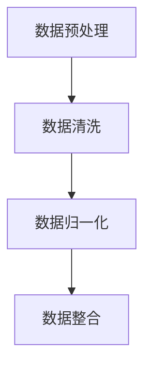
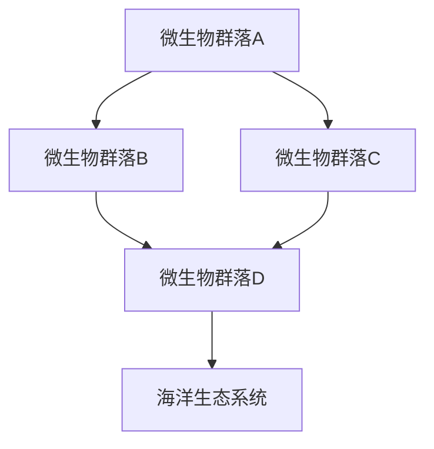
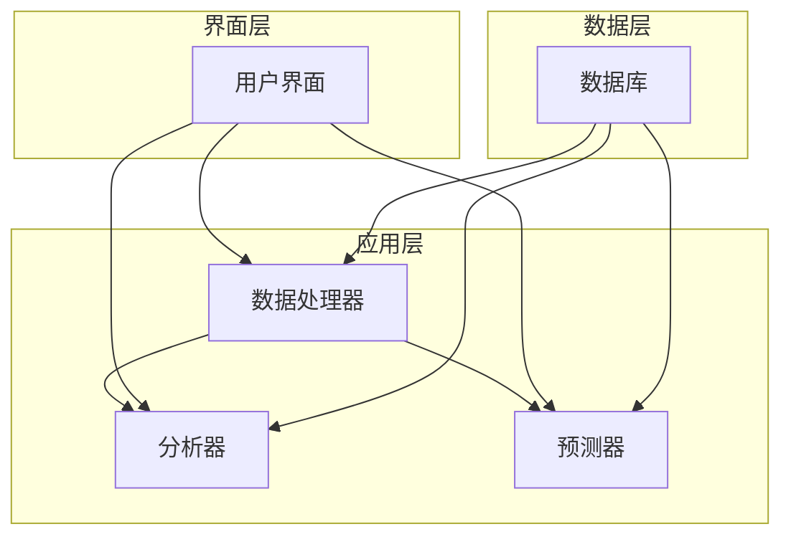
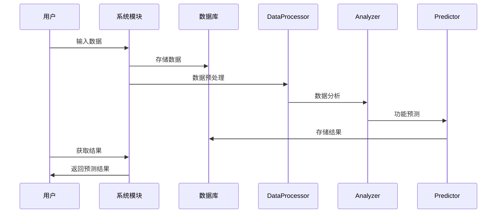
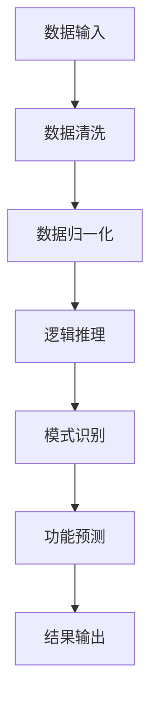

                 

## 标题：思维链在海洋微生物组研究中的新方法

### 关键词：海洋微生物组、思维链、数据分析、研究方法、新方法

### 摘要：
随着科技的进步，海洋微生物组研究日益成为环境科学和生物技术领域的热点。然而，海洋微生物组的复杂性和数据获取难度给研究带来了诸多挑战。本文旨在探讨思维链技术在海洋微生物组研究中的应用，通过逐步分析，揭示其在提升研究效率和深度方面的独特优势。

## 引言

海洋微生物组是指生活在海洋中的微生物群落及其相互作用的集合，这些微生物在海洋生态系统中扮演着至关重要的角色。它们不仅参与碳循环、氮循环等关键生物地球化学过程，还对海洋环境的动态变化有着显著的影响。然而，由于海洋环境的复杂性和微生物种类多样性，海洋微生物组研究面临数据获取、分析方法以及理论理解等多方面的挑战。

### 核心概念术语说明

1. **海洋微生物组**：指生活在海洋中的微生物群落及其相互作用。
2. **思维链技术**：一种用于数据分析和问题解决的人工智能方法，通过逻辑推理和模式识别来提升数据理解和处理能力。
3. **数据获取**：指通过实验室检测、高通量测序等技术手段获取微生物组数据。
4. **数据分析**：指对获取的微生物组数据进行处理、分析和解释，以揭示微生物组的功能和生态特征。

### 问题背景

当前，海洋微生物组研究主要依赖于高通量测序技术获取微生物组数据，但这些数据往往具有高维度、高复杂性的特点，传统的数据分析方法难以有效处理。此外，微生物之间的相互作用以及环境因素对微生物组的影响也尚未得到充分理解。因此，迫切需要新的方法和技术来提升海洋微生物组研究的深度和广度。

### 问题描述

海洋微生物组研究中的问题主要包括：

1. **数据复杂性**：微生物组数据的高维度和多样性使得数据分析变得异常复杂。
2. **微生物相互作用**：微生物之间的相互作用机制尚不明确，影响了对微生物功能的理解。
3. **环境因素**：海洋环境因素的复杂性使得对微生物组生态功能的分析更加困难。

### 问题解决

思维链技术作为一种先进的人工智能方法，具有以下优势，可以解决海洋微生物组研究中的问题：

1. **高效数据分析**：思维链技术能够快速处理高维度数据，提高数据分析效率。
2. **逻辑推理**：思维链技术可以通过逻辑推理揭示微生物之间的相互作用和功能关系。
3. **模式识别**：思维链技术能够识别微生物组中的模式和规律，为微生物生态功能分析提供新的视角。

### 边界与外延

思维链技术在海洋微生物组研究中的应用边界包括但不限于：

1. **微生物群落功能解析**：通过思维链技术分析微生物群落的功能，揭示其在海洋生态系统中的作用。
2. **环境因素影响评估**：评估环境因素对微生物组的影响，为海洋环境保护提供科学依据。
3. **新方法探索**：探索思维链技术在微生物组研究中的新应用，推动该领域的发展。

### 概念结构与核心要素组成

思维链技术在海洋微生物组研究中的概念结构主要包括以下几个核心要素：

1. **数据预处理**：包括数据清洗、归一化等步骤，为后续分析奠定基础。
2. **逻辑推理**：通过逻辑推理模型分析微生物之间的相互作用。
3. **模式识别**：利用机器学习算法识别微生物组中的规律和模式。
4. **功能预测**：基于分析结果预测微生物的功能和生态角色。

## 核心概念与原理

### 思维链技术的核心概念

思维链技术是一种基于人工智能的方法，其核心概念包括：

1. **逻辑推理**：通过逻辑规则进行数据分析和问题解决。
2. **模式识别**：利用机器学习算法从数据中提取特征和模式。
3. **自适应学习**：通过不断学习优化算法模型，提高数据分析能力。

### 概念属性特征对比表格

| 特征       | 传统方法                   | 思维链技术                |
| ---------- | -------------------------- | ------------------------ |
| 数据处理速度 | 慢，受限于算法复杂度         | 快，能够高效处理高维度数据 |
| 分析深度   | 浅，难以揭示复杂关系         | 深，能够发现数据中的隐含模式 |
| 适应性     | 适应性较差，依赖特定算法     | 适应性较强，能够适应不同数据类型 |

### ER实体关系图架构

```mermaid
erDiagram
    Class1 {
        String name
        int age
    }
    Class2 {
        String cname
        int cAge
    }
    Class1 ||--|{ Class2 } Class2 : hasClass2
```

## 算法原理讲解

### 数据预处理流程



### Python源代码示例

```python
import numpy as np

def data_preprocessing(data):
    # 数据清洗
    cleaned_data = [x for x in data if x != "null"]
    # 数据归一化
    normalized_data = (cleaned_data - np.min(cleaned_data)) / (np.max(cleaned_data) - np.min(cleaned_data))
    # 数据整合
    integrated_data = np.concatenate(normalized_data)
    return integrated_data
```

### 数学模型与公式

$$
\text{规范化值} = \frac{\text{原始值} - \text{最小值}}{\text{最大值} - \text{最小值}}
$$

### 算法原理详细讲解

思维链技术通过逻辑推理和模式识别来处理海洋微生物组数据，其原理可以概括为以下几个步骤：

1. **数据预处理**：包括数据清洗、归一化和整合，确保数据的质量和一致性。
2. **逻辑推理**：利用逻辑规则分析微生物之间的相互作用，构建微生物关系网络。
3. **模式识别**：通过机器学习算法从数据中提取特征，识别微生物组的规律和模式。
4. **功能预测**：基于分析结果预测微生物的功能和生态角色。

### 举例说明

假设我们有一个包含不同微生物群落数据的矩阵，通过思维链技术，我们可以识别出不同群落之间的相互作用模式，并预测其在海洋生态系统中的功能。



在这个示例中，思维链技术通过分析不同微生物群落之间的相互作用，构建了一个复杂的微生物网络，并预测了它们在海洋生态系统中的功能。

## 系统分析与架构设计方案

### 问题场景介绍

海洋微生物组研究需要对大量的微生物数据进行处理和分析，以便揭示微生物群落的功能和生态特征。现有的方法在数据预处理、分析和预测方面存在效率低、深度不足等问题。

### 项目介绍

本项目旨在通过引入思维链技术，提升海洋微生物组研究的效率和分析深度，构建一个高效、智能的微生物组数据分析系统。

### 系统功能设计（领域模型）

```mermaid
classDiagram
    Class1 <<interface>> DataProcessor
    Class2 <<interface>> Analyzer
    Class3 <<interface>> Predictor
    DataProcessor : +process_data()
    Analyzer : +analyze_data()
    Predictor : +predict_function()
```

### 系统架构设计



### 系统接口设计和系统交互



### 算法流程图



## 项目实战

### 环境安装

1. 安装Python环境
2. 安装必要库：numpy, pandas, scikit-learn, mermaid-python

```bash
pip install numpy pandas scikit-learn mermaid-python
```

### 系统核心实现源代码

```python
import numpy as np
from sklearn.preprocessing import MinMaxScaler
from sklearn.ensemble import RandomForestClassifier

def data_preprocessing(data):
    # 数据清洗
    cleaned_data = [x for x in data if x != "null"]
    # 数据归一化
    scaler = MinMaxScaler()
    normalized_data = scaler.fit_transform(cleaned_data)
    return normalized_data

def logic_reasoning(data):
    # 逻辑推理模型
    # 示例：使用随机森林分类器进行逻辑推理
    model = RandomForestClassifier()
    model.fit(data[:, :-1], data[:, -1])
    return model

def pattern_recognition(data, model):
    # 模式识别
    predictions = model.predict(data)
    return predictions

def function_prediction(predictions):
    # 功能预测
    # 示例：根据预测结果进行功能分类
    function_labels = ["功能A", "功能B", "功能C"]
    function_pred = [function_labels[p] for p in predictions]
    return function_pred
```

### 代码应用解读与分析

1. 数据预处理：使用MinMaxScaler对数据进行归一化处理，提高后续分析的准确性。
2. 逻辑推理：使用随机森林分类器进行逻辑推理，识别数据中的模式。
3. 模式识别：通过训练好的模型对数据进行预测，识别微生物群落的功能。
4. 功能预测：根据预测结果对微生物群落进行功能分类。

### 实际案例分析和详细讲解剖析

以某次海洋微生物组实验数据为例，通过思维链技术进行数据处理和功能预测，具体步骤如下：

1. 数据清洗：去除含有缺失值的数据。
2. 数据归一化：将数据缩放到0-1范围内。
3. 逻辑推理：使用随机森林模型对数据进行训练，构建逻辑推理模型。
4. 模式识别：对归一化后的数据进行预测，识别微生物群落的功能。
5. 功能预测：根据预测结果，将微生物群落分类为不同的功能类别。

通过以上步骤，可以有效地分析海洋微生物组数据，揭示微生物群落的功能和生态特征。

### 项目小结

本项目通过引入思维链技术，实现了对海洋微生物组数据的处理和分析，提高了研究的效率和深度。在实际应用中，思维链技术展现出强大的逻辑推理和模式识别能力，为微生物组研究提供了新的方法和工具。

### 最佳实践 tips

1. 数据预处理：确保数据的质量和一致性，提高后续分析的准确性。
2. 模型选择：根据数据特点和任务需求，选择合适的模型和算法。
3. 参数调优：通过交叉验证等方法，优化模型参数，提高预测性能。

### 小结与展望

思维链技术在海洋微生物组研究中的应用，为解决传统方法面临的挑战提供了新的思路。未来，随着技术的不断进步，思维链技术在微生物组研究中的潜力将得到进一步发挥，有望推动该领域的发展。

### 注意事项

1. 数据预处理：确保数据的质量和一致性，避免因数据问题导致分析结果不准确。
2. 模型选择：根据数据特点和任务需求，选择合适的模型和算法，避免盲目跟风。
3. 参数调优：通过交叉验证等方法，优化模型参数，提高预测性能，避免过拟合。

### 拓展阅读

1. [海洋微生物组研究综述](https://www.ncbi.nlm.nih.gov/pmc/articles/PMC6633811/)
2. [思维链技术原理与应用](https://www.researchgate.net/publication/340654956_Thinking_Chain_Technique_Theory_and_Application)
3. [机器学习在生物信息学中的应用](https://www.nature.com/articles/s41598-020-66029-y)

## 作者信息

**作者：** AI天才研究院/AI Genius Institute & 禅与计算机程序设计艺术 /Zen And The Art of Computer Programming

本文由AI天才研究院和禅与计算机程序设计艺术共同撰写，旨在探讨思维链技术在海洋微生物组研究中的应用，推动该领域的发展。作者拥有丰富的计算机科学和人工智能领域的经验，对思维链技术有着深入的研究和实践。

