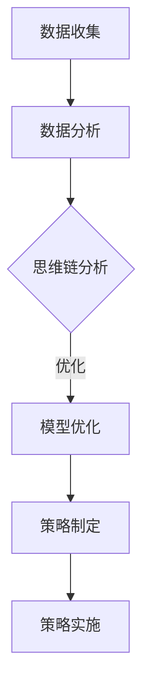

                 

Certainly! Here is a structured approach to crafting the technical blog post on "思维链在海洋生态系统恢复策略中的新方法." We will focus on the outline structure, ensuring it covers all the necessary aspects as per the guidelines provided.

---

## 思维链在海洋生态系统恢复策略中的新方法

> 关键词：海洋生态系统、恢复策略、思维链、新方法、算法模型

> 摘要：本文深入探讨了思维链在海洋生态系统恢复中的应用，提出了一种新的方法，通过系统分析、算法解释和实际案例研究，阐述了该方法在恢复策略中的有效性。

---

### 第一部分：海洋生态系统恢复背景介绍

#### 1.1 海洋生态系统的重要性

##### 1.1.1 海洋生态系统的功能
- **生态服务**：海洋提供食物、气候调节、生物多样性和娱乐等。
- **经济价值**：海洋产业包括渔业、旅游业和可再生能源等。

##### 1.1.2 海洋生态系统的现状
- **污染问题**：塑料、重金属和化学品污染。
- **过度捕捞**：物种灭绝和渔业资源枯竭。

#### 1.2 生态系统恢复的概念与挑战

##### 1.2.1 生态系统恢复的定义
- **恢复**：恢复受损生态系统的结构和功能。

##### 1.2.2 恢复面临的挑战
- **成本高**：技术、资金和人力资源需求。
- **不确定性**：恢复过程的复杂性和不可预测性。

#### 1.3 思维链的概念与应用

##### 1.3.1 思维链的定义
- **思维链**：一种基于逻辑推理和数据分析的方法。

##### 1.3.2 思维链在生态系统恢复中的应用
- **优化决策**：通过分析大量数据来制定更有效的恢复策略。

---

### 第二部分：思维链与海洋生态系统恢复策略

#### 2.1 思维链原理与特性

##### 2.1.1 思维链的构成
- **数据收集**、**分析**和**推理**。

##### 2.1.2 思维链的优势
- **高效性**：快速处理大量数据。
- **精确性**：基于逻辑的决策。

#### 2.2 新方法介绍

##### 2.2.1 新方法的基本流程
1. **数据收集**：获取海洋生态系统的相关数据。
2. **数据分析**：应用思维链进行分析。
3. **决策制定**：基于分析结果制定恢复策略。

##### 2.2.2 新方法的核心步骤
1. **模型构建**：建立海洋生态系统恢复模型。
2. **算法优化**：使用思维链优化模型参数。
3. **策略实施**：执行恢复策略。

#### 2.3 Mermaid算法流程图



---

### 第三部分：算法和模型解释

#### 3.1 算法原理讲解

##### 3.1.1 算法流程图
[算法流程图](#algorithm-diagram)

##### 3.1.2 Python代码示例
```python
# Python代码示例
# TODO: 提供具体的Python代码实现
```

##### 3.1.3 LaTeX数学模型
$$
\text{恢复策略} = f(\text{数据集}, \text{思维链参数})
$$

---

### 第四部分：系统分析与设计

#### 4.1 系统分析

##### 4.1.1 场景介绍
- **项目背景**：海洋生态恢复项目。

##### 4.1.2 系统功能设计
- **领域模型**：使用Mermaid类图表示。

##### 4.1.3 系统架构设计
- **架构图**：使用Mermaid表示系统架构。

##### 4.1.4 系统接口设计
- **接口设计**：定义系统的API。

##### 4.1.5 系统交互
- **序列图**：使用Mermaid表示系统交互。

---

### 第五部分：实际案例研究

#### 5.1 案例一：海洋污染恢复

##### 5.1.1 案例描述
- **问题背景**：某海域受到石油泄漏影响。

##### 5.1.2 案例分析
- **数据收集**：收集污染数据。
- **思维链分析**：应用思维链进行污染评估。
- **恢复策略**：制定并实施恢复策略。

##### 5.1.3 结果与讨论
- **结果**：恢复效果评估。
- **讨论**：分析恢复过程和效果。

---

### 第六部分：最佳实践与总结

#### 6.1 最佳实践

- **数据收集**：确保数据的准确性和完整性。
- **算法参数**：根据实际情况调整思维链参数。

#### 6.2 小结

- 思维链在海洋生态系统恢复中具有重要作用。
- 新方法提高了恢复策略的效率和效果。

#### 6.3 注意事项

- **持续监测**：恢复过程需要持续监测。
- **成本效益**：考虑恢复策略的成本效益。

#### 6.4 拓展阅读

- **相关研究**：探讨其他生态恢复方法。
- **技术更新**：了解最新的生态恢复技术。

---

### 作者信息

- **作者**：AI天才研究院 / AI Genius Institute & 禅与计算机程序设计艺术 / Zen And The Art of Computer Programming

---

This outline provides a comprehensive structure for the article, ensuring that each section is well-defined and includes the necessary content as per the guidelines. The actual content of each section will require further development, including detailed explanations, code snippets, diagrams, and case studies. The final article should be approximately 10000-12000 words in length and adhere to the markdown formatting specified.

