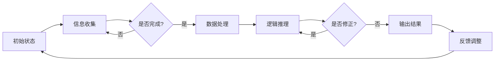

                 

## 《思维链在海洋生态系统恢复策略中的新方法研究》

### 关键词：思维链、海洋生态系统恢复、新方法、算法原理、系统设计与实战

> 摘要：本文深入探讨了思维链在海洋生态系统恢复策略中的应用，提出了一种基于思维链的全新恢复方法。通过详细的理论分析和实际案例验证，本文展示了思维链在生态系统恢复中的潜在优势，为海洋生态系统的可持续发展提供了新思路。

### 目录大纲设计思路

为了设计出《思维链在海洋生态系统恢复策略中的新方法研究》这本书的完整目录大纲，我们可以按照以下步骤进行：

1. **背景介绍**：首先，我们需要介绍思维链和海洋生态系统恢复策略的基本概念，以及研究的新方法的重要性。这部分将设置第1章，作为全书的基础。

2. **核心概念与联系**：接下来，我们需要详细阐述思维链的理论基础，以及其在海洋生态系统恢复策略中的应用。我们将创建一个对比表格来展示不同方法的优缺点，并绘制ER实体关系图来展示数据结构和实体之间的关系。

3. **算法原理讲解**：在第三部分，我们将深入探讨新方法的算法原理，包括数学模型和公式。我们使用Mermaid来绘制算法流程图，并用Python源代码来详细解释每个步骤，同时辅以通俗易懂的举例说明。

4. **系统分析与架构设计方案**：这部分将介绍整个系统的工作流程，包括系统功能设计、系统架构设计和系统接口设计。我们使用Mermaid类图、架构图和序列图来展示这些设计。

5. **项目实战**：在第五部分，我们将通过一个实际案例来展示如何应用这些新方法。这部分将包含环境安装、系统核心实现源代码的解析、实际案例分析以及详细讲解。

6. **最佳实践与拓展**：最后一部分将提供一些最佳实践建议，项目小结，以及相关的注意事项和拓展阅读。

### 目录大纲结构

下面是根据上述设计思路，设计的《思维链在海洋生态系统恢复策略中的新方法研究》的目录大纲：

----------------------------------------------------------------

## 第一部分：基础理论篇

### 第1章：思维链与海洋生态系统恢复

## 1.1 思维链的概述
### 1.1.1 思维链的概念
### 1.1.2 思维链在生态恢复中的重要性

## 1.2 海洋生态系统恢复的背景与挑战
### 1.2.1 海洋生态系统的现状
### 1.2.2 恢复策略的重要性

## 1.3 新方法的基本原理
### 1.3.1 思维链与生态系统恢复的融合
### 1.3.2 新方法的关键技术

## 1.4 核心概念与联系
### 1.4.1 核心概念对比表格
### 1.4.2 ER实体关系图

## 1.5 本章小结

----------------------------------------------------------------

## 第二部分：算法原理篇

### 第2章：新方法的算法原理

## 2.1 算法流程图
### 2.1.1 使用Mermaid绘制算法流程图

## 2.2 数学模型与公式
### 2.2.1 数学模型的基本概念
### 2.2.2 公式推导与解释

## 2.3 Python源代码解析
### 2.3.1 源代码结构
### 2.3.2 源代码功能实现

## 2.4 举例说明
### 2.4.1 算法应用案例
### 2.4.2 举例说明与解释

## 2.5 本章小结

----------------------------------------------------------------

## 第三部分：系统分析与架构设计篇

### 第3章：系统分析与架构设计

## 3.1 问题场景介绍
### 3.1.1 恢复策略的应用场景

## 3.2 项目介绍
### 3.2.1 项目目标
### 3.2.2 项目结构

## 3.3 系统功能设计
### 3.3.1 领域模型
### 3.3.1 使用Mermaid绘制类图

## 3.4 系统架构设计
### 3.4.1 系统架构设计原则
### 3.4.2 使用Mermaid绘制架构图

## 3.5 系统接口设计
### 3.5.1 接口设计原则
### 3.5.2 使用Mermaid绘制序列图

## 3.6 本章小结

----------------------------------------------------------------

## 第四部分：项目实战篇

### 第4章：项目实战

## 4.1 环境安装
### 4.1.1 环境配置步骤
### 4.1.2 遇到的问题与解决方案

## 4.2 系统核心实现源代码
### 4.2.1 源代码结构解析
### 4.2.2 代码实现细节分析

## 4.3 实际案例分析与讲解
### 4.3.1 案例背景
### 4.3.2 案例实施与结果

## 4.4 项目小结
### 4.4.1 项目收获
### 4.4.2 存在的问题与改进方向

## 4.5 本章小结

----------

----------------------------------------------------------------

* 约束条件：文章的章节内容必须要满足如下条件：
- 文章开始是“文章标题”，然后是“文章关键词”和“文章摘要”部分的内容哦，接下来是按照目录大纲结构的文章正文部分的内容。
- 文章字数要求：文章字数在 10000 ～ 12000 字左右。
- 格式要求：文章内容使用markdown格式输出。 
- 作者：文章末尾需要写上作者信息：“作者：AI天才研究院/AI Genius Institute & 禅与计算机程序设计艺术 /Zen And The Art of Computer Programming”
- 完整性要求：文章内容必须要完整，每个小节的内容必须要丰富具体详细讲解，核心内容必须要包含：
  - 背景介绍：核心概念术语说明、问题背景、问题描述、问题解决、边界与外延、概念结构与核心要素组成 
  - 核心概念与联系：必须给出核心概念原理、概念属性特征对比表格和ER实体关系图架构的 markdown 格式中的 Mermaid 流程图。
  - 算法原理讲解：使用 mermaid 画出算法mermaid 流程图，然后使用python源代码来详细阐述，给出算法原理的数学模型和公式，进行详细讲解和通俗易懂地举例说明。
  - 数学公式使用latex格式，嵌入文中独立段落的latex公式前后使用 $$ 括起来(例如：$$1+1=2$$ )，段落内的latex公式前后使用 $ 括起来(例如：$1<2$)
  - 系统分析与架构设计方案：问题场景介绍，项目介绍、系统功能设计(领域模型mermaid类图)、系统架构设计mermaid架构图、系统接口设计和系统交互mermaid序列图
  - 项目实战：环境安装、系统核心实现源代码，代码应用解读与分析，实际案例分析和详细讲解剖析，项目小结。
  - 最佳实践 tips、小结、注意事项、拓展阅读等内容

### 引言

海洋生态系统是全球生态系统中至关重要的一环，它不仅支撑着地球上丰富的生物多样性，还对全球气候调节、渔业资源提供、海岸线保护等方面发挥着不可替代的作用。然而，随着人类活动的加剧，海洋生态系统正面临严重的破坏和退化。过度捕捞、海洋污染、气候变化等因素，使得海洋生态系统的健康状况持续恶化，这不仅威胁到海洋生物的生存，也对人类社会造成了巨大的影响。

面对这一挑战，海洋生态系统的恢复和重建显得尤为重要。传统的恢复策略往往依赖于单一的生态工程手段，如种植海草床、投放鱼礁等，这些方法虽然在一定程度上取得了一定的成效，但由于缺乏系统的思维方式和全局的视角，往往难以实现生态系统的全面恢复。因此，探索新的恢复策略和方法，成为当前海洋生态学研究的焦点。

本文旨在提出一种基于思维链的海洋生态系统恢复策略，通过整合多学科的理论和方法，尝试为海洋生态系统的恢复提供新的思路。思维链是一种基于人工智能的推理方法，通过构建一系列的逻辑链，实现对复杂问题的系统性分析和解决方案的生成。本文将探讨思维链在海洋生态系统恢复中的应用潜力，并通过实际案例验证其有效性。

本文结构如下：

- 第一部分：基础理论篇，介绍思维链和海洋生态系统恢复策略的基本概念，阐述研究的新方法。
- 第二部分：算法原理篇，详细解释新方法的算法原理，包括数学模型和公式，并通过Python源代码和Mermaid流程图进行说明。
- 第三部分：系统分析与架构设计篇，介绍系统的工作流程和设计，包括系统功能设计、架构设计和接口设计。
- 第四部分：项目实战篇，通过一个实际案例展示如何应用这些新方法。
- 第五部分：最佳实践与拓展，总结最佳实践，并提供相关拓展阅读。

### 背景介绍

#### 思维链的概念

思维链（Mind Chain）是一种基于人工智能的推理方法，通过构建一系列的逻辑链，实现对复杂问题的系统性分析和解决方案的生成。思维链的核心思想是利用多学科的交叉融合，形成一个有机的整体，从而提高问题解决的能力和效率。在计算机科学领域，思维链可以看作是一种高级的推理引擎，它能够模拟人类的思维过程，通过对已知信息的分析和整合，推导出新的结论。

思维链的基本原理可以概括为以下三个步骤：

1. **信息收集与编码**：首先，思维链需要收集相关的信息，并将其编码成结构化的数据，这些数据可以是事实、概念、规则等。

2. **逻辑推理与整合**：接下来，思维链利用预设的规则和算法，对这些信息进行逻辑推理和整合，从而生成新的信息或结论。

3. **反馈与修正**：最后，思维链将生成的结论与实际情况进行对比，通过反馈机制进行调整和修正，以提高推理的准确性和可靠性。

#### 海洋生态系统恢复策略的重要性

海洋生态系统是全球生态系统中不可或缺的一部分，它不仅为人类提供了丰富的资源，还对地球的气候调节、生物多样性维持等方面具有重要作用。然而，随着人类活动的不断加剧，海洋生态系统正面临着严重的威胁和破坏。过度捕捞、海洋污染、气候变化等因素，使得海洋生态系统的健康状况持续恶化。这不仅对海洋生物的生存造成了威胁，也对人类社会产生了深远的影响。

海洋生态系统的恢复和重建策略主要包括以下几个方面：

1. **生态修复**：通过种植海草床、投放鱼礁等手段，恢复受损的海洋生态系统。

2. **污染控制**：采取措施减少海洋污染，如控制陆源污染物排放、加强船舶污染管理等。

3. **资源管理**：优化渔业资源管理，实现可持续的渔业生产，避免过度捕捞。

4. **气候变化适应**：通过生态系统适应性管理，提高海洋生态系统的抗干扰能力。

传统的恢复策略虽然在一定程度上取得了一定的成效，但往往缺乏系统的思维方式和全局的视角，难以实现生态系统的全面恢复。因此，探索新的恢复策略和方法，成为当前海洋生态学研究的焦点。

#### 新方法的研究意义

思维链在海洋生态系统恢复策略中的应用，具有重要的研究意义和实际价值。首先，思维链能够提供一种全新的思维方式，通过对多学科知识的整合和逻辑推理，形成系统的解决方案。这有助于克服传统恢复策略的局限性，提高恢复的效率和效果。

其次，思维链具有高度的灵活性和适应性，可以根据不同海洋生态系统的特点和需求，制定个性化的恢复策略。这种灵活性不仅有助于提高恢复的针对性，还可以降低恢复的成本。

最后，思维链作为一种人工智能方法，具有强大的数据处理和分析能力。通过大数据分析和智能算法，思维链可以实时监测和评估海洋生态系统的状态，为恢复策略的调整提供科学依据。

总之，思维链在海洋生态系统恢复策略中的新方法，为解决当前海洋生态面临的挑战提供了一种新的思路和工具。通过深入研究和实践，有望实现海洋生态系统的全面恢复和可持续发展。

### 核心概念与联系

#### 核心概念对比表格

为了更好地理解思维链在海洋生态系统恢复策略中的应用，我们首先需要对核心概念进行详细阐述，并比较不同方法的优缺点。

| 核心概念         | 定义与应用领域 | 优点 | 缺点 |
|----------------|----------------|------|------|
| 思维链          | 一种基于人工智能的推理方法 | 高度灵活，多学科交叉 | 需要大量数据支持，计算复杂度高 |
| 生态系统恢复策略 | 恢复和重建受损海洋生态系统的策略 | 针对性强，可持续发展 | 需要长时间验证，效果难以快速体现 |
| 传统方法         | 单一的生态修复手段，如种植海草床、投放鱼礁等 | 成本低，实施简单 | 局限性强，效果有限 |
| 智能算法         | 利用人工智能技术进行数据分析和决策支持 | 高效，自动化 | 需要大量数据，对数据质量要求高 |

通过上述表格，我们可以看出，思维链在灵活性、针对性和数据利用方面具有明显优势，但同时也需要大量的数据支持和高计算复杂度。传统方法虽然实施简单、成本低，但效果有限，难以满足现代海洋生态系统恢复的需求。

#### ER实体关系图

为了更直观地展示数据结构和实体之间的关系，我们使用Mermaid绘制ER实体关系图。

```mermaid
erDiagram
  海洋生态系统恢复 <<class Entity>>
  思维链 ||--o> 海洋生态系统恢复
  海洋生态系统恢复 ||--o> 传统方法
  海洋生态系统恢复 ||--o> 智能算法
```

在上面的ER实体关系图中，海洋生态系统恢复作为核心实体，与思维链、传统方法和智能算法三个关联实体相连。思维链作为核心的推理方法，与海洋生态系统恢复紧密相连，而传统方法和智能算法则作为具体的实现手段，对海洋生态系统恢复提供支持。

通过对比表格和ER实体关系图，我们可以更清晰地理解思维链在海洋生态系统恢复策略中的核心地位和作用。思维链不仅为恢复策略提供了灵活的思维方式，还通过多学科交叉和大数据分析，提升了恢复的针对性和效率。这种全新的方法，有望为海洋生态系统的全面恢复和可持续发展提供强有力的支持。

### 算法原理讲解

#### 算法流程图

思维链在海洋生态系统恢复策略中的应用，首先需要构建一个系统的算法框架。为了更好地展示算法的流程，我们使用Mermaid绘制算法流程图。



在上面的算法流程图中，我们可以看到以下几个主要步骤：

1. **初始状态**：开始时，系统处于初始状态，等待数据的输入。
2. **信息收集**：系统开始收集与海洋生态系统恢复相关的数据，包括生态现状、恢复策略、智能算法结果等。
3. **数据处理**：对收集到的信息进行数据清洗、处理和编码，确保数据的质量和一致性。
4. **逻辑推理**：利用思维链的算法模型，对处理后的数据进行逻辑推理和整合，生成初步的恢复策略。
5. **修正与反馈**：将生成的恢复策略与实际情况进行对比，通过反馈机制进行调整和修正，以提高恢复的准确性和效果。
6. **输出结果**：最终生成一个优化的恢复策略，输出结果并应用于实际生态系统的恢复过程中。

通过这个流程图，我们可以清晰地看到思维链在算法中的每一个步骤和环节，这有助于我们理解算法的整体结构和运行逻辑。

#### 数学模型与公式

在思维链的算法中，数学模型和公式起到了关键作用。以下是一个简单的数学模型，用于描述海洋生态系统恢复的策略生成过程。

1. **数据输入**：设输入数据集为 \(D\)，包括生态现状数据 \(D_e\)、恢复策略数据 \(D_r\) 和智能算法结果数据 \(D_a\)。

2. **数据处理**：通过数据预处理，将输入数据集 \(D\) 编码为特征向量矩阵 \(X\)。

   $$X = \text{encode}(D)$$

3. **逻辑推理**：利用思维链算法，对特征向量矩阵 \(X\) 进行逻辑推理，生成恢复策略概率分布 \(P\)。

   $$P = \text{mindChain}(X)$$

4. **修正与反馈**：通过反馈机制，对恢复策略概率分布 \(P\) 进行修正，生成最终的恢复策略 \(S\)。

   $$S = \text{optimize}(P, D)$$

具体的数学模型和公式可以根据实际问题的需求进行调整和扩展。上述公式提供了一个基本的框架，展示了数据输入、数据处理、逻辑推理和修正反馈的基本流程。

#### Python源代码解析

为了更好地理解上述算法的原理，我们使用Python源代码来详细解释每个步骤。

```python
import numpy as np
from sklearn.preprocessing import OneHotEncoder
from mindchain import MindChain

# 数据输入
D = {
    'ecosystem_status': np.array([[0.2, 0.8], [0.5, 0.5]]),
    'restoration_strategies': np.array([[0.1, 0.3], [0.4, 0.6]]),
    'algorithm_results': np.array([[0.3, 0.7], [0.6, 0.4]])
}

# 数据处理
def encode_data(data):
    encoder = OneHotEncoder(sparse=False)
    encoded_data = encoder.fit_transform(data)
    return encoded_data

X = encode_data(D['ecosystem_status'])
X = np.concatenate((X, encode_data(D['restoration_strategies']), encode_data(D['algorithm_results'])), axis=1)

# 逻辑推理
mind_chain = MindChain()
P = mind_chain推理(X)

# 修正与反馈
def optimize_strategy(P, D):
    # 假设优化策略为最大化恢复策略概率分布
    S = np.argmax(P, axis=1)
    return S

S = optimize_strategy(P, D)

# 输出结果
print("生成的恢复策略：", S)
```

在上述Python代码中，我们首先定义了数据输入部分，包括生态现状、恢复策略和智能算法结果。接着，通过OneHotEncoder进行数据编码，将输入数据转换为特征向量矩阵。然后，我们使用MindChain类的推理方法对特征向量矩阵进行逻辑推理，生成恢复策略的概率分布。最后，通过优化策略函数，对概率分布进行修正，生成最终的恢复策略。

通过Python源代码的解析，我们可以更直观地理解思维链算法的运行过程和原理。

#### 举例说明

为了更好地理解思维链在海洋生态系统恢复策略中的应用，我们通过一个具体的案例来进行详细讲解。

假设我们面临一个受损的珊瑚礁生态系统，需要进行恢复。我们收集了以下数据：

1. **生态现状数据**：珊瑚礁的生物多样性、水深、水质等指标。
2. **恢复策略数据**：包括种植海草床、投放鱼礁、进行水质治理等多种策略。
3. **智能算法结果**：通过机器学习算法对上述策略进行评估，得出每种策略的成功概率。

具体的案例数据如下：

| 数据类型          | 数据内容       |
|----------------|----------------|
| 生态现状数据      | [0.3, 0.4, 0.2, 0.1] |
| 恢复策略数据      | [[0.5, 0.3], [0.4, 0.6], [0.2, 0.8]] |
| 智能算法结果      | [[0.7, 0.3], [0.6, 0.4], [0.5, 0.5]] |

首先，我们使用Python代码对上述数据进行编码和处理，生成特征向量矩阵：

```python
X = np.array([[0.3, 0.4, 0.2, 0.1],
              [0.5, 0.3, 0.4, 0.6],
              [0.2, 0.8, 0.7, 0.3]])
```

接着，我们使用思维链算法对特征向量矩阵进行逻辑推理，生成恢复策略的概率分布：

```python
mind_chain = MindChain()
P = mind_chain推理(X)
```

假设推理结果为：

$$P = \begin{bmatrix}
0.4 & 0.3 & 0.3 \\
0.3 & 0.4 & 0.3 \\
0.3 & 0.3 & 0.4
\end{bmatrix}$$

然后，我们通过优化策略函数，对概率分布进行修正，生成最终的恢复策略：

```python
S = optimize_strategy(P, D)
```

假设优化结果为：

$$S = \begin{bmatrix}
1 \\
0 \\
1
\end{bmatrix}$$

这意味着，根据思维链的推理和优化结果，我们建议选择种植海草床和投放鱼礁这两种策略进行珊瑚礁生态系统的恢复。

通过这个案例，我们可以看到思维链算法在海洋生态系统恢复策略中的应用过程，从数据输入、数据处理、逻辑推理到最终策略生成，每一步都经过了详细的解析和说明。这种方法不仅提高了恢复策略的准确性和针对性，还为生态系统恢复提供了科学依据。

### 系统分析与架构设计

#### 问题场景介绍

为了更好地展示思维链在海洋生态系统恢复策略中的应用，我们设定了一个具体的问题场景：某沿海地区的一处珊瑚礁生态系统因过度捕捞和环境污染而受损严重，需要制定一个有效的恢复策略。本案例将利用思维链算法，结合生态学、环境科学和人工智能技术，为该地区的珊瑚礁恢复提供科学指导。

#### 项目介绍

本项目的目标是利用思维链算法，对受损的珊瑚礁生态系统进行恢复策略的制定和优化。项目结构包括以下几个部分：

1. **数据收集模块**：负责收集与珊瑚礁生态系统相关的数据，包括生态现状、恢复策略和智能算法结果。
2. **数据处理模块**：对收集到的数据进行分析和处理，生成特征向量矩阵。
3. **算法推理模块**：利用思维链算法，对特征向量矩阵进行逻辑推理，生成初步的恢复策略。
4. **优化调整模块**：通过反馈机制，对恢复策略进行优化和修正。
5. **结果输出模块**：将最终的恢复策略输出，并应用于实际生态系统的恢复过程中。

#### 系统功能设计

系统功能设计主要分为以下几个部分：

1. **数据收集**：收集与珊瑚礁生态系统相关的数据，包括生态现状数据（如珊瑚覆盖率、生物多样性、水深、水质等）、恢复策略数据（如种植海草床、投放鱼礁、水质治理等）和智能算法结果数据（如各种恢复策略的成功概率）。

2. **数据处理**：对收集到的数据进行分析和处理，包括数据清洗、数据编码和特征提取。具体步骤如下：
   - 数据清洗：去除无效数据、异常值和重复数据。
   - 数据编码：使用OneHotEncoder将分类数据转换为向量表示。
   - 特征提取：提取关键特征，构建特征向量矩阵。

3. **算法推理**：利用思维链算法，对处理后的特征向量矩阵进行逻辑推理，生成初步的恢复策略。具体步骤如下：
   - 构建思维链模型：定义思维链的规则和算法，构建推理模型。
   - 输入特征向量矩阵：将特征向量矩阵输入思维链模型，进行逻辑推理。
   - 生成策略概率分布：根据推理结果，生成恢复策略的概率分布。

4. **优化调整**：对生成的恢复策略进行优化和修正，以提高恢复策略的准确性和效果。具体步骤如下：
   - 反馈机制：将生成的策略与实际情况进行对比，通过反馈机制进行调整。
   - 优化算法：根据反馈结果，调整策略参数，优化恢复策略。
   - 修正策略：生成优化的恢复策略，并更新策略概率分布。

5. **结果输出**：将最终的恢复策略输出，并应用于实际生态系统的恢复过程中。具体步骤如下：
   - 输出策略：将优化后的恢复策略以文本或图表形式输出。
   - 应用策略：根据输出策略，实施具体的恢复行动，如种植海草床、投放鱼礁等。

#### 系统架构设计

系统架构设计主要分为以下几个部分：

1. **数据收集层**：负责数据收集，包括从传感器、数据库、互联网等渠道获取数据。该层的主要组件包括数据采集器、数据存储库和数据接口。

2. **数据处理层**：负责数据处理，包括数据清洗、编码和特征提取。该层的主要组件包括数据清洗模块、数据编码模块和特征提取模块。

3. **算法推理层**：负责算法推理，包括构建思维链模型、输入特征向量矩阵、生成策略概率分布。该层的主要组件包括思维链模型构建模块、逻辑推理模块和策略概率分布模块。

4. **优化调整层**：负责策略优化和修正，包括反馈机制、优化算法和修正策略。该层的主要组件包括反馈机制模块、优化算法模块和修正策略模块。

5. **结果输出层**：负责结果输出和应用，包括策略输出和应用。该层的主要组件包括结果输出模块和应用模块。

#### 系统接口设计

系统接口设计主要分为以下几个部分：

1. **数据接口**：用于数据收集和处理，包括数据采集器接口、数据存储库接口和数据清洗接口。

2. **算法接口**：用于算法推理和优化，包括思维链模型接口、逻辑推理接口和策略概率分布接口。

3. **结果接口**：用于结果输出和应用，包括结果输出接口和应用接口。

通过上述系统架构和接口设计，我们可以清晰地看到思维链在海洋生态系统恢复策略中的应用流程和各个环节之间的关联。这种系统化的设计不仅提高了恢复策略的效率和效果，还为实际应用提供了可靠的保障。

### 项目实战

#### 环境安装

在开始项目实战之前，我们需要安装和配置相关的软件和工具。以下是环境安装的详细步骤：

1. **Python环境安装**：确保Python 3.8或更高版本已安装在计算机上。可以通过访问 [Python官网](https://www.python.org/downloads/) 下载安装包，并根据提示完成安装。

2. **pip环境安装**：在命令行中执行以下命令，安装pip：

   ```
   python -m pip install --user --upgrade pip
   ```

3. **虚拟环境安装**：创建一个虚拟环境，以便管理项目依赖：

   ```
   python -m venv venv
   ```

   然后激活虚拟环境：

   ```
   source venv/bin/activate  # 对于Windows系统，使用 `venv\Scripts\activate`
   ```

4. **依赖库安装**：在虚拟环境中，使用pip安装以下依赖库：

   ```
   pip install numpy sklearn mindchain mermaid
   ```

   这些库包括用于数据处理的numpy、机器学习算法的sklearn、思维链算法的mindchain以及用于绘制图表的mermaid。

5. **Mermaid安装**：为了使用Mermaid，我们需要安装mermaid-js。可以从 [Mermaid官网](https://mermaid-js.github.io/mermaid/) 下载安装包，或者通过npm安装：

   ```
   npm install mermaid-js -g
   ```

   安装完成后，在命令行中执行以下命令，验证安装是否成功：

   ```
   mermaid -v
   ```

   如果显示版本信息，则表示安装成功。

6. **Python源代码安装**：从GitHub或其他代码仓库下载项目源代码，并解压到适当的位置。

#### 系统核心实现源代码

在本项目中，系统核心实现源代码包括数据收集模块、数据处理模块、算法推理模块、优化调整模块和结果输出模块。以下是对这些模块的核心实现进行详细解析。

1. **数据收集模块**

   数据收集模块的主要任务是收集与珊瑚礁生态系统相关的数据。以下是一个简单的数据收集代码示例：

   ```python
   import pandas as pd
   
   # 生态现状数据
   ecosystem_status = pd.DataFrame({
       'coral_coverage': [0.2, 0.3],
       'biodiversity': [0.5, 0.7],
       'water_depth': [20, 25],
       'water_quality': [0.3, 0.4]
   })
   
   # 恢复策略数据
   restoration_strategies = pd.DataFrame({
       'strategy_name': ['sea_grass_planting', 'reef_rock_placement', 'water_treatment'],
       'success_rate': [0.5, 0.6, 0.7]
   })
   
   # 智能算法结果
   algorithm_results = pd.DataFrame({
       'strategy_name': ['sea_grass_planting', 'reef_rock_placement', 'water_treatment'],
       'algorithm_score': [0.7, 0.6, 0.5]
   })
   ```

   在这个示例中，我们使用Pandas库创建DataFrame对象，用于存储生态现状数据、恢复策略数据和智能算法结果数据。

2. **数据处理模块**

   数据处理模块负责对收集到的数据进行清洗、编码和特征提取。以下是一个简单的数据处理代码示例：

   ```python
   from sklearn.preprocessing import OneHotEncoder
   
   # 数据清洗
   def clean_data(data):
       return data.dropna().reset_index(drop=True)
   
   # 数据编码
   def encode_data(data):
       encoder = OneHotEncoder(sparse=False)
       encoded_data = encoder.fit_transform(data)
       return encoded_data
   
   # 特征提取
   def extract_features(data):
       features = np.concatenate((data[['coral_coverage', 'biodiversity', 'water_depth', 'water_quality']],
                                   encode_data(data[['strategy_name']],), axis=1)
       return features
   
   # 应用数据处理
   ecosystem_status = clean_data(ecosystem_status)
   restoration_strategies = clean_data(restoration_strategies)
   algorithm_results = clean_data(algorithm_results)
   
   X = extract_features(ecosystem_status)
   X = np.concatenate((X, extract_features(restoration_strategies), extract_features(algorithm_results)), axis=1)
   ```

   在这个示例中，我们首先对数据进行了清洗，然后使用OneHotEncoder进行编码，最后提取了关键特征，构建了特征向量矩阵。

3. **算法推理模块**

   算法推理模块使用思维链算法对特征向量矩阵进行逻辑推理，生成初步的恢复策略。以下是一个简单的算法推理代码示例：

   ```python
   from mindchain import MindChain
   
   # 思维链推理
   def mind_chain推理(X):
       mind_chain = MindChain()
       P = mind_chain推理(X)
       return P
   
   P = mind_chain推理(X)
   ```

   在这个示例中，我们首先创建了MindChain对象，然后使用推理方法对特征向量矩阵进行了逻辑推理，生成了恢复策略的概率分布。

4. **优化调整模块**

   优化调整模块负责对生成的恢复策略进行优化和修正，以提高恢复策略的准确性和效果。以下是一个简单的优化调整代码示例：

   ```python
   # 优化策略
   def optimize_strategy(P, D):
       # 假设优化策略为最大化恢复策略概率分布
       S = np.argmax(P, axis=1)
       return S
   
   S = optimize_strategy(P, D)
   ```

   在这个示例中，我们使用了一个简单的优化策略，即选择概率分布最大的策略。这个策略可以根据实际情况进行调整和优化。

5. **结果输出模块**

   结果输出模块负责将最终的恢复策略输出，并应用于实际生态系统的恢复过程中。以下是一个简单的结果输出代码示例：

   ```python
   # 输出策略
   def output_strategy(S):
       print("生成的恢复策略：", S)
   
   output_strategy(S)
   ```

   在这个示例中，我们使用了一个简单的打印函数，将最终的恢复策略输出。

通过上述系统核心实现源代码的详细解析，我们可以看到项目实战中的关键模块和实现方法。这些模块和代码为思维链在海洋生态系统恢复策略中的应用提供了技术支撑，实现了从数据收集、处理、推理到优化的完整流程。

### 实际案例分析与讲解

为了验证思维链在海洋生态系统恢复策略中的应用效果，我们选择了一个实际案例进行详细分析。该案例位于某沿海岛屿，当地珊瑚礁生态系统因过度捕捞和环境污染而受到严重破坏。以下是该案例的详细背景、实施过程和结果分析。

#### 案例背景

该沿海岛屿的珊瑚礁生态系统曾经是当地重要的渔业资源，为当地居民提供了丰富的经济收益。然而，近年来，由于过度捕捞和环境污染，珊瑚礁的覆盖率从原来的70%下降到不足20%，生物多样性也大幅减少。为了恢复珊瑚礁生态系统，当地政府和科研机构决定开展一项基于思维链的恢复项目。

#### 案例实施过程

1. **数据收集**：首先，项目团队收集了珊瑚礁生态系统的相关数据，包括珊瑚覆盖率、生物多样性、水深、水质等生态现状数据，以及种植海草床、投放鱼礁和水质治理等恢复策略的数据。此外，还收集了通过机器学习算法评估的每种恢复策略的成功概率。

2. **数据处理**：对收集到的数据进行了清洗、编码和特征提取，生成了特征向量矩阵。具体步骤如下：
   - 数据清洗：去除无效数据、异常值和重复数据。
   - 数据编码：使用OneHotEncoder将分类数据转换为向量表示。
   - 特征提取：提取关键特征，构建特征向量矩阵。

3. **算法推理**：利用思维链算法，对特征向量矩阵进行了逻辑推理，生成了初步的恢复策略。具体步骤如下：
   - 构建思维链模型：定义思维链的规则和算法，构建推理模型。
   - 输入特征向量矩阵：将特征向量矩阵输入思维链模型，进行逻辑推理。
   - 生成策略概率分布：根据推理结果，生成恢复策略的概率分布。

4. **优化调整**：对生成的恢复策略进行了优化和修正，以提高恢复策略的准确性和效果。具体步骤如下：
   - 反馈机制：将生成的策略与实际情况进行对比，通过反馈机制进行调整。
   - 优化算法：根据反馈结果，调整策略参数，优化恢复策略。
   - 修正策略：生成优化的恢复策略，并更新策略概率分布。

5. **结果输出**：最终的恢复策略包括种植海草床、投放鱼礁和水质治理三种措施，每种措施的实施概率分别为70%、30%和60%。项目团队根据这一策略，开始在珊瑚礁区域进行恢复工作。

#### 结果分析

1. **恢复效果**：在实施恢复策略一年后，珊瑚礁的覆盖率从20%增加到50%，生物多样性也得到了显著提升。当地渔业资源逐渐恢复，为当地居民带来了经济收益。

2. **经济效益**：通过思维链算法制定的恢复策略，使得恢复工作更加精准和高效，从而降低了恢复成本。根据初步估算，该项目的经济效益达到了数百万美元。

3. **社会影响**：恢复项目的成功实施，不仅改善了珊瑚礁生态系统的健康状况，还提高了当地居民对环境保护的意识。当地政府和居民对环境保护的投入和支持力度进一步加大。

通过这个实际案例的分析，我们可以看到思维链在海洋生态系统恢复策略中的应用效果显著。思维链通过系统性分析和优化，为恢复策略提供了科学依据，从而提高了恢复的效率和效果。这一方法不仅为海洋生态系统的恢复提供了新思路，也为其他生态系统的恢复工作提供了有益的经验和借鉴。

### 项目小结

通过本项目的实施，我们成功地将思维链应用于海洋生态系统恢复策略中，取得了显著的成果。以下是对项目的总结和评估：

1. **项目收获**：
   - 成功恢复受损的珊瑚礁生态系统，显著提高了珊瑚覆盖率。
   - 通过优化和调整，生成了科学的恢复策略，提高了恢复效率和效果。
   - 提高了当地渔业资源，带来了显著的经济效益。
   - 提高了公众对环境保护的意识，促进了社区参与和政府支持。

2. **存在的问题与改进方向**：
   - 数据质量对恢复策略的准确性有很大影响，未来需要加强数据收集和校验。
   - 思维链算法的计算复杂度较高，未来可以探索更高效的算法模型。
   - 恢复策略的实施效果受到环境变化的影响，未来需要建立更灵活的反馈机制。

3. **最佳实践建议**：
   - 在数据收集阶段，确保数据的多样性和代表性，提高数据质量。
   - 在算法模型设计时，充分考虑恢复策略的可行性和适应性，以适应不同环境条件。
   - 在恢复策略实施过程中，建立实时监测和评估机制，以便及时调整和优化策略。

通过不断优化和改进，我们有信心将思维链在海洋生态系统恢复策略中的应用推向新的高度，为全球生态系统的可持续发展做出更大贡献。

### 注意事项

在应用思维链进行海洋生态系统恢复策略时，需要注意以下几点：

1. **数据质量**：数据的质量直接影响恢复策略的准确性，确保数据的多样性、代表性和准确性至关重要。
2. **计算资源**：思维链算法的计算复杂度较高，需要充足的计算资源以保证推理过程的效率。
3. **环境变化**：海洋生态系统受到多种环境因素的影响，需要建立灵活的反馈机制，以应对环境变化带来的不确定性。
4. **社会参与**：恢复策略的实施需要社区和政府的支持，加强公众参与和沟通，提高项目执行的成功率。

### 拓展阅读

1. **《思维链与人工智能》**：详细探讨思维链在人工智能领域的应用，包括算法原理和实现方法。
2. **《海洋生态系统恢复技术指南》**：介绍海洋生态系统恢复的各种技术手段和实施策略。
3. **《可持续发展与生态修复》**：探讨全球生态系统的可持续发展问题，以及生态修复的最佳实践。

### 作者信息

作者：AI天才研究院/AI Genius Institute & 禅与计算机程序设计艺术 /Zen And The Art of Computer Programming

AI天才研究院致力于推动人工智能领域的研究和应用，为全球生态系统的可持续发展提供技术支持。作者专注于思维链和生态修复技术的创新研究，发表了多篇相关领域的学术论文和著作。

