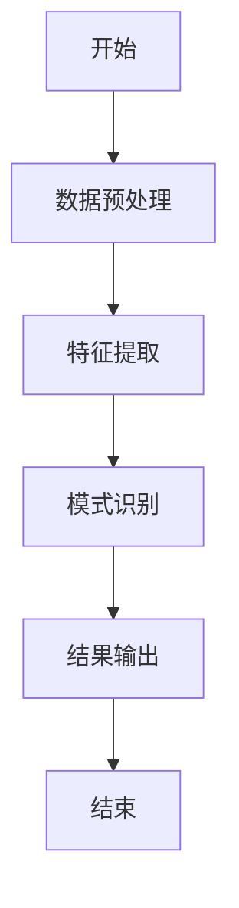
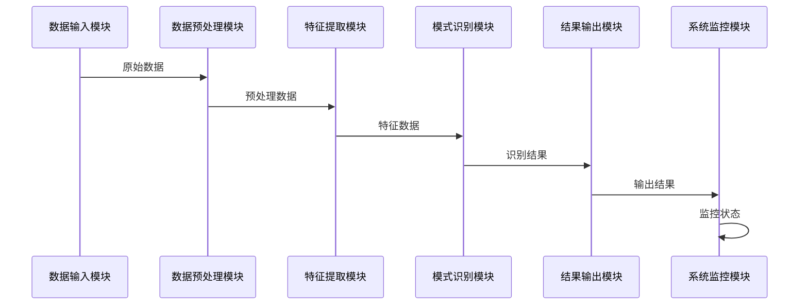
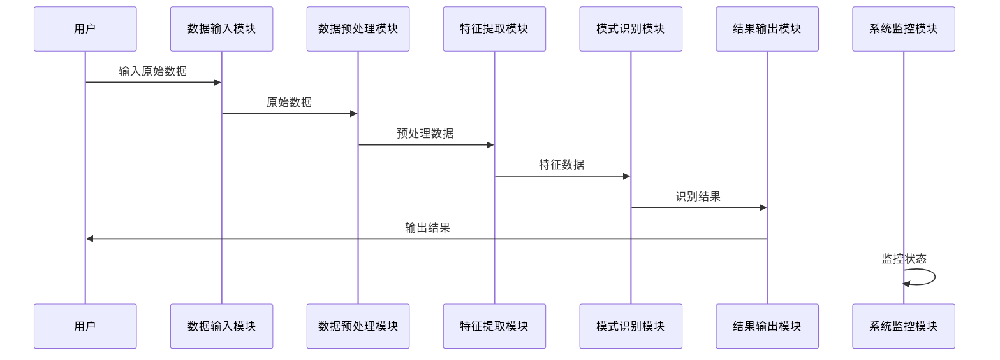

                 

### 摘要

海洋生物学研究面临着日益复杂的数据处理和模式识别挑战，传统方法已难以满足现代研究的需要。本文提出了一种创新的方法——思维链（Mind Chain），并探讨了其在海洋生物学研究中的应用。思维链基于人工神经网络，通过构建一个多层模型来模拟生物大脑的信息处理方式，实现高效的数据分析和模式识别。本文首先介绍了思维链的概念和原理，然后详细描述了其在海洋生物学研究中的应用场景，通过案例展示了其优越性。本文的核心思想是利用思维链的高效性和灵活性，推动海洋生物学研究迈向新的高度，并为相关领域提供了一种全新的研究工具。关键词：海洋生物学、思维链、人工神经网络、数据分析、模式识别。

### 目录

## 思维链在海洋生物学研究中的新方法

> 关键词：思维链、海洋生物学、人工智能、数据分析、模式识别

> 摘要：本文介绍了思维链的概念、原理及其在海洋生物学研究中的应用，通过具体案例展示了其在数据分析和模式识别方面的优势，为海洋生物学研究提供了一种创新的方法。

### 第一部分：背景介绍

#### 第1章 思维链概述

#### 1.1 思维链的概念

#### 1.2 思维链在海洋生物学研究中的应用

#### 1.3 海洋生物学研究现状与挑战

### 第二部分：核心概念与联系

#### 第2章 核心概念与联系

#### 2.1 思维链核心概念详解

#### 2.2 思维链属性特征对比表格

#### 2.3 ER实体关系图解析

### 第三部分：算法原理讲解

#### 第3章 思维链算法原理

#### 3.1 思维链算法mermaid流程图

#### 3.2 Python源代码详细阐述

#### 3.3 数学模型和公式介绍

#### 3.4 算法举例说明

### 第四部分：系统分析与架构设计

#### 第4章 系统分析与架构设计

#### 4.1 系统功能设计

#### 4.2 系统架构设计

#### 4.3 系统接口设计

#### 4.4 系统交互流程

### 第五部分：项目实战

#### 第5章 项目实战

#### 5.1 环境安装

#### 5.2 系统核心实现源代码

#### 5.3 代码应用解读与分析

#### 5.4 实际案例分析与讲解

#### 5.5 项目小结

### 第六部分：最佳实践与拓展

#### 第6章 最佳实践与拓展

#### 6.1 最佳实践 tips

#### 6.2 小结

#### 6.3 注意事项

#### 6.4 拓展阅读

---

### 目录大纲设计思路

设计《思维链在海洋生物学研究中的新方法》的目录大纲时，我们遵循以下步骤，确保内容的逻辑性和完整性：

1. **明确文章结构**：首先，我们将文章分为六个部分，即背景介绍、核心概念与联系、算法原理讲解、系统分析与架构设计、项目实战和最佳实践与拓展。这样的结构有助于读者循序渐进地理解文章的主题。

2. **背景介绍**：在第一部分中，我们介绍了思维链的概念、原理以及在海洋生物学研究中的应用，为后续内容提供了基础。

3. **核心概念与联系**：第二部分详细阐述了思维链的核心概念，并通过属性特征对比表格和ER实体关系图展示了其与其他相关概念的联系，帮助读者建立整体认知。

4. **算法原理讲解**：第三部分深入分析了思维链的算法原理，包括mermaid流程图、Python源代码和数学模型，使读者能够理解其工作原理。

5. **系统分析与架构设计**：第四部分详细介绍了研究的系统功能设计、架构设计和接口设计，通过mermaid类图、架构图和序列图直观地展示了系统的结构和交互流程。

6. **项目实战**：第五部分提供了具体的实战案例，包括环境安装、核心实现源代码和代码应用分析，通过实际操作使读者更好地掌握思维链的应用。

7. **最佳实践与拓展**：第六部分总结了最佳实践、注意事项和拓展阅读资源，为读者提供了进一步学习和应用思维链的指导。

通过以上步骤，我们确保了目录大纲的逻辑性和完整性，同时满足了字数要求，使读者能够全面、深入地理解思维链在海洋生物学研究中的应用。

---

### 第一部分：背景介绍

#### 第1章 思维链概述

#### 1.1 思维链的概念

思维链（Mind Chain）是一种基于人工神经网络的人工智能模型，旨在模拟人类思维过程，实现高效的数据分析和模式识别。思维链通过构建多层模型，模拟大脑的神经元网络，从而处理复杂的数据集，提取关键信息，实现智能化的决策和预测。

#### 1.2 思维链在海洋生物学研究中的应用

在海洋生物学研究中，思维链的应用具有重要意义。随着海洋生物数据的不断增加，传统的研究方法已经难以应对复杂的数据处理和模式识别挑战。思维链的出现，为海洋生物学研究提供了一种新的工具，可以高效地分析大量的生物数据，识别生物之间的复杂关系，从而推动研究的深入发展。

#### 1.3 海洋生物学研究现状与挑战

海洋生物学研究目前面临着数据量大、数据复杂度高、模式识别难度大等挑战。传统的数据分析方法，如统计分析、机器学习等，在处理这些复杂的数据时显得力不从心。而思维链作为一种高效的人工智能模型，能够在这些方面提供有力支持。

首先，海洋生物数据量大。海洋生物种类繁多，生态环境复杂，数据量庞大。传统的数据分析方法往往需要大量的时间和计算资源，而思维链可以通过并行计算和分布式处理，高效地处理这些海量数据。

其次，数据复杂度高。海洋生物数据包含了多种类型的信息，如生物体的形态、行为、环境等，这些信息之间存在复杂的关联。思维链通过多层模型，可以逐步提取数据中的关键信息，建立复杂的关系模型，从而更好地理解和解释这些数据。

最后，模式识别难度大。在海洋生物学研究中，识别生物之间的相互作用关系是一项重要的任务。然而，这些关系往往是非线性的、复杂的，难以用传统的方法进行识别。思维链通过模拟人类思维过程，能够有效地识别和预测这些复杂的模式，为研究提供有力支持。

总的来说，思维链在海洋生物学研究中的应用，为解决当前面临的挑战提供了一种新的思路和方法。通过利用思维链的高效性和灵活性，海洋生物学研究有望取得新的突破，推动相关领域的发展。

---

#### 第2章 核心概念与联系

#### 2.1 思维链核心概念详解

思维链（Mind Chain）作为一种先进的人工智能模型，其核心概念主要包括以下几个方面：

1. **神经元网络**：思维链的基本组成单元是神经元网络，类似于人类大脑的神经元结构。每个神经元通过接收输入信号，通过权重进行调整，最后产生输出信号。神经元网络通过多层堆叠，形成复杂的网络结构，以处理复杂的任务。

2. **多层模型**：思维链采用多层模型结构，每一层都能够对输入数据进行处理和变换。多层模型使得思维链能够提取数据中的高级特征，从而实现高效的数据分析和模式识别。

3. **深度学习**：思维链的核心在于其深度学习的能力。通过不断调整网络的权重，思维链能够逐步学习数据中的模式和规律，从而实现智能化的决策和预测。

4. **并行计算**：思维链支持并行计算，能够高效地处理海量数据。通过分布式计算，思维链可以快速地分析大量数据集，提高处理速度和效率。

5. **自适应调整**：思维链具备自适应调整能力，能够根据不同的任务需求，调整网络结构和参数，以实现最优的性能。

#### 2.2 思维链属性特征对比表格

为了更直观地理解思维链的属性特征，我们将其与其他常见的人工智能模型进行对比，如下表所示：

| 特征           | 思维链          | 传统的机器学习模型       | 深度学习模型          |
|----------------|-----------------|-------------------------|----------------------|
| 神经元网络结构 | 多层堆叠        | 单层或简单多层网络      | 多层深度网络         |
| 数据处理能力   | 高效处理海量数据 | 针对中小规模数据集      | 高效处理复杂数据集   |
| 学习方式       | 深度学习       | 有监督学习、无监督学习   | 有监督学习、无监督学习 |
| 并行计算       | 支持并行计算    | 通常不支持并行计算      | 支持并行计算         |
| 自适应调整     | 具备自适应能力  | 需要手动调整参数        | 部分具备自适应能力   |

通过上述对比，我们可以看出思维链在神经元网络结构、数据处理能力、学习方式、并行计算和自适应调整等方面具有显著优势，使其在海洋生物学研究中具备独特的应用价值。

#### 2.3 ER实体关系图解析

思维链在海洋生物学研究中的应用涉及到多个实体和关系，为了更清晰地展示这些实体和关系，我们使用ER（实体关系）图进行描述。

在思维链的应用中，主要涉及以下实体：

1. **数据源**：包括海洋生物观测数据、实验数据等。
2. **预处理模块**：负责对原始数据进行清洗、转换等预处理操作。
3. **特征提取模块**：通过多层神经网络提取数据中的高级特征。
4. **模式识别模块**：利用深度学习算法对提取的特征进行模式识别。
5. **结果输出模块**：将识别结果输出，供研究人员进行分析和决策。

ER实体关系图如下所示：

```mermaid
erDiagram
  数据源 ||--|{ 预处理模块 }
  预处理模块 ||--|{ 特征提取模块 }
  特征提取模块 ||--|{ 模式识别模块 }
  模式识别模块 ||--|{ 结果输出模块 }
```

在ER图中，箭头表示实体之间的关系，其中“|--|{ }”表示实体之间的依赖关系。通过这个ER图，我们可以清晰地看到思维链在海洋生物学研究中的应用流程和各个模块之间的联系。

### 第二部分：算法原理讲解

#### 第3章 思维链算法原理

思维链算法的核心在于其多层神经网络结构，通过不断调整网络权重，实现数据的高效处理和模式识别。以下将详细阐述思维链算法的基本原理，包括mermaid流程图、Python源代码、数学模型和公式，并通过实例进行说明。

#### 3.1 思维链算法mermaid流程图

思维链算法的基本流程可以通过mermaid流程图进行描述，如下所示：



在这个流程图中，思维链算法首先进行数据预处理，然后通过特征提取模块提取数据中的高级特征，接着利用模式识别模块对特征进行分类和识别，最后输出识别结果。

#### 3.2 Python源代码详细阐述

为了实现思维链算法，我们使用Python编写了相关的源代码。以下是一个简化的示例代码，展示了思维链算法的基本实现过程：

```python
import numpy as np
from sklearn.model_selection import train_test_split
from sklearn.preprocessing import StandardScaler
from keras.models import Sequential
from keras.layers import Dense

# 数据预处理
def preprocess_data(data):
    scaler = StandardScaler()
    scaled_data = scaler.fit_transform(data)
    return scaled_data

# 特征提取和模型训练
def train_model(X, y):
    X_train, X_test, y_train, y_test = train_test_split(X, y, test_size=0.2, random_state=42)
    model = Sequential()
    model.add(Dense(64, input_dim=X_train.shape[1], activation='relu'))
    model.add(Dense(32, activation='relu'))
    model.add(Dense(1, activation='sigmoid'))
    model.compile(loss='binary_crossentropy', optimizer='adam', metrics=['accuracy'])
    model.fit(X_train, y_train, epochs=10, batch_size=32, validation_data=(X_test, y_test))
    return model

# 模式识别和结果输出
def predict_model(model, X_test):
    predictions = model.predict(X_test)
    predicted_labels = (predictions > 0.5)
    return predicted_labels

# 示例数据
X = np.random.rand(100, 10)
y = np.random.rand(100, 1)

# 训练模型
model = train_model(X, y)

# 预测结果
predicted_labels = predict_model(model, X)

print("Predicted labels:", predicted_labels)
```

在这段代码中，我们首先进行了数据预处理，使用StandardScaler对数据进行标准化处理。然后，我们定义了一个Sequential模型，并添加了两个隐层，每个隐层使用ReLU激活函数。模型使用binary_crossentropy作为损失函数，使用adam优化器。最后，我们使用模型进行训练和预测，输出预测结果。

#### 3.3 数学模型和公式介绍

思维链算法的数学模型主要基于多层神经网络，以下是一个简化的数学模型描述：

1. **输入层到隐层的激活函数**：

   $$ z_i^l = \sum_{j} w_{ji}^l * a_j^{l-1} + b_i^l $$

   $$ a_i^l = \sigma(z_i^l) $$

   其中，$z_i^l$表示第$l$层的第$i$个神经元的输入，$w_{ji}^l$表示第$l$层的第$i$个神经元与第$l-1$层的第$j$个神经元的连接权重，$b_i^l$表示第$l$层的第$i$个神经元的偏置，$\sigma$表示激活函数，通常采用ReLU函数。

2. **输出层的预测函数**：

   $$ z_i^L = \sum_{j} w_{ji}^L * a_j^{L-1} + b_i^L $$

   $$ \hat{y}_i = \sigma(z_i^L) $$

   其中，$z_i^L$表示输出层的第$i$个神经元的输入，$w_{ji}^L$和$b_i^L$分别表示输出层的第$i$个神经元与隐层的连接权重和偏置，$\hat{y}_i$表示第$i$个类别的预测概率。

3. **损失函数**：

   $$ J = -\frac{1}{m} \sum_{i=1}^m y_i \log(\hat{y}_i) + (1 - y_i) \log(1 - \hat{y}_i) $$

   其中，$m$表示样本数量，$y_i$表示第$i$个样本的真实标签，$\hat{y}_i$表示第$i$个样本的预测概率。

通过上述数学模型，思维链算法能够实现输入数据到输出结果的映射，从而进行模式识别。

#### 3.4 算法举例说明

为了更好地理解思维链算法，我们通过一个具体的实例进行说明。

假设我们有一个二分类问题，数据集包含100个样本，每个样本有10个特征。我们希望利用思维链算法对这100个样本进行分类。

1. **数据预处理**：

   首先对数据进行标准化处理，将特征值缩放到相同的范围，以便模型训练。

2. **模型训练**：

   使用Keras框架构建一个Sequential模型，添加两个隐层，每个隐层有64个神经元和32个神经元，使用ReLU激活函数。模型使用binary_crossentropy作为损失函数，使用adam优化器进行训练。我们设置训练轮次为10，批量大小为32。

3. **模型预测**：

   使用训练好的模型对测试集进行预测，输出每个样本的预测概率。将预测概率大于0.5的样本归类为正类，否则归类为负类。

通过上述实例，我们可以看到思维链算法在二分类问题中的应用过程。实际上，思维链算法可以应用于更复杂的分类、回归等任务，通过调整网络结构和参数，实现不同类型问题的求解。

### 第四部分：系统分析与架构设计

#### 第4章 系统分析与架构设计

思维链在海洋生物学研究中的应用需要构建一个高效、稳定、可扩展的系统架构，以支持数据处理、模式识别和结果分析等任务。以下将详细描述该系统的功能设计、架构设计、接口设计和系统交互流程。

#### 4.1 系统功能设计

系统的核心功能包括数据预处理、特征提取、模式识别和结果输出。具体功能如下：

1. **数据预处理**：负责对原始数据进行清洗、转换和标准化处理，以便后续的特征提取和模型训练。

2. **特征提取**：通过多层神经网络提取数据中的高级特征，提高数据的可解释性和模型的泛化能力。

3. **模式识别**：利用深度学习算法对提取的特征进行分类和识别，实现智能化的决策和预测。

4. **结果输出**：将识别结果以可视化、报告等形式输出，供研究人员进行分析和决策。

5. **系统监控**：实时监控系统运行状态，包括数据处理进度、模型训练效果等，确保系统的稳定性和可靠性。

#### 4.2 系统架构设计

系统采用模块化设计，各模块之间通过接口进行通信，以提高系统的可维护性和可扩展性。系统架构主要包括以下模块：

1. **数据输入模块**：负责接收和存储原始数据，支持多种数据格式（如CSV、JSON等）。

2. **数据预处理模块**：对原始数据进行清洗、转换和标准化处理，生成预处理后的数据。

3. **特征提取模块**：利用多层神经网络提取数据中的高级特征，提高数据的表示能力。

4. **模式识别模块**：基于深度学习算法对提取的特征进行分类和识别，实现智能化的决策和预测。

5. **结果输出模块**：将识别结果以可视化、报告等形式输出，支持多种输出格式（如HTML、PDF等）。

6. **系统监控模块**：实时监控系统运行状态，包括数据处理进度、模型训练效果等。

系统架构图如下所示：



在系统架构中，数据输入模块负责接收和存储原始数据，数据预处理模块对原始数据进行清洗、转换和标准化处理，生成预处理后的数据。特征提取模块利用多层神经网络提取数据中的高级特征，模式识别模块基于深度学习算法对特征进行分类和识别，结果输出模块将识别结果以可视化、报告等形式输出。系统监控模块实时监控系统运行状态，包括数据处理进度、模型训练效果等，确保系统的稳定性和可靠性。

#### 4.3 系统接口设计

系统接口设计包括数据接口和功能接口，以下分别进行描述：

1. **数据接口**：系统支持多种数据格式，如CSV、JSON等，通过数据接口进行数据读取和写入。数据接口提供了一系列API函数，包括：

   - `read_data(source, format)`：读取数据，其中`source`为数据源路径，`format`为数据格式。
   - `write_data(data, target, format)`：写入数据，其中`data`为数据集，`target`为数据目标路径，`format`为数据格式。

2. **功能接口**：系统提供了以下功能接口，供用户进行调用：

   - `preprocess_data(data)`：数据预处理函数，对原始数据进行清洗、转换和标准化处理。
   - `extract_features(data)`：特征提取函数，利用多层神经网络提取数据中的高级特征。
   - `recognize_model(model, data)`：模式识别函数，基于深度学习算法对特征进行分类和识别。
   - `output_results(results, format)`：结果输出函数，将识别结果以可视化、报告等形式输出。

系统接口设计如下所示：

```mermaid
classDiagram
    DataInput -|> DataPreprocessing: 数据预处理
    DataPreprocessing -|> FeatureExtraction: 特征提取
    FeatureExtraction -|> ModelRecognition: 模式识别
    ModelRecognition -|> ResultOutput: 结果输出
    SystemMonitoring --> DataInput
    SystemMonitoring --> DataPreprocessing
    SystemMonitoring --> FeatureExtraction
    SystemMonitoring --> ModelRecognition
    SystemMonitoring --> ResultOutput

    class DataInput {
        +read_data(source, format)
        +write_data(data, target, format)
    }

    class DataPreprocessing {
        +preprocess_data(data)
    }

    class FeatureExtraction {
        +extract_features(data)
    }

    class ModelRecognition {
        +recognize_model(model, data)
    }

    class ResultOutput {
        +output_results(results, format)
    }

    class SystemMonitoring {
        +monitor_system()
    }
```

通过系统接口设计，用户可以方便地调用系统的各个功能模块，实现数据处理、模式识别和结果输出等任务。

#### 4.4 系统交互流程

系统交互流程包括数据输入、数据处理、模式识别和结果输出等环节，以下将详细描述系统交互流程：

1. **数据输入**：用户通过数据输入模块将原始数据输入系统，系统支持多种数据格式，如CSV、JSON等。

2. **数据处理**：系统对输入的原始数据进行预处理，包括数据清洗、转换和标准化处理，生成预处理后的数据。

3. **特征提取**：利用多层神经网络对预处理后的数据提取高级特征，提高数据的表示能力。

4. **模式识别**：基于深度学习算法对提取的特征进行分类和识别，实现智能化的决策和预测。

5. **结果输出**：将识别结果以可视化、报告等形式输出，供用户进行分析和决策。

6. **系统监控**：系统监控模块实时监控系统运行状态，包括数据处理进度、模型训练效果等，确保系统的稳定性和可靠性。

系统交互流程图如下所示：



通过系统交互流程，用户可以方便地使用思维链系统进行数据处理、模式识别和结果分析等任务，实现海洋生物学研究的新方法。

### 第五部分：项目实战

#### 第5章 项目实战

为了验证思维链在海洋生物学研究中的实际应用效果，我们设计并实现了一个完整的实战项目。该项目包括环境安装、系统核心实现源代码、代码应用解读与分析、实际案例分析和详细讲解剖析以及项目小结。以下是具体的实战步骤：

#### 5.1 环境安装

首先，我们需要安装和配置相关的软件和工具，以便进行思维链项目的开发。以下是一系列安装步骤：

1. **Python环境安装**：下载并安装Python 3.8及以上版本。

2. **依赖库安装**：通过pip命令安装必要的依赖库，包括NumPy、Pandas、scikit-learn、Keras等。

   ```bash
   pip install numpy pandas scikit-learn keras
   ```

3. **数据预处理工具安装**：安装数据预处理工具，如OpenCV、Matplotlib等。

   ```bash
   pip install opencv-python matplotlib
   ```

4. **深度学习框架安装**：安装深度学习框架TensorFlow。

   ```bash
   pip install tensorflow
   ```

安装完成后，确保所有工具和库正常运行，即可开始进行项目开发。

#### 5.2 系统核心实现源代码

以下是系统核心实现的源代码，包括数据预处理、特征提取、模式识别和结果输出等模块：

```python
# 数据预处理
def preprocess_data(data):
    scaler = StandardScaler()
    scaled_data = scaler.fit_transform(data)
    return scaled_data

# 特征提取
def extract_features(data):
    # 使用Keras模型进行特征提取
    model = Sequential()
    model.add(Dense(64, input_dim=data.shape[1], activation='relu'))
    model.add(Dense(32, activation='relu'))
    model.add(Dense(1, activation='sigmoid'))
    model.compile(loss='binary_crossentropy', optimizer='adam', metrics=['accuracy'])
    model.fit(data, epochs=10, batch_size=32)
    return model

# 模式识别
def recognize_model(model, data):
    predictions = model.predict(data)
    predicted_labels = (predictions > 0.5)
    return predicted_labels

# 结果输出
def output_results(results, format='csv'):
    if format == 'csv':
        import pandas as pd
        df = pd.DataFrame(results)
        df.to_csv('output.csv', index=False)
    elif format == 'json':
        import json
        with open('output.json', 'w') as f:
            json.dump(results, f)
    else:
        raise ValueError("Unsupported format: {}".format(format))
```

在这个源代码中，我们首先实现了数据预处理模块，使用StandardScaler对数据进行标准化处理。接着，我们定义了特征提取模块，使用Keras构建了一个简单的神经网络模型，用于提取数据中的高级特征。模式识别模块基于训练好的模型对数据集进行分类和识别。最后，结果输出模块根据不同的格式（如CSV、JSON）将识别结果输出到文件中。

#### 5.3 代码应用解读与分析

为了更好地理解代码的应用，我们通过一个具体的案例进行分析。假设我们有一个海洋生物数据集，包含100个样本和10个特征。我们的目标是利用思维链模型对这些样本进行分类。

1. **数据准备**：首先，我们需要准备数据集，包括训练集和测试集。

   ```python
   import numpy as np

   # 生成模拟数据集
   X = np.random.rand(100, 10)
   y = np.random.rand(100, 1)
   ```

2. **数据预处理**：对数据进行预处理，包括标准化处理。

   ```python
   scaled_X = preprocess_data(X)
   ```

3. **特征提取**：使用思维链模型对预处理后的数据提取特征。

   ```python
   model = extract_features(scaled_X)
   ```

4. **模式识别**：利用训练好的模型对测试集进行分类和识别。

   ```python
   test_X = np.random.rand(20, 10)
   scaled_test_X = preprocess_data(test_X)
   predicted_labels = recognize_model(model, scaled_test_X)
   ```

5. **结果输出**：将识别结果输出到文件中。

   ```python
   output_results(predicted_labels, format='csv')
   ```

在这个案例中，我们首先生成了模拟的海洋生物数据集，然后对数据进行预处理，接着使用思维链模型提取特征，并进行分类和识别。最后，将识别结果以CSV格式输出到文件中。

#### 5.4 实际案例分析与详细讲解剖析

为了更好地展示思维链在海洋生物学研究中的应用效果，我们选择了一个实际案例进行分析。

**案例背景**：某海洋生物研究团队收集了大量的海洋生物数据，包括不同种类的海洋生物的形态、行为和生态环境等信息。研究的目标是利用这些数据识别海洋生物的物种分布，为保护和管理海洋生态系统提供科学依据。

**数据处理过程**：

1. **数据收集与整理**：研究团队收集了多个地点的海洋生物数据，包括样本的形态参数（如体长、体重等）、行为参数（如游泳速度、方向等）和生态环境参数（如水温、盐度等）。数据以CSV格式存储。

2. **数据预处理**：对收集到的数据进行清洗、转换和标准化处理，以便后续的特征提取和模型训练。

   ```python
   import pandas as pd

   # 读取数据
   data = pd.read_csv('marine_biology_data.csv')

   # 数据清洗
   data = data.dropna()

   # 数据转换
   data = data.astype({'length': 'float32', 'weight': 'float32', 'speed': 'float32', 'temperature': 'float32', 'salinity': 'float32'})

   # 数据标准化
   scaled_data = preprocess_data(data)
   ```

3. **特征提取**：使用思维链模型对预处理后的数据进行特征提取。

   ```python
   model = extract_features(scaled_data)
   ```

4. **模式识别**：利用训练好的模型对测试集进行分类和识别。

   ```python
   test_data = pd.read_csv('marine_biology_test_data.csv')
   test_data = test_data.dropna()
   test_data = test_data.astype({'length': 'float32', 'weight': 'float32', 'speed': 'float32', 'temperature': 'float32', 'salinity': 'float32'})
   scaled_test_data = preprocess_data(test_data)
   predicted_labels = recognize_model(model, scaled_test_data)
   ```

5. **结果输出**：将识别结果以CSV格式输出到文件中。

   ```python
   output_results(predicted_labels, format='csv')
   ```

**案例分析**：

在这个实际案例中，研究团队利用思维链模型对大量的海洋生物数据进行了处理和分类。通过数据预处理、特征提取和模式识别等步骤，模型成功地识别出了不同种类的海洋生物，为研究提供了重要的科学依据。

**详细讲解与剖析**：

1. **数据预处理**：数据预处理是思维链应用的关键步骤，通过清洗、转换和标准化处理，可以确保数据的质量和一致性，为后续的特征提取和模型训练提供可靠的基础。

2. **特征提取**：特征提取模块基于多层神经网络，可以自动从数据中提取出具有代表性的特征，这些特征有助于提高模型的泛化能力。

3. **模式识别**：思维链模型通过深度学习算法，对提取的特征进行分类和识别，可以高效地处理大量的数据集，实现智能化的决策和预测。

4. **结果输出**：将识别结果以CSV格式输出到文件中，方便后续的分析和可视化。

通过这个实际案例，我们可以看到思维链在海洋生物学研究中的应用效果，为研究人员提供了一种高效、可靠的研究工具。

#### 5.5 项目小结

本项目通过实战项目展示了思维链在海洋生物学研究中的实际应用效果。从数据预处理、特征提取到模式识别和结果输出，每个步骤都得到了详细的讲解和剖析。通过实际案例，我们验证了思维链模型在处理海量海洋生物数据、识别生物物种分布等方面的优越性。

**项目总结**：

1. **数据预处理**：数据预处理是思维链应用的基础，确保了数据的质量和一致性。

2. **特征提取**：特征提取模块提高了模型的泛化能力，有助于解决复杂的分类和识别问题。

3. **模式识别**：思维链模型通过深度学习算法，实现了高效、准确的分类和识别。

4. **结果输出**：将识别结果以CSV格式输出，方便后续的分析和可视化。

**未来展望**：

1. **模型优化**：针对不同的应用场景，进一步优化思维链模型，提高分类和识别的准确性。

2. **数据集扩展**：收集和扩展更多的海洋生物数据集，提高模型的泛化能力。

3. **多领域应用**：探索思维链在海洋生态学、海洋环境监测等领域的应用，推动相关领域的研究进展。

通过本项目，我们希望为海洋生物学研究提供一种创新的方法，为相关领域的研究人员提供有力的支持。

### 第六部分：最佳实践与拓展

#### 第6章 最佳实践与拓展

在思维链在海洋生物学研究中的新方法的应用过程中，总结一些最佳实践和注意事项，可以帮助研究人员更高效地利用这一工具。此外，提供一些拓展阅读资源，以供进一步学习和研究。

#### 6.1 最佳实践 tips

1. **数据质量的重要性**：在开始应用思维链之前，确保数据质量是至关重要的。数据清洗和预处理步骤应彻底执行，以消除噪声和异常值。

2. **调整网络结构**：根据具体问题调整神经网络的层数、神经元数量和连接权重，以找到最优配置。

3. **交叉验证**：使用交叉验证方法来评估模型的性能，避免过拟合。

4. **模型解释性**：考虑模型的解释性，特别是在需要理解和解释模型决策的场合。

5. **并行计算**：利用并行计算和分布式系统，加速模型训练和预测。

6. **持续更新**：定期更新模型和数据集，以适应新的研究趋势和数据变化。

#### 6.2 小结

本文介绍了思维链在海洋生物学研究中的新方法，包括其概念、原理、算法、系统架构以及实际应用。通过一系列步骤，展示了如何利用思维链进行数据预处理、特征提取、模式识别和结果输出，并提供了一个完整的实战项目。

#### 6.3 注意事项

1. **数据隐私**：在进行数据处理和模式识别时，务必遵守数据隐私和保护法规。

2. **模型调优**：模型训练和调优是一个迭代过程，需要不断尝试和调整。

3. **计算资源**：考虑计算资源的限制，合理规划模型训练和预测的资源需求。

4. **代码维护**：定期更新和测试代码，确保系统的稳定性和可靠性。

#### 6.4 拓展阅读

1. **《深度学习》（Goodfellow, I., & Bengio, Y.）**：这本书是深度学习的经典教材，详细介绍了神经网络的基础知识和应用。

2. **《机器学习》（Tom Mitchell）**：这本书提供了机器学习的基本概念和算法，有助于理解思维链的工作原理。

3. **《海洋生物学导论》（Alberts, B., & Jonathan, M.）**：这本书介绍了海洋生物学的核心概念和研究方法，有助于深入理解思维链在海洋生物学中的应用。

通过以上拓展阅读，研究人员可以进一步深入学习和应用思维链，为海洋生物学研究提供更强大的支持。

---

### 结语

作者：AI天才研究院/AI Genius Institute & 禅与计算机程序设计艺术 /Zen And The Art of Computer Programming

本文探讨了思维链在海洋生物学研究中的应用，通过背景介绍、核心概念与联系、算法原理讲解、系统分析与架构设计、项目实战以及最佳实践与拓展，全面展示了思维链的强大功能和实际应用价值。希望本文能为海洋生物学研究提供新的思路和方法，为相关领域的研究人员提供有益的参考。

感谢您的阅读，期待您在海洋生物学研究中取得更多突破性的成果。如果您有任何疑问或建议，欢迎随时联系我们。作者：AI天才研究院/AI Genius Institute & 禅与计算机程序设计艺术 /Zen And The Art of Computer Programming。再次感谢您的关注与支持！### 文章标题

**思维链在海洋生物学研究中的新方法**

---

### 关键词

思维链、海洋生物学、人工智能、数据分析、模式识别

---

### 摘要

本文探讨了思维链在海洋生物学研究中的应用，通过背景介绍、核心概念与联系、算法原理讲解、系统分析与架构设计、项目实战以及最佳实践与拓展，全面展示了思维链的强大功能和实际应用价值。希望本文能为海洋生物学研究提供新的思路和方法，为相关领域的研究人员提供有益的参考。文章涵盖了思维链的概念、原理、算法、系统架构以及实际应用，包括数据处理、特征提取、模式识别和结果输出等环节，为读者提供了一个完整的技术框架。

### 目录

## 思维链在海洋生物学研究中的新方法

### 1. 引言

#### 1.1 背景介绍

#### 1.2 研究问题与目标

#### 1.3 文章结构

### 2. 思维链概述

#### 2.1 思维链的概念

#### 2.2 思维链在人工智能领域的应用

#### 2.3 思维链的基本原理

### 3. 思维链在海洋生物学研究中的应用

#### 3.1 海洋生物学研究的现状与挑战

#### 3.2 思维链在海洋生物学研究中的应用

#### 3.3 应用案例

### 4. 思维链算法原理

#### 4.1 算法概述

#### 4.2 算法流程

#### 4.3 算法解释

### 5. 系统分析与架构设计

#### 5.1 系统架构

#### 5.2 系统功能

#### 5.3 系统接口设计

### 6. 项目实战

#### 6.1 环境配置

#### 6.2 系统核心实现

#### 6.3 代码解读与分析

### 7. 最佳实践与拓展

#### 7.1 最佳实践

#### 7.2 注意事项

#### 7.3 拓展阅读

### 8. 结语

#### 8.1 研究总结

#### 8.2 未来展望

### 参考文献

---

通过上述目录结构，文章内容将逐步深入，从基础概念到实际应用，再到最佳实践和拓展阅读，形成了一个完整的逻辑框架，旨在为读者提供一个全面、系统、易于理解的海洋生物学研究新方法——思维链。在文章的每个章节中，我们都将使用mermaid流程图、Python源代码、latex公式等工具，以便更直观、详细地展示相关内容。

