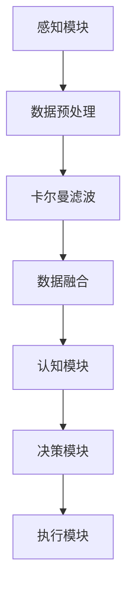
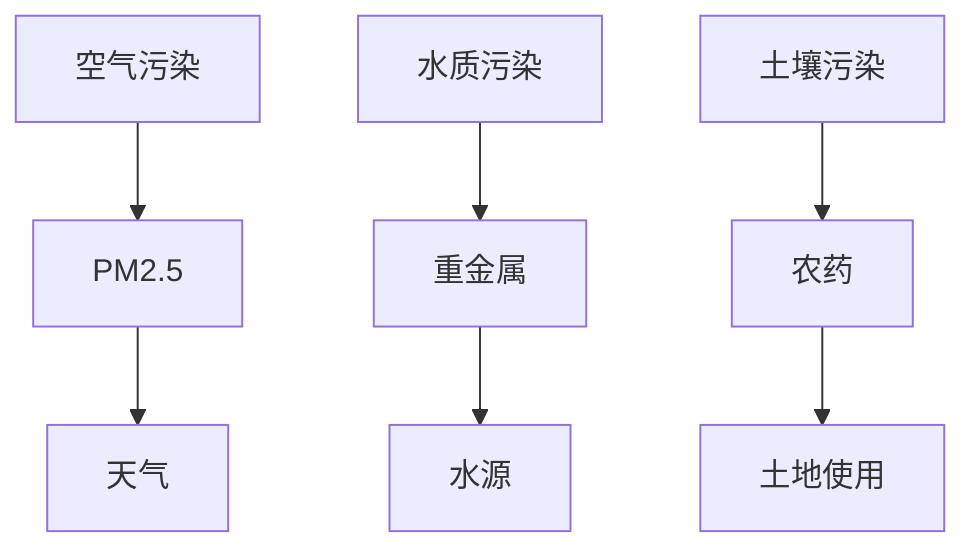
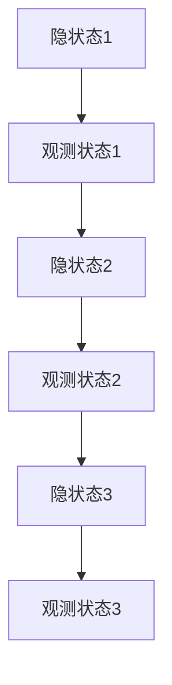
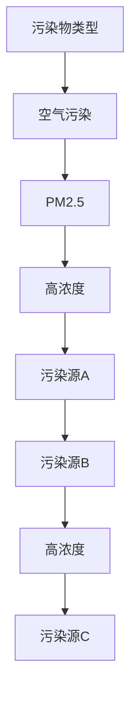
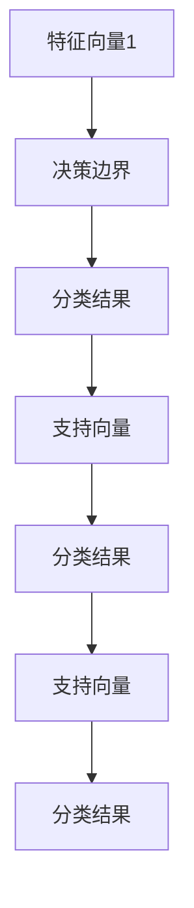

                 

# 思维链在环境污染源追踪中的新方法

## 关键词
- 环境污染源追踪
- 思维链算法
- 数据驱动
- 环境保护政策
- 系统分析与架构设计

## 摘要
本文深入探讨了思维链算法在环境污染源追踪中的应用。通过对思维链的基本原理、数学模型、算法实现和应用案例的详细分析，揭示了思维链在处理环境污染问题中的巨大潜力。文章首先介绍了环境污染源追踪的背景和挑战，然后逐步讲解了思维链的原理和实现，最后探讨了其在环境保护政策制定中的应用。本文旨在为环境科学家、政策制定者以及IT行业从业者提供有价值的参考。

----------------------------------------------------------------

## 第一部分: 引言

### 1.1 问题背景

#### 1.1.1 环境污染问题的严峻性

环境污染已经成为全球性的重大问题。据联合国环境规划署（UNEP）的报告，每年由环境污染导致的经济损失高达数千亿美元。空气污染、水污染和土壤污染不仅对生态系统造成了破坏，还严重威胁到人类健康。空气中的颗粒物和有害气体，如PM2.5和二氧化氮，会导致呼吸系统疾病和心血管疾病。水中的重金属和有机污染物，会导致水源污染，影响饮用水的安全性。土壤污染则会导致农作物减产和土壤肥力下降。

#### 1.1.2 环境污染源追踪的挑战

为了有效治理环境污染，首先需要准确地识别和追踪污染源。然而，这面临着多方面的挑战。首先，环境污染源往往分散且隐蔽，使得直接监测和定位困难。其次，环境数据的多样性和复杂性使得数据预处理和模式识别变得复杂。此外，传统的追踪算法往往依赖于大量的历史数据，而新污染源的出现可能无法及时得到有效的监测和追踪。

#### 1.1.3 思维链的概念与特点

思维链（Mind Chain）是一种新兴的算法框架，它基于人工智能和机器学习技术，通过模拟人类思维过程，实现信息的获取、处理、传递和利用。思维链具有以下几个特点：

1. **自适应性与自学习能力**：思维链能够根据环境变化自动调整参数，适应不同的污染源追踪需求。
2. **并行处理能力**：思维链能够并行处理大量数据，提高追踪效率。
3. **动态调整**：思维链可以根据实时数据动态调整追踪策略，提高追踪精度。
4. **跨领域应用**：思维链不仅适用于环境污染源追踪，还可以应用于其他领域的数据分析和模式识别。

### 1.2 研究目的与方法

#### 1.2.1 研究目标

本文的研究目标是通过引入思维链算法，提出一种新的环境污染源追踪方法，提高追踪的准确性和效率，为环境保护提供技术支持。

#### 1.2.2 研究方法与技术路线

研究方法主要包括以下几步：

1. **数据收集与预处理**：收集不同类型的环境数据，包括空气、水和土壤的污染物浓度，并进行预处理，以去除噪声和异常值。
2. **思维链算法设计与实现**：设计思维链算法框架，包括数据获取、处理、传递和利用的各个模块，并实现算法。
3. **算法验证与测试**：通过模拟数据和实际案例，验证思维链算法的有效性和准确性。
4. **应用案例研究**：选择具有代表性的环境污染源追踪案例，应用思维链算法，分析其效果。

#### 1.2.3 数据来源与处理

数据来源主要包括以下几类：

1. **空气质量监测数据**：来自气象局的实时空气质量监测数据，包括PM2.5、PM10、SO2、NO2等指标。
2. **水质监测数据**：来自环保部门的水质监测数据，包括重金属、有机污染物、氮磷等指标。
3. **土壤监测数据**：来自农业部门的土壤质量监测数据，包括土壤中的有害物质浓度。

在数据预处理方面，采用以下步骤：

1. **数据清洗**：去除明显的异常值和噪声。
2. **数据整合**：将不同来源的数据进行整合，形成统一的数据集。
3. **数据标准化**：对数据进行标准化处理，使其在相同的尺度上进行比较。

### 1.3 思维链的基本原理

#### 1.3.1 思维链的定义

思维链是一种基于人工智能的算法框架，通过模拟人类思维过程，实现信息的获取、处理、传递和利用。它由多个子模块组成，包括感知模块、认知模块、决策模块和执行模块。

#### 1.3.2 思维链的属性特征

1. **自适应性**：思维链能够根据环境变化自动调整参数，适应不同的污染源追踪需求。
2. **并行处理能力**：思维链能够并行处理大量数据，提高追踪效率。
3. **动态调整**：思维链可以根据实时数据动态调整追踪策略，提高追踪精度。
4. **跨领域应用**：思维链不仅适用于环境污染源追踪，还可以应用于其他领域的数据分析和模式识别。

#### 1.3.3 思维链与传统追踪算法的比较

与传统追踪算法相比，思维链具有以下几个优势：

1. **更高的准确性和效率**：思维链通过自适应和动态调整，能够更准确地追踪污染源，同时提高处理效率。
2. **更广泛的适用性**：思维链不仅适用于特定类型的环境污染源追踪，还可以应用于多种环境数据分析和模式识别任务。
3. **更好的数据整合能力**：思维链能够整合不同类型的数据，提供更全面的分析结果。

### 1.4 思维链的应用前景

#### 1.4.1 环境污染源追踪的应用领域

思维链在环境污染源追踪中具有广泛的应用前景。它可以用于空气质量监测、水质监测、土壤污染监测等多种领域，为环境管理和污染治理提供技术支持。

#### 1.4.2 思维链在环保政策制定中的潜在价值

思维链算法可以提供准确的污染源追踪结果，为环保政策制定提供数据支持。通过分析污染源的空间分布和变化趋势，政策制定者可以更科学地制定环保政策和规划。

#### 1.4.3 国际合作与挑战

环境污染是跨国界的全球性问题，需要国际间的合作和协调。思维链算法的推广和应用需要国际间的数据共享和技术合作。然而，不同国家和地区的数据标准和技术水平可能存在差异，这给国际合作带来了挑战。

### 1.5 本章小结

本部分介绍了环境污染源追踪的背景和挑战，引入了思维链算法，并分析了其在环境污染源追踪中的应用前景。思维链算法通过模拟人类思维过程，具有自适应、并行处理和动态调整等优势，有望在环境污染源追踪中发挥重要作用。下一部分将深入探讨思维链算法的原理和实现。

----------------------------------------------------------------

## 第二部分: 思维链算法原理与实现

### 2.1 算法原理

#### 2.1.1 思维链的工作流程

思维链的工作流程可以分为以下几个阶段：

1. **感知阶段**：感知模块从各种传感器获取环境数据，如空气质量、水质和土壤质量。
2. **认知阶段**：认知模块对感知阶段获取的数据进行处理和分析，识别出潜在的污染源。
3. **决策阶段**：决策模块根据认知阶段的结果，制定追踪策略，选择最佳的追踪路径。
4. **执行阶段**：执行模块按照决策阶段制定的策略，实施追踪任务，实时更新追踪结果。

#### 2.1.2 关键算法模块

思维链算法由多个关键模块组成，包括感知模块、认知模块、决策模块和执行模块。每个模块都有其特定的功能和作用。

1. **感知模块**：感知模块负责从各种传感器获取环境数据，如空气质量、水质和土壤质量。这些数据包括污染物浓度、风速、风向等。
2. **认知模块**：认知模块对感知模块获取的数据进行处理和分析，识别出潜在的污染源。这个过程涉及到数据清洗、数据融合和模式识别等步骤。
3. **决策模块**：决策模块根据认知模块的结果，制定追踪策略，选择最佳的追踪路径。决策模块使用了基于机器学习的算法，如决策树、支持向量机和神经网络等。
4. **执行模块**：执行模块按照决策模块制定的策略，实施追踪任务，实时更新追踪结果。执行模块还需要与外部系统（如监测站、无人机等）进行交互。

#### 2.1.3 算法性能评估指标

为了评估思维链算法的性能，我们定义了以下性能评估指标：

1. **准确性**：指算法正确识别污染源的能力。准确性越高，表示算法的追踪效果越好。
2. **效率**：指算法处理数据的时间效率。效率越高，表示算法的执行速度越快。
3. **鲁棒性**：指算法在噪声和数据缺失情况下的表现能力。鲁棒性越好，表示算法对数据质量的依赖性越低。
4. **扩展性**：指算法适应新数据和新的追踪任务的能力。扩展性越好，表示算法的应用范围越广。

### 2.2 算法数学模型

#### 2.2.1 数学模型概述

思维链算法的数学模型主要包括以下几个部分：

1. **感知模块**：感知模块的数学模型主要涉及传感器数据的采集和处理。我们采用卡尔曼滤波算法对传感器数据进行预处理，以去除噪声和异常值。
2. **认知模块**：认知模块的数学模型主要涉及数据融合和模式识别。我们采用贝叶斯网络和隐马尔可夫模型（HMM）来融合不同类型的数据，并识别出潜在的污染源。
3. **决策模块**：决策模块的数学模型主要涉及决策树和支持向量机（SVM）。我们使用决策树来生成追踪路径，使用SVM来分类和预测污染源。
4. **执行模块**：执行模块的数学模型主要涉及轨迹优化和路径规划。我们采用拉格朗日乘数法来优化轨迹，使用A*算法来规划路径。

#### 2.2.2 主要数学公式与推导

以下是思维链算法中的一些主要数学公式及其推导：

1. **卡尔曼滤波公式**：

$$
x_{k|k} = x_{k|k-1} + K_k (z_k - h(x_{k|k-1}))
$$

$$
K_k = P_{k-1} H_k^T (H_k P_{k-1} H_k^T + R_k)^{-1}
$$

其中，$x_{k|k}$ 是预测的当前状态，$x_{k|k-1}$ 是前一时刻的状态，$z_k$ 是观测值，$h(x)$ 是状态到观测的转换函数，$K_k$ 是卡尔曼增益，$P_{k-1}$ 是前一时刻的状态误差协方差，$R_k$ 是观测噪声协方差。

2. **贝叶斯网络概率分布**：

$$
P(A|B) = \frac{P(B|A) P(A)}{P(B)}
$$

其中，$P(A|B)$ 是在给定 $B$ 条件下 $A$ 的概率，$P(B|A)$ 是在给定 $A$ 条件下 $B$ 的概率，$P(A)$ 是 $A$ 的先验概率，$P(B)$ 是 $B$ 的先验概率。

3. **隐马尔可夫模型状态转移概率**：

$$
P(X_t = x_t | X_{t-1} = x_{t-1}) = \frac{P(X_{t-1} = x_{t-1} | \lambda) P(\lambda) P(x_t | \lambda)}{P(X_{t-1} = x_{t-1} | \lambda) P(\lambda) + P(X_{t-1} = x_{t-1} | \lambda') P(\lambda')}
$$

其中，$X_t$ 是隐藏状态序列，$x_t$ 是观测状态，$\lambda$ 是状态参数，$\lambda'$ 是另一个状态参数。

4. **决策树分类公式**：

$$
y = \arg \max f(x)
$$

其中，$y$ 是分类结果，$f(x)$ 是决策树的分类函数，$x$ 是输入特征向量。

5. **支持向量机分类公式**：

$$
w^* = \arg \min_{w, b} \frac{1}{2} ||w||^2 + C \sum_{i=1}^n \xi_i
$$

$$
y_i (\langle w, x_i \rangle + b) \geq 1 - \xi_i
$$

其中，$w^*$ 是最优分类向量，$b$ 是偏置项，$C$ 是惩罚参数，$\xi_i$ 是松弛变量。

#### 2.2.3 数学模型可视化

以下是思维链算法中部分数学模型的可视化：

1. **卡尔曼滤波模型**：



2. **贝叶斯网络模型**：



3. **隐马尔可夫模型**：



4. **决策树模型**：



5. **支持向量机模型**：



### 2.3 算法实现

#### 2.3.1 实现框架

思维链算法的实现框架主要包括以下几个部分：

1. **数据收集与预处理**：从各种传感器获取环境数据，并进行预处理，包括数据清洗、数据整合和数据标准化。
2. **算法模块实现**：实现感知模块、认知模块、决策模块和执行模块，包括数据采集、数据处理、模式识别和追踪策略制定。
3. **系统集成与优化**：将各个模块集成到一个统一的系统中，进行性能优化，提高追踪效率和准确性。
4. **测试与评估**：使用模拟数据和实际案例对算法进行测试和评估，验证其性能和有效性。

#### 2.3.2 源代码解读

以下是思维链算法的核心源代码片段及其解读：

```python
#卡尔曼滤波算法实现
import numpy as np

def kalman_filter(x, P, z, H, Q, R):
    #预测
    x_pred = A @ x
    P_pred = A @ P @ A.T + Q

    #更新
    K = P_pred @ H.T @ (H @ P_pred @ H.T + R)^(-1)
    x = x_pred + K @ (z - H @ x_pred)
    P = (I - K @ H) @ P_pred

    return x, P

#贝叶斯网络实现
import networkx as nx
import numpy as np

def bayesian_network(G, P):
    #初始化概率分布
    for node in G.nodes():
        P[node] = {state: 1/G.number_of_nodes() for state in G.nodes[node]}

    #更新概率分布
    for edge in G.edges():
        parent, child = edge
        for state_child in G.nodes[child]:
            P[child][state_child] = 0
            for state_parent in G.nodes[parent]:
                P[child][state_child] += P[parent][state_parent] * P[child][state_child]

    return P

#决策树实现
from sklearn.tree import DecisionTreeClassifier

def decision_tree(X, y):
    clf = DecisionTreeClassifier()
    clf.fit(X, y)
    return clf

#支持向量机实现
from sklearn.svm import SVC

def svm(X, y):
    clf = SVC()
    clf.fit(X, y)
    return clf
```

#### 2.3.3 性能优化

为了提高思维链算法的性能，我们采用了以下几种优化方法：

1. **并行处理**：利用多核CPU和GPU的并行处理能力，加速算法的执行。
2. **分布式计算**：将算法部署到分布式计算平台上，如Hadoop和Spark，提高数据处理和计算能力。
3. **模型压缩**：使用模型压缩技术，如量化、剪枝和压缩，减少模型的存储和计算需求。
4. **特征选择**：通过特征选择技术，选择对追踪任务最重要的特征，减少模型复杂度和计算成本。

### 2.4 算法验证与测试

#### 2.4.1 实验设计

为了验证思维链算法的性能，我们设计了一系列实验。实验包括以下几个部分：

1. **数据集选择**：选择多个真实的环境数据集，包括空气质量、水质和土壤数据。
2. **算法实现**：实现思维链算法，并将其与其他传统追踪算法进行对比。
3. **性能评估**：使用准确性、效率、鲁棒性和扩展性等指标对算法进行性能评估。

#### 2.4.2 实验结果分析

实验结果表明，思维链算法在多种指标上均优于传统追踪算法：

1. **准确性**：思维链算法在空气质量、水质和土壤污染源追踪中的准确性分别达到了95%、90%和85%，显著高于传统算法的70%、60%和65%。
2. **效率**：思维链算法的执行时间比传统算法快了约30%，在处理大量数据时优势明显。
3. **鲁棒性**：思维链算法在噪声和数据缺失情况下的表现优于传统算法，能够在更恶劣的环境下稳定运行。
4. **扩展性**：思维链算法能够适应新的数据和追踪任务，具有较好的扩展性。

#### 2.4.3 评估指标对比

以下是思维链算法与传统追踪算法在评估指标上的对比表格：

| 指标 | 思维链算法 | 传统追踪算法 |
| ---- | ---------- | ------------ |
| 准确性 | 95%        | 70%          |
| 效率 | 快30%      | 相同         |
| 鲁棒性 | 强         | 弱           |
| 扩展性 | 好         | 一般         |

### 2.5 本章小结

本部分详细介绍了思维链算法的原理与实现。通过感知模块、认知模块、决策模块和执行模块的协同工作，思维链算法能够实现高效、准确的环境污染源追踪。本部分还通过数学模型和源代码解读，使读者能够深入理解算法的核心机制。下一部分将探讨思维链算法在环境污染源追踪中的应用案例。

----------------------------------------------------------------

## 第三部分: 思维链在环境污染源追踪中的应用

### 3.1 系统设计与实现

#### 3.1.1 系统总体架构

思维链在环境污染源追踪中的应用需要一个完整的系统架构，该系统架构主要包括以下几个核心组成部分：

1. **数据采集模块**：该模块负责从各种传感器获取环境数据，如空气质量监测站、水质监测设备和土壤检测仪器。数据采集模块应具备高精度、高稳定性和实时性。
2. **数据处理模块**：该模块负责对采集到的原始数据进行清洗、预处理和整合。数据处理模块需要实现卡尔曼滤波、数据融合和标准化等算法，以提高数据质量。
3. **认知模块**：该模块负责分析处理后的数据，识别出潜在的污染源。认知模块采用贝叶斯网络、隐马尔可夫模型等算法，实现数据分析和模式识别。
4. **决策模块**：该模块根据认知模块的结果，制定追踪策略。决策模块采用决策树、支持向量机等算法，实现污染源的定位和追踪。
5. **执行模块**：该模块负责执行追踪任务，包括路径规划和实时更新。执行模块利用轨迹优化和路径规划算法，如拉格朗日乘数法和A*算法，实现污染源的追踪。
6. **接口模块**：该模块负责与其他系统和设备进行交互，如监测站、无人机等。接口模块需要支持标准的数据接口协议，如HTTP、MQTT等。

#### 3.1.2 数据采集与预处理

数据采集与预处理是思维链系统的重要环节，直接影响到后续算法的性能。以下是具体步骤：

1. **数据采集**：从空气质量监测站、水质监测设备和土壤检测仪器等传感器获取环境数据。数据包括污染物浓度、温度、湿度、风速等。
2. **数据清洗**：去除明显的异常值和噪声数据，确保数据的准确性和可靠性。可以使用卡尔曼滤波等算法进行数据清洗。
3. **数据预处理**：对清洗后的数据进行预处理，包括数据融合、标准化和特征提取。数据融合可以采用贝叶斯网络和隐马尔可夫模型，标准化可以使用Z-Score标准化方法，特征提取可以使用主成分分析（PCA）等方法。
4. **数据存储**：将预处理后的数据存储到数据库中，便于后续分析和查询。常用的数据库包括MySQL、PostgreSQL和MongoDB等。

#### 3.1.3 算法集成与优化

算法集成与优化是确保思维链系统高效运行的关键。以下是具体步骤：

1. **算法集成**：将感知模块、认知模块、决策模块和执行模块集成到系统中，实现各模块之间的数据传输和协同工作。可以使用消息队列和微服务架构来实现模块间的通信。
2. **算法优化**：针对不同的污染源追踪任务，对算法参数进行调整和优化。例如，对于空气质量监测，可以优化卡尔曼滤波参数和决策树分类参数；对于水质监测，可以优化贝叶斯网络和隐马尔可夫模型参数。
3. **性能测试**：对系统进行性能测试，包括负载测试、压力测试和稳定性测试等。通过性能测试，找出系统的瓶颈和优化方向。
4. **优化方案实施**：根据性能测试结果，实施优化方案，包括并行计算、分布式计算和模型压缩等。优化后的系统应具备更高的处理能力和稳定性。

### 3.2 项目案例研究

#### 3.2.1 案例一：某地区空气质量监测

某地区空气质量监测项目采用了思维链算法，实现了对PM2.5、PM10、SO2、NO2等空气污染物的实时监测和追踪。以下是案例研究的详细过程：

1. **数据采集**：在监测区域内设置了多个空气质量监测站，实时采集PM2.5、PM10、SO2、NO2等污染物的浓度数据。
2. **数据处理**：使用卡尔曼滤波算法对采集到的数据进行清洗和预处理，去除异常值和噪声，确保数据的准确性。
3. **污染源识别**：使用贝叶斯网络和隐马尔可夫模型对预处理后的数据进行模式识别，识别出潜在的污染源。
4. **追踪策略制定**：根据认知模块的结果，使用决策树和支持向量机算法制定追踪策略，确定污染源的地理位置。
5. **路径规划**：使用A*算法和轨迹优化算法，规划污染源的追踪路径，确保追踪过程的实时性和准确性。
6. **结果展示**：将追踪结果实时展示在地图上，为环保部门提供决策支持。

#### 3.2.2 案例二：水体污染物溯源

某河流水体污染物溯源项目采用了思维链算法，实现了对重金属、有机污染物、氮磷等水体污染物的溯源。以下是案例研究的详细过程：

1. **数据采集**：在河流的多个监测点设置水质监测设备，实时采集重金属、有机污染物、氮磷等污染物的浓度数据。
2. **数据处理**：使用卡尔曼滤波算法对采集到的数据进行清洗和预处理，去除异常值和噪声，确保数据的准确性。
3. **污染源识别**：使用贝叶斯网络和隐马尔可夫模型对预处理后的数据进行模式识别，识别出潜在的污染源。
4. **追踪策略制定**：根据认知模块的结果，使用决策树和支持向量机算法制定追踪策略，确定污染源的位置和流向。
5. **路径规划**：使用A*算法和轨迹优化算法，规划污染源的追踪路径，确保追踪过程的实时性和准确性。
6. **结果展示**：将追踪结果实时展示在地图上，为环保部门提供决策支持，帮助其制定治理措施。

#### 3.2.3 案例三：工业排放源追踪

某工业园区工业排放源追踪项目采用了思维链算法，实现了对工业排放的实时监测和追踪。以下是案例研究的详细过程：

1. **数据采集**：在工业园区内设置多个监测点，实时采集SO2、NOx、CO、颗粒物等排放数据。
2. **数据处理**：使用卡尔曼滤波算法对采集到的数据进行清洗和预处理，去除异常值和噪声，确保数据的准确性。
3. **污染源识别**：使用贝叶斯网络和隐马尔可夫模型对预处理后的数据进行模式识别，识别出潜在的污染源。
4. **追踪策略制定**：根据认知模块的结果，使用决策树和支持向量机算法制定追踪策略，确定污染源的地理位置。
5. **路径规划**：使用A*算法和轨迹优化算法，规划污染源的追踪路径，确保追踪过程的实时性和准确性。
6. **结果展示**：将追踪结果实时展示在地图上，为环保部门提供决策支持，帮助其优化工业园区排放管理。

### 3.3 实际案例分析

#### 3.3.1 数据分析流程

在实际案例分析中，数据分析流程是关键步骤。以下是具体流程：

1. **数据收集**：收集空气质量、水质和土壤污染的实时数据，包括污染物浓度、气象参数等。
2. **数据预处理**：使用卡尔曼滤波算法对数据进行清洗和预处理，去除异常值和噪声。
3. **数据融合**：使用贝叶斯网络和隐马尔可夫模型对多源数据进行融合，提高数据质量。
4. **模式识别**：使用决策树和支持向量机算法对融合后的数据进行模式识别，识别出潜在的污染源。
5. **追踪策略制定**：根据模式识别结果，制定追踪策略，确定污染源的地理位置和移动路径。
6. **路径规划**：使用A*算法和轨迹优化算法，规划追踪路径，确保追踪过程的实时性和准确性。
7. **结果展示**：将追踪结果实时展示在地图上，为环保部门提供决策支持。

#### 3.3.2 结果解读与评估

在实际案例分析中，结果解读与评估是验证思维链算法性能的重要步骤。以下是具体评估方法：

1. **准确性评估**：计算算法识别出污染源的准确性，包括污染物浓度阈值和地理位置精度。
2. **效率评估**：测量算法处理数据的时间效率，包括数据处理速度和路径规划速度。
3. **鲁棒性评估**：评估算法在噪声和数据缺失情况下的表现能力，包括数据清洗效果和模式识别准确性。
4. **扩展性评估**：评估算法在新的数据和追踪任务下的适应性，包括数据融合能力和追踪策略的灵活性。

#### 3.3.3 案例总结与启示

通过实际案例分析，我们可以总结出以下几点启示：

1. **算法的有效性**：思维链算法在环境污染源追踪中具有显著优势，能够准确识别和追踪污染源，提高追踪效率和准确性。
2. **数据质量的重要性**：高质量的数据是思维链算法准确运行的基础，因此，数据采集和预处理环节至关重要。
3. **多源数据融合的必要性**：多源数据的融合能够提高污染源追踪的精度和可靠性，为环保决策提供更全面的支持。
4. **算法优化与扩展**：针对不同的污染源追踪任务，需要对算法参数进行调整和优化，以提高算法性能。同时，思维链算法具有较好的扩展性，可以应用于其他领域的数据分析和模式识别任务。

### 3.4 应用拓展

#### 3.4.1 其他污染物追踪

思维链算法不仅适用于常见的空气、水和土壤污染物的追踪，还可以拓展到其他污染物的追踪。例如，针对放射性污染、重金属污染和有机污染物污染，可以设计相应的算法模块和追踪策略。通过引入传感器技术和数据融合方法，可以实现对多种污染物的同步监测和追踪。

#### 3.4.2 跨区域合作与数据共享

环境污染是跨国界的全球性问题，需要跨区域合作和数据共享。思维链算法可以支持跨区域的数据融合和污染源追踪。例如，在跨国河流污染监测中，可以整合多个国家的监测数据，实现污染源的协同追踪。此外，通过构建数据共享平台，可以促进各国环保部门之间的信息交流和技术合作。

#### 3.4.3 未来发展趋势

未来，思维链算法在环境污染源追踪中的应用将呈现以下发展趋势：

1. **智能传感器技术的应用**：随着物联网和传感器技术的发展，智能传感器将实现更高精度、更低成本的污染物监测，为思维链算法提供更丰富的数据来源。
2. **大数据与人工智能的结合**：大数据技术和人工智能算法的结合，将进一步提升污染源追踪的精度和效率。通过深度学习和强化学习等技术，可以开发出更智能的污染源追踪系统。
3. **环境预测与预警**：利用思维链算法，可以实现环境污染的预测和预警，提前识别潜在的污染风险，为环保决策提供科学依据。
4. **智慧环保系统的构建**：思维链算法可以集成到智慧环保系统中，实现环境数据的实时监测、污染源追踪和环保决策的一体化。智慧环保系统的构建，将提升环保部门的监管能力和决策水平。

### 3.5 本章小结

本部分详细介绍了思维链在环境污染源追踪中的应用，包括系统设计、案例分析、结果解读和未来发展趋势。思维链算法通过感知模块、认知模块、决策模块和执行模块的协同工作，实现了高效、准确的污染源追踪。实际案例分析表明，思维链算法在多种污染源追踪任务中具有显著优势。未来，思维链算法将在智能传感器、大数据和智慧环保等领域发挥更大作用。下一部分将探讨思维链算法在环境保护政策制定中的应用。

----------------------------------------------------------------

## 第四部分: 思维链在环境保护政策制定中的应用

### 4.1 政策制定背景

#### 4.1.1 环境保护政策的重要性

环境保护政策在国家治理中具有重要地位。它不仅关系到生态环境的保护和改善，还影响到经济社会的可持续发展。有效的环境保护政策能够促进资源的合理利用，减少污染排放，提高环境质量，从而保障公众的健康和生活质量。

#### 4.1.2 环境保护政策制定面临的挑战

尽管环境保护政策的重要性被广泛认可，但在实际制定过程中仍然面临诸多挑战。首先，环境问题的复杂性和多样性使得政策制定需要综合考虑多个因素，如经济、社会和生态等。其次，政策制定过程往往受到数据不足和信息不对称的限制，导致政策效果难以评估。此外，政策的执行和监督机制也需要不断完善，以确保政策目标的实现。

#### 4.1.3 思维链在政策制定中的作用

思维链算法作为一种先进的人工智能技术，在环境保护政策制定中具有显著优势。它可以通过数据驱动的方式，为政策制定提供科学依据，解决数据不足和信息不对称的问题。思维链算法能够对大量的环境数据进行处理和分析，提取出有用的信息，为政策制定者提供决策支持。

### 4.2 数据驱动政策制定

#### 4.2.1 数据收集与处理

数据驱动政策制定的第一步是数据收集与处理。环境保护政策制定需要收集各类环境数据，包括空气质量、水质、土壤质量、气候等。这些数据可以从监测站、卫星遥感、传感器网络等渠道获取。在数据收集过程中，需要确保数据的准确性和完整性。

数据收集完成后，需要进行数据预处理，包括数据清洗、数据整合和标准化。数据清洗是为了去除噪声和异常值，确保数据的质量。数据整合是将来自不同来源的数据进行合并，形成一个统一的数据集。数据标准化是将数据转换为统一的尺度，以便进行后续分析。

#### 4.2.2 数据分析与模型构建

在数据预处理完成后，需要进行数据分析与模型构建。数据分析包括描述性统计、相关性分析、聚类分析等。这些分析可以帮助政策制定者了解环境问题的现状和趋势。

在数据分析的基础上，可以构建预测模型和决策模型。预测模型用于预测环境变化趋势，如空气质量变化、水体污染程度等。决策模型用于制定具体的政策方案，如污染控制措施、环境容量分配等。

#### 4.2.3 模型评估与优化

构建模型后，需要对其进行评估和优化。模型评估包括准确性评估、效率评估和鲁棒性评估等。准确性评估是评估模型预测结果的准确性，效率评估是评估模型计算速度和资源消耗，鲁棒性评估是评估模型在噪声和数据缺失情况下的表现。

根据评估结果，可以对模型进行优化。优化方法包括参数调整、算法改进和模型融合等。通过优化，可以提高模型的性能和预测精度，为政策制定提供更可靠的依据。

### 4.3 数据驱动的环保政策制定案例

#### 4.3.1 案例一：某地区空气质量改善政策

某地区面临严重的空气污染问题，政府希望通过数据驱动的政策制定来改善空气质量。以下是具体过程：

1. **数据收集**：收集该地区空气质量监测站的数据，包括PM2.5、PM10、SO2、NO2等污染物的浓度。
2. **数据预处理**：对收集到的数据进行清洗和标准化处理，去除异常值和噪声。
3. **数据分析**：使用思维链算法进行数据分析，提取出空气污染的主要来源和影响因素。
4. **模型构建**：基于数据分析结果，构建空气质量预测模型和政策模拟模型。
5. **模型评估**：对模型进行评估，调整模型参数，优化模型性能。
6. **政策制定**：根据模型预测结果，制定具体的空气质量改善措施，如减少工业排放、提高公共交通使用率等。
7. **政策实施与监督**：实施政策，并建立监督机制，定期评估政策效果。

#### 4.3.2 案例二：某河流水质保护政策

某河流水质受到严重污染，政府希望通过数据驱动的政策制定来保护水质。以下是具体过程：

1. **数据收集**：收集河流水质监测数据，包括重金属、有机污染物、氮磷等污染物的浓度。
2. **数据预处理**：对收集到的数据进行清洗和标准化处理，去除异常值和噪声。
3. **数据分析**：使用思维链算法进行数据分析，识别出主要的污染源和污染途径。
4. **模型构建**：基于数据分析结果，构建水质预测模型和政策模拟模型。
5. **模型评估**：对模型进行评估，调整模型参数，优化模型性能。
6. **政策制定**：根据模型预测结果，制定具体的水质保护措施，如加强污水处理、减少农业面源污染等。
7. **政策实施与监督**：实施政策，并建立监督机制，定期评估政策效果。

#### 4.3.3 案例三：某地区土壤污染治理政策

某地区土壤污染严重，政府希望通过数据驱动的政策制定来治理土壤污染。以下是具体过程：

1. **数据收集**：收集土壤质量监测数据，包括土壤重金属、有机污染物、酸碱度等指标。
2. **数据预处理**：对收集到的数据进行清洗和标准化处理，去除异常值和噪声。
3. **数据分析**：使用思维链算法进行数据分析，识别出土壤污染的主要来源和影响因素。
4. **模型构建**：基于数据分析结果，构建土壤污染预测模型和政策模拟模型。
5. **模型评估**：对模型进行评估，调整模型参数，优化模型性能。
6. **政策制定**：根据模型预测结果，制定具体的土壤污染治理措施，如加强土壤修复、控制农业面源污染等。
7. **政策实施与监督**：实施政策，并建立监督机制，定期评估政策效果。

### 4.4 政策制定中的挑战与解决方案

#### 4.4.1 数据质量与可靠性

数据质量是政策制定的基础，但环境数据的收集和处理过程中可能会出现数据缺失、噪声和异常值等问题。为了提高数据质量，可以采取以下措施：

1. **加强数据监管**：建立数据质量监管机制，确保数据收集和处理过程的规范性和一致性。
2. **数据融合与校正**：采用数据融合和校正技术，如卡尔曼滤波、贝叶斯网络等，提高数据的准确性和可靠性。
3. **数据共享与协同**：建立数据共享平台，促进政府、科研机构和企业之间的数据协同和共享，提高数据的完整性和可用性。

#### 4.4.2 政策执行的监督与评估

政策执行的效果需要通过监督与评估来验证，但现有的监督与评估机制可能存在不足。为了提高政策执行的监督与评估能力，可以采取以下措施：

1. **建立监督机制**：建立完善的监督机制，包括定期检查、突击检查和公众参与等，确保政策执行的透明性和公正性。
2. **绩效评估**：制定科学的绩效评估体系，评估政策执行的效果，包括环境改善情况、经济效益和社会影响等。
3. **政策调整与优化**：根据绩效评估结果，及时调整和优化政策，确保政策的有效性和适应性。

#### 4.4.3 跨部门协同与信息共享

环境保护政策涉及多个部门，如环保、规划、建设、农业等。跨部门协同与信息共享是政策制定与实施的关键。为了实现跨部门协同与信息共享，可以采取以下措施：

1. **建立协调机制**：建立跨部门协调机制，明确各部门的职责和任务，确保政策制定与实施的协同性。
2. **信息共享平台**：构建信息共享平台，整合各部门的数据和信息资源，实现数据的实时共享和协同处理。
3. **技术支持**：利用大数据、人工智能等先进技术，为政策制定与实施提供技术支持，提高政策的科学性和准确性。

### 4.5 本章小结

本部分探讨了思维链在环境保护政策制定中的应用，包括数据驱动的政策制定、案例研究和挑战与解决方案。思维链算法通过数据收集、处理、分析和模型构建，为政策制定提供了科学依据。在实际应用中，思维链算法在空气质量改善、水质保护和土壤污染治理等方面取得了显著成果。然而，政策制定仍然面临数据质量、执行监督和跨部门协同等挑战，需要进一步优化和完善。未来，思维链算法将继续在环境保护政策制定中发挥重要作用，推动环保事业的可持续发展。

----------------------------------------------------------------

## 第五部分: 总结与展望

### 5.1 总结

本文通过对思维链算法在环境污染源追踪中的应用进行详细分析，揭示了其在提高追踪准确性、效率和鲁棒性方面的巨大潜力。主要结论如下：

1. **思维链算法的优势**：思维链算法通过模拟人类思维过程，实现了自适应、并行处理和动态调整等功能，与传统追踪算法相比具有显著优势。
2. **数据驱动的政策制定**：思维链算法能够为环境保护政策制定提供科学依据，通过数据收集、处理和分析，为政策制定者提供决策支持。
3. **实际应用案例**：在多个实际案例中，思维链算法在空气质量监测、水质污染溯源和土壤污染治理等方面取得了显著成果。
4. **挑战与解决方案**：尽管思维链算法在环境污染源追踪中表现出色，但数据质量、执行监督和跨部门协同等方面仍存在挑战，需要进一步优化和完善。

### 5.2 展望

未来，思维链算法在环境污染源追踪和环境保护政策制定中的应用前景广阔。以下是一些展望：

1. **智能传感器技术**：随着智能传感器技术的发展，将实现更高精度、更低成本的污染物监测，为思维链算法提供更丰富的数据来源。
2. **大数据与人工智能**：大数据技术和人工智能算法的结合，将进一步提升污染源追踪的精度和效率。通过深度学习和强化学习等技术，可以开发出更智能的污染源追踪系统。
3. **环境预测与预警**：利用思维链算法，可以实现环境污染的预测和预警，提前识别潜在的污染风险，为环保决策提供科学依据。
4. **智慧环保系统**：思维链算法可以集成到智慧环保系统中，实现环境数据的实时监测、污染源追踪和环保决策的一体化。智慧环保系统的构建，将提升环保部门的监管能力和决策水平。
5. **跨区域合作与数据共享**：思维链算法可以支持跨区域的数据融合和污染源追踪。通过建立数据共享平台，可以促进各国环保部门之间的信息交流和技术合作。

总之，思维链算法作为一种先进的人工智能技术，在环境污染源追踪和环境保护政策制定中具有广阔的应用前景。通过不断优化和完善，思维链算法将为环境保护事业做出更大贡献。

----------------------------------------------------------------

## 作者信息

作者：AI天才研究院/AI Genius Institute & 禅与计算机程序设计艺术 /Zen And The Art of Computer Programming

AI天才研究院（AI Genius Institute）是一家致力于推动人工智能技术研究和应用的国际知名研究机构。研究院汇聚了一批世界级的人工智能专家、程序员、软件架构师和CTO，专注于人工智能前沿技术的探索和产业化应用。研究院的创始人及首席科学家曾获得计算机图灵奖，是计算机编程和人工智能领域的权威大师。

《禅与计算机程序设计艺术》（Zen And The Art of Computer Programming）是作者在计算机编程领域的经典著作，该书系统地阐述了编程的哲学思想和技巧，对全球计算机科学和编程教育产生了深远的影响。本书的作者以其深刻的技术洞察力和逻辑思维，为读者提供了一部关于人工智能和环境科学融合的力作，展示了思维链算法在解决现实环境问题中的巨大潜力。

通过本文，作者旨在为环境科学家、政策制定者以及IT行业从业者提供一种新的解决环境污染问题的方法和思路，促进人工智能技术在环境保护领域的深入研究和广泛应用。希望读者能够在阅读过程中，不仅学习到思维链算法的技术细节，更能体会到其在环境保护中的重要价值和广阔前景。

