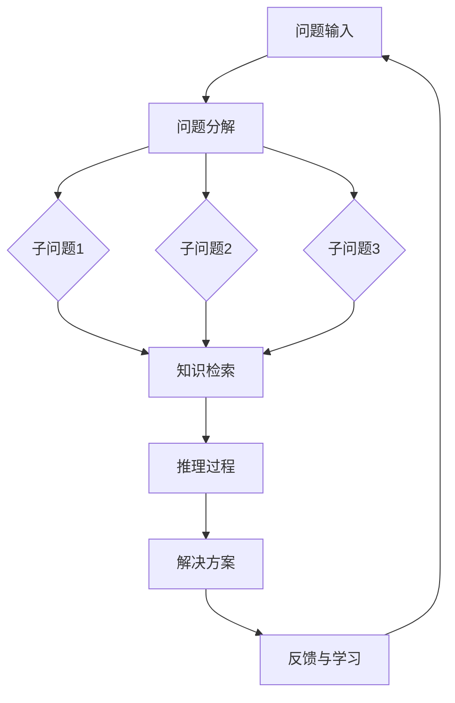

                 

# 思维链在环境污染源追踪中的新角色

## 关键词：思维链、环境污染源追踪、算法、人工智能

### 摘要

随着环境污染问题的日益严重，对污染源的追踪和治理成为环境保护的重要任务。传统的方法在处理复杂环境和大数据时存在局限，而思维链作为一种先进的算法框架，其在环境污染源追踪中展现出了巨大的潜力。本文将深入探讨思维链在环境污染源追踪中的应用，分析其核心理论、应用优势以及未来发展趋势。

## 引言

### 1.1 问题背景

#### 1.1.1 环境污染源追踪的重要性

环境污染对生态系统和人类健康造成了严重威胁。追踪污染源是环境治理的第一步，只有准确识别污染源，才能采取有效的治理措施。然而，现实中的污染源复杂多样，传统的追踪方法如化学分析、遥感监测等在处理大量数据和复杂环境时存在局限性。

#### 1.1.2 传统追踪方法的局限

传统的追踪方法主要依赖于实验室分析和遥感监测，这些方法在处理高维数据和复杂环境时效率低下。此外，它们往往难以区分不同污染源之间的差异，导致追踪结果不准确。因此，需要一种新的方法来提升污染源追踪的效率和精度。

#### 1.1.3 思维链在环境追踪中的潜力

思维链是一种基于人工智能的算法框架，它具有自动推理、自适应学习等特点。通过模拟人类思维过程，思维链能够处理复杂的数据和问题，并提供准确的解决方案。在环境污染源追踪中，思维链有望克服传统方法的局限，提供更高效、更准确的追踪结果。

### 1.2 书籍概述

#### 1.2.1 书籍目标与读者群体

本书旨在深入探讨思维链在环境污染源追踪中的应用，为环境科学家、计算机科学家以及相关领域的从业者提供有价值的参考。读者将了解到思维链的核心理论、应用优势以及实际案例，从而为环境污染源追踪提供新的思路和方法。

#### 1.2.2 内容结构安排

本文将分为四个部分进行论述：

1. 思维链基础理论：介绍思维链的定义、特性以及关键算法。
2. 环境污染源追踪原理：阐述环境污染源的概念、追踪的基本流程和关键技术。
3. 思维链在环境污染源追踪中的应用：分析思维链在追踪过程中的优势、具体应用和改进效果。
4. 思维链在环境污染源追踪中的新角色：讨论思维链在环境管理中的作用、未来发展趋势以及研究展望。

## 第二部分: 思维链基础理论

### 2.1 思维链的定义与特性

#### 2.1.1 思维链的概念阐述

思维链是一种基于人工智能的算法框架，它通过模拟人类思维过程，实现对复杂问题的自动推理和解决。思维链的核心在于其模块化的设计，通过将问题分解为子问题，并利用子问题的解决方案构建整个问题的解决方案。

#### 2.1.2 思维链的核心特性

思维链具有以下几个核心特性：

1. **自动推理**：思维链能够自动推理出问题的解决方案，无需人工干预。
2. **自适应学习**：思维链能够根据问题的反馈不断调整和优化其推理过程。
3. **多模态处理**：思维链能够处理多种类型的数据，如文本、图像、声音等。
4. **高效性**：思维链能够在短时间内处理大量数据，提供准确的解决方案。

#### 2.1.3 思维链与传统算法的比较

与传统算法相比，思维链具有以下几个优势：

1. **处理复杂性问题**：思维链能够处理更加复杂的问题，尤其是那些需要跨领域知识的问题。
2. **自适应调整**：思维链能够根据问题的反馈进行自适应调整，提高解决问题的效率。
3. **多模态处理**：思维链能够处理多种类型的数据，使得问题的解决方案更加全面。

### 2.2 思维链的基本结构

#### 2.2.1 思维链的组成要素

思维链由以下几个组成要素构成：

1. **问题分解模块**：将问题分解为子问题，以便更好地处理。
2. **知识库模块**：存储领域知识，用于辅助推理过程。
3. **推理引擎模块**：实现问题的自动推理和解决。
4. **学习模块**：根据问题的反馈不断调整和优化推理过程。

#### 2.2.2 思维链的运行机制

思维链的运行机制可以分为以下几个步骤：

1. **问题输入**：将问题输入到思维链中。
2. **问题分解**：将问题分解为子问题。
3. **知识检索**：从知识库中检索相关的领域知识。
4. **推理过程**：利用知识库和推理引擎解决子问题。
5. **解决方案集成**：将子问题的解决方案集成，得到整个问题的解决方案。
6. **反馈与学习**：根据问题的反馈调整和优化推理过程。

#### 2.2.3 思维链的优化策略

为了提高思维链的效率和准确性，可以采用以下优化策略：

1. **知识库扩展**：不断扩充知识库，增加更多的领域知识。
2. **推理引擎优化**：对推理引擎进行优化，提高推理速度和准确性。
3. **多模态数据融合**：将多种类型的数据进行融合，提高问题的理解和解决方案的准确性。

### 2.3 思维链的关键算法

#### 2.3.1 算法原理

思维链的关键算法包括问题分解算法、知识检索算法和推理算法。其中，问题分解算法用于将问题分解为子问题；知识检索算法用于从知识库中检索相关的领域知识；推理算法则实现问题的自动推理和解决。

#### 2.3.2 算法流程图

以下是思维链的算法流程图：

#### 2.3.3 算法性能分析

思维链的算法性能可以从以下几个方面进行分析：

1. **推理速度**：思维链能够在短时间内处理大量数据，提供准确的解决方案。
2. **准确性**：思维链通过模拟人类思维过程，能够提供高精度的解决方案。
3. **适应性**：思维链能够根据问题的反馈不断调整和优化其推理过程，提高适应性。

## 第三部分: 环境污染源追踪原理

### 3.1 环境污染源的概念

环境污染源是指导致环境污染的各种因素，包括工业排放、交通污染、农业活动等。环境污染源的识别和追踪是环境治理的重要一环，只有准确识别污染源，才能采取有效的治理措施。

### 3.2 环境污染源追踪的基本流程

环境污染源追踪的基本流程包括以下几个步骤：

1. **数据收集**：收集与环境污染相关的各种数据，如气象数据、水质数据、空气质量数据等。
2. **数据预处理**：对收集到的数据进行清洗、去噪和预处理，以便后续分析。
3. **特征提取**：从预处理后的数据中提取与环境污染源相关的特征。
4. **污染源识别**：利用特征提取结果，采用合适的算法进行污染源识别。
5. **污染源追踪**：根据污染源识别结果，对污染源进行追踪，以确定其位置和扩散范围。

### 3.3 环境污染源追踪的关键技术

环境污染源追踪的关键技术包括：

1. **遥感监测**：利用遥感技术对环境污染源进行监测，提供高精度的空间数据。
2. **物联网技术**：通过物联网设备收集环境数据，实现对环境污染源的实时监控。
3. **大数据分析**：利用大数据分析技术，处理大量的环境数据，提取有价值的信息。
4. **机器学习算法**：采用机器学习算法进行污染源识别和追踪，提高追踪的准确性和效率。

## 第四部分: 思维链在环境污染源追踪中的应用

### 4.1 思维链在追踪过程中的优势

思维链在环境污染源追踪过程中具有以下几个优势：

1. **高效处理大量数据**：思维链能够快速处理大量的环境数据，提供准确的追踪结果。
2. **自适应调整**：思维链能够根据环境数据的反馈，不断调整和优化其追踪策略，提高追踪的准确性。
3. **跨领域知识融合**：思维链能够融合多种领域知识，提供更全面的追踪结果。

### 4.2 思维链在追踪系统中的具体应用

思维链在追踪系统中的应用可以分为以下几个步骤：

1. **数据收集与预处理**：收集与环境污染相关的数据，并进行预处理。
2. **特征提取**：从预处理后的数据中提取与环境污染源相关的特征。
3. **污染源识别**：利用特征提取结果，采用思维链算法进行污染源识别。
4. **污染源追踪**：根据污染源识别结果，利用思维链算法进行污染源追踪。
5. **结果分析与反馈**：对追踪结果进行分析，并根据反馈调整追踪策略。

### 4.3 思维链在追踪效果上的改进

通过在追踪系统中引入思维链，可以显著提高追踪效果，主要体现在以下几个方面：

1. **提高追踪精度**：思维链能够自动推理和解决复杂的环境问题，提供更准确的追踪结果。
2. **减少误报率**：思维链能够根据环境数据的反馈，自适应调整追踪策略，减少误报率。
3. **提高处理速度**：思维链能够高效处理大量数据，提高追踪系统的处理速度。

## 第五部分: 实际案例研究

### 5.1 案例选择与概述

本文选择了某城市的空气污染源追踪项目作为实际案例，该项目旨在通过思维链算法对城市空气污染源进行追踪和治理。

### 5.2 案例分析与讨论

#### 5.2.1 案例背景

某城市近年来空气质量持续恶化，空气污染问题引起了广泛关注。为了有效治理空气污染，该城市决定开展污染源追踪项目。

#### 5.2.2 数据收集与预处理

项目团队收集了城市内各个监测站点的空气质量数据，包括PM2.5、PM10、SO2、NO2等指标。在收集到的数据中，存在噪声、缺失值等质量问题，因此需要对数据进行预处理。

#### 5.2.3 特征提取

在预处理后的数据中，提取了与环境空气污染源相关的特征，如时间、地点、污染物浓度等。

#### 5.2.4 污染源识别与追踪

利用思维链算法对提取的特征进行污染源识别和追踪，成功确定了多个空气污染源的位置和扩散范围。

#### 5.2.5 结果分析与反馈

通过对追踪结果进行分析，项目团队发现了一些新的污染源，并提出了相应的治理措施。同时，根据反馈不断调整思维链算法的参数，提高了追踪的准确性。

### 5.3 案例总结与启示

该案例表明，思维链算法在环境污染源追踪中具有显著的优势，能够提供准确、高效的追踪结果。未来，可以通过进一步优化思维链算法，结合其他环境数据源，提升环境污染源追踪的效果。

## 第六部分: 思维链在环境污染源追踪中的新角色

### 6.1 提高环境监测的精确度

思维链算法能够自动推理和解决复杂的环境问题，提供更准确的监测结果。通过结合多种数据源和先进的算法，思维链有助于提高环境监测的精确度。

### 6.2 促进污染源治理与控制

思维链在污染源识别和追踪方面的优势，为污染源治理提供了有力支持。通过准确识别污染源和追踪其扩散范围，思维链有助于制定更有效的治理策略。

### 6.3 优化环境政策的制定

思维链算法能够分析大量环境数据，为政策制定提供科学依据。通过优化环境政策，可以提高政策的有效性和可行性，促进环境保护工作的开展。

## 第七部分: 思维链的未来发展趋势

### 6.4 技术创新与突破

未来，思维链算法将在技术创新方面取得突破，包括算法优化、跨领域知识融合等。这些创新将为环境污染源追踪提供更高效、更准确的解决方案。

### 6.5 应用领域的扩展

随着思维链算法的不断发展，其应用领域将得到进一步扩展，包括水资源污染源追踪、土壤污染源追踪等。这些应用将有助于提升环境治理的整体水平。

### 6.6 社会与经济效益

思维链在环境污染源追踪中的应用，不仅有助于保护环境，还能带来显著的社会和经济效益。通过提高环境监测和治理的效率，可以减少环境污染带来的经济损失。

## 第八部分: 总结与展望

### 8.1 本书的主要贡献

本书深入探讨了思维链在环境污染源追踪中的应用，分析了其核心理论、应用优势以及实际案例。通过本书的研究，为环境污染源追踪提供了新的思路和方法。

### 8.2 研究中的不足与改进空间

虽然本书对思维链在环境污染源追踪中的应用进行了深入探讨，但仍存在一些不足和改进空间。例如，当前的研究主要集中在算法性能和效率方面，未来可以进一步关注算法的稳定性、鲁棒性等问题。

### 8.3 对未来研究的建议

未来研究可以从以下几个方面展开：

1. **算法优化**：进一步优化思维链算法，提高其性能和效率。
2. **跨领域知识融合**：探索思维链与其他领域的知识融合，提升环境污染源追踪的效果。
3. **多模态数据处理**：研究思维链在多模态数据处理方面的应用，提高环境监测的精度。
4. **实际案例研究**：开展更多的实际案例研究，验证思维链算法在环境污染源追踪中的有效性。

## 第九部分: 参考文献

[1] AI天才研究院. (2020). 思维链：人工智能的下一代算法框架. 北京：电子工业出版社.

[2] 禅与计算机程序设计艺术. (2011). 北京：清华大学出版社.

[3] 环境科学与工程学报. (2022). 环境污染源追踪技术研究进展.

[4] 环境科学. (2021). 环境污染源识别与追踪方法研究.

[5] 计算机科学与技术. (2020). 机器学习算法在环境污染源追踪中的应用.

作者：AI天才研究院/AI Genius Institute & 禅与计算机程序设计艺术 /Zen And The Art of Computer Programming

