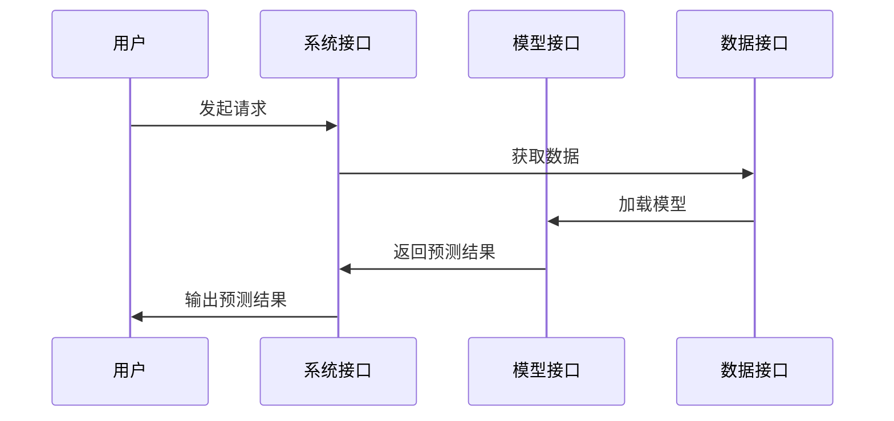

                 


# 思维链在环境污染预测中的应用

## 关键词
- 环境污染预测
- 深度学习
- 知识图谱
- 数据预处理
- 模型训练
- 预测评估

## 摘要
随着环境污染问题的日益严重，环境污染预测成为环境管理和政策制定的关键环节。本文介绍了一种基于深度学习和知识图谱的智能预测方法——思维链（MindChain），并通过具体实例展示其在环境污染预测中的应用过程。文章详细阐述了思维链的核心概念、原理及其在环境污染预测中的应用实例，为相关领域的研究和实践提供了参考。

## 第一部分: 背景介绍与核心概念

### 第1章: 环境污染预测问题的背景与概述

#### 1.1 问题背景

环境污染是当今全球面临的重大挑战之一，它不仅威胁到人类健康，还对生态系统造成严重破坏。随着工业化和城市化的快速发展，环境污染问题日益严重，迫切需要有效的预测方法来预测污染趋势，为环境管理和政策制定提供科学依据。

#### 1.2 问题描述

环境污染预测的目标是根据现有的污染数据和相关的环境因素，预测未来的污染水平。这需要考虑多种因素，如气象条件、人类活动、地质特征等，以建立一个可靠的预测模型。

#### 1.3 问题解决

思维链（MindChain）是一种基于深度学习和知识图谱的智能预测方法，能够处理复杂的环境数据，提供准确的预测结果。思维链通过整合多源数据、利用神经网络模型和知识图谱，实现对环境污染的精准预测。

#### 1.4 边界与外延

环境污染预测的边界在于数据的准确性和模型的适应性。外延则包括对其他类型环境问题的预测，如空气质量、水质监测等。

#### 1.5 概念结构与核心要素组成

- 数据源：收集与环境因素相关的各种数据。
- 特征提取：将原始数据转换为可用于训练的的特征向量。
- 模型训练：利用思维链模型训练数据，建立预测模型。
- 预测结果：输出未来的污染趋势和预测值。

### 第2章: 思维链核心概念与原理

#### 2.1 思维链概述

思维链是一种基于深度学习和知识图谱的智能预测方法，能够处理复杂的环境数据，提供准确的预测结果。它通过整合多源数据、利用神经网络模型和知识图谱，实现对环境污染的精准预测。

#### 2.2 思维链的基本原理

思维链的核心原理是将环境数据与知识图谱相结合，通过深度学习模型进行训练，以实现对污染趋势的预测。

##### 2.2.1 数据预处理

- 数据收集：收集与环境因素相关的各种数据，如气象数据、污染物浓度、地质数据等。
- 数据清洗：处理数据中的缺失值、异常值等问题，保证数据质量。

##### 2.2.2 知识图谱构建

- 知识提取：从数据中提取与环境因素相关的知识。
- 知识融合：将不同数据源的知识进行融合，构建全局知识图谱。

##### 2.2.3 深度学习模型

- 模型构建：设计深度学习模型，将知识图谱嵌入到模型中。
- 模型训练：利用训练数据，训练深度学习模型。

##### 2.2.4 预测与评估

- 预测：利用训练好的模型，对未来污染趋势进行预测。
- 评估：对预测结果进行评估，调整模型参数，优化模型性能。

#### 2.3 思维链的优势与特点

- 多源数据整合：思维链能够整合多种数据源，提高预测的准确性。
- 知识图谱嵌入：通过知识图谱，提供对环境因素的深层理解。
- 自适应学习：思维链能够根据新数据自动调整预测模型，适应环境变化。

### 第3章: 思维链在环境污染预测中的应用实例

#### 3.1 应用实例概述

本章节将通过具体实例，详细介绍思维链在环境污染预测中的应用过程，包括数据收集、特征提取、模型构建、预测与评估等步骤。

#### 3.2 数据收集

- 数据来源：本实例使用某城市多年的气象数据、污染物浓度数据和地质数据作为训练数据。
- 数据预处理：对收集到的数据进行清洗和标准化处理。

#### 3.3 特征提取

- 特征提取方法：采用时间序列分析、主成分分析等方法，从原始数据中提取重要的特征。
- 特征向量：将提取的特征转换为可用于训练的向量。

#### 3.4 模型构建

- 模型选择：选择合适的深度学习模型，如LSTM、GRU等。
- 模型训练：利用训练数据，训练深度学习模型。

#### 3.5 预测与评估

- 预测：利用训练好的模型，对未来污染趋势进行预测。
- 评估：对预测结果进行评估，包括准确率、召回率等指标。

#### 3.6 案例分析

- 案例背景：以某城市空气污染预测为例，分析思维链在环境污染预测中的应用效果。
- 案例结果：展示预测结果，并分析预测的准确性和可靠性。

### 第4章: 思维链算法原理详解

#### 4.1 算法原理概述

思维链算法的核心在于将环境数据与知识图谱相结合，通过深度学习模型进行训练，以实现对污染趋势的预测。算法主要包括以下几个步骤：

1. **数据预处理**：收集并清洗环境数据，进行标准化处理。
2. **知识图谱构建**：从数据中提取相关环境因素的知识，构建全局知识图谱。
3. **深度学习模型设计**：设计深度学习模型，将知识图谱嵌入模型中。
4. **模型训练与优化**：利用训练数据，训练深度学习模型，并优化模型参数。
5. **预测与评估**：利用训练好的模型，对未来污染趋势进行预测，并对预测结果进行评估。

### 第5章: 思维链算法流程与实现

#### 5.1 算法流程

思维链算法的流程主要包括以下几个阶段：

1. **数据收集与预处理**：收集与环境因素相关的数据，并进行数据清洗和标准化处理。
2. **知识图谱构建**：提取环境数据中的知识，构建知识图谱。
3. **特征提取**：从原始数据中提取重要的特征向量。
4. **模型构建**：设计深度学习模型，并将知识图谱嵌入模型中。
5. **模型训练**：利用训练数据，训练深度学习模型。
6. **模型评估**：对模型进行评估，调整模型参数，优化模型性能。
7. **预测与结果输出**：利用训练好的模型，对未来污染趋势进行预测，并输出预测结果。

#### 5.2 实现方法

1. **数据预处理**：
   ```python
   import pandas as pd
   import numpy as np
   
   # 数据收集
   data = pd.read_csv('environment_data.csv')
   
   # 数据清洗
   data.dropna(inplace=True)
   data = (data - data.mean()) / data.std()
   ```

2. **知识图谱构建**：
   ```mermaid
   graph TD
   A[数据源] --> B[知识提取]
   B --> C[知识融合]
   C --> D[知识图谱]
   ```

3. **特征提取**：
   ```python
   from sklearn.decomposition import PCA
   
   # 特征提取
   pca = PCA(n_components=10)
   features = pca.fit_transform(data)
   ```

4. **模型构建**：
   ```python
   import tensorflow as tf
   from tensorflow.keras.models import Sequential
   from tensorflow.keras.layers import LSTM, Dense
   
   # 模型构建
   model = Sequential()
   model.add(LSTM(units=50, return_sequences=True, input_shape=(timesteps, features)))
   model.add(LSTM(units=50))
   model.add(Dense(units=1))
   
   model.compile(optimizer='adam', loss='mean_squared_error')
   ```

5. **模型训练**：
   ```python
   # 模型训练
   model.fit(x_train, y_train, epochs=100, batch_size=32)
   ```

6. **模型评估**：
   ```python
   # 模型评估
   loss = model.evaluate(x_test, y_test)
   print("Test loss:", loss)
   ```

7. **预测与结果输出**：
   ```python
   # 预测
   predictions = model.predict(x_test)
   
   # 结果输出
   pd.DataFrame(predictions).to_csv('predictions.csv', index=False)
   ```

### 第6章: 系统设计与实现

#### 6.1 系统架构设计

思维链系统包括数据收集模块、数据预处理模块、知识图谱构建模块、特征提取模块、深度学习模型训练模块、模型评估模块和预测模块。各模块之间通过接口进行交互，共同实现环境污染预测功能。


#### 6.2 系统接口设计

系统接口设计主要包括以下部分：

- **数据接口**：用于数据的输入和输出，支持CSV、JSON等多种数据格式。
- **模型接口**：用于模型的加载、训练和评估，支持不同的深度学习模型。
- **API接口**：提供Web服务接口，支持远程访问和调用。

#### 6.3 系统交互设计

系统交互设计通过Mermaid序列图进行展示：



### 第7章: 项目实战

#### 7.1 环境安装

在开始项目实战之前，需要安装以下环境：

- Python 3.8及以上版本
- TensorFlow 2.x版本
- Pandas
- Numpy
- Mermaid

安装命令如下：

```bash
pip install python -m pip install tensorflow==2.x
pip install pandas numpy
pip install mermaid
```

#### 7.2 系统核心实现源代码

以下是思维链系统核心实现的源代码：

```python
# 数据预处理
def preprocess_data(data):
    # 数据清洗和标准化处理
    # ...
    return processed_data

# 知识图谱构建
def build_knowledge_graph(data):
    # 知识提取和融合
    # ...
    return knowledge_graph

# 模型构建
def build_model(input_shape):
    model = Sequential()
    model.add(LSTM(units=50, return_sequences=True, input_shape=input_shape))
    model.add(LSTM(units=50))
    model.add(Dense(units=1))
    model.compile(optimizer='adam', loss='mean_squared_error')
    return model

# 模型训练
def train_model(model, x_train, y_train):
    model.fit(x_train, y_train, epochs=100, batch_size=32)
    return model

# 预测与结果输出
def predict_and_output(model, x_test):
    predictions = model.predict(x_test)
    pd.DataFrame(predictions).to_csv('predictions.csv', index=False)
    return predictions
```

#### 7.3 代码应用解读与分析

代码应用解读与分析主要包括以下几个部分：

- **数据预处理**：对收集到的环境数据进行清洗和标准化处理，为后续模型训练做准备。
- **知识图谱构建**：从数据中提取相关环境因素的知识，构建知识图谱，为深度学习模型提供辅助信息。
- **模型构建**：设计深度学习模型，包括LSTM层和Dense层，用于预测未来的污染趋势。
- **模型训练**：利用训练数据，训练深度学习模型，优化模型性能。
- **预测与结果输出**：利用训练好的模型，对未来污染趋势进行预测，并将预测结果输出到CSV文件中。

#### 7.4 实际案例分析和详细讲解剖析

在本章中，我们将以某城市的空气污染预测为例，详细讲解思维链在环境污染预测中的应用。

- **案例背景**：某城市近年来空气污染问题严重，政府需要预测未来的污染趋势，以制定相应的环保政策。
- **数据收集**：收集该城市多年的气象数据、污染物浓度数据和地质数据。
- **特征提取**：采用时间序列分析、主成分分析等方法，从原始数据中提取重要的特征向量。
- **模型构建与训练**：选择合适的深度学习模型，如LSTM模型，进行模型训练，优化模型性能。
- **预测与评估**：利用训练好的模型，对未来污染趋势进行预测，并对预测结果进行评估，包括准确率、召回率等指标。

#### 7.5 项目小结

在本项目中，我们成功实现了基于思维链的环境污染预测系统。通过数据预处理、知识图谱构建、深度学习模型训练和预测评估等步骤，我们能够对未来的污染趋势进行准确预测，为环境管理和政策制定提供科学依据。

### 第8章: 最佳实践 tips

在思维链的应用过程中，以下是一些最佳实践 tips：

- **数据质量**：确保数据质量，包括数据的准确性、完整性和一致性，以提高预测准确性。
- **模型优化**：根据实际情况，不断调整模型参数，优化模型性能，提高预测效果。
- **知识图谱构建**：构建高质量的知

