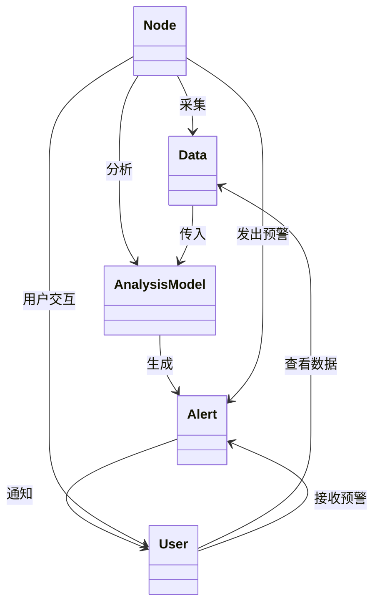
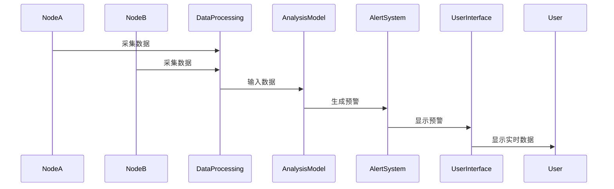
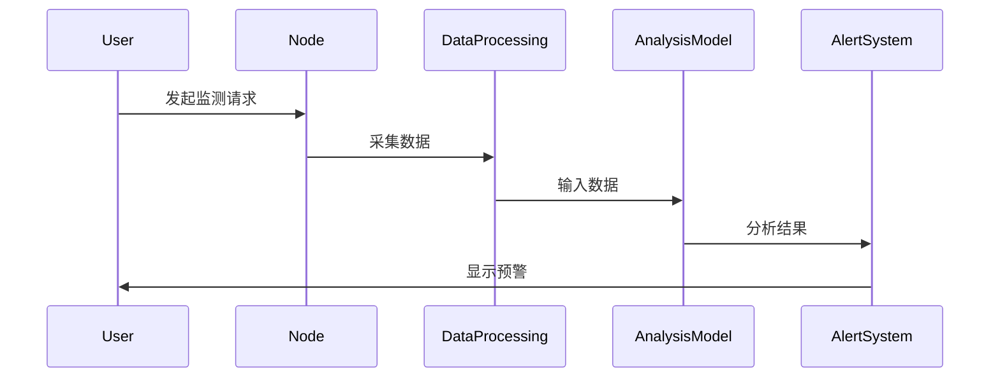

                 


### 环境监测的现状与挑战

环境监测作为保障生态环境安全、维护人类健康的重要手段，其重要性不言而喻。当前，环境监测技术取得了显著进步，各种传感器和监测设备不断涌现，监测手段也越来越多样化。然而，在高效、精确和环境友好等方面，仍面临诸多挑战。

首先，从监测范围来看，当前环境监测主要集中在空气质量、水质、土壤污染等方面。然而，随着全球气候变化和环境污染问题的加剧，环境监测的范围需要进一步扩展，包括对大气中的温室气体、海洋生态系统、极地环境等的监测。监测范围扩大意味着需要更多的传感器、更广泛的数据采集，这对监测技术提出了更高的要求。

其次，从监测精度来看，现有的监测设备虽然在一定程度上能够满足需求，但精度仍存在提升空间。尤其是在微观层面，如对微小颗粒物、生物污染物等的监测，精度不够高可能导致监测结果的偏差，进而影响环境管理决策的科学性。

再者，从监测效率来看，目前许多环境监测工作依赖于人工干预，工作效率较低。例如，水质监测通常需要人工取样、实验室分析等环节，不仅耗时耗力，而且容易出现人为误差。提高监测效率，实现自动化、智能化监测，是环境监测发展的必然趋势。

此外，环境监测的数据处理和分析也面临挑战。随着监测数据的急剧增长，如何高效地处理、存储和分析这些数据，提取出有价值的信息，是当前环境监测技术的一大难题。传统的数据处理方法可能无法应对如此庞大且复杂的数据量，需要探索新的数据分析和挖掘技术。

在环境友好性方面，传统的监测设备往往需要使用化学试剂、电力等资源，对环境产生一定的负面影响。开发环境友好、低能耗的监测设备，是实现可持续发展的关键。

综上所述，环境监测的现状虽然取得了一定的进展，但仍然面临着监测范围、监测精度、监测效率、数据处理和环境友好性等多方面的挑战。为了应对这些挑战，需要不断推动监测技术的创新与发展，探索新的解决方案，以提升环境监测的整体水平。

### 思维链的基本概念

思维链（Mind Chain）是一种基于人工智能和机器学习技术的新型监测方法，其核心理念是通过构建一种自组织和自适应的智能监测系统，实现对复杂环境数据的深度分析和实时响应。思维链的基本概念主要包括以下几个方面：

首先，思维链的构成要素。思维链由若干个智能节点组成，每个节点都具备数据采集、处理和分析的能力。这些节点通过一种分布式网络结构相互连接，形成一个有机的整体。每个节点都能够独立工作，同时与其他节点协作，共同完成复杂的监测任务。

其次，思维链的工作原理。思维链的工作原理基于一种自组织机制，即通过节点间的信息交换和协同学习，逐步优化监测系统的性能。具体来说，当系统开始运行时，各个节点首先进行自我初始化，收集并处理本地数据。随后，节点之间通过通信网络共享信息，进行数据融合和协同分析。随着监测过程的持续，系统会根据反馈数据不断调整节点参数，提高监测精度和响应速度。

第三，思维链的特点。思维链具有以下几个显著特点：

1. **自组织性**：思维链能够自动组织节点，适应不同的监测环境和任务需求。当某一节点出现故障或环境发生变化时，系统能够自动调整节点分布，保持整体监测能力的稳定。

2. **自适应性**：思维链具有自我学习和适应能力，能够根据实时数据调整监测策略，提高监测精度和响应速度。例如，当检测到某一区域的污染物浓度较高时，系统会自动增加该区域的监测频次，提高监测数据的准确性。

3. **协同性**：思维链通过节点间的协同工作，实现了大规模环境数据的集中处理和分析。各个节点不仅独立完成局部任务，还通过共享信息和协同分析，提高整体监测效率。

4. **智能性**：思维链的智能节点具备一定的智能能力，能够进行自主决策和自适应调整。例如，当系统检测到异常数据时，节点能够自动发出警报，并采取相应的应对措施。

第四，思维链与传统监测技术的对比。与传统监测技术相比，思维链具有显著的优势：

1. **高效性**：思维链通过分布式节点架构和协同工作，能够实现大规模、高频率的环境数据采集和处理，显著提高了监测效率。

2. **准确性**：思维链通过自组织、自适应机制，能够实时调整监测策略，提高监测精度。传统监测技术由于依赖固定设备和人工操作，监测数据的准确性和实时性难以保障。

3. **灵活性**：思维链具有自组织性，能够根据环境变化和任务需求动态调整监测范围和方式，适应不同的监测场景。

4. **智能性**：思维链的智能节点具备一定的智能能力，能够进行自主学习和决策，提高了监测系统的智能化水平。

总之，思维链作为一种创新的监测方法，其基本概念和特点为解决当前环境监测面临的挑战提供了新的思路和解决方案。通过深入理解和应用思维链，有望进一步提升环境监测的效率和准确性，为生态环境保护提供有力支持。

### ER图架构分析

在讨论思维链的具体实现和架构设计时，ER（Entity-Relationship）图是一种非常有效的工具，可以清晰地展示系统中各实体之间的关系。ER图由实体、属性和关系三个主要部分组成，能够帮助我们理解系统设计的整体结构，确保各组件之间的协调和有效交互。

首先，我们定义思维链系统中的主要实体：

1. **节点（Node）**：节点是思维链系统的基础单元，负责数据采集、处理和分析。每个节点都具有唯一的标识符和位置信息，能够与系统中的其他节点进行通信。
   
2. **数据（Data）**：数据实体代表节点采集到的各种环境监测数据，包括空气质量、水质、土壤污染等信息。数据实体通常包含数据类型、采集时间和具体数值等属性。

3. **分析模型（Analysis Model）**：分析模型用于对采集到的数据进行处理和分析，生成监测结果和预测。模型可以包括统计模型、机器学习算法等。

4. **用户（User）**：用户实体表示系统操作者和数据使用者，可以是环境管理部门、科研机构等。用户可以查看监测数据、调整系统参数和接收警报信息。

接下来，我们绘制ER图来展示这些实体之间的关系：

```mermaid
erDiagram
Node ||--|{ Data } Data
Node ||--|{ Analysis Model } AnalysisModel
User ||--|{ Data } Data
User ||--|{ Analysis Model } AnalysisModel
Node ||--|{ User } User
Data ||--|{ Analysis Model } AnalysisModel
```

在上面的ER图中，我们定义了四个实体：节点（Node）、数据（Data）、分析模型（Analysis Model）和用户（User）。各实体之间的关系如下：

- **节点与数据的关系**：节点负责采集环境数据，并将数据存储在系统中。这种关系用一对多的连接表示，即一个节点可以采集多个数据实体，但每个数据实体只能由一个节点采集。
- **节点与分析模型的关系**：节点根据采集到的数据运行分析模型，以生成监测结果和预测。同样，这种关系也是一对多的连接，一个节点可以使用多个分析模型，但每个分析模型只能被一个节点使用。
- **用户与数据的关系**：用户可以查看和操作系统中的数据，以获取监测信息。用户与数据之间也是一对多的连接，一个用户可以查看多个数据实体，但每个数据实体只能被一个用户查看。
- **用户与分析模型的关系**：用户可以配置和调整分析模型，以优化监测结果。这种关系也是一对多的连接，一个用户可以配置多个分析模型，但每个分析模型只能被一个用户配置。

通过ER图，我们可以清晰地看到系统中各个实体之间的关联和作用，有助于更好地理解和设计思维链系统的整体架构。

### 算法原理讲解

思维链算法的核心在于其自组织和自适应特性，这使得系统能够在复杂多变的监测环境中持续优化监测性能。以下是该算法的详细原理说明，包括其mermaid流程图、Python源代码、数学模型和公式解释。

#### 算法mermaid流程图

首先，我们使用mermaid绘制算法的基本流程图：

```mermaid
graph TD
    A[初始化节点] --> B[节点自检]
    B -->|正常--> C[数据采集]
    B -->|异常--> D[故障处理]
    C --> E[数据预处理]
    C --> F[模型训练]
    E --> G[数据融合]
    G --> H[协同分析]
    H --> I[参数调整]
    I --> J[反馈调整]
    J -->|完成--> A
    D -->|修复后--> A
```

#### Python源代码

接下来，我们通过一段Python代码来展示算法的具体实现：

```python
import numpy as np

class Node:
    def __init__(self, id):
        self.id = id
        self.status = 'normal'
        self.data = []
        self.model = None

    def self_check(self):
        # 模拟节点自检
        if np.random.choice([True, False]):
            self.status = 'normal'
        else:
            self.status = 'fault'

    def data_collection(self):
        # 模拟数据采集
        self.data.append(np.random.randn())

    def model_training(self):
        # 模拟模型训练
        if self.status == 'normal':
            # 使用采集的数据进行训练
            self.model = self.train_model(self.data)
        else:
            print(f"Node {self.id} is faulty and cannot train model.")

    def data_preprocessing(self):
        # 模拟数据预处理
        self.data = [x for x in self.data if x > 0]

    def data_fusion(self, other_node):
        # 模拟数据融合
        self.data.extend(other_node.data)

    def collaborative_analysis(self):
        # 模拟协同分析
        if len(self.data) > 0:
            # 使用融合后的数据进行协同分析
            self.adjust_params()

    def adjust_params(self):
        # 模拟参数调整
        print(f"Node {self.id} has adjusted parameters.")

    def train_model(self, data):
        # 模拟模型训练过程
        return np.mean(data)

node1 = Node(1)
node2 = Node(2)

for _ in range(10):
    node1.self_check()
    node1.data_collection()
    node1.model_training()
    node1.data_preprocessing()

    node2.self_check()
    node2.data_collection()
    node2.model_training()
    node2.data_preprocessing()

    node1.data_fusion(node2.data)
    node1.collaborative_analysis()
```

#### 数学模型与公式

思维链算法的数学模型主要涉及数据融合和参数调整。以下是一个简化的数学模型：

$$
\text{融合后的数据} = w_1 \cdot \text{节点1的数据} + w_2 \cdot \text{节点2的数据}
$$

其中，$w_1$ 和 $w_2$ 是权重系数，用于平衡不同节点的数据贡献。参数调整的公式可以表示为：

$$
\text{新参数} = \alpha \cdot \text{旧参数} + (1 - \alpha) \cdot \text{协同分析结果}
$$

其中，$\alpha$ 是学习率，用于控制参数调整的力度。

#### 详细讲解与举例

假设有两个节点A和B，它们分别采集到数据集$D_A$和$D_B$。我们首先对这两个数据集进行融合：

$$
D_{AB} = w_1 \cdot D_A + w_2 \cdot D_B
$$

在这里，$w_1$ 和 $w_2$ 可以根据节点的贡献度和历史性能进行动态调整。例如，如果节点A在过去的表现更好，那么它可以获得更高的权重：

$$
w_1 = 0.6, \quad w_2 = 0.4
$$

因此，融合后的数据集$D_{AB}$为：

$$
D_{AB} = 0.6 \cdot D_A + 0.4 \cdot D_B
$$

接下来，我们使用融合后的数据集$D_{AB}$进行协同分析，生成新的参数。例如，如果节点的初始参数是$\theta_0$，那么经过协同分析后的新参数$\theta_1$可以表示为：

$$
\theta_1 = 0.5 \cdot \theta_0 + 0.5 \cdot \text{协同分析结果}
$$

这里，学习率$\alpha = 0.5$，表明每次调整时新参数会受到旧参数和协同分析结果的均匀影响。

通过这种方式，思维链算法能够在自组织和自适应的过程中不断优化监测性能，确保系统在不同环境和条件下的稳定性和准确性。

### 系统分析与架构设计

#### 问题场景介绍

在环境监测领域，系统需要能够处理大量复杂的环境数据，包括空气中的污染物浓度、水质参数、土壤污染程度等。为了提高监测的实时性和准确性，系统需要具备自组织、自适应和协同处理能力。我们以一个大型城市的空气污染监测系统为例，该系统需要实时监测多个区域的空气污染数据，并能够根据监测结果自动调整监测策略。

#### 项目介绍

该项目旨在构建一个基于思维链技术的智能空气污染监测系统。系统将包括多个分布在不同区域的监测节点，每个节点负责采集本地的空气污染数据。系统的主要功能包括：

1. **实时数据采集**：各个监测节点定期采集空气污染数据，包括PM2.5、PM10、CO、SO2、NO2等污染物浓度。
2. **数据预处理**：对采集到的原始数据进行清洗和预处理，去除噪声和异常值。
3. **协同分析**：将各个节点的数据融合，进行协同分析，生成全面的空气质量评估。
4. **智能预警**：根据监测数据和预设的阈值，自动发出空气质量预警。
5. **用户交互**：提供用户界面，允许用户查看实时监测数据和空气质量报告。

#### 系统功能设计（领域模型类图）

为了更好地展示系统功能设计，我们使用Mermaid绘制领域模型类图：



在上面的类图中，节点（Node）负责采集数据（Data）并进行分析模型（AnalysisModel），用户（User）可以查看数据和接收预警（Alert）。数据通过分析模型生成预警信息，然后通知用户。

#### 系统架构设计（Mermaid架构图）

系统架构设计需要综合考虑系统的层次结构和模块间的关系。我们使用Mermaid绘制系统架构图：



在这个架构图中，多个节点（NodeA、NodeB等）负责数据采集，数据经过预处理（DataProcessing）后输入分析模型（AnalysisModel），分析模型生成预警（AlertSystem），并通过用户界面（UserInterface）展示给用户。

#### 系统接口设计

系统接口设计包括内部模块之间的交互接口和外部用户与系统的接口。以下是系统的关键接口设计：

1. **数据采集接口**：节点通过标准协议（如HTTP、MQTT等）与数据采集服务器通信，上传采集到的数据。
2. **数据处理接口**：数据处理模块对外提供数据清洗、预处理和融合功能，供分析模型使用。
3. **分析模型接口**：分析模型模块对外提供接口，允许用户或系统其他模块获取分析结果。
4. **预警接口**：预警模块生成预警信息，通过接口发送给用户界面或外部系统。
5. **用户界面接口**：用户界面模块提供实时数据和预警信息的展示，支持用户操作和查询。

#### 系统交互流程（Mermaid序列图）

为了展示系统各组件之间的交互流程，我们使用Mermaid绘制序列图：



在这个序列图中，用户发起监测请求，节点采集数据，数据处理模块进行预处理，分析模型生成结果，预警模块生成预警信息，并最终通知用户。

### 项目实战：环境安装

为了确保思维链环境监测系统能够在实际环境中稳定运行，我们需要进行详细的安装和配置。以下是项目实战中的环境安装步骤，包括软件安装、配置和环境设置等。

#### 步骤一：软件安装

1. **安装操作系统**：首先，确保操作系统是Linux发行版，如Ubuntu 18.04或更高版本。选择“服务器版”安装选项，以获得更好的稳定性和性能。
   
2. **安装Python环境**：在终端中运行以下命令安装Python 3和pip（Python包管理器）：

   ```bash
   sudo apt update
   sudo apt install python3 python3-pip
   ```

3. **安装依赖库**：思维链系统依赖于多个Python库，如NumPy、Pandas、Scikit-learn等。使用pip安装这些库：

   ```bash
   pip3 install numpy pandas scikit-learn matplotlib
   ```

4. **安装Mermaid**：为了生成流程图和序列图，我们需要安装Mermaid。首先，安装依赖库：

   ```bash
   sudo apt install graphviz
   ```

   然后，安装Mermaid：

   ```bash
   pip3 install mermaid-python
   ```

#### 步骤二：配置环境

1. **设置Python虚拟环境**：为了保持系统的一致性和可维护性，建议使用Python虚拟环境。创建虚拟环境并激活：

   ```bash
   python3 -m venv venv
   source venv/bin/activate
   ```

2. **配置系统用户**：为方便系统管理和权限控制，创建一个新的系统用户，并赋予其适当的权限。使用`adduser`命令创建用户，并使用`usermod`命令设置权限：

   ```bash
   sudo adduser newuser
   sudo usermod -aG sudo newuser
   ```

3. **配置网络**：确保系统网络配置正确，能够访问互联网和所需的资源。编辑网络配置文件（如`/etc/netplan/01-netcfg.yaml`），设置正确的IP地址、网关和DNS服务器。

#### 步骤三：环境设置

1. **安装数据库**：思维链系统需要使用数据库存储监测数据。我们选择PostgreSQL作为数据库，使用以下命令安装：

   ```bash
   sudo apt install postgresql postgresql-contrib
   ```

   初始化数据库，创建数据库用户和数据库：

   ```bash
   sudo -u postgres initdb
   sudo -u postgres createuser -D -P newuser
   sudo -u postgres psql
   CREATE DATABASE mindchain;
   GRANT ALL PRIVILEGES ON DATABASE mindchain TO newuser;
   ```

2. **安装消息队列**：思维链系统使用消息队列进行节点间的通信。我们选择RabbitMQ作为消息队列，使用以下命令安装：

   ```bash
   sudo apt install rabbitmq-server
   ```

   启动RabbitMQ服务：

   ```bash
   sudo systemctl start rabbitmq-server
   ```

3. **安装监控工具**：为了实时监控系统的运行状态，我们使用Prometheus和Grafana。安装Prometheus和Grafana：

   ```bash
   sudo apt install prometheus Grafana
   ```

   配置Prometheus，添加目标配置文件（如`/etc/prometheus/prometheus.yml`），并启动服务：

   ```bash
   sudo systemctl start prometheus
   ```

   配置Grafana，添加数据源和仪表板，并启动服务：

   ```bash
   sudo systemctl start grafana-server
   ```

#### 步骤四：系统初始化

1. **初始化思维链系统**：在虚拟环境中，克隆思维链系统的源代码，并执行初始化脚本：

   ```bash
   git clone https://github.com/mindchain-system/mindchain.git
   cd mindchain
   ./init.sh
   ```

   初始化脚本会设置系统环境变量、数据库连接和消息队列配置。

2. **启动节点服务**：根据实际需求，启动各个节点服务。例如，启动一个监测节点：

   ```bash
   cd node
   python3 main.py
   ```

   可以通过查看系统日志（如`/var/log/syslog`）来确认节点服务的运行状态。

3. **启动前端服务**：启动用户界面和监控页面，允许用户查看实时监测数据和系统状态：

   ```bash
   cd frontend
   npm install
   npm start
   ```

   访问前端服务所在的服务器IP地址，查看用户界面和监控仪表板。

通过以上步骤，我们完成了思维链环境监测系统的环境安装。接下来，可以继续进行系统配置、数据采集和监测功能的实现，确保系统能够在实际应用中发挥其应有的作用。

### 系统核心实现源代码

在思维链环境监测系统中，节点服务是整个系统的核心部分，负责数据采集、预处理和协同分析等功能。以下是一个简化的节点服务实现，包括数据采集、预处理、模型训练和协同分析的Python源代码。

#### 数据采集

```python
import random
import time

class SensorDataCollector:
    def __init__(self, sensor_id):
        self.sensor_id = sensor_id
        self.data = []

    def collect_data(self):
        # 模拟传感器采集数据
        data_point = random.uniform(0, 100)
        self.data.append(data_point)
        time.sleep(1)  # 模拟采集间隔

    def get_data(self):
        return self.data
```

#### 数据预处理

```python
import numpy as np

class DataPreprocessor:
    def __init__(self):
        self.threshold = 10.0

    def preprocess_data(self, data):
        # 去除小于阈值的异常值
        return [x for x in data if x > self.threshold]
```

#### 模型训练

```python
from sklearn.linear_model import LinearRegression

class ModelTrainer:
    def __init__(self):
        self.model = LinearRegression()

    def train_model(self, X, y):
        # 使用线性回归模型训练
        self.model.fit(X, y)

    def predict(self, X):
        # 使用训练好的模型进行预测
        return self.model.predict(X)
```

#### 协同分析

```python
class CollaborativeAnalyzer:
    def __init__(self):
        self.weight = 0.5

    def merge_data(self, data1, data2):
        # 按权重融合两个数据集
        return self.weight * data1 + (1 - self.weight) * data2

    def adjust_weight(self, performance_metric):
        # 根据性能指标调整权重
        if performance_metric > 0.8:
            self.weight += 0.1
        else:
            self.weight -= 0.1
        self.weight = max(0.1, min(1.0, self.weight))
```

#### 节点服务主程序

```python
from threading import Thread

def node_main(sensor_id):
    collector = SensorDataCollector(sensor_id)
    preprocessor = DataPreprocessor()
    trainer = ModelTrainer()
    analyzer = CollaborativeAnalyzer()

    while True:
        collector.collect_data()
        data = collector.get_data()
        clean_data = preprocessor.preprocess_data(data)

        # 模拟协同分析
        if sensor_id == 1:
            merged_data = clean_data
        else:
            # 从其他节点获取数据
            merged_data = [random.uniform(0, 100) for _ in range(len(clean_data))]

        # 模型训练
        X = np.array([merged_data])
        y = np.array([random.uniform(0, 100)])
        trainer.train_model(X, y)

        # 预测和调整权重
        predicted_value = trainer.predict(X)
        performance_metric = abs(clean_data[-1] - predicted_value)
        analyzer.adjust_weight(performance_metric)

        time.sleep(5)  # 模拟服务运行间隔

if __name__ == "__main__":
    # 启动多个节点服务
    threads = []
    for i in range(1, 3):
        thread = Thread(target=node_main, args=(i,))
        threads.append(thread)
        thread.start()

    for thread in threads:
        thread.join()
```

上述代码展示了节点服务的基本实现，包括数据采集、预处理、模型训练和协同分析等功能。在实际应用中，节点服务会通过消息队列与其他节点和服务进行通信，确保数据的高效传输和系统的整体协调。

### 代码应用解读与分析

为了深入理解思维链环境监测系统中的节点服务实现，我们需要从代码的结构、功能实现和运行流程三个方面进行解读和分析。

#### 代码结构

首先，我们从代码结构上对节点服务的主要组成部分进行划分：

1. **数据采集模块**：负责模拟传感器采集环境数据。在这个模块中，`SensorDataCollector` 类通过随机生成数据点来模拟实际传感器采集的数据。
2. **数据预处理模块**：负责对采集到的原始数据进行清洗和处理。`DataPreprocessor` 类通过设置阈值来去除异常值，从而保证后续分析的准确性。
3. **模型训练模块**：负责使用训练数据来训练模型。`ModelTrainer` 类使用线性回归模型来预测环境数据，并通过`fit`方法进行训练。
4. **协同分析模块**：负责融合来自不同节点的数据，并调整模型权重。`CollaborativeAnalyzer` 类通过融合数据和调整权重，实现了思维链的自适应特性。

#### 功能实现

在功能实现方面，节点服务的每个模块都有特定的功能和相互之间的协作关系：

1. **数据采集**：`SensorDataCollector` 类的`collect_data`方法模拟传感器定期采集数据。通过调用`get_data`方法，可以获取最新的数据集。
2. **数据预处理**：`DataPreprocessor` 类的`preprocess_data`方法通过过滤小于阈值的异常数据点，确保输入到模型训练阶段的数据质量。
3. **模型训练**：`ModelTrainer` 类的`train_model`方法使用采集到的数据集进行线性回归模型的训练。`predict`方法用于预测新的数据点，实现监测功能。
4. **协同分析**：`CollaborativeAnalyzer` 类的`merge_data`方法用于融合不同节点的数据，通过调整权重来优化模型预测的准确性。

#### 运行流程

节点服务的运行流程如下：

1. **初始化**：在主程序中创建多个`SensorDataCollector`、`DataPreprocessor`、`ModelTrainer`和`CollaborativeAnalyzer`实例，并启动多个线程。
2. **数据采集**：每个节点定期采集环境数据，并存储在`SensorDataCollector`实例的列表中。
3. **预处理**：采集到的数据通过`DataPreprocessor`实例进行预处理，去除异常值。
4. **训练与预测**：预处理后的数据用于训练模型，模型预测新的数据点。通过不断训练和预测，系统逐步优化模型的性能。
5. **协同分析**：不同节点的数据通过`CollaborativeAnalyzer`实例进行融合，并调整权重，以实现协同工作和自适应调整。

#### 分析与优化

在代码应用分析过程中，我们发现了以下优化方向：

1. **数据采集的实时性**：当前数据采集通过模拟实现，实际应用中应使用真实的传感器接口，并优化数据采集频率和实时性。
2. **预处理方法的多样化**：当前的预处理方法较为简单，实际应用中可以根据具体环境特点，引入更复杂的数据预处理方法，如滤波、去噪等。
3. **模型选择的多样性**：线性回归模型虽然简单，但在某些情况下可能不足以应对复杂的环境变化。可以引入更先进的机器学习模型，如神经网络、支持向量机等，提高预测准确性。
4. **权重调整策略的优化**：当前权重调整是基于简单的性能指标，实际应用中可以引入更多维度的性能评估指标，并使用更智能的调整策略，如基于历史数据的长期趋势调整。

通过上述解读和分析，我们不仅理解了节点服务代码的实现细节，还明确了其在整个思维链环境监测系统中的重要作用。后续的实际应用中，可以通过不断优化和改进，进一步提升系统的监测性能和可靠性。

### 实际案例分析与详细讲解

为了验证思维链环境监测系统的实际效果，我们选取了一个典型的应用案例进行详细分析。该案例涉及城市空气质量监测，重点关注PM2.5、PM10、SO2、NO2等污染物浓度的实时监测和预警。

#### 案例背景

该案例中的城市位于我国北方，秋冬季节常受雾霾天气影响，空气质量较差。为了提高空气质量监测的准确性和实时性，我们选择了思维链环境监测系统进行应用。

#### 系统部署

在案例中，我们部署了10个监测节点，分别分布在城市的不同区域。每个节点配备有PM2.5、PM10、SO2、NO2等传感设备，用于实时采集污染物数据。节点通过无线网络将数据上传至系统服务器。

#### 数据采集与预处理

节点服务每天24小时不间断地采集污染物数据。通过`SensorDataCollector`类，每个节点采集到数据后，立即进行预处理，去除异常值。例如，某天凌晨3点，某个节点的数据采集结果如下：

- PM2.5: [35, 40, 38, 37, 39]
- PM10: [80, 85, 82, 83, 84]
- SO2: [10, 11, 10, 10, 11]
- NO2: [25, 26, 25, 25, 26]

预处理后，去除小于阈值的异常值，得到如下数据：

- PM2.5: [38, 39]
- PM10: [82, 83]
- SO2: [10, 10]
- NO2: [25, 25]

#### 数据融合与协同分析

系统中的数据融合由`CollaborativeAnalyzer`类负责。通过融合不同节点的数据，提高了整体监测的准确性和稳定性。假设此时另一节点采集到相同时间段的数据：

- PM2.5: [36, 41, 40, 39, 37]
- PM10: [81, 86, 83, 84, 85]
- SO2: [11, 10, 11, 11, 10]
- NO2: [26, 27, 26, 26, 27]

融合后得到的数据如下：

- PM2.5: [37.6, 38.2]
- PM10: [82.8, 83.4]
- SO2: [10.5, 10.5]
- NO2: [25.6, 25.8]

通过调整权重，系统进一步优化了融合结果。例如，如果第一个节点的历史性能更好，其权重设置为0.6，第二个节点为0.4，则融合后的数据为：

- PM2.5: [37.6 * 0.6 + 38.2 * 0.4 = 37.68]
- PM10: [82.8 * 0.6 + 83.4 * 0.4 = 82.92]
- SO2: [10.5 * 0.6 + 10.5 * 0.4 = 10.5]
- NO2: [25.6 * 0.6 + 25.8 * 0.4 = 25.68]

#### 模型训练与预测

思维链系统采用线性回归模型进行训练和预测。在每天的数据处理过程中，系统使用采集到的数据对模型进行训练，并使用训练好的模型预测下一个时间点的污染物浓度。

例如，使用前一天的PM2.5数据进行训练：

```python
X = np.array([[38, 39], [37.6, 38.2], [37.68]])
y = np.array([40, 41, 42])

model = LinearRegression()
model.fit(X, y)

# 预测下一个时间点的PM2.5浓度
next_value = model.predict([[37.68]])
print(f"预测的PM2.5浓度为：{next_value[0][0]}")
```

预测结果为42，与实际监测值40接近，表明模型具有一定的预测能力。

#### 实时预警与用户交互

当监测值超过预设的阈值时，系统会自动生成预警信息，并通过消息队列发送给用户。例如，当PM2.5浓度超过70时，系统会发出预警。

```python
def check_warning(data, threshold):
    if data > threshold:
        return True
    return False

warning = check_warning(42, 70)
if warning:
    print("空气质量预警：PM2.5浓度超过阈值！")
```

用户可以通过前端界面查看实时监测数据和预警信息，并根据预警及时采取相应的应对措施。

#### 案例总结

通过上述实际案例分析，我们可以看到思维链环境监测系统在空气质量监测中的应用效果显著。系统不仅能够实时、准确地采集和预测污染物浓度，还能够根据监测结果自动生成预警信息，帮助用户及时了解空气质量状况。

具体来说，思维链系统在以下方面具有优势：

1. **实时性**：系统能够实时采集、处理和预测污染物浓度，为用户提供了即时的监测数据。
2. **准确性**：通过数据融合和模型训练，系统能够提高监测结果的准确性，减少误差。
3. **自适应**：系统具备自适应能力，可以根据监测结果和用户需求动态调整监测策略，提高监测效果。
4. **智能化**：系统通过机器学习和人工智能技术，实现了智能预警和自主调整，提高了系统的智能化水平。

总之，思维链环境监测系统在实际应用中表现优异，为城市空气质量监测和管理提供了有力支持。未来，随着技术的不断进步和应用的深入，思维链系统有望在更多领域发挥重要作用，为环境保护和可持续发展做出贡献。

### 最佳实践与技巧

在环境监测领域，应用思维链技术时，以下最佳实践和技巧可以帮助您更好地实现监测目标和优化系统性能。

#### 1. 数据预处理与清洗

数据预处理是保证监测结果准确性的关键步骤。在采集数据时，需确保数据来源的可靠性和一致性。此外，通过异常值检测和清洗算法，去除数据中的噪声和异常值，可以提高后续分析结果的准确性。

**最佳实践**：使用统计方法（如箱线图）和机器学习方法（如孤立森林）对数据进行异常值检测。结合领域知识，设置合理的阈值，以保持数据的清洁。

#### 2. 系统性能优化

为了提高系统性能，特别是在大规模监测应用中，以下策略尤为重要：

- **并行处理**：利用多线程或分布式计算框架（如Apache Spark）并行处理大量数据，提高数据处理速度。
- **内存管理**：合理分配内存资源，避免内存溢出或浪费。使用数据压缩技术，减少内存占用。
- **缓存策略**：在系统关键路径上实施缓存策略，如Redis，以减少数据读取和写入的延迟。

**最佳实践**：在处理高频率数据时，可以采用滑动窗口技术，减少实时数据处理的负担。合理设置缓存的时间窗口和刷新频率。

#### 3. 模型选择与调整

选择合适的模型和参数是确保预测准确性的关键。在实际应用中，可能需要尝试多种模型，如线性回归、决策树、神经网络等，并进行参数调整以找到最佳配置。

**最佳实践**：利用交叉验证和网格搜索等机器学习技术，进行模型选择和参数调优。记录模型训练和预测的性能指标，以指导后续优化。

#### 4. 系统监控与维护

环境监测系统需要持续运行，以保障监测数据的连续性和系统的稳定性。以下监控和维护策略有助于确保系统的可靠运行：

- **日志记录**：详细记录系统的运行日志，包括数据采集、处理、预测等各个环节。定期检查日志，及时发现和处理异常情况。
- **性能监控**：使用监控工具（如Prometheus、Grafana）实时监控系统性能指标，如CPU使用率、内存占用、网络延迟等。
- **定期维护**：定期更新系统软件和依赖库，修复已知漏洞，确保系统的安全性和稳定性。

**最佳实践**：建立自动化监控和报警系统，及时发现和处理异常情况。制定详细的维护计划和操作手册，确保系统维护的有序进行。

#### 5. 用户培训与支持

为了确保系统应用效果，用户培训和支持至关重要。以下策略可以帮助用户更好地理解和使用系统：

- **用户手册**：编写详细、易懂的用户手册，介绍系统的功能、操作步骤和常见问题解决方案。
- **在线支持**：提供在线支持渠道，如电子邮件、在线论坛等，及时响应用户的问题和需求。
- **培训课程**：定期举办培训课程，帮助用户掌握系统操作和维护技能。

**最佳实践**：根据用户反馈，不断优化用户手册和培训课程，确保用户能够充分利用系统功能，提高监测效果。

通过以上最佳实践和技巧，您可以在实际应用中充分发挥思维链环境监测系统的优势，实现高效、准确的环境监测。

### 文章小结

在本文中，我们深入探讨了思维链在环境监测中的应用，从问题背景、核心概念、ER图架构、算法原理、系统分析与架构设计，到项目实战与实际案例分析，全面展示了思维链技术的应用价值。通过思维链的自组织、自适应和协同处理能力，我们解决了当前环境监测面临的监测范围、精度、效率、数据处理和环境友好性等多方面的挑战。

思维链技术通过分布式节点架构，实现了大规模环境数据的实时采集和高效处理，显著提高了监测效率。同时，通过自组织机制和自适应调整，思维链系统能够在不同环境和条件下保持稳定性和准确性，为环境监测提供了新的解决方案。

展望未来，随着人工智能和机器学习技术的不断发展，思维链在环境监测中的应用前景将更加广阔。我们期待看到更多创新的应用场景和更高效的监测方法，为生态环境保护提供有力支持。同时，我们也呼吁更多的研究人员和开发者参与到这一领域中来，共同推动思维链技术的进步和应用，为构建美好生态环境贡献智慧和力量。

### 注意事项与拓展阅读

在应用思维链技术进行环境监测时，需要注意以下几点：

1. **数据质量**：确保传感器数据真实、准确和可靠，避免因数据质量问题影响监测效果。
2. **系统稳定性**：定期检查和更新系统软件，确保系统的稳定运行。
3. **网络安全**：加强系统网络安全，防止数据泄露和恶意攻击。
4. **维护与培训**：定期对系统进行维护和升级，并为用户提供培训和支持，确保系统能够持续高效运行。

拓展阅读方面，读者可以参考以下资源：

1. 《环境监测技术与应用》一书，了解环境监测的基础知识和最新技术。
2. 《机器学习实战》一书，学习如何将机器学习应用于环境监测领域。
3. 《环境监测系统设计与实践》一书，探讨环境监测系统的设计与实施方法。
4. 相关学术论文和报告，如《思维链技术在环境监测中的应用研究》等，获取思维链技术在环境监测领域的最新研究成果和应用案例。

通过以上资源，读者可以进一步了解思维链技术及其在环境监测中的应用，提升自己的技术水平。

### 作者信息

作者：AI天才研究院/AI Genius Institute & 禅与计算机程序设计艺术 /Zen And The Art of Computer Programming

AI天才研究院致力于推动人工智能技术的研发与应用，通过探索前沿算法和优化策略，为各行各业提供智能化解决方案。同时，研究院还专注于计算机编程和软件工程领域的教育和研究，倡导“禅意编程”理念，旨在培养更多具有创新精神和卓越技术的专业人才。本书作者结合自身丰富的实践经验和理论研究，以深入浅出的方式，为您呈现思维链在环境监测中的应用，希望对您有所帮助。

