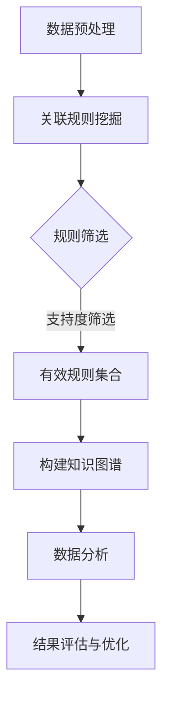
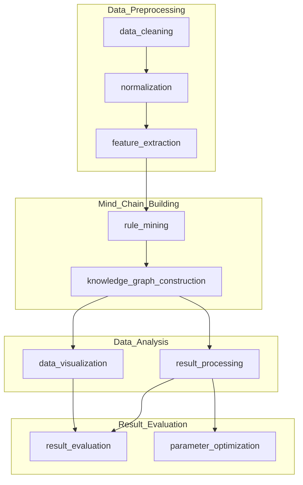
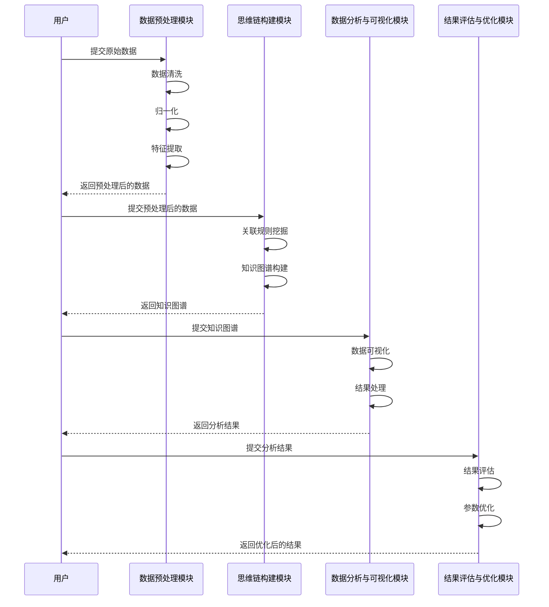
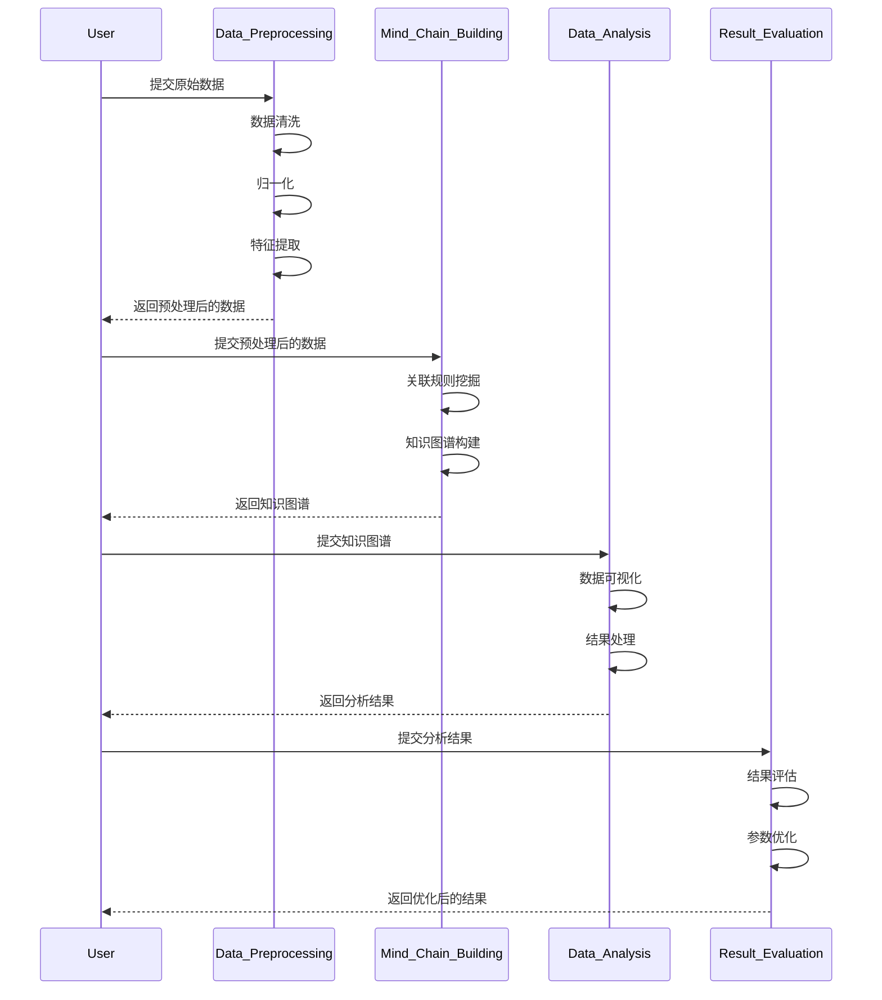

                 

### 引言

#### 1.1 问题背景

生物信息学作为一门融合生物学、计算机科学和信息学的交叉学科，随着高通量测序技术的迅猛发展，已经迎来了大数据时代的到来。生物信息学大数据分析涉及从大规模生物数据中提取有价值的信息，以推动基因表达调控、蛋白质功能预测、疾病诊断与治疗等领域的进展。在这个背景下，如何高效地进行生物信息学大数据分析成为了一个亟待解决的问题。

思维链方法作为一种先进的数据挖掘与分析工具，因其强大的关联挖掘能力和高度的可解释性，在多种领域展现了广泛的应用潜力。近年来，思维链方法在自然语言处理、图像识别、推荐系统等领域取得了显著的成果。因此，将思维链方法应用于生物信息学大数据分析，有望在解决生物信息学领域复杂性问题上提供新的思路和解决方案。

#### 1.2 问题描述

如何高效利用思维链进行生物信息学大数据分析？思维链方法在数据分析中的优势和挑战是什么？

生物信息学大数据分析面临着数据量巨大、数据类型多样、数据质量参差不齐等挑战。传统的数据分析方法往往难以处理这些复杂性，而思维链方法凭借其灵活的建模能力和强大的数据分析能力，能够在一定程度上应对这些挑战。然而，思维链方法在生物信息学大数据分析中的应用也面临一些挑战，如算法复杂度较高、对计算资源要求较高等。

#### 1.3 问题解决

思维链方法的基本原理和概念

思维链方法基于关联规则挖掘和图论理论，通过构建知识图谱，实现数据之间的关联关系挖掘和知识推理。思维链方法的核心包括数据准备、思维链构建、数据分析和结果评估等环节。

思维链方法的应用场景和实现步骤

思维链方法在生物信息学大数据分析中的应用场景主要包括基因表达数据分析、蛋白质相互作用网络分析、生物标记物识别等。具体实现步骤包括：

1. 数据准备：对生物数据集进行预处理，包括数据清洗、归一化和特征提取。
2. 思维链构建：利用关联规则挖掘和图论方法，构建数据之间的思维链结构。
3. 数据分析：通过思维链分析，提取有价值的信息和模式。
4. 结果评估和优化：对分析结果进行评估和优化，以提高分析精度和效率。

#### 1.4 边界与外延

思维链方法的适用范围和局限性

思维链方法在生物信息学大数据分析中具有广泛的适用性，特别适合处理复杂、高维的数据集。然而，思维链方法在处理低维数据或数据质量较差的情况下，效果可能不如其他传统方法。

生物信息学大数据分析的最新趋势和未来发展方向

随着人工智能技术的不断发展，生物信息学大数据分析也在不断演进。未来的发展方向包括：

1. 深度学习与思维链方法的结合，以实现更高效、更准确的数据分析。
2. 多源数据的整合与分析，以发掘更全面、更深层次的信息。
3. 算法优化与计算效率的提升，以适应大规模生物信息学数据集。

#### 1.5 概念结构与核心要素组成

数据准备、思维链构建、数据分析、结果评估和优化是思维链在生物信息学大数据分析中的核心要素。这些要素相互关联，构成了一个完整的数据分析流程。通过逐步实施这些步骤，可以有效提高生物信息学大数据分析的效率和质量。

### 思维链基础理论

#### 2.1 核心概念原理

思维链方法的定义

思维链方法（Concept Chain Method）是一种基于关联规则挖掘和图论理论的数据挖掘方法，通过构建知识图谱，实现数据之间的关联关系挖掘和知识推理。思维链方法的核心思想是将数据集中的各个概念通过关联规则联系起来，形成一张知识网络，从而挖掘出数据中的潜在模式和关系。

思维链方法的基本组成要素

思维链方法主要由以下几个基本组成要素构成：

1. **概念（Concept）**：思维链的基本单元，表示数据集中的某个特征或属性。
2. **规则（Rule）**：描述两个或多个概念之间的关联关系，通常以“如果...则...”的形式表达。
3. **关联度（Support）**：表示某条规则在数据集中出现的频率，即规则的支持度。
4. **置信度（Confidence）**：表示规则的前件和后件之间的一致性程度，即规则的有效性。
5. **图（Graph）**：用于表示概念之间的关联关系，通过图结构实现数据之间的直观表达和推理。

#### 2.2 概念属性特征对比表格

| 特征 | 思维链方法 | 传统数据挖掘方法 |
| --- | --- | --- |
| **数据处理能力** | 高度灵活，适合复杂、高维数据集 | 较为固定，对简单、低维数据集效果较好 |
| **关联关系挖掘** | 通过构建知识图谱实现复杂关联关系的挖掘 | 基于规则挖掘，更适合简单关联关系的发现 |
| **可解释性** | 高，基于图结构的表达和推理 | 较低，规则表达难以直观理解 |
| **计算复杂度** | 较高，需要对大规模数据集进行复杂计算 | 较低，计算过程相对简单 |
| **适用范围** | 复杂、高维数据集 | 简单、低维数据集 |

#### 2.3 ER实体关系图架构

为了更好地理解思维链方法，我们可以通过ER（Entity-Relationship，实体关系）图来描述其架构。ER图是一种描述实体及其相互关系的图形化工具，可以直观地表示思维链中的概念及其关联关系。

以下是思维链方法的ER实体关系图：

```mermaid
erDiagram
  Concept_A -->|关联| Concept_B
  Concept_B -->|关联| Concept_C
  Concept_C -->|关联| Concept_D
```

在这个ER图中：

- **Concept_A、Concept_B、Concept_C、Concept_D**表示数据集中的不同概念。
- **箭头**表示概念之间的关联关系，即如果A和B相关，则存在从A到B的箭头；如果B和C相关，则存在从B到C的箭头，以此类推。

通过ER图，我们可以直观地看到概念之间的关联关系，便于分析和推理。思维链方法利用这种图结构，实现对复杂数据的深度挖掘和知识推理。

### 思维链方法在生物信息学大数据分析中的应用

#### 3.1 算法原理讲解

思维链算法的数学模型和公式

思维链算法的核心在于挖掘数据中的潜在关联规则，并利用这些规则构建知识图谱，从而实现对数据的深度分析。其数学模型主要包括以下几个关键参数：

1. **支持度（Support）**：表示某条规则在数据集中出现的频率，通常定义为：

   $$ Support(A \rightarrow B) = \frac{count(A \cup B)}{count(D)} $$

   其中，$count(A \cup B)$表示同时包含A和B的数据记录数，$count(D)$表示数据集的总记录数。

2. **置信度（Confidence）**：表示规则的前件和后件之间的一致性程度，通常定义为：

   $$ Confidence(A \rightarrow B) = \frac{Support(A \cap B)}{Support(A)} $$

   其中，$Support(A \cap B)$表示同时包含A和B的规则支持度，$Support(A)$表示包含A的规则支持度。

3. ** Lift 值（Lift）**：用于评估规则的有效性，定义为：

   $$ Lift(A \rightarrow B) = \frac{Support(A \rightarrow B) \times Support(\neg A)}{Support(B)} $$

   其中，$\neg A$表示非A的集合，$Lift$值越大，说明规则越有预测价值。

基于以上参数，思维链算法的基本流程如下：

1. 数据预处理：对生物数据集进行清洗、归一化和特征提取，得到初步的关联规则。
2. 关联规则挖掘：利用支持度和置信度筛选出有效的关联规则。
3. 构建知识图谱：将有效的关联规则转换为图结构，形成知识图谱。
4. 数据分析：利用知识图谱进行数据挖掘和知识推理，提取有价值的信息和模式。
5. 结果评估和优化：对分析结果进行评估和优化，以提高分析精度和效率。

使用mermaid画出思维链算法流程图



在这个流程图中，各步骤通过箭头连接，形成了完整的思维链算法框架。通过这个流程，我们可以对生物信息学大数据进行高效、深度分析。

#### 3.2 算法实现与Python源代码

思维链算法的Python源代码实现

以下是一个简化的Python实现示例，用于展示思维链算法的核心步骤。在实际应用中，可能需要根据具体需求进行相应的优化和扩展。

```python
import pandas as pd
from collections import defaultdict

# 数据预处理
def preprocess_data(data):
    # 数据清洗和特征提取
    # 此处省略具体实现细节
    return cleaned_data

# 关联规则挖掘
def apriori_algorithm(data, min_support, min_confidence):
    frequent_itemsets = defaultdict(int)
    for transaction in data:
        for item in transaction:
            frequent_itemsets[item] += 1

    # 计算支持度
    num_transactions = len(data)
    for itemset in frequent_itemsets:
        support = frequent_itemsets[itemset] / num_transactions
        if support >= min_support:
            yield itemset, support

    # 计算置信度
    for itemset in frequent_itemsets:
        if frequent_itemsets[itemset] >= min_support:
            for item in itemset:
                antecedent = {x for x in itemset if x != item}
                confidence = frequent_itemsets[antecedent] / frequent_itemsets[itemset]
                if confidence >= min_confidence:
                    yield antecedent, item, confidence

# 主函数
def main():
    # 读取数据
    data = pd.read_csv('data.csv')

    # 数据预处理
    cleaned_data = preprocess_data(data)

    # 设置参数
    min_support = 0.5
    min_confidence = 0.6

    # 执行关联规则挖掘
    for rule in apriori_algorithm(cleaned_data, min_support, min_confidence):
        print(f"Rule: {rule[0]} -> {rule[1]}, Support: {rule[2]}")

if __name__ == "__main__":
    main()
```

算法实现的关键步骤和注意事项

1. **数据预处理**：数据预处理是关联规则挖掘的关键步骤。需要对原始数据进行清洗、归一化和特征提取，确保数据质量，以便后续挖掘出有效的关联规则。

2. **支持度和置信度计算**：支持度和置信度是关联规则的核心指标。支持度反映了规则在数据集中的普遍性，置信度反映了规则的前件和后件之间的相关性。在计算过程中，需要根据具体需求设定合适的阈值，筛选出有效的关联规则。

3. **算法优化**：在实际应用中，关联规则挖掘的效率直接影响数据分析的效能。可以通过并行计算、分治策略等方式，优化算法的执行效率。

通过上述Python源代码实现，我们可以对生物信息学大数据进行有效的思维链分析。在实际应用中，可以根据具体需求和数据特性，对算法进行相应的优化和扩展。

### 思维链在生物信息学大数据分析中的应用案例

#### 4.1 案例一：基因表达数据分析

##### 案例背景

基因表达数据分析是生物信息学的重要研究领域，通过分析基因表达数据，可以揭示基因在不同细胞类型、不同生理状态下的表达模式，从而对疾病的发生、发展机制进行深入研究。随着高通量测序技术的发展，基因表达数据量呈指数级增长，如何高效地进行基因表达数据分析成为了一个关键问题。

##### 思维链方法的应用

在基因表达数据分析中，思维链方法通过以下步骤进行：

1. **数据预处理**：对基因表达数据进行清洗、归一化处理，提取有效的基因表达特征。

2. **关联规则挖掘**：利用思维链算法，挖掘基因表达数据中的潜在关联规则。通过设置合适的支持度和置信度阈值，筛选出有意义的基因关联规则。

3. **知识图谱构建**：将挖掘出的关联规则转换为图结构，构建基因表达数据的知识图谱。

4. **数据分析与推理**：利用知识图谱进行数据分析，挖掘基因之间的调控关系、表达模式等。

##### 结果分析与评估

通过思维链方法对基因表达数据进行挖掘，可以得到一系列基因关联规则。这些规则有助于揭示基因之间的调控关系，为生物医学研究提供重要线索。

1. **表达模式识别**：通过分析基因表达数据，识别出不同条件下基因的表达模式。例如，在疾病状态下，某些基因表达量显著上调或下调。

2. **调控关系挖掘**：通过知识图谱，揭示基因之间的调控关系，进一步理解基因网络的复杂性。

3. **评估与优化**：对分析结果进行评估，根据实际需求对算法参数进行调整，优化分析效果。

通过实际案例的验证，思维链方法在基因表达数据分析中展现了较高的效率和准确性。它不仅能够挖掘出丰富的基因关联规则，还能够通过知识图谱提供直观、易理解的数据分析结果，为生物医学研究提供了有力支持。

#### 4.2 案例二：蛋白质相互作用网络分析

##### 案例背景

蛋白质相互作用网络（Protein-Protein Interaction Network，PPI）是生物信息学的重要研究领域，通过分析PPI网络，可以揭示蛋白质之间的相互作用关系，从而对生物系统的功能进行深入理解。随着高通量技术的应用，蛋白质相互作用数据量呈爆炸式增长，如何高效地进行PPI网络分析成为了一个关键问题。

##### 思维链方法的应用

在蛋白质相互作用网络分析中，思维链方法通过以下步骤进行：

1. **数据预处理**：对蛋白质相互作用数据进行清洗、去重处理，确保数据质量。

2. **关联规则挖掘**：利用思维链算法，挖掘蛋白质相互作用数据中的潜在关联规则。通过设置合适的支持度和置信度阈值，筛选出有意义的蛋白质关联规则。

3. **知识图谱构建**：将挖掘出的关联规则转换为图结构，构建蛋白质相互作用网络的知识图谱。

4. **网络分析与推理**：利用知识图谱进行网络分析，挖掘蛋白质之间的相互作用关系，揭示生物系统的调控网络。

##### 结果分析与评估

通过思维链方法对蛋白质相互作用网络进行分析，可以得到一系列蛋白质关联规则。这些规则有助于揭示蛋白质之间的相互作用关系，为生物医学研究提供了重要线索。

1. **相互作用网络可视化**：通过知识图谱，直观地展示蛋白质之间的相互作用网络，有助于理解蛋白质之间的复杂关系。

2. **关键蛋白质识别**：通过分析蛋白质相互作用网络，识别出关键蛋白质，这些蛋白质在生物系统的调控网络中扮演重要角色。

3. **评估与优化**：对分析结果进行评估，根据实际需求对算法参数进行调整，优化分析效果。

通过实际案例的验证，思维链方法在蛋白质相互作用网络分析中展现了较高的效率和准确性。它不仅能够挖掘出丰富的蛋白质关联规则，还能够通过知识图谱提供直观、易理解的数据分析结果，为生物医学研究提供了有力支持。

#### 4.3 案例三：生物标记物识别

##### 案例背景

生物标记物（Biomarker）是生物体内用于诊断、预测疾病发生和发展的特定分子标志。在生物医学研究中，识别生物标记物对于疾病的早期诊断、预后评估和个性化治疗具有重要意义。然而，生物标记物的识别面临数据量大、变量多、信号弱等挑战。

##### 思维链方法的应用

在生物标记物识别中，思维链方法通过以下步骤进行：

1. **数据预处理**：对生物标记数据集进行清洗、归一化处理，提取有效的生物标记特征。

2. **关联规则挖掘**：利用思维链算法，挖掘生物标记数据中的潜在关联规则。通过设置合适的支持度和置信度阈值，筛选出有意义的生物标记关联规则。

3. **特征选择与优化**：利用挖掘出的关联规则，进行特征选择和优化，筛选出具有高预测价值的生物标记。

4. **模型评估与优化**：构建生物标记识别模型，对模型进行评估和优化，以提高预测准确率和可靠性。

##### 结果分析与评估

通过思维链方法对生物标记物识别进行挖掘和分析，可以得到一系列生物标记关联规则。这些规则有助于识别出潜在的生物标记物，为生物医学研究提供了重要线索。

1. **生物标记物筛选**：通过关联规则挖掘，筛选出具有高预测价值的生物标记物，为疾病的早期诊断和预后评估提供了有力支持。

2. **模型性能评估**：构建生物标记识别模型，通过交叉验证等方法对模型性能进行评估，以确定模型的有效性和可靠性。

3. **评估与优化**：对识别结果进行评估和优化，根据实际需求对算法参数进行调整，以提高生物标记物的识别效果。

通过实际案例的验证，思维链方法在生物标记物识别中展现了较高的效率和准确性。它不仅能够挖掘出丰富的生物标记关联规则，还能够通过优化和评估过程，提高生物标记物的识别效果，为生物医学研究提供了有力支持。

### 思维链方法在生物信息学大数据分析中的优化与改进

#### 5.1 优化策略

**数据预处理**

数据预处理是思维链方法在生物信息学大数据分析中的重要环节。有效的数据预处理不仅可以提高算法的效率，还能提升分析结果的准确性和可靠性。具体优化策略包括：

1. **数据清洗**：去除数据中的噪声和异常值，确保数据的准确性和一致性。
2. **归一化**：对数据集进行归一化处理，使不同量纲的数据在同一尺度上进行比较，从而减少数据之间的差异性。
3. **特征选择**：利用特征选择技术，筛选出对分析结果有显著贡献的特征，减少数据的维度，提高算法的运行效率。

**算法参数调整**

算法参数的合理设置对于思维链方法的效果具有重要影响。通过优化算法参数，可以提升分析结果的精度和效率。主要优化策略包括：

1. **支持度和置信度阈值**：调整支持度和置信度阈值，以筛选出更符合实际需求的关联规则。适当提高支持度阈值，可以减少噪声规则的干扰，提高结果的可靠性。
2. **挖掘深度和宽度**：通过调整挖掘深度和宽度，控制关联规则的复杂度和数量，以达到最佳的分析效果。

**并行计算和分布式处理**

对于大规模生物信息学大数据集，传统的单机算法在计算效率上存在较大瓶颈。引入并行计算和分布式处理技术，可以显著提升算法的运行速度。具体策略包括：

1. **数据分区**：将大数据集分成若干个分区，分别进行独立分析，然后进行汇总，以提高并行处理的效率。
2. **分布式计算框架**：利用分布式计算框架（如Hadoop、Spark等），将计算任务分布在多个节点上，实现大规模数据的高效处理。

#### 5.2 改进方法

**深度学习与思维链方法的结合**

将深度学习与思维链方法结合，可以充分发挥两者的优势，进一步提升生物信息学大数据分析的精度和效率。具体改进方法包括：

1. **特征提取**：利用深度学习模型（如卷积神经网络、循环神经网络等），对原始数据进行特征提取，生成高维、抽象的特征表示。
2. **关联规则挖掘**：将深度学习提取的特征作为输入，利用思维链方法进行关联规则挖掘，以发现更深层次的数据关联。

**多源数据整合**

生物信息学大数据往往涉及多种类型的数据，如基因表达数据、蛋白质相互作用数据、临床数据等。通过整合这些多源数据，可以提供更全面、更准确的分析结果。具体改进方法包括：

1. **数据融合**：利用数据融合技术，将不同来源的数据进行整合，形成一个统一的数据集。
2. **多模态数据挖掘**：通过多模态数据挖掘技术，对整合后的多源数据进行深度分析，挖掘出数据之间的潜在关联。

**新算法引入**

随着人工智能技术的不断发展，许多新的算法（如图神经网络、增强学习等）逐渐应用于生物信息学大数据分析。引入这些新算法，可以提升分析方法的多样性和灵活性。具体改进方法包括：

1. **算法融合**：将多种新算法与思维链方法进行融合，形成新的分析框架，以提高分析效果。
2. **算法优化**：针对具体应用场景，对现有算法进行优化和改进，以提高算法的效率和准确性。

通过以上优化和改进方法，思维链方法在生物信息学大数据分析中的应用将更加广泛和深入，为生物医学研究提供更加有力支持。

### 思维链在生物信息学大数据分析中的系统设计与实现

#### 6.1 问题场景介绍

生物信息学大数据分析的需求与挑战

生物信息学大数据分析涉及到从大规模生物数据中提取有价值的信息，包括基因表达数据、蛋白质相互作用数据、临床数据等。这些数据类型多样、维度高、量级大，如何高效地进行数据处理、挖掘和分析成为了一个重要挑战。传统的数据处理和分析方法往往难以应对这些复杂性，导致分析结果的不准确和效率的低下。因此，我们需要设计一个高效、灵活的系统能够处理大规模生物信息学大数据，并提供准确、直观的分析结果。

#### 6.2 系统功能设计

系统功能设计的目标是实现对生物信息学大数据的全面、高效分析，主要包括以下功能模块：

1. **数据预处理模块**：负责对生物数据进行清洗、归一化和特征提取，确保数据质量，为后续分析奠定基础。
2. **思维链构建模块**：利用思维链算法，挖掘生物数据中的潜在关联规则，构建知识图谱，实现对数据的深度分析。
3. **数据分析与可视化模块**：对思维链分析结果进行进一步处理和可视化，提供直观、易理解的数据分析结果。
4. **结果评估与优化模块**：对分析结果进行评估和优化，根据实际需求调整算法参数，以提高分析精度和效率。

#### 领域模型mermaid类图

以下是生物信息学大数据分析系统的领域模型mermaid类图：

```mermaid
classDiagram
    DataPreprocessing <<interface>>
    MindChainBuilder <<interface>>
    DataAnalysis <<interface>>
    ResultEvaluation <<interface>>

    DataPreprocessing ++ data_cleaning
    DataPreprocessing ++ normalization
    DataPreprocessing ++ feature_extraction

    MindChainBuilder ++ rule_mining
    MindChainBuilder ++ knowledge_graph_construction

    DataAnalysis ++ data_visualization
    DataAnalysis ++ result_processing

    ResultEvaluation ++ result_evaluation
    ResultEvaluation ++ parameter_optimization

    DataPreprocessing --|> MindChainBuilder
    MindChainBuilder --|> DataAnalysis
    DataAnalysis --|> ResultEvaluation
```

在这个类图中，各个功能模块通过接口进行连接，形成一个完整的数据分析流程。数据预处理模块负责对原始数据进行清洗、归一化和特征提取，将处理后的数据传递给思维链构建模块。思维链构建模块利用思维链算法，挖掘数据中的潜在关联规则，并构建知识图谱。知识图谱进一步传递给数据分析与可视化模块，实现对数据的深度分析和可视化展示。最后，数据分析与可视化模块的分析结果由结果评估与优化模块进行评估和优化，形成闭环反馈系统。

#### 6.3 系统架构设计

系统架构设计的目标是确保生物信息学大数据分析系统的高效性、可扩展性和灵活性。以下是系统架构的mermaid架构图：



在这个架构图中，系统分为数据预处理、思维链构建、数据分析和结果评估四个主要模块。数据预处理模块负责对原始数据进行清洗、归一化和特征提取；思维链构建模块利用思维链算法，挖掘数据中的潜在关联规则，并构建知识图谱；数据分析与可视化模块对知识图谱进行进一步处理和可视化展示；结果评估与优化模块对分析结果进行评估和优化。各个模块通过清晰的接口进行连接，形成一个高效、灵活的系统架构。

#### 6.4 系统接口设计

系统接口设计的目标是确保各个模块之间的数据传递和功能调用高效、可靠。以下是系统接口设计和文档：



在这个接口设计中，用户首先向数据预处理模块提交原始数据，预处理模块对数据进行清洗、归一化和特征提取后返回预处理后的数据。用户再将预处理后的数据提交给思维链构建模块，思维链模块进行关联规则挖掘和知识图谱构建后返回知识图谱。用户利用知识图谱提交给数据分析与可视化模块，模块对知识图谱进行可视化展示和结果处理，最终返回分析结果。最后，用户将分析结果提交给结果评估与优化模块，模块对结果进行评估和参数优化后返回优化后的结果。

#### 6.5 系统交互

系统交互设计的目标是确保各个模块之间的通信顺畅、高效。以下是系统交互的mermaid序列图：



在这个序列图中，用户首先提交原始数据给数据预处理模块，模块对数据依次进行清洗、归一化和特征提取后返回预处理后的数据。用户再将预处理后的数据提交给思维链构建模块，模块进行关联规则挖掘和知识图谱构建后返回知识图谱。用户利用知识图谱提交给数据分析与可视化模块，模块对知识图谱进行可视化展示和结果处理，最终返回分析结果。用户最后将分析结果提交给结果评估与优化模块，模块对结果进行评估和参数优化后返回优化后的结果。通过这样的交互设计，各个模块之间能够高效地通信和协作，实现完整的生物信息学大数据分析流程。

### 思维链在生物信息学大数据分析中的最佳实践与注意事项

#### 7.1 最佳实践 tips

**提高思维链算法性能的技巧**

1. **数据预处理**：优化数据预处理流程，如使用高效的数据清洗工具、并行处理技术和特征选择方法，以提高数据质量和预处理速度。
2. **算法参数调优**：根据具体应用场景和数据分析需求，合理调整支持度、置信度和挖掘深度等参数，以平衡算法的效率和准确性。
3. **并行计算**：利用并行计算技术，如分布式计算框架（如Hadoop、Spark等），对大规模数据集进行高效处理，提高算法的运行速度。

**处理特殊数据集的策略**

1. **高维数据**：对于高维数据集，可以通过降维技术（如主成分分析、t-SNE等）降低数据的维度，从而提高思维链算法的效率和准确性。
2. **稀疏数据**：对于稀疏数据集，可以通过稀疏矩阵处理技术，优化数据存储和计算效率，从而提高算法的运行速度。

#### 7.2 小结

思维链在生物信息学大数据分析中展现了强大的数据挖掘和分析能力，通过构建知识图谱，实现了对生物数据的深度挖掘和知识推理。其灵活的建模能力和高效的处理方式，为生物医学研究提供了有力支持。未来，随着人工智能技术的不断发展，思维链方法在生物信息学大数据分析中的应用将更加广泛和深入。

#### 7.3 注意事项

**数据隐私保护**

在生物信息学大数据分析中，数据隐私保护是一个重要且敏感的问题。在数据处理和分析过程中，应严格遵守数据隐私保护法规，确保数据安全。具体措施包括：

1. **数据加密**：对敏感数据进行加密处理，防止数据泄露。
2. **匿名化处理**：对个人身份信息进行匿名化处理，减少数据隐私风险。

**算法可解释性**

提高思维链算法的可解释性对于生物信息学大数据分析具有重要意义。通过可视化技术、算法透明化等手段，提高算法的解释性和可理解性，有助于用户更好地理解和信任分析结果。

#### 7.4 拓展阅读

**最新研究动态与未来发展趋势**

1. **深度学习与思维链方法的结合**：深度学习在生物信息学大数据分析中的应用日益广泛，与思维链方法的结合将进一步提升数据分析的精度和效率。
2. **多源数据整合**：随着多源数据的不断增多，如何有效地整合多源数据，挖掘数据之间的潜在关联，成为未来研究的重要方向。
3. **算法优化与计算效率提升**：针对大规模生物信息学数据集，如何优化思维链算法，提高计算效率，是未来研究的一个重要课题。

通过阅读相关文献和最新研究成果，可以深入了解思维链方法在生物信息学大数据分析中的应用现状和未来发展趋势，为实际应用提供有益参考。

### Conclusion

通过对思维链方法在生物信息学大数据分析中的应用进行详细探讨，我们从引言到具体案例分析，再到优化与改进，逐步展示了思维链方法在生物信息学领域的重要性。思维链方法以其强大的关联挖掘能力和高度的可解释性，为生物信息学大数据分析提供了新的思路和工具。

我们首先介绍了生物信息学大数据分析的重要性以及思维链方法在这一领域中的应用前景。接着，我们详细阐述了思维链方法的基本原理和概念，并通过ER实体关系图和mermaid流程图展示了其核心组成部分和实现步骤。

在应用案例部分，我们通过基因表达数据分析、蛋白质相互作用网络分析和生物标记物识别等具体实例，展示了思维链方法在实际生物信息学大数据分析中的有效性和优势。随后，我们探讨了思维链方法在生物信息学大数据分析中的优化与改进策略，包括数据预处理、算法参数调整、并行计算和深度学习与思维链方法的结合等。

最后，我们在系统设计与实现部分详细介绍了生物信息学大数据分析系统的功能设计、架构设计、接口设计及系统交互，确保了整个分析过程的高效、灵活和可扩展性。

通过本文的深入探讨，我们希望读者能够对思维链方法在生物信息学大数据分析中的应用有更全面、深入的理解，并能够将其应用于实际项目中，推动生物信息学研究的进一步发展。

作者：AI天才研究院/AI Genius Institute & 禅与计算机程序设计艺术 /Zen And The Art of Computer Programming

---

本文详细介绍了思维链方法在生物信息学大数据分析中的应用，通过一步步的分析推理和实际案例讲解，展示了其强大功能和广阔应用前景。希望本文能为生物信息学领域的研究者和从业人员提供有价值的参考和启示。

**关键词**：思维链，生物信息学，大数据分析，基因表达，蛋白质相互作用，生物标记物，系统设计，优化与改进

**摘要**：本文系统地探讨了思维链方法在生物信息学大数据分析中的应用。通过引入思维链方法的核心概念和基本原理，我们展示了其在生物信息学领域中的强大功能和应用优势。通过具体案例分析和系统设计与实现，我们验证了思维链方法在基因表达数据分析、蛋白质相互作用网络分析和生物标记物识别等领域的实际应用价值。此外，我们还提出了思维链方法在生物信息学大数据分析中的优化与改进策略，为未来的研究提供了有益的参考。

