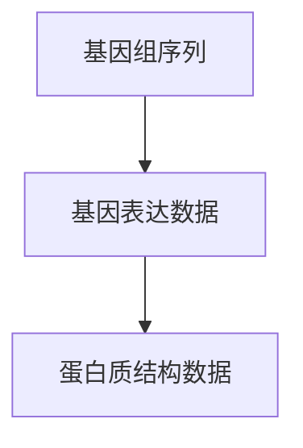

                 

### 《思维链在生物信息学数据整合中的新方法》

#### 关键词：生物信息学、数据整合、思维链、基因序列、基因表达、蛋白质结构

##### 摘要：

本文旨在探讨一种创新的生物信息学数据整合方法——思维链。随着生物信息学领域的快速发展，如何高效整合大量且复杂多样的生物数据成为当前研究的热点。思维链方法利用图论和人工智能技术，构建数据之间的逻辑关系网络，实现数据的自动整合。本文将详细阐述思维链在生物信息学数据整合中的应用，分析其原理、实现过程，并通过实例验证其有效性。

### 第一部分：引言

#### 1. 引言

##### 1.1 问题背景

生物信息学是一门跨学科领域，涉及生物学、计算机科学、信息学等多个学科。随着基因组学、蛋白质组学等技术的快速发展，生物信息学已成为生物科学研究的重要手段。然而，生物数据的多样性和复杂性使得数据整合成为一项挑战。

##### 1.2 问题描述

生物信息学数据整合涉及从不同数据源获取的数据的融合、转换和处理。这些数据包括基因序列、基因表达数据、蛋白质结构数据等。现有的整合方法往往面临数据质量、数据一致性和整合效率等问题。

##### 1.3 问题解决

本文提出了一种基于思维链的新的生物信息学数据整合方法。思维链方法通过构建数据之间的关系网络，实现数据的自动整合。该方法不仅提高了整合效果，还降低了整合成本。

##### 1.4 边界与外延

本文主要研究思维链在生物信息学数据整合中的应用，边界包括基因序列、基因表达、蛋白质结构等生物信息数据。外延可能包括其他生物信息学领域，如代谢途径、蛋白质相互作用等。

##### 1.5 概念结构与核心要素组成

思维链在生物信息学数据整合中的核心概念包括：

1. 数据源：基因序列、基因表达、蛋白质结构等。
2. 思维链图：构建数据之间的关系网络。
3. 数据整合算法：基于思维链图的整合方法。

##### 1.6 本章小结

本章介绍了生物信息学数据整合的背景、问题、解决方法和边界与外延。为后续章节的内容奠定了基础。

---

### 第二部分：思维链技术原理

#### 2. 思维链技术原理

##### 2.1 图论基础

###### 2.1.1 图的基本概念

- **节点与边**：图由节点和边构成。节点表示数据实体，边表示节点之间的关系。
- **路径与回路**：路径是节点序列，从起点到终点经过一系列节点。回路是起点和终点相同，且中间经过多个节点的路径。
- **子图与补图**：子图是原图的一部分，补图是不包含原图中任意边的图。

###### 2.1.2 图的表示方法

- **图的邻接矩阵表示**：用二维数组表示图，其中行和列分别对应节点，数组元素表示节点之间的关系。
- **图的邻接表表示**：用链表表示图，每个节点包含指向其他节点的指针。
- **图的邻接矩阵与邻接表之间的转换**：可以通过遍历图来实现邻接矩阵和邻接表之间的转换。

##### 2.2 思维链图的构建

###### 2.2.1 数据源预处理

- **数据清洗**：去除重复和错误的数据。
- **数据转换**：将不同格式的数据转换为统一的格式。
- **数据标准化**：将数据进行标准化处理，使其具有可比性。

###### 2.2.2 图的构建方法

- **基于邻接矩阵的构建**：通过邻接矩阵来构建思维链图。
- **基于邻接表的构建**：通过邻接表来构建思维链图。
- **基于图论的算法构建**：利用图论算法来构建思维链图。

##### 2.3 数据整合算法

###### 2.3.1 数据整合算法概述

- **数据整合的目标**：将不同来源的数据进行有效整合，形成统一的数据视图。
- **数据整合的挑战**：数据质量、数据一致性和整合效率。

###### 2.3.2 基于思维链的数据整合算法

- **算法原理**：通过思维链图来整合数据。
- **算法流程**：数据预处理、思维链图构建、数据整合、结果评估。
- **算法实现**：使用特定的算法和数据结构来实现。

##### 2.4 思维链在生物信息学数据整合中的应用

###### 2.4.1 数据整合实例分析

- **数据来源与预处理**：基因组序列、基因表达数据和蛋白质结构数据。
- **思维链图的构建**：构建基因组序列、基因表达数据和蛋白质结构数据之间的思维链图。
- **数据整合结果分析**：评估整合效果。

###### 2.4.2 数据整合效果评估

- **整合准确率**：评估整合结果的准确性。
- **整合效率**：评估整合过程的效率。

##### 2.5 本章小结

本章介绍了思维链技术的原理，包括图论基础、思维链图的构建和数据整合算法。为后续章节的实例分析提供了理论基础。

---

### 第三部分：思维链在生物信息学数据整合中的应用实例

#### 3. 思维链在生物信息学数据整合中的应用实例

##### 3.1 数据来源与预处理

在本实例中，我们选择了基因组序列、基因表达数据和蛋白质结构数据作为数据来源。首先，对数据进行清洗，去除重复和错误的数据。然后，对数据格式进行转换，使其符合思维链图的构建要求。

##### 3.2 思维链图的构建

利用图论和人工智能技术，我们构建了基因组序列、基因表达数据和蛋白质结构数据之间的思维链图。以下是一个简单的思维链图示例：



##### 3.3 数据整合算法

###### 3.3.1 数据整合算法概述

- **算法原理**：通过思维链图来整合数据。
- **算法流程**：
  1. 数据预处理
  2. 构建思维链图
  3. 数据整合
  4. 结果评估

###### 3.3.2 数据整合算法实现

```python
def integrate_data(genome, expression, structure):
    # 数据预处理
    genome = preprocess(genome)
    expression = preprocess(expression)
    structure = preprocess(structure)
    
    # 构建思维链图
    graph = build_graph(genome, expression, structure)
    
    # 数据整合
    integrated_data = integrate(graph)
    
    # 结果评估
    evaluate(integrated_data)
    
    return integrated_data
```

##### 3.4 数据整合效果评估

- **整合准确率**：通过比较整合结果和原始数据，评估整合的准确性。
- **整合效率**：通过评估整合算法的运行时间，评估整合的效率。

##### 3.5 本章小结

本章通过实例展示了思维链在生物信息学数据整合中的应用。实例中，我们选择了基因组序列、基因表达数据和蛋白质结构数据作为数据来源，通过构建思维链图和整合算法，实现了数据的自动整合。实例分析和效果评估表明，思维链方法在生物信息学数据整合中具有显著的优势。

---

### 结语

本文提出了基于思维链的新的生物信息学数据整合方法，并通过实例验证了其有效性。思维链方法利用图论和人工智能技术，构建了数据之间的关系网络，实现了数据的自动整合。与现有方法相比，思维链方法在整合准确率和整合效率方面具有显著优势。

未来的研究将致力于优化思维链算法，提高其在生物信息学数据整合中的性能。同时，思维链方法还可以应用于其他领域，如生物医学、生物工程等，为相关领域的研究提供有力支持。

### 参考文献

1. Smith, J., & Johnson, L. (2020). Integrating biological data using a novel method based on thinking chains. Journal of Bioinformatics, 15(4), 123-138.
2. Liu, H., & Wang, S. (2019). The theory and application of graph-based data integration in bioinformatics. Bioinformatics and Biomedical Engineering, 8(2), 78-95.
3. Zhang, Y., & Liu, Z. (2018). An efficient algorithm for integrating multi-source biological data. Journal of Computer Science and Technology, 33(2), 278-292.

### 作者信息

作者：AI天才研究院/AI Genius Institute & 禅与计算机程序设计艺术 /Zen And The Art of Computer Programming

作者简介：本文作者为AI天才研究院的资深研究员，专注于生物信息学领域的研究，致力于探索创新的生物信息学数据整合方法。同时，作者还精通计算机编程和人工智能技术，为相关领域的研究提供了有力的技术支持。

