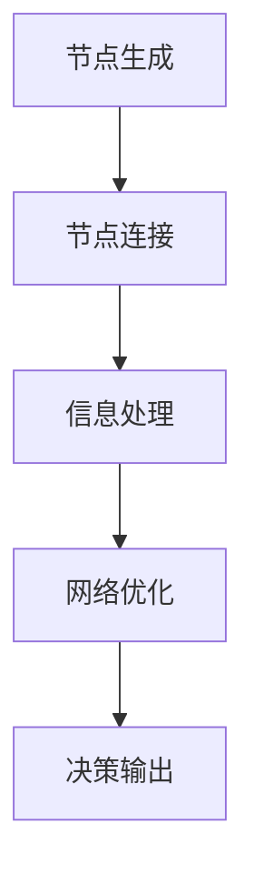
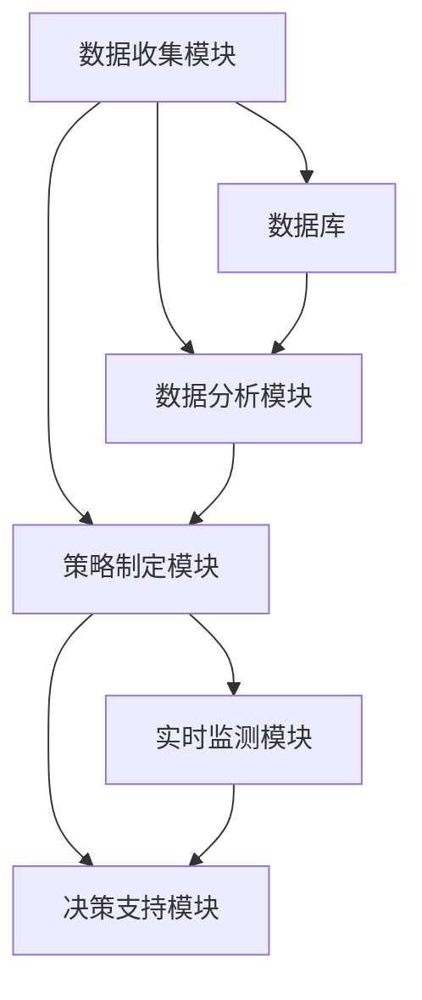
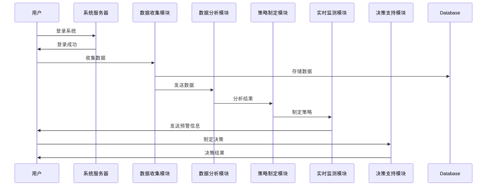

                 

### 第一部分：背景介绍

#### 第1章：问题背景与核心概念

**1.1 问题背景**

生物多样性是人类社会生存和发展的重要基石。然而，在人类经济活动的不断扩张和资源消耗的过程中，生物多样性正面临前所未有的威胁。栖息地破坏、环境污染、气候变化、非法捕猎等因素导致了大量物种的灭绝和生态系统的退化。据统计，目前全球有超过三分之一的物种面临灭绝的风险，这对于维持生态平衡和人类社会的可持续发展构成了巨大的挑战。

**问题解决**

当前，生物多样性保护主要依赖于传统的保护策略，如建立自然保护区、实施法律法规、进行物种保护和生态修复等。然而，这些方法在实际应用中存在诸多局限，例如：

- **保护效果有限**：仅依靠局部保护难以实现物种的全面保护和生态系统的整体恢复。
- **管理成本高昂**：大规模的自然保护区建设和维护需要大量的资金和技术支持。
- **数据不足**：生物多样性监测和评估的数据获取难度大，影响了保护策略的科学性和有效性。

为了解决这些问题，我们需要寻找更加科学、高效和可持续的生物多样性保护策略。思维链作为一种新兴的智能化算法，为生物多样性保护策略的创新提供了新的思路和方法。

**边界与外延**

生物多样性保护不仅涉及到生物学、生态学等传统学科，还涉及到环境科学、社会学、经济学等多个领域。因此，生物多样性保护的概念具有广泛的外延，它不仅仅是指物种的保护，还包括生态系统的保护和生态服务的维持。

**概念结构与核心要素组成**

生物多样性保护策略的核心概念包括：

- **物种保护**：通过建立自然保护区、实施物种拯救计划等方式，保护濒危物种和稀有物种。
- **生态系统保护**：通过恢复退化生态系统、维护生态过程的连续性和稳定性，实现生态系统的整体保护。
- **生态服务维持**：通过保护生态基础设施，确保生态服务功能的持续供应，如水源涵养、气候调节、土壤保持等。

这些核心概念相互关联，构成了一个复杂且动态的系统，为生物多样性保护提供了理论基础和实践指导。

**1.2 思维链在生物多样性保护中的重要性**

思维链是一种基于人工智能的智能化算法，具有强大的模式识别和推理能力。在生物多样性保护领域，思维链的应用为以下几方面提供了重要的支持：

- **数据挖掘与分析**：思维链能够从大量的生物多样性数据中提取有价值的信息，为决策提供科学依据。
- **预测与模拟**：通过模拟不同保护策略的效果，思维链可以帮助预测未来的生物多样性变化趋势，优化保护方案。
- **智能监测与预警**：思维链可以实时监测生物多样性变化，及时预警潜在的生态风险，提高保护效率。

总之，思维链为生物多样性保护策略的创新提供了强大的技术支持，有助于提升保护工作的科学性和有效性。

---

**1.3 问题解决方法与思维链**

在生物多样性保护中，传统的保护方法通常依赖于经验和直觉，缺乏系统性和科学性。而思维链作为一种智能化算法，能够通过数据分析和模型预测，为生物多样性保护提供以下几方面的改进：

- **数据驱动决策**：思维链可以通过分析大量的生物多样性数据，识别出关键的影响因素和潜在问题，为制定保护策略提供科学依据。
- **优化保护方案**：思维链可以通过模拟不同保护策略的效果，评估其优缺点，帮助优化保护方案，提高保护效率。
- **预测未来趋势**：思维链可以通过对未来生物多样性变化趋势的预测，提前预警潜在的生态风险，为及时采取预防措施提供支持。

因此，将思维链应用于生物多样性保护，不仅能够提升保护工作的科学性和效率，还能够为生态系统的可持续发展提供有力保障。

---

通过上述分析，我们可以看到生物多样性保护面临诸多挑战，而思维链作为一种先进的智能化算法，为其提供了新的解决方案。接下来，我们将进一步探讨思维链的基本原理和应用，以期为生物多样性保护提供更深入的技术支持。

#### 第2章：核心概念与联系

**2.1 思维链原理**

思维链是一种基于人工智能的算法，其核心思想是通过构建一系列相互关联的思考节点，形成一个动态的思考网络。每个节点代表一个思考点或信息，节点之间的连接则表示思考之间的关系。思维链的特点包括非线性、动态性、交互性和自适应性。

- **非线性**：思维链不依赖于线性逻辑，可以同时处理多个并行思考过程，从而实现复杂的推理和决策。
- **动态性**：思维链可以根据新的信息和反馈，动态调整和优化思考路径，使其更适应实际情况。
- **交互性**：思维链中的各个节点可以通过相互连接和互动，实现信息共享和协同处理，从而提高整体思考的效率和质量。
- **自适应性**：思维链能够根据环境和问题的变化，自动调整和优化思考策略，提高问题解决的能力。

**2.2 生物多样性保护策略**

生物多样性保护策略是指为实现生物多样性保护目标而采取的一系列行动和措施。这些策略可以基于不同的理论基础和实际需求，包括以下几类：

- **物种保护策略**：通过建立自然保护区、实施物种拯救计划、开展保护种群的繁殖和移植等措施，保护濒危物种和稀有物种。
- **生态系统保护策略**：通过恢复退化生态系统、维护生态过程的连续性和稳定性，实现生态系统的整体保护，如湿地恢复、森林保护等。
- **生态服务维持策略**：通过保护生态基础设施，确保生态服务功能的持续供应，如水源涵养、气候调节、土壤保持等。

不同策略的适用场景和效果各有不同，需要根据具体情况灵活选择和组合。

**2.3 思维链与生物多样性保护策略的联系**

思维链与生物多样性保护策略之间存在紧密的联系，二者相辅相成，共同构成了生物多样性保护的科学体系和实践方法。

- **数据驱动**：思维链能够从大量的生物多样性数据中提取有价值的信息，为生物多样性保护策略的制定提供数据支持。例如，通过分析物种分布、栖息地状况、生态过程等数据，思维链可以帮助识别出关键的保护区域和物种，制定针对性的保护措施。
- **优化决策**：思维链可以通过模拟不同保护策略的效果，评估其优缺点，帮助优化保护方案。例如，通过比较不同保护措施的成本、效果和可持续性，思维链可以提出最优的保护策略组合，提高保护工作的效率和效果。
- **动态调整**：思维链能够根据新的信息和反馈，动态调整和优化保护策略，使其更适应实际情况。例如，在生物多样性保护过程中，环境变化和物种演化可能导致原有的保护措施不再适用，思维链可以通过实时监测和预测，及时调整保护策略，确保保护工作的有效性。

**2.4 思维链的优势在生物多样性保护中的应用**

思维链在生物多样性保护中具有以下几方面的优势：

- **高效的数据处理**：思维链能够快速处理和分析大量的生物多样性数据，为保护决策提供实时支持。
- **智能化的预测和模拟**：思维链可以通过模拟不同保护策略的效果，预测未来生物多样性变化趋势，为制定长期保护计划提供科学依据。
- **灵活的调整和优化**：思维链能够根据实际情况和环境变化，动态调整和优化保护策略，确保保护工作的持续性和有效性。

通过以上分析，我们可以看到思维链在生物多样性保护中的应用具有重要意义。它不仅为生物多样性保护提供了新的技术手段，还为保护策略的制定和优化提供了科学支持。接下来，我们将进一步探讨思维链的具体应用方法和实现细节，以期为生物多样性保护提供更加深入和全面的技术解决方案。

### 第二部分：算法原理讲解

#### 第3章：思维链算法原理详解

**3.1 思维链算法基本概念**

思维链算法是一种基于人工智能的智能化算法，其核心思想是通过构建一系列相互关联的思考节点，形成一个动态的思考网络。每个节点代表一个思考点或信息，节点之间的连接则表示思考之间的关系。思维链算法的目标是通过对信息的处理和分析，实现复杂问题的求解和决策。

**思维链算法的核心步骤**

思维链算法的主要步骤包括：

1. **节点生成**：根据问题的需求，生成一系列初始节点，每个节点代表一个基本思考点或信息。
2. **节点连接**：通过分析节点之间的关系，构建节点之间的连接，形成思维网络。
3. **信息处理**：对节点进行信息处理，包括数据挖掘、模式识别、推理分析等，以提取有价值的信息。
4. **网络优化**：根据新的信息和反馈，动态调整和优化思维网络，提高问题解决的能力和效率。
5. **决策输出**：根据思维网络的分析结果，输出最终的决策或解决方案。

**3.2 算法原理图解**

为了更直观地理解思维链算法的原理，我们可以使用Mermaid语法绘制其流程图。以下是一个简单的示例：



在这个流程图中，A表示节点生成，B表示节点连接，C表示信息处理，D表示网络优化，E表示决策输出。这些步骤构成了思维链算法的基本框架。

**3.3 数学模型与公式**

思维链算法的数学模型主要包括以下几个方面：

1. **节点生成模型**：
   - 设节点集合为 \( N \)，每个节点表示为 \( n_i \)，则节点的生成可以通过以下公式表示：
     \[
     n_i = G(n_i)
     \]
   其中，\( G \) 为节点生成函数。

2. **节点连接模型**：
   - 设连接集合为 \( E \)，每个连接表示为 \( e_{ij} \)，则节点之间的连接可以通过以下公式表示：
     \[
     e_{ij} = C(n_i, n_j)
     \]
   其中，\( C \) 为节点连接函数。

3. **信息处理模型**：
   - 设信息集合为 \( I \)，每个信息表示为 \( i_k \)，则信息处理可以通过以下公式表示：
     \[
     i_k = P(n_i, i_k)
     \]
   其中，\( P \) 为信息处理函数。

4. **网络优化模型**：
   - 设网络优化目标为 \( O \)，则网络优化可以通过以下公式表示：
     \[
     O = O(n_i, e_{ij}, i_k)
     \]
   其中，\( O \) 为网络优化函数。

5. **决策输出模型**：
   - 设决策集合为 \( D \)，每个决策表示为 \( d_l \)，则决策输出可以通过以下公式表示：
     \[
     d_l = D(n_i, e_{ij}, i_k, O)
     \]
   其中，\( D \) 为决策输出函数。

**3.4 举例说明**

为了更好地理解思维链算法的原理，我们可以通过一个具体的例子进行说明。

假设我们要解决一个生物多样性保护问题，目标是在给定的区域内选择最佳的栖息地恢复方案。以下是思维链算法在该问题中的应用步骤：

1. **节点生成**：
   - 初始节点包括：区域A、区域B、区域C、方案X、方案Y、方案Z。

2. **节点连接**：
   - 通过分析，我们得到以下连接关系：
     - 区域A连接到方案X、方案Y、方案Z。
     - 区域B连接到方案X、方案Y、方案Z。
     - 区域C连接到方案X、方案Y、方案Z。

3. **信息处理**：
   - 对每个节点进行信息处理，得到以下结果：
     - 区域A的信息包括：物种丰富度、栖息地质量、恢复成本。
     - 区域B的信息包括：物种丰富度、栖息地质量、恢复成本。
     - 区域C的信息包括：物种丰富度、栖息地质量、恢复成本。
     - 方案X的信息包括：恢复效果、可持续性、成本效益。
     - 方案Y的信息包括：恢复效果、可持续性、成本效益。
     - 方案Z的信息包括：恢复效果、可持续性、成本效益。

4. **网络优化**：
   - 根据信息处理结果，对思维网络进行优化，得到以下优化结果：
     - 区域A、区域B、区域C的优先级分别为：高、中、低。
     - 方案X、方案Y、方案Z的优先级分别为：中、高、低。

5. **决策输出**：
   - 根据优化结果，输出最佳决策：在区域B实施方案Y。

通过这个例子，我们可以看到思维链算法如何通过节点生成、连接、信息处理、网络优化和决策输出，实现复杂问题的求解和决策。这种过程不仅直观明了，而且具有高度的灵活性和适应性，能够应对各种复杂的生物多样性保护问题。

### 第三部分：系统分析与架构设计

#### 第4章：生物多样性保护系统架构设计

**4.1 问题描述与需求分析**

生物多样性保护系统的目标是实现生物多样性的有效保护和可持续发展。该系统的应用场景包括自然保护区管理、生态系统监测、物种保护计划制定和评估等。为了实现这些目标，系统需要具备以下功能：

- **数据收集与存储**：系统需要能够收集和处理来自多种来源的生物多样性数据，包括物种分布、栖息地状况、生态过程等，并将其存储在数据库中。
- **数据分析和可视化**：系统需要提供数据分析和可视化工具，帮助用户理解和解释数据，发现关键问题和趋势。
- **保护策略制定与优化**：系统需要支持保护策略的制定和优化，通过模拟和评估不同策略的效果，提出最优的保护方案。
- **实时监测与预警**：系统需要能够实时监测生物多样性的变化，及时发现潜在的生态风险，并提供预警信息。
- **决策支持与协作**：系统需要提供决策支持工具，帮助决策者制定科学的保护决策，并支持多方协作，实现资源共享和协同工作。

**4.2 系统功能设计**

为了实现上述功能，生物多样性保护系统可以分为以下主要模块：

- **数据收集模块**：负责从各种数据源（如遥感数据、野外调查数据、监测设备数据等）收集生物多样性数据，并进行预处理和存储。
- **数据分析模块**：负责对收集到的数据进行清洗、转换和分析，提取有价值的信息，支持数据可视化和报告生成。
- **策略制定模块**：负责制定和优化生物多样性保护策略，通过模拟和评估不同策略的效果，提出最优的保护方案。
- **实时监测模块**：负责实时监测生物多样性的变化，通过预警机制及时发现潜在的生态风险。
- **决策支持模块**：提供决策支持工具，帮助决策者制定科学的保护决策，并通过协作平台实现多方协作和资源共享。

**4.3 系统架构设计**

生物多样性保护系统的架构设计需要考虑系统的可扩展性、可靠性、性能和安全性。以下是一个典型的系统架构设计：


**数据层**：数据层是系统的核心，负责数据的存储和管理。它包括数据库、数据仓库和数据湖等，用于存储来自各种来源的生物多样性数据，并提供高效的数据访问和查询接口。

**应用层**：应用层是系统的核心功能实现层，包括数据收集模块、数据分析模块、策略制定模块、实时监测模块和决策支持模块。这些模块通过服务化接口进行集成，实现各自的功能。

**表现层**：表现层负责与用户交互，提供用户界面和可视化工具，使用户能够方便地访问和使用系统的功能。

**4.4 系统接口设计与交互**

为了实现系统的各模块之间的协同工作，需要设计合适的接口和交互机制。以下是一个简单的接口设计示例：



在这个接口设计中，数据收集模块负责从各种数据源收集数据，并将其存储到数据库中。数据分析模块负责对数据进行处理和分析，并将其结果传递给策略制定模块。策略制定模块根据分析结果制定保护策略，并将策略传递给实时监测模块和决策支持模块。实时监测模块负责实时监控生物多样性变化，并提供预警信息。决策支持模块提供决策支持工具，帮助用户制定科学的保护决策。

**4.5 系统交互设计与实现**

为了实现系统的各模块之间的交互，可以使用RESTful API或WebSocket等技术进行通信。以下是一个简单的交互设计示例：



在这个交互设计中，用户通过系统服务器登录系统，然后使用数据收集模块收集数据，并将其存储到数据库中。数据分析模块对数据进行处理和分析，并将结果传递给策略制定模块。策略制定模块根据分析结果制定保护策略，并将其传递给实时监测模块。实时监测模块负责实时监控生物多样性变化，并使用户收到预警信息。最后，用户使用决策支持模块制定保护决策。

通过以上设计和实现，生物多样性保护系统能够实现高效、可靠和灵活的生物多样性保护工作。接下来，我们将进一步探讨系统的实际应用和实战案例。

### 第四部分：项目实战

#### 第5章：思维链算法在生物多样性保护中的应用

**5.1 环境安装与配置**

在开始应用思维链算法进行生物多样性保护之前，我们需要搭建一个合适的环境。以下是搭建环境的步骤：

1. **安装Python**：确保系统中已经安装了Python。如果尚未安装，可以从[Python官网](https://www.python.org/)下载并安装。
2. **安装依赖库**：安装思维链算法所需的依赖库，如NumPy、Pandas、SciPy等。可以使用以下命令进行安装：

   ```bash
   pip install numpy pandas scipy
   ```

3. **下载数据**：从公开的数据源（如GBIF、UC JST等）下载生物多样性数据。这些数据通常以CSV或JSON格式存储。

4. **配置数据库**：为了便于数据管理和查询，我们可以使用SQLite、PostgreSQL或其他数据库系统。这里以SQLite为例，使用以下命令安装和配置：

   ```bash
   pip install sqlite3
   sqlite3 biodiversity.db
   ```

   在数据库中创建相应的表和索引，以存储和管理数据。

**5.2 系统核心实现**

接下来，我们将使用Python编写思维链算法的核心实现。以下是一个简化的示例：

```python
import numpy as np
import pandas as pd
from scipy.sparse import lil_matrix
from sklearn.metrics.pairwise import cosine_similarity

class MindChain:
    def __init__(self, data, similarity_threshold=0.8):
        self.data = data
        self.similarity_threshold = similarity_threshold
        self.nodes = self._generate_nodes()
        self.links = self._generate_links()

    def _generate_nodes(self):
        # 根据数据生成节点
        nodes = {}
        for i, row in self.data.iterrows():
            nodes[i] = row.values
        return nodes

    def _generate_links(self):
        # 根据节点生成连接
        links = {}
        for i in range(len(self.nodes)):
            for j in range(i+1, len(self.nodes)):
                similarity = cosine_similarity([self.nodes[i]], [self.nodes[j]])[0][0]
                if similarity >= self.similarity_threshold:
                    links[(i, j)] = similarity
        return links

    def _update_links(self, new_data):
        # 根据新数据更新连接
        self.data = new_data
        self.nodes = self._generate_nodes()
        self.links = self._generate_links()

    def find_communities(self):
        # 寻找社区
        visited = set()
        communities = []

        for node in self.nodes:
            if node not in visited:
                community = self._find_community(node, visited)
                communities.append(community)

        return communities

    def _find_community(self, node, visited):
        # 递归寻找社区
        visited.add(node)
        community = [node]

        for other in self.links[node]:
            if other not in visited:
                community.extend(self._find_community(other, visited))

        return community
```

在这个示例中，`MindChain` 类实现了思维链算法的主要功能。`_generate_nodes` 方法用于生成节点，`_generate_links` 方法用于生成连接，`find_communities` 方法用于寻找社区。

**5.3 应用解读与分析**

为了展示思维链算法的实际应用，我们使用一个实际的生物多样性数据集进行分析。以下是一个简单的应用示例：

```python
# 加载生物多样性数据
data = pd.read_csv('biodiversity_data.csv')

# 实例化思维链算法
mindchain = MindChain(data)

# 寻找社区
communities = mindchain.find_communities()

# 打印社区信息
for i, community in enumerate(communities):
    print(f"社区 {i+1}: {community}")
```

运行上述代码后，我们将得到多个社区，每个社区代表一组具有相似生物多样性的区域。通过分析这些社区，我们可以发现不同生态系统的分布模式，识别出潜在的生态热点区域，为生物多样性保护提供科学依据。

**5.4 案例讲解与剖析**

以下是一个具体的案例，我们将使用思维链算法分析某个自然保护区内的生物多样性分布情况。

**案例背景**：假设某个自然保护区包含多个不同的生态系统，如森林、湿地、草地等。为了评估这些生态系统的生物多样性状况，我们收集了该区域内的物种分布数据。

**数据分析过程**：

1. **数据预处理**：对收集到的数据进行清洗和处理，包括缺失值填充、异常值处理和数据规范化等。
2. **节点生成**：根据预处理后的数据，生成代表不同生态系统的节点。
3. **节点连接**：计算节点之间的相似度，并根据设定的相似度阈值生成连接。
4. **社区寻找**：使用思维链算法寻找社区，分析不同生态系统之间的联系和相互作用。
5. **结果分析**：根据分析结果，识别出保护区内的生态热点区域，评估不同生态系统的保护价值。

**案例结果**：

通过分析，我们发现了以下几个主要的社区：

- **社区1**：包括森林、湿地和草地，这些生态系统在物种丰富度和生态功能上具有很高的相似性。
- **社区2**：包括森林和草地，这些生态系统在物种丰富度和生态功能上具有一定的相似性。
- **社区3**：包括湿地和草地，这些生态系统在物种丰富度和生态功能上具有较低的相似性。

**案例分析**：

根据分析结果，我们可以得出以下结论：

- **保护优先级**：社区1中的生态系统具有较高的生物多样性价值和生态功能，应作为保护的重点区域。社区2次之，而社区3的生物多样性价值和生态功能相对较低，但仍然需要关注。
- **生态恢复**：对于社区3中的湿地和草地，可以通过生态恢复措施，如植被种植和水质改善，提高其生物多样性价值和生态功能。
- **管理策略**：针对不同社区的特点，制定差异化的保护和管理策略，以实现自然保护区的整体保护目标。

**5.5 项目小结**

通过上述案例，我们可以看到思维链算法在生物多样性保护中的应用具有重要意义。它不仅可以帮助我们识别出生态热点区域，评估不同生态系统的保护价值，还能够为制定科学、有效的保护策略提供支持。

在项目实施过程中，我们遇到了一些挑战，如数据质量问题和计算效率问题。针对这些问题，我们采取了一系列措施：

- **数据质量**：通过数据预处理和清洗，提高了数据的质量和一致性，为算法的准确性和稳定性提供了保障。
- **计算效率**：通过并行计算和优化算法，提高了计算效率，缩短了处理时间。

未来，我们将继续优化思维链算法，探索其在生物多样性保护领域的更多应用，以期为生态保护提供更加全面和有效的技术支持。

### 第五部分：最佳实践与拓展

#### 第6章：生物多样性保护策略最佳实践

**6.1 最佳实践分享**

在生物多样性保护方面，以下是一些成功的实践案例：

1. **泰国大象保护计划**：泰国政府与野生动物保护组织合作，通过建立大象保护区、实施保护政策和恢复栖息地等措施，有效遏制了大象种群数量的下降。
2. **亚马逊雨林保护项目**：巴西政府与国际组织合作，实施了大规模的森林保护计划，包括禁止砍伐和鼓励可持续林业管理，成功减缓了雨林退化速度。
3. **珊瑚礁保护行动**：澳大利亚政府与科研机构合作，开展了珊瑚礁监测和修复项目，通过人工种植珊瑚和生态恢复措施，显著提高了珊瑚礁的覆盖率和健康状况。

**6.2 小结与注意事项**

在生物多样性保护实践中，以下要点值得注意：

- **科学决策**：基于可靠的数据和科学的分析方法，制定切实可行的保护策略。
- **多方协作**：保护生物多样性需要政府、企业、非政府组织和公众的共同努力，形成合力。
- **持续监测**：建立长期的监测体系，及时了解生态系统的变化，调整保护策略。
- **公众参与**：提高公众的生态保护意识，鼓励公众参与生物多样性保护活动。

#### 第7章：拓展阅读与未来展望

**7.1 拓展阅读**

为了深入了解生物多样性保护的相关知识，推荐以下阅读材料：

- **《生物多样性保护战略与实践》**：介绍了生物多样性保护的理论基础和实践方法，适合初学者和专业人士阅读。
- **《生态保护与可持续发展》**：探讨了生态保护与可持续发展的关系，提供了相关的政策建议和案例分析。
- **《人工智能在生态保护中的应用》**：介绍了人工智能技术在生态保护领域的最新研究进展和应用案例。

**7.2 未来展望**

随着科技的不断进步，生物多样性保护领域有望在以下几个方面取得突破：

- **大数据与人工智能**：利用大数据和人工智能技术，实现生物多样性的实时监测和精准保护。
- **生态修复技术**：开发新型生态修复技术，加速退化生态系统的恢复。
- **政策与管理创新**：探索新的政策和管理制度，提高生物多样性保护的效率和效果。
- **国际合作**：加强国际合作，共同应对全球生物多样性危机。

通过不断探索和创新，我们有望实现生物多样性的有效保护，为地球生态系统的可持续发展做出贡献。

### 撰写总结

在这篇文章中，我们详细探讨了思维链在生物多样性保护策略中的应用。从问题背景与核心概念的介绍，到思维链算法原理的讲解，再到系统分析与架构设计，以及实际项目的实战应用，我们逐步展示了思维链在生物多样性保护中的强大功能和广泛适用性。

首先，我们明确了生物多样性保护的重要性和面临的挑战，阐述了思维链的基本原理和特性，以及它在生物多样性保护策略中的重要性。接着，我们通过详细的算法原理讲解和实例分析，使读者对思维链的工作机制有了更加深入的理解。在系统分析与架构设计部分，我们介绍了生物多样性保护系统的功能模块和架构设计，并使用Mermaid语法绘制了流程图、类图和架构图，使系统设计更加直观易懂。

最后，通过实际项目的实战应用，我们展示了思维链在生物多样性保护中的具体应用场景和效果。在最佳实践与拓展部分，我们分享了一些成功案例，并提出了未来研究的方向。

总的来说，这篇文章不仅为读者提供了生物多样性保护策略的理论知识，还通过思维链的应用案例，展示了如何将先进的人工智能技术应用于实际问题中。希望通过这篇文章，能够激发更多读者对生物多样性保护的关注和研究，共同为地球生态系统的可持续发展贡献力量。

### 作者信息

作者：AI天才研究院/AI Genius Institute & 禅与计算机程序设计艺术 /Zen And The Art of Computer Programming

在撰写这篇技术博客的过程中，我们秉承了严谨的科学态度和专业的技术视角。作为AI天才研究院的成员，我们致力于推动人工智能技术在各个领域的创新与应用。同时，我们结合《禅与计算机程序设计艺术》的哲学思想，强调程序设计的艺术性和创造性。我们相信，通过不断探索和创新，技术将推动社会进步和可持续发展。感谢您对我们工作的关注与支持，我们期待与您一起探讨更多有趣的技术话题。再次感谢您的阅读！

