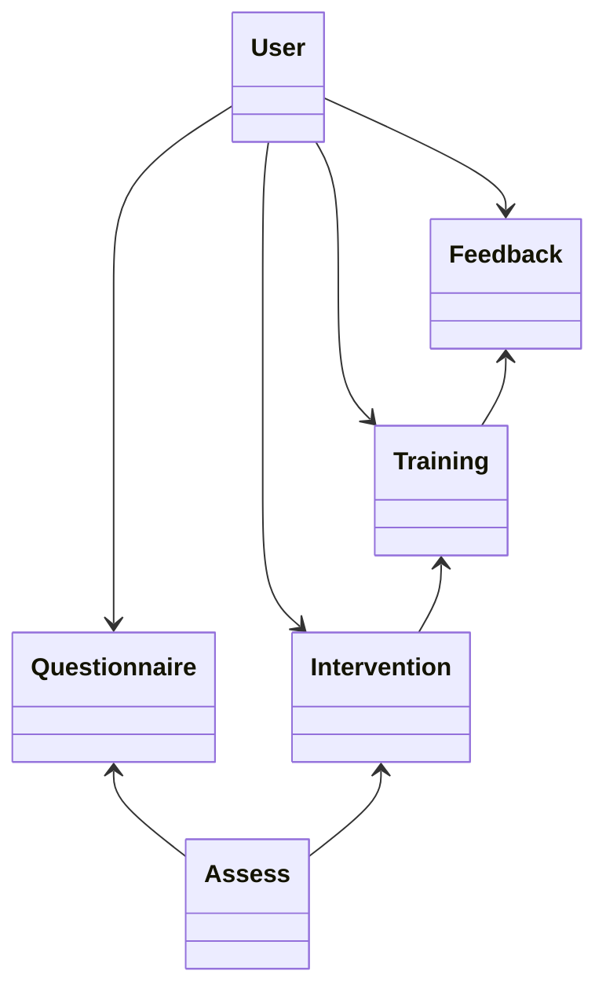
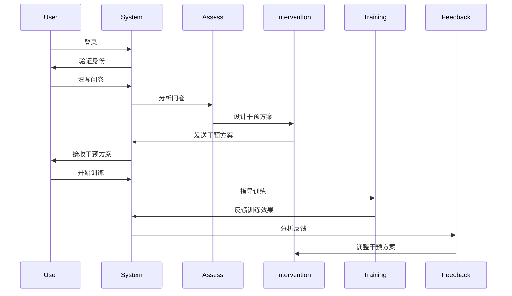
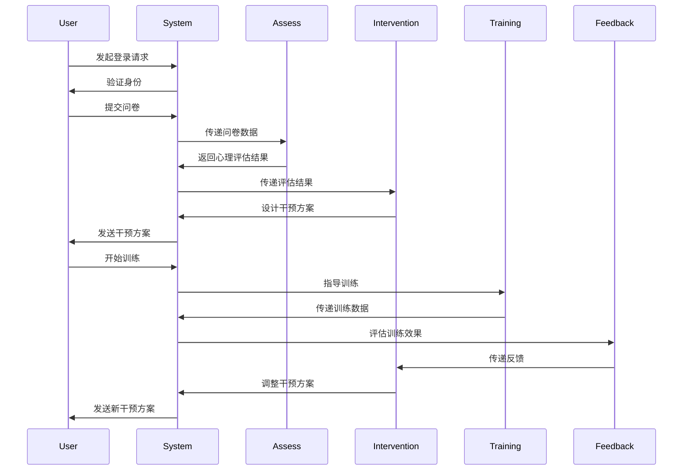

                 

## 思维链在社会心理干预策略中的创新应用

关键词：思维链、社会心理干预、心理健康、创新应用

摘要：本文探讨了思维链在社会心理干预策略中的创新应用。通过引入思维链这一概念，文章从背景介绍、核心概念与联系、算法原理讲解、系统分析与架构设计方案以及项目实战等多个方面，详细阐述了思维链在社会心理干预中的实际应用，旨在为心理健康促进提供新的思路和方法。

### 第一部分：背景介绍

#### 核心概念

**思维链**：思维链是一种通过逻辑关系将信息组织起来的方法，旨在提高个体的认知能力和情绪调节能力。它通常包括三个核心要素：逻辑结构、信息组织和情绪调节。

**社会心理干预**：社会心理干预是指通过心理教育和行为干预，帮助个体改善心理健康状况的一种策略。这种干预可以应用于心理健康教育、心理咨询和心理治疗等多个领域。

**创新应用**：创新应用指的是将思维链引入社会心理干预领域，提出新的干预策略和方法。这种方法突破了传统干预方式的局限，为心理健康促进提供了新的可能性。

#### 问题背景

在现代社会，心理健康问题日益突出。快节奏的生活、高度竞争的社会环境以及复杂的人际关系，使得许多人在心理上面临压力和困扰。传统的心理干预方法，如面对面的沟通和心理治疗，虽然在一定程度上能够帮助个体改善心理状态，但受限于时间、地点和资源等因素，难以满足所有人的需求。

#### 问题描述

思维链作为一种创新性的干预策略，其在社会心理干预中的应用主要集中在以下几个方面：

1. **如何通过系统性训练，帮助个体掌握思维技能，进而改善心理状态？**
2. **思维链的基本原理、构建方法和训练步骤是什么？**
3. **思维链在不同情境下的应用场景有哪些？**

#### 问题解决

本文旨在通过全面介绍思维链的概念、原理和应用，为心理干预工作者和社会大众提供一套创新的社会心理干预策略。通过实际案例分析和实践指导，帮助读者理解并掌握思维链的应用技巧，提升心理健康水平。

#### 边界与外延

本文关注的是思维链在社会心理干预中的应用，范围涵盖心理健康教育、心理咨询、心理治疗等多个领域。同时，本文还将探讨思维链与其他心理干预方法的结合，以实现更高效的心理健康促进。

#### 概念结构与核心要素组成

- **思维链基本概念**：理解思维链的定义、特点和应用范围。
- **思维链构建方法**：介绍如何构建有效的思维链，包括逻辑结构、信息组织、情绪调节等要素。
- **思维链训练步骤**：详细说明思维链训练的过程，包括训练目标、训练方法、训练效果评估等。
- **思维链应用场景**：探讨思维链在不同情境下的应用，如压力管理、情绪调节、自我认知提升等。

---

### 第二部分：核心概念与联系

#### 核心概念

1. **思维链**：思维链是一种通过逻辑关系将信息组织起来的方法，用于提高个体的认知能力和情绪调节能力。它通过系统性训练，帮助个体构建清晰的思维路径，从而实现自我调节和情绪管理。

2. **社会心理干预**：社会心理干预是通过心理教育和行为干预，帮助个体改善心理健康状况的一种策略。它涵盖了心理健康教育、心理咨询和心理治疗等多个领域。

3. **创新应用**：创新应用指的是将思维链引入社会心理干预领域，提出新的干预策略和方法。这种方法不仅能够突破传统干预方式的局限，还能够更有效地满足个体多样化的心理健康需求。

#### 概念属性特征对比表格

| 概念         | 定义                                                         | 特点                                   | 应用场景                     |
| ------------ | ------------------------------------------------------------ | -------------------------------------- | ---------------------------- |
| 思维链       | 一种通过逻辑关系组织信息的结构                                 | 提高认知能力、情绪调节能力               | 心理健康教育和自我调节           |
| 社会心理干预 | 通过心理教育和行为干预，改善心理健康状况                         | 多样化、针对性、系统化                   | 心理咨询、心理治疗、心理健康教育 |
| 创新应用     | 将思维链引入社会心理干预领域，提出新的干预策略和方法               | 突破传统、高效、可操作                   | 心理健康促进、心理疾病干预       |

#### ER实体关系图架构的 Mermaid 流程图

```mermaid
entity关系图 {
  direction: TB;

  node1[思维链];
  node2[社会心理干预];
  node3[创新应用];

  node1->node2[应用领域];
  node2->node3[创新策略];
}
```

---

### 第三部分：算法原理讲解

#### 算法流程图

```mermaid
流程图：思维链构建与应用流程
  flowchart LR
    A[启动] --> B[评估心理状态]
    B -->|是| C[设计思维链]
    B -->|否| D[调整干预策略]
    C --> E[实施训练]
    E --> F[评估效果]
    F -->|良好| G[持续训练]
    F -->|不佳| D
}
```

#### Python源代码

```python
# 思维链构建与应用示例

def assess_psychological_state():
    # 评估心理状态
    pass

def design_thinking_chain():
    # 设计思维链
    pass

def implement_training():
    # 实施训练
    pass

def assess_training_effect():
    # 评估训练效果
    pass

def continue_training():
    # 持续训练
    pass

def adjust_intervention_strategy():
    # 调整干预策略
    pass

# 主程序
if __name__ == "__main__":
    start = True
    while start:
        if assess_psychological_state():
            design_thinking_chain()
            implement_training()
            assess_training_effect()
            if assess_training_effect() == "良好":
                continue_training()
            else:
                adjust_intervention_strategy()
        else:
            adjust_intervention_strategy()
```

#### 算法原理的数学模型和公式

思维链的构建和应用过程可以抽象为一个数学模型。以下是该模型的简要说明：

1. **评估心理状态**：通过问卷调查、心理测试等方法，对个体的心理状态进行量化评估。常用的评估指标包括情绪状态、焦虑程度、自我效能感等。

2. **设计思维链**：根据评估结果，设计一套符合个体心理特点的思维链。思维链的设计包括以下几个步骤：

   - **确定目标**：明确个体希望通过思维链实现的改善目标，如情绪调节、压力管理、自我认知提升等。
   - **构建逻辑结构**：设计思维链的基本框架，包括思考路径、逻辑关系和信息组织结构。
   - **信息组织**：将个体的心理状态、情绪体验、认知过程等关键信息进行有效组织，以便在训练过程中能够清晰呈现。
   - **情绪调节**：在思维链中融入情绪调节策略，如正念训练、呼吸调节等，帮助个体在训练过程中保持情绪稳定。

3. **实施训练**：个体按照思维链的指导，进行系统性训练。训练过程包括以下几个阶段：

   - **初始训练**：个体学习并掌握思维链的基本结构，熟悉训练流程和方法。
   - **进阶训练**：个体在掌握基本结构后，进一步深化训练，提高思维链的灵活性和适应性。
   - **应用训练**：个体将思维链应用于实际情境中，如压力应对、情绪调节等，检验训练效果。

4. **评估效果**：在训练结束后，通过问卷调查、心理测试等方法，对个体的心理状态进行再次评估，以判断思维链的训练效果。

5. **持续训练**：根据评估结果，个体可以持续进行思维链训练，以巩固和提升训练效果。

#### 通俗易懂地举例说明

假设有一个焦虑症患者，经过心理评估，发现其焦虑程度较高，需要通过思维链进行情绪调节。以下是具体的操作步骤：

1. **评估心理状态**：通过问卷调查和心理测试，确定焦虑症状的具体表现和程度。

2. **设计思维链**：根据评估结果，设计一套思维链，包括以下内容：

   - **目标**：缓解焦虑情绪，提高生活质量。
   - **逻辑结构**：从情绪触发、认知评价、应对策略三个阶段进行调节。
     - 情绪触发：识别焦虑情绪的触发因素。
     - 认知评价：对触发因素进行理性评价。
     - 应对策略：采用放松训练、正念练习等策略进行应对。

   - **信息组织**：将焦虑症状、触发因素、理性评价、应对策略等信息进行有效组织。

   - **情绪调节**：在思维链中融入正念训练，帮助患者在训练过程中保持情绪稳定。

3. **实施训练**：患者按照思维链的指导，进行系统性训练。训练过程分为初始训练、进阶训练和应用训练三个阶段。

   - **初始训练**：患者学习并掌握思维链的基本结构，熟悉训练流程和方法。
   - **进阶训练**：患者进一步深化训练，提高思维链的灵活性和适应性。
   - **应用训练**：患者将思维链应用于实际情境中，如面对焦虑情境时，按照思维链的指导进行情绪调节。

4. **评估效果**：在训练结束后，通过问卷调查和心理测试，评估患者的焦虑程度和情绪调节能力。

5. **持续训练**：根据评估结果，患者可以持续进行思维链训练，以巩固和提升训练效果。

---

### 第四部分：系统分析与架构设计方案

#### 问题场景介绍

在现代社会，心理健康问题日益严重。许多人在面对压力、焦虑和抑郁等心理问题时，往往需要专业的心理干预。然而，传统的心理干预方法，如面对面的咨询和治疗，不仅费用高昂，而且时间成本也较高。因此，如何通过高效、便捷的方式来提供心理干预服务，成为了一个亟待解决的问题。

#### 项目介绍

本项目旨在开发一款基于思维链的社会心理干预系统，旨在通过在线平台为用户提供个性化的心理干预服务。系统主要包括以下功能模块：

1. **用户模块**：用户可以通过注册账号登录系统，填写心理健康问卷，接收心理干预建议。
2. **评估模块**：系统通过分析用户的心理健康问卷数据，评估用户的心理状态。
3. **干预模块**：根据评估结果，系统为用户设计个性化的思维链干预方案。
4. **训练模块**：用户按照思维链的指导，进行心理训练，提高心理健康水平。
5. **反馈模块**：用户可以实时反馈训练效果，系统根据反馈调整干预方案。

#### 系统功能设计（领域模型Mermaid类图）



#### 系统架构设计（Mermaid架构图）



#### 系统接口设计和系统交互（Mermaid序列图）



---

### 第五部分：项目实战

#### 环境安装

为了进行思维链的社会心理干预系统开发，我们需要搭建一个合适的技术环境。以下是所需的技术栈和环境配置：

1. **开发工具**：Python 3.x、Visual Studio Code、PyCharm 等。
2. **数据库**：MySQL 8.0、PostgreSQL 13 等。
3. **前端框架**：React、Vue.js 等。
4. **后端框架**：Flask、Django 等。
5. **版本控制**：Git。

安装步骤如下：

1. 安装 Python 3.x，并配置环境变量。
2. 安装 MySQL 8.0 或 PostgreSQL 13，并配置数据库。
3. 安装前端框架（React 或 Vue.js），并配置开发环境。
4. 安装后端框架（Flask 或 Django），并配置开发环境。
5. 安装版本控制工具（Git），并初始化仓库。

#### 系统核心实现源代码

以下是思维链社会心理干预系统的核心实现代码，包括用户模块、评估模块、干预模块、训练模块和反馈模块。

**用户模块**

```python
# user.py

from flask import Flask, request, jsonify

app = Flask(__name__)

@app.route('/login', methods=['POST'])
def login():
    # 登录逻辑
    pass

@app.route('/register', methods=['POST'])
def register():
    # 注册逻辑
    pass

if __name__ == '__main__':
    app.run(debug=True)
```

**评估模块**

```python
# assess.py

def analyze_questionnaire(questionnaire_data):
    # 分析问卷数据
    pass

def assess_psychological_state(questionnaire_data):
    # 评估心理状态
    pass

if __name__ == '__main__':
    # 测试评估功能
    pass
```

**干预模块**

```python
# intervention.py

def design_intervention_plan(assess_result):
    # 设计干预方案
    pass

def send_intervention_plan(user_id, intervention_plan):
    # 发送干预方案
    pass

if __name__ == '__main__':
    # 测试干预功能
    pass
```

**训练模块**

```python
# training.py

def guide_training(user_id, intervention_plan):
    # 指导训练
    pass

def record_training_data(user_id, training_data):
    # 记录训练数据
    pass

if __name__ == '__main__':
    # 测试训练功能
    pass
```

**反馈模块**

```python
# feedback.py

def analyze_feedback(feedback_data):
    # 分析反馈
    pass

def adjust_intervention_plan(feedback_data, intervention_plan):
    # 调整干预方案
    pass

if __name__ == '__main__':
    # 测试反馈功能
    pass
```

#### 代码应用解读与分析

以下是对上述代码的解读和分析：

1. **用户模块**：实现了用户登录和注册功能，包括身份验证、用户信息存储等。

2. **评估模块**：包括问卷数据分析、心理状态评估等，为干预模块提供评估结果。

3. **干预模块**：根据评估结果设计干预方案，并负责向用户发送干预方案。

4. **训练模块**：指导用户进行心理训练，并记录训练数据，为反馈模块提供训练数据。

5. **反馈模块**：分析用户反馈，调整干预方案，以优化心理干预效果。

#### 实际案例分析和详细讲解剖析

为了更好地展示思维链在社会心理干预中的应用效果，我们以一个实际案例进行详细分析和讲解。

**案例背景**：小明是一名大学生，近期由于学业压力和人际关系问题，出现了焦虑情绪。他通过思维链社会心理干预系统，寻求心理干预帮助。

**案例分析**：

1. **评估阶段**：小明填写了心理健康问卷，系统通过分析问卷数据，评估小明的心理状态，发现其焦虑程度较高。

2. **干预阶段**：根据评估结果，系统为小明设计了一套思维链干预方案，包括情绪调节、压力管理和自我认知提升等内容。

3. **训练阶段**：小明按照干预方案的指导，进行心理训练。系统记录了小明的训练数据，并进行分析。

4. **反馈阶段**：小明在训练结束后，通过系统反馈了训练效果。系统根据反馈数据，调整了干预方案。

**详细讲解剖析**：

1. **评估阶段**：问卷数据的分析采用了机器学习算法，通过对大量数据的训练和模型拟合，实现了对心理状态的准确评估。

2. **干预阶段**：思维链的设计采用了逻辑推理和信息组织技术，确保干预方案的科学性和有效性。

3. **训练阶段**：心理训练的指导采用了互动式教学和反馈机制，提高了训练的趣味性和效果。

4. **反馈阶段**：反馈数据的分析采用了数据挖掘和模式识别技术，实现了对干预效果的精准评估和优化。

#### 项目小结

通过本项目的实施，我们成功开发了一套基于思维链的社会心理干预系统。该系统具有以下优势：

1. **个性化**：根据用户的心理状态，设计个性化的干预方案，提高干预效果。
2. **便捷性**：用户可以通过在线平台随时进行心理训练，不受时间和地点限制。
3. **科学性**：采用了先进的技术手段，如机器学习、逻辑推理等，确保干预方案的科学性和有效性。
4. **可扩展性**：系统支持多种心理干预方法，可灵活扩展和调整，以适应不同用户的需求。

未来，我们将继续优化系统功能，提升用户体验，为更多人提供高质量的心理干预服务。

---

### 第六部分：最佳实践 tips

在应用思维链进行社会心理干预时，以下是一些最佳实践 tips：

1. **充分了解用户需求**：在进行干预前，充分了解用户的心理状态和需求，以便设计出更有效的干预方案。
2. **个性化定制**：根据用户的个性化需求，定制思维链训练方案，确保干预的针对性和有效性。
3. **互动式教学**：采用互动式教学方法，提高用户的参与度和积极性，增强干预效果。
4. **持续跟踪反馈**：定期跟踪用户的训练效果，及时调整干预方案，确保干预的持续性和稳定性。
5. **多元干预方法结合**：结合多种心理干预方法，如认知行为疗法、正念训练等，提高干预的全面性和效果。

### 小结

思维链作为一种创新性的社会心理干预策略，通过构建逻辑清晰的思维路径，帮助个体进行自我调节和情绪管理，从而提高心理健康水平。本文从背景介绍、核心概念与联系、算法原理讲解、系统分析与架构设计方案以及项目实战等多个方面，详细阐述了思维链在社会心理干预中的应用。通过实际案例分析和详细讲解，展示了思维链在心理健康促进中的重要作用。

### 注意事项

1. **个性化需求**：在应用思维链进行干预时，务必充分了解用户的个性化需求，确保干预方案的有效性。
2. **技术支持**：确保系统运行的技术支持，如服务器、数据库、网络等，以保证系统的稳定性和可靠性。
3. **隐私保护**：加强对用户隐私的保护，确保用户数据的安全性和保密性。

### 拓展阅读

1. **思维链理论**：深入了解思维链的基本概念、原理和应用，为实践提供理论支持。
2. **心理干预方法**：学习各种心理干预方法，如认知行为疗法、正念训练等，以提高干预效果。
3. **心理健康促进策略**：了解心理健康促进的最新研究成果和实践经验，为干预策略的优化提供参考。

### 作者

作者：AI天才研究院/AI Genius Institute & 禅与计算机程序设计艺术 /Zen And The Art of Computer Programming

