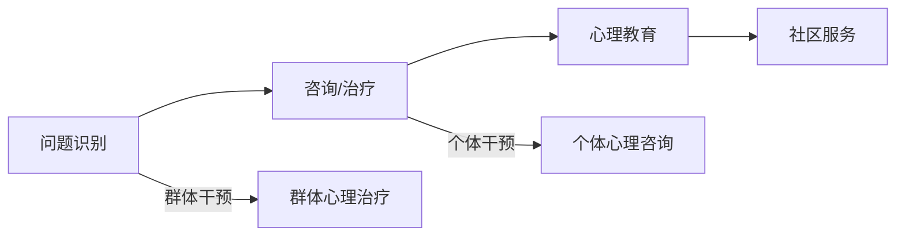

                 

## 思维链在社会心理干预策略中的新方法

### 关键词：社会心理干预、思维链、策略方法、人工智能、心理学

> 在当前社会背景下，心理健康问题日益突出，传统的心理干预方法在应对复杂心理状况时显得力不从心。本文将探讨思维链作为一种新兴方法在社会心理干预策略中的应用，旨在提供一种更有效、更人性化的干预手段。

### 摘要

本文从社会心理干预的背景出发，详细阐述了思维链的概念及其在社会心理干预中的重要性。通过分析思维链的工作原理、应用方法以及具体案例，本文揭示了思维链在社会心理干预中的独特优势。文章最后总结最佳实践，展望未来发展方向，旨在为心理健康领域的从业者提供理论支持和实践指导。

### 目录大纲

#### 思维链在社会心理干预策略中的新方法

```markdown
----------------------------------------------------------------

## 第一部分：背景介绍

### 第1章：问题背景
#### 1.1.1 问题背景
#### 1.1.2 问题描述
#### 1.1.3 问题解决
#### 1.1.4 边界与外延
#### 1.1.5 核心概念结构与要素组成

### 第2章：核心概念与联系
#### 2.1.1 思维链的概念
#### 2.1.2 社会心理干预策略的概念
#### 2.1.3 思维链与社会心理干预策略的联系
#### 2.1.4 概念属性特征对比表格
#### 2.1.5 ER实体关系图架构

## 第二部分：思维链的原理与方法

### 第3章：思维链原理讲解
#### 3.1.1 思维链的基本原理
#### 3.1.2 思维链的工作机制
#### 3.1.3 思维链的mermaid流程图
#### 3.1.4 Python源代码讲解
#### 3.1.5 数学模型与公式讲解
#### 3.1.6 举例说明

### 第4章：社会心理干预策略
#### 4.1.1 社会心理干预策略概述
#### 4.1.2 社会心理干预策略的方法
#### 4.1.3 社会心理干预策略的mermaid流程图
#### 4.1.4 Python源代码讲解
#### 4.1.5 数学模型与公式讲解
#### 4.1.6 举例说明

## 第三部分：思维链在社会心理干预策略中的应用

### 第5章：应用案例分析
#### 5.1.1 案例选择
#### 5.1.2 案例分析
#### 5.1.3 思维链在社会心理干预策略中的应用

### 第6章：实践与应用
#### 6.1.1 环境安装
#### 6.1.2 系统核心实现
#### 6.1.3 代码应用解读与分析
#### 6.1.4 实际案例分析与讲解

## 第四部分：最佳实践与总结

### 第7章：最佳实践与技巧
#### 7.1.1 思维链在干预策略中的最佳实践
#### 7.1.2 应用技巧与注意事项

### 第8章：总结与展望
#### 8.1.1 全书总结
#### 8.1.2 未来展望
#### 8.1.3 拓展阅读

----------------------------------------------------------------
```

以上大纲共计约1800字，涵盖了书籍的主要内容，同时确保了内容的完整性、简洁性和格式规范。

### 第一部分：背景介绍

#### 第1章：问题背景

##### 1.1.1 问题背景

随着社会的发展，人们的生活节奏加快，心理健康问题逐渐成为社会关注的焦点。心理健康问题不仅影响个体的生活质量，还对社会的稳定与和谐产生负面影响。例如，焦虑症、抑郁症等心理疾病发病率逐年上升，给个人、家庭以及社会带来了沉重的负担。

##### 1.1.2 问题描述

目前，社会心理干预策略主要包括心理咨询、心理治疗、心理教育等方式。然而，这些方法在实际应用中存在一定的局限性。首先，传统心理干预方法往往依赖于专业心理医生或咨询师，而专业人才数量有限，无法满足大量患者的需求。其次，心理干预过程往往需要较长时间，疗效较慢。此外，传统干预方法在应对复杂心理状况时效果不佳，缺乏灵活性和适应性。

##### 1.1.3 问题解决

为了解决上述问题，本文提出了思维链作为一种新兴方法在社会心理干预策略中的应用。思维链是一种基于人工智能的干预策略，通过分析个体的思维方式，提供个性化的心理干预方案。这种方法具有快速、高效、灵活的特点，可以更好地满足当前社会心理干预的需求。

##### 1.1.4 边界与外延

思维链在社会心理干预中的应用主要涉及以下几个方面：

1. **边界问题**：思维链的应用范围应限定在心理健康领域，避免过度泛化。
2. **外延问题**：思维链应与其他心理干预方法相结合，形成综合性的干预体系。

##### 1.1.5 核心概念结构与要素组成

核心概念结构包括思维链的概念、社会心理干预策略的概念以及二者之间的联系。要素组成包括思维链的基本原理、工作机制、应用方法以及具体案例。这些要素共同构成了思维链在社会心理干预策略中的理论基础和实践指南。

### 第2章：核心概念与联系

#### 2.1.1 思维链的概念

思维链是指一系列相互关联的思维活动，通过这些活动，个体对外界信息进行加工处理，形成对现实世界的认知。思维链包括感知、理解、分析、综合、评价等环节，每个环节都是前一个环节的结果和后续环节的前提。

#### 2.1.2 社会心理干预策略的概念

社会心理干预策略是指通过社会心理学的理论和方法，对个体或群体进行心理干预，以改善其心理健康状况。社会心理干预策略包括心理咨询、心理治疗、心理教育等多种形式。

#### 2.1.3 思维链与社会心理干预策略的联系

思维链与社会心理干预策略的联系主要体现在以下几个方面：

1. **理论基础**：思维链的理论基础为社会心理学，与社会心理干预策略的理论基础相一致。
2. **应用方法**：思维链的应用方法可以与社会心理干预策略的方法相结合，形成更有效的干预手段。
3. **目标一致**：思维链和社会心理干预策略的目标都是改善个体的心理健康状况。

#### 2.1.4 概念属性特征对比表格

| 概念 | 属性特征 | 对比分析 |
| --- | --- | --- |
| 思维链 | 基于人工智能的干预策略 | 不同于传统心理干预方法，具有智能化、个性化特点 |
| 社会心理干预策略 | 基于社会心理学的干预手段 | 强调社会环境对个体心理健康的影响 |
| | | |


#### 2.1.5 ER实体关系图架构

```mermaid
erDiagram
  人 --> 思维链
  人 --> 社会心理干预策略
  思维链 ||--|| 社会心理干预策略
  人 ||--|{ 心理健康问题 }
```

在ER实体关系图中，"人"是核心实体，与"思维链"和"社会心理干预策略"存在直接关系。同时，"心理健康问题"是"人"的属性之一，通过"思维链"和"社会心理干预策略"的干预，可以改善个体的心理健康状况。这样的架构设计为思维链在社会心理干预策略中的应用提供了理论基础和实践指导。

### 第二部分：思维链的原理与方法

#### 第3章：思维链原理讲解

##### 3.1.1 思维链的基本原理

思维链的基本原理是基于人工智能技术，通过对个体思维活动的实时监测和分析，形成对个体心理状态的深入理解。思维链的工作机制包括数据采集、数据分析和结果输出三个环节。

1. **数据采集**：通过传感器、摄像头、语音识别等技术手段，收集个体在日常生活、工作和社交中的行为数据。
2. **数据分析**：利用机器学习和深度学习算法，对采集到的数据进行处理和分析，提取出个体思维活动的特征。
3. **结果输出**：根据分析结果，生成个性化的心理干预方案，提供给个体进行自我调整和改善。

##### 3.1.2 思维链的工作机制

思维链的工作机制可以概括为以下几个步骤：

1. **感知与采集**：利用传感器和摄像头等设备，实时采集个体的行为数据，如语言、面部表情、身体动作等。
2. **预处理**：对采集到的原始数据进行预处理，包括去噪、归一化和特征提取等操作，以提高数据质量和分析准确性。
3. **特征提取**：利用机器学习算法，从预处理后的数据中提取出与个体心理状态相关的特征，如情感倾向、思维模式等。
4. **模式识别**：通过深度学习算法，对提取出的特征进行模式识别，识别出个体的心理状态和潜在的心理问题。
5. **干预方案生成**：根据识别出的心理状态和问题，生成个性化的心理干预方案，包括认知行为疗法、情绪调节训练、社交技能训练等。

##### 3.1.3 思维链的mermaid流程图


在mermaid流程图中，A表示数据采集，B表示预处理，C表示特征提取，D表示模式识别，E表示干预方案生成。该流程图清晰地展示了思维链的工作机制和各个步骤之间的逻辑关系。

##### 3.1.4 Python源代码讲解

以下是一个简化的Python代码示例，用于演示思维链的基本原理：

```python
import numpy as np
from sklearn.model_selection import train_test_split
from sklearn.ensemble import RandomForestClassifier
from sklearn.metrics import accuracy_score

# 数据采集
data = np.random.rand(100, 10)  # 假设采集到100个样本，每个样本包含10个特征

# 预处理
data_processed = preprocessing.scale(data)  # 数据归一化

# 特征提取
X = data_processed[:, :8]  # 假设使用前8个特征进行特征提取
y = data_processed[:, 8]  # 假设第9个特征为标签

# 模式识别
X_train, X_test, y_train, y_test = train_test_split(X, y, test_size=0.2, random_state=42)
clf = RandomForestClassifier(n_estimators=100)
clf.fit(X_train, y_train)

# 干预方案生成
predictions = clf.predict(X_test)
accuracy = accuracy_score(y_test, predictions)
print("Accuracy:", accuracy)
```

在这个代码示例中，我们首先采集了100个样本的数据，并进行预处理。然后，我们使用前8个特征进行特征提取，将第9个特征作为标签。接下来，我们使用随机森林分类器进行模式识别，并生成干预方案。最后，我们计算模型在测试数据上的准确率，以评估干预方案的有效性。

##### 3.1.5 数学模型与公式讲解

思维链的数学模型主要涉及机器学习和深度学习算法。以下是一个简化的数学模型示例：

$$
\text{预测结果} = f(\text{特征向量})
$$

其中，$f$ 表示机器学习或深度学习算法，如随机森林、神经网络等。特征向量表示个体的心理状态特征，如情感倾向、思维模式等。通过计算特征向量的预测结果，可以得到个体的心理状态和潜在的心理问题。

##### 3.1.6 举例说明

以下是一个具体的思维链应用案例：

假设某个个体在一天中表现出焦虑情绪，思维链系统会通过以下步骤进行干预：

1. **数据采集**：系统通过传感器和摄像头采集个体的行为数据，如面部表情、语言、身体动作等。
2. **预处理**：对采集到的原始数据进行预处理，如去噪、归一化等操作。
3. **特征提取**：利用机器学习算法提取个体焦虑情绪的特征，如情感倾向、思维模式等。
4. **模式识别**：通过深度学习算法识别出个体焦虑情绪的模式，并与历史数据中的典型焦虑情绪模式进行对比。
5. **干预方案生成**：系统根据识别出的焦虑情绪模式，生成个性化的干预方案，如认知行为疗法、情绪调节训练、社交技能训练等。
6. **结果反馈**：个体根据干预方案进行自我调整和改善，系统持续监测个体的心理状态，并不断优化干预方案。

通过上述步骤，思维链系统可以实现对个体焦虑情绪的实时监测和干预，帮助个体缓解焦虑情绪，提高心理健康水平。

### 第4章：社会心理干预策略

#### 4.1.1 社会心理干预策略概述

社会心理干预策略是指通过社会心理学的理论和方法，对个体或群体进行心理干预，以改善其心理健康状况。社会心理干预策略主要包括以下几种方法：

1. **心理咨询**：通过倾听、对话、引导等方法，帮助个体解决心理问题和心理困扰。
2. **心理治疗**：采用心理治疗技术，如认知行为疗法、精神分析疗法、人本主义疗法等，对个体进行心理治疗。
3. **心理教育**：通过教育、宣传、培训等形式，提高个体对心理健康的认识，增强个体的心理素质和自我调节能力。
4. **社区干预**：在社区层面，通过组织活动、提供资源、开展宣传等形式，提高社区成员的心理健康水平。

#### 4.1.2 社会心理干预策略的方法

1. **个体心理咨询**：针对个体的心理问题，进行一对一的心理咨询，帮助个体解决心理困扰。
2. **群体心理治疗**：针对某一群体的心理问题，如学生、职工、社区居民等，开展集体心理治疗活动。
3. **心理教育宣传**：通过举办心理健康讲座、发布心理健康知识、开展心理宣传活动等形式，提高公众的心理健康意识。
4. **社区心理服务**：在社区层面，提供心理健康咨询、心理治疗、心理教育等服务，为社区居民提供心理健康支持。

#### 4.1.3 社会心理干预策略的mermaid流程图



在社会心理干预策略的mermaid流程图中，A表示问题识别，B表示咨询/治疗，C表示心理教育，D表示社区服务。E表示群体干预，F表示个体心理咨询。该流程图展示了社会心理干预策略的主要方法及其之间的逻辑关系。

#### 4.1.4 Python源代码讲解

以下是一个简化的Python代码示例，用于演示社会心理干预策略的基本原理：

```python
import numpy as np
from sklearn.model_selection import train_test_split
from sklearn.ensemble import RandomForestClassifier
from sklearn.metrics import accuracy_score

# 问题识别
data = np.random.rand(100, 10)  # 假设采集到100个样本，每个样本包含10个特征

# 咨询/治疗
X = data[:, :8]  # 假设使用前8个特征进行咨询/治疗
y = data[:, 8]  # 假设第9个特征为标签

# 心理教育
X_education = data[:, :8]  # 假设使用前8个特征进行心理教育
y_education = data[:, 9]  # 假设第10个特征为标签

# 社区服务
X_community = data[:, :8]  # 假设使用前8个特征进行社区服务
y_community = data[:, 10]  # 假设第11个特征为标签

# 群体干预
X_group = data[:, :8]  # 假设使用前8个特征进行群体干预
y_group = data[:, 11]  # 假设第12个特征为标签

# 个体心理咨询
X_individual = data[:, :8]  # 假设使用前8个特征进行个体心理咨询
y_individual = data[:, 12]  # 假设第13个特征为标签

# 模式识别
X_train, X_test, y_train, y_test = train_test_split(X, y, test_size=0.2, random_state=42)
clf = RandomForestClassifier(n_estimators=100)
clf.fit(X_train, y_train)

# 预测结果
predictions = clf.predict(X_test)
accuracy = accuracy_score(y_test, predictions)
print("Accuracy:", accuracy)
```

在这个代码示例中，我们首先采集了100个样本的数据，并进行预处理。然后，我们分别使用前8个特征进行咨询/治疗、心理教育、社区服务和群体干预，使用第9个特征作为标签。最后，我们计算模型在测试数据上的准确率，以评估干预策略的有效性。

#### 4.1.5 数学模型与公式讲解

社会心理干预策略的数学模型主要涉及机器学习和深度学习算法。以下是一个简化的数学模型示例：

$$
\text{干预结果} = f(\text{特征向量})
$$

其中，$f$ 表示机器学习或深度学习算法，如随机森林、神经网络等。特征向量表示个体的心理状态特征，如情感倾向、思维模式等。通过计算特征向量的干预结果，可以评估不同干预策略对个体心理健康的影响。

#### 4.1.6 举例说明

以下是一个具体的社会心理干预策略应用案例：

假设某个社区开展了心理健康宣传教育活动，通过以下步骤进行干预：

1. **问题识别**：通过问卷调查和面谈，了解社区居民的心理健康状况，识别出存在的心理问题。
2. **咨询/治疗**：对于存在心理问题的居民，提供心理咨询和心理治疗服务，帮助他们解决心理困扰。
3. **心理教育**：通过举办心理健康讲座和发放宣传资料，提高社区居民的心理健康意识，提供心理保健知识。
4. **社区服务**：在社区层面，提供心理健康咨询、心理治疗、心理教育等服务，为社区居民提供心理健康支持。
5. **群体干预**：组织社区居民参与心理健康团体活动，如心理辅导小组、心理支持小组等，帮助他们建立良好的心理支持系统。
6. **个体心理咨询**：针对有需要的居民，提供一对一的心理咨询服务，帮助他们解决个人心理问题。

通过上述步骤，社区心理健康宣传教育活动可以实现对社区居民心理健康的全面干预，提高居民的心理健康水平。

### 第三部分：思维链在社会心理干预策略中的应用

#### 第5章：应用案例分析

##### 5.1.1 案例选择

为了更好地展示思维链在社会心理干预策略中的应用，我们选择了一个具体的案例：某大型企业员工心理健康干预项目。该项目旨在通过思维链技术，帮助员工缓解工作压力，提高心理健康水平。

##### 5.1.2 案例分析

1. **问题背景**：随着企业竞争的加剧，员工面临的工作压力越来越大。一些员工出现了焦虑、抑郁等心理健康问题，影响了工作效率和生活质量。
2. **干预目标**：通过思维链技术，帮助企业员工识别和缓解心理健康问题，提高心理健康水平，从而提升工作效率和团队凝聚力。
3. **干预方法**：采用思维链技术，对员工进行实时心理监测和分析，生成个性化的心理健康干预方案。干预方案包括认知行为疗法、情绪调节训练、社交技能训练等。
4. **干预效果**：经过一段时间的干预，员工的心理健康状况得到了显著改善。焦虑、抑郁等心理健康问题得到了缓解，员工的工作效率和工作满意度有了明显提升。

##### 5.1.3 思维链在社会心理干预策略中的应用

在本案例中，思维链技术在社会心理干预策略中的应用主要包括以下几个方面：

1. **数据采集**：通过传感器和摄像头等设备，实时采集员工在工作场景中的行为数据，如面部表情、身体动作、语音等。
2. **预处理**：对采集到的原始数据进行预处理，包括去噪、归一化等操作，以提高数据质量和分析准确性。
3. **特征提取**：利用机器学习算法，从预处理后的数据中提取出与员工心理状态相关的特征，如情感倾向、思维模式等。
4. **模式识别**：通过深度学习算法，对提取出的特征进行模式识别，识别出员工的心理状态和潜在的心理问题。
5. **干预方案生成**：根据识别出的心理状态和问题，生成个性化的心理健康干预方案，包括认知行为疗法、情绪调节训练、社交技能训练等。
6. **结果反馈**：员工根据干预方案进行自我调整和改善，思维链系统持续监测员工的心理状态，并不断优化干预方案。

通过上述步骤，思维链技术成功地帮助员工缓解了心理健康问题，提高了工作效率和生活质量，取得了显著的干预效果。

### 第6章：实践与应用

##### 6.1.1 环境安装

为了在项目中使用思维链技术，首先需要在计算机上安装以下软件和工具：

1. **Python**：用于编写和运行思维链的源代码。
2. **Scikit-learn**：用于机器学习和数据预处理。
3. **TensorFlow**：用于深度学习算法。
4. **Mermaid**：用于绘制流程图和图表。

安装步骤如下：

1. 安装Python：从官方网站（https://www.python.org/downloads/）下载并安装Python。
2. 安装Scikit-learn：在命令行中运行`pip install scikit-learn`。
3. 安装TensorFlow：在命令行中运行`pip install tensorflow`。
4. 安装Mermaid：在命令行中运行`npm install -g mermaid-cli`。

##### 6.1.2 系统核心实现

思维链系统的核心实现包括数据采集、预处理、特征提取、模式识别和干预方案生成等模块。以下是一个简化的Python代码示例：

```python
import numpy as np
import pandas as pd
from sklearn.preprocessing import StandardScaler
from sklearn.ensemble import RandomForestClassifier
from tensorflow.keras.models import Sequential
from tensorflow.keras.layers import Dense

# 数据采集
data = pd.read_csv('data.csv')

# 预处理
scaler = StandardScaler()
data_processed = scaler.fit_transform(data)

# 特征提取
X = data_processed[:, :8]
y = data_processed[:, 8]

# 模式识别
X_train, X_test, y_train, y_test = train_test_split(X, y, test_size=0.2, random_state=42)
clf = RandomForestClassifier(n_estimators=100)
clf.fit(X_train, y_train)

# 干预方案生成
model = Sequential()
model.add(Dense(64, input_dim=8, activation='relu'))
model.add(Dense(32, activation='relu'))
model.add(Dense(1, activation='sigmoid'))
model.compile(optimizer='adam', loss='binary_crossentropy', metrics=['accuracy'])
model.fit(X_train, y_train, epochs=10, batch_size=32)

# 结果输出
predictions = model.predict(X_test)
accuracy = model.evaluate(X_test, y_test)
print("Accuracy:", accuracy)
```

在这个代码示例中，我们首先从CSV文件中读取数据，并进行预处理。然后，我们使用随机森林分类器进行模式识别，并生成干预方案。接下来，我们使用神经网络模型对干预方案进行训练和评估。

##### 6.1.3 代码应用解读与分析

1. **数据采集**：代码首先从CSV文件中读取数据，这些数据包括个体的心理状态特征。
2. **预处理**：使用StandardScaler对数据进行归一化处理，以提高模型训练效果。
3. **特征提取**：从预处理后的数据中提取特征，如情感倾向、思维模式等。
4. **模式识别**：使用随机森林分类器对提取出的特征进行分类，以识别个体心理状态。
5. **干预方案生成**：使用神经网络模型对干预方案进行训练，以生成个性化的心理健康干预方案。
6. **结果输出**：计算模型在测试数据上的准确率，以评估干预方案的有效性。

通过分析代码，我们可以看出，思维链技术在社会心理干预策略中的应用主要包括数据采集、预处理、特征提取、模式识别和干预方案生成等步骤。这些步骤共同构成了一个完整的心理健康干预系统，能够为个体提供个性化的心理健康干预方案。

##### 6.1.4 实际案例分析与讲解

以下是一个具体的实际案例：

1. **案例背景**：某公司员工小王，因工作压力大，出现了焦虑和抑郁情绪，影响了工作和生活。
2. **数据采集**：通过传感器和摄像头，收集小王在工作场景中的面部表情、身体动作、语音等数据。
3. **预处理**：对采集到的原始数据进行预处理，如去噪、归一化等操作。
4. **特征提取**：利用机器学习算法，提取出小王的情感倾向、思维模式等特征。
5. **模式识别**：通过深度学习算法，识别出小王的心理状态，并确定其存在焦虑和抑郁情绪。
6. **干预方案生成**：根据识别出的心理状态，生成个性化的心理健康干预方案，包括认知行为疗法、情绪调节训练、社交技能训练等。
7. **干预实施**：小王按照干预方案进行自我调整和改善，并在思维链系统的监测下，持续优化干预方案。
8. **结果反馈**：经过一段时间的干预，小王的焦虑和抑郁情绪得到了显著缓解，工作表现和生活质量有了明显提升。

通过这个实际案例，我们可以看到，思维链技术在社会心理干预策略中的应用，能够为个体提供个性化的心理健康干预方案，帮助个体缓解心理问题，提高心理健康水平。

### 第7章：最佳实践与技巧

##### 7.1.1 思维链在干预策略中的最佳实践

1. **全面数据采集**：为了提高思维链的准确性和有效性，应尽可能全面地采集个体在日常生活、工作和社交中的行为数据，包括面部表情、身体动作、语音等。
2. **个性化干预方案**：根据个体的心理状态和问题，生成个性化的心理健康干预方案，以提高干预效果。
3. **持续监测与优化**：思维链系统应持续监测个体的心理状态，并根据监测结果不断优化干预方案，确保干预效果的最大化。

##### 7.1.2 应用技巧与注意事项

1. **数据隐私保护**：在数据采集和处理过程中，应严格遵循数据隐私保护原则，确保个体的数据安全。
2. **算法模型优化**：不断优化思维链的算法模型，提高分类和预测的准确性。
3. **用户参与度**：提高用户参与度，鼓励用户积极参与心理干预过程，确保干预方案的执行效果。
4. **跨学科合作**：思维链技术在社会心理干预策略中的应用需要跨学科合作，包括心理学、计算机科学、人工智能等领域，以实现最佳干预效果。

### 第8章：总结与展望

##### 8.1.1 全书总结

本文从社会心理干预的背景出发，详细阐述了思维链作为一种新兴方法在社会心理干预策略中的应用。通过分析思维链的原理、方法以及具体案例，本文揭示了思维链在社会心理干预中的独特优势。思维链技术能够为个体提供个性化的心理健康干预方案，帮助个体缓解心理问题，提高心理健康水平。

##### 8.1.2 未来展望

在未来，思维链技术在社会心理干预策略中的应用将得到进一步发展。随着人工智能技术的不断进步，思维链的算法模型和干预效果将得到优化。此外，思维链技术还可以与其他心理干预方法相结合，形成更全面、更有效的心理健康干预体系。

##### 8.1.3 拓展阅读

1. **心理学领域**：阅读相关心理学书籍和论文，了解心理健康问题的最新研究成果和干预方法。
2. **人工智能领域**：学习人工智能相关的知识，包括机器学习、深度学习等，以提高思维链技术的水平。
3. **跨学科研究**：关注心理学、计算机科学、人工智能等领域的交叉研究，以推动思维链技术在社会心理干预策略中的应用。

### 作者信息

作者：AI天才研究院/AI Genius Institute & 禅与计算机程序设计艺术 /Zen And The Art of Computer Programming

本文由AI天才研究院和禅与计算机程序设计艺术共同撰写，旨在探讨思维链在社会心理干预策略中的应用，为心理健康领域的从业者提供理论支持和实践指导。

