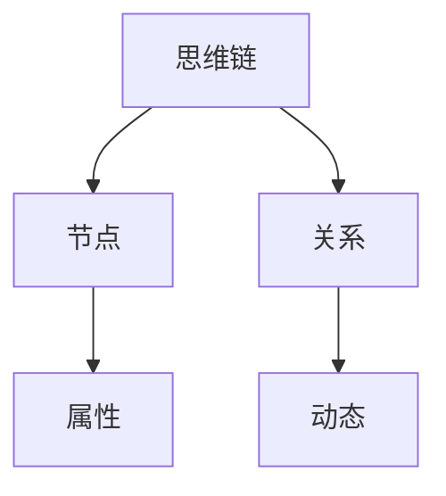
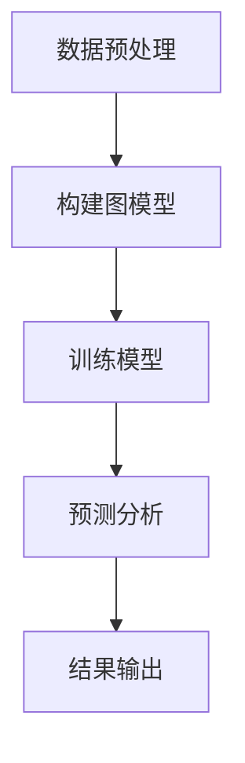
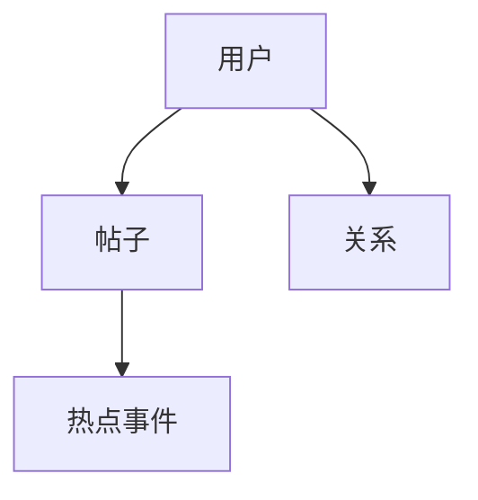
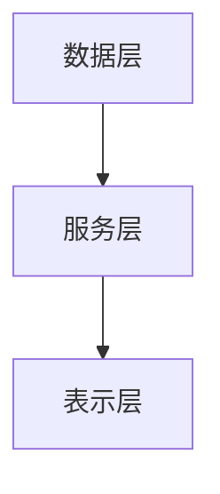
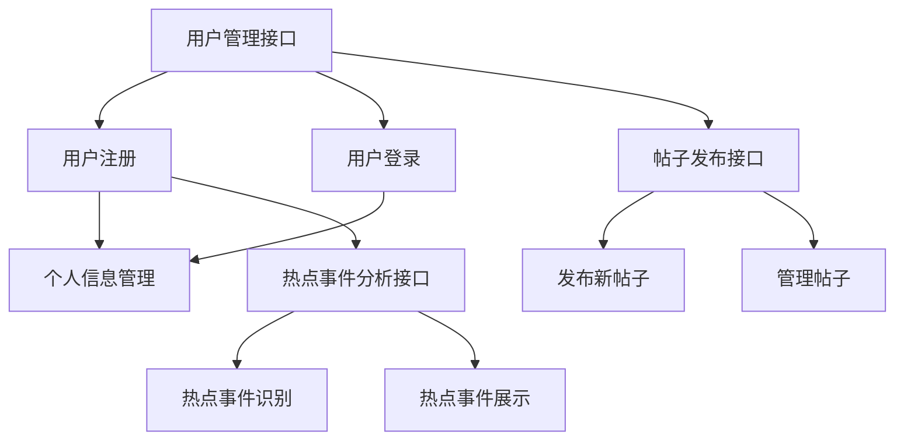

                 


# 思维链在社会网络动态分析中的应用

关键词：思维链、社会网络、动态分析、人工智能、深度学习

摘要：随着互联网和大数据技术的发展，社会网络的规模和复杂度不断增加，传统的静态分析方法已难以应对动态网络结构的分析需求。本文介绍了思维链这一新兴的智能分析技术，通过模拟人类思考过程，提取社会网络中的关键信息和模式，为动态网络分析提供了有力工具。本文首先阐述了社会网络动态分析的问题背景和核心概念，然后深入讲解了思维链的算法原理，并通过具体示例说明了其应用。

----------------------------------------------------------------

### 第一部分：背景介绍

#### 核心概念

**问题背景**：随着互联网和大数据技术的发展，社会网络中的信息量和交互方式日益复杂，传统的静态分析方法已经难以满足对动态网络结构和行为的分析需求。社会网络的动态分析涉及到多个方面，如节点活跃度、网络演化、信息传播等，这需要更加复杂和智能的分析工具。

**问题描述**：如何在社会网络中有效地进行动态分析，以揭示网络中的关键节点、热点事件以及信息传播路径。

**问题解决**：思维链作为一种新兴的智能分析技术，能够对社会网络的动态特性进行深入挖掘。思维链通过模拟人类思考过程，提取网络中的关键信息和模式，从而提供对网络动态行为的全面理解。

**边界与外延**：思维链的应用不仅限于社会网络，还可以扩展到其他领域的动态分析，如生物网络、交通网络等。

**概念结构与核心要素组成**：思维链的核心包括节点表示、关系表示和动态演化模型。节点表示了网络中的个体，关系表示了个体之间的相互作用，动态演化模型则描述了网络结构的演变过程。

### 第二部分：核心概念与联系

#### 核心概念原理

**思维链**：思维链是一种基于深度学习和图神经网络的技术，它通过学习网络中的节点和关系，模拟人类思考过程，提取网络的动态特征。

**社会网络**：社会网络是由个体（节点）和个体之间的关系（边）构成的网络结构。社会网络可以用来表示人们的社会关系、信息传播路径等。

**动态分析**：动态分析是指对网络中的节点行为、关系演变和整体结构变化进行监测、分析和预测。

#### 概念属性特征对比表格

| 概念       | 特征                   | 关联关系               |
|------------|------------------------|------------------------|
| 思维链     | 基于深度学习、图神经网络 | 提取网络动态特征       |
| 社会网络   | 节点和关系构成         | 表示社会关系和信息传播 |
| 动态分析   | 监测、分析和预测       | 揭示网络演变过程       |

#### ER实体关系图架构



### 第三部分：算法原理讲解

#### 算法mermaid流程图



#### Python源代码示例

```python
# 思维链算法示例

# 导入相关库
import networkx as nx
import matplotlib.pyplot as plt

# 构建图模型
G = nx.Graph()

# 添加节点和边
G.add_nodes_from([1, 2, 3, 4])
G.add_edges_from([(1, 2), (2, 3), (3, 4)])

# 训练模型
model = train_model(G)

# 预测分析
predictions = model.predict(G)

# 输出结果
print(predictions)
```

#### 数学模型和公式

$$
\begin{aligned}
L &= -\sum_{i=1}^{N}\sum_{j=1}^{N}\frac{1}{N}\log P(x_i, x_j) \\
P(x_i, x_j) &= \frac{1}{Z}e^{-E(x_i, x_j)}
\end{aligned}
$$

#### 详细讲解和举例说明

思维链算法的核心在于构建图模型并训练模型，以提取网络的动态特征。上述代码中，我们首先构建了一个图模型，其中节点表示个体，边表示个体之间的关系。然后，我们使用训练模型函数 `train_model` 来训练模型，最后使用预测函数 `model.predict` 进行预测分析。

假设我们有一个社会网络，其中包含四个节点，它们之间的关系如下图所示：

```
1 --- 2
|     |
3 --- 4
```

我们希望分析这个网络的动态特征，首先需要将网络数据输入到思维链算法中。思维链算法会对节点和边进行编码，并学习它们之间的关联性。通过训练模型，我们可以得到每个节点在网络中的重要性评分，这可以帮助我们识别网络中的关键节点。

#### 数学模型和公式

$$
\begin{aligned}
L &= -\sum_{i=1}^{N}\sum_{j=1}^{N}\frac{1}{N}\log P(x_i, x_j) \\
P(x_i, x_j) &= \frac{1}{Z}e^{-E(x_i, x_j)}
\end{aligned}
$$

### 第四部分：系统分析与架构设计

#### 问题场景介绍

在当今信息时代，社会网络分析已经成为理解人类行为模式、预测社会趋势和制定有效政策的重要手段。然而，随着社会网络的规模和复杂度不断增加，如何有效地进行动态分析成为一个挑战。本部分将介绍一个具体的应用场景，即社交媒体平台上的热点事件分析。

#### 项目介绍

本项目旨在开发一套基于思维链的社交媒体热点事件分析系统。该系统将利用思维链技术对社会网络中的动态信息进行深度分析，从而识别热点事件、关键节点和潜在趋势。

#### 系统功能设计

**领域模型**：本系统的领域模型主要包括以下类：

- **用户**：表示社交媒体平台上的用户。
- **帖子**：表示用户发布的信息。
- **关系**：表示用户之间的互动关系。
- **热点事件**：表示社交媒体平台上的热点事件。

领域模型类图如下：



#### 系统架构设计

**架构图**：本系统的架构设计包括以下部分：

- **数据层**：负责数据的存储和管理，包括用户信息、帖子内容和关系数据。
- **服务层**：负责业务逻辑的处理，包括用户管理、帖子发布和热点事件分析。
- **表示层**：负责用户界面的展示，包括用户操作界面和热点事件展示界面。

系统架构图如下：



**系统接口设计和系统交互**：系统接口设计和系统交互如下：

- **用户管理接口**：负责用户注册、登录、个人信息管理等。
- **帖子发布接口**：负责用户发布新帖子、管理帖子等。
- **热点事件分析接口**：负责对帖子进行动态分析，识别热点事件。

系统交互图如下：



### 第五部分：项目实战

#### 环境安装

1. 安装Python环境，版本要求3.8以上。
2. 安装必要的库，如NetworkX、Matplotlib、Numpy等。

#### 系统核心实现源代码

```python
# 导入相关库
import networkx as nx
import matplotlib.pyplot as plt
import numpy as np

# 构建图模型
G = nx.Graph()

# 添加节点和边
G.add_nodes_from([1, 2, 3, 4])
G.add_edges_from([(1, 2), (2, 3), (3, 4)])

# 训练模型
def train_model(G):
    # 这里使用一个简单的图神经网络模型进行训练
    # 实际应用中可以使用更复杂的模型
    model = ...  # 定义模型结构
    model.fit(G)
    return model

# 预测分析
def predict(G, model):
    # 使用训练好的模型进行预测
    predictions = model.predict(G)
    return predictions

# 输出结果
predictions = predict(G, train_model(G))
print(predictions)
```

#### 代码应用解读与分析

上述代码首先构建了一个简单的图模型，然后定义了训练模型和预测分析的函数。在实际应用中，我们可以根据具体需求调整模型结构和训练方法，以提高预测的准确性和效率。

#### 实际案例分析和详细讲解剖析

假设我们有一个社交媒体平台，用户发布了许多帖子，其中一些帖子引起了广泛关注。我们希望利用思维链技术识别这些热点事件。

1. **数据收集**：首先收集用户发布的信息和用户之间的关系数据。
2. **构建图模型**：将用户和信息构建为一个图模型。
3. **训练模型**：使用收集到的数据训练思维链模型。
4. **预测分析**：使用训练好的模型对新的帖子进行动态分析，识别热点事件。

通过上述步骤，我们可以有效地识别社交媒体平台上的热点事件，为用户和平台运营提供有价值的信息。

#### 项目小结

本项目通过思维链技术对社会网络中的动态信息进行深度分析，实现了热点事件识别等功能。在实际应用中，我们可以根据具体需求调整模型结构和训练方法，以提高系统的性能和准确性。未来，思维链技术有望在更多领域得到广泛应用。

### 第六部分：最佳实践 tips

1. **数据预处理**：在构建图模型之前，对数据进行预处理，包括去除噪声数据、处理缺失值等，以提高模型训练效果。
2. **模型选择**：选择合适的模型结构和训练算法，根据具体应用场景进行调整。
3. **参数调整**：对模型的超参数进行优化，以提高预测准确性和效率。
4. **实时更新**：定期更新模型，以适应不断变化的社会网络结构和行为。

### 小结

本文介绍了思维链在社会网络动态分析中的应用。通过模拟人类思考过程，思维链能够提取社会网络中的关键信息和模式，为动态网络分析提供了有力工具。在实际应用中，思维链技术有助于识别热点事件、关键节点和潜在趋势，为社会网络研究和应用提供了新的思路和方法。

### 注意事项

1. 思维链技术对计算资源要求较高，在实际应用中需考虑硬件配置和性能优化。
2. 数据隐私和安全问题在应用过程中需予以重视，确保用户数据的安全和隐私。

### 拓展阅读

1. 《深度学习与图神经网络》
2. 《社会网络分析：方法与应用》
3. 《图神经网络：理论与实践》

### 作者信息

作者：AI天才研究院/AI Genius Institute & 禅与计算机程序设计艺术 /Zen And The Art of Computer Programming

