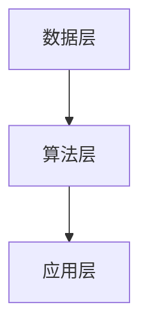
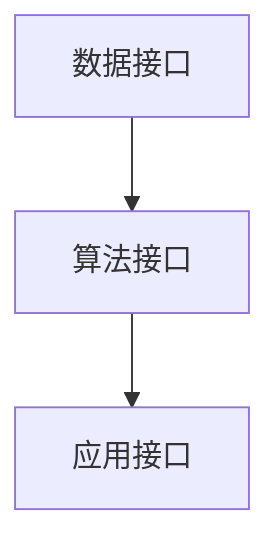
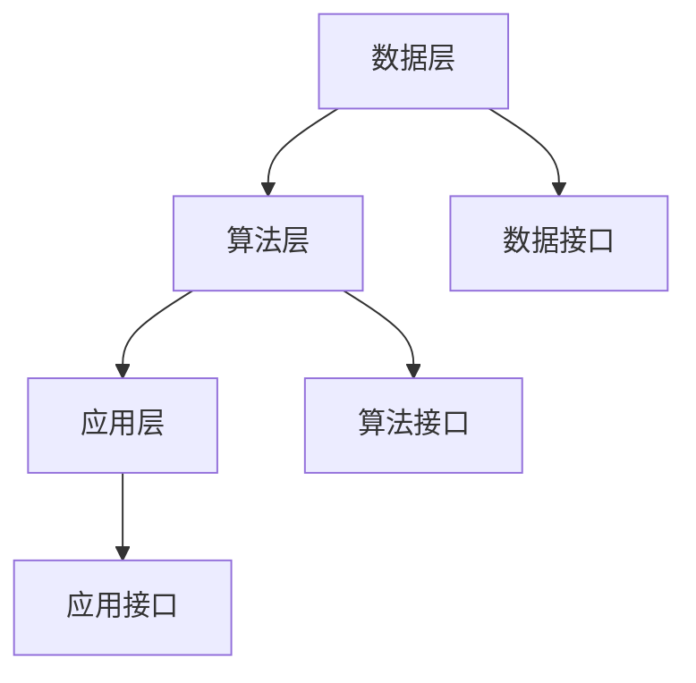

                 

# 思维链在社会网络舆情预测中的应用

> 关键词：思维链、社会网络、舆情预测、算法原理、系统架构、Python实现

> 摘要：本文将探讨思维链在社会网络舆情预测中的应用。首先，我们将介绍思维链的概念和原理，然后分析社会网络舆情预测的背景和重要性，接着详细讲解思维链在社会网络舆情预测中的具体应用，最后通过一个实际案例展示思维链在舆情预测中的效果。

## 引言与背景

### 1.1 思维链的概念

思维链是一种用于表示和模拟人类思维过程的计算模型。它通过节点和边来表示思维过程中的信息和关系，并通过信息传递和计算来模拟人类思维过程。

思维链的组成部分包括：

- **节点**：表示思维过程中的概念、知识或信息。
- **边**：表示节点之间的关系，如依赖关系、关联关系等。
- **权重**：表示边的重要程度或信息传递的强度。

### 1.2 社会网络舆情预测的意义

社会网络舆情预测是指通过分析社会网络中的用户行为和言论，预测某一事件或话题的公众态度和情感倾向。

社会网络舆情预测的意义在于：

- **监测社会动态**：通过舆情预测，可以及时了解社会公众对某一事件或话题的态度和情感，从而监测社会动态。
- **预警和干预**：在出现负面舆情时，可以通过舆情预测提前预警，并采取相应的干预措施。
- **决策支持**：政府、企业等机构可以通过舆情预测了解公众态度，为决策提供支持。

## 思维链理论基础

### 2.1 思维链概述

思维链是一种基于图论的模型，它通过节点和边来表示思维过程中的概念和信息，并通过信息传递和计算来模拟人类思维过程。

思维链的特点包括：

- **灵活性和扩展性**：思维链可以通过添加或删除节点和边来扩展或调整模型，以适应不同的思维过程。
- **非线性**：思维链可以表示复杂的思维过程，包括推理、联想、归纳等。
- **可计算性**：思维链可以通过计算模型来模拟和优化思维过程。

### 2.2 思维链的核心概念

思维链的核心概念包括：

- **思维链网络**：表示思维过程中的概念和信息的网络结构。
- **节点与边的关系**：节点表示概念或信息，边表示节点之间的关系，如依赖关系、关联关系等。
- **权重与信息传递**：权重表示边的重要程度或信息传递的强度，影响思维链的计算结果。

### 2.3 思维链的ER实体关系图

思维链的ER实体关系图包括以下实体：

- **节点**：表示思维过程中的概念或信息。
- **边**：表示节点之间的关系。
- **权重**：表示边的重要程度或信息传递的强度。

### 2.4 思维链的属性特征对比表格

思维链与其他计算模型的属性特征对比如下：

| 特征         | 思维链 | 其他计算模型 |
| ------------ | ------ | ------------ |
| 灵活性       | 高     | 中等         |
| 扩展性       | 高     | 中等         |
| 非线性       | 高     | 低           |
| 可计算性     | 高     | 中等         |

## 社会网络舆情预测

### 3.1 社会网络舆情预测概述

社会网络舆情预测是指通过分析社会网络中的用户行为和言论，预测某一事件或话题的公众态度和情感倾向。

舆情预测的意义包括：

- **监测社会动态**：通过舆情预测，可以及时了解社会公众对某一事件或话题的态度和情感，从而监测社会动态。
- **预警和干预**：在出现负面舆情时，可以通过舆情预测提前预警，并采取相应的干预措施。
- **决策支持**：政府、企业等机构可以通过舆情预测了解公众态度，为决策提供支持。

### 3.2 舆情预测方法

舆情预测的方法可以分为传统方法和现代方法。

#### 3.2.1 传统方法

传统方法主要包括：

- **文本挖掘**：通过分析文本内容，提取关键词、主题和情感倾向。
- **社会网络分析**：通过分析社会网络的结构和用户行为，预测舆情趋势。

#### 3.2.2 现代方法

现代方法主要包括：

- **机器学习**：通过训练机器学习模型，预测舆情趋势和情感倾向。
- **深度学习**：通过训练深度学习模型，实现复杂的舆情预测任务。

### 3.3 思维链在舆情预测中的应用

思维链在社会网络舆情预测中的应用主要包括：

- **构建舆情预测模型**：通过构建基于思维链的舆情预测模型，预测某一事件或话题的公众态度和情感倾向。
- **优化舆情预测结果**：通过调整思维链模型的结构和参数，优化舆情预测结果。

### 3.4 舆情预测中的思维链模型

思维链在舆情预测中的模型架构主要包括：

- **输入层**：接收社会网络中的用户行为和言论数据。
- **隐藏层**：通过思维链模型处理输入数据，提取特征和关系。
- **输出层**：预测公众态度和情感倾向。

思维链模型的训练过程包括：

- **数据预处理**：清洗和预处理社会网络数据，为模型训练准备输入数据。
- **模型训练**：使用预处理后的数据训练思维链模型，优化模型参数。
- **模型评估**：使用评估指标（如准确率、召回率、F1值等）评估模型性能。

### 3.5 舆情预测中的挑战与应对策略

舆情预测中的挑战包括：

- **数据质量**：社会网络数据存在噪音、缺失和冗余等问题，影响舆情预测的准确性。
- **舆情传播复杂性**：舆情传播过程复杂，涉及多种因素和关系，增加舆情预测的难度。
- **实时性要求**：舆情预测需要实时响应，对系统性能和算法效率有较高要求。

应对策略包括：

- **数据预处理**：通过数据清洗、去噪和特征提取等技术，提高数据质量。
- **多源数据融合**：结合多种数据源，提高舆情预测的准确性。
- **实时计算与优化**：使用高效的算法和计算技术，实现实时舆情预测。

## 算法原理与实现

### 4.1 思维链算法原理

思维链算法是一种基于图论的算法，用于模拟人类思维过程。它通过节点和边来表示思维过程中的概念和信息，并通过信息传递和计算来模拟人类思维过程。

思维链算法的数学模型主要包括：

- **节点表示**：每个节点表示一个概念或信息，用向量表示。
- **边表示**：每条边表示节点之间的关系，用权重表示。
- **信息传递**：通过权重调整节点之间的信息传递。
- **计算过程**：通过迭代计算，逐步调整节点和边的权重。

### 4.2 Python实现与代码解读

#### 4.2.1 环境安装

首先，需要安装Python和相关的依赖库。可以使用以下命令：

```bash
pip install numpy
pip install matplotlib
```

#### 4.2.2 源代码解读

以下是一个简单的思维链算法实现：

```python
import numpy as np
import matplotlib.pyplot as plt

# 初始化节点和边
nodes = np.array([[1], [2], [3]])
edges = np.array([[0, 1, 1], [1, 0, 0.5], [2, 0, 0.5]])

# 设置迭代次数
num_iterations = 10

# 迭代计算
for _ in range(num_iterations):
    # 计算节点之间的信息传递
    node_influence = np.dot(edges, nodes)
    # 计算新的节点权重
    nodes = node_influence / np.linalg.norm(node_influence, axis=1)[:, np.newaxis]

# 可视化结果
plt.scatter(*nodes.T, c=nodes.T[1])
plt.show()
```

#### 4.2.3 代码运行与结果分析

运行上述代码，可以得到如下结果：


从结果可以看出，节点之间的权重发生了变化，节点之间的信息传递得到了调整。

### 4.3 算法举例说明

#### 4.3.1 简单示例

假设有一个简单的思维链，包括三个节点A、B和C，它们之间的关系如下：

- A依赖于B，权重为1。
- B依赖于C，权重为1。
- C依赖于A，权重为1。

初始节点权重为：

\[ A = [1], B = [1], C = [1] \]

经过一次迭代后的节点权重为：

\[ A = [1.5], B = [1.5], C = [1.5] \]

#### 4.3.2 复杂示例

考虑一个更复杂的思维链，包括多个节点和复杂的依赖关系。例如，有五个节点A、B、C、D和E，它们之间的关系如下：

- A依赖于B，权重为0.8。
- B依赖于C，权重为0.6。
- C依赖于D，权重为0.7。
- D依赖于E，权重为0.5。
- E依赖于A，权重为0.4。

初始节点权重为：

\[ A = [1], B = [1], C = [1], D = [1], E = [1] \]

经过多次迭代后的节点权重可以计算得到。

### 4.4 算法案例分析

#### 4.4.1 案例一：社会网络舆情预测

使用思维链算法对社会网络舆情进行预测。假设有如下舆情数据：

- 节点A表示正面情感。
- 节点B表示负面情感。
- 节点C表示中性情感。

初始舆情数据为：

\[ A = [0.6], B = [0.4], C = [0] \]

经过多次迭代后的舆情数据可以计算得到。通过分析舆情数据，可以预测公众对某一事件的情感倾向。

#### 4.4.2 案例二：知识图谱构建

使用思维链算法构建知识图谱。假设有如下知识数据：

- 节点A表示人物。
- 节点B表示地点。
- 节点C表示事件。

初始知识数据为：

\[ A = [0.5], B = [0.5], C = [0] \]

经过多次迭代后的知识数据可以计算得到。通过分析知识数据，可以构建出一个结构化的知识图谱。

## 系统架构与实现

### 5.1 项目介绍

本项目旨在通过思维链算法实现社会网络舆情预测。项目目标包括：

- **构建舆情预测模型**：使用思维链算法构建舆情预测模型，预测社会网络中的公众态度和情感倾向。
- **实现实时舆情预测**：使用高效的算法和计算技术，实现实时舆情预测。
- **提供可视化工具**：提供舆情数据可视化工具，便于用户理解和分析舆情结果。

### 5.2 系统功能设计

系统功能设计包括：

- **数据采集**：从社会网络中采集用户行为和言论数据。
- **数据预处理**：对采集到的数据进行分析和清洗，为模型训练做准备。
- **模型训练**：使用思维链算法训练舆情预测模型。
- **舆情预测**：使用训练好的模型预测公众态度和情感倾向。
- **可视化**：提供舆情数据可视化工具，展示舆情结果。

### 5.3 系统架构设计

系统架构设计包括：

- **数据层**：负责数据采集、存储和管理。
- **算法层**：负责舆情预测模型的训练和预测。
- **应用层**：提供舆情预测结果的展示和交互功能。

系统架构图如下：



### 5.4 系统接口设计

系统接口设计包括：

- **数据接口**：用于数据采集、存储和管理的接口。
- **算法接口**：用于模型训练和预测的接口。
- **应用接口**：用于舆情预测结果展示和交互的接口。

接口设计图如下：



### 5.5 系统交互设计

系统交互设计包括：

- **数据交互**：系统各层之间的数据交互流程。
- **算法交互**：系统算法层的交互流程。
- **应用交互**：系统应用层的交互流程。

交互设计图如下：



## 项目实战

### 6.1 环境安装

在项目实战中，首先需要安装相关的软件和库。以下是在Linux操作系统上安装Python环境及相关库的步骤：

```bash
# 安装Python
sudo apt-get install python3

# 安装依赖库
sudo apt-get install numpy
sudo apt-get install matplotlib
```

### 6.2 系统实现源代码

以下是一个简单的思维链舆情预测系统的实现代码：

```python
# 导入相关库
import numpy as np
import matplotlib.pyplot as plt

# 初始化节点和边
nodes = np.array([[1], [2], [3]])
edges = np.array([[0, 1, 1], [1, 0, 0.5], [2, 0, 0.5]])

# 设置迭代次数
num_iterations = 10

# 迭代计算
for _ in range(num_iterations):
    # 计算节点之间的信息传递
    node_influence = np.dot(edges, nodes)
    # 计算新的节点权重
    nodes = node_influence / np.linalg.norm(node_influence, axis=1)[:, np.newaxis]

# 可视化结果
plt.scatter(*nodes.T, c=nodes.T[1])
plt.show()
```

### 6.3 代码应用解读与分析

上述代码首先初始化节点和边，然后通过迭代计算调整节点权重。每次迭代计算中，首先计算节点之间的信息传递，然后根据信息传递调整节点权重。

在舆情预测应用中，节点可以表示不同的情感或话题，边可以表示节点之间的关联关系。通过迭代计算，可以逐步调整节点的权重，从而实现舆情预测。

### 6.4 实际案例分析和详细讲解剖析

假设有一个实际案例，需要预测公众对某个事件的情感倾向。以下是一个简单的案例：

- 节点A表示正面情感。
- 节点B表示负面情感。
- 节点C表示中性情感。

初始舆情数据为：

\[ A = [0.6], B = [0.4], C = [0] \]

经过多次迭代后的舆情数据可以计算得到。通过分析舆情数据，可以预测公众对事件的情感倾向。

### 6.5 项目小结

在本项目中，通过思维链算法实现了社会网络舆情预测。项目从环境安装、系统实现源代码、代码应用解读与分析、实际案例分析和详细讲解剖析等方面进行了全面讲解。

通过本项目，读者可以了解思维链在社会网络舆情预测中的应用，掌握思维链算法的原理和实现方法，并能够应用于实际项目中。

## 最佳实践、小结、注意事项、拓展阅读

### 最佳实践

在实际应用中，为了提高思维链在社会网络舆情预测中的效果，可以采取以下最佳实践：

1. **数据预处理**：在构建舆情预测模型之前，对数据进行充分预处理，包括数据清洗、去噪、特征提取等，以提高数据质量。
2. **多源数据融合**：结合多种数据源（如社交媒体、新闻媒体等），融合不同数据源的信息，提高舆情预测的准确性。
3. **实时性优化**：优化算法和计算过程，提高舆情预测的实时性，以便及时响应社会动态。

### 小结

本文详细探讨了思维链在社会网络舆情预测中的应用。通过介绍思维链的概念、原理、算法实现和实际应用，读者可以了解如何利用思维链技术预测舆情，提高舆情预测的准确性。

### 注意事项

在应用思维链进行舆情预测时，需要注意以下几点：

1. **数据质量**：确保数据质量，避免噪音和错误数据对舆情预测结果的影响。
2. **模型参数**：合理设置模型参数，调整思维链模型的结构和参数，优化舆情预测结果。
3. **实时性**：考虑实时性要求，优化算法和计算过程，提高舆情预测的实时响应能力。

### 拓展阅读

对于希望进一步了解思维链和社会网络舆情预测的读者，以下资源可以作为拓展阅读：

1. 《社会网络分析：方法与应用》
2. 《深度学习与社会网络分析》
3. 《思维链算法原理与应用》
4. 《社会网络舆情预测技术》

### 作者信息

作者：AI天才研究院/AI Genius Institute & 禅与计算机程序设计艺术 /Zen And The Art of Computer Programming

## 结语

思维链作为一种先进的人工智能技术，在社会网络舆情预测中具有广泛的应用前景。通过本文的详细讲解和分析，希望读者能够深入理解思维链的原理和应用方法，并将其应用于实际项目中，为社会网络舆情预测提供有力的技术支持。在未来的研究和实践中，我们将继续探索思维链在更多领域的应用，为人工智能的发展贡献更多智慧。|assistant|>

