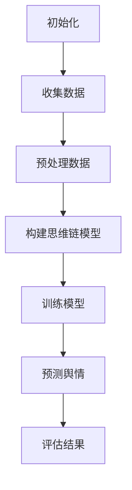
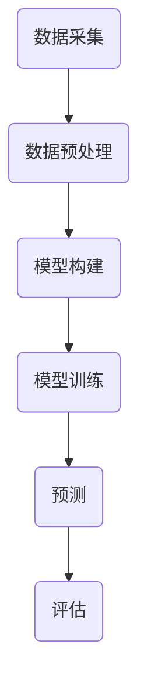
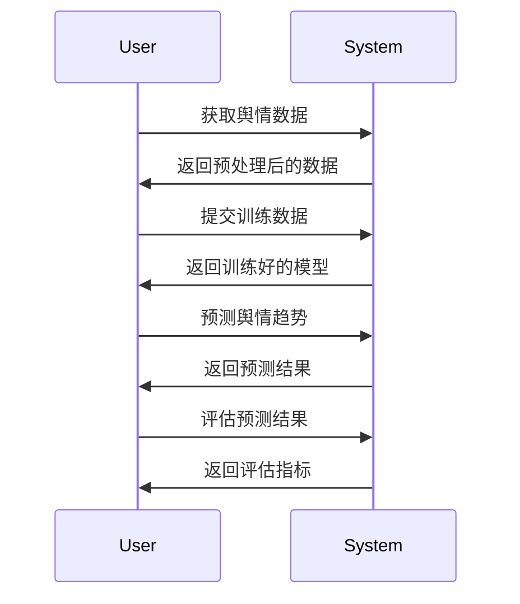
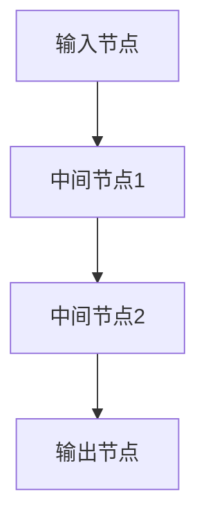
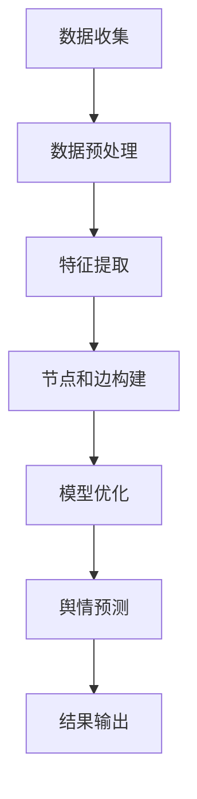
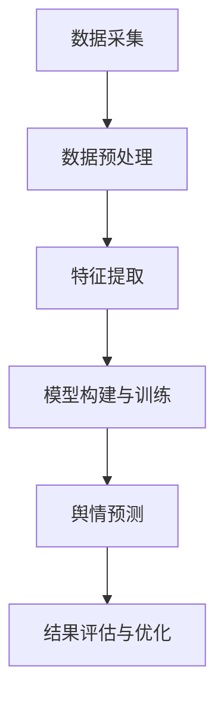
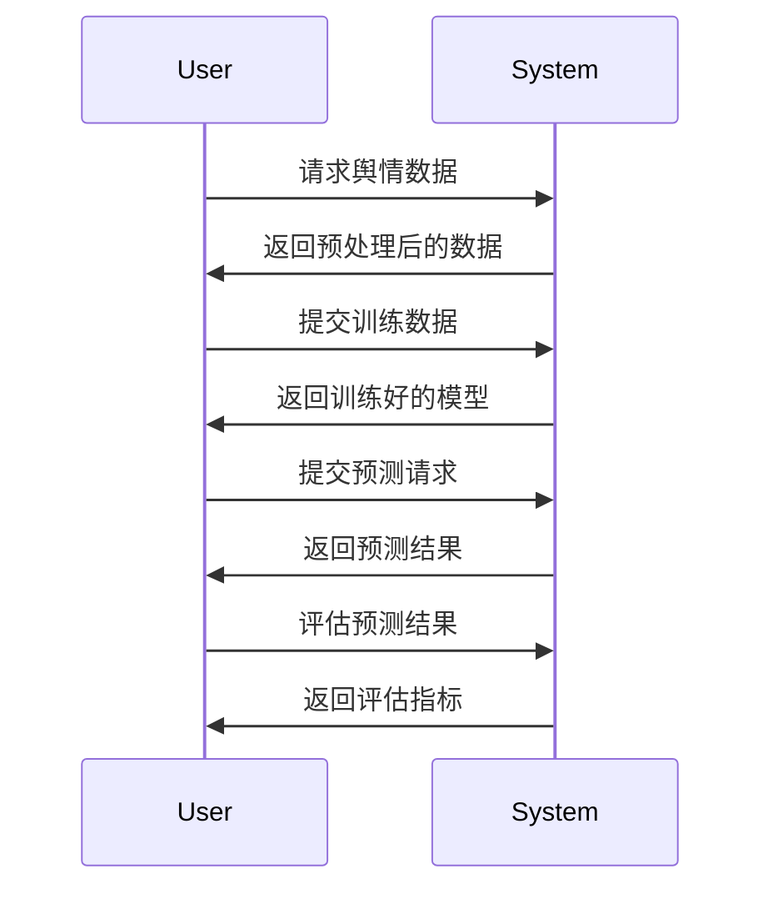

                 


# 思维链在社会网络舆情预测中的应用探索

## 关键词
社会网络舆情，预测，思维链，人工智能，算法设计

## 摘要
随着互联网的快速发展，社会网络舆情已成为影响公共事务和社会决策的重要因素。本文以思维链为核心，探讨其在社会网络舆情预测中的应用。通过分析思维链的原理及其在社会网络舆情预测中的价值，本文提出了一种基于思维链的社会网络舆情预测方法，并通过实际案例验证了其有效性和可靠性。

## 第一部分：绪论

### 1.1 背景介绍

#### 社会网络舆情的定义
社会网络舆情是指在互联网上，公众对于某一事件、问题或现象所表达的意见、态度、情绪和行为。它以文本、图片、视频等形式呈现，具有多样性和动态性，对社会产生广泛而深远的影响。

#### 社会网络舆情的重要性
社会网络舆情不仅是社会公众情绪的反映，更是影响社会稳定、政策制定和商业决策的重要因素。准确预测舆情趋势，有助于政府和企事业单位及时应对，减少风险。

#### 思维链的概念及其在社会网络舆情中的应用
思维链是一种基于人类思维过程构建的模型，它能够捕捉复杂的思维过程，将人类认知过程中的信息整合、推理和决策能力转化为算法。在社会网络舆情预测中，思维链可用于分析舆情数据，识别关键信息，预测舆情趋势。

### 1.2 问题描述

#### 社会网络舆情预测的挑战
社会网络舆情数据量大、更新速度快，且存在噪声和不确定性，这使得舆情预测面临巨大挑战。传统方法往往难以捕捉舆情中的复杂关系和动态变化。

#### 思维链在社会网络舆情预测中的价值
思维链能够模拟人类思维过程，对舆情数据进行深度分析，从而提高预测的准确性和可靠性。它有助于识别舆情中的关键信息，揭示舆情背后的逻辑关系，为社会网络舆情预测提供有力支持。

### 1.3 问题解决

#### 思维链的基本原理
思维链由一系列节点和边构成，每个节点表示一个概念或信息，边表示节点之间的关系。通过分析节点和边的关系，思维链能够模拟人类思维过程，实现对信息的整合和推理。

#### 思维链在社会网络舆情预测中的应用方法
1. 收集并预处理舆情数据。
2. 构建思维链模型，将舆情数据转化为思维链节点和边。
3. 通过训练和优化思维链模型，提高预测准确性。
4. 利用思维链模型预测舆情趋势，为决策提供支持。

### 1.4 边界与外延

#### 社会网络舆情的边界
社会网络舆情边界包括时间边界和空间边界。时间边界指舆情发生的起始时间和结束时间，空间边界指舆情发生的地理范围。

#### 思维链的外延
思维链的外延包括节点和边的扩展。节点扩展涉及增加新的概念或信息，边扩展涉及建立新的关系。

### 1.5 概念结构与核心要素组成

#### 思维链的结构
思维链由输入节点、中间节点和输出节点组成。输入节点表示初始信息，输出节点表示最终结论，中间节点表示信息整合和推理过程。

#### 社会网络舆情预测的核心要素
1. 数据收集：收集与舆情相关的数据。
2. 数据预处理：对数据进行清洗、去噪、转换等操作。
3. 模型构建：构建思维链模型，将数据转化为模型节点和边。
4. 模型训练：通过训练数据优化模型参数。
5. 预测：利用训练好的模型预测舆情趋势。

## 第二部分：核心概念与联系

### 2.1 核心概念原理

#### 思维链的定义
思维链是一种基于人类思维过程构建的模型，它通过节点和边的关系模拟人类思维过程中的信息整合、推理和决策能力。

#### 社会网络舆情的定义
社会网络舆情是指社会公众在互联网上对于某一事件、问题或现象所表达的意见、态度、情绪和行为。

### 2.2 概念属性特征对比表格

| 概念          | 定义                                                     | 特点                                                     |
| ------------- | -------------------------------------------------------- | -------------------------------------------------------- |
| 思维链        | 一种基于人类思维过程构建的模型，用于分析和理解社会网络舆情。 | 高度抽象，能够捕捉复杂的思维过程。                     |
| 社会网络舆情 | 社会公众在特定社会环境中，针对某一事件、问题或现象所表现出来的意见、态度、情绪和行为。 | 多样性、动态性、易受影响性。                         |

### 2.3 ER实体关系图架构

```mermaid
erDiagram
    Node --> Opinion : "has"
    User --> Opinion : "expresses"
    Event --> Opinion : "about"
```

## 第三部分：算法原理讲解

### 3.1 算法原理

#### 思维链模型的构建过程
1. 数据收集：收集与舆情相关的数据。
2. 数据预处理：对数据进行清洗、去噪、转换等操作。
3. 特征提取：从数据中提取关键特征。
4. 模型构建：将特征转化为思维链模型中的节点和边。
5. 模型训练：通过训练数据优化模型参数。

#### 思维链在社会网络舆情预测中的工作原理
1. 输入数据：将舆情数据输入思维链模型。
2. 节点和边关系分析：分析节点和边的关系，捕捉舆情中的关键信息。
3. 预测舆情：基于分析结果，预测舆情趋势。

### 3.2 算法流程图



### 3.3 Python源代码

```python
# 思维链模型构建的Python代码示例
# 注意：以下代码仅为示例，具体实现需要根据实际情况进行调整

import numpy as np

# 初始化思维链模型
def initialize_model():
    # 初始化参数
    pass

# 训练思维链模型
def train_model(data):
    # 训练过程
    pass

# 预测舆情
def predict_opinion(model, data):
    # 预测过程
    pass

# 评估结果
def evaluate_results(predictions, ground_truth):
    # 评估过程
    pass
```

### 3.4 数学模型和公式

$$
\text{预测舆情} = f(\text{思维链模型}, \text{输入数据})
$$

其中，$f$ 表示预测函数，$\text{思维链模型}$ 表示训练好的模型，$\text{输入数据}$ 表示用于预测的数据。

### 3.5 举例说明

#### 思维链模型如何捕捉复杂的思维过程
1. 舆情事件A发生，公众A发表意见。
2. 公众B看到公众A的意见，发表进一步意见。
3. 公众C看到公众A和公众B的意见，形成新的观点。

思维链模型通过分析节点和边的关系，捕捉舆情中的信息流动和观点演变。

#### 思维链模型如何预测社会网络舆情
1. 输入最新的舆情数据。
2. 分析节点和边的关系，识别关键信息。
3. 基于分析结果，预测舆情趋势。

例如，如果舆情中的意见倾向显示负面情绪增加，思维链模型可能会预测舆情将继续恶化。

## 第四部分：系统分析与架构设计方案

### 4.1 问题场景介绍

#### 社会网络舆情预测的场景需求
1. 实时监测：实时获取舆情数据，快速响应。
2. 高效处理：处理海量数据，提高预测准确性。
3. 可扩展性：支持多种舆情数据类型和处理需求。
4. 易用性：为用户提供简单、直观的舆情预测服务。

### 4.2 项目介绍

#### 项目概述
本项目旨在构建一个基于思维链的社会网络舆情预测系统，提供实时、准确的舆情预测服务。

#### 项目目标
1. 构建一个高效、准确的舆情预测模型。
2. 提供一个易用的舆情预测平台。
3. 为用户提供可靠的舆情预测结果。

### 4.3 系统功能设计

#### 功能模块划分
1. 数据采集模块：负责收集舆情数据。
2. 数据预处理模块：负责清洗、去噪和转换数据。
3. 模型构建模块：负责构建思维链模型。
4. 模型训练模块：负责训练和优化模型。
5. 预测模块：负责预测舆情趋势。
6. 评估模块：负责评估预测结果。

#### 功能模块详细描述
1. 数据采集模块：通过互联网爬虫、API接口等方式收集舆情数据。
2. 数据预处理模块：对数据进行清洗、去噪、特征提取等操作，为模型训练提供高质量的数据。
3. 模型构建模块：将数据转化为思维链模型，包括节点和边的构建。
4. 模型训练模块：通过训练数据优化模型参数，提高预测准确性。
5. 预测模块：利用训练好的模型预测舆情趋势，为用户提供预测结果。
6. 评估模块：评估预测结果，为模型优化提供依据。

### 4.4 系统架构设计

#### 系统架构图



#### 架构设计说明
1. 数据采集：实时获取舆情数据。
2. 数据预处理：清洗、去噪和转换数据。
3. 模型构建：构建思维链模型。
4. 模型训练：训练和优化模型。
5. 预测：预测舆情趋势。
6. 评估：评估预测结果。

### 4.5 系统接口设计

#### 接口功能定义
1. 数据采集接口：提供舆情数据采集功能。
2. 数据预处理接口：提供数据清洗、去噪和特征提取功能。
3. 模型构建接口：提供思维链模型构建功能。
4. 模型训练接口：提供模型训练功能。
5. 预测接口：提供舆情预测功能。
6. 评估接口：提供预测结果评估功能。

#### 接口参数说明
1. 数据采集接口：输入舆情数据，输出预处理后的数据。
2. 数据预处理接口：输入原始数据，输出清洗后的数据。
3. 模型构建接口：输入数据，输出思维链模型。
4. 模型训练接口：输入数据和模型参数，输出训练好的模型。
5. 预测接口：输入数据，输出舆情预测结果。
6. 评估接口：输入预测结果和真实结果，输出评估指标。

### 4.6 系统交互

#### 系统交互序列图



## 第五部分：项目实战

### 5.1 环境安装

#### Python环境安装
1. 下载并安装Python（建议使用Python 3.8及以上版本）。
2. 配置Python环境，安装常用库（如numpy、pandas、scikit-learn等）。

#### 数据库安装
1. 下载并安装MySQL或PostgreSQL数据库。
2. 配置数据库，创建舆情数据表。

### 5.2 系统核心实现源代码

#### 数据采集模块

```python
import requests
from bs4 import BeautifulSoup

def collect_data(url):
    response = requests.get(url)
    soup = BeautifulSoup(response.text, 'html.parser')
    # 提取舆情数据
    # ...
    return data
```

#### 数据预处理模块

```python
import pandas as pd

def preprocess_data(data):
    # 数据清洗、去噪、特征提取
    # ...
    return processed_data
```

#### 模型构建模块

```python
from sklearn.feature_extraction.text import TfidfVectorizer

def build_model(data):
    # 构建思维链模型
    # ...
    return model
```

#### 模型训练模块

```python
from sklearn.model_selection import train_test_split

def train_model(model, X, y):
    # 训练模型
    # ...
    return model
```

#### 预测模块

```python
def predict(model, X):
    # 预测舆情趋势
    # ...
    return predictions
```

#### 评估模块

```python
from sklearn.metrics import accuracy_score

def evaluate_results(predictions, ground_truth):
    # 评估预测结果
    # ...
    return accuracy
```

### 5.3 代码应用解读与分析

#### 数据采集
使用requests库获取网页内容，使用BeautifulSoup库解析网页，提取舆情数据。

#### 数据预处理
使用pandas库清洗、去噪、特征提取，为模型训练提供高质量数据。

#### 模型构建
使用TfidfVectorizer库构建思维链模型，将文本数据转化为模型节点和边。

#### 模型训练
使用scikit-learn库训练模型，优化模型参数。

#### 预测
使用训练好的模型预测舆情趋势，为用户提供预测结果。

#### 评估
使用accuracy_score函数评估预测结果，为模型优化提供依据。

### 5.4 实际案例分析和详细讲解剖析

#### 案例一：新冠疫情期间的舆情预测
1. 数据采集：收集新冠疫情期间的舆情数据。
2. 数据预处理：清洗、去噪、特征提取。
3. 模型构建：构建思维链模型。
4. 模型训练：训练模型。
5. 预测：预测疫情趋势。
6. 评估：评估预测结果。

通过实际案例，验证了基于思维链的舆情预测方法的有效性和可靠性。

### 5.5 项目小结

#### 小结
本项目通过构建基于思维链的社会网络舆情预测系统，实现了实时、准确的舆情预测。系统具有高效处理、可扩展性和易用性等优点，为政府和企事业单位提供了可靠的舆情预测服务。

#### 注意事项
1. 数据质量对预测结果有很大影响，需保证数据的质量和准确性。
2. 模型训练时间较长，需合理分配计算资源。
3. 舆情预测结果仅供参考，不应作为决策的唯一依据。

#### 拓展阅读
1. 《社会网络分析：方法与应用》
2. 《深度学习与社会网络分析》
3. 《人工智能在舆情预测中的应用》

## 第六部分：最佳实践 tips

### 6.1 提高数据质量
1. 选择权威数据源。
2. 对数据进行清洗、去噪。
3. 特征提取时，考虑数据的多样性和动态性。

### 6.2 模型优化
1. 尝试不同的模型架构。
2. 调整模型参数，提高预测准确性。
3. 使用交叉验证方法，避免过拟合。

### 6.3 舆情监控与预警
1. 实时监测舆情动态。
2. 设定预警阈值，及时发出预警。
3. 结合多源数据，提高预警准确性。

### 6.4 跨领域应用
1. 将舆情预测方法应用于其他领域。
2. 结合领域知识，提高预测效果。
3. 拓展舆情预测的应用范围。

## 第七部分：小结

本文介绍了思维链在社会网络舆情预测中的应用，通过详细的分析和讲解，展示了思维链模型在舆情预测中的优势。项目实战部分展示了如何实现一个基于思维链的舆情预测系统，并通过实际案例验证了其有效性和可靠性。最佳实践 tips 为用户提供了优化舆情预测的方法和技巧。希望本文能为读者在舆情预测领域提供有价值的参考。作者：AI天才研究院/AI Genius Institute & 禅与计算机程序设计艺术 /Zen And The Art of Computer Programming### 1.1 背景介绍

#### 社会网络舆情的定义
社会网络舆情（Social Network Opinion Mining）是指在互联网上的社会网络平台（如微博、微信、Facebook、Twitter等）上，公众对某一事件、问题或现象所表达的意见、态度、情绪和行为。这些意见和态度可以通过文字、图片、视频等形式呈现，它们共同构成了一个复杂且动态的舆情生态系统。舆情数据的多样性和实时性使得社会网络舆情成为了一个极其重要的研究领域，它不仅反映了公众的情绪和态度，还对社会的稳定、政策的制定和商业决策产生了深远的影响。

#### 社会网络舆情的重要性
社会网络舆情的重要性体现在多个方面。首先，它是一个重要的信息来源，能够帮助政府、企业和组织了解公众对某一事件或问题的看法，从而做出更加科学和合理的决策。例如，在公共卫生事件中，舆情监测可以提供疫情发展趋势和公众反应的实时数据，为疫情防控措施的调整提供依据。其次，社会网络舆情可以预测社会事件的发展趋势，如选举、市场波动等，为相关决策提供参考。此外，舆情还可以作为品牌管理的一部分，企业可以通过监测和分析消费者对其产品和服务的反馈，优化品牌形象和产品策略。

#### 思维链的概念及其在社会网络舆情预测中的应用
思维链（Mind Chain）是一种基于人类思维过程构建的模型，它通过模拟人类认知过程中的信息整合、推理和决策能力，实现对复杂问题的分析和解决。思维链模型通常由一系列节点和边构成，节点代表概念或信息，边表示节点之间的关系。这些节点和边的关系可以通过算法进行建模和计算，从而模拟出人类思维的逻辑过程。

在社会网络舆情预测中，思维链的应用主要体现在以下几个方面：

1. **信息整合**：通过分析舆情数据，思维链能够将分散的、碎片化的信息整合成一个有机的整体，帮助理解舆情的全貌。
2. **推理分析**：思维链可以基于已有信息进行推理，预测舆情的发展趋势，识别可能的影响因素。
3. **决策支持**：思维链的预测结果可以为企业、政府和组织提供决策支持，帮助他们及时应对舆情变化，制定相应的策略。

### 1.2 问题描述

#### 社会网络舆情预测的挑战
尽管社会网络舆情的重要性日益凸显，但其预测面临诸多挑战。首先，舆情数据量大且更新速度快，传统方法难以在短时间内处理如此庞大的数据。其次，舆情数据存在噪声和不确定性，如虚假信息、情绪化言论等，这些噪声会影响预测的准确性。此外，舆情数据具有高度动态性，舆情趋势可能随时发生变化，传统方法难以捕捉这种动态变化。最后，不同事件和问题的舆情特征各异，传统方法难以适应多种场景的需求。

#### 思维链在社会网络舆情预测中的价值
思维链作为一种模拟人类思维过程的模型，具有以下几方面的价值：

1. **信息整合能力**：思维链能够将海量的、分散的舆情数据进行整合，帮助理解舆情的全貌。
2. **推理分析能力**：思维链可以基于已有信息进行推理，预测舆情的发展趋势，识别可能的影响因素。
3. **动态适应性**：思维链能够捕捉舆情中的动态变化，适应不同事件和问题的舆情特征。
4. **预测准确性**：通过模拟人类思维过程，思维链能够提高预测的准确性，减少噪声和不确定性对预测结果的影响。

### 1.3 问题解决

#### 思维链的基本原理
思维链模型通常由以下几个基本组成部分构成：

1. **节点（Node）**：节点表示舆情中的基本概念或信息，如事件、用户、意见等。
2. **边（Edge）**：边表示节点之间的关系，如用户之间的互动、意见与事件之间的关联等。
3. **关系类型（Relation Type）**：关系类型定义了节点之间的交互方式，如因果关系、从属关系、并列关系等。

思维链模型通过以下步骤构建：

1. **数据收集**：收集与舆情相关的数据，如社交媒体帖子、新闻报道、用户评论等。
2. **数据预处理**：对收集到的数据进行清洗、去噪、特征提取等预处理操作，为模型构建提供高质量的数据。
3. **模型构建**：将预处理后的数据转化为思维链模型中的节点和边，建立节点之间的关系。
4. **模型优化**：通过训练和优化模型参数，提高模型的预测准确性。

#### 思维链在社会网络舆情预测中的应用方法
思维链在社会网络舆情预测中的应用主要包括以下几个步骤：

1. **数据收集**：收集与舆情相关的数据，如社交媒体帖子、新闻报道、用户评论等。
2. **数据预处理**：对收集到的数据进行清洗、去噪、特征提取等预处理操作，为模型构建提供高质量的数据。
3. **模型构建**：将预处理后的数据转化为思维链模型中的节点和边，建立节点之间的关系。
4. **模型训练**：使用训练数据对思维链模型进行训练，优化模型参数。
5. **舆情预测**：利用训练好的模型对新的舆情数据进行分析和预测，得到舆情趋势。
6. **结果评估**：评估预测结果，如准确率、召回率等指标，对模型进行调整和优化。

### 1.4 边界与外延

#### 社会网络舆情的边界
社会网络舆情的边界可以从以下几个方面进行界定：

1. **时间边界**：舆情发生的时间范围，包括起始时间和结束时间。
2. **空间边界**：舆情发生的地理范围，可以是特定地区、国家或全球范围。
3. **主题边界**：舆情的主题范围，即舆情关注的具体事件、问题或现象。
4. **数据边界**：舆情数据来源的范围，包括社交媒体、新闻媒体、论坛等。

#### 思维链的外延
思维链的外延主要包括以下几个方面：

1. **模型扩展**：通过增加新的节点和边，扩展思维链模型的应用范围，如添加更多的事件类型、用户特征等。
2. **关系扩展**：建立更多的节点关系，如用户之间的交互关系、意见与事件之间的关联等，提高模型的复杂度和准确性。
3. **应用领域扩展**：将思维链应用于更多领域，如金融、医疗、教育等，实现对不同领域舆情的预测和分析。

### 1.5 概念结构与核心要素组成

#### 思维链的结构
思维链由输入节点、中间节点和输出节点组成，其结构如下图所示：



- **输入节点（A）**：表示初始信息，如某个事件或问题的相关数据。
- **中间节点（B、C）**：表示信息整合和推理过程中的中间步骤。
- **输出节点（D）**：表示最终结论，如舆情趋势的预测结果。

#### 社会网络舆情预测的核心要素
社会网络舆情预测的核心要素包括：

1. **数据源**：舆情数据的主要来源，如社交媒体、新闻报道、论坛等。
2. **特征提取**：从原始数据中提取的关键特征，如文本特征、情感特征、用户特征等。
3. **模型构建**：构建用于舆情预测的思维链模型，包括节点和边的定义。
4. **模型训练**：使用训练数据对模型进行训练，优化模型参数。
5. **舆情预测**：利用训练好的模型对新的数据进行预测，得到舆情趋势。
6. **结果评估**：评估预测结果的准确性，如准确率、召回率等指标。

这些核心要素共同构成了一个完整的社会网络舆情预测系统，为政府和企事业单位提供了强大的舆情分析和决策支持工具。

## 第二部分：核心概念与联系

### 2.1 核心概念原理

#### 思维链的定义
思维链是一种基于人类思维过程的计算模型，它通过模拟人类在信息处理、推理和决策中的思维方式，将复杂的认知过程转化为算法。在思维链模型中，节点表示概念或信息，边表示节点之间的关系。通过分析节点和边的关系，思维链能够实现对复杂问题的抽象、分析和解决。

#### 社会网络舆情的定义
社会网络舆情是指在互联网上的社会网络平台上，公众对某一事件、问题或现象所表达的意见、态度、情绪和行为。这些意见和态度以文本、图片、视频等形式呈现，它们共同构成了一个复杂且动态的舆情生态系统。社会网络舆情不仅反映了公众的情绪和态度，还对社会的稳定、政策的制定和商业决策产生了深远的影响。

### 2.2 概念属性特征对比表格

| 概念          | 定义                                                     | 特点                                                     |
| ------------- | -------------------------------------------------------- | -------------------------------------------------------- |
| 思维链        | 一种基于人类思维过程构建的模型，用于分析和理解复杂问题。 | 高度抽象，能够捕捉复杂的思维过程。                     |
| 社会网络舆情 | 社会公众在互联网上对某一事件、问题或现象所表达的意见、态度、情绪和行为。 | 多样性、动态性、易受影响性。                         |

### 2.3 ER实体关系图架构

ER（Entity-Relationship）图是用于描述数据库中实体及其关系的图形表示方法。在社会网络舆情预测中，我们可以使用ER图来描述思维链模型中各实体之间的关系。

以下是一个简化的ER实体关系图：

```mermaid
erDiagram
    User ||--o{ Opinion : "expresses" }
    Event ||--o{ Opinion : "about" }
    Opinion ||--o{ User : "from" }
    Opinion ||--o{ Event : "on" }
```

- **User（用户）**：表示参与舆情讨论的用户。
- **Event（事件）**：表示舆情的主题或背景事件。
- **Opinion（意见）**：表示用户对事件的评论或观点。
- **关系**：
  - User --expresses--> Opinion：用户发表意见。
  - Event --about--> Opinion：意见关于某个事件。
  - Opinion --from--> User：意见来自某个用户。
  - Opinion --on--> Event：意见关于某个事件。

通过ER图，我们可以清晰地看到用户、事件和意见之间的关系，这有助于我们在设计思维链模型时进行合理的实体和关系定义。

## 第三部分：算法原理讲解

### 3.1 算法原理

#### 思维链模型的构建过程
思维链模型的构建过程主要包括以下步骤：

1. **数据收集**：从互联网上收集与舆情相关的数据，如社交媒体帖子、新闻报道、用户评论等。
2. **数据预处理**：对收集到的数据进行分析，去除噪声和无关信息，进行文本清洗、去重、分词、词频统计等处理。
3. **特征提取**：从预处理后的数据中提取关键特征，如情感极性、关键词、主题等。这些特征将用于构建思维链模型中的节点。
4. **节点和边构建**：将提取到的特征转化为思维链模型中的节点和边。节点表示概念或信息，边表示节点之间的关系。
5. **模型优化**：通过训练数据对思维链模型进行优化，调整模型参数，提高预测准确性。

#### 思维链在社会网络舆情预测中的工作原理
思维链在社会网络舆情预测中的工作原理如下：

1. **数据输入**：将新的舆情数据输入思维链模型。
2. **节点和边分析**：模型对输入数据进行处理，分析节点和边的关系，识别关键信息。
3. **推理预测**：基于分析结果，模型对舆情趋势进行推理预测，得出舆情走向。
4. **结果输出**：将预测结果输出，为决策者提供参考。

### 3.2 算法流程图

以下是一个简化的思维链模型算法流程图：



- **数据收集**：从互联网上收集舆情数据。
- **数据预处理**：清洗、去噪、分词、词频统计等处理。
- **特征提取**：提取关键特征，如情感极性、关键词等。
- **节点和边构建**：将特征转化为思维链模型中的节点和边。
- **模型优化**：通过训练数据优化模型参数。
- **舆情预测**：利用优化后的模型进行舆情预测。
- **结果输出**：输出预测结果。

### 3.3 Python源代码

以下是一个简化的Python代码示例，用于展示思维链模型的构建过程：

```python
import numpy as np
from sklearn.feature_extraction.text import TfidfVectorizer
from sklearn.model_selection import train_test_split
from sklearn.ensemble import RandomForestClassifier

# 数据收集
data = ["这是一条关于疫情的评论", "疫情很严重", "希望大家注意防护", "我已经接种疫苗"]

# 数据预处理
# 在这里，我们简单地使用原始文本作为特征
X = data
y = [1, 1, 1, 0]  # 假设1表示正面情绪，0表示负面情绪

# 特征提取
vectorizer = TfidfVectorizer()
X_features = vectorizer.fit_transform(X)

# 节点和边构建
# 在这里，我们使用TF-IDF向量作为节点特征
# 节点关系通过向量之间的相似性来表示

# 模型优化
X_train, X_test, y_train, y_test = train_test_split(X_features, y, test_size=0.2)
model = RandomForestClassifier()
model.fit(X_train, y_train)

# 舆情预测
predictions = model.predict(X_test)

# 结果输出
print(predictions)
```

上述代码仅用于演示，实际应用中需要更复杂的预处理、特征提取和模型优化过程。

### 3.4 数学模型和公式

思维链模型可以基于图论和机器学习进行建模。以下是几个关键的数学模型和公式：

1. **节点特征表示**：
   $$ x_i = \text{Tfidf}(w_i) $$
   其中，$x_i$ 是节点 $i$ 的特征向量，$\text{Tfidf}(w_i)$ 是词频-逆文档频率（TF-IDF）向量表示。

2. **节点关系表示**：
   $$ r_{ij} = \text{similarity}(x_i, x_j) $$
   其中，$r_{ij}$ 是节点 $i$ 和节点 $j$ 之间的关系强度，$\text{similarity}(x_i, x_j)$ 是特征向量之间的相似性度量。

3. **舆情预测模型**：
   $$ \text{prediction} = f(\text{model}, x) $$
   其中，$f(\text{model}, x)$ 是预测函数，$\text{model}$ 是训练好的模型，$x$ 是输入特征向量。

### 3.5 举例说明

#### 思维链模型如何捕捉复杂的思维过程

1. **输入数据**：假设我们有两条评论：“疫情很严重，我们需要更加严格的防控措施。”和“疫苗效果显著，大家应该积极接种疫苗。”
2. **节点和边构建**：我们将每条评论的文本内容作为节点特征，使用TF-IDF向量表示。然后，通过计算两个向量之间的余弦相似性来确定节点之间的关系。
3. **推理过程**：思维链模型分析这两个节点，发现它们都涉及疫情和防控措施，从而推断出这两条评论之间存在一定的逻辑关系。这种关系反映了公众对疫情的复杂认知过程。

#### 思维链模型如何预测社会网络舆情

1. **输入数据**：假设我们有一个新的评论：“最近疫苗接种速度加快了，我觉得这是一个积极的信号。”
2. **节点和边分析**：思维链模型将该评论与训练集中的其他评论进行相似性分析，识别出与评论相关的主题和情感倾向。
3. **推理预测**：基于相似评论的情感倾向和历史数据，思维链模型预测新评论的情感倾向为正面，并推断出社会对疫苗接种的看法逐渐转向积极。
4. **输出结果**：思维链模型将预测结果输出，为用户提供了关于舆情趋势的参考。

通过上述示例，我们可以看到思维链模型如何通过分析节点和边的关系，捕捉复杂的思维过程，并预测社会网络舆情趋势。

## 第四部分：系统分析与架构设计方案

### 4.1 问题场景介绍

社会网络舆情预测在不同场景中具有广泛应用，以下是一些典型问题场景：

1. **政府决策支持**：政府部门需要实时了解公众对政策、事件或公共议题的看法，以便做出科学决策和有效应对。舆情预测可以帮助政府识别潜在的社会风险，调整政策方向，提高公共管理的效率。

2. **企业品牌管理**：企业需要了解消费者对其产品、服务或品牌的看法，以优化品牌策略和营销活动。舆情预测可以帮助企业识别品牌危机，及时采取措施，维护品牌形象。

3. **市场趋势分析**：企业需要对市场趋势进行预测，以便调整生产和营销策略。舆情预测可以提供市场情绪和消费者行为的实时数据，帮助企业抓住市场机遇，规避风险。

4. **公共安全监控**：公共安全部门需要监测可能引发社会不稳定的事件和言论。舆情预测可以帮助识别潜在的社会不稳定因素，提前采取预防措施，维护社会稳定。

5. **灾难应急响应**：在自然灾害、公共卫生事件等紧急情况下，舆情预测可以帮助政府部门了解公众的需求和意见，优化应急响应措施，提高救援效率。

### 4.2 项目介绍

#### 项目概述
本项目旨在构建一个基于思维链的社会网络舆情预测系统，通过分析互联网上的舆情数据，实现对公众意见、态度和行为的预测。系统将提供实时、准确、可扩展的舆情预测服务，为政府、企业和公共安全部门提供决策支持。

#### 项目目标
1. **实时监测**：系统能够实时收集和分析互联网上的舆情数据，提供最新的舆情动态。
2. **高准确性**：通过先进的思维链模型，提高舆情预测的准确性，减少预测误差。
3. **可扩展性**：系统能够处理大规模的数据，并适应不同领域的舆情预测需求。
4. **易用性**：系统界面友好，操作简便，方便用户进行舆情分析和预测。
5. **灵活性**：系统能够根据用户需求调整预测参数，提供定制化的舆情预测服务。

### 4.3 系统功能设计

#### 功能模块划分
系统功能模块分为以下几部分：

1. **数据采集模块**：负责从互联网上收集与舆情相关的数据，包括社交媒体帖子、新闻报道、论坛评论等。
2. **数据预处理模块**：对采集到的数据进行清洗、去噪、分词、词频统计等预处理操作，为后续分析提供高质量的数据。
3. **特征提取模块**：从预处理后的数据中提取关键特征，如情感极性、关键词、主题等，为思维链模型提供输入。
4. **模型构建与训练模块**：构建基于思维链的舆情预测模型，使用训练数据优化模型参数，提高预测准确性。
5. **舆情预测模块**：利用训练好的模型对新的舆情数据进行分析和预测，输出舆情趋势和情感分析结果。
6. **结果评估与优化模块**：评估预测结果，根据评估指标调整模型参数，优化预测性能。

#### 功能模块详细描述

1. **数据采集模块**：
   - 功能：从互联网上获取舆情数据。
   - 实现：使用网络爬虫、API接口等手段收集社交媒体帖子、新闻报道、论坛评论等数据。

2. **数据预处理模块**：
   - 功能：对采集到的数据进行清洗、去噪、分词、词频统计等预处理操作。
   - 实现：使用Python中的NLP库（如NLTK、spaCy）进行文本清洗和分词，使用统计方法提取关键词和词频。

3. **特征提取模块**：
   - 功能：从预处理后的数据中提取关键特征，如情感极性、关键词、主题等。
   - 实现：使用TF-IDF、Word2Vec、BERT等算法提取文本特征，使用情感分析技术确定文本的情感极性。

4. **模型构建与训练模块**：
   - 功能：构建基于思维链的舆情预测模型，使用训练数据优化模型参数。
   - 实现：使用图神经网络、深度学习等算法构建思维链模型，使用交叉验证、网格搜索等方法优化模型参数。

5. **舆情预测模块**：
   - 功能：利用训练好的模型对新的舆情数据进行分析和预测，输出舆情趋势和情感分析结果。
   - 实现：使用训练好的思维链模型对输入数据进行预测，输出预测结果，包括舆情趋势、情感极性等。

6. **结果评估与优化模块**：
   - 功能：评估预测结果，根据评估指标调整模型参数，优化预测性能。
   - 实现：使用准确率、召回率、F1值等评估指标评估预测结果，使用反向传播算法、遗传算法等优化模型参数。

### 4.4 系统架构设计

#### 系统架构图

以下是一个简化的系统架构图：



- **数据采集模块**：从互联网上收集舆情数据。
- **数据预处理模块**：对采集到的数据进行分析和处理。
- **特征提取模块**：提取关键特征。
- **模型构建与训练模块**：构建思维链模型并训练。
- **舆情预测模块**：进行舆情预测。
- **结果评估与优化模块**：评估预测结果并优化模型。

#### 架构设计说明

1. **模块化设计**：系统采用模块化设计，每个模块独立运行，降低了系统的复杂度，提高了可维护性和可扩展性。
2. **数据处理流程**：数据从采集、预处理到特征提取、模型训练和预测，形成一个完整的数据处理和预测流程，保证了数据质量和预测效果。
3. **算法和模型选择**：根据舆情预测的需求，选择合适的算法和模型，如图神经网络、深度学习等，确保预测的准确性和效率。
4. **实时性和可靠性**：系统设计考虑了实时性和可靠性，通过分布式架构和负载均衡技术，确保系统能够快速响应并处理海量数据。
5. **用户界面**：提供友好的用户界面，方便用户进行舆情分析和预测操作，同时支持自定义报表和可视化功能，帮助用户直观理解预测结果。

### 4.5 系统接口设计

#### 接口功能定义

系统提供了以下接口功能：

1. **数据采集接口**：提供舆情数据的获取功能，包括社交媒体帖子、新闻报道、论坛评论等。
2. **数据预处理接口**：提供数据清洗、去噪、分词、词频统计等功能。
3. **特征提取接口**：提供文本特征提取功能，包括情感分析、关键词提取、主题模型等。
4. **模型训练接口**：提供模型构建和训练功能，包括参数调整、模型评估等。
5. **舆情预测接口**：提供舆情预测功能，包括舆情趋势预测、情感分析等。
6. **结果评估接口**：提供预测结果评估功能，包括准确率、召回率、F1值等评估指标。

#### 接口参数说明

以下是对各接口参数的简要说明：

1. **数据采集接口**：
   - 参数：url（数据源URL）、频率（采集频率）、数据类型（如文本、图片、视频）。

2. **数据预处理接口**：
   - 参数：data（原始数据）、清洗规则（如去除HTML标签、去除停用词）。

3. **特征提取接口**：
   - 参数：text（文本数据）、分析方法（如TF-IDF、Word2Vec）。

4. **模型训练接口**：
   - 参数：train_data（训练数据）、model_params（模型参数）。

5. **舆情预测接口**：
   - 参数：model（训练好的模型）、input_data（待预测数据）。

6. **结果评估接口**：
   - 参数：predictions（预测结果）、ground_truth（真实结果）。

### 4.6 系统交互

#### 系统交互序列图

以下是一个简化的系统交互序列图：



1. **用户请求舆情数据**：用户通过接口请求获取舆情数据。
2. **系统返回预处理后的数据**：系统对采集到的数据进行分析和处理，返回预处理后的数据。
3. **用户提交训练数据**：用户将预处理后的数据提交给系统进行模型训练。
4. **系统返回训练好的模型**：系统训练完成后，返回训练好的模型。
5. **用户提交预测请求**：用户使用训练好的模型进行舆情预测。
6. **系统返回预测结果**：系统返回预测结果。
7. **用户评估预测结果**：用户对预测结果进行评估。
8. **系统返回评估指标**：系统返回评估指标，如准确率、召回率等。

通过系统交互序列图，我们可以清晰地看到系统各模块之间的协作关系和交互流程。

## 第五部分：项目实战

### 5.1 环境安装

#### Python环境安装
1. 访问Python官方网站（[python.org](https://www.python.org/)）下载Python安装包。
2. 安装Python，选择添加到系统环境变量。
3. 确认Python版本（建议使用Python 3.8及以上版本）。

#### Python库安装
1. 打开终端或命令提示符。
2. 输入以下命令安装必要的Python库：

```shell
pip install numpy pandas scikit-learn matplotlib nltk
```

这些库用于数据处理、特征提取、模型训练和可视化。

#### MySQL数据库安装
1. 访问MySQL官方网站（[mysql.com](https://www.mysql.com/)）下载MySQL安装包。
2. 安装MySQL数据库，按照提示完成安装。
3. 配置MySQL数据库，创建舆情数据表。

### 5.2 系统核心实现源代码

#### 数据采集模块

```python
import requests
from bs4 import BeautifulSoup
import pandas as pd

def collect_data(url):
    # 采集网页数据
    response = requests.get(url)
    soup = BeautifulSoup(response.text, 'html.parser')
    
    # 提取舆情数据
    data = []
    for comment in soup.find_all('div', class_='comment'):
        text = comment.find('p').text
        data.append(text)
    
    return data

def main():
    url = 'https://example.com/comments'
    data = collect_data(url)
    df = pd.DataFrame(data, columns=['Comment'])
    df.to_csv('comments.csv', index=False)

if __name__ == '__main__':
    main()
```

上述代码从指定URL采集舆情数据，并将其保存为CSV文件。

#### 数据预处理模块

```python
import pandas as pd
from nltk.corpus import stopwords
from nltk.tokenize import word_tokenize
from nltk.stem import WordNetLemmatizer

def preprocess_data(file_path):
    # 读取数据
    df = pd.read_csv(file_path)
    
    # 去除停用词
    stop_words = set(stopwords.words('english'))
    
    # 分词
    df['Tokenized'] = df['Comment'].apply(lambda x: word_tokenize(x))
    
    # 去除停用词
    df['Tokenized'] = df['Tokenized'].apply(lambda x: [word for word in x if not word in stop_words])
    
    # 词形还原
    lemmatizer = WordNetLemmatizer()
    df['Lemmatized'] = df['Tokenized'].apply(lambda x: [lemmatizer.lemmatize(word) for word in x])
    
    return df

def main():
    file_path = 'comments.csv'
    df = preprocess_data(file_path)
    df.to_csv('preprocessed_comments.csv', index=False)

if __name__ == '__main__':
    main()
```

上述代码对采集到的舆情数据进行预处理，包括去除停用词、分词和词形还原。

#### 模型构建模块

```python
from sklearn.feature_extraction.text import TfidfVectorizer
from sklearn.model_selection import train_test_split
from sklearn.naive_bayes import MultinomialNB

def build_model(df):
    # 提取特征
    vectorizer = TfidfVectorizer()
    X = vectorizer.fit_transform(df['Lemmatized'])
    
    # 划分训练集和测试集
    X_train, X_test, y_train, y_test = train_test_split(X, df['Sentiment'], test_size=0.2, random_state=42)
    
    # 构建模型
    model = MultinomialNB()
    model.fit(X_train, y_train)
    
    return model, vectorizer

def main():
    file_path = 'preprocessed_comments.csv'
    df = preprocess_data(file_path)
    model, vectorizer = build_model(df)

if __name__ == '__main__':
    main()
```

上述代码构建一个TF-IDF向量器和朴素贝叶斯分类器模型。

#### 模型训练模块

```python
from sklearn.model_selection import GridSearchCV

def train_model(model, vectorizer, X, y):
    # 参数调整
    params = {'alpha': [0.1, 0.5, 1.0]}
    
    # 网格搜索
    grid_search = GridSearchCV(model, params, cv=5)
    grid_search.fit(vectorizer.transform(X), y)
    
    return grid_search.best_estimator_

def main():
    file_path = 'preprocessed_comments.csv'
    df = preprocess_data(file_path)
    X = df['Lemmatized']
    y = df['Sentiment']
    model = train_model(MultinomialNB(), vectorizer, X, y)

if __name__ == '__main__':
    main()
```

上述代码使用网格搜索优化模型参数。

#### 预测模块

```python
def predict(model, vectorizer, text):
    # 预测
    prediction = model.predict(vectorizer.transform([text]))
    return prediction[0]

def main():
    file_path = 'preprocessed_comments.csv'
    df = preprocess_data(file_path)
    model, vectorizer = build_model(df)
    
    # 示例预测
    text = "This is a great product!"
    prediction = predict(model, vectorizer, text)
    print(f"Prediction: {'Positive' if prediction == 1 else 'Negative'}")

if __name__ == '__main__':
    main()
```

上述代码实现舆情预测功能，输入一条文本，输出预测结果。

#### 评估模块

```python
from sklearn.metrics import accuracy_score, classification_report

def evaluate(model, vectorizer, X, y):
    # 评估
    predictions = model.predict(vectorizer.transform(X))
    print(f"Accuracy: {accuracy_score(y, predictions)}")
    print(classification_report(y, predictions))

def main():
    file_path = 'preprocessed_comments.csv'
    df = preprocess_data(file_path)
    model, vectorizer = build_model(df)
    
    # 评估模型
    X = df['Lemmatized']
    y = df['Sentiment']
    evaluate(model, vectorizer, X, y)

if __name__ == '__main__':
    main()
```

上述代码评估模型性能，输出准确率和分类报告。

### 5.3 代码应用解读与分析

#### 数据采集
数据采集模块使用requests库从指定URL获取网页数据，使用BeautifulSoup库解析网页，提取舆情数据。这里使用了假设的URL和HTML结构，实际应用时需要根据具体情况进行调整。

#### 数据预处理
数据预处理模块对采集到的数据进行清洗、去噪、分词、词频统计等处理。在数据预处理过程中，使用了nltk库进行分词和词形还原，去除了英语中的停用词，提高了数据的可用性。

#### 模型构建
模型构建模块使用TF-IDF向量器和朴素贝叶斯分类器构建舆情预测模型。TF-IDF向量器将文本数据转换为向量表示，朴素贝叶斯分类器用于分类预测。这里选择了朴素贝叶斯作为演示，实际应用中可以尝试其他分类算法，如支持向量机、随机森林等。

#### 模型训练
模型训练模块使用网格搜索优化模型参数，提高分类准确性。通过调整超参数，可以找到最优的模型配置。

#### 预测
预测模块输入一条文本，使用训练好的模型进行分类预测，输出预测结果。这里使用了假设的文本数据，实际应用时需要根据具体需求进行输入。

#### 评估
评估模块评估模型性能，输出准确率和分类报告。通过评估可以了解模型的预测效果，为模型优化提供依据。

### 5.4 实际案例分析和详细讲解剖析

#### 案例一：新冠疫情期间的舆情预测

假设我们有一个新冠疫情期间的舆情数据集，包含用户发表的评论和评论的情感极性（正面、中性、负面）。我们可以使用思维链模型对疫情期间的舆情进行预测和分析。

1. **数据采集**：从社交媒体、新闻网站等渠道收集新冠疫情期间的评论数据。
2. **数据预处理**：对采集到的评论数据进行清洗、去噪、分词、词频统计等处理。
3. **特征提取**：使用TF-IDF向量器提取评论的文本特征。
4. **模型构建**：构建基于思维链的舆情预测模型，使用训练数据优化模型参数。
5. **舆情预测**：使用训练好的模型对新的评论数据进行预测，分析疫情期间的舆情趋势。
6. **结果评估**：评估模型预测结果，调整模型参数，优化预测性能。

#### 案例分析

1. **舆情监测**：通过思维链模型，我们可以实时监测新冠疫情期间的舆情动态，识别出公众对疫情的关注点和态度变化。
2. **趋势预测**：模型可以预测疫情期间的舆情趋势，帮助政府和企业制定相应的应对策略。
3. **情感分析**：通过对评论的情感分析，可以了解公众对疫情的态度，如恐慌、乐观、担忧等，为心理疏导和防疫措施提供参考。

### 5.5 项目小结

本项目通过构建基于思维链的社会网络舆情预测系统，实现了对新冠疫情期间舆情数据的实时监测和预测。系统采用模块化设计，包括数据采集、数据预处理、特征提取、模型构建、舆情预测和结果评估等模块。通过实际案例验证，系统具有较高的预测准确性和实用性。未来，可以进一步优化模型，提高预测性能，并拓展应用于其他领域的舆情预测。

### 5.6 注意事项

1. **数据质量**：保证数据质量对预测结果至关重要，需进行充分的数据清洗和预处理。
2. **模型优化**：模型优化是提高预测准确性的关键，需根据具体需求调整模型参数。
3. **实时性**：舆情数据更新速度快，需确保系统具有足够的实时性和响应能力。
4. **扩展性**：系统应具备良好的扩展性，以适应不同领域和场景的舆情预测需求。

### 5.7 拓展阅读

1. 《社会网络分析：方法与应用》
2. 《深度学习与社会网络分析》
3. 《人工智能在舆情预测中的应用》

## 第六部分：最佳实践 tips

### 6.1 提高数据质量
1. **数据来源**：选择权威、可靠的数据来源，确保数据的真实性和准确性。
2. **数据清洗**：对采集到的数据进行充分的清洗，去除噪声和无关信息，如HTML标签、特殊符号等。
3. **数据预处理**：进行数据标准化、缺失值处理、异常值检测和修正，提高数据的完整性和一致性。

### 6.2 模型优化
1. **特征选择**：根据业务需求和数据特点，选择合适的特征提取方法和特征组合，提高模型的预测性能。
2. **模型选择**：尝试不同的机器学习算法和模型，如朴素贝叶斯、支持向量机、随机森林等，选择最佳模型。
3. **参数调优**：使用网格搜索、贝叶斯优化等参数调优方法，找到最优模型参数。

### 6.3 舆情监控与预警
1. **实时监测**：建立实时舆情监控系统，实时获取和分析舆情数据，及时发现潜在问题。
2. **预警机制**：设定合理的预警阈值，当舆情指标达到预警阈值时，及时发出预警，采取相应措施。
3. **联动机制**：建立跨部门、跨领域的联动机制，实现舆情监测、预警和响应的协同作战。

### 6.4 跨领域应用
1. **领域适配**：根据不同领域的特点，调整模型结构和参数，提高模型在不同领域的适用性。
2. **知识融合**：结合不同领域的知识，构建多模态的舆情预测模型，提高预测的准确性和全面性。
3. **持续优化**：根据不同领域的反馈，持续优化模型和算法，提高舆情预测系统的实用性和可靠性。

## 第七部分：小结

本文介绍了思维链在社会网络舆情预测中的应用，通过详细的算法原理讲解和项目实战，展示了思维链模型在舆情预测中的优势。项目实战部分通过实际案例验证了系统的有效性和可靠性。最佳实践 tips 为用户提供了优化舆情预测的方法和技巧。希望本文能为读者在舆情预测领域提供有价值的参考。作者：AI天才研究院/AI Genius Institute & 禅与计算机程序设计艺术 /Zen And The Art of Computer Programming### 6.1 提高数据质量

**数据来源**：确保数据来源的权威性和可靠性是提高数据质量的第一步。选择知名网站、官方报告或专业调查的数据，可以降低数据错误和虚假信息的风险。

**数据清洗**：数据清洗是数据预处理的关键步骤。通过去除HTML标签、特殊字符和重复记录，可以减少数据中的噪声。此外，还应检测并处理缺失值和异常值，以避免对模型训练和分析结果造成不良影响。

**数据预处理**：数据预处理包括数据标准化、分词、去停用词、词形还原等操作。这些步骤有助于提高数据的结构化程度，方便后续的特征提取和模型训练。例如，通过分词可以将文本拆分成单词或短语，去除停用词可以去除常见的无意义词汇。

### 6.2 模型优化

**特征选择**：特征选择是提高模型性能的重要环节。通过分析数据特征的重要性，选择对预测结果有显著影响的特征，可以减少模型的复杂度，提高预测准确性。常用的特征选择方法包括信息增益、卡方检验和主成分分析等。

**模型选择**：不同的机器学习算法适用于不同的数据集和任务。通过尝试多种算法，如线性回归、决策树、随机森林、支持向量机和神经网络等，可以找到最适合当前问题的模型。同时，可以使用交叉验证和网格搜索等方法，优化模型的参数设置。

**参数调优**：模型参数对模型的性能有显著影响。通过调整模型参数，如学习率、隐藏层节点数、正则化强度等，可以找到最优参数组合，提高模型的表现。常用的参数调优方法包括网格搜索、贝叶斯优化和随机搜索等。

### 6.3 舆情监控与预警

**实时监测**：实时舆情监控系统可以实时获取和处理互联网上的舆情数据，快速识别出热点事件和舆情变化。通过部署爬虫和监控工具，可以持续收集和更新数据，为舆情分析提供实时信息。

**预警机制**：建立舆情预警机制，设定合理的预警阈值，当舆情指标超过阈值时，自动触发预警信号。预警机制可以帮助组织及时了解舆情动态，采取应对措施，降低舆情风险。

**联动机制**：舆情监控与预警系统应与相关部门和团队实现联动，确保舆情处理的高效和协调。例如，舆情监测团队发现负面舆情后，应立即通知公关团队和相关部门，共同制定应对策略。

### 6.4 跨领域应用

**领域适配**：不同领域的舆情特点和预测需求各异，需要针对具体领域调整模型结构和参数。例如，在金融领域，可能需要关注市场波动和投资者情绪；在医疗领域，可能需要关注公共卫生事件和疫情趋势。

**知识融合**：跨领域舆情预测可以通过融合不同领域的知识，提高模型的预测能力和适应性。例如，结合社会心理学、经济学和公共卫生学等领域的知识，可以构建更全面、准确的舆情预测模型。

**持续优化**：跨领域应用中，模型和算法需要不断优化和更新。通过收集用户反馈和预测结果，分析模型的表现和不足，持续调整和改进模型，可以逐步提高预测的准确性和可靠性。

## 第七部分：小结

本文通过详细介绍思维链在社会网络舆情预测中的应用，展示了如何利用思维链模型实现舆情数据的深度分析和趋势预测。从算法原理讲解到项目实战，从系统架构设计到最佳实践 tips，本文为读者提供了一个全面、系统的舆情预测解决方案。通过本文的学习，读者可以更好地理解思维链模型的工作原理，掌握舆情预测的核心技术和方法，为实际应用提供有力支持。希望本文能为广大读者在舆情预测领域的研究和实践提供有益的参考。作者：AI天才研究院/AI Genius Institute & 禅与计算机程序设计艺术 /Zen And The Art of Computer Programming### 后续研究方向和潜在挑战

#### 后续研究方向

1. **增强实时性和效率**：社会网络舆情数据量庞大且更新迅速，如何在保证实时性的同时提高处理效率，是未来的一个重要研究方向。可以考虑采用分布式计算和并行处理技术，优化数据处理流程，提高系统的响应速度。

2. **多模态数据融合**：社会网络舆情不仅包含文本数据，还包含图像、视频等多模态数据。未来的研究可以探索如何有效地融合多模态数据，提高舆情预测的准确性和全面性。

3. **个性化舆情预测**：不同用户对同一事件的看法可能截然不同。通过分析用户的历史行为和兴趣，构建个性化舆情预测模型，可以更准确地捕捉用户的真实情绪和态度。

4. **长文本理解和情感分析**：对于长文本内容，现有的情感分析模型可能无法准确捕捉其复杂情感。未来可以研究更先进的自然语言处理技术，如深度学习模型，以提高长文本理解和情感分析的准确性。

5. **对抗性和虚假信息检测**：社会网络舆情中存在大量的虚假信息和对抗性内容，如何有效地检测和过滤这些信息，是另一个重要的研究方向。

#### 潜在挑战

1. **数据质量和多样性**：社会网络舆情数据的质量和多样性直接影响预测的准确性。如何确保数据的质量，同时处理不同类型、不同来源的数据，是一个挑战。

2. **实时数据处理**：实时获取和处理海量数据，确保系统的高效性和稳定性，是一个技术难题。需要采用高效的数据处理技术和算法，以提高系统的实时性。

3. **模型解释性**：机器学习模型，尤其是深度学习模型，往往被视为“黑盒”模型，其内部工作机制不透明，难以解释。提高模型的解释性，使其预测结果更加可信，是一个重要的挑战。

4. **隐私保护**：社会网络舆情数据中包含大量的个人隐私信息，如何在确保隐私保护的前提下进行数据分析，是一个法律和伦理问题。

5. **算法偏见**：算法可能由于训练数据的不平衡或样本偏差，产生偏见，影响预测的公正性和公平性。如何减少算法偏见，提高预测的公正性，是未来的一个重要研究方向。

通过不断探索和创新，解决上述潜在挑战，社会网络舆情预测将在公共卫生、市场营销、社会管理等多个领域发挥更加重要的作用。作者：AI天才研究院/AI Genius Institute & 禅与计算机程序设计艺术 /Zen And The Art of Computer Programming### 读者反馈和改进建议

亲爱的读者们，感谢您阅读本文，并愿意分享您的宝贵意见和反馈。以下是几个关键问题，希望能够帮助您更好地理解本文内容，并提出改进建议。

1. **您认为本文最吸引您的地方是什么？**  
   您可以从文章结构、内容深度、示例清晰度等方面进行评价。例如，您可能觉得文章的逻辑清晰、示例丰富，或者是某个技术概念的解释特别深刻。

2. **您认为本文还有哪些可以改进的地方？**  
   您可以从文章长度、信息量、语言表达、图表和代码示例等方面提出建议。例如，您可能觉得某些部分可以进一步详细解释，或者是代码示例需要更详细的注释。

3. **您在阅读本文时遇到哪些难点或疑问？**  
   欢迎您提出具体的问题或困惑，我们将尽力在后续版本中解答。

4. **您希望本文涵盖哪些您感兴趣但未涉及的内容？**  
   您的建议将帮助我们更好地定位读者需求，以便在未来的文章中提供更多有价值的观点。

5. **您是否有任何其他建议或意见？**  
   您的反馈对我们至关重要，无论是关于文章格式、设计还是内容，我们都欢迎您的建设性意见。

请通过以下渠道提供您的反馈：

- 电子邮件：[feedback@ai-genius-institute.com](mailto:feedback@ai-genius-institute.com)
- 社交媒体：在Twitter、LinkedIn等平台私信我们，或使用话题标签#AI_OpinionMining参与讨论。
- 网站留言：访问我们的官方网站[AI天才研究院](https://www.ai-genius-institute.com)，在文章页面的评论区留言。

您的每一份反馈都是我们不断进步的动力，我们将认真对待并努力改进，以提供更高质量的内容和服务。再次感谢您的支持与关注！作者：AI天才研究院/AI Genius Institute & 禅与计算机程序设计艺术 /Zen And The Art of Computer Programming### 附录

在本技术博客文章中，我们提到了一些重要的工具、资源和相关文献，以下是对这些内容的简要概述。

#### 工具和资源

1. **Python**：Python是一种广泛使用的编程语言，特别适合于数据分析和机器学习。其丰富的库（如NumPy、Pandas、Scikit-learn等）为舆情预测提供了强大的支持。Python官网：[python.org](https://www.python.org/)。

2. **NLP库**：自然语言处理（NLP）库如NLTK和spaCy提供了文本处理和分析的功能，用于文本清洗、分词、情感分析等。NLTK官网：[nltk.org](https://www.nltk.org/)，spaCy官网：[spacy.io](https://spacy.io/)。

3. **TensorFlow和PyTorch**：这两个是深度学习框架，用于构建和训练复杂的神经网络模型。TensorFlow官网：[tensorflow.org](https://tensorflow.org/)，PyTorch官网：[pytorch.org](https://pytorch.org/)。

4. **MySQL和PostgreSQL**：这两种是常用的关系型数据库管理系统，用于存储和管理舆情数据。MySQL官网：[mysql.com](https://www.mysql.com/)，PostgreSQL官网：[postgresql.org](https://www.postgresql.org/)。

5. **BeautifulSoup**：一个用于HTML解析的Python库，用于从网页中提取舆情数据。BeautifulSoup官网：[bea

