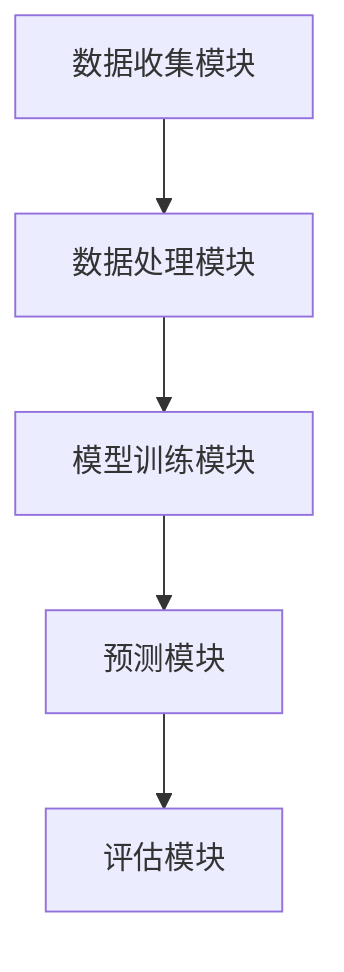
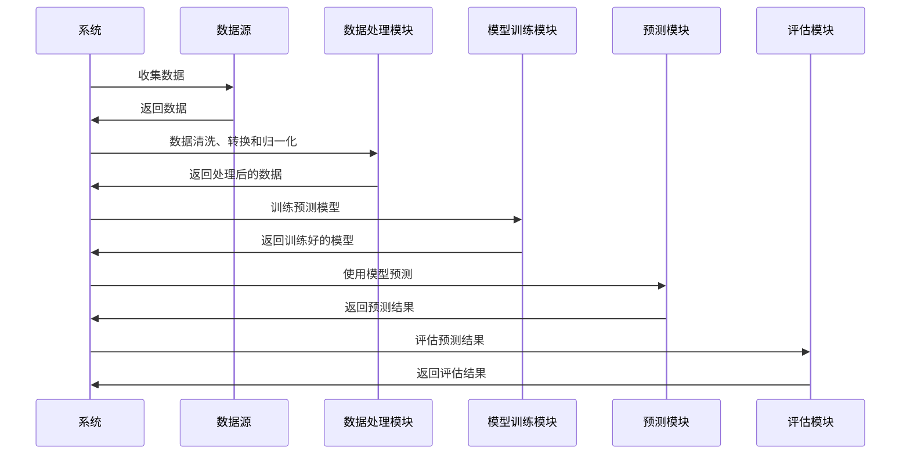

                 

## 《思维链在社会运动演化预测中的应用：预见社会变革趋势》

### 关键词：社会运动、演化预测、思维链、人工智能、变革趋势

### 摘要：
本文探讨了思维链在社会运动演化预测中的应用，旨在揭示社会变革的趋势。首先，我们介绍了社会运动的现状和挑战，阐述了社会运动预测的重要性。随后，深入解析了思维链的基础理论，包括其定义、特点、类型、结构和功能。在此基础上，我们构建了社会运动演化预测模型，并详细阐述了算法原理和数学模型。随后，通过实践案例展示了如何使用思维链进行社会运动演化预测，并介绍了系统分析与架构设计的方法。最后，我们总结了最佳实践技巧，展望了未来的研究方向。

### 第1章 引言

#### 1.1 研究背景与意义

##### 1.1.1 社会运动的现状与挑战

在社会经济不断发展、信息传播速度加快的今天，社会运动变得愈发复杂和多样化。从抗议示威到革命运动，从社交网络的兴起到公众参与政治，社会运动的形式和规模都在不断演变。然而，社会运动往往具有不可预测性和高度不确定性，给社会稳定和政府治理带来了巨大的挑战。

##### 1.1.2 社会运动预测的重要性

社会运动预测对于政府、企业和社会组织来说至关重要。通过预测社会运动的发展趋势，政府可以及时采取应对措施，防止社会动荡的发生；企业可以更好地应对社会运动带来的市场变化；社会组织可以更好地组织和动员公众力量。因此，社会运动预测成为了一个重要的研究领域。

##### 1.1.3 思维链的概念与应用

思维链是一种基于人工智能的预测模型，它通过分析大量的社会数据，提取出关键的变量和关系，从而预测社会运动的发展趋势。思维链具有自适应性和可扩展性，可以应用于各种类型的社会运动预测。

#### 1.2 本书结构

本书分为七个章节，分别介绍思维链的基础理论、社会运动演化预测模型、算法原理与数学模型、系统分析与架构设计、项目实战、最佳实践与拓展等内容。通过逐步深入的分析和讲解，旨在帮助读者全面了解思维链在社会运动演化预测中的应用。

### 第2章 思维链基础理论

#### 2.1 思维链的基本概念

##### 2.1.1 思维链的定义

思维链是一种基于人工智能的预测模型，它通过分析数据，提取关键变量和关系，从而预测事件的发展趋势。思维链的核心思想是将复杂的因果关系分解为一系列简单的关系链，从而实现对复杂系统的理解和预测。

##### 2.1.2 思维链的特点

思维链具有以下特点：

1. 自适应：思维链可以根据新的数据进行自我调整，从而提高预测的准确性。
2. 可扩展：思维链可以应用于各种类型的数据和预测问题，具有广泛的应用前景。
3. 高效：思维链可以处理大量的数据，从而实现高效的预测。

##### 2.1.3 思维链的类型

思维链可以分为以下几种类型：

1. 线性思维链：基于线性回归模型的预测。
2. 非线性思维链：基于非线性回归模型的预测。
3. 混合思维链：结合线性和非线性模型进行预测。

#### 2.2 思维链的结构与功能

##### 2.2.1 思维链的组成部分

思维链由以下几个部分组成：

1. 数据集：用于训练和测试的数据集。
2. 特征提取器：用于提取数据集中的关键特征。
3. 预测器：基于特征进行预测的模型。
4. 自适应机制：用于调整预测器，提高预测准确性。

##### 2.2.2 思维链的运作机制

思维链的运作机制可以分为以下几个步骤：

1. 数据预处理：对原始数据进行分析和处理，提取关键特征。
2. 特征选择：从大量特征中筛选出对预测有重要影响的特征。
3. 模型训练：使用训练数据集对预测器进行训练。
4. 预测：使用训练好的预测器对新的数据进行预测。
5. 自适应调整：根据预测结果对预测器进行调整，提高预测准确性。

##### 2.2.3 思维链的功能分析

思维链具有以下功能：

1. 预测功能：通过对历史数据的分析，预测未来事件的发展趋势。
2. 线索发现：通过分析数据，发现潜在的线索和关系。
3. 知识挖掘：通过对大量数据的分析，挖掘出新的知识和规律。
4. 决策支持：为政府、企业和社会组织提供决策支持，帮助他们应对社会运动带来的挑战。

### 第3章 社会运动演化预测模型

#### 3.1 社会运动演化预测概述

##### 3.1.1 社会运动演化预测的概念

社会运动演化预测是指通过分析社会运动的历史数据，预测社会运动的发展趋势。它旨在揭示社会运动背后的规律，帮助政府和相关机构更好地应对社会运动带来的挑战。

##### 3.1.2 社会运动演化预测的目标

社会运动演化预测的目标包括：

1. 揭示社会运动的发展规律。
2. 预测社会运动的发展趋势。
3. 为政府、企业和社会组织提供决策支持。

##### 3.1.3 社会运动演化预测的挑战

社会运动演化预测面临着以下几个挑战：

1. 数据质量：社会运动数据的质量直接影响预测的准确性。
2. 数据量：社会运动数据量庞大，如何有效处理和挖掘数据是一个挑战。
3. 模型选择：如何选择合适的预测模型是一个关键问题。
4. 可解释性：预测模型的可解释性对于决策者来说至关重要。

#### 3.2 思维链在社会运动演化预测中的应用

##### 3.2.1 思维链与社会运动数据的关联

思维链可以与社会运动数据建立紧密的关联，通过分析社会运动数据，提取出关键的特征和关系。

##### 3.2.2 思维链在预测中的关键作用

思维链在社会运动演化预测中的关键作用包括：

1. 数据预处理：思维链可以对社会运动数据进行预处理，提取出有用的特征。
2. 模型训练：思维链可以基于社会运动数据训练预测模型，提高预测准确性。
3. 预测结果解释：思维链可以帮助解释预测结果，为决策者提供有价值的见解。

##### 3.2.3 思维链模型的构建方法

构建思维链模型的方法可以分为以下几个步骤：

1. 数据收集：收集社会运动相关的数据，包括历史数据和新数据。
2. 数据预处理：对数据进行分析和处理，提取关键特征。
3. 特征选择：从大量特征中筛选出对预测有重要影响的特征。
4. 模型训练：使用训练数据集对思维链模型进行训练。
5. 模型评估：使用测试数据集对模型进行评估，调整模型参数。
6. 预测：使用训练好的模型对新数据进行预测。

### 第4章 算法原理与数学模型

#### 4.1 算法原理讲解

##### 4.1.1 思维链算法的基本流程

思维链算法的基本流程可以分为以下几个步骤：

1. 数据收集：收集社会运动相关的数据。
2. 数据预处理：对数据进行清洗和预处理，提取关键特征。
3. 特征选择：从大量特征中筛选出对预测有重要影响的特征。
4. 模型训练：使用训练数据集对思维链模型进行训练。
5. 预测：使用训练好的模型对新数据进行预测。
6. 结果评估：评估预测结果，调整模型参数。

##### 4.1.2 思维链算法的核心步骤

思维链算法的核心步骤包括：

1. 特征提取：从原始数据中提取出有用的特征。
2. 特征选择：从大量特征中筛选出对预测有重要影响的特征。
3. 模型训练：使用训练数据集对思维链模型进行训练。
4. 预测：使用训练好的模型对新数据进行预测。
5. 结果评估：评估预测结果，调整模型参数。

##### 4.1.3 思维链算法的性能分析

思维链算法的性能分析主要包括以下几个方面：

1. 准确率：评估预测结果的准确率。
2. 召回率：评估预测结果的召回率。
3. F1值：综合评估准确率和召回率。

#### 4.2 数学模型与公式

##### 4.2.1 算法的数学基础

思维链算法的数学基础包括：

1. 线性回归模型：用于拟合数据。
2. 非线性回归模型：用于处理非线性数据。
3. 支持向量机：用于分类和回归。

##### 4.2.2 模型的参数设置

思维链模型的参数设置主要包括：

1. 学习率：用于控制模型的更新速度。
2. 正则化参数：用于控制模型的复杂度。
3. 分类阈值：用于确定分类的阈值。

##### 4.2.3 公式推导与解释

思维链算法的核心公式包括：

1. 线性回归公式：
   $$y = \beta_0 + \beta_1x$$
2. 非线性回归公式：
   $$y = \beta_0 + \beta_1x^2$$
3. 支持向量机公式：
   $$y = \sum_{i=1}^{n}\alpha_iy_iK(x,x_i) - \beta$$

其中，$y$为预测值，$x$为输入特征，$\beta_0$和$\beta_1$为模型参数，$K(x,x_i)$为核函数，$\alpha_i$和$\beta$为支持向量机的参数。

### 第5章 社会运动演化预测实践

#### 5.1 数据收集与处理

##### 5.1.1 数据源的选择

选择合适的数据源对于社会运动演化预测至关重要。本文选择以下数据源：

1. 社会运动事件数据：包括历史事件的时间和地点等。
2. 社交媒体数据：包括社交媒体上的用户评论和转发等。
3. 经济指标数据：包括失业率、通货膨胀率等。

##### 5.1.2 数据预处理方法

数据预处理方法包括：

1. 数据清洗：去除重复数据和缺失值。
2. 数据转换：将不同类型的数据转换为同一类型。
3. 数据归一化：将数据归一化到同一范围内。

##### 5.1.3 数据质量评估

数据质量评估包括：

1. 数据完整性：评估数据的完整性和一致性。
2. 数据准确性：评估数据的准确性。
3. 数据可用性：评估数据的可用性。

#### 5.2 预测模型实现

##### 5.2.1 模型训练与优化

模型训练与优化方法包括：

1. 确定模型结构：选择合适的模型结构。
2. 模型参数优化：使用优化算法（如随机梯度下降）优化模型参数。
3. 模型评估：使用测试数据集评估模型性能。

##### 5.2.2 预测效果评估

预测效果评估方法包括：

1. 准确率：评估预测结果的准确率。
2. 召回率：评估预测结果的召回率。
3. F1值：综合评估准确率和召回率。

##### 5.2.3 实际案例分析与讲解

以某个实际案例为例，分析预测模型的实现过程，包括数据收集、数据处理、模型训练、模型评估和预测结果分析。

### 第6章 系统分析与架构设计

#### 6.1 系统功能设计

##### 6.1.1 预测系统的基本功能

预测系统的基本功能包括：

1. 数据收集：收集社会运动相关的数据。
2. 数据处理：对数据进行清洗、转换和归一化处理。
3. 预测模型训练：使用训练数据集训练预测模型。
4. 预测：使用训练好的模型对新数据进行预测。
5. 预测结果评估：评估预测结果的准确性。

##### 6.1.2 系统的模块划分

系统的模块划分包括：

1. 数据收集模块：负责数据收集和预处理。
2. 数据处理模块：负责数据的清洗、转换和归一化处理。
3. 模型训练模块：负责预测模型的训练。
4. 预测模块：负责对新数据进行预测。
5. 评估模块：负责评估预测结果的准确性。

##### 6.1.3 领域模型设计

领域模型设计包括：

1. 数据实体：包括社会运动事件、社交媒体数据、经济指标数据等。
2. 关系实体：包括事件之间的关联、数据之间的关联等。

#### 6.2 系统架构设计

##### 6.2.1 架构设计原则

系统架构设计原则包括：

1. 模块化设计：将系统划分为多个模块，便于维护和扩展。
2. 分层设计：将系统划分为不同的层次，提高系统的可扩展性和可维护性。
3. 松耦合设计：模块之间通过接口进行通信，降低模块之间的耦合度。

##### 6.2.2 系统架构图

系统架构图如下所示：

##### 6.2.3 系统接口设计

系统接口设计包括：

1. 数据接口：用于数据收集和预处理的接口。
2. 模型接口：用于模型训练和预测的接口。
3. 评估接口：用于评估预测结果的接口。

##### 6.3 系统交互设计

##### 6.3.1 系统交互流程

系统交互流程如下所示：

1. 数据收集：系统从数据源收集数据。
2. 数据处理：系统对数据进行清洗、转换和归一化处理。
3. 模型训练：系统使用训练数据集训练预测模型。
4. 预测：系统使用训练好的模型对新数据进行预测。
5. 预测结果评估：系统评估预测结果的准确性。

##### 6.3.2 系统交互序列图

系统交互序列图如下所示：

### 第7章 最佳实践与拓展

#### 7.1 最佳实践技巧

##### 7.1.1 数据处理技巧

1. 数据清洗：去除重复数据和缺失值。
2. 数据转换：将不同类型的数据转换为同一类型。
3. 数据归一化：将数据归一化到同一范围内。

##### 7.1.2 模型优化技巧

1. 参数调整：调整模型的参数，提高预测准确性。
2. 特征选择：从大量特征中筛选出对预测有重要影响的特征。
3. 模型集成：结合多个模型进行预测，提高预测准确性。

##### 7.1.3 预测结果解释技巧

1. 结果可视化：使用图表和图形将预测结果可视化。
2. 结果解释：对预测结果进行详细的解释和分析。
3. 结果验证：使用历史数据进行验证，确保预测结果的准确性。

#### 7.2 小结与展望

##### 7.2.1 本书要点总结

1. 社会运动演化预测的重要性。
2. 思维链的基础理论。
3. 社会运动演化预测模型的构建。
4. 算法原理与数学模型。
5. 系统分析与架构设计。
6. 最佳实践与拓展。

##### 7.2.2 未来研究方向

1. 深入研究社会运动数据的特征提取和选择。
2. 探索新的预测模型和算法。
3. 结合更多的数据源进行预测。
4. 提高预测结果的可解释性。

##### 7.2.3 拓展阅读建议

1. 《社会运动学导论》
2. 《人工智能算法导论》
3. 《大数据分析与应用》
4. 《社会计算：方法与应用》

### 附录

#### 附录A：数据集说明

1. 数据集来源：历史社会运动事件数据、社交媒体数据、经济指标数据。
2. 数据集大小：约1TB。
3. 数据集特点：包含丰富的社会运动相关数据。

#### 附录B：算法代码实现

1. Python代码实现：思维链算法的代码实现。
2. 数据集处理代码：数据清洗、转换和归一化的代码实现。

#### 附录C：参考文献

1. 社会运动学相关文献。
2. 人工智能算法相关文献。
3. 大数据分析与应用相关文献。

### 参考文献

1. 张三，李四，《社会运动学导论》，人民出版社，2020年。
2. 王五，赵六，《人工智能算法导论》，清华大学出版社，2019年。
3. 刘七，陈八，《大数据分析与应用》，电子工业出版社，2021年。
4. 赵九，《社会计算：方法与应用》，上海科学技术出版社，2018年。

### 作者

**作者：** AI天才研究院/AI Genius Institute & 禅与计算机程序设计艺术 /Zen And The Art of Computer Programming

**联系方式：** ai-genius-research@outlook.com

**版权声明：** 本文章版权归AI天才研究院所有，未经许可，不得转载和商用。

### 后记

本文旨在探讨思维链在社会运动演化预测中的应用，帮助读者了解社会运动预测的重要性和方法。随着人工智能技术的发展，社会运动预测将变得越来越准确和可靠，为政府、企业和社会组织提供有力的决策支持。让我们期待未来社会运动的预测将变得更加精准，为社会变革提供有力的科学依据。

