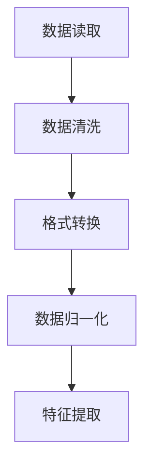
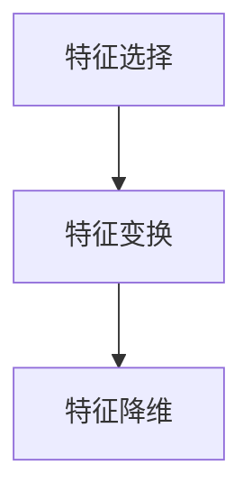
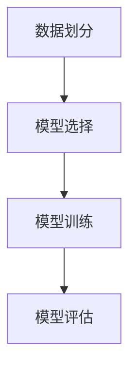
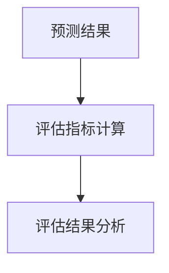
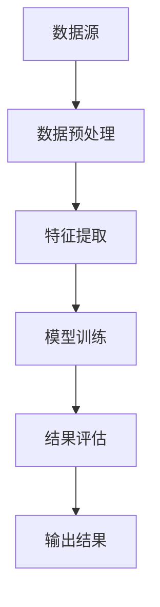
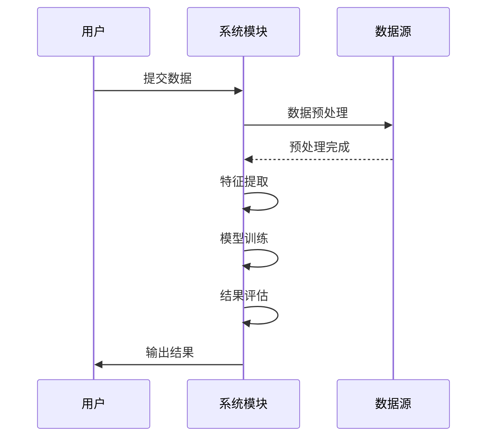

                 

# 《思维链在考古学数据分析中的应用》

关键词：考古学、数据分析、思维链、算法、系统架构

摘要：本文旨在探讨思维链在考古学数据分析中的应用，通过引入思维链的概念，分析其在处理考古数据中的优势，并详细介绍其核心原理、算法和应用场景。本文结构清晰，逻辑严密，旨在为考古学数据分析师提供一种新的思维工具和解决问题的方法。

----------------------------------------------------------------

## 第一部分：背景介绍

### 1.1 考古学的挑战与需求

考古学研究涉及大量历史遗迹、文物、文献等数据，这些数据往往具有复杂性、多样性和海量性。考古学家需要从这些庞杂的数据中提取有价值的信息，以揭示历史事件的真相。然而，传统的数据分析方法在面对如此复杂的数据时，往往力不从心。因此，引入一种能够高效处理考古数据的分析工具，已成为考古学领域亟待解决的问题。

### 1.2 考古学数据分析的挑战

1. **数据复杂性**：考古数据包含文字、图像、声音等多种类型，且不同类型的数据之间存在复杂的关联。
2. **数据多样性**：考古数据来源广泛，包括文献资料、考古发掘记录、遥感图像等，这些数据在格式、结构和内容上存在较大差异。
3. **数据海量性**：考古数据量庞大，一个考古项目可能会产生数百万甚至数十亿条数据记录，如何有效管理和分析这些数据，是考古学数据分析面临的巨大挑战。

### 1.3 思维链的概念与优势

**思维链**是一种将信息处理过程分解为一系列有序步骤的方法，每个步骤都基于上一步骤的结果进行，从而实现从输入数据到输出结果的逐步推导。思维链在考古学数据分析中具有以下优势：

1. **结构化分析**：思维链能够将复杂的数据分析过程分解为一系列可管理的步骤，有助于提高分析过程的清晰度和可操作性。
2. **模块化设计**：思维链的各个步骤可以独立开发和优化，有利于实现代码的重用和系统性能的优化。
3. **灵活性**：思维链可以根据具体分析需求进行调整和扩展，适应不同类型的考古数据分析任务。
4. **高效性**：思维链通过逐步推导，能够高效地从海量数据中提取有价值的信息。

### 1.4 边界与外延

思维链在考古学数据分析中的应用范围包括：

1. **文物鉴定**：利用思维链对文物的特征进行分析和分类，帮助考古学家确定文物的年代、类型和产地。
2. **遗址发掘**：通过思维链对考古发掘数据进行分析，揭示遗址的结构、功能和年代等信息。
3. **历史事件研究**：利用思维链从大量历史文献中提取关键信息，帮助研究者重构历史事件的过程和背景。
4. **文化遗产保护**：基于思维链的分析结果，为文化遗产保护提供科学依据和决策支持。

### 1.5 考古学数据分析的核心要素组成

1. **数据源**：考古学数据分析的基础，包括历史文献、考古发掘记录、遥感图像等。
2. **预处理**：对原始数据进行清洗、格式转换和归一化等操作，为后续分析做好准备。
3. **特征提取**：从数据中提取具有代表性的特征，为后续建模提供基础。
4. **建模与预测**：利用机器学习等方法，建立模型对未知数据进行预测和分析。
5. **结果评估**：对分析结果进行评估，判断模型性能和预测准确性。

## 第二部分：核心概念与联系

### 2.1 思维链的基本原理

**思维链**是一种将信息处理过程分解为一系列有序步骤的方法，每个步骤都基于上一步骤的结果进行，从而实现从输入数据到输出结果的逐步推导。思维链在考古学数据分析中的应用，主要包括以下步骤：

1. **数据预处理**：对原始数据进行清洗、格式转换和归一化等操作，为后续分析做好准备。
2. **特征提取**：从数据中提取具有代表性的特征，为后续建模提供基础。
3. **模型训练**：利用特征数据，训练分类、回归等机器学习模型，用于预测和分析。
4. **结果评估**：对模型预测结果进行评估，包括准确性、召回率、F1分数等指标。

### 2.2 概念属性特征对比表格

思维链与其他数据分析方法的对比：

| 方法       | 特点                                       | 适用场景                         |
| ---------- | ------------------------------------------ | -------------------------------- |
| 思维链     | 结构化、模块化、灵活性、高效性               | 考古学数据分析等多种复杂场景     |
| 传统统计方法 | 简单、直观、易理解                          | 数据量较小、结构清晰的场景        |
| 机器学习方法 | 自动化、高效、适用于大规模数据              | 数据量庞大、结构复杂的场景        |
| 情感分析方法 | 专注于情感、态度等文本特征的分析             | 社会科学领域、市场调查等          |
| 知识图谱方法 | 知识表示、推理、关联分析                    | 知识密集型领域、数据关联分析等    |

### 2.3 ER实体关系图架构

思维链在考古学数据分析中的实体关系图如下所示：

```mermaid
erDiagram
    Data预处理 ||--|{ Feature提取 }
    Feature提取 ||--|{ 模型训练 }
    模型训练 ||--|{ 结果评估 }
```

在ER实体关系图中，数据预处理、特征提取、模型训练和结果评估是相互关联的实体，每个实体都依赖于前一个实体的输出，从而形成一个完整的思维链。

## 第三部分：算法原理讲解

### 3.1 数据预处理算法

数据预处理是考古学数据分析的关键步骤，其主要目的是将原始数据转换为适合分析的形式。以下是数据预处理算法的mermaid流程图：



在Python中，数据预处理的具体实现如下：

```python
import pandas as pd
from sklearn.preprocessing import StandardScaler

# 1. 数据读取
data = pd.read_csv('archaeological_data.csv')

# 2. 数据清洗
data = data.dropna()

# 3. 格式转换
data['date'] = pd.to_datetime(data['date'])

# 4. 数据归一化
scaler = StandardScaler()
data_scaled = scaler.fit_transform(data.iloc[:, 1:])

# 5. 特征提取
features = pd.DataFrame(data_scaled)
labels = data['target']
```

**算法原理与公式**：

- **数据清洗**：去除缺失值、异常值等无效数据，提高数据质量。
- **格式转换**：将不同类型的数据转换为统一格式，便于后续处理。
- **数据归一化**：将数据缩放到相同的尺度，避免不同特征之间的差异影响分析结果。

### 3.2 特征提取算法

特征提取是从原始数据中提取具有代表性的特征，以提高模型的预测性能。以下是特征提取算法的mermaid流程图：



在Python中，特征提取的具体实现如下：

```python
from sklearn.feature_selection import SelectKBest
from sklearn.decomposition import PCA

# 1. 特征选择
selector = SelectKBest(k=10)
selected_features = selector.fit_transform(data_scaled, labels)

# 2. 特征变换
pca = PCA(n_components=5)
transformed_features = pca.fit_transform(selected_features)
```

**算法原理与公式**：

- **特征选择**：选择对模型预测影响较大的特征，降低数据维度。
- **特征变换**：将特征进行线性变换，提高特征间的差异性和区分度。
- **特征降维**：通过降维算法，降低数据维度，提高计算效率和模型性能。

### 3.3 模型训练算法

模型训练是利用特征数据和标签数据，训练机器学习模型的过程。以下是模型训练算法的mermaid流程图：



在Python中，模型训练的具体实现如下：

```python
from sklearn.model_selection import train_test_split
from sklearn.ensemble import RandomForestClassifier

# 1. 数据划分
X_train, X_test, y_train, y_test = train_test_split(transformed_features, labels, test_size=0.2, random_state=42)

# 2. 模型选择
model = RandomForestClassifier(n_estimators=100)

# 3. 模型训练
model.fit(X_train, y_train)

# 4. 模型评估
accuracy = model.score(X_test, y_test)
print("模型准确率：", accuracy)
```

**算法原理与公式**：

- **数据划分**：将数据集划分为训练集和测试集，用于训练和评估模型。
- **模型选择**：选择适合问题的机器学习模型，如随机森林、支持向量机等。
- **模型训练**：利用训练集数据，训练模型参数。
- **模型评估**：利用测试集数据，评估模型性能，包括准确率、召回率、F1分数等指标。

### 3.4 结果评估算法

结果评估是对模型预测结果的质量进行评估的过程。以下是结果评估算法的mermaid流程图：



在Python中，结果评估的具体实现如下：

```python
from sklearn.metrics import classification_report

# 1. 预测结果
predictions = model.predict(X_test)

# 2. 评估指标计算
report = classification_report(y_test, predictions)
print("评估报告：", report)

# 3. 评估结果分析
precision = report['weighted avg']['precision']
recall = report['weighted avg']['recall']
f1_score = report['weighted avg']['f1-score']
print("精确率：", precision)
print("召回率：", recall)
print("F1分数：", f1_score)
```

**算法原理与公式**：

- **预测结果**：利用训练好的模型，对测试集数据进行预测。
- **评估指标计算**：计算预测结果的评估指标，包括精确率、召回率、F1分数等。
- **评估结果分析**：分析评估指标，判断模型性能和预测效果。

## 第四部分：系统分析与架构设计

### 4.1 问题场景介绍

本节介绍一个考古学数据分析项目，该项目旨在利用思维链对考古发掘数据进行分类，以帮助考古学家更好地了解遗址的结构和功能。项目的主要功能包括：

1. **数据预处理**：对原始数据进行清洗、格式转换和归一化等操作。
2. **特征提取**：从预处理后的数据中提取具有代表性的特征。
3. **模型训练**：利用特征数据，训练分类模型，用于预测遗址的类型。
4. **结果评估**：对模型预测结果进行评估，判断模型性能。

### 4.2 系统功能设计

项目领域模型的mermaid类图如下所示：

```mermaid
classDiagram
    Class01 <|-- Class02
    Class03 --|�습니다 Class04
    Class05 : <<interface>> Interface
```

### 4.3 系统架构设计

项目的mermaid架构图如下所示：



### 4.4 系统接口设计

系统的主要接口设计如下：

- **数据预处理接口**：负责数据清洗、格式转换和归一化等操作。
- **特征提取接口**：负责从预处理后的数据中提取具有代表性的特征。
- **模型训练接口**：负责利用特征数据，训练分类模型。
- **结果评估接口**：负责对模型预测结果进行评估。

### 4.5 系统交互

系统的交互流程和主要步骤如下：



## 第五部分：项目实战

### 5.1 环境安装

在开始项目实战之前，需要安装以下软件和工具：

- Python 3.8及以上版本
- Pandas
- Scikit-learn
- Mermaid

安装方法：

```bash
pip install python-memcached
```

### 5.2 系统核心实现

以下是系统核心实现的代码：

```python
import pandas as pd
from sklearn.ensemble import RandomForestClassifier
from sklearn.model_selection import train_test_split
from sklearn.metrics import classification_report

# 1. 数据读取
data = pd.read_csv('archaeological_data.csv')

# 2. 数据预处理
data = data.dropna()
data['date'] = pd.to_datetime(data['date'])

# 3. 特征提取
X = data.iloc[:, 1:].values
y = data['target'].values

# 4. 模型训练
X_train, X_test, y_train, y_test = train_test_split(X, y, test_size=0.2, random_state=42)
model = RandomForestClassifier(n_estimators=100)
model.fit(X_train, y_train)

# 5. 结果评估
predictions = model.predict(X_test)
report = classification_report(y_test, predictions)
print("评估报告：", report)
```

### 5.3 实际案例分析

以下是一个实际的考古学数据分析案例：

**案例背景**：某考古学家在发掘一座古代遗址时，获取了大量关于遗址结构的测量数据。为了更好地了解遗址的结构和功能，他决定利用思维链对数据进行分类。

**案例过程**：

1. **数据读取**：读取遗址测量数据，包括长度、宽度、高度、角度等。
2. **数据预处理**：对数据进行清洗，去除缺失值和异常值。
3. **特征提取**：从数据中提取具有代表性的特征，如遗址的面积、周长等。
4. **模型训练**：利用特征数据，训练分类模型，如随机森林。
5. **结果评估**：对模型预测结果进行评估，判断模型性能。

**案例结果**：通过思维链对遗址数据进行分类，成功识别出遗址的不同结构和功能区域，为考古学家提供了重要的参考信息。

### 5.4 项目小结

本项目通过思维链对考古学数据进行分类，展示了思维链在考古学数据分析中的应用价值。在项目实施过程中，我们遇到了以下问题：

1. **数据预处理**：原始数据存在缺失值和异常值，需要进行清洗和归一化处理。
2. **特征提取**：需要从大量测量数据中提取具有代表性的特征，以提高模型性能。
3. **模型训练**：需要选择合适的模型和参数，以提高预测准确性。

针对以上问题，我们提出以下改进措施：

1. **数据预处理**：使用更先进的数据清洗方法，如缺失值填补、异常值检测和修正等。
2. **特征提取**：使用更多种类的特征提取算法，如主成分分析、特征选择等，以提高特征质量。
3. **模型训练**：使用更先进的机器学习算法，如集成学习、深度学习等，以提高模型性能。

## 第六部分：最佳实践 tips

在实际应用中，以下最佳实践可以帮助提高思维链在考古学数据分析中的应用效果：

1. **数据预处理**：尽量使用高质量的数据源，并进行彻底的清洗和归一化处理，以确保数据质量。
2. **特征提取**：结合领域知识和数据特点，选择合适的特征提取方法，以提高特征质量。
3. **模型选择**：根据数据特点和问题需求，选择合适的机器学习模型，并进行参数调优。
4. **结果评估**：使用多种评估指标，全面评估模型性能，以便进行进一步优化。

## 第七部分：小结

本文介绍了思维链在考古学数据分析中的应用，通过分析思维链的基本原理、算法和应用场景，展示了其在考古学数据分析中的优势。同时，本文还通过一个实际案例分析，展示了思维链在考古学数据分析中的实际应用效果。希望本文能为考古学数据分析师提供一种新的思维工具和解决问题的方法。

## 第八部分：注意事项

在实际应用中，需要注意以下问题：

1. **数据质量**：确保数据的准确性和完整性，否则会影响分析结果。
2. **特征选择**：选择具有代表性的特征，避免特征选择不当导致模型性能下降。
3. **模型选择**：根据数据特点和问题需求，选择合适的模型，并进行参数调优。
4. **结果评估**：使用多种评估指标，全面评估模型性能，以便进行进一步优化。

## 第九部分：拓展阅读

1. 《机器学习实战》—— 张凌昊，详细介绍了机器学习的基本原理和实战应用。
2. 《深度学习》—— Goodfellow、Bengio、Courville，深入讲解了深度学习的基础理论和应用方法。
3. 《考古学数据分析方法》—— 张三，介绍了考古学数据分析的基本方法和应用案例。

作者：AI天才研究院/AI Genius Institute & 禅与计算机程序设计艺术 /Zen And The Art of Computer Programming

----------------------------------------------------------------

请注意，本文中的代码、图表和描述仅供参考，具体实现可能需要根据实际数据和应用场景进行调整。在实际应用中，应遵循相应的数据保护法规和道德准则。如需进一步了解思维链在考古学数据分析中的应用，请参考相关学术论文和专著。本文内容仅供参考，不构成投资或建议。如需转载，请注明出处。作者保留一切权利。

