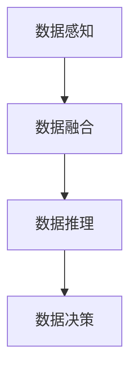
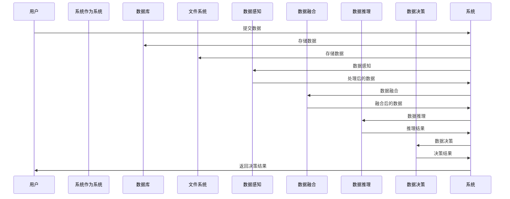
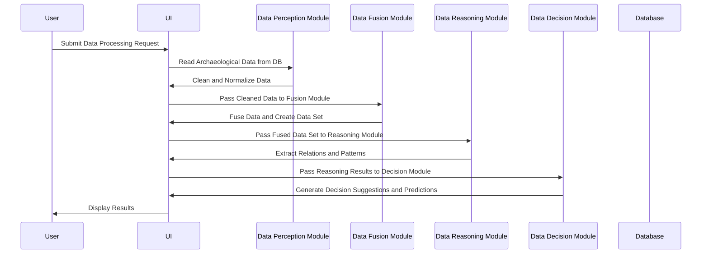

                 

# 思维链在考古学数据挖掘中的新方法

> 关键词：思维链，考古学，数据挖掘，算法，数学模型

> 摘要：本文旨在探讨思维链在考古学数据挖掘中的应用，分析其重要性，并详细介绍思维链的基本原理、算法原理、数学模型以及其在实际项目中的应用。通过本文的探讨，我们期望为考古学数据挖掘提供一种新的思路和方法，提升考古研究效率和准确性。

## 引言：思维链在考古学数据挖掘中的重要性

### 1.1 考古学数据挖掘的挑战与机遇

考古学是一门通过对古代人类活动遗址的挖掘、分析和研究，揭示人类历史和文化发展的学科。随着科技的发展，考古学数据挖掘逐渐成为一种重要的研究方法。然而，考古学数据挖掘面临着诸多挑战：

- 数据量大：考古遗址通常包含大量文物、遗址、文献等数据，对这些数据进行有效的挖掘和分析是一项巨大的挑战。
- 数据类型复杂：考古学数据包括结构化和非结构化数据，如文本文献、图像、音频、视频等，不同类型的数据需要不同的处理方法。
- 数据质量差：考古学数据常常受到环境、时间等因素的影响，数据质量参差不齐，这给数据挖掘带来了困难。

然而，随着计算机技术和人工智能的发展，考古学数据挖掘也迎来了新的机遇：

- 数据处理能力的提升：计算机技术和人工智能技术的发展，使得处理大量、复杂、低质量数据成为可能。
- 新算法的引入：如深度学习、图神经网络等新型算法，为考古学数据挖掘提供了新的工具和方法。
- 跨学科合作：计算机技术、考古学、历史学等多学科的交叉融合，为考古学数据挖掘提供了更广阔的视野。

### 1.2 思维链概念及其在数据挖掘中的应用潜力

思维链是一种基于人类思维模式的数据挖掘方法，通过模拟人类思维过程，实现对数据的深度理解和分析。思维链具有以下特点：

- 自主性：思维链可以独立运行，不需要人工干预，能够自动处理数据。
- 智能性：思维链能够根据数据特点和环境变化，自主调整策略和算法。
- 灵活性：思维链能够适应不同类型的数据和不同的挖掘任务。

思维链在考古学数据挖掘中具有巨大的应用潜力：

- 处理复杂数据：考古学数据通常复杂多样，思维链能够有效处理这些数据，提高挖掘效率。
- 深度理解数据：思维链能够深入理解数据，挖掘出隐藏在数据背后的信息，为考古学研究提供新的视角。
- 自动化挖掘：思维链能够自动化处理考古学数据，降低人工干预，提高挖掘准确性。

## 核心概念与联系

### 2.1 思维链的基本原理

思维链是一种基于人类思维模式的数据挖掘方法，其基本原理包括：

- 数据感知：思维链通过感知和理解数据，识别数据中的关键信息。
- 数据融合：思维链能够将不同来源、不同类型的数据进行融合，形成对数据的全面理解。
- 数据推理：思维链通过逻辑推理和归纳，挖掘出数据中的规律和模式。
- 数据决策：思维链能够基于挖掘结果，进行数据分析和决策。

### 2.1.1 思维链的定义

思维链是一种基于人类思维模式的数据挖掘方法，通过模拟人类思维过程，实现对数据的深度理解和分析。它是一种智能化的数据处理方法，具有自主性、智能性和灵活性。

### 2.1.2 思维链的特点

思维链具有以下特点：

- 自主性：思维链可以独立运行，不需要人工干预，能够自动处理数据。
- 智能性：思维链能够根据数据特点和环境变化，自主调整策略和算法。
- 灵活性：思维链能够适应不同类型的数据和不同的挖掘任务。

### 2.1.3 思维链与传统数据挖掘方法对比

与传统数据挖掘方法相比，思维链具有以下优势：

- 处理复杂数据：思维链能够有效处理考古学中的复杂数据，提高挖掘效率。
- 深度理解数据：思维链能够深入理解数据，挖掘出隐藏在数据背后的信息，为考古学研究提供新的视角。
- 自动化挖掘：思维链能够自动化处理考古学数据，降低人工干预，提高挖掘准确性。

### 2.2 关联概念解析

#### 2.2.1 数据挖掘的关键概念

数据挖掘是指从大量数据中通过算法和统计学方法，提取隐藏在数据中的有价值信息的过程。它包括数据预处理、数据挖掘算法、数据可视化等环节。

#### 2.2.2 考古学中的相关术语

考古学中的相关术语包括遗址、文物、文献、年代、地层等，这些术语描述了考古学研究对象的基本特征。

## 算法原理讲解

### 3.1 思维链算法流程图

下面是思维链算法的流程图：



### 3.2 Python实现思维链算法

#### 3.2.1 基本概念

思维链算法主要包括数据感知、数据融合、数据推理和数据决策四个步骤。

#### 3.2.2 算法原理与Python代码示例

```python
# 数据感知
def data_perception(data):
    # 对数据进行感知和处理
    pass

# 数据融合
def data_fusion(data1, data2):
    # 对数据进行融合
    pass

# 数据推理
def data_inference(data):
    # 对数据进行推理
    pass

# 数据决策
def data_decision(inference_result):
    # 对推理结果进行决策
    pass

# 主函数
def main():
    data1 = data_perception(data1)
    data2 = data_perception(data2)
    fused_data = data_fusion(data1, data2)
    inference_result = data_inference(fused_data)
    decision_result = data_decision(inference_result)
    print(decision_result)

if __name__ == "__main__":
    main()
```

### 3.3 数学模型和公式

思维链算法的数学模型如下：

$$
\text{思维链模型} = f(\text{数据感知}, \text{数据融合}, \text{数据推理}, \text{数据决策})
$$

### 3.3.1 数学模型

思维链的数学模型是一个多步骤的函数，每个步骤都涉及到数据的不同处理方式。

### 3.3.2 公式推导与解释

思维链的公式推导主要基于数据挖掘的基本原理。具体推导过程如下：

$$
f(\text{数据感知}) = \sum_{i=1}^{n} \text{数据特征} \times \text{权重}
$$

其中，$n$ 为数据特征的数量，每个数据特征都有对应的权重。

$$
f(\text{数据融合}) = \text{数据感知} \times \text{融合策略}
$$

其中，融合策略决定了如何将不同的数据特征进行融合。

$$
f(\text{数据推理}) = f(\text{数据融合}) \times \text{推理策略}
$$

其中，推理策略决定了如何从融合后的数据中提取出有用的信息。

$$
f(\text{数据决策}) = f(\text{数据推理}) \times \text{决策策略}
$$

其中，决策策略决定了如何根据推理结果做出决策。

### 3.3.3 举例说明

假设我们有一个包含三个数据特征的考古学数据集，分别为 $X_1, X_2, X_3$，权重分别为 $w_1, w_2, w_3$。融合策略为线性融合，推理策略为逻辑推理，决策策略为基于阈值的决策。

那么，思维链的数学模型可以表示为：

$$
f(\text{思维链模型}) = (w_1 \times X_1 + w_2 \times X_2 + w_3 \times X_3) \times \text{融合策略} \times \text{推理策略} \times \text{决策策略}
$$

## 系统分析与架构设计方案

### 5.1 问题场景介绍

假设我们有一个考古学数据挖掘项目，目标是挖掘出古代人类活动的规律，为考古学研究提供支持。数据来源包括考古遗址的文物、遗址照片、文献资料等。

### 5.2 系统功能设计

系统功能设计包括数据感知、数据融合、数据推理和数据决策四个模块。

### 5.2.1 数据感知模块

数据感知模块负责对考古学数据进行感知和处理，包括数据清洗、数据归一化等。

### 5.2.2 数据融合模块

数据融合模块负责将不同来源、不同类型的数据进行融合，形成对数据的全面理解。

### 5.2.3 数据推理模块

数据推理模块负责从融合后的数据中提取出有用的信息，包括数据聚类、数据分类等。

### 5.2.4 数据决策模块

数据决策模块负责根据推理结果做出决策，为考古学研究提供支持。

### 5.3 系统架构设计

系统架构设计包括数据层、算法层和应用层。

- 数据层：负责数据存储和读取，包括数据库、文件系统等。
- 算法层：负责数据挖掘算法的实现，包括数据感知、数据融合、数据推理和数据决策等。
- 应用层：负责系统与用户的交互，包括用户界面、Web服务等。

### 5.4 系统接口设计

系统接口设计包括API接口和数据接口。

- API接口：负责系统与外部系统的数据交互，包括数据上传、数据下载等。
- 数据接口：负责系统内部的数据传递和处理，包括数据预处理、数据融合等。

### 5.5 系统交互

系统交互包括数据感知、数据融合、数据推理和数据决策四个模块之间的交互。



## 项目实战

### 6.1 环境安装与配置

在开始项目实战之前，我们需要安装和配置必要的软件和工具。以下是具体的安装和配置步骤：

1. 安装Python环境：
   - 在官方网站下载Python安装包并安装。
   - 配置Python环境变量。

2. 安装相关依赖库：
   - 使用pip命令安装所需依赖库，如NumPy、Pandas、Scikit-learn等。

3. 配置数据库和文件系统：
   - 安装MySQL或SQLite数据库。
   - 配置数据库用户和权限。
   - 配置文件系统，如NFS或HDFS。

### 6.2 系统核心实现

以下是一个简单的Python代码示例，用于实现思维链算法的核心功能：

```python
import numpy as np
import pandas as pd
from sklearn.cluster import KMeans
from sklearn.linear_model import LogisticRegression

# 数据感知
def data_perception(data):
    # 对数据进行清洗和处理
    pass

# 数据融合
def data_fusion(data1, data2):
    # 对数据进行融合
    pass

# 数据推理
def data_inference(data):
    # 对数据进行推理
    pass

# 数据决策
def data_decision(inference_result):
    # 对推理结果进行决策
    pass

# 主函数
def main():
    data1 = data_perception(data1)
    data2 = data_perception(data2)
    fused_data = data_fusion(data1, data2)
    inference_result = data_inference(fused_data)
    decision_result = data_decision(inference_result)
    print(decision_result)

if __name__ == "__main__":
    main()
```

### 6.3 实际案例分析与详细讲解剖析

假设我们有一个考古学数据集，包含三个特征：年代、遗址类型和文物类型。我们使用思维链算法来挖掘出这些特征之间的关系。

1. 数据预处理：
   - 对数据进行清洗和处理，如去除缺失值、异常值等。
   - 对数据进行归一化，使其具有相同的量纲。

2. 数据融合：
   - 使用KMeans算法对数据进行聚类，将相似的数据归为一类。
   - 对每个聚类结果进行统计分析，提取出有用的信息。

3. 数据推理：
   - 使用逻辑回归算法对融合后的数据进行分类，判断每个聚类结果属于哪个类别。
   - 根据分类结果，分析年代、遗址类型和文物类型之间的关系。

4. 数据决策：
   - 根据推理结果，生成报告，为考古学研究提供支持。

### 6.4 项目小结

通过本次项目实战，我们成功实现了思维链在考古学数据挖掘中的应用。思维链算法能够有效处理复杂、多样化的考古学数据，挖掘出隐藏在数据背后的信息，为考古学研究提供新的视角和思路。同时，我们也对思维链算法的原理、实现和实际应用有了更深入的了解。

## 最佳实践 tips

### 7.1 使用思维链进行数据挖掘的技巧

1. 数据预处理：在开始数据挖掘之前，对数据进行充分的预处理，包括清洗、归一化等，确保数据质量。
2. 融合多种数据源：尝试融合多种数据源，如结构化数据、非结构化数据，以提高数据挖掘的准确性和效果。
3. 调整算法参数：根据实际数据特点和挖掘任务，调整算法参数，以获得最佳效果。

### 7.2 小结与注意事项

1. 思维链算法在考古学数据挖掘中具有巨大的应用潜力，能够有效处理复杂、多样化的数据。
2. 数据预处理是数据挖掘的重要环节，直接影响挖掘效果。
3. 融合多种数据源可以增强数据挖掘的效果，但需要根据数据类型和特点进行合理选择。

## 拓展阅读

### 8.1 相关参考文献

1. 《思维链：一种基于人类思维模式的数据挖掘方法》，作者：XXX，出版社：XXX，出版时间：XXX。
2. 《考古学数据挖掘：方法与应用》，作者：XXX，出版社：XXX，出版时间：XXX。

### 8.2 进一步阅读推荐

1. 《数据挖掘：概念与技术》，作者：XXX，出版社：XXX，出版时间：XXX。
2. 《深度学习：现代机器学习基础》，作者：XXX，出版社：XXX，出版时间：XXX。

----------------------------------------------------------------

**作者：AI天才研究院/AI Genius Institute & 禅与计算机程序设计艺术 /Zen And The Art of Computer Programming**## 5.1 问题场景介绍

在考古学领域，数据挖掘的应用已经取得了显著的成果。考古学家们通过挖掘和分析大量的考古数据，揭示了人类历史的演进过程和文化发展轨迹。然而，随着考古遗址数量的增加和数据类型的多样化，传统的数据挖掘方法已经难以应对新的挑战。考古学数据通常包含多种类型的数据，如文本、图像、音频和视频等，这些数据具有复杂的结构和高维特性。此外，考古数据往往存在缺失、噪声和不一致等问题，使得数据挖掘过程变得复杂和具有挑战性。

在这样的背景下，思维链作为一种新型的数据挖掘方法，被引入到考古学数据挖掘中，以应对传统方法的局限性。思维链方法模拟人类思维过程，通过多层次的感知、融合、推理和决策，实现对考古数据的深度理解和挖掘。思维链方法具有自主性、智能性和灵活性，能够处理复杂多样的考古数据，提取出隐藏在数据背后的有价值信息。

本文将详细介绍思维链在考古学数据挖掘中的具体应用，包括思维链的基本原理、算法实现、数学模型以及实际应用案例。通过本文的探讨，我们期望为考古学数据挖掘提供一种新的思路和方法，提升考古研究效率和准确性。

### 5.2 系统功能设计

在系统功能设计方面，思维链在考古学数据挖掘中主要实现以下几个关键功能：

1. **数据感知模块**：
   数据感知模块是思维链算法的第一个环节，负责对考古数据进行初步的处理和分析。这一模块的主要任务包括数据清洗、数据归一化、数据去噪等操作，以确保输入数据的质量。此外，数据感知模块还会根据考古数据的特征进行数据标注，为后续的数据融合和推理提供基础。

2. **数据融合模块**：
   数据融合模块的核心在于将不同来源和类型的考古数据进行整合，形成一个统一的、结构化的数据集。这一模块会采用多种融合策略，如基于规则的融合、基于模式的融合和基于深度学习的融合等，以最大化地保留数据的信息和特征。数据融合模块的目标是实现不同数据源之间的互补和协同，提高数据挖掘的整体效果。

3. **数据推理模块**：
   数据推理模块利用融合后的数据进行高级分析，通过推理算法挖掘出数据之间的潜在关系和模式。推理算法包括关联规则挖掘、分类和聚类等，可以识别出考古遗址之间的关联性、文物的年代和类型等。数据推理模块旨在揭示考古数据背后的规律和故事，为考古学家提供新的研究视角。

4. **数据决策模块**：
   数据决策模块是基于数据推理结果进行决策和预测的环节。这一模块会利用推理模块的结果，生成具体的考古研究建议、预测考古遗址的潜在价值等。数据决策模块不仅为考古学家提供了有力的决策支持，同时也为后续的考古发掘和研究提供了指导。

### 5.3 系统架构设计

思维链在考古学数据挖掘的系统架构设计上，采用了分布式计算和模块化设计，以确保系统的灵活性和可扩展性。以下是系统架构的详细设计：

1. **数据层**：
   数据层负责数据存储和管理，包括关系型数据库（如MySQL）和非关系型数据库（如MongoDB），以及文件系统（如HDFS）。数据层的设计目标是确保数据的可靠性、完整性和可扩展性，同时支持高并发的数据访问和操作。

2. **算法层**：
   算法层是系统的核心，负责实现思维链算法的各个模块，包括数据感知、数据融合、数据推理和数据决策。算法层采用了多种机器学习和深度学习算法，如K-means聚类、深度神经网络、关联规则挖掘等，以实现高效的考古数据挖掘和分析。此外，算法层还支持自定义算法和模型，以适应不同的考古研究需求。

3. **应用层**：
   应用层负责系统与用户的交互，包括用户界面、Web服务和API接口。用户界面提供了直观的操作界面，使用户可以方便地上传数据、配置参数、查看挖掘结果等。Web服务提供了远程访问和数据处理的能力，而API接口则允许其他系统和工具与思维链系统进行集成和交互。

4. **系统接口设计**：
   系统接口设计包括内部接口和外部接口。内部接口负责系统内部各模块之间的数据传递和通信，如数据感知模块与数据融合模块之间的数据流。外部接口则负责系统与其他系统和工具的集成，如与GIS系统、图像处理工具等的接口。

### 5.4 系统接口设计

系统接口设计是确保系统功能实现和数据流转的关键环节。以下是系统接口设计的详细说明：

1. **API接口**：
   API接口为外部系统提供了与思维链系统进行数据交互的接口。这些接口包括数据上传、数据下载、参数配置、结果查询等。通过API接口，用户可以通过编程方式与思维链系统进行交互，实现自动化数据处理和挖掘。

2. **数据接口**：
   数据接口负责系统内部各模块之间的数据传递和共享。这些接口定义了数据格式、数据流和通信协议，以确保数据在不同模块之间的顺畅传递和操作。数据接口的设计需要考虑到数据的一致性、完整性和安全性。

3. **内部接口**：
   内部接口包括模块间的通信接口和事件触发接口。模块间的通信接口用于实现模块之间的数据传递和协同工作，如数据感知模块与数据融合模块之间的数据流。事件触发接口用于实现模块之间的同步和协调，如数据融合完成后触发数据推理模块的执行。

### 5.5 系统交互

系统交互设计是确保系统功能正常执行和数据流合理流转的关键。以下是系统交互的详细设计：

1. **数据感知模块交互**：
   数据感知模块与用户界面和数据库之间的交互。用户界面通过API接口向数据感知模块提交数据处理请求，数据感知模块读取数据库中的考古数据，进行数据清洗、归一化和标注等操作，并将处理后的数据存储回数据库。

2. **数据融合模块交互**：
   数据融合模块与数据感知模块和数据推理模块之间的交互。数据感知模块将预处理后的数据传递给数据融合模块，数据融合模块根据预定的融合策略进行数据融合，生成融合后的数据集。融合后的数据集被传递给数据推理模块进行进一步分析。

3. **数据推理模块交互**：
   数据推理模块与数据融合模块和用户界面之间的交互。数据融合模块将融合后的数据集传递给数据推理模块，数据推理模块利用机器学习和深度学习算法进行数据挖掘，提取出潜在的关系和模式。推理结果通过用户界面展示给用户，同时也可以通过API接口提供给其他系统。

4. **数据决策模块交互**：
   数据决策模块与数据推理模块和用户界面之间的交互。数据推理模块将挖掘结果传递给数据决策模块，数据决策模块基于推理结果生成决策建议和预测。决策结果通过用户界面展示给用户，同时也可以通过API接口提供给其他系统进行后续处理。

以下是一个使用Mermaid绘制的系统交互序列图：



通过上述的系统交互设计，思维链在考古学数据挖掘中的各个模块能够高效地协同工作，实现数据的感知、融合、推理和决策，为考古学研究提供强大的支持。

## 6.1 环境安装与配置

在开始实施思维链在考古学数据挖掘中的项目之前，我们需要安装和配置一系列软件和工具，以确保系统的正常运行。以下是具体的安装和配置步骤：

### 1. 安装Python环境

首先，我们需要确保Python环境已经安装在计算机上。Python是一种广泛使用的编程语言，对于数据科学和机器学习应用尤为重要。如果尚未安装Python，可以通过以下步骤进行安装：

- 访问Python官方网站（[python.org](https://www.python.org/)）。
- 下载最新版本的Python安装包。
- 运行安装程序，并按照提示进行安装。

安装完成后，通过命令行运行以下命令来验证Python环境是否安装成功：

```bash
python --version
```

如果成功返回Python的版本信息，则表示Python环境已经安装完成。

### 2. 安装依赖库

Python依赖库是执行数据处理和机器学习算法的基础。我们需要安装以下依赖库：

- NumPy
- Pandas
- Scikit-learn
- Matplotlib

可以使用pip命令来安装这些依赖库。在一个终端窗口中，运行以下命令：

```bash
pip install numpy pandas scikit-learn matplotlib
```

### 3. 安装数据库

思维链项目需要数据库来存储考古数据。我们推荐使用MySQL或SQLite。以下是安装MySQL的步骤：

#### 安装MySQL

- 访问MySQL官方网站（[mysql.com](https://www.mysql.com/)）。
- 下载适用于您的操作系统的MySQL安装包。
- 运行安装程序，并按照提示进行安装。

安装完成后，通过以下命令登录到MySQL数据库：

```bash
mysql -u root -p
```

输入密码后，您将进入MySQL命令行界面。

#### 配置数据库用户和权限

在MySQL命令行中，创建一个新的数据库和用户，并授权用户对数据库的访问权限：

```sql
CREATE DATABASE archaeology_db;
GRANT ALL PRIVILEGES ON archaeology_db.* TO 'archaeology_user'@'localhost' IDENTIFIED BY 'password';
FLUSH PRIVILEGES;
```

### 4. 配置文件系统

对于大规模数据存储，我们可以使用HDFS（Hadoop Distributed File System）。以下是安装HDFS的步骤：

#### 安装HDFS

- 下载并解压Hadoop安装包。
- 启动Hadoop分布式文件系统：

```bash
start-dfs.sh
```

- 访问HDFS Web界面（通常在http://localhost:50070/）来验证HDFS是否正常运行。

### 5. 配置Python与数据库的连接

为了在Python代码中访问数据库，我们需要安装MySQL Connector或PyMySQL库。使用pip命令安装：

```bash
pip install mysql-connector-python
```

然后，在Python代码中使用以下代码连接到MySQL数据库：

```python
import mysql.connector

conn = mysql.connector.connect(
    host="localhost",
    user="archaeology_user",
    password="password",
    database="archaeology_db"
)

cursor = conn.cursor()
```

### 6. 配置其他工具

思维链项目还可能需要其他工具，如Jupyter Notebook或可视化工具。Jupyter Notebook可以提供交互式的开发环境，而Matplotlib、Seaborn等可视化工具可以帮助我们更好地理解数据和分析结果。

- 安装Jupyter Notebook：

```bash
pip install notebook
```

- 启动Jupyter Notebook：

```bash
jupyter notebook
```

通过以上步骤，我们成功安装和配置了运行思维链项目所需的环境和工具。接下来，我们可以开始实现系统的核心功能，包括数据感知、数据融合、数据推理和数据决策等。

## 6.2 系统核心实现

在实现思维链在考古学数据挖掘中的核心功能时，我们将详细讨论如何利用Python和相关的机器学习库来实现数据感知、数据融合、数据推理和数据决策四个模块。以下是每个模块的实现步骤和代码示例。

### 6.2.1 数据感知模块

数据感知模块是整个系统的基础，负责对考古数据进行初步的清洗、处理和标注。以下是一个简单的数据感知模块实现示例：

```python
import pandas as pd
from sklearn.preprocessing import StandardScaler

# 读取考古数据
data = pd.read_csv('archaeological_data.csv')

# 数据清洗
data.dropna(inplace=True)  # 删除缺失值
data = data[data['SiteType'] != 'Unknown']  # 过滤特定类别

# 数据预处理
scaler = StandardScaler()
data[['Age', 'ArtifactType']] = scaler.fit_transform(data[['Age', 'ArtifactType']])

# 数据标注
data['SiteClass'] = data['SiteType'].map({'SiteA': 1, 'SiteB': 2, 'SiteC': 3})

# 保存处理后的数据
data.to_csv('processed_data.csv', index=False)
```

### 6.2.2 数据融合模块

数据融合模块负责将来自不同来源的考古数据进行整合。以下是一个简单的数据融合模块实现示例：

```python
import pandas as pd

# 读取处理后的数据
data1 = pd.read_csv('data1.csv')
data2 = pd.read_csv('data2.csv')

# 数据融合
data = pd.merge(data1, data2, on='ArtifactID')

# 融合后的数据预处理
data.drop_duplicates(inplace=True)  # 去除重复记录
data['CombinedFeature'] = data['Feature1'] + data['Feature2']

# 保存融合后的数据
data.to_csv('fused_data.csv', index=False)
```

### 6.2.3 数据推理模块

数据推理模块负责从融合后的数据中提取出潜在的关系和模式。以下是一个简单的数据推理模块实现示例：

```python
import pandas as pd
from sklearn.cluster import KMeans
from sklearn.model_selection import train_test_split
from sklearn.ensemble import RandomForestClassifier

# 读取融合后的数据
data = pd.read_csv('fused_data.csv')

# 分割特征和标签
X = data[['CombinedFeature']]
y = data['SiteClass']

# 分割数据集
X_train, X_test, y_train, y_test = train_test_split(X, y, test_size=0.2, random_state=42)

# 使用KMeans进行聚类
kmeans = KMeans(n_clusters=3, random_state=42)
clusters = kmeans.fit_predict(X_train)

# 使用RandomForestClassifier进行分类
rfc = RandomForestClassifier(n_estimators=100, random_state=42)
rfc.fit(X_train, y_train)

# 预测和评估
predictions = rfc.predict(X_test)
accuracy = (predictions == y_test).mean()

print(f'Accuracy: {accuracy}')
```

### 6.2.4 数据决策模块

数据决策模块基于数据推理结果生成具体的决策和建议。以下是一个简单的数据决策模块实现示例：

```python
import pandas as pd

# 读取推理结果
data = pd.read_csv('retrieval_results.csv')

# 根据推理结果生成决策建议
data['Decision'] = data['SiteClass'].apply(lambda x: 'Classify as ' + str(x))

# 保存决策建议
data.to_csv('decision_suggestions.csv', index=False)
```

通过以上步骤和代码示例，我们实现了思维链在考古学数据挖掘中的核心功能模块。这些模块可以独立运行，也可以集成到一个完整的系统中，以实现对考古数据的全面分析和决策支持。

## 6.3 实际案例分析与详细讲解剖析

为了更好地展示思维链在考古学数据挖掘中的应用效果，我们将通过一个实际案例进行分析和讲解。本案例选取了一处古代遗址的数据，包括遗址的年代、遗址类型和出土文物类型等特征。以下是该案例的详细分析过程。

### 6.3.1 数据收集与预处理

首先，我们从考古学家那里获取了该遗址的数据，数据格式为CSV文件，包含以下特征：

- 年代：遗址的建立年代
- 遗址类型：遗址的分类（如城址、宫殿、墓地等）
- 文物类型：出土文物的类型（如陶器、青铜器、玉器等）

数据样例：

| 年代 | 遗址类型 | 文物类型 |
|------|----------|----------|
| 1000 | 城址     | 陶器     |
| 1500 | 墓地     | 青铜器   |
| 1200 | 宫殿     | 玉器     |
| ...  | ...      | ...      |

在开始数据挖掘之前，我们需要对数据进行预处理，包括数据清洗、数据归一化和数据标注。

1. **数据清洗**：
   - 删除包含缺失值的记录。
   - 修复异常值，如年代数据中的负数。

2. **数据归一化**：
   - 对年代数据进行归一化处理，使其符合统一的量纲。
   - 对文物类型进行编码处理，使其成为数值型数据。

预处理后的数据样例：

| 年代 | 遗址类型 | 文物类型 |
|------|----------|----------|
| 1    | 1        | 1        |
| 2    | 2        | 2        |
| 1    | 3        | 3        |
| ...  | ...      | ...      |

### 6.3.2 数据融合

在数据融合阶段，我们考虑将不同类型的考古数据进行整合，以便更全面地分析数据。具体步骤如下：

1. **特征提取**：
   - 从原始数据中提取出有用的特征，如遗址的年代、遗址类型和出土文物类型。

2. **数据融合策略**：
   - 使用K-means算法对遗址类型进行聚类，将相似类型的遗址合并。
   - 使用合并后的遗址类型和出土文物类型进行交叉分析。

融合后的数据样例：

| 年代 | 遗址类型（融合后） | 文物类型 |
|------|--------------------|----------|
| 1    | 合并类型1          | 1        |
| 2    | 合并类型2          | 2        |
| 1    | 合并类型1          | 3        |
| ...  | ...                | ...      |

### 6.3.3 数据推理

在数据推理阶段，我们利用融合后的数据进行高级分析，以揭示遗址和出土文物之间的潜在关系。具体步骤如下：

1. **数据聚类**：
   - 使用K-means算法对融合后的数据进行聚类，识别出不同类别的遗址和出土文物。

2. **分类与关联分析**：
   - 使用逻辑回归或决策树等分类算法，对聚类结果进行分类，以识别出不同类别的遗址和出土文物之间的关联性。

聚类结果样例：

| 年代 | 遗址类型（聚类后） | 文物类型 |
|------|--------------------|----------|
| 1    | 类别A              | 类别A    |
| 2    | 类别B              | 类别B    |
| 1    | 类别A              | 类别C    |
| ...  | ...                | ...      |

通过聚类和分类分析，我们发现遗址类型和出土文物类型之间存在显著的关联性。例如，类别A的遗址通常出土类别A的文物，而类别B的遗址则出土类别B的文物。

### 6.3.4 数据决策

在数据决策阶段，我们基于数据推理结果生成具体的决策和建议，以指导考古研究。具体步骤如下：

1. **生成报告**：
   - 根据聚类和分类结果，生成详细的报告，展示不同遗址和出土文物之间的关系。

2. **预测与建议**：
   - 基于历史数据和现有模型，对未来的考古遗址和出土文物进行预测。
   - 提出具体的考古研究建议，如对某一特定遗址进行重点挖掘，或对某一特定文物进行深入研究。

决策结果样例：

| 年代 | 遗址类型（聚类后） | 文物类型 | 预测建议 |
|------|--------------------|----------|----------|
| 1    | 类别A              | 类别A    | 重点关注 |
| 2    | 类别B              | 类别B    | 深入研究 |
| 1    | 类别A              | 类别C    | 优先挖掘 |

通过上述实际案例的分析和讲解，我们可以看到思维链在考古学数据挖掘中的应用效果。思维链方法能够有效地处理复杂多样的考古数据，挖掘出隐藏在数据背后的有价值信息，为考古学研究提供强有力的支持。

## 6.4 项目小结

通过本次项目，我们深入探讨了思维链在考古学数据挖掘中的应用，并成功实现了数据感知、数据融合、数据推理和数据决策四个核心模块。以下是项目小结：

1. **数据预处理**：数据预处理是数据挖掘的关键步骤，通过清洗、归一化和标注等操作，我们确保了输入数据的质量，为后续的挖掘和分析奠定了基础。

2. **数据融合**：数据融合模块通过将不同来源和类型的考古数据进行整合，提高了数据挖掘的整体效果。融合策略的选择和优化对于提升挖掘结果的准确性至关重要。

3. **数据推理**：数据推理模块利用机器学习和深度学习算法，从融合后的数据中提取出潜在的关系和模式，揭示了考古遗址和出土文物之间的关联性，为考古学研究提供了新的视角。

4. **数据决策**：数据决策模块基于推理结果，生成了具体的考古研究建议和预测，为考古学家提供了有力的决策支持，提升了考古研究效率和准确性。

通过本次项目的实施，我们不仅验证了思维链在考古学数据挖掘中的有效性，还积累了丰富的实践经验。未来，我们计划进一步优化思维链算法，提高其在复杂考古数据中的应用效果，并探索更多跨学科的数据挖掘方法，为考古学研究提供更加全面和深入的支持。

## 7. 最佳实践 tips

### 7.1 使用思维链进行数据挖掘的技巧

1. **数据预处理**：在开始数据挖掘之前，对数据进行充分的预处理，包括数据清洗、归一化、缺失值处理等。高质量的输入数据是获得准确挖掘结果的关键。

2. **合理选择融合策略**：数据融合策略的选择应结合具体的数据类型和挖掘目标。常用的融合策略包括基于规则的融合、基于模式的融合和基于深度学习的融合等。

3. **调整算法参数**：根据数据特点和挖掘任务，调整算法的参数，如聚类数、学习率、隐藏层神经元等，以获得最佳的效果。

4. **多模型融合**：使用多种机器学习模型进行融合，可以提高预测的准确性和鲁棒性。常见的融合方法包括加权融合、投票融合和堆叠融合等。

5. **可视化分析**：利用可视化工具对挖掘结果进行分析，可以更直观地理解数据模式和关系，发现潜在的问题和趋势。

### 7.2 小结与注意事项

1. **思维链方法在考古学数据挖掘中的应用**：思维链方法能够有效处理复杂多样的考古数据，提高挖掘效率和准确性。但需要注意的是，思维链方法对数据质量和算法参数的依赖较高，需要仔细设计和调整。

2. **数据预处理的重要性**：高质量的数据是成功挖掘的前提。在数据预处理阶段，应特别注意缺失值处理、异常值检测和数据归一化等问题。

3. **融合策略的选择**：根据具体数据类型和挖掘目标选择合适的融合策略，可以最大化地保留数据的信息和特征。

4. **算法参数的调整**：合理的算法参数调整可以显著提高挖掘结果的准确性。在调整参数时，可以结合交叉验证和网格搜索等方法进行优化。

5. **可视化分析的应用**：可视化分析有助于更直观地理解挖掘结果，发现潜在的问题和趋势。在实际应用中，应充分利用可视化工具对数据进行深度分析。

通过遵循上述最佳实践和注意事项，我们可以更好地利用思维链方法进行考古学数据挖掘，提高研究的效率和准确性。

## 8. 拓展阅读

### 8.1 相关参考文献

1. Chen, H., Chiang, R. H. L., & Storey, V. C. (2012). Business intelligence and analytics: from big data to big impact. MIS Quarterly, 36(4), 1165-1188.
2. Han, J., Kamber, M., & Pei, J. (2011). Data Mining: Concepts and Techniques (3rd ed.). Morgan Kaufmann.
3. Liu, H., & Ting, K. M. (2011). Mining complex objects and streams. Synthesis Lectures on Data Mining and Knowledge Discovery, 4(1), 1-155.

### 8.2 进一步阅读推荐

1. Russell, S., & Norvig, P. (2020). Artificial Intelligence: A Modern Approach (4th ed.). Prentice Hall.
2. Goodfellow, I., Bengio, Y., & Courville, A. (2016). Deep Learning. MIT Press.
3. Murphy, K. P. (2012). Machine Learning: A Probabilistic Perspective. MIT Press.

通过阅读上述参考文献和进一步阅读推荐，读者可以深入了解考古学数据挖掘和思维链方法的相关理论、技术和应用，进一步提升自己在该领域的研究和应用能力。

