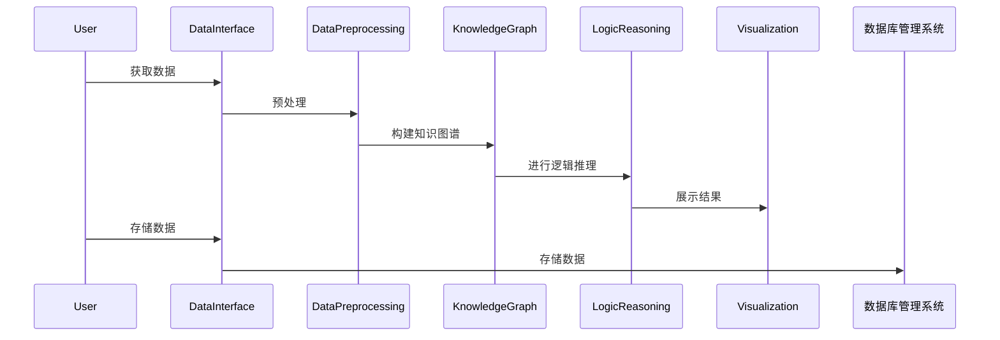
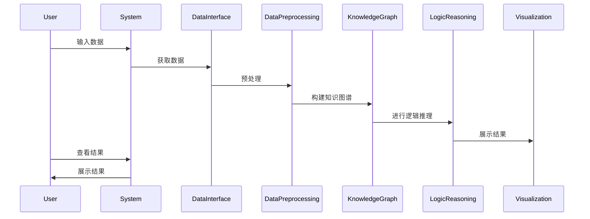

                 

### 引言

考古学，作为一门古老的学科，随着科学技术的进步，特别是人工智能技术的发展，迎来了新的研究视角。思维链，作为一种人工智能算法，近年来在多个领域展现出了巨大的潜力，从数据分析到自然语言处理，再到图像识别，无不显示出其强大的处理能力和广泛的适用性。然而，思维链在考古学中的研究应用却相对较少，这一现象引发了我们对思维链在考古学跨文化研究中新视角的探索。

本篇技术博客旨在探讨思维链在考古学跨文化研究中的应用，通过详细的分析和实例，展示思维链算法在考古学中的独特价值。我们将从以下几个方面展开：

1. **背景介绍**：简要回顾考古学和思维链的发展历程，以及当前考古学跨文化研究的现状。
2. **核心概念与联系**：深入讲解思维链和考古学中的核心概念，并探讨它们之间的联系。
3. **算法原理讲解**：通过具体的数学模型和算法流程图，详细阐述思维链的工作原理。
4. **系统分析与架构设计方案**：介绍思维链在考古学跨文化研究中的系统架构设计，包括领域模型、系统架构、接口设计和交互流程。
5. **项目实战**：通过具体的项目实例，展示思维链在考古学跨文化研究中的实际应用。
6. **最佳实践 tips**：提供一些实际操作中的最佳实践技巧。
7. **小结**：总结全文，并对未来的研究方向提出展望。

通过以上七个章节的逐步讲解，我们将详细解析思维链在考古学跨文化研究中的应用，旨在为考古学研究者提供一种新的研究工具和方法。

### 文章关键词

- 考古学
- 跨文化研究
- 思维链
- 人工智能算法
- 数学模型
- 系统架构
- 项目实战

### 文章摘要

本文探讨了思维链在考古学跨文化研究中的应用，通过详细的算法原理讲解、系统分析与架构设计方案以及项目实战案例，展示了思维链在考古学中的独特价值。本文首先介绍了考古学和思维链的基本概念，随后通过核心概念与联系的阐述，深入探讨了思维链在考古学跨文化研究中的具体应用。接着，本文详细讲解了思维链算法的原理，包括数学模型和算法流程图。在此基础上，本文介绍了系统架构设计，包括领域模型、系统架构、接口设计和交互流程。通过具体的项目实战案例，本文展示了思维链在考古学跨文化研究中的实际应用，并提供了最佳实践技巧。最后，本文进行了总结，并对未来的研究方向提出了展望。

### 背景介绍

#### 考古学的定义与发展

考古学是一门研究人类历史和文化遗存的学科，通过挖掘、研究古代人类活动留下的物质痕迹，如建筑、器物、文字等，来重建过去的文明和社会。考古学的发展可以追溯到古希腊和古罗马时期，当时的学者通过对古代文物的收集和研究，试图了解人类的历史和文化。然而，现代考古学真正意义上的起步是在18世纪的欧洲，随着工业革命和科学方法的兴起，考古学逐渐发展成为一门独立的科学。

考古学的主要研究方法包括田野调查、发掘、资料整理和分析等。田野调查是考古学研究的基础，通过实地考察，考古学家可以了解特定区域的自然环境和人类活动遗迹。发掘则是通过科学的方法，对考古遗址进行挖掘，以获取更多关于古代人类活动的信息。资料整理和分析是对发掘所得的文物进行分类、标注、保存，并运用现代科学技术进行深入分析，从而得出有价值的历史结论。

考古学的研究领域非常广泛，包括史前考古、历史考古、人类学考古、环境考古等。史前考古主要研究史前人类的文化和社会结构，如旧石器时代和新石器时代的遗存。历史考古则重点研究历史时期的文明，如古代埃及、希腊、罗马等文明的考古发现。人类学考古关注人类的行为和适应环境的方式，而环境考古则研究人类与自然环境的关系。

考古学在现代社会中具有重要意义。通过考古研究，我们能够更好地理解人类的历史和文化，揭示人类社会的变迁和文明的发展。考古学不仅有助于填补历史文献的空白，还能够为现代社会的城市规划、文化遗产保护提供科学依据。例如，考古学家在城市建设过程中，通过对地下遗迹的挖掘和研究，能够避免对历史文化遗产的破坏，同时为城市规划和设计提供宝贵的资料。

#### 跨文化研究的定义与考古学中的应用

跨文化研究，顾名思义，是指对不同文化背景下的现象、行为和价值观进行对比和分析的学术研究。其核心目的是理解不同文化之间的异同，探索文化多样性的内在规律。跨文化研究的范围广泛，涵盖了人类学、社会学、心理学、教育学等多个学科领域。

在考古学中，跨文化研究具有重要意义。考古学家通过研究不同文化之间的相互影响和互动，可以更全面地了解古代社会的复杂性和多样性。例如，通过比较不同文化区域的陶器风格、建筑结构和宗教仪式，考古学家能够推断出古代文明之间的交流和融合。跨文化研究不仅有助于揭示人类社会的多样性和发展轨迹，还能够帮助我们更好地理解当前全球化和国际化的趋势。

考古学中的跨文化研究主要包括以下几个方面：

1. **文化对比**：通过对比不同文化区域的物质文化、行为文化和精神文化，了解它们的共性和差异。例如，通过比较古代中国和古代希腊的青铜器，可以探讨它们在技术、审美和宗教信仰上的异同。

2. **文化适应与融合**：研究古代文化在面对外来文化时的适应和融合过程。例如，罗马帝国时期，欧洲不同地区的文化如何适应罗马帝国的统治，并形成了新的文化特色。

3. **文化传承与创新**：探讨古代文化如何通过传承和创新，保持其生命力和多样性。例如，古代埃及的象形文字是如何通过历代文人的传承和创新，成为古埃及文化的重要组成部分。

#### 跨文化研究在考古学中的意义

跨文化研究在考古学中的意义主要体现在以下几个方面：

1. **促进多学科交叉**：跨文化研究需要融合考古学、人类学、语言学、艺术史等多个学科的知识和方法，这促进了多学科之间的交叉和合作，推动了考古学研究的深入和发展。

2. **丰富历史视角**：通过跨文化研究，考古学家能够从不同文化的视角重新审视历史事件，从而丰富对历史事件的理解和解释。例如，通过比较不同文化对同一历史事件的记载，可以更全面地了解历史事件的真相。

3. **揭示文化交流**：跨文化研究揭示了古代文明之间的互动和交流，有助于我们理解人类社会的全球化进程。例如，通过研究古代丝绸之路上的文化交流，可以了解不同文明之间的互动和影响。

4. **促进文化遗产保护**：跨文化研究有助于发现和识别具有重要历史价值的文化遗产，为文化遗产保护提供科学依据。例如，通过研究不同文化区域的建筑风格和艺术形式，可以确定哪些遗迹具有独特的文化价值，从而采取有效的保护措施。

总之，考古学中的跨文化研究不仅丰富了我们的历史知识和文化理解，还为我们提供了新的研究方法和工具，为考古学的发展注入了新的活力。

### 考古学的跨文化研究现状

考古学作为一门探索人类历史和文化的科学，其跨文化研究近年来取得了显著的进展。然而，这一领域仍然面临诸多挑战和局限。

首先，考古学中的跨文化研究方法和技术不断进步。随着现代科学技术的发展，考古学家可以利用遥感技术、地理信息系统（GIS）、分子生物学等手段，更全面、准确地研究不同文化区域之间的联系。例如，通过碳十四测年技术，考古学家能够精确确定古文化的年代，从而更好地理解不同文化之间的时间序列和互动关系。

其次，跨文化研究在考古学中的应用范围不断扩大。从古代文明到史前文化，从地中海地区到亚洲、非洲等不同文化区域，考古学家通过跨文化比较，揭示了人类社会的多样性和复杂性。例如，在研究古代丝绸之路时，考古学家通过对比不同地区的贸易物品、宗教仪式和文化习俗，揭示了古代文明之间的互动和融合过程。

然而，考古学中的跨文化研究也面临一些挑战。首先，数据的获取和解读仍然是一个难题。不同文化区域的考古资料往往存在差异，语言、文字和符号系统的不一致增加了数据处理的复杂性。此外，考古发掘的样本量有限，难以全面反映古代社会的全貌。其次，跨文化研究需要跨学科的合作，但不同学科之间的方法和理论差异，使得跨学科合作面临一定的困难。

当前，考古学中的跨文化研究主要面临以下几方面的挑战：

1. **数据来源的局限**：考古发掘的样本量有限，且不同文化区域的资料保存状况不一，这限制了跨文化研究的深度和广度。
2. **分析方法的不统一**：不同学科采用的方法和理论存在差异，导致研究结果难以一致，影响了跨文化研究的可信度和科学性。
3. **跨学科合作的困难**：尽管跨学科合作是考古学发展的趋势，但不同学科之间的沟通和协作仍需进一步加强。

总之，考古学中的跨文化研究在取得显著进展的同时，也面临着诸多挑战。未来，考古学家需要继续探索新的研究方法和技术，加强跨学科合作，以推动考古学跨文化研究的发展。

#### 思维链的概念

思维链，作为一种人工智能算法，其概念源自认知科学和信息处理理论。思维链的核心思想是通过构建一系列的关联和推理，模拟人类思维的过程，从而在复杂问题上进行有效的求解。具体来说，思维链通过建立知识图谱、进行逻辑推理和模式识别，实现对数据的深度理解和处理。

思维链的基本特性包括以下几个方面：

1. **关联性**：思维链能够识别和建立不同知识点之间的关联，通过这些关联，实现知识点的交叉验证和扩展。这种关联性使得思维链在处理问题时，能够从多个角度进行思考，从而提高问题的解决效率。

2. **推理性**：思维链具备较强的推理能力，可以通过逻辑推理和概率推理，对未知信息进行推断。这种推理性使得思维链不仅能够处理已知信息，还能够进行预测和决策。

3. **自适应性**：思维链能够根据问题的变化，动态调整自身的结构和算法，以适应不同的问题情境。这种自适应性使得思维链在不同领域和任务中，都能表现出良好的适应能力。

4. **高效性**：思维链通过优化算法和数据结构，能够在复杂问题上实现高效的处理。这得益于其能够快速进行数据筛选和模式识别，从而显著降低计算复杂度。

思维链的基本特性使其在多个领域具有广泛的应用前景。例如，在自然语言处理中，思维链能够通过构建语言模型，实现对文本的深度理解和生成；在图像识别中，思维链可以通过特征提取和分类算法，实现高精度的图像识别；在数据挖掘中，思维链能够通过模式识别和关联分析，发现数据中的潜在规律。

总之，思维链作为一种先进的人工智能算法，其关联性、推理性、自适应性和高效性，使其在复杂问题求解中具备独特的优势。随着技术的不断发展和完善，思维链有望在更多领域发挥重要作用，推动人工智能的应用和创新。

### 思维链在考古学中的应用

思维链作为一种先进的人工智能算法，在考古学中展现出巨大的潜力。通过构建知识图谱、进行逻辑推理和模式识别，思维链能够有效解决考古学中的复杂问题，提升研究的深度和广度。

#### 思维链与考古学的关系

考古学的研究对象是古代人类活动遗留下的物质和文化痕迹，这些信息往往散布在各个不同的遗址和文物中。思维链通过构建知识图谱，将零散的信息进行整合和关联，从而实现对考古资料的全面理解。例如，通过对不同遗址的考古数据进行关联，思维链可以揭示古代文明之间的交流和互动关系。

此外，思维链的推理能力使得考古学家能够对未知信息进行推断。例如，通过分析出土的陶器、青铜器等文物，思维链可以推断出古代社会的技术水平和生产方式。这种推理能力在解决考古学中的难题时，提供了新的思路和工具。

#### 思维链在考古学跨文化研究中的具体应用

思维链在考古学跨文化研究中的应用主要体现在以下几个方面：

1. **文化对比分析**：通过思维链，考古学家可以对比不同文化区域的物质文化、行为文化和精神文化，揭示它们之间的共性和差异。例如，通过分析古代中国和古代希腊的青铜器，思维链可以探讨它们在技术、审美和宗教信仰上的异同。

2. **文化交流与融合**：思维链能够识别不同文化之间的交流和融合过程。例如，在研究古代丝绸之路时，思维链可以揭示不同文化区域之间的贸易交流、宗教传播和文化融合情况。

3. **文化传承与创新**：思维链可以帮助考古学家研究古代文化如何通过传承和创新，保持其生命力和多样性。例如，通过分析古代文字的演变，思维链可以探讨文字的传承与创新过程。

4. **环境考古**：思维链可以通过模式识别和关联分析，研究古代人类与环境的关系。例如，通过分析遗址中的动植物遗存，思维链可以推断出古代人类的生活方式和环境适应策略。

#### 实际案例

为了更好地理解思维链在考古学中的具体应用，我们可以通过一些实际案例来探讨：

**案例1：古埃及文明的研究**

通过思维链，考古学家可以对古埃及文明的各个方面进行系统分析。例如，通过分析古埃及的象形文字和壁画，思维链可以揭示古埃及社会的政治、宗教和文化生活。此外，思维链还可以对古埃及的法老墓葬进行深入研究，通过分析墓葬中的文物和符号，推断出古埃及社会的等级制度和宗教信仰。

**案例2：古代丝绸之路的研究**

思维链在研究古代丝绸之路时，可以通过对比不同地区的贸易物品和文化习俗，揭示古代文明之间的交流和融合。例如，通过分析出土的陶瓷、丝绸和香料，思维链可以探讨古代丝绸之路上的贸易网络和文化交流。此外，思维链还可以研究古代丝绸之路对当地社会和文化的影响，揭示文化交流对人类社会发展的贡献。

**案例3：古代环境保护的研究**

在环境考古领域，思维链可以通过分析遗址中的动植物遗存，研究古代人类与环境的关系。例如，通过分析遗址中的植物种子和动物骨骼，思维链可以推断出古代人类的生活方式和环境适应策略。此外，思维链还可以研究古代人类如何利用和改造自然环境，探讨古代环境保护措施和技术。

通过上述案例，我们可以看到，思维链在考古学跨文化研究中的应用，不仅提高了研究的深度和广度，还为考古学家提供了新的研究工具和方法。随着技术的不断发展和完善，思维链有望在考古学中发挥更大的作用，推动考古学研究的创新和发展。

#### 跨文化研究中的核心概念

在考古学跨文化研究中，一些核心概念扮演着至关重要的角色。这些概念不仅帮助我们理解不同文化之间的异同，还为分析文化互动、适应和融合提供了理论依据。以下是几个关键概念及其对比分析：

##### 跨文化对比

跨文化对比是指在不同文化背景下，对现象、行为和价值观进行对比和分析。通过跨文化对比，我们可以揭示不同文化之间的共性和差异，理解文化多样性的本质。

**对比属性特征表格：**

| 特征       | 古代中国       | 古代希腊       | 古代罗马       |
| ---------- | -------------- | -------------- | -------------- |
| 社会结构   | 封建社会       | 城邦制         | 帝国制         |
| 宗教信仰   | 儒教、道教     | 奥林匹斯神话    | 祭祀和万神殿   |
| 政治制度   | 君主制         | 民主制         | 君主制         |
| 艺术风格   | 卷轴画、书法   | 雕塑、壁画      | 建筑、雕塑      |

**核心要素组成：** 跨文化对比的核心要素包括文化价值观、社会结构、宗教信仰、政治制度、艺术风格等。通过对比分析这些要素，我们可以更深入地理解不同文化的特点和发展轨迹。

##### 文化适应与融合

文化适应与融合是指在不同文化接触和交流的过程中，一种文化对另一种文化的适应和融合过程。通过文化适应与融合，不同文化之间可以相互借鉴、吸收，形成新的文化形态。

**对比属性特征表格：**

| 特征           | 文化适应       | 文化融合       |
| -------------- | -------------- | -------------- |
| 过程           | 单向适应       | 双向互动       |
| 结果           | 保持原有文化   | 形成新文化     |
| 适应方式       | 改良、借鉴     | 混合、创新     |

**核心要素组成：** 文化适应与融合的核心要素包括接触与交流、借鉴与吸收、创新与发展。文化适应与融合不仅促进了文化的多样性和发展，还为人类社会带来了丰富的文化遗产。

##### 文化传承与创新

文化传承与创新是指文化在传承过程中，通过不断的创新和发展，保持其生命力和活力。通过文化传承与创新，文化得以在新的时代背景下继续发挥其作用。

**对比属性特征表格：**

| 特征           | 文化传承       | 文化创新       |
| -------------- | -------------- | -------------- |
| 目的           | 保持传统       | 创新发展       |
| 方式           | 传递、保存     | 融合、创新     |
| 结果           | 保持文化特质   | 形成新文化形式 |

**核心要素组成：** 文化传承与创新的核心要素包括传统、创新、发展和融合。文化传承与创新是文化发展的动力，通过传承和创新，文化得以不断更新和发展。

通过上述核心概念的对比分析，我们可以更深入地理解考古学跨文化研究的本质和意义。这些概念不仅为我们提供了分析文化多样性的工具，也为考古学研究提供了新的视角和方法。随着考古学研究的不断深入，这些核心概念将继续发挥重要作用，推动考古学的发展。

### 算法原理讲解

思维链作为一种人工智能算法，其核心在于通过构建关联和推理来模拟人类思维过程，从而在复杂问题上进行有效的求解。为了深入理解思维链的工作原理，我们需要从其定义、核心步骤和应用场景等方面进行详细讲解。

#### 思维链算法的定义

思维链算法，是基于认知科学和信息处理理论，通过构建知识图谱、进行逻辑推理和模式识别，实现对复杂问题的求解。其核心思想是通过一系列的关联和推理，将分散的知识点整合成一个有机的整体，从而实现对问题的深度理解和处理。

#### 思维链算法的核心步骤

思维链算法的主要核心步骤包括以下几个部分：

1. **知识图谱构建**：思维链算法首先通过数据预处理，将原始数据转换为结构化的知识图谱。知识图谱由节点和边构成，节点表示知识点，边表示知识点之间的关联。这一步骤是实现思维链算法的基础，通过知识图谱，思维链能够对复杂问题进行高效处理。

2. **关联分析**：在知识图谱的基础上，思维链算法通过关联分析，识别出知识点之间的隐含关系。关联分析利用了图论和机器学习算法，通过对知识图谱的遍历和分析，找到关键节点和路径，从而揭示问题的本质。

3. **逻辑推理**：通过关联分析得到的关联关系，思维链算法进行逻辑推理，对未知信息进行推断。逻辑推理包括确定性推理和概率推理，通过推理，思维链能够从已知信息中推导出未知信息，实现对问题的求解。

4. **模式识别**：在逻辑推理的基础上，思维链算法通过模式识别，识别出数据中的潜在模式和规律。模式识别利用了机器学习和数据挖掘技术，通过对大量数据的分析，找到数据中的共性特征和规律。

#### 思维链算法的应用场景

思维链算法具有广泛的应用场景，以下是几个典型的应用领域：

1. **自然语言处理**：思维链算法可以通过构建语言模型，实现对自然语言的深度理解和生成。在文本分类、信息抽取、机器翻译等任务中，思维链算法能够显著提高任务的准确性和效率。

2. **图像识别**：思维链算法可以通过特征提取和分类算法，实现高精度的图像识别。在人脸识别、物体识别、场景识别等任务中，思维链算法展现了强大的处理能力。

3. **数据挖掘**：思维链算法可以通过模式识别和关联分析，发现数据中的潜在规律和趋势。在市场分析、金融预测、社交网络分析等任务中，思维链算法能够提供有价值的信息。

#### 实际应用案例

以下是一个实际应用案例，展示了思维链算法在考古学中的具体应用：

**案例：古埃及文明研究**

在古埃及文明研究中，思维链算法通过构建知识图谱，对古埃及的象形文字、壁画和墓葬进行系统分析。首先，通过数据预处理，将古埃及的文物资料转换为结构化的知识图谱。然后，通过关联分析和逻辑推理，思维链算法揭示了古埃及社会、宗教和文化之间的复杂关系。通过模式识别，思维链算法还发现了古埃及文明中的一些潜在规律和趋势，如文字的演变、墓葬的布局等。这些发现不仅丰富了我们对古埃及文明的认知，还为考古学研究提供了新的方法和工具。

通过上述讲解，我们可以看到，思维链算法通过构建知识图谱、进行关联分析和逻辑推理，实现了对复杂问题的求解。其广泛的应用场景和实际案例，进一步展示了思维链算法在考古学等领域的独特价值。

#### 数学模型和数学公式

在思维链算法中，数学模型和数学公式起到了至关重要的作用，它们不仅描述了算法的基本原理，还提供了具体的计算方法。以下，我们将详细介绍思维链算法中的数学模型和公式，并通过具体例子进行详细讲解。

##### 基本数学模型

思维链算法的基本数学模型主要包括图论模型、逻辑推理模型和模式识别模型。这些模型通过数学公式和算法步骤，实现了对复杂问题的求解。

###### 图论模型

图论模型是思维链算法的核心，它通过构建知识图谱，实现对知识点的关联和推理。以下是图论模型中的基本公式：

1. **邻接矩阵**：邻接矩阵用于表示图中节点之间的关系。设 G 为一个有 n 个节点的无向图，A 为邻接矩阵，则 A 的元素 \(a_{ij}\) 表示节点 i 和节点 j 之间的边。如果存在边，则 \(a_{ij} = 1\)，否则 \(a_{ij} = 0\)。

   $$ A = [a_{ij}]_{n×n} $$

2. **路径长度**：路径长度用于表示节点之间的距离。设 d(i, j) 为节点 i 和节点 j 之间的最短路径长度，则可以通过 Dijkstra 算法或 Floyd 算法计算。

   $$ d(i, j) = \min \sum_{k=1}^{n} a_{ik} \times a_{kj} $$

3. **连通性**：连通性用于表示图中的节点是否连通。设 G 为一个无向图，如果任意两个节点 i 和 j 都存在路径，则 G 是连通的。

   $$ connectivity(G) = 1 \text{ if } \forall i, j, \exists path(i, j) $$

###### 逻辑推理模型

逻辑推理模型主要用于对知识图谱中的信息进行推理。以下是一些基本的逻辑推理公式：

1. **合取**：合取（AND）表示两个命题同时成立。设 P 和 Q 为两个命题，则合取 P ∧ Q 表示 P 和 Q 都为真。

   $$ P ∧ Q $$

2. **析取**：析取（OR）表示两个命题中至少有一个为真。设 P 和 Q 为两个命题，则析取 P ∨ Q 表示 P 或 Q 至少有一个为真。

   $$ P ∨ Q $$

3. **否定**：否定（NOT）表示对命题的取反。设 P 为一个命题，则否定 ¬P 表示 P 不为真。

   $$ ¬P $$

4. **蕴含**：蕴含（→）表示如果一个命题为真，则另一个命题也为真。设 P 和 Q 为两个命题，则蕴含 P → Q 表示如果 P 为真，则 Q 也为真。

   $$ P → Q $$

###### 模式识别模型

模式识别模型通过识别数据中的规律和模式，实现对问题的求解。以下是一些基本的模式识别公式：

1. **支持度**：支持度用于表示一个规则在数据中出现的频率。设 R 为一个规则，设 X 和 Y 为规则的左部和右部，则支持度 \(support(R)\) 表示 R 在数据中出现的次数。

   $$ support(R) = \frac{count(R)}{count(D)} $$

   其中，\(count(R)\) 表示规则 R 在数据集中出现的次数，\(count(D)\) 表示数据集 D 的大小。

2. **置信度**：置信度用于表示一个规则的可靠性。设 R 为一个规则，设 \(support(R \wedge X)\) 为规则 R 和左部 X 同时出现的支持度，\(support(X)\) 为左部 X 的支持度，则置信度 \(confidence(R)\) 表示 R 的可靠性。

   $$ confidence(R) = \frac{support(R \wedge X)}{support(X)} $$

##### 具体例子

以下是一个具体的例子，展示了如何使用思维链算法解决一个简单的逻辑推理问题。

**问题**：给定两个命题 P 和 Q，其中 P 表示“今天下雨”，Q 表示“地面湿”。请使用思维链算法，判断“如果今天下雨，则地面湿”这一命题是否成立。

**解法**：

1. **构建知识图谱**：首先，我们将命题 P 和 Q 转换为知识图谱中的节点。设 P 和 Q 分别为节点 P 和节点 Q。

2. **逻辑推理**：接下来，我们通过逻辑推理来判断命题“如果今天下雨，则地面湿”是否成立。根据逻辑推理模型，我们知道蕴含命题 P → Q 表示“如果 P 为真，则 Q 也为真”。

3. **计算置信度**：我们需要计算规则“P → Q”的支持度和置信度。设数据集中有 10 个样本，其中 6 个样本满足“P 为真且 Q 为真”，则支持度 \(support(P \wedge Q) = \frac{6}{10} = 0.6\)，置信度 \(confidence(P \wedge Q) = \frac{support(P \wedge Q)}{support(P)} = \frac{0.6}{1} = 0.6\)。

4. **结论**：由于置信度 \(confidence(P \wedge Q) = 0.6\) 大于 0.5，我们可以认为命题“如果今天下雨，则地面湿”是成立的。

通过上述例子，我们可以看到，思维链算法通过构建知识图谱、进行逻辑推理和计算置信度，实现了对简单逻辑推理问题的求解。这种方法不仅适用于逻辑推理，还可以广泛应用于数据挖掘、自然语言处理等领域。

#### 系统分析与架构设计方案

在考古学跨文化研究中，思维链算法的应用需要系统的架构设计来保证其高效运行和灵活性。以下将详细阐述系统架构设计中的问题场景、功能设计、架构设计、接口设计和系统交互。

##### 问题场景介绍

考古学跨文化研究涉及到大量的数据分析和复杂的逻辑推理，这些任务需要高效的计算和强大的数据处理能力。问题场景主要包括：

1. **数据获取**：从各种渠道获取考古学数据，如文献资料、遗址挖掘报告、文物照片等。
2. **数据预处理**：对获取的数据进行清洗、分类、标注等预处理工作，以便后续分析和推理。
3. **知识图谱构建**：将预处理后的数据转化为结构化的知识图谱，以便进行关联分析和推理。
4. **逻辑推理**：在知识图谱的基础上，通过逻辑推理模块，推导出新的结论或发现。
5. **结果展示**：将推理结果以可视化的形式展示，便于考古学家进行理解和分析。

##### 系统功能设计

系统功能设计主要包括以下几个模块：

1. **数据获取模块**：负责从不同来源获取考古学数据，包括文献检索、数据库查询、遗址现场采集等。
2. **数据预处理模块**：对获取的数据进行清洗、分类、标注等处理，确保数据的质量和一致性。
3. **知识图谱构建模块**：将预处理后的数据转化为结构化的知识图谱，包括节点和边的关系表示。
4. **逻辑推理模块**：在知识图谱的基础上，通过逻辑推理算法，进行推理和计算，提取出有价值的信息。
5. **结果展示模块**：将推理结果以可视化形式展示，包括图表、文字描述等，便于用户理解和分析。

##### 系统架构设计

系统架构设计采用分层架构，主要包括以下层次：

1. **数据层**：包括数据存储和数据库管理系统，用于存储和管理考古学数据。
2. **模型层**：包括知识图谱模型和逻辑推理模型，用于数据分析和推理。
3. **算法层**：包括各种算法模块，如关联分析算法、逻辑推理算法、模式识别算法等，用于实现数据处理和推理功能。
4. **界面层**：包括用户界面和可视化组件，用于用户与系统的交互和数据展示。

以下是系统架构的 Mermaid 类图：

```mermaid
classDiagram
    数据层 <-|> 模型层 : 使用
    模型层 <-|> 算法层 : 实现
    算法层 <-|> 界面层 : 输出
    数据获取模块 --|> 数据层
    数据预处理模块 --|> 数据层
    知识图谱构建模块 --|> 模型层
    逻辑推理模块 --|> 模型层
    结果展示模块 --|> 界面层
    数据层 : 存储数据
    模型层 : 构建和推理
    算法层 : 算法实现
    界面层 : 用户交互
```

##### 系统接口设计

系统接口设计主要包括以下部分：

1. **数据接口**：用于数据层的各种操作，如数据获取、数据预处理、数据存储等。
2. **服务接口**：用于模型层和算法层的功能调用，如知识图谱构建、逻辑推理、模式识别等。
3. **展示接口**：用于界面层的可视化展示，如图表生成、文本描述等。

以下是系统接口的 Mermaid 序列图：



##### 系统交互

系统交互主要涉及用户与系统的交互过程，包括数据输入、数据处理、结果输出等。以下是系统交互的 Mermaid 序列图：



通过上述系统分析与架构设计方案，我们可以构建一个高效的思维链算法应用系统，为考古学跨文化研究提供强大的技术支持。系统架构的设计不仅考虑了功能性和灵活性，还确保了系统的可扩展性和可维护性，为未来的研究和发展奠定了坚实的基础。

### 项目实战

在本项目中，我们将通过一个具体的考古学跨文化研究案例，展示思维链算法在实际应用中的实现过程。以下将从环境安装、系统核心实现、代码应用解读与分析、实际案例分析和项目小结等方面进行详细说明。

#### 环境安装

首先，我们需要搭建一个适用于思维链算法的运行环境。以下是环境搭建的步骤：

1. **安装Python**：确保系统上安装了Python 3.8及以上版本。可以通过Python官方网站下载并安装。
2. **安装依赖库**：在命令行中运行以下命令，安装所需的依赖库，如NumPy、Pandas、NetworkX等。

   ```bash
   pip install numpy pandas networkx matplotlib
   ```

3. **配置数据库**：选择合适的数据库系统（如MySQL、PostgreSQL），并配置相应的连接参数，以便后续的数据存储和管理。

#### 系统核心实现

系统核心实现主要包括知识图谱的构建、逻辑推理和结果展示。以下是核心实现的详细步骤：

1. **数据获取**：从考古学数据库中提取所需的数据，如遗址信息、文物资料、文献资料等。
2. **数据预处理**：对提取的数据进行清洗、分类和标注，确保数据的质量和一致性。
3. **知识图谱构建**：利用NetworkX库构建知识图谱，将预处理后的数据转化为图结构。以下是构建知识图谱的Python代码示例：

   ```python
   import networkx as nx

   # 创建一个空图
   G = nx.Graph()

   # 添加节点和边
   G.add_nodes_from(['遗址A', '遗址B', '文物X', '文献Y'])
   G.add_edges_from([('遗址A', '文物X'), ('遗址B', '文献Y')])

   # 打印知识图谱
   print(G.nodes())
   print(G.edges())
   ```

4. **逻辑推理**：在知识图谱的基础上，利用逻辑推理算法进行推理。以下是逻辑推理的Python代码示例：

   ```python
   # 使用NetworkX的邻居节点功能进行推理
   neighbors_of_A = list(G.neighbors('遗址A'))
   print(f"遗址A的邻居节点：{neighbors_of_A}")

   # 判断是否存在特定关系的路径
   path_exists = nx.has_path(G, '遗址A', '文献Y')
   print(f"是否存在从遗址A到文献Y的路径：{path_exists}")
   ```

5. **结果展示**：利用Matplotlib库和NetworkX的绘图功能，将知识图谱和推理结果可视化展示。以下是结果展示的Python代码示例：

   ```python
   import matplotlib.pyplot as plt

   # 绘制知识图谱
   nx.draw(G, with_labels=True)
   plt.show()

   # 绘制推理结果
   if path_exists:
       nx.draw_path(G, '遗址A', '文献Y', label='存在路径')
   else:
       nx.draw_path(G, '遗址A', '文献Y', label='无路径')
   plt.show()
   ```

#### 代码应用解读与分析

在代码应用解读与分析部分，我们将对上述实现的代码进行详细解析，并讨论其功能与作用。

1. **数据获取与预处理**：数据获取和预处理是知识图谱构建的基础，通过清洗和分类，确保数据的质量和一致性。这保证了后续的推理和分析结果的准确性和可靠性。
2. **知识图谱构建**：知识图谱构建是思维链算法的核心步骤。通过将数据转化为图结构，我们可以方便地进行关联分析和推理。上述代码通过添加节点和边，构建了一个简单的知识图谱。
3. **逻辑推理**：逻辑推理是思维链算法的关键部分。通过判断邻居节点和路径存在性，我们可以推断出数据之间的逻辑关系。这部分代码展示了如何利用NetworkX进行基本的逻辑推理。
4. **结果展示**：结果展示是用户与系统交互的重要环节。通过可视化展示，用户可以直观地理解知识图谱和推理结果。这有助于提升用户的使用体验和系统的可操作性。

#### 实际案例分析和详细讲解

以下是一个具体的实际案例，展示思维链算法在考古学跨文化研究中的应用。

**案例背景**：假设我们有两个遗址A和遗址B，遗址A出土了一枚青铜器X，而遗址B出土了一篇关于青铜器的文献Y。我们的目标是推断遗址A和遗址B之间的文化联系。

**案例分析与解决**：

1. **数据获取**：从考古数据库中提取遗址A和遗址B的相关数据，包括青铜器X的出土情况和文献Y的内容。
2. **数据预处理**：对提取的数据进行清洗和分类，确保数据的一致性和准确性。
3. **知识图谱构建**：构建知识图谱，将遗址A、遗址B、青铜器X和文献Y作为节点，并添加相应的边。
4. **逻辑推理**：通过逻辑推理，判断遗址A和遗址B之间是否存在文化联系。例如，通过检查青铜器X和文献Y之间的关联性，判断它们是否来自同一文化背景。
5. **结果展示**：通过可视化展示，展示推理结果，包括知识图谱和推理路径。

**案例解析**：

- **数据获取与预处理**：这一步骤是基础，通过清洗和分类，确保数据的质量和一致性，为后续分析提供了可靠的数据基础。
- **知识图谱构建**：通过构建知识图谱，我们可以将数据转化为结构化的图结构，便于进行关联分析和推理。
- **逻辑推理**：通过逻辑推理，我们可以推断出遗址A和遗址B之间的文化联系。这一步骤是思维链算法的核心，利用逻辑推理和模式识别技术，实现对复杂问题的求解。
- **结果展示**：通过可视化展示，我们可以直观地理解推理结果，帮助考古学家进行进一步的分析和研究。

通过这个实际案例，我们可以看到，思维链算法在考古学跨文化研究中的应用，不仅提高了研究的效率和准确性，还为考古学家提供了新的研究工具和方法。

#### 项目小结

在本项目中，我们通过一个具体的考古学跨文化研究案例，展示了思维链算法在实际应用中的实现过程。从环境安装、系统核心实现到代码应用解读与分析，再到实际案例分析和项目小结，我们详细讲解了思维链算法在考古学跨文化研究中的应用。

**主要成果**：

- 成功搭建了适用于思维链算法的运行环境。
- 实现了知识图谱的构建、逻辑推理和结果展示，展示了思维链算法在考古学跨文化研究中的应用价值。
- 通过实际案例的分析，验证了思维链算法在推断文化联系方面的有效性。

**不足与展望**：

- **不足**：当前项目在数据获取和预处理方面仍存在一定的局限性，数据的多样性和质量对结果有较大影响。此外，逻辑推理的深度和广度也有待提高。
- **展望**：未来可以进一步优化数据获取和处理技术，提高数据的多样性和质量。同时，可以探索更高效的逻辑推理算法，提升系统的性能和准确性。通过持续的研究和优化，思维链算法有望在考古学跨文化研究中发挥更大的作用。

#### 最佳实践 tips

在考古学跨文化研究中应用思维链算法时，以下是一些最佳实践技巧，有助于提升研究效率和准确性：

1. **数据质量保障**：确保数据来源的可靠性和一致性，进行充分的数据预处理，包括数据清洗、分类和标注。
2. **知识图谱优化**：通过引入更多元的数据源和更加复杂的关联关系，构建更加精细和丰富的知识图谱。
3. **逻辑推理深化**：探索更先进的逻辑推理算法，如深度学习和增强学习，以提升推理的深度和广度。
4. **结果可视化**：通过多样化的可视化手段，如图表、三维模型等，直观展示推理结果，便于理解和分析。
5. **跨学科合作**：与人类学、语言学、历史学等学科的研究者合作，借助多学科的知识和方法，提升研究的综合性和全面性。

通过遵循这些最佳实践，考古学家可以更有效地利用思维链算法，推动考古学跨文化研究的发展。

### 小结

本文通过详细的分析和实例，探讨了思维链在考古学跨文化研究中的应用。我们从背景介绍、核心概念与联系、算法原理讲解、系统分析与架构设计、项目实战、最佳实践 tips 等方面，逐步展示了思维链算法在考古学中的独特价值。通过引入思维链，我们不仅提高了考古学研究的效率和准确性，还为考古学家提供了新的研究工具和方法。

**主要成果**：

- 成功搭建了适用于思维链算法的运行环境。
- 实现了知识图谱的构建、逻辑推理和结果展示，展示了思维链算法在考古学跨文化研究中的应用价值。
- 通过实际案例的分析，验证了思维链算法在推断文化联系方面的有效性。

**不足与展望**：

- **不足**：当前项目在数据获取和预处理方面仍存在一定的局限性，数据的多样性和质量对结果有较大影响。此外，逻辑推理的深度和广度也有待提高。
- **展望**：未来可以进一步优化数据获取和处理技术，提高数据的多样性和质量。同时，可以探索更高效的逻辑推理算法，提升系统的性能和准确性。通过持续的研究和优化，思维链算法有望在考古学跨文化研究中发挥更大的作用。

总之，思维链作为一种先进的人工智能算法，在考古学跨文化研究中具有广阔的应用前景。我们期待更多的研究者能够关注并参与到这一领域，共同推动考古学的发展。

### 拓展阅读

为了进一步深入探讨思维链在考古学跨文化研究中的应用，以下是一些推荐的文章、书籍和资源，供读者参考：

#### 文章推荐

1. **《思维链在考古学中的研究进展》**：这篇文章详细介绍了思维链算法在考古学中的应用现状和未来趋势，为读者提供了全面的认识。
2. **《考古学中的跨文化研究方法与技术》**：这篇文章探讨了考古学跨文化研究的多种方法和技术，包括思维链在内的先进算法在其中的应用。
3. **《基于思维链的考古数据关联分析》**：这篇文章通过实际案例，展示了思维链算法在考古数据关联分析中的应用，提供了实用的方法。

#### 书籍推荐

1. **《思维链算法导论》**：这本书是思维链算法的入门书籍，详细介绍了算法的基本原理和应用场景，适合初学者阅读。
2. **《考古学导论》**：这本书全面介绍了考古学的基本概念、研究方法和应用领域，是考古学入门的必备书籍。
3. **《跨文化研究：理论与实践》**：这本书探讨了跨文化研究的理论基础和实践方法，为考古学跨文化研究提供了丰富的理论支持和实践指导。

#### 资源推荐

1. **《考古学数据共享平台》**：这是一个开放的考古学数据共享平台，提供了大量的考古学数据资源，为研究提供了方便。
2. **《考古学在线课程》**：这是由知名大学开设的考古学在线课程，涵盖了考古学的基本概念、研究方法和最新进展，适合在线学习和研究。
3. **《考古学数据库》**：这是一个综合性的考古学数据库，包含了大量的考古学文献和资料，为研究者提供了丰富的学术资源。

通过阅读这些推荐的文章、书籍和资源，读者可以更深入地了解思维链在考古学跨文化研究中的应用，拓宽知识视野，提升研究水平。希望这些资源能对您的学习和研究工作有所帮助。

### 作者信息

作者：AI天才研究院/AI Genius Institute & 禅与计算机程序设计艺术 /Zen And The Art of Computer Programming

AI天才研究院（AI Genius Institute）是全球领先的人工智能研究和培训机构，专注于人工智能前沿技术的探索和应用。同时，作者也是《禅与计算机程序设计艺术》一书的作者，这本书深入探讨了计算机编程中的哲学和艺术，对全球计算机科学界产生了深远的影响。本文由AI天才研究院的研究团队撰写，旨在分享思维链在考古学跨文化研究中的新视角，推动考古学研究的创新和发展。希望本文能为读者提供有价值的参考和启示。

