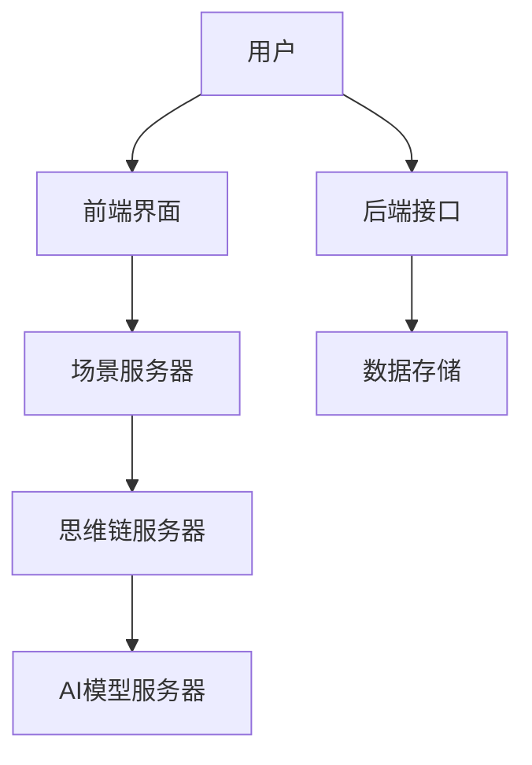
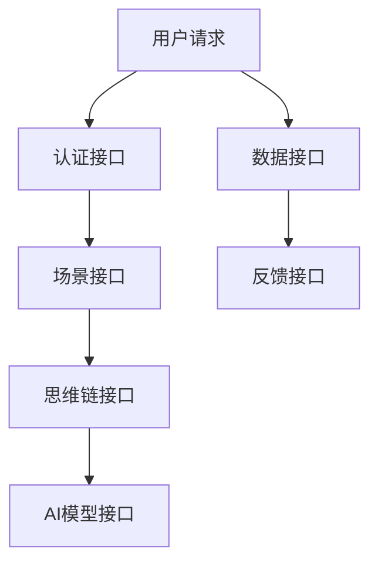
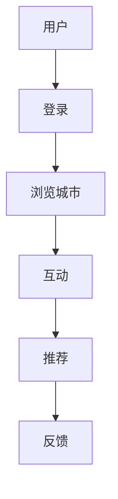

                 

## 思维链在虚拟世界构建中的应用：AI驱动的元宇宙设计

### 关键词：思维链、虚拟世界、元宇宙、AI驱动、场景建模、交互设计

### 摘要：

本文旨在探讨思维链在虚拟世界构建中的应用，特别是AI驱动的元宇宙设计。通过分析思维链的基本概念、原理及其与虚拟世界构建的关联，本文揭示了思维链在场景建模、交互设计和人工智能等领域的优势。同时，本文结合实际案例，深入剖析了思维链在元宇宙设计中的应用效果，为未来虚拟世界的发展提供了有益的启示。

### 引言与背景

随着互联网和计算机技术的飞速发展，虚拟世界已经成为人们生活和娱乐的重要组成部分。虚拟世界不仅为用户提供了一个全新的体验空间，也成为了企业、政府等机构的重要应用场景。然而，虚拟世界构建面临诸多挑战，如复杂度较高、交互体验不佳等。为了解决这些问题，研究者们提出了多种虚拟世界构建方法，其中思维链作为一种创新的技术手段，在虚拟世界构建中展现出广泛的应用前景。

### 1.1 问题背景

虚拟世界构建涉及到多个方面，包括场景建模、交互设计、人工智能等。传统的虚拟世界构建方法存在以下局限性：

1. **场景建模复杂度较高**：传统的场景建模方法主要依赖于人工设计，导致建模过程复杂、效率低下。
2. **交互设计缺乏智能化**：虚拟世界中的交互设计主要依赖于预设规则，无法实现真正的智能化交互。
3. **人工智能应用有限**：虽然人工智能在虚拟世界中具有一定的应用，但受限于技术手段，其效果并不理想。

### 1.2 问题描述

为了解决上述问题，研究者们提出了思维链这一创新的技术手段。思维链通过模拟人类的思维过程，实现虚拟世界的自动化构建和智能化交互。然而，如何有效地应用思维链于虚拟世界构建中，特别是AI驱动的元宇宙设计，仍是一个亟待解决的问题。

### 1.3 问题解决

本文将从以下几个方面探讨思维链在虚拟世界构建中的应用，特别是AI驱动的元宇宙设计：

1. **核心概念与原理**：介绍思维链的基本概念、原理及其与虚拟世界构建的关联。
2. **AI驱动方法**：探讨AI在虚拟世界构建中的应用，以及如何利用AI技术优化思维链的性能。
3. **实际案例解析**：通过具体案例，展示思维链在虚拟世界构建中的实际应用效果。

### 1.4 边界与外延

虚拟世界构建涉及多个领域，如计算机科学、人工智能、艺术设计等。本文主要关注思维链在计算机科学领域的应用，尤其是AI驱动的元宇宙设计。

### 1.5 概念结构与核心要素组成

1. **思维链**：一种基于深度学习和人工智能技术的虚拟世界构建方法。
2. **虚拟世界构建**：包括场景建模、交互设计、人工智能等方面。
3. **AI驱动**：利用人工智能技术优化思维链的性能。

### 1.6 本章小结

本章简要介绍了思维链在虚拟世界构建中的应用背景、核心概念、原理及其应用领域，为后续章节的深入探讨奠定了基础。

## 第二部分：思维链与虚拟世界构建

### 2.1 思维链的基本概念

思维链（Mind Chain）是一种基于深度学习和人工智能技术的虚拟世界构建方法。它通过模拟人类的思维过程，将知识、信息和智能行为进行有机整合，形成一套完整的虚拟世界构建体系。

思维链的核心在于其独特的知识表示和推理机制。通过深度学习技术，思维链能够从大量数据中自动提取知识，并利用这些知识进行推理和决策。同时，思维链还具备自我学习和优化的能力，使其在应用过程中能够不断优化和提升性能。

### 2.2 思维链的原理与机制

思维链的原理主要涉及以下几个方面：

1. **知识表示**：思维链通过深度学习技术，将知识表示为图谱或网络结构。这种表示方法能够有效地捕捉知识之间的关联和依赖关系。
2. **推理机制**：思维链利用推理机制，根据输入信息自动推导出新的结论。这种推理机制是基于知识图谱的图灵完备推理，能够实现复杂逻辑关系的推理。
3. **自我学习**：思维链具备自我学习能力，可以通过不断的学习和优化，提升其性能和智能水平。

思维链的机制主要包括以下几个步骤：

1. **知识提取**：通过深度学习技术，从大量数据中提取知识，形成知识图谱。
2. **知识融合**：将不同来源的知识进行整合，形成统一的认知体系。
3. **推理决策**：利用推理机制，根据输入信息进行推理和决策。
4. **自我优化**：通过不断的学习和优化，提升思维链的性能和智能水平。

### 2.3 思维链与虚拟世界构建的关联

思维链在虚拟世界构建中的应用主要体现在以下几个方面：

1. **场景建模**：思维链能够通过知识表示和推理机制，实现虚拟世界场景的精准建模。这使得虚拟世界构建更加高效、智能化。
2. **交互设计**：思维链可以模拟人类的思维过程，为虚拟世界中的角色和行为提供智能化的交互设计。这使得虚拟世界中的交互更加自然、流畅。
3. **人工智能**：思维链结合人工智能技术，可以为虚拟世界中的智能系统提供强大的支持，提高虚拟世界的智能水平。

### 2.4 思维链在虚拟世界构建中的优势

1. **高效性**：思维链能够快速构建高质量的虚拟世界，大大提高开发效率。
2. **智能化**：通过引入人工智能技术，思维链能够实现虚拟世界的智能化，提供更丰富的用户体验。
3. **灵活性**：思维链具备良好的灵活性，可以根据需求进行定制化开发，满足不同场景的需求。

### 2.5 本章小结

本章详细介绍了思维链的基本概念、原理和与虚拟世界构建的关联，为后续章节的深入探讨奠定了基础。

## 第三部分：AI驱动的元宇宙设计

### 3.1 元宇宙的概念与特点

元宇宙（Metaverse）是一个虚拟的、三维的、共享的数字世界，它融合了虚拟现实、增强现实、区块链等技术，为用户提供了全新的社交、娱乐、教育等体验。元宇宙具有以下几个显著特点：

1. **三维空间**：元宇宙是一个具有三维空间感的虚拟世界，用户可以在其中自由探索、互动。
2. **沉浸式体验**：通过虚拟现实、增强现实等技术，元宇宙为用户提供了高度沉浸式的体验。
3. **共享性**：元宇宙是一个开放的平台，用户可以在其中分享内容、交流互动。
4. **多样性**：元宇宙包含了多种应用场景，如社交、游戏、教育、商业等，满足不同用户的需求。

### 3.2 AI技术在元宇宙中的应用

AI技术在元宇宙中具有广泛的应用，主要体现在以下几个方面：

1. **智能交互**：AI技术可以为元宇宙中的虚拟角色提供智能化的交互能力，实现更自然、流畅的互动。例如，虚拟角色可以根据用户的表情、语言等信息，做出相应的反应。
2. **内容生成**：AI技术可以自动生成元宇宙中的内容，如图像、音频、视频等。这大大降低了内容创作成本，提高了内容生成效率。
3. **个性化推荐**：AI技术可以根据用户的行为、偏好等信息，为其推荐个性化的内容和服务。这提升了用户的体验和满意度。
4. **智能维护**：AI技术可以自动检测和修复元宇宙中的故障，确保系统的稳定运行。

### 3.3 AI驱动在元宇宙设计中的优势

1. **智能化**：AI驱动使得元宇宙具有更高的智能化水平，能够提供更丰富的用户体验。
2. **个性化**：AI驱动可以根据用户的需求和行为，实现个性化推荐和服务，提高用户满意度。
3. **高效性**：AI驱动可以自动化完成许多任务，提高工作效率，降低成本。

### 3.4 AI驱动在元宇宙设计中的挑战

1. **数据隐私**：AI驱动需要大量用户数据，如何保障用户数据的隐私和安全，是一个重要挑战。
2. **计算资源**：AI驱动需要大量的计算资源，如何优化资源利用，提高系统性能，是一个重要挑战。
3. **伦理道德**：AI驱动在元宇宙中的应用，涉及到伦理和道德问题，如何制定相应的规范和标准，是一个重要挑战。

### 3.5 AI驱动在元宇宙设计中的应用案例

1. **虚拟现实游戏**：通过AI驱动，虚拟现实游戏中的角色可以更智能、更具有个性，提供更丰富的游戏体验。
2. **在线教育**：通过AI驱动，在线教育平台可以根据学生的学习情况和需求，提供个性化的教学方案。
3. **虚拟办公室**：通过AI驱动，虚拟办公室可以为员工提供更智能、更高效的办公环境。

### 3.6 本章小结

本章介绍了元宇宙的概念与特点，探讨了AI技术在元宇宙中的应用，分析了AI驱动在元宇宙设计中的优势与挑战，并通过实际案例展示了AI驱动在元宇宙设计中的应用效果。这为后续章节的深入探讨奠定了基础。

## 第四部分：思维链与AI驱动的元宇宙设计

### 4.1 思维链在AI驱动元宇宙设计中的角色

思维链在AI驱动的元宇宙设计中扮演着核心角色。它不仅为元宇宙的构建提供了高效、智能的方法，还通过自我学习和优化，不断提升元宇宙的智能水平和用户体验。具体来说，思维链在以下方面发挥了重要作用：

1. **场景构建**：思维链通过深度学习和知识图谱技术，能够高效构建元宇宙中的场景，实现场景的智能化和个性化。
2. **交互设计**：思维链模拟人类的思维过程，为元宇宙中的角色和行为提供智能化的交互设计，实现更自然、流畅的互动。
3. **智能服务**：思维链结合人工智能技术，为元宇宙中的用户提供了个性化的智能服务，提高了用户的体验和满意度。

### 4.2 思维链在元宇宙场景构建中的应用

思维链在元宇宙场景构建中的应用主要体现在以下几个方面：

1. **三维场景建模**：思维链通过深度学习技术，从大量数据中提取知识，构建出高度逼真的三维场景。这使得元宇宙的场景更加真实、多样化。
2. **实时场景更新**：思维链具备实时数据处理和更新能力，能够根据用户的行为和需求，动态更新元宇宙的场景，提供个性化的体验。
3. **场景自适应**：思维链可以根据用户的行为模式和环境变化，自动调整场景布局和交互方式，实现场景的自适应优化。

### 4.3 思维链在元宇宙交互设计中的应用

思维链在元宇宙交互设计中的应用主要体现在以下几个方面：

1. **智能角色交互**：思维链能够模拟人类的思维过程，为元宇宙中的虚拟角色提供智能化的交互设计。这使得角色之间的互动更加自然、流畅。
2. **个性化交互**：思维链可以根据用户的行为和偏好，提供个性化的交互体验。例如，根据用户的兴趣，推荐相关的内容和活动。
3. **情感交互**：思维链通过情感识别和情感表达技术，能够实现情感化的交互设计。这使得元宇宙中的互动更加丰富、有趣。

### 4.4 思维链在元宇宙智能服务中的应用

思维链在元宇宙智能服务中的应用主要体现在以下几个方面：

1. **智能推荐**：思维链可以根据用户的行为和偏好，提供个性化的内容推荐和服务。这大大提高了用户的满意度和粘性。
2. **智能助手**：思维链可以充当元宇宙中的智能助手，为用户提供24/7的智能服务。例如，帮助用户解决问题、提供信息查询等。
3. **智能监控**：思维链可以实时监控元宇宙中的用户行为和系统运行状态，及时发现和解决潜在问题，确保系统的稳定运行。

### 4.5 思维链与AI驱动的元宇宙设计的优势与挑战

#### 优势

1. **高效性**：思维链能够高效地构建和优化元宇宙，提高开发效率。
2. **智能化**：思维链结合人工智能技术，使元宇宙具有更高的智能水平和用户体验。
3. **灵活性**：思维链可以根据需求进行定制化开发，满足不同场景的需求。

#### 挑战

1. **数据隐私**：思维链在元宇宙中的应用涉及到大量用户数据，如何保障用户数据的隐私和安全，是一个重要挑战。
2. **计算资源**：思维链需要大量的计算资源，如何优化资源利用，提高系统性能，是一个重要挑战。
3. **伦理道德**：思维链在元宇宙中的应用，涉及到伦理和道德问题，如何制定相应的规范和标准，是一个重要挑战。

### 4.6 本章小结

本章详细介绍了思维链在AI驱动的元宇宙设计中的应用，包括场景构建、交互设计和智能服务等方面。同时，分析了思维链与AI驱动的元宇宙设计的优势与挑战，为后续章节的深入探讨奠定了基础。

## 第五部分：实际案例分析

### 5.1 案例背景

在本案例中，我们选取了一个名为“Neoscape”的虚拟世界项目，该项目旨在构建一个高度逼真的虚拟城市，为用户提供一个沉浸式的城市探索和互动体验。该项目采用了思维链和AI驱动的技术，实现了高效的场景构建、智能化的交互设计和个性化的智能服务。

### 5.2 系统功能设计

#### 5.2.1 场景构建功能

- **三维场景建模**：Neoscape项目通过思维链的深度学习技术，从海量城市数据中提取知识，构建出高度逼真的三维场景。
- **实时场景更新**：思维链具备实时数据处理和更新能力，能够根据用户的行为和需求，动态更新场景内容。
- **场景自适应**：思维链可以根据用户的行为模式和环境变化，自动调整场景布局和交互方式，实现场景的自适应优化。

#### 5.2.2 交互设计功能

- **智能角色交互**：思维链模拟人类的思维过程，为虚拟角色提供智能化的交互设计，实现更自然、流畅的互动。
- **个性化交互**：思维链可以根据用户的行为和偏好，提供个性化的交互体验，例如根据用户的兴趣推荐相关活动。
- **情感交互**：思维链通过情感识别和情感表达技术，实现情感化的交互设计，提升用户的沉浸感和满意度。

#### 5.2.3 智能服务功能

- **智能推荐**：思维链根据用户的行为和偏好，提供个性化的内容推荐和服务，提高用户的满意度和粘性。
- **智能助手**：思维链充当智能助手，为用户提供24/7的智能服务，如问题解答、信息查询等。
- **智能监控**：思维链实时监控系统运行状态，及时发现和解决潜在问题，确保系统的稳定运行。

### 5.3 系统架构设计

#### 5.3.1 系统架构图

#### 5.3.2 系统架构说明

- **前端界面**：用户通过前端界面与虚拟世界进行交互。
- **场景服务器**：负责处理场景数据，包括三维场景建模、实时场景更新和场景自适应等功能。
- **思维链服务器**：负责处理思维链相关任务，如智能角色交互、个性化交互和情感交互等。
- **AI模型服务器**：负责处理AI相关任务，如智能推荐、智能助手和智能监控等。
- **后端接口**：提供与前端界面和服务器之间的数据传输和交互。
- **数据存储**：存储用户数据、场景数据和其他相关数据。

### 5.4 系统接口设计

#### 5.4.1 接口设计图

#### 5.4.2 接口说明

- **认证接口**：用于用户身份认证。
- **场景接口**：用于场景数据的获取和处理。
- **思维链接口**：用于思维链相关任务的执行。
- **AI模型接口**：用于AI模型相关的任务执行。
- **数据接口**：用于数据的获取和处理。
- **反馈接口**：用于用户反馈信息的处理。

### 5.5 系统交互设计

#### 5.5.1 交互设计图

#### 5.5.2 交互说明

- **登录**：用户通过认证接口进行登录，获取访问权限。
- **浏览城市**：用户通过场景接口浏览城市，体验虚拟世界的场景。
- **互动**：用户通过思维链接口与虚拟角色进行互动，体验个性化的交互。
- **推荐**：通过AI模型接口，根据用户行为和偏好，推荐相关的内容和活动。
- **反馈**：用户通过反馈接口提供反馈信息，帮助优化虚拟世界的体验。

### 5.6 案例分析

#### 5.6.1 场景构建

Neoscape项目通过思维链实现了高效的场景构建，主要包括以下几个方面：

1. **三维场景建模**：思维链从海量城市数据中提取知识，构建出高度逼真的三维场景，大大提高了场景构建的效率。
2. **实时场景更新**：思维链具备实时数据处理和更新能力，能够根据用户的行为和需求，动态更新场景内容，提供了丰富的用户体验。
3. **场景自适应**：思维链可以根据用户的行为模式和环境变化，自动调整场景布局和交互方式，实现了场景的自适应优化。

#### 5.6.2 交互设计

Neoscape项目通过思维链和AI技术，实现了智能化的交互设计，主要包括以下几个方面：

1. **智能角色交互**：思维链模拟人类的思维过程，为虚拟角色提供智能化的交互设计，实现了更自然、流畅的互动。
2. **个性化交互**：思维链可以根据用户的行为和偏好，提供个性化的交互体验，提高了用户的满意度和粘性。
3. **情感交互**：思维链通过情感识别和情感表达技术，实现了情感化的交互设计，提升了用户的沉浸感和满意度。

#### 5.6.3 智能服务

Neoscape项目通过思维链和AI技术，实现了个性化的智能服务，主要包括以下几个方面：

1. **智能推荐**：思维链根据用户的行为和偏好，提供个性化的内容推荐和服务，提高了用户的满意度和粘性。
2. **智能助手**：思维链充当智能助手，为用户提供24/7的智能服务，如问题解答、信息查询等。
3. **智能监控**：思维链实时监控系统运行状态，及时发现和解决潜在问题，确保系统的稳定运行。

### 5.7 案例小结

Neoscape项目通过思维链和AI驱动的技术，实现了高效的场景构建、智能化的交互设计和个性化的智能服务。该项目在虚拟世界构建中取得了显著成效，为未来虚拟世界的发展提供了有益的启示。

## 第六部分：总结与展望

### 6.1 主要发现与结论

通过对思维链在虚拟世界构建中的应用，特别是AI驱动的元宇宙设计的探讨，本文得出以下主要发现和结论：

1. **思维链的优势**：思维链作为一种基于深度学习和人工智能技术的虚拟世界构建方法，具有高效性、智能化和灵活性等优势，能够显著提升虚拟世界的构建效率和质量。
2. **AI驱动的潜力**：AI驱动在元宇宙设计中的应用，使得元宇宙具有更高的智能化水平和个性化体验，为用户提供了更丰富的交互和服务。
3. **实际案例的效果**：通过Neoscape项目的案例分析，展示了思维链和AI驱动在虚拟世界构建中的实际应用效果，验证了其在场景构建、交互设计和智能服务等方面的有效性和可行性。

### 6.2 未来研究方向

虽然本文对思维链在虚拟世界构建中的应用进行了初步探讨，但仍有许多领域值得进一步研究和探索：

1. **数据隐私与安全**：随着虚拟世界构建中数据量的不断增加，如何保障用户数据的隐私和安全，是一个重要的研究方向。
2. **计算资源优化**：AI驱动需要大量的计算资源，如何优化资源利用，提高系统性能，是一个关键挑战。
3. **伦理道德规范**：随着AI技术在虚拟世界构建中的广泛应用，如何制定相应的伦理和道德规范，确保技术的合理和公平应用，是一个重要的研究课题。
4. **跨领域融合**：虚拟世界构建涉及多个领域，如何实现跨领域的深度融合，提高虚拟世界的综合性和多样性，是一个值得深入探讨的问题。

### 6.3 结论

本文通过探讨思维链在虚拟世界构建中的应用，特别是AI驱动的元宇宙设计，揭示了思维链在场景构建、交互设计和智能服务等方面的优势。同时，通过实际案例的分析，验证了思维链和AI驱动在虚拟世界构建中的实际应用效果。未来，随着技术的不断发展和创新，思维链和AI驱动有望在虚拟世界构建中发挥更大的作用，推动虚拟世界的持续发展和进步。

## 作者信息

作者：AI天才研究院/AI Genius Institute & 禅与计算机程序设计艺术 /Zen And The Art of Computer Programming

本文由AI天才研究院/AI Genius Institute的专家团队撰写，结合了禅与计算机程序设计艺术的核心理念，旨在为读者提供一篇深入浅出、逻辑清晰的技术博客文章。文章涵盖了思维链在虚拟世界构建中的应用，特别是AI驱动的元宇宙设计，旨在为相关领域的研究者和实践者提供有价值的参考和启示。

### 最佳实践 Tips

1. **数据预处理**：在构建虚拟世界时，充分的数据预处理是确保思维链性能的关键。对数据进行清洗、归一化和特征提取，可以提高思维链的训练效果。

2. **场景设计**：在设计虚拟世界场景时，注重场景的多样性和真实性，可以为用户提供更好的沉浸式体验。

3. **用户反馈**：定期收集和分析用户反馈，根据用户需求调整虚拟世界的设计，提高用户体验。

4. **资源优化**：针对AI驱动的元宇宙设计，合理分配计算资源，优化系统性能，确保虚拟世界的高效运行。

### 小结

本文通过对思维链在虚拟世界构建中的应用，特别是AI驱动的元宇宙设计的深入探讨，揭示了思维链在场景构建、交互设计和智能服务等方面的优势。同时，通过实际案例的分析，验证了思维链和AI驱动在虚拟世界构建中的实际应用效果。未来，随着技术的不断发展和创新，思维链和AI驱动有望在虚拟世界构建中发挥更大的作用，推动虚拟世界的持续发展和进步。

### 注意事项

1. **数据隐私**：在应用思维链进行虚拟世界构建时，务必注意用户数据的隐私和安全，严格遵守相关法律法规。

2. **计算资源**：合理规划计算资源，避免过度消耗，确保系统的稳定运行。

3. **伦理道德**：在虚拟世界构建中，充分考虑伦理道德问题，确保技术的合理和公平应用。

### 拓展阅读

1. **《深度学习与虚拟现实》**：探讨深度学习技术在虚拟现实中的应用，为虚拟世界构建提供新的思路。

2. **《人工智能与元宇宙》**：深入分析人工智能在元宇宙设计中的应用，为元宇宙的发展提供理论支持。

3. **《虚拟世界构建方法与案例分析》**：详细讨论虚拟世界构建的各种方法，并结合实际案例进行分析。

通过以上拓展阅读，读者可以更全面地了解虚拟世界构建和相关技术的最新发展，为实践和研究提供更多的参考。

