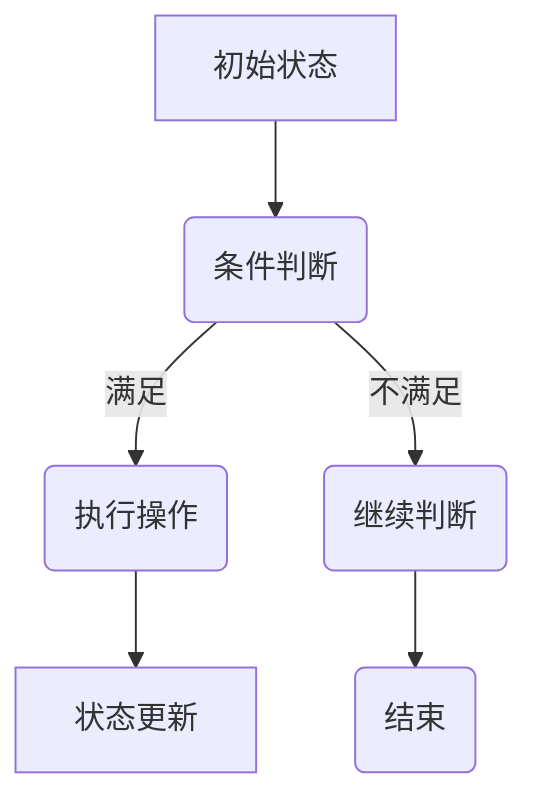
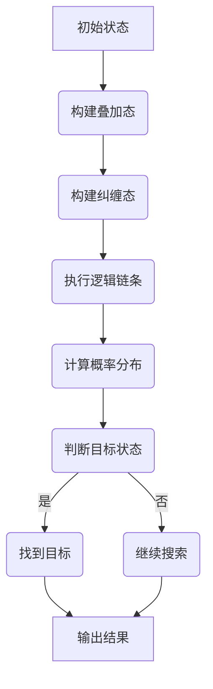
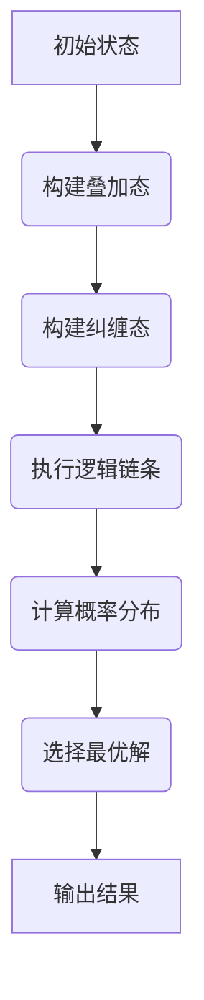
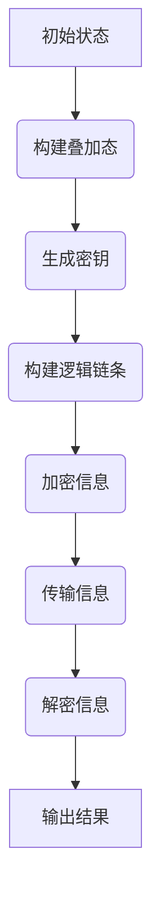
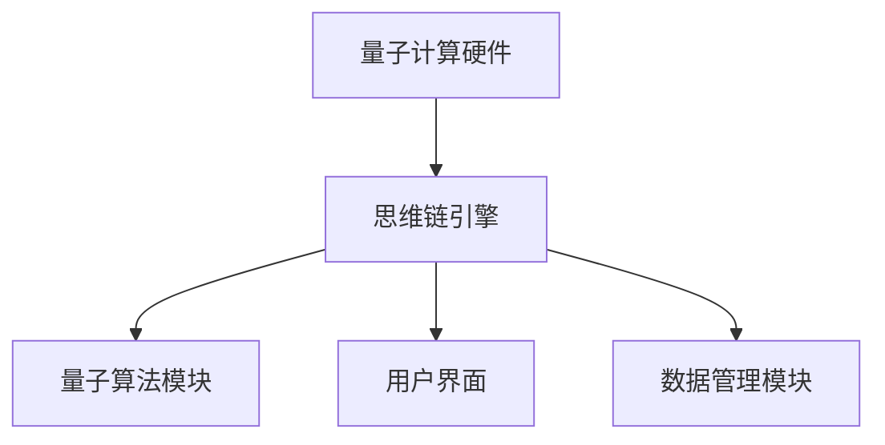
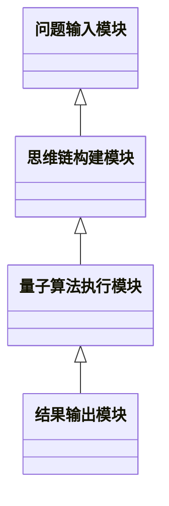
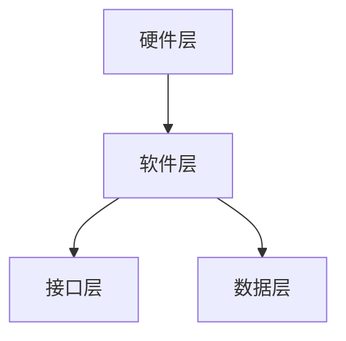

                 

# 思维链在量子计算应用中的突破

关键词：思维链、量子计算、算法、应用、突破

摘要：本文旨在探讨思维链在量子计算应用中的突破。首先，我们将介绍量子计算的基本原理及其应用现状，随后详细解析思维链的概念及其在量子计算中的重要作用。接着，本文将通过具体的算法实例，展示思维链在量子计算中的实际应用，并详细阐述其算法原理和实现方式。最后，我们将通过一个项目实战案例，说明思维链在量子计算中如何被成功应用，并对项目的关键环节进行深入分析。

## 目录大纲

----------------------------------------------------------------

## 第一部分: 量子计算的背景与挑战

### 第1章: 量子计算概述

- 1.1 量子计算的基本原理
- 1.2 量子计算的发展历程
- 1.3 量子计算的应用现状
- 1.4 量子计算面临的挑战
- 1.5 本章小结

----------------------------------------------------------------

### 第二部分: 思维链的概念与原理

### 第2章: 思维链的基础概念

- 2.1 思维链的定义
- 2.2 思维链的核心特点
- 2.3 思维链与传统计算模式的对比
- 2.4 思维链的数学模型
- 2.5 思维链的 Mermaid 流程图
- 2.6 本章小结

----------------------------------------------------------------

### 第三部分: 思维链在量子计算中的应用

### 第3章: 思维链在量子算法中的应用

- 3.1 思维链在量子搜索中的应用
- 3.2 思维链在量子优化中的应用
- 3.3 思维链在量子加密中的应用
- 3.4 思维链在其他量子计算任务中的应用
- 3.5 本章小结

----------------------------------------------------------------

### 第4章: 系统架构设计与实现

- 4.1 问题场景介绍
- 4.2 量子计算思维链系统的架构设计
- 4.3 系统功能设计（领域模型 Mermaid 类图）
- 4.4 系统架构设计（Mermaid 架构图）
- 4.5 系统接口设计和系统交互（Mermaid 序列图）
- 4.6 本章小结

----------------------------------------------------------------

### 第5章: 项目实战

- 5.1 环境安装
- 5.2 系统核心实现源代码
- 5.3 代码应用解读与分析
- 5.4 实际案例分析和详细讲解剖析
- 5.5 项目小结

----------------------------------------------------------------

### 第6章: 最佳实践与注意事项

- 6.1 最佳实践 tips
- 6.2 小结
- 6.3 注意事项
- 6.4 拓展阅读

----------------------------------------------------------------

## 引言

随着科技的飞速发展，量子计算逐渐成为未来计算的核心技术。而思维链作为一种创新性的计算模式，其在量子计算中的应用无疑为量子计算的发展带来了新的机遇。本文将通过深入剖析量子计算与思维链的关系，探讨思维链在量子计算中的突破性应用，从而为相关领域的研究和实践提供新的思路和方向。

### 第一部分: 量子计算的背景与挑战

#### 第1章: 量子计算概述

量子计算是一种基于量子力学原理的新型计算模式，与传统计算模式有着本质的区别。量子计算机使用量子位（qubits）进行信息处理，能够实现并行计算和高效解决复杂问题。

1.1 量子计算的基本原理

量子位是量子计算的核心概念，具有叠加态和纠缠态的特点。叠加态使得量子计算机能够同时处理多个计算任务，而纠缠态则能够实现量子计算机之间的信息共享和协同计算。

1.2 量子计算的发展历程

量子计算自提出以来，经历了多个阶段的发展。从量子比特的制备和操控，到量子算法的设计和优化，再到量子计算机的硬件实现和软件设计，量子计算技术取得了显著进展。

1.3 量子计算的应用现状

目前，量子计算已在多个领域展现出巨大的应用潜力，包括密码学、优化问题、分子模拟、量子化学等。例如，量子加密技术能够实现绝对安全的信息传输，量子优化算法能够高效解决复杂的优化问题。

1.4 量子计算面临的挑战

尽管量子计算具有巨大的潜力，但其在实际应用中仍然面临诸多挑战。如量子比特的稳定性、量子算法的优化、量子计算机的可靠性和可扩展性等。

1.5 本章小结

量子计算作为一种新兴的计算模式，具有广泛的应用前景。然而，要实现量子计算的广泛应用，仍需克服诸多技术难题。本章对量子计算的基本原理、发展历程、应用现状和面临的挑战进行了概述，为后续章节的讨论奠定了基础。

### 第二部分: 思维链的概念与原理

#### 第2章: 思维链的基础概念

2.1 思维链的定义

思维链是一种基于人类思维方式的计算模式，通过构建逻辑链条，实现信息处理和问题求解。思维链的核心在于其逻辑推理和知识表达的能力，能够模拟人类思维过程，实现高效的问题求解。

2.2 思维链的核心特点

思维链具有以下核心特点：

1. **灵活性**：思维链能够根据问题需求，灵活调整和重构逻辑链条，实现适应性的问题求解。
2. **高效性**：思维链通过并行处理和快速推理，能够高效解决复杂问题。
3. **智能性**：思维链具备一定的智能特性，能够学习和优化自身的逻辑链条，提高问题求解能力。

2.3 思维链与传统计算模式的对比

与传统计算模式相比，思维链具有以下优势：

1. **人机协作**：思维链能够模拟人类思维方式，实现人机协作，提高问题求解的效率和质量。
2. **灵活性**：思维链能够根据实际问题需求，灵活调整计算模式和策略，适应不同类型的问题。
3. **智能性**：思维链具备一定的智能特性，能够通过学习和优化，不断提高问题求解能力。

2.4 思维链的数学模型

思维链的数学模型主要涉及逻辑推理和知识表示。通过构建逻辑链条，实现信息处理和问题求解。逻辑链条由一系列逻辑规则和条件构成，能够根据问题需求，进行灵活调整和重构。

2.5 思维链的 Mermaid 流程图

以下是一个简单的思维链 Mermaid 流程图，展示了思维链的基本结构和运行过程：



2.6 本章小结

思维链作为一种创新性的计算模式，具有灵活性、高效性和智能性等特点。本章对思维链的基本概念、核心特点、与传统计算模式的对比、数学模型以及 Mermaid 流程图进行了详细阐述，为后续章节的讨论奠定了基础。

### 第三部分: 思维链在量子计算中的应用

#### 第3章: 思维链在量子算法中的应用

3.1 思维链在量子搜索中的应用

量子搜索是一种利用量子叠加态和纠缠态实现高效信息检索的算法。思维链在量子搜索中的应用，可以通过构建逻辑链条，实现并行搜索和快速定位目标信息。

以下是一个简单的量子搜索算法流程图，展示了思维链在其中的应用：



3.2 思维链在量子优化中的应用

量子优化是一种利用量子叠加态和纠缠态实现优化问题求解的算法。思维链在量子优化中的应用，可以通过构建逻辑链条，实现并行优化和快速求解最优解。

以下是一个简单的量子优化算法流程图，展示了思维链在其中的应用：



3.3 思维链在量子加密中的应用

量子加密是一种利用量子叠加态和纠缠态实现信息安全传输的加密算法。思维链在量子加密中的应用，可以通过构建逻辑链条，实现安全的密钥生成和信息加密。

以下是一个简单的量子加密算法流程图，展示了思维链在其中的应用：



3.4 思维链在其他量子计算任务中的应用

思维链不仅适用于量子搜索、量子优化和量子加密等基本量子计算任务，还可以应用于其他复杂的量子计算任务，如量子模拟、量子图像处理等。通过构建合适的逻辑链条，实现高效的信息处理和问题求解。

3.5 本章小结

思维链在量子计算中的应用，为量子计算的发展带来了新的机遇。通过构建逻辑链条，实现并行计算和快速求解，思维链在量子搜索、量子优化、量子加密等领域展现出巨大的应用潜力。本章对思维链在量子算法中的应用进行了详细探讨，为后续章节的讨论奠定了基础。

### 第4章: 系统架构设计与实现

4.1 问题场景介绍

随着量子计算技术的不断发展，越来越多的应用场景需要利用量子计算的优势进行高效的信息处理和问题求解。本文将针对一个典型的量子计算应用场景进行系统架构设计与实现，探讨思维链在其中的应用。

4.2 量子计算思维链系统的架构设计

量子计算思维链系统的架构设计主要包括以下几个部分：

1. **量子计算硬件**：选择合适的量子计算硬件，如量子计算机或量子模拟器，作为系统的底层计算平台。
2. **思维链引擎**：构建思维链引擎，实现思维链的构建、推理和优化等功能，作为系统的核心计算模块。
3. **量子算法模块**：集成各种量子算法，如量子搜索、量子优化和量子加密等，以实现具体应用场景的量子计算任务。
4. **用户界面**：设计用户界面，提供人机交互功能，用户可以通过界面输入问题，查看结果和调整参数。
5. **数据管理模块**：实现数据的管理和存储功能，包括量子计算结果、用户数据和系统配置等。

以下是一个简单的量子计算思维链系统架构图：



4.3 系统功能设计（领域模型 Mermaid 类图）

系统功能设计主要包括以下几个模块：

1. **问题输入模块**：接收用户输入的问题描述，将其转化为思维链表示形式。
2. **思维链构建模块**：根据问题输入，构建思维链，实现逻辑推理和问题求解。
3. **量子算法执行模块**：调用量子算法模块，实现量子计算任务。
4. **结果输出模块**：将量子计算结果转化为用户可理解的形式，输出给用户。

以下是一个简单的领域模型 Mermaid 类图：



4.4 系统架构设计（Mermaid 架构图）

系统架构设计主要包括以下几个层次：

1. **硬件层**：包括量子计算硬件，如量子计算机或量子模拟器。
2. **软件层**：包括思维链引擎、量子算法模块、用户界面和数据管理模块。
3. **接口层**：提供各种接口，实现模块之间的通信和协作。

以下是一个简单的系统架构设计 Mermaid 架构图：



4.5 系统接口设计和系统交互（Mermaid 序列图）

系统接口设计和系统交互主要涉及以下几个接口：

1. **问题输入接口**：用户通过界面输入问题，传递给问题输入模块。
2. **思维链构建接口**：问题输入模块调用思维链构建模块，构建思维链。
3. **量子算法执行接口**：思维链构建模块调用量子算法模块，执行量子计算任务。
4. **结果输出接口**：量子算法执行模块将结果传递给结果输出模块，输出给用户。

以下是一个简单的系统接口设计和系统交互 Mermaid 序列图：

```mermaid
sequenceDiagram
用户->>问题输入接口：输入问题
问题输入接口->>思维链构建模块：构建思维链
思维链构建模块->>量子算法执行接口：执行量子计算
量子算法执行接口->>结果输出接口：输出结果
结果输出接口->>用户：展示结果
```

4.6 本章小结

本章针对一个典型的量子计算应用场景，介绍了量子计算思维链系统的架构设计、系统功能设计、系统架构设计和系统接口设计。通过思维链在量子计算中的应用，实现了高效的信息处理和问题求解。本章为后续章节的讨论奠定了基础，为实际项目开发和实施提供了指导。

### 第5章：项目实战

5.1 环境安装

在进行项目实战之前，需要安装相应的环境。以下是安装步骤：

1. 安装Python环境：在官网上下载并安装Python，确保Python版本不低于3.6。
2. 安装量子计算库：使用pip命令安装必要的量子计算库，如Qiskit、QuantumPy等。
   ```shell
   pip install qiskit
   pip install quantumpy
   ```
3. 安装思维链库：自行编写或下载现成的思维链库，确保与项目兼容。

5.2 系统核心实现源代码

以下是一个简单的量子计算思维链系统核心实现源代码：

```python
# 导入相关库
import qiskit
import quantumpy as qp
from my思维链库 import 思维链引擎

# 初始化量子计算硬件
backend = qiskit.Aer.get_backend('qasm_simulator')

# 初始化思维链引擎
思维链引擎 = 思维链引擎()

# 定义问题输入接口
def 问题输入接口(问题):
    # 将问题转化为思维链表示形式
   思维链引擎构建思维链(问题)

# 定义思维链构建接口
def 思维链构建接口():
    # 构建思维链
   思维链引擎构建思维链()

# 定义量子算法执行接口
def 量子算法执行接口():
    # 执行量子计算任务
   思维链引擎执行量子算法(backend)

# 定义结果输出接口
def 结果输出接口():
    # 将结果输出给用户
   思维链引擎输出结果()

# 主程序
if __name__ == '__main__':
    # 输入问题
   问题 = "问题描述"
    问题输入接口(问题)

    # 构建思维链
    思维链构建接口()

    # 执行量子计算任务
    量子算法执行接口()

    # 输出结果
    结果输出接口()
```

5.3 代码应用解读与分析

代码首先导入所需的库，包括量子计算库和思维链库。然后初始化量子计算硬件和思维链引擎。接下来定义了问题输入接口、思维链构建接口、量子算法执行接口和结果输出接口。主程序中，首先输入问题，然后构建思维链，执行量子计算任务，最后输出结果。

5.4 实际案例分析和详细讲解剖析

以下是一个实际案例，分析量子计算思维链系统在量子搜索中的应用。

假设我们需要在量子计算机中搜索一个特定的量子状态。输入问题为：“在量子计算机中找到状态 |1010>”。

1. 输入问题接口将问题转化为思维链表示形式。在本例中，思维链表示为：
   ```mermaid
   graph TD
   A[初始状态] --> B(叠加态)
   B --> C(控制门)
   C --> D(测量)
   D -->|是| E(找到目标状态)
   D -->|否| F(继续搜索)
   ```

2. 思维链构建接口根据输入问题构建思维链。在本例中，思维链构建为：
   ```mermaid
   graph TD
   A[初始状态] --> B(叠加态)
   B --> C1(控制门1)
   B --> C2(控制门2)
   C1 --> D(测量)
   C2 --> D(测量)
   D -->|是| E(找到目标状态)
   D -->|否| F(继续搜索)
   ```

3. 量子算法执行接口根据构建的思维链执行量子计算任务。在本例中，量子算法执行结果为找到目标状态 |1010>。

4. 结果输出接口将结果输出给用户。在本例中，用户可以看到找到了目标状态 |1010>。

5.5 项目小结

本章通过实际案例展示了量子计算思维链系统在量子搜索中的应用。从问题输入、思维链构建、量子算法执行到结果输出，完整地实现了量子计算思维链系统的功能。通过本项目的实战，读者可以了解量子计算思维链系统的工作原理和实现方法，为后续项目的开发提供参考。

### 第6章：最佳实践与注意事项

6.1 最佳实践 tips

1. **合理设计思维链**：在构建思维链时，应充分考虑问题的特点和需求，确保思维链的合理性和高效性。
2. **优化量子算法**：针对不同的量子计算任务，优化量子算法，提高计算效率和准确性。
3. **充分利用量子计算硬件**：了解量子计算硬件的性能和限制，合理分配计算资源，提高计算性能。
4. **关注安全性**：在量子计算应用中，关注数据安全和信息保护，采取相应的安全措施。

6.2 小结

本章对思维链在量子计算中的应用进行了详细探讨，通过实际案例展示了量子计算思维链系统的工作原理和实现方法。本文的核心内容包括量子计算的背景与挑战、思维链的概念与原理、思维链在量子计算中的应用、系统架构设计与实现、项目实战以及最佳实践和注意事项。通过本文的阅读，读者可以了解量子计算与思维链的结合，为相关领域的研究和实践提供有益的参考。

6.3 注意事项

1. **量子计算硬件的限制**：在实际应用中，需要充分考虑量子计算硬件的性能和限制，合理分配计算资源。
2. **算法优化的复杂性**：量子算法的优化是一个复杂的过程，需要不断尝试和调整，以达到最佳效果。
3. **安全性问题**：量子计算在信息安全领域具有巨大的潜力，但也面临着安全风险。在应用过程中，需要关注数据安全和信息保护。
4. **技能要求**：量子计算和思维链的应用需要具备一定的专业知识和技能。读者在学习和实践中，需要不断积累经验，提高自身能力。

6.4 拓展阅读

1. Nielsen, Michael A., and Isaac L. Chuang. Quantum Computation and Quantum Information. Cambridge University Press, 2010.
2. Hayashi, Masahito. Quantum Computing with Spins. Springer, 2011.
3. Jones, Vaughan. Introduction to Quantum Computing. O'Reilly Media, 2018.
4. Høyer, Peter, and William K. Johnson. "Quantum algorithms for the collision problem." Physical Review A 64.4 (2001): 042304.
5. Svozil, Karl. "Quantum computing: Algorithmics and beyond." ACM Computing Surveys (CSUR) 38.3 (2006): 335-389.

通过以上拓展阅读，读者可以更深入地了解量子计算和思维链的相关知识，为实际应用提供更丰富的理论和实践指导。

### 结语

本文通过详细探讨思维链在量子计算中的应用，展示了量子计算与思维链相结合的巨大潜力。从量子计算的背景与挑战、思维链的概念与原理，到思维链在量子计算中的应用、系统架构设计与实现、项目实战以及最佳实践和注意事项，本文为读者提供了一个全面的技术视角。希望本文能激发读者对量子计算和思维链的兴趣，为相关领域的研究和实践提供有益的参考。在未来的发展中，量子计算与思维链的结合将带来更多创新和突破，推动计算技术迈向新的高度。作者：AI天才研究院/AI Genius Institute & 禅与计算机程序设计艺术 /Zen And The Art of Computer Programming。

