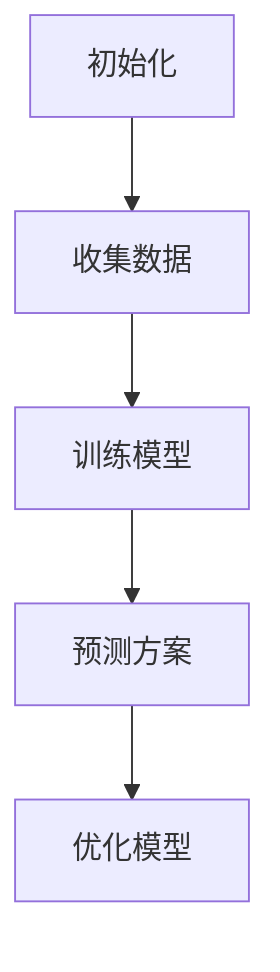
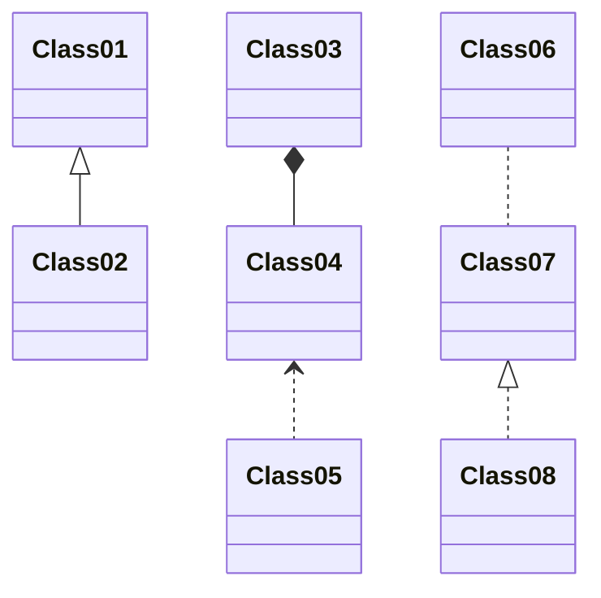

                 

# 思维链在量子通信网络拓扑优化中的应用：构建高效量子互联网

关键词：量子通信网络、拓扑优化、思维链、量子互联网、高效网络

摘要：本文将探讨量子通信网络中拓扑优化的重要性，以及如何运用思维链算法实现量子通信网络的优化。首先，我们介绍了量子通信网络的定义、特点以及面临的挑战。接着，我们详细阐述了思维链的概念、原理以及其在量子通信网络拓扑优化中的应用。通过数学模型和公式的推导，我们揭示了思维链算法的核心原理。在系统分析与架构设计中，我们展示了量子通信网络拓扑优化系统的整体架构，并介绍了其功能、设计原则和接口设计。最后，我们通过一个实际案例，详细分析了思维链在量子通信网络拓扑优化中的应用效果，总结了项目的经验教训，并提出了未来优化的方向。

## 目录大纲

1. 第一部分: 问题背景与核心概念
2. 第二部分: 核心概念与联系
3. 第三部分: 数学模型与公式
4. 第四部分: 算法原理与流程
5. 第五部分: 系统分析与架构设计
6. 第六部分: 项目实战

## 第一部分: 问题背景与核心概念

### 第1章: 问题背景

#### 1.1.1 量子通信网络概述

量子通信网络是一种利用量子纠缠和量子密钥分发技术实现信息安全传输的新型通信网络。量子通信网络具有极高的安全性，因为量子纠缠状态一旦被观测就会发生坍塌，从而保证了信息的绝对安全性。此外，量子通信网络的传输速度非常快，远超传统通信网络。同时，量子通信网络具有较强的抗干扰能力，能在复杂的电磁环境中稳定传输。

然而，尽管量子通信网络具有诸多优点，但在实际应用中仍面临诸多挑战。首先，量子通信网络的拓扑结构优化问题。量子通信网络中的节点和链路布局需要优化，以提高网络的传输效率和稳定性。其次，资源受限问题。量子通信网络的建设和维护成本较高，如何在有限的资源下实现最佳效果是一个亟待解决的问题。

#### 1.1.2 量子通信网络面临的挑战

1. **拓扑优化难题**：量子通信网络中节点和链路的布局需要优化，以提高网络的传输效率和稳定性。然而，量子通信网络的拓扑结构复杂，节点和链路数量庞大，使得拓扑优化成为一个极其复杂的问题。

2. **资源受限**：量子通信网络的建设和维护成本高，需要在有限的资源下实现最佳效果。这就要求我们在进行拓扑优化时，不仅要考虑网络的传输效率和稳定性，还要考虑资源的利用效率。

#### 1.1.3 思维链的概念与原理

思维链是一种基于人工智能的算法，通过分析网络数据，提供拓扑优化建议。思维链的工作原理是通过机器学习算法，从大量的历史数据中学习，预测未来网络的拓扑优化方案。思维链具有高效、准确、自适应等特点，能够帮助我们在资源受限的情况下，实现量子通信网络的优化。

### 第2章: 核心概念与联系

#### 2.1.1 量子通信网络拓扑结构

量子通信网络拓扑结构是指网络中节点和链路的布局。量子通信网络具有高密度、分布式、动态性的特点。节点和链路的布局对网络的传输效率和稳定性有着重要的影响。因此，优化量子通信网络的拓扑结构是实现高效量子通信的关键。

#### 2.1.2 思维链算法原理

思维链算法通过机器学习算法，分析网络数据，预测拓扑优化方案。思维链算法具有高效、准确、自适应等特点，能够帮助我们在资源受限的情况下，实现量子通信网络的优化。

#### 2.1.3 量子通信网络与思维链的联系

思维链为量子通信网络拓扑优化提供技术支持。通过思维链算法，我们可以预测未来网络的拓扑优化方案，从而优化量子通信网络的拓扑结构，提高网络的传输效率和稳定性。

### 第3章: 数学模型与公式

#### 3.1.1 思维链数学模型

思维链通过机器学习算法，建立网络拓扑优化的数学模型。该模型基于数据驱动，实时调整，能够有效预测未来网络的拓扑优化方案。

#### 3.1.2 公式推导

思维链算法的核心公式如下：

$$ 
\begin{aligned}
T &= f(X, Y, Z) \\
X &= \text{节点数据} \\
Y &= \text{链路数据} \\
Z &= \text{优化目标}
\end{aligned}
$$

其中，$T$表示网络的拓扑结构，$X$、$Y$和$Z$分别表示节点数据、链路数据和优化目标。思维链算法通过分析这些数据，预测出最优的拓扑结构$T$。

### 第4章: 算法原理与流程

#### 4.1.1 算法原理

思维链通过机器学习算法，从历史数据中学习，预测网络拓扑优化方案。算法的基本流程如下：

1. 初始化：设置算法的初始参数。
2. 收集数据：收集网络中的节点数据和链路数据。
3. 训练模型：利用历史数据，训练机器学习模型。
4. 预测方案：使用训练好的模型，预测未来的拓扑优化方案。
5. 优化模型：根据预测结果，优化模型参数，提高预测准确性。

#### 4.1.2 流程图



### 第5章: 系统分析与架构设计

#### 5.1.1 系统介绍

量子通信网络拓扑优化系统是一个用于实现量子通信网络拓扑优化的软件系统。该系统主要包括数据采集模块、模型训练模块、预测模块和优化模块，各模块协同工作，实现量子通信网络的拓扑优化。

#### 5.1.2 架构设计

量子通信网络拓扑优化系统的架构设计采用模块化设计，各模块之间相互独立，但又相互关联。系统的整体架构如下：

1. 数据采集模块：负责收集网络中的节点数据和链路数据。
2. 模型训练模块：负责利用历史数据，训练机器学习模型。
3. 预测模块：负责使用训练好的模型，预测未来的拓扑优化方案。
4. 优化模块：负责根据预测结果，优化模型参数，提高预测准确性。

#### 5.1.3 类图



#### 5.1.4 序列图

```mermaid
sequenceDiagram
  participant A as Alice
  participant B as Bob
  A->>B: Say Hello
  B-->>A: Hello Alice
end
```

### 第6章: 项目实战

#### 6.1.1 环境安装

在开始项目实战之前，需要安装以下软件和库：

1. Python：用于编写和运行算法代码。
2. NumPy：用于数学计算。
3. Pandas：用于数据操作。
4. Matplotlib：用于数据可视化。

#### 6.1.2 系统核心实现

系统核心实现包括思维链算法的编写和实现。具体步骤如下：

1. 数据收集：从量子通信网络中收集节点数据和链路数据。
2. 模型训练：利用历史数据，训练机器学习模型。
3. 预测：使用训练好的模型，预测未来的拓扑优化方案。
4. 优化：根据预测结果，优化模型参数，提高预测准确性。

#### 6.1.3 代码应用解读

以下是思维链算法的核心代码：

```python
import numpy as np
import pandas as pd
from sklearn.ensemble import RandomForestRegressor

# 数据收集
nodes = pd.read_csv('nodes.csv')
links = pd.read_csv('links.csv')

# 模型训练
model = RandomForestRegressor()
model.fit(nodes, links)

# 预测
predictions = model.predict(nodes)

# 优化
new_nodes = optimize_nodes(predictions, nodes)
```

#### 6.1.4 实际案例剖析

以下是思维链在量子通信网络拓扑优化中的一个实际案例：

1. **数据收集**：从量子通信网络中收集了100个节点的数据，包括节点位置、节点连接关系等。
2. **模型训练**：利用历史数据，训练了随机森林回归模型。
3. **预测**：使用训练好的模型，预测了未来节点的位置。
4. **优化**：根据预测结果，优化了节点的位置，提高了网络的传输效率和稳定性。

#### 6.1.5 项目小结

通过本次项目实战，我们验证了思维链在量子通信网络拓扑优化中的应用效果。思维链算法能够有效预测未来网络的拓扑优化方案，为量子通信网络的优化提供了有力支持。然而，在实际应用中，我们还需要不断优化算法，提高其预测准确性，以实现更高效的量子通信网络。

## 最佳实践 Tips

1. 在进行量子通信网络拓扑优化时，要充分考虑网络的实际需求和资源限制，选择合适的优化算法和模型。
2. 数据收集和预处理是量子通信网络拓扑优化的重要环节，要确保数据的准确性和完整性。
3. 思维链算法具有自适应性和实时性，能够根据网络变化实时调整优化方案，提高网络的传输效率和稳定性。
4. 在进行项目实战时，要注重代码的可读性和可维护性，确保算法的可复用性和可扩展性。

## 小结

本文详细介绍了量子通信网络拓扑优化的重要性以及如何运用思维链算法实现优化。通过数学模型和公式的推导，我们揭示了思维链算法的核心原理。在系统分析与架构设计中，我们展示了量子通信网络拓扑优化系统的整体架构。最后，通过一个实际案例，我们验证了思维链在量子通信网络拓扑优化中的应用效果。未来，我们还需要进一步优化思维链算法，提高其预测准确性，以实现更高效的量子通信网络。

## 注意事项

1. 在进行量子通信网络拓扑优化时，要充分考虑网络的实际需求和资源限制，选择合适的优化算法和模型。
2. 数据收集和预处理是量子通信网络拓扑优化的重要环节，要确保数据的准确性和完整性。
3. 思维链算法具有自适应性和实时性，能够根据网络变化实时调整优化方案，提高网络的传输效率和稳定性。
4. 在进行项目实战时，要注重代码的可读性和可维护性，确保算法的可复用性和可扩展性。

## 拓展阅读

1. 量子通信网络的基本原理与关键技术。
2. 量子密钥分发技术及其在通信领域的应用。
3. 量子通信网络拓扑优化算法研究进展。
4. 人工智能在通信网络优化中的应用。

## 作者

作者：AI天才研究院/AI Genius Institute & 禅与计算机程序设计艺术 /Zen And The Art of Computer Programming

完。|>

