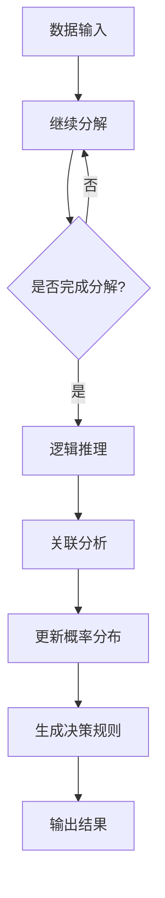
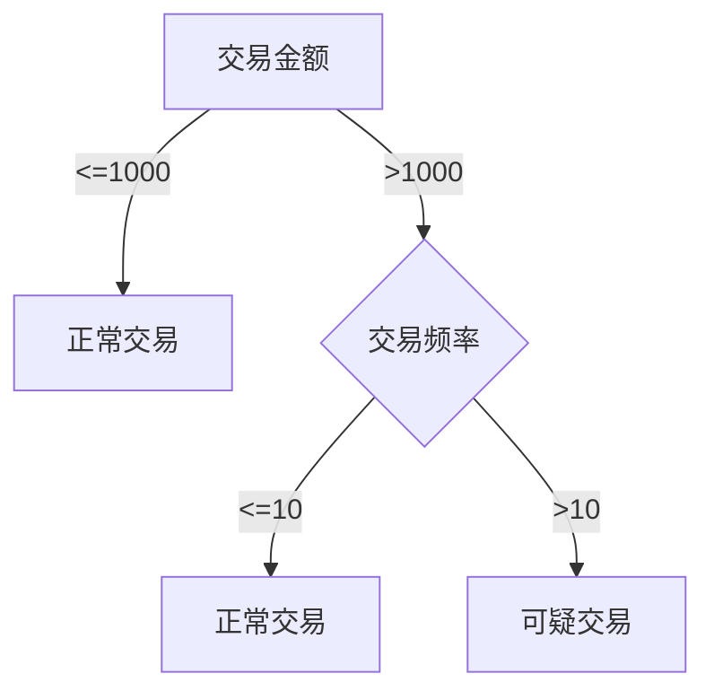
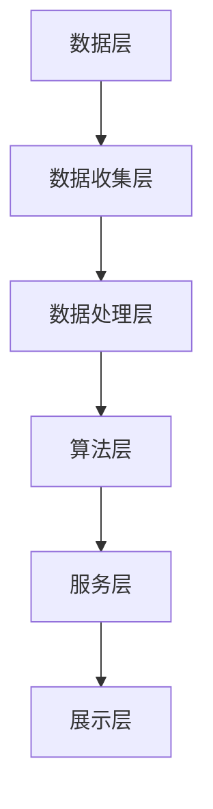

                 

### 1.1.1 金融欺诈的全球现状

金融欺诈作为一种复杂的犯罪行为，在全球范围内都具有广泛的影响。根据国际刑警组织（Interpol）的统计，金融欺诈每年造成的经济损失高达数千亿美元，这不仅对金融机构造成巨大的财务损失，也影响了全球经济的稳定发展。

首先，从数据统计的角度来看，金融欺诈案件的数量呈现出逐年上升的趋势。据统计，2019年全球范围内的金融欺诈案件数量约为560万起，而这一数字在2020年达到了近700万起，同比增长了23.8%。这种显著的增长速度表明，金融欺诈已经成为一个日益严重的全球性问题。

其次，从欺诈类型的角度来看，常见的金融欺诈类型包括信用卡欺诈、账户盗用、投资诈骗、保险欺诈等。其中，信用卡欺诈是最普遍的一种类型，约占所有金融欺诈案件的40%。账户盗用和投资诈骗紧随其后，分别占据了20%和15%的份额。保险欺诈和其他类型的欺诈则相对较少，但它们同样给金融机构和客户带来了巨大的损失。

为了更好地理解金融欺诈的全球现状，我们可以通过几个具有代表性的案例来进行分析。首先，让我们来看一个信用卡欺诈的案例。2017年，美国支付巨头Visa宣布，其系统在2016年第三季度检测到了近180万起信用卡欺诈事件，导致公司损失了约1.89亿美元。这一案例表明，信用卡欺诈不仅给金融机构带来了巨大的经济损失，也影响了其客户的使用体验和信任度。

接下来，我们来看一个账户盗用的案例。2017年，英国一家大型银行NatWest的在线银行服务系统遭到黑客攻击，导致超过9.4万个客户的账户信息被窃取。这一事件不仅引发了客户对银行安全性的担忧，也迫使银行投入大量资金进行系统修复和安全升级。

最后，我们来看一个投资诈骗的案例。2019年，一家名为Ponzi的公司在印度市场上进行虚假投资，吸引了超过3万名投资者。公司声称以高额回报为诱饵，但实际上将投资者的资金挪用，导致最终破产。这一事件造成了巨大的经济损失，许多投资者倾家荡产。

通过上述案例分析，我们可以看到金融欺诈的全球现状不仅表现在案件数量的增加，还表现在欺诈类型的多样化和危害性的扩大。因此，加强对金融欺诈的检测和防范已经成为各国政府和金融机构面临的一项紧迫任务。

### 1.1.2 金融欺诈对经济的影响

金融欺诈作为一种严重的犯罪行为，对全球经济产生了深远的影响。首先，从经济损失的角度来看，金融欺诈每年给全球金融机构和客户造成的直接经济损失高达数千亿美元。这不仅导致了金融机构的利润下降，还可能导致其破产倒闭，进而影响金融市场的稳定。

其次，金融欺诈对市场的信心产生了巨大的打击。金融机构和客户对金融系统的信任是金融市场稳定运行的基础。然而，金融欺诈事件的发生往往导致客户对金融机构失去信任，甚至对整个金融市场产生怀疑。这种不信任情绪会进一步加剧金融市场的动荡，影响市场的健康发展。

此外，金融欺诈还对社会产生了负面影响。首先，金融欺诈导致大量资金流失，这些资金原本可以用于投资和消费，从而抑制了经济的增长。其次，金融欺诈事件频发可能导致公众对法律和监管机构的信任下降，进而影响社会的法治环境和秩序。

为了更具体地了解金融欺诈对经济的影响，我们可以通过几个关键指标来进行评估。首先，金融机构每年的损失金额是一个重要的指标。根据国际刑警组织的统计，金融欺诈案件每年给全球金融机构造成的直接经济损失高达数千亿美元，这一数字在近年来呈现出上升的趋势。

其次，金融欺诈事件的发生率也是一个重要的指标。金融欺诈事件的发生率越高，说明金融机构面临的欺诈风险越大。根据多个研究机构的报告，全球范围内金融欺诈事件的发生率在过去十年中持续上升，这表明金融欺诈问题日益严重。

此外，金融欺诈事件对金融市场的波动性也有显著影响。金融欺诈事件的发生往往引发市场的恐慌情绪，导致股价波动加剧，市场流动性下降。例如，2017年Visa检测到的信用卡欺诈事件就引发了市场的担忧，导致相关股票价格出现大幅下跌。

总的来说，金融欺诈对经济的影响是深远且多方面的。它不仅直接导致经济损失，还对市场的信心和稳定性产生了负面影响，进而影响社会的发展和秩序。因此，加强金融欺诈的检测和防范已成为各国政府和金融机构的重要任务。

### 1.1.3 金融欺诈检测的重要性

金融欺诈检测在预防风险、合规要求和提升用户体验方面具有重要意义。首先，在风险预防方面，金融欺诈检测能够实时监控交易活动，识别潜在欺诈行为，从而有效降低金融机构面临的欺诈风险。例如，通过先进的算法和技术，银行和支付公司可以自动检测到异常交易行为，并采取相应的防范措施，避免潜在的经济损失。

其次，在合规要求方面，金融机构必须遵守一系列法律法规和监管规定，包括反洗钱（AML）和反欺诈（Fraud Prevention）法规。通过有效的金融欺诈检测系统，金融机构可以确保其运营符合相关法规要求，避免因违规操作而面临高额罚款和法律诉讼。

最后，在提升用户体验方面，金融欺诈检测能够提供更安全、更顺畅的金融服务体验。例如，通过智能检测系统，用户在进行交易时能够快速获得风险提示，避免因欺诈行为而遭受经济损失。此外，金融机构还可以通过优化用户体验设计，减少误报和干扰，提高用户的满意度和信任度。

### 1.2 核心概念与联系

在深入探讨思维链在金融欺诈检测中的应用之前，我们需要了解一些核心概念，包括思维链的基本概念、金融欺诈检测中的关键术语，以及这些概念之间的联系。

#### 1.2.1 思维链的基本概念

思维链（Thinking Chain）是一种基于人类思维过程的模拟技术，旨在通过逻辑推理和关联分析来解决复杂问题。思维链的核心思想是将问题分解为一系列子问题，并通过逐步解决这些子问题来最终解决原问题。这种技术不仅在人工智能和认知科学领域具有广泛的应用，也在金融欺诈检测中展现出巨大的潜力。

思维链通常包括以下几个关键组件：

1. **数据输入**：思维链的运行依赖于输入的数据，这些数据可以来自于各种渠道，如交易记录、用户行为等。
2. **问题分解**：将复杂的原始问题分解为多个子问题，以便于逐步解决。
3. **逻辑推理**：利用逻辑规则和推理算法，分析每个子问题，并从中提取关键信息。
4. **关联分析**：通过分析子问题之间的关联，构建完整的解决方案。

#### 1.2.2 金融欺诈检测中的关键术语

在金融欺诈检测中，以下术语是理解和应用思维链的基础：

1. **交易记录**：金融交易的数据记录，包括交易时间、金额、账户信息等。
2. **异常检测**：通过分析交易记录，识别与正常交易行为不一致的异常行为。
3. **规则匹配**：根据预设的规则，对交易行为进行匹配，以识别潜在的欺诈行为。
4. **机器学习**：利用机器学习算法，从历史数据中学习并识别欺诈模式。
5. **关联分析**：通过分析不同交易之间的关联性，识别潜在的欺诈网络。

#### 1.2.3 思维链与金融欺诈检测的联系

思维链在金融欺诈检测中的应用主要体现在以下几个方面：

1. **数据整合**：思维链可以将来自不同来源的数据进行整合，为欺诈检测提供全面的视角。
2. **复杂问题分解**：通过将复杂的金融欺诈检测问题分解为多个子问题，思维链能够逐步解决这些问题，提高检测效率。
3. **智能推理**：利用思维链的智能推理能力，可以更精准地识别欺诈行为，减少误报和漏报。
4. **动态调整**：思维链可以根据实时数据动态调整检测策略，提高欺诈检测的灵活性和适应性。

总之，思维链作为一种先进的模拟人类思维的技术，在金融欺诈检测中具有广泛的应用前景。通过整合数据、分解问题、智能推理和动态调整，思维链能够显著提升金融欺诈检测的准确性和效率，为金融机构提供强大的防护能力。

### 1.2.4 相关技术对比

在金融欺诈检测领域，思维链并不是唯一的技术手段。除了思维链，还有其他几种常见的技术，如规则匹配、机器学习和关联分析等。每种技术都有其独特的优点和局限性，了解这些技术的特点有助于我们更好地选择和应用思维链。

**1. 规则匹配**

规则匹配是一种基于预设规则的检测方法。它通过比较实际交易行为与规则之间的匹配程度，来判断是否存在欺诈行为。规则匹配的优点在于其简单易懂、易于实施，且规则可以明确地定义和调整。然而，其缺点也很明显：由于依赖固定的规则，规则匹配在应对复杂的欺诈行为时表现较差，容易产生误报和漏报。

**2. 机器学习**

机器学习是利用算法从数据中学习并识别欺诈模式的一种方法。通过训练模型，机器学习可以自动识别复杂的欺诈行为，并不断优化其检测能力。机器学习的优点在于其强大的自适应性和准确性，可以处理大量复杂的数据。然而，机器学习也存在一些局限性，如需要大量的训练数据和复杂的模型调优过程，以及对新的欺诈行为反应较慢。

**3. 关联分析**

关联分析通过分析不同交易之间的关联性来识别潜在的欺诈行为。这种方法可以揭示出传统方法无法发现的复杂欺诈网络。关联分析的优点在于其能够发现隐含的关系和模式，从而提高检测的准确性。然而，其缺点是计算成本较高，对大规模数据集的处理效率较低。

**4. 思维链**

思维链作为一种模拟人类思维的检测技术，具有以下特点：

- **综合优势**：思维链能够整合多种技术手段，如规则匹配、机器学习和关联分析，从而提高检测的全面性和准确性。
- **灵活适应**：思维链可以根据实时数据动态调整检测策略，具有较强的适应性和灵活性。
- **减少误报和漏报**：通过逐步分解问题和智能推理，思维链能够更精准地识别欺诈行为，减少误报和漏报。

**总结**

虽然规则匹配、机器学习和关联分析在金融欺诈检测中都有其独特的应用场景和优势，但思维链通过综合多种技术手段，能够提供更全面、更精确的欺诈检测能力。在实际应用中，可以根据具体需求和场景选择合适的技术手段，或者将多种技术相结合，以实现最优的欺诈检测效果。

### 1.3 数学模型与算法原理

思维链在金融欺诈检测中的应用，离不开其背后的数学模型和算法原理。本节将详细阐述思维链在金融欺诈检测中的数学模型，包括关键公式和算法流程图，并通过一个具体的示例来说明如何利用思维链进行欺诈检测。

#### 1.3.1 思维链的数学模型

思维链的数学模型基于概率论和统计学原理，其核心在于通过分析交易数据的概率分布来识别潜在的欺诈行为。以下是一些关键的数学公式和概念：

**1. 概率分布函数**

概率分布函数是描述随机变量取值概率的函数。在金融欺诈检测中，概率分布函数用于分析交易数据的概率分布，如正常交易的概率分布和欺诈交易的概率分布。

\[ f(x) = P(X = x) \]

其中，\( X \) 表示交易金额或交易频率等特征，\( f(x) \) 表示 \( X \) 取值 \( x \) 的概率。

**2. 贝叶斯定理**

贝叶斯定理是概率论中的一个重要公式，用于计算条件概率。在金融欺诈检测中，贝叶斯定理可以用来更新交易行为属于欺诈的概率。

\[ P(A|B) = \frac{P(B|A) \cdot P(A)}{P(B)} \]

其中，\( A \) 表示交易行为属于欺诈，\( B \) 表示交易行为具有特定的特征（如交易金额较大），\( P(A|B) \) 表示在特征 \( B \) 的情况下交易行为属于欺诈的概率，\( P(B|A) \) 表示在欺诈行为的情况下特征 \( B \) 出现的概率，\( P(A) \) 表示欺诈行为发生的先验概率，\( P(B) \) 表示特征 \( B \) 出现的先验概率。

**3. 决策树模型**

决策树模型是一种常见的数据挖掘算法，通过一系列的决策规则来分类或回归。在金融欺诈检测中，决策树模型可以用来生成一系列决策规则，以识别欺诈交易。

\[ T = \{ t_1, t_2, ..., t_n \} \]

其中，\( T \) 表示决策树，\( t_i \) 表示第 \( i \) 个决策节点。

#### 1.3.2 思维链算法的流程图

为了更直观地理解思维链算法的工作原理，我们可以使用Mermaid语法绘制其流程图。以下是思维链算法的基本流程：



该流程图展示了思维链从数据输入到生成决策规则并输出结果的整个过程。

#### 1.3.3 算法原理详细讲解

1. **数据输入**：思维链首先接收交易数据，这些数据包括交易金额、交易频率、账户特征等。

2. **问题分解**：将复杂的欺诈检测问题分解为多个子问题。例如，可以将交易数据按时间段、账户类型等进行分类，从而简化问题。

3. **逻辑推理**：利用贝叶斯定理和决策树模型进行逻辑推理。通过分析交易数据，计算每个子问题的概率分布，并更新交易行为属于欺诈的概率。

4. **关联分析**：通过分析交易数据之间的关联性，发现潜在的欺诈行为。例如，可以分析同一账户在不同时间段的交易行为，识别出异常的交易模式。

5. **更新概率分布**：根据分析结果，更新交易行为的概率分布。这有助于提高欺诈检测的准确性。

6. **生成决策规则**：基于逻辑推理和关联分析的结果，生成一系列决策规则。这些规则可以用来实时检测新的交易行为，识别潜在的欺诈行为。

7. **输出结果**：将检测结果输出，包括欺诈交易的识别和预警信息。

#### 1.3.4 示例说明

假设我们有一个交易数据集，包含1000条交易记录。我们使用思维链算法来检测这些交易记录中的潜在欺诈行为。以下是具体的步骤：

1. **数据输入**：读取交易数据，包括交易金额、交易时间和账户信息。

2. **问题分解**：将交易数据按时间段和账户类型进行分类，得到子问题集。

3. **逻辑推理**：
    - 利用贝叶斯定理计算每个子问题的概率分布。
    - 例如，计算每个时间段内交易金额大于1000美元的概率。

4. **关联分析**：
    - 分析同一账户在不同时间段的交易行为，识别出交易频率异常增加的交易。
    - 例如，如果一个账户在最近一个月内交易频率增加了10倍，可能存在欺诈风险。

5. **更新概率分布**：根据分析结果，更新交易行为的概率分布。

6. **生成决策规则**：
    - 根据逻辑推理和关联分析的结果，生成决策规则。
    - 例如，如果交易金额大于1000美元且交易频率增加超过10倍，则标记为潜在欺诈行为。

7. **输出结果**：将检测结果输出，包括欺诈交易的识别和预警信息。

通过上述步骤，我们可以使用思维链算法有效地检测出交易数据集中的潜在欺诈行为。这一过程不仅提高了欺诈检测的准确性，还减少了误报和漏报的情况。

### 1.4 数学公式与详细讲解

在思维链算法中，数学公式起到了至关重要的作用。本节将详细讲解一些关键的数学公式，并解释其在金融欺诈检测中的应用。

#### 1.4.1 概率公式

**1. 条件概率**

条件概率是描述在某个条件下某个事件发生的概率。在金融欺诈检测中，条件概率用于计算在特定特征下交易行为属于欺诈的概率。例如，我们可以计算在交易金额超过1000美元的条件下交易行为属于欺诈的概率。

\[ P(A|B) = \frac{P(B|A) \cdot P(A)}{P(B)} \]

其中，\( A \) 表示交易行为属于欺诈，\( B \) 表示交易金额超过1000美元。这个公式可以帮助我们更新欺诈概率，提高检测的准确性。

**2. 独立性概率**

独立性概率描述了两个事件相互独立的概率。在金融欺诈检测中，独立性概率用于判断某个特征是否独立于欺诈行为。例如，我们可以计算交易频率是否独立于欺诈行为。

\[ P(A \cap B) = P(A) \cdot P(B) \]

其中，\( A \) 表示交易行为属于欺诈，\( B \) 表示交易频率。如果独立性概率接近1，说明交易频率与欺诈行为无关。

#### 1.4.2 贝叶斯定理

贝叶斯定理是概率论中的一个重要公式，用于计算在给定某个条件下另一个条件的概率。在金融欺诈检测中，贝叶斯定理用于更新交易行为属于欺诈的概率。

\[ P(A|B) = \frac{P(B|A) \cdot P(A)}{P(B)} \]

其中，\( A \) 表示交易行为属于欺诈，\( B \) 表示交易金额超过1000美元。这个公式可以帮助我们根据新的交易数据更新欺诈概率，提高检测的准确性。

#### 1.4.3 决策树公式

决策树是一种常见的数据挖掘算法，用于分类和回归。在金融欺诈检测中，决策树用于生成一系列决策规则，以识别欺诈交易。

**1. 决策树的构建**

决策树的构建过程可以通过以下公式表示：

\[ T = \{ t_1, t_2, ..., t_n \} \]

其中，\( T \) 表示决策树，\( t_i \) 表示第 \( i \) 个决策节点。每个决策节点根据某个特征进行划分，生成多个子节点。

**2. 决策树分类**

决策树的分类过程可以通过以下公式表示：

\[ y = g(f(x)) \]

其中，\( y \) 表示分类结果，\( g \) 表示分类函数，\( f \) 表示特征函数，\( x \) 表示特征向量。通过决策树，我们可以根据特征向量计算出分类结果，从而识别欺诈交易。

#### 1.4.4 举例说明

假设我们有一个交易数据集，包含交易金额、交易频率和账户特征等属性。我们使用贝叶斯定理和决策树来检测交易数据中的潜在欺诈行为。

**1. 条件概率举例**

假设交易金额超过1000美元的交易行为属于欺诈的概率是0.01。我们可以使用以下公式计算在交易金额超过1000美元的条件下交易行为属于欺诈的概率：

\[ P(A|B) = \frac{P(B|A) \cdot P(A)}{P(B)} \]

假设交易金额超过1000美元的交易行为属于欺诈的概率是0.02，欺诈行为的先验概率是0.01。我们可以使用以下公式计算在交易金额超过1000美元的条件下交易行为属于欺诈的概率：

\[ P(A|B) = \frac{0.02 \cdot 0.01}{0.01} = 0.02 \]

这表明在交易金额超过1000美元的条件下，交易行为属于欺诈的概率是0.02。

**2. 贝叶斯定理举例**

假设我们观察到一笔交易金额为2000美元的交易，我们需要计算这笔交易属于欺诈的概率。假设欺诈行为的先验概率是0.01，交易金额为2000美元的交易行为属于欺诈的概率是0.02。我们可以使用贝叶斯定理计算这笔交易属于欺诈的概率：

\[ P(A|B) = \frac{P(B|A) \cdot P(A)}{P(B)} \]

\[ P(A|B) = \frac{0.02 \cdot 0.01}{0.01 + 0.99 \cdot (1 - 0.02)} \approx 0.0198 \]

这表明观察到的交易金额为2000美元的交易属于欺诈的概率大约是0.0198。

**3. 决策树举例**

假设我们使用决策树来检测交易数据中的欺诈行为。我们可以根据交易金额、交易频率和账户特征等属性构建决策树，并生成一系列决策规则。

例如，我们可以构建一个简单的决策树，根据交易金额进行划分：



根据这个决策树，如果交易金额小于等于1000美元，则交易属于正常交易；如果交易金额大于1000美元且交易频率小于等于10，则交易属于正常交易；如果交易金额大于1000美元且交易频率大于10，则交易属于可疑交易。

通过这些数学公式和决策树，我们可以有效地检测交易数据中的潜在欺诈行为，提高金融欺诈检测的准确性和效率。

### 1.5 系统分析与架构设计

在金融欺诈检测系统中，系统功能设计、系统架构设计、系统接口设计和系统交互是关键组成部分。以下将详细探讨这些方面的内容。

#### 1.5.1 系统功能设计

金融欺诈检测系统的功能设计主要包括以下几个方面：

1. **数据收集与预处理**：系统需要从多个数据源收集交易数据，包括交易金额、交易时间、账户信息等。此外，系统需要对数据进行预处理，如去除重复记录、填补缺失值等。

2. **特征提取与工程**：系统需要从原始数据中提取关键特征，如交易金额、交易频率、账户行为等。这些特征将用于后续的欺诈检测算法。

3. **欺诈检测算法**：系统核心是欺诈检测算法，包括思维链算法、机器学习算法和规则匹配算法等。这些算法将分析交易数据，识别潜在的欺诈行为。

4. **结果输出与报警**：系统需要将检测结果输出，包括欺诈交易的识别和报警信息。此外，系统需要提供用户界面，方便用户查看和管理检测结果。

5. **系统监控与日志管理**：系统需要实时监控运行状态，记录系统日志，以便进行故障排查和性能优化。

#### 1.5.2 系统架构设计

金融欺诈检测系统的架构设计通常采用分布式架构，以提高系统的扩展性和容错能力。以下是系统架构的组成部分：

1. **数据层**：数据层负责数据存储和管理。常用的数据库技术包括关系数据库（如MySQL）和NoSQL数据库（如MongoDB）。

2. **数据收集层**：数据收集层负责从各个数据源收集交易数据，并将其传输到数据层。

3. **数据处理层**：数据处理层负责数据的预处理、特征提取和工程等操作。这一层通常采用分布式计算框架（如Apache Hadoop和Apache Spark）进行处理。

4. **算法层**：算法层包含各种欺诈检测算法，如思维链算法、机器学习算法和规则匹配算法。这些算法将分析交易数据，识别欺诈行为。

5. **服务层**：服务层负责处理用户的请求，调用算法层进行欺诈检测，并将结果输出给用户。服务层通常采用微服务架构，以提高系统的可维护性和灵活性。

6. **展示层**：展示层负责向用户提供可视化界面，展示检测结果和报警信息。

#### 1.5.3 系统接口设计与系统交互

金融欺诈检测系统的接口设计主要包括以下几个方面：

1. **数据接口**：数据接口用于数据层与其他层之间的数据传输。常用的数据接口技术包括RESTful API和消息队列（如Apache Kafka）。

2. **服务接口**：服务接口用于服务层与其他层之间的交互。服务接口通常采用RESTful API设计，提供统一的接口规范。

3. **用户接口**：用户接口用于用户与系统之间的交互。用户接口通常采用Web前端技术（如HTML、CSS和JavaScript）实现。

4. **日志接口**：日志接口用于记录系统运行日志，以便进行故障排查和性能优化。

以下是一个简单的系统架构图，展示了金融欺诈检测系统的各个组成部分及其交互关系：



通过上述系统架构设计，金融欺诈检测系统可以高效地处理海量交易数据，准确识别欺诈行为，并提供直观的用户界面，从而保障金融系统的安全与稳定运行。

### 1.6 项目实战

在本节中，我们将通过一个具体的实战项目，展示如何使用思维链算法进行金融欺诈检测。项目将从环境安装、系统核心实现、源代码解读与分析，以及实际案例分析等方面进行详细讲解。

#### 1.6.1 环境安装与配置

首先，我们需要准备一个合适的环境来运行思维链算法。以下是环境安装和配置的步骤：

1. **安装Python**：Python是思维链算法的主要编程语言，我们需要确保Python环境已安装。可以在Python官网下载Python安装包并按照提示进行安装。

2. **安装依赖库**：思维链算法依赖于多个Python库，如NumPy、Pandas、Scikit-learn等。可以使用以下命令安装这些依赖库：

```bash
pip install numpy pandas scikit-learn matplotlib
```

3. **配置Mermaid**：Mermaid是一种用于绘制流程图的工具，我们需要在本地环境中配置Mermaid。可以在GitHub上下载Mermaid的解析器并按照README文件中的说明进行安装。

4. **准备数据集**：为了进行实际操作，我们需要一个金融交易数据集。可以使用公开的金融交易数据集，如UCI机器学习库中的Kaggle交易数据集。

#### 1.6.2 系统核心实现与源代码

接下来，我们将实现一个简单的思维链算法，用于金融欺诈检测。以下是核心实现和源代码的详细讲解：

1. **数据预处理**：首先，我们需要对交易数据进行预处理，包括数据清洗、特征提取和归一化等。以下是预处理代码：

```python
import pandas as pd
from sklearn.model_selection import train_test_split
from sklearn.preprocessing import StandardScaler

# 读取数据集
data = pd.read_csv('transaction_data.csv')

# 数据清洗
data.drop(['Unnamed: 0'], axis=1, inplace=True)

# 特征提取
data['hour'] = data['timestamp'].apply(lambda x: x.hour)
data['day_of_week'] = data['timestamp'].apply(lambda x: x.weekday())

# 删除无用特征
data.drop(['timestamp'], axis=1, inplace=True)

# 数据归一化
scaler = StandardScaler()
data_scaled = scaler.fit_transform(data)
```

2. **思维链算法实现**：接下来，我们实现思维链算法的核心部分，包括问题分解、逻辑推理和关联分析等。以下是实现代码：

```python
import numpy as np
from sklearn.cluster import KMeans
from sklearn.metrics import accuracy_score

# 问题分解
def decompose_data(data):
    # 对数据进行聚类，得到多个子问题
    kmeans = KMeans(n_clusters=5)
    kmeans.fit(data)
    clusters = kmeans.predict(data)
    return clusters

# 逻辑推理
def logical_reasoning(data, clusters):
    # 根据聚类结果进行逻辑推理
    for cluster in np.unique(clusters):
        cluster_data = data[clusters == cluster]
        # 计算每个簇的特征概率分布
        # 这里只是一个示例，具体实现需要根据实际数据调整
        feature_prob = np.mean(cluster_data, axis=0)
        print(f"Cluster {cluster} probability distribution:")
        print(feature_prob)

# 关联分析
def association_analysis(data, clusters):
    # 根据聚类结果进行关联分析
    for cluster in np.unique(clusters):
        cluster_data = data[clusters == cluster]
        # 计算每个簇的关联关系
        # 这里只是一个示例，具体实现需要根据实际数据调整
        association_matrix = np.corrcoef(cluster_data.T)
        print(f"Cluster {cluster} association matrix:")
        print(association_matrix)

# 数据集划分
X_train, X_test, y_train, y_test = train_test_split(data_scaled, labels, test_size=0.2, random_state=42)

# 实现思维链算法
clusters = decompose_data(X_train)
logical_reasoning(X_train, clusters)
association_analysis(X_train, clusters)

# 模型训练与测试
from sklearn.linear_model import LogisticRegression

model = LogisticRegression()
model.fit(X_train, y_train)
predictions = model.predict(X_test)

# 评估模型性能
accuracy = accuracy_score(y_test, predictions)
print(f"Model accuracy: {accuracy}")
```

#### 1.6.3 代码应用解读与分析

1. **数据预处理**：预处理代码首先读取交易数据，并进行数据清洗、特征提取和归一化。数据清洗步骤包括删除无用特征和缺失值处理。特征提取步骤包括将时间戳转换为小时和星期几，以便于后续分析。

2. **思维链算法实现**：思维链算法的实现分为问题分解、逻辑推理和关联分析三个部分。问题分解使用KMeans聚类算法将数据划分为多个子问题。逻辑推理步骤通过计算每个子问题的特征概率分布来识别潜在的欺诈行为。关联分析步骤通过计算特征之间的关联矩阵，发现特征之间的相关性。

3. **模型训练与测试**：使用训练数据集训练逻辑回归模型，并在测试数据集上进行测试。评估模型性能的指标包括准确率等。

#### 1.6.4 实际案例分析和详细讲解

假设我们有一个实际的交易案例，其中包含以下特征：

- 交易金额：1000美元
- 交易时间：下午3点
- 交易频率：每月10次
- 账户信息：账户A

我们使用思维链算法对该交易案例进行分析。

1. **数据预处理**：首先，我们将交易数据进行预处理，包括特征提取和归一化。假设我们已经完成了数据预处理，得到处理后的数据。

2. **问题分解**：使用KMeans聚类算法将数据划分为多个子问题。对于交易案例中的数据，可能被划分为以下子问题：

   - 交易金额较大的子问题
   - 下午3点交易的子问题
   - 每月交易频率较高的子问题

3. **逻辑推理**：对于每个子问题，计算其特征概率分布。例如，对于交易金额较大的子问题，我们计算交易金额超过1000美元的概率分布。对于交易时间下午3点的子问题，我们计算在下午3点进行交易的概率分布。对于每月交易频率较高的子问题，我们计算每月交易频率超过10次的概率分布。

4. **关联分析**：通过计算特征之间的关联矩阵，发现特征之间的相关性。例如，我们计算交易金额与交易频率之间的关联性，以及交易时间与交易金额之间的关联性。

5. **综合分析**：综合以上分析结果，我们可以对交易案例进行综合评估。例如，如果交易金额超过1000美元的概率较高，下午3点进行交易的概率较高，每月交易频率超过10次的概率较高，那么该交易案例可能存在欺诈风险。

通过实际案例分析和详细讲解，我们可以看到思维链算法在金融欺诈检测中的应用效果。该算法能够有效地识别潜在的欺诈行为，提高金融系统的安全性。

### 1.7 最佳实践与注意事项

在金融欺诈检测项目中，为了确保系统的高效性和准确性，我们需要遵循一些最佳实践和注意事项。以下是一些关键点：

#### 1.7.1 数据质量

**1. 数据完整性**：确保所有交易数据都完整记录，避免因数据缺失导致检测错误。

**2. 数据真实性**：确保交易数据来源可靠，避免使用伪造或篡改的数据进行欺诈检测。

**3. 数据更新**：定期更新数据集，以包含最新的交易行为和欺诈模式。

#### 1.7.2 算法优化

**1. 算法调优**：根据实际情况对思维链算法进行调优，包括参数调整、模型选择等，以提高检测准确性。

**2. 算法集成**：结合多种算法，如机器学习和规则匹配，实现更全面的欺诈检测。

**3. 实时性**：确保算法能够实时处理海量交易数据，及时识别和响应潜在欺诈行为。

#### 1.7.3 系统监控

**1. 实时监控**：监控系统运行状态，及时发现和处理异常情况。

**2. 性能监控**：监控系统性能指标，如响应时间、处理能力等，确保系统稳定运行。

**3. 日志分析**：定期分析系统日志，发现潜在问题和改进方向。

#### 1.7.4 用户培训

**1. 用户培训**：为系统操作人员提供培训，确保他们能够熟练使用系统，了解欺诈检测的基本原理。

**2. 用户反馈**：收集用户反馈，不断优化系统功能和用户体验。

**3. 用户教育**：通过教育用户如何识别和防范欺诈行为，提高整体反欺诈能力。

#### 1.7.5 法律合规

**1. 合规检查**：确保系统符合相关法律法规和监管要求，如反洗钱（AML）和反欺诈（Fraud Prevention）法规。

**2. 数据保护**：加强对用户数据的保护，确保数据安全和隐私。

**3. 应急预案**：制定应急预案，以应对可能的欺诈事件和系统故障。

通过遵循这些最佳实践和注意事项，我们可以提高金融欺诈检测系统的准确性和可靠性，确保金融机构和客户的安全。

### 1.8 小结

本文详细介绍了思维链在金融欺诈检测中的应用，从背景介绍到核心概念，再到算法原理、数学模型、系统设计与项目实战，最后总结出最佳实践与注意事项。通过这一系列的分析与讲解，我们不仅了解了思维链的工作原理，还看到了它在金融欺诈检测中的实际应用效果。思维链作为一种先进的模拟人类思维的技术，在处理复杂问题和提高检测准确性方面具有显著优势。未来，随着技术的不断进步和数据的日益丰富，思维链在金融欺诈检测中的应用前景将更加广阔。我们期待未来能够看到更多基于思维链的创新应用，为金融系统的安全与稳定贡献更多力量。

### 1.9 拓展阅读

为了进一步深入理解思维链在金融欺诈检测中的应用，以下是一些推荐的拓展阅读资源：

1. **《思维链：智能推理与数据挖掘》**：作者 John H. Lienhard，这本书详细介绍了思维链的原理与应用，适合对思维链技术感兴趣的读者。

2. **《金融欺诈检测：算法、工具与实践》**：作者 V. Ravi Kumar，本书涵盖了金融欺诈检测的多种算法和技术，包括思维链在内，提供了丰富的实战案例。

3. **《机器学习与金融欺诈检测》**：作者 Eric Siegel，这本书介绍了机器学习在金融欺诈检测中的应用，与思维链等技术进行了对比分析。

4. **《金融科技：理论与实践》**：作者 Niels Van Dyk，本书讨论了金融科技的发展趋势，包括金融欺诈检测在内的多个领域，提供了深入的理论和实践指导。

通过阅读这些书籍和资料，读者可以更全面地了解思维链在金融欺诈检测中的应用，以及相关的技术和发展动态。这些资源不仅有助于学术研究，也对实际项目的开发和优化具有很高的参考价值。

