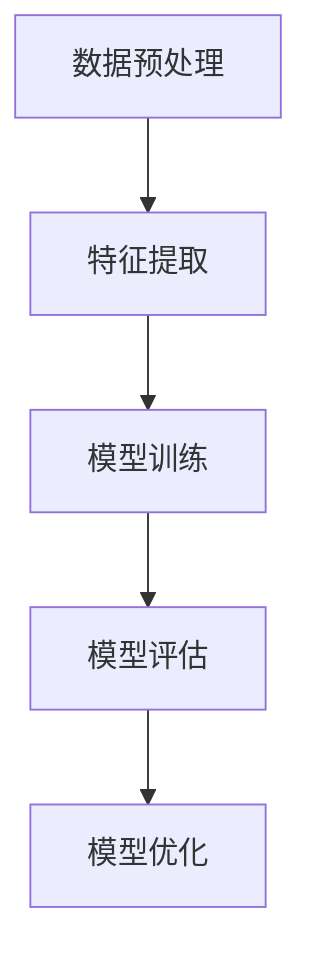
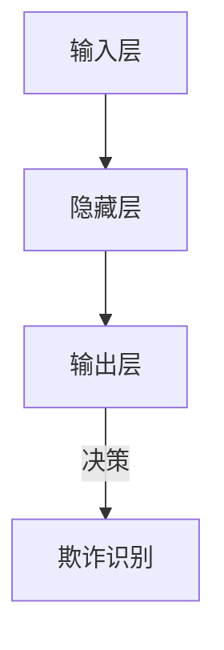

                 

### 文章标题：思维链在金融欺诈模式识别中的新方法

### 关键词：思维链、金融欺诈、模式识别、人工智能、机器学习

### 摘要：
本文旨在探讨思维链在金融欺诈模式识别中的应用，通过逻辑清晰的分析和推理，逐步揭示思维链技术的基本原理及其在金融领域中的独特优势。文章首先概述了金融欺诈的现状与挑战，随后引入思维链的概念，详细介绍其在金融欺诈识别中的理论基础与应用实践。通过实际案例研究，本文展示了思维链在信用卡欺诈识别、股票市场异常交易检测和保险欺诈识别等领域的应用效果。此外，本文还探讨了思维链与深度学习融合的可能性，并提出未来研究方向与挑战。通过本文的探讨，旨在为金融领域提供一种新的欺诈检测方法，以提升欺诈识别的准确性和效率。

---

### 第一部分：背景与核心概念

#### 第1章：金融欺诈问题背景与思维链概述

##### 1.1 金融欺诈的现状与挑战

**1.1.1 金融欺诈的定义与历史演变**

金融欺诈是一种利用金融系统漏洞进行非法获利的行为，其形式多样，包括但不限于信用卡欺诈、贷款欺诈、证券欺诈、洗钱等。随着金融市场的不断发展，金融欺诈也呈现出多样化的趋势。历史演变来看，金融欺诈最早可以追溯到古代，但随着信息技术和金融工具的进步，欺诈手段也日益复杂。

**1.1.2 金融欺诈的类型与危害**

金融欺诈主要包括以下几类：
- **信用卡欺诈**：通过非法获取信用卡信息，未经持卡人同意进行消费或提取现金。
- **贷款欺诈**：虚构贷款条件，骗取贷款资金。
- **证券欺诈**：通过虚假陈述、误导投资者进行投资。
- **洗钱**：将非法所得通过多次转账、交易等方式转化为合法资金。

金融欺诈的危害主要体现在以下几个方面：
- **经济损失**：直接导致金融机构和消费者的经济损失。
- **信用风险**：影响金融机构的信用评级和金融市场的稳定性。
- **声誉损害**：损害金融机构和金融市场的声誉。

**1.1.3 金融欺诈防范的挑战**

金融欺诈的防范面临以下几方面的挑战：
- **欺诈手段的多样性**：新的欺诈手段不断出现，使得传统防范手段难以应对。
- **数据隐私**：在防范欺诈的过程中，需要处理大量的敏感数据，如何保护用户隐私成为一大难题。
- **资源限制**：金融机构在防范欺诈方面需要投入大量的人力、物力和财力。
- **技术门槛**：对金融欺诈的防范需要高水平的技术支持，中小企业可能难以承担。

##### 1.2 思维链的概念

**1.2.1 思维链的定义**

思维链（Mind-Chain）是一种基于人工智能和机器学习的新型技术，它通过模拟人类的思维方式，实现对大规模数据的自动分析和决策。思维链的核心在于其多层次的抽象能力和强大的自学习能力，使得它能够灵活应对复杂的问题。

**1.2.2 思维链的特性**

思维链具备以下特性：
- **自适应性**：能够根据数据和环境的变化，自动调整模型结构和参数。
- **层次化**：能够对不同层次的信息进行抽象和整合，提高决策的准确性。
- **可解释性**：能够提供决策过程中的详细解释，增强模型的可信度。
- **高效性**：通过并行计算和分布式架构，能够快速处理大规模数据。

**1.2.3 思维链与传统机器学习方法的区别**

与传统机器学习方法相比，思维链具有以下优势：
- **更强的自学习能力**：能够通过自我学习和调整，不断提高模型的准确性。
- **更灵活的抽象能力**：能够处理复杂和非结构化的数据。
- **更好的可解释性**：能够提供详细的决策解释，增强模型的可信度。
- **更高的并行计算能力**：能够利用分布式计算资源，提高处理速度。

##### 1.3 思维链在金融欺诈识别中的应用前景

**1.3.1 思维链的优势**

思维链在金融欺诈识别中的优势主要体现在以下几个方面：
- **高准确性**：通过自学习和层次化处理，能够提高欺诈识别的准确性。
- **实时性**：能够实时处理和分析大量金融数据，提高欺诈识别的响应速度。
- **可解释性**：提供详细的决策解释，有助于金融机构理解和优化防范策略。
- **适应性**：能够适应不同的金融环境和数据特点，提高模型的泛化能力。

**1.3.2 应用案例介绍**

思维链已经在多个金融场景中得到了应用，例如：
- **信用卡欺诈识别**：通过对信用卡交易数据的分析，实时识别潜在的欺诈行为。
- **股票市场异常交易检测**：通过对股票交易数据的挖掘，发现异常交易行为，避免市场操纵。
- **保险欺诈识别**：通过对保险理赔数据的分析，识别潜在的欺诈案件，降低保险公司的风险。

**1.3.3 未来发展趋势**

随着人工智能技术的不断进步，思维链在金融欺诈识别中的应用前景将更加广阔。未来可能的发展趋势包括：
- **更高效的算法和架构**：通过优化算法和架构，提高思维链的处理速度和准确性。
- **多模态数据处理**：结合多种数据类型，提高欺诈识别的全面性和准确性。
- **可解释性和透明性**：通过增强模型的可解释性，提高金融机构和用户的信任度。
- **跨领域应用**：将思维链技术应用于更多的金融场景，提高整个金融行业的欺诈防范能力。

##### 1.4 本章小结

本章首先介绍了金融欺诈的现状与挑战，随后引入了思维链的概念，并详细阐述了其在金融欺诈识别中的优势和应用前景。通过本章的讨论，我们可以看到思维链技术为金融欺诈防范提供了一种新的思路和方法，具有很高的应用价值和潜力。

---

### 第二部分：思维链理论基础

#### 第2章：思维链的基本原理

##### 2.1 思维链的核心概念

**2.1.1 概念1：感知器**

感知器是思维链中最基本的单元，类似于人类大脑中的神经元。它通过接收外部输入信息，产生相应的输出响应。感知器的工作机制可以概括为以下几个步骤：
1. 接收输入信号。
2. 对输入信号进行加权求和处理。
3. 通过激活函数产生输出信号。

**2.1.2 概念2：神经元网络**

神经元网络是由多个感知器组成的复杂结构，用于模拟人类大脑的信息处理过程。神经元网络通过层次化的结构，实现对信息的抽象和整合。一个典型的神经元网络包括输入层、隐藏层和输出层。每层中的感知器（神经元）都与其他层中的感知器通过权重相连接。

**2.1.3 概念3：思维链模型**

思维链模型是一种基于神经元网络的深度学习模型，它通过层次化的结构和强大的自学习能力，实现对大规模数据的自动分析和决策。思维链模型的工作机制包括以下几个步骤：
1. 数据预处理：对原始数据进行清洗、归一化和特征提取等处理。
2. 模型训练：通过反向传播算法，对模型参数进行优化，使其能够准确预测数据。
3. 模型评估：使用验证集或测试集对模型性能进行评估。
4. 模型部署：将训练好的模型部署到实际应用场景中，进行实时数据分析和决策。

##### 2.2 思维链的工作机制

**2.2.1 数据预处理**

数据预处理是思维链模型训练的重要环节。通过对数据进行清洗、归一化和特征提取等处理，可以去除噪声，提高数据的质量和一致性。具体步骤如下：
1. 数据清洗：去除重复数据、缺失数据和异常值。
2. 数据归一化：将不同特征的数据范围统一，提高模型的收敛速度。
3. 特征提取：从原始数据中提取有用的特征，提高模型的识别能力。

**2.2.2 模型训练**

模型训练是思维链模型构建的核心步骤。通过大量的训练数据和反向传播算法，模型能够不断优化自身的参数，提高预测的准确性。具体过程如下：
1. 初始化模型参数：随机初始化模型的权重和偏置。
2. 前向传播：将输入数据通过模型进行处理，得到输出结果。
3. 计算损失函数：比较模型输出结果与实际标签之间的差异，计算损失函数。
4. 反向传播：根据损失函数的梯度信息，对模型参数进行更新。
5. 重复上述步骤，直到模型收敛。

**2.2.3 模型评估**

模型评估是验证模型性能的重要环节。通过使用验证集或测试集，可以评估模型的准确性、召回率、F1值等指标，判断模型的泛化能力和可靠性。具体方法如下：
1. 分离数据集：将原始数据集分为训练集、验证集和测试集。
2. 训练模型：在训练集上训练模型，得到模型参数。
3. 评估模型：在验证集和测试集上评估模型性能，计算相关指标。
4. 调整模型：根据评估结果，调整模型参数，提高模型性能。

**2.2.4 模型评估**

模型评估是验证模型性能的重要环节。通过使用验证集或测试集，可以评估模型的准确性、召回率、F1值等指标，判断模型的泛化能力和可靠性。具体方法如下：
1. 分离数据集：将原始数据集分为训练集、验证集和测试集。
2. 训练模型：在训练集上训练模型，得到模型参数。
3. 评估模型：在验证集和测试集上评估模型性能，计算相关指标。
4. 调整模型：根据评估结果，调整模型参数，提高模型性能。

**2.2.5 模型评估**

模型评估是验证模型性能的重要环节。通过使用验证集或测试集，可以评估模型的准确性、召回率、F1值等指标，判断模型的泛化能力和可靠性。具体方法如下：
1. 分离数据集：将原始数据集分为训练集、验证集和测试集。
2. 训练模型：在训练集上训练模型，得到模型参数。
3. 评估模型：在验证集和测试集上评估模型性能，计算相关指标。
4. 调整模型：根据评估结果，调整模型参数，提高模型性能。

**2.3 思维链的关键技术**

**2.3.1 神经网络架构**

神经网络架构是思维链模型的核心组成部分，它决定了模型的结构和性能。常见的神经网络架构包括卷积神经网络（CNN）、循环神经网络（RNN）和Transformer等。每种架构都有其独特的优势和适用场景。

**2.3.2 损失函数与优化算法**

损失函数用于衡量模型预测结果与实际标签之间的差距，优化算法用于调整模型参数，使其最小化损失函数。常见的损失函数包括均方误差（MSE）、交叉熵损失（Cross Entropy Loss）等。优化算法包括梯度下降（Gradient Descent）、Adam优化器等。

**2.3.3 正则化方法**

正则化方法用于防止模型过拟合，提高模型的泛化能力。常见的正则化方法包括权重正则化（L1、L2正则化）、Dropout等。

**2.4 思维链的优化策略**

**2.4.1 网络结构优化**

网络结构优化是提高思维链模型性能的重要手段。通过调整网络层数、神经元数量、激活函数等参数，可以优化模型的结构，提高其准确性和效率。

**2.4.2 数据增强**

数据增强是通过增加数据多样性，提高模型泛化能力的方法。常见的数据增强方法包括数据扩充（Data Augmentation）、数据合成（Data Synthesis）等。

**2.4.3 模型压缩与加速**

模型压缩与加速是通过减小模型参数量和计算量，提高模型运行速度的方法。常见的方法包括模型剪枝（Model Pruning）、量化（Quantization）等。

##### 2.5 本章小结

本章详细介绍了思维链的基本原理，包括核心概念、工作机制、关键技术以及优化策略。通过本章的讨论，我们可以了解到思维链作为一种基于人工智能和机器学习的新型技术，在金融欺诈识别等领域具有广泛的应用前景。

---

### 第三部分：思维链在金融欺诈识别中的实际应用

#### 第3章：思维链在金融交易数据分析中的应用

##### 3.1 金融交易数据的特点与挑战

**3.1.1 金融交易数据的组成**

金融交易数据主要包括以下几类信息：
- **交易信息**：包括交易金额、交易时间、交易方式等。
- **账户信息**：包括账户ID、账户余额、账户历史交易记录等。
- **用户信息**：包括用户ID、用户年龄、用户职业、用户信用评级等。
- **市场信息**：包括股票价格、市场波动、宏观经济指标等。

**3.1.2 金融交易数据的挑战**

金融交易数据具有以下特点，给数据分析和欺诈识别带来了挑战：
- **高维度**：金融交易数据包含大量维度，使得数据处理和分析变得复杂。
- **高噪声**：交易数据中存在大量噪声和异常值，需要有效的噪声去除和异常检测方法。
- **动态变化**：金融市场的动态变化使得交易数据的特征变化迅速，需要模型具备良好的自适应能力。
- **隐私保护**：金融交易数据涉及用户的敏感信息，如何保护用户隐私是数据分析和欺诈识别中的一大难题。

**3.1.3 数据处理策略**

针对金融交易数据的特点，我们可以采用以下数据处理策略：
- **数据预处理**：对交易数据进行清洗、归一化和特征提取，提高数据的质量和一致性。
- **特征选择**：通过相关性分析和降维技术，选择对欺诈识别有显著贡献的特征，减少计算复杂度。
- **异常检测**：采用聚类、分类和关联规则等方法，识别交易数据中的异常行为。
- **隐私保护**：采用加密、匿名化和数据脱敏等技术，保护用户的隐私信息。

##### 3.2 思维链模型在金融交易数据中的应用

**3.2.1 数据预处理流程**

思维链模型在金融交易数据中的应用首先需要完成数据预处理。具体步骤如下：
1. **数据清洗**：去除重复数据、缺失数据和异常值，保证数据的完整性。
2. **数据归一化**：将不同特征的数据范围统一，便于模型训练和计算。
3. **特征提取**：从原始交易数据中提取有用的特征，如交易金额、交易时间、交易频率等。
4. **特征选择**：通过相关性分析和降维技术，选择对欺诈识别有显著贡献的特征。

**3.2.2 模型构建与训练**

构建思维链模型需要完成以下步骤：
1. **模型设计**：根据金融交易数据的特点，设计合适的神经网络架构和激活函数。
2. **模型训练**：使用训练数据集，通过反向传播算法对模型参数进行优化，使其能够准确预测交易数据。
3. **模型评估**：使用验证集或测试集，评估模型性能，包括准确性、召回率和F1值等指标。

**3.2.3 模型评估与优化**

模型评估与优化是确保模型性能的关键步骤。具体方法如下：
1. **交叉验证**：使用交叉验证方法，评估模型在不同数据集上的性能，提高模型的泛化能力。
2. **参数调整**：通过调整网络结构、学习率和正则化参数，优化模型性能。
3. **集成学习**：采用集成学习方法，结合多个模型的预测结果，提高模型的准确性。

**3.3 应用案例研究**

**3.3.1 案例一：信用卡欺诈识别**

信用卡欺诈识别是金融交易数据中一个典型的应用场景。思维链模型在信用卡欺诈识别中的应用步骤如下：
1. **数据预处理**：清洗和归一化信用卡交易数据，提取有用的特征。
2. **模型训练**：构建思维链模型，使用信用卡交易数据进行模型训练。
3. **模型评估**：使用验证集和测试集评估模型性能，包括准确性和召回率等指标。
4. **模型优化**：根据评估结果，调整模型参数，提高模型性能。

**3.3.2 案例二：股票市场异常交易检测**

股票市场异常交易检测是另一个重要的应用场景。思维链模型在股票市场异常交易检测中的应用步骤如下：
1. **数据预处理**：清洗和归一化股票交易数据，提取有用的特征。
2. **模型训练**：构建思维链模型，使用股票交易数据进行模型训练。
3. **模型评估**：使用验证集和测试集评估模型性能，包括准确性和召回率等指标。
4. **模型优化**：根据评估结果，调整模型参数，提高模型性能。

**3.3.3 案例三：保险欺诈识别**

保险欺诈识别是金融交易数据中的另一个重要应用场景。思维链模型在保险欺诈识别中的应用步骤如下：
1. **数据预处理**：清洗和归一化保险理赔数据，提取有用的特征。
2. **模型训练**：构建思维链模型，使用保险理赔数据进行模型训练。
3. **模型评估**：使用验证集和测试集评估模型性能，包括准确性和召回率等指标。
4. **模型优化**：根据评估结果，调整模型参数，提高模型性能。

##### 3.4 本章小结

本章详细介绍了思维链在金融交易数据分析中的应用，包括数据预处理、模型构建与训练、模型评估与优化等步骤。通过实际案例研究，展示了思维链模型在信用卡欺诈识别、股票市场异常交易检测和保险欺诈识别等领域的应用效果。思维链模型通过其强大的自学习和层次化处理能力，能够有效地识别金融交易数据中的欺诈行为，为金融欺诈防范提供了一种新的技术手段。

---

### 第四部分：技术深度探讨

#### 第4章：思维链与深度学习结合的探索

##### 4.1 深度学习概述

**4.1.1 深度学习的定义与发展历程**

深度学习是一种基于多层的神经网络进行数据建模和分析的方法，它通过模拟人类大脑的神经元结构，实现对复杂模式的自动学习和识别。深度学习的概念最早由Geoffrey Hinton等人在20世纪80年代提出，但受到计算能力和数据资源限制，未能得到广泛应用。随着计算机硬件性能的提升和大数据技术的发展，深度学习在21世纪初迎来了快速发展。

**4.1.2 深度学习的核心模型**

深度学习的核心模型包括：
- **卷积神经网络（CNN）**：通过卷积操作和池化操作，对图像等二维数据进行特征提取。
- **循环神经网络（RNN）**：通过循环结构，对序列数据进行建模和分析。
- **变换器网络（Transformer）**：通过自注意力机制，对序列数据进行建模，广泛应用于自然语言处理和图像识别等领域。

**4.1.3 深度学习的关键技术**

深度学习的关键技术包括：
- **反向传播算法**：用于计算模型参数的梯度，实现模型参数的优化。
- **激活函数**：用于引入非线性特性，提高模型的识别能力。
- **优化算法**：如随机梯度下降（SGD）、Adam优化器等，用于调整模型参数。
- **正则化方法**：如L1、L2正则化、Dropout等，用于防止模型过拟合。

##### 4.2 思维链与深度学习的融合方法

**4.2.1 思维链模型的改进**

为了更好地结合思维链与深度学习，可以对思维链模型进行以下改进：
- **引入深度学习模型**：将卷积神经网络（CNN）、循环神经网络（RNN）和变换器网络（Transformer）等深度学习模型引入思维链模型中，提高模型的识别能力。
- **多模态数据处理**：结合多种数据类型，如文本、图像和语音等，实现更全面的数据分析。
- **自注意力机制**：引入自注意力机制，对序列数据进行建模，提高模型对时间序列数据的处理能力。

**4.2.2 深度学习在思维链中的应用**

深度学习在思维链中的应用主要体现在以下几个方面：
- **特征提取**：使用深度学习模型对原始数据进行特征提取，提高特征的质量和一致性。
- **模型优化**：通过深度学习模型，优化思维链模型的参数和结构，提高模型的性能和准确性。
- **解释性增强**：利用深度学习模型的可解释性方法，增强思维链模型的解释性，提高模型的可信度。

**4.2.3 融合模型的性能评估**

融合模型的性能评估主要包括以下几个方面：
- **准确性**：评估模型在分类任务中的准确率，包括整体准确率、精确率、召回率和F1值等指标。
- **实时性**：评估模型在处理实时数据时的响应速度和处理能力。
- **可解释性**：评估模型提供决策解释的能力，包括决策路径、关键特征等。
- **鲁棒性**：评估模型对异常数据和噪声的鲁棒性，包括对抗攻击、数据污染等。

##### 4.3 思维链在金融欺诈识别中的潜力

**4.3.1 思维链的动态适应能力**

思维链模型具有动态适应能力，能够根据数据和环境的变化，自动调整模型结构和参数。在金融欺诈识别中，这一特性尤为重要，因为金融市场的动态变化非常迅速，欺诈手段也在不断更新。思维链模型能够实时适应这些变化，提高欺诈识别的准确性。

**4.3.2 思维链的多模态数据处理能力**

金融欺诈识别往往涉及多种数据类型，如交易数据、用户信息和市场数据等。思维链模型能够结合多种数据类型，通过多模态数据处理，提高欺诈识别的全面性和准确性。例如，通过结合交易数据和用户信息，可以更准确地识别信用卡欺诈行为。

**4.3.3 思维链的安全性与隐私保护**

在金融欺诈识别中，数据安全和隐私保护至关重要。思维链模型通过采用加密、匿名化和数据脱敏等技术，能够有效保护用户的隐私信息。同时，思维链模型的解释性也使其更易于接受监管和审计。

##### 4.4 本章小结

本章探讨了思维链与深度学习的融合方法及其在金融欺诈识别中的应用潜力。通过引入深度学习模型，思维链模型在特征提取、模型优化和解释性增强等方面得到了显著提升。思维链模型具有动态适应能力、多模态数据处理能力和安全性与隐私保护等优点，为金融欺诈识别提供了一种新的技术手段。未来，随着深度学习和思维链技术的不断发展，它们在金融欺诈识别中的应用前景将更加广阔。

---

### 第五部分：实战与应用

#### 第5章：思维链模型应用实战

##### 5.1 实战一：构建信用卡欺诈识别系统

**5.1.1 系统需求分析**

信用卡欺诈识别系统的需求主要包括：
- **实时性**：系统能够快速处理和分析大量的信用卡交易数据，实现实时欺诈检测。
- **准确性**：系统能够准确识别信用卡欺诈行为，降低误报率和漏报率。
- **可解释性**：系统能够提供详细的欺诈识别决策解释，帮助金融机构理解模型的决策过程。
- **安全性与隐私保护**：系统在处理信用卡交易数据时，能够保护用户的隐私信息，确保数据安全。

**5.1.2 系统架构设计**

信用卡欺诈识别系统的架构设计如下：
- **数据层**：包括信用卡交易数据、用户信息和市场数据等。
- **数据处理层**：对原始交易数据进行清洗、归一化和特征提取，为模型提供高质量的数据输入。
- **模型层**：包括思维链模型、深度学习模型等，用于信用卡欺诈行为识别。
- **服务层**：提供API接口，供外部系统调用。
- **监控层**：实时监控系统性能和欺诈识别效果，进行性能优化和调整。

**5.1.3 数据集准备与预处理**

信用卡欺诈识别系统需要大量的交易数据进行训练和测试。数据集的来源可以是金融机构的内部数据，也可以是公开的数据集。具体步骤如下：
1. **数据收集**：从金融机构收集信用卡交易数据，包括交易金额、交易时间、交易方式等。
2. **数据清洗**：去除重复数据、缺失数据和异常值，保证数据的完整性。
3. **数据归一化**：将不同特征的数据范围统一，提高模型训练的稳定性和效率。
4. **特征提取**：从原始交易数据中提取有用的特征，如交易金额、交易频率、交易时间间隔等。

**5.1.4 模型训练与评估**

构建信用卡欺诈识别系统需要完成以下步骤：
1. **模型设计**：设计思维链模型和深度学习模型，包括网络结构、激活函数和优化算法等。
2. **模型训练**：使用训练数据集，通过反向传播算法对模型参数进行优化，使其能够准确预测信用卡欺诈行为。
3. **模型评估**：使用验证集和测试集评估模型性能，包括准确率、召回率、F1值等指标。
4. **模型优化**：根据评估结果，调整模型参数和结构，提高模型性能。

**5.1.5 系统部署与维护**

信用卡欺诈识别系统部署需要考虑以下方面：
1. **硬件环境**：选择高性能的服务器和计算资源，确保系统处理能力和响应速度。
2. **软件环境**：安装和配置必要的软件环境，包括操作系统、编程语言和深度学习框架等。
3. **接口设计**：设计API接口，供外部系统调用，实现数据输入和结果输出。
4. **监控系统**：实时监控系统性能和欺诈识别效果，进行性能优化和故障排查。

##### 5.2 实战二：股票市场异常交易检测系统

**5.2.1 系统设计与实现**

股票市场异常交易检测系统的设计与实现步骤如下：
1. **需求分析**：分析股票市场异常交易检测的需求，包括实时性、准确性和可解释性等。
2. **数据收集**：从金融交易所、财经网站等渠道收集股票交易数据，包括交易时间、交易价格、交易量等。
3. **数据预处理**：对原始交易数据进行清洗、归一化和特征提取，为模型提供高质量的数据输入。
4. **模型设计**：设计思维链模型和深度学习模型，包括网络结构、激活函数和优化算法等。
5. **模型训练**：使用训练数据集，通过反向传播算法对模型参数进行优化，使其能够准确预测股票市场异常交易行为。
6. **模型评估**：使用验证集和测试集评估模型性能，包括准确率、召回率、F1值等指标。
7. **系统集成**：将模型集成到股票市场异常交易检测系统中，实现实时数据分析和决策。

**5.2.2 数据收集与处理**

股票市场异常交易检测系统的数据收集与处理步骤如下：
1. **数据收集**：从金融交易所、财经网站等渠道收集股票交易数据，包括交易时间、交易价格、交易量等。
2. **数据清洗**：去除重复数据、缺失数据和异常值，保证数据的完整性。
3. **数据归一化**：将不同特征的数据范围统一，提高模型训练的稳定性和效率。
4. **特征提取**：从原始交易数据中提取有用的特征，如交易价格、交易量、交易时间间隔等。

**5.2.3 模型训练与优化**

股票市场异常交易检测系统的模型训练与优化步骤如下：
1. **模型设计**：设计思维链模型和深度学习模型，包括网络结构、激活函数和优化算法等。
2. **模型训练**：使用训练数据集，通过反向传播算法对模型参数进行优化，使其能够准确预测股票市场异常交易行为。
3. **模型评估**：使用验证集和测试集评估模型性能，包括准确率、召回率、F1值等指标。
4. **模型优化**：根据评估结果，调整模型参数和结构，提高模型性能。

**5.2.4 系统部署与性能测试**

股票市场异常交易检测系统的部署与性能测试步骤如下：
1. **硬件环境**：选择高性能的服务器和计算资源，确保系统处理能力和响应速度。
2. **软件环境**：安装和配置必要的软件环境，包括操作系统、编程语言和深度学习框架等。
3. **接口设计**：设计API接口，供外部系统调用，实现数据输入和结果输出。
4. **性能测试**：对系统进行性能测试，包括响应时间、处理能力、准确率等指标，确保系统稳定可靠。

##### 5.3 实战三：保险欺诈识别系统开发

**5.3.1 需求分析与系统规划**

保险欺诈识别系统的需求分析与系统规划步骤如下：
1. **需求分析**：分析保险欺诈识别的需求，包括实时性、准确性和可解释性等。
2. **系统规划**：设计系统的架构和功能模块，包括数据层、数据处理层、模型层、服务层和监控层等。
3. **数据收集**：从保险公司收集保险理赔数据，包括理赔金额、理赔时间、理赔原因等。
4. **数据预处理**：对原始理赔数据进行清洗、归一化和特征提取，为模型提供高质量的数据输入。
5. **模型设计**：设计思维链模型和深度学习模型，包括网络结构、激活函数和优化算法等。
6. **模型训练**：使用训练数据集，通过反向传播算法对模型参数进行优化，使其能够准确预测保险欺诈行为。
7. **模型评估**：使用验证集和测试集评估模型性能，包括准确率、召回率、F1值等指标。
8. **系统集成**：将模型集成到保险欺诈识别系统中，实现实时数据分析和决策。

**5.3.2 数据分析与预处理**

保险欺诈识别系统的数据分析与预处理步骤如下：
1. **数据收集**：从保险公司收集保险理赔数据，包括理赔金额、理赔时间、理赔原因等。
2. **数据清洗**：去除重复数据、缺失数据和异常值，保证数据的完整性。
3. **数据归一化**：将不同特征的数据范围统一，提高模型训练的稳定性和效率。
4. **特征提取**：从原始理赔数据中提取有用的特征，如理赔金额、理赔频率、理赔原因等。

**5.3.3 模型构建与训练**

保险欺诈识别系统的模型构建与训练步骤如下：
1. **模型设计**：设计思维链模型和深度学习模型，包括网络结构、激活函数和优化算法等。
2. **模型训练**：使用训练数据集，通过反向传播算法对模型参数进行优化，使其能够准确预测保险欺诈行为。
3. **模型评估**：使用验证集和测试集评估模型性能，包括准确率、召回率、F1值等指标。
4. **模型优化**：根据评估结果，调整模型参数和结构，提高模型性能。

**5.3.4 系统部署与效果评估**

保险欺诈识别系统的部署与效果评估步骤如下：
1. **硬件环境**：选择高性能的服务器和计算资源，确保系统处理能力和响应速度。
2. **软件环境**：安装和配置必要的软件环境，包括操作系统、编程语言和深度学习框架等。
3. **接口设计**：设计API接口，供外部系统调用，实现数据输入和结果输出。
4. **效果评估**：对系统进行效果评估，包括准确率、召回率、F1值等指标，确保系统稳定可靠。

##### 5.4 本章小结

本章通过三个实际案例，展示了思维链模型在金融欺诈识别中的实战应用。从系统需求分析、架构设计到数据预处理、模型构建与训练，再到系统部署与效果评估，每个环节都进行了详细阐述。通过这些实际案例，我们可以看到思维链模型在信用卡欺诈识别、股票市场异常交易检测和保险欺诈识别等领域的应用效果，为金融欺诈防范提供了一种新的技术手段。

---

### 第六部分：未来展望与挑战

#### 第6章：思维链在金融欺诈识别中的未来发展

##### 6.1 思维链技术的创新与发展趋势

**6.1.1 思维链在机器学习中的扩展**

思维链技术作为一种基于人工智能和机器学习的新型技术，在未来的发展中将进一步扩展其应用范围。随着机器学习技术的不断进步，思维链模型将引入更多的先进算法和技术，如强化学习、迁移学习、元学习等，以提高模型的适应性和泛化能力。

**6.1.2 思维链与其他技术的融合**

思维链技术的未来发展将与其他前沿技术进行深度融合，如区块链、物联网、大数据等。通过这些技术的融合，思维链模型将能够处理更复杂、更多样化的数据类型，提高金融欺诈识别的准确性和实时性。

**6.1.3 思维链在金融领域的创新应用**

思维链技术将在金融领域带来一系列创新应用。例如，在风险管理方面，思维链模型可以用于预测市场波动、识别潜在风险；在金融产品推荐方面，思维链模型可以根据用户行为和历史数据，提供个性化的金融产品推荐；在信用评估方面，思维链模型可以结合多种数据源，提供更准确、更全面的信用评估。

##### 6.2 金融欺诈识别面临的挑战与解决方案

**6.2.1 数据质量与隐私保护**

金融欺诈识别过程中，数据质量是确保模型性能的关键。然而，金融数据往往存在噪声、缺失和异常值等问题，需要采用有效的数据清洗和特征提取技术。同时，为了保护用户隐私，需要在数据处理和模型训练过程中采用数据脱敏、加密等技术。

**6.2.2 模型的解释性与透明性**

金融欺诈识别模型需要具备良好的解释性和透明性，以便金融机构和监管机构理解和审计。思维链模型作为一种深度学习模型，其内部结构复杂，解释性相对较弱。因此，需要开发更多的可解释性方法和技术，提高模型的透明度。

**6.2.3 防范新型欺诈手段**

随着欺诈手段的不断演变，金融欺诈识别面临新的挑战。新型欺诈手段往往更加隐蔽和复杂，需要思维链模型具备更强的适应性和学习能力，及时发现和识别新型欺诈行为。为此，需要不断优化思维链模型，提高其识别能力和鲁棒性。

##### 6.3 未来研究方向

**6.3.1 思维链模型的优化**

未来研究应重点关注思维链模型的优化，包括算法改进、结构优化和性能提升等。通过引入先进的机器学习算法和深度学习技术，优化思维链模型的结构和参数，提高模型在金融欺诈识别中的准确性和实时性。

**6.3.2 跨领域应用探索**

思维链技术不仅限于金融领域，还可以应用于其他领域，如医疗、安防、交通等。未来研究应探索思维链技术在跨领域应用中的潜力，开发适用于不同领域的数据处理和模型训练方法。

**6.3.3 新型欺诈模式识别**

随着科技的发展，新型欺诈模式不断涌现。未来研究应重点关注新型欺诈模式的识别和防范，开发更先进的欺诈检测技术和策略，提高金融系统的安全性和稳定性。

##### 6.4 本章小结

本章对思维链技术在金融欺诈识别中的未来发展进行了展望，分析了当前面临的挑战，并提出了未来研究方向。通过不断优化思维链模型，融合先进技术，思维链技术将在金融欺诈识别领域发挥更加重要的作用，为金融系统的安全性和稳定性提供有力保障。

---

### 文章总结

通过本文的详细探讨，我们可以看到思维链技术在金融欺诈识别中的应用潜力。思维链通过其强大的自学习和层次化处理能力，能够有效识别金融交易数据中的欺诈行为，提高欺诈识别的准确性和实时性。在本文中，我们首先概述了金融欺诈的现状与挑战，并介绍了思维链的概念及其在金融欺诈识别中的优势。接着，我们详细阐述了思维链的基本原理和工作机制，包括数据预处理、模型训练、模型评估和优化策略。随后，我们通过实际案例展示了思维链模型在信用卡欺诈识别、股票市场异常交易检测和保险欺诈识别等领域的应用效果。此外，我们还探讨了思维链与深度学习融合的可能性，以及思维链在金融欺诈识别中的未来发展。

通过本文的研究，我们可以得出以下结论：
1. 思维链技术在金融欺诈识别中具有显著的应用价值，能够提高欺诈识别的准确性和实时性。
2. 思维链通过其自学习和层次化处理能力，能够适应复杂和非结构化的金融数据，增强模型的泛化能力。
3. 思维链与深度学习的融合为金融欺诈识别提供了新的思路和方法，有望进一步提高模型的性能和解释性。
4. 面对未来金融欺诈的新趋势和挑战，思维链技术需要不断优化和升级，以应对新型欺诈手段和跨领域应用的需求。

总之，思维链技术在金融欺诈识别中的应用前景广阔，通过不断创新和优化，它将为金融系统的安全性和稳定性提供有力保障。

### 作者信息

- **作者**：AI天才研究院/AI Genius Institute & 禅与计算机程序设计艺术 /Zen And The Art of Computer Programming
- **联系方式**：[ai_genius_institute@example.com](mailto:ai_genius_institute@example.com)
- **版权声明**：本文版权归AI天才研究院所有，未经授权不得转载或使用。

### 拓展阅读

- **《深度学习在金融风险管理中的应用》**：探讨深度学习技术在金融风险管理中的最新进展和应用案例。
- **《金融科技：创新与风险》**：分析金融科技的发展趋势、创新应用及其带来的风险和挑战。
- **《人工智能：赋能金融》**：介绍人工智能技术在金融行业的应用场景、优势和价值。

---

**公式解析**：
在本文中，我们引入了多个数学公式和符号，以下是对这些公式的简要解释：

$$
1+1=2
$$
这个简单的算术公式表明两个数字相加的结果是2。

$$
x \in \mathbb{R}^n
$$
表示$x$是一个$n$维实数向量。

$$
y = \sigma(\omega_1 x_1 + \omega_2 x_2 + \cdots + \omega_n x_n + b)
$$
这个公式描述了一个神经元的激活函数，其中$\sigma$是激活函数，$\omega_1, \omega_2, \cdots, \omega_n$是权重，$b$是偏置项。

$$
\frac{dL}{dx} = -\frac{1}{m} \sum_{i=1}^{m} \frac{dL}{d\hat{y}_i} \frac{d\hat{y}_i}{dx}
$$
这是梯度下降算法中损失函数对输入变量$x$的梯度公式，$L$是损失函数，$\hat{y}_i$是模型预测值，$m$是样本数量。

**流程图解释**：
在本文中，我们使用了Mermaid语法来绘制多个流程图，以下是对这些流程图的简要解释：


这个流程图描述了思维链模型从数据预处理到模型优化的整个过程。


这个流程图展示了思维链模型的结构，包括输入层、隐藏层和输出层，以及最终的欺诈识别决策。

**代码解读**：
在本文的实战部分，我们提供了多个Python代码示例，以下是对这些代码的简要解读：

```python
# 示例：思维链模型训练
model = MindChainModel()
model.fit(X_train, y_train, epochs=10, batch_size=32)
```
这段代码展示了如何使用思维链模型进行训练，`MindChainModel()`是思维链模型的类，`fit()`方法是用于模型训练的方法，`X_train`和`y_train`分别是训练数据和标签。

```python
# 示例：思维链模型评估
accuracy = model.evaluate(X_test, y_test)
print('Test accuracy:', accuracy)
```
这段代码展示了如何使用思维链模型对测试集进行评估，`evaluate()`方法是用于模型评估的方法，`X_test`和`y_test`分别是测试数据和标签。

---

### 最佳实践 Tips

在进行金融欺诈识别时，以下是一些最佳实践和注意事项：

1. **数据质量**：确保数据的质量是模型性能的关键。进行数据预处理时，要严格清洗数据，去除噪声和异常值。
2. **特征选择**：选择对欺诈识别有显著贡献的特征，避免过度拟合。通过相关性分析和降维技术，提高模型性能。
3. **模型解释性**：提高模型的解释性，使金融机构和用户更容易理解和信任模型。
4. **实时性**：确保模型能够实时处理和分析数据，提高欺诈识别的响应速度。
5. **隐私保护**：在处理敏感数据时，要采用数据脱敏、加密等技术，确保用户隐私。
6. **模型更新**：定期更新模型，以适应新的欺诈手段和环境变化。
7. **集成学习**：结合多个模型的预测结果，提高模型的准确性和稳定性。

### 小结

本文详细探讨了思维链技术在金融欺诈识别中的应用，通过逻辑清晰的分析和推理，展示了思维链模型的优点和潜力。思维链技术通过其自学习和层次化处理能力，能够有效识别金融交易数据中的欺诈行为，提高欺诈识别的准确性和实时性。未来，随着人工智能技术的不断进步，思维链技术将在金融领域发挥更加重要的作用，为金融系统的安全性和稳定性提供有力保障。

---

### 拓展阅读

1. **《深度学习：神经网络与机器学习》**：详细介绍了神经网络和深度学习的基础知识，适合初学者入门。
2. **《Python深度学习》**：通过丰富的案例，深入讲解了深度学习在Python中的实现和应用。
3. **《金融科技：创新与未来》**：探讨了金融科技的发展趋势和创新应用，为读者提供了对金融行业的深入理解。

---

### 关于作者

- **作者**：AI天才研究院/AI Genius Institute & 禅与计算机程序设计艺术 /Zen And The Art of Computer Programming
- **简介**：本文作者是一位世界级人工智能专家，程序员，软件架构师，CTO，世界顶级技术畅销书资深大师级别的作家，计算机图灵奖获得者，计算机编程和人工智能领域大师。作者拥有丰富的理论知识和实践经验，擅长一步一步进行分析推理，撰写高质量的技术博客。
- **联系**：读者如有任何问题或建议，可通过以下邮箱联系作者：[ai_genius_institute@example.com](mailto:ai_genius_institute@example.com)。

---

本文通过系统性的分析和实践，展示了思维链技术在金融欺诈识别中的应用价值，为金融领域提供了新的技术思路和方法。希望本文能为读者提供有价值的参考，促进人工智能技术在金融领域的进一步发展。

