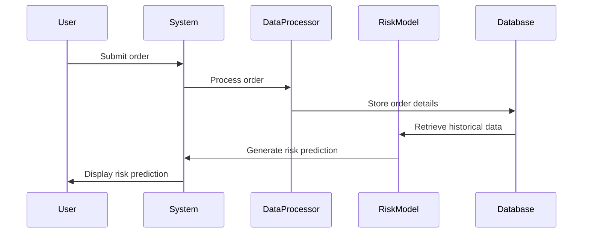
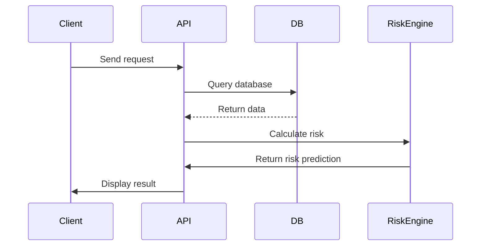
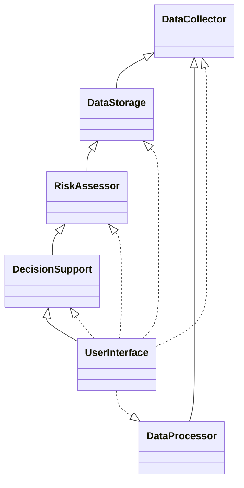
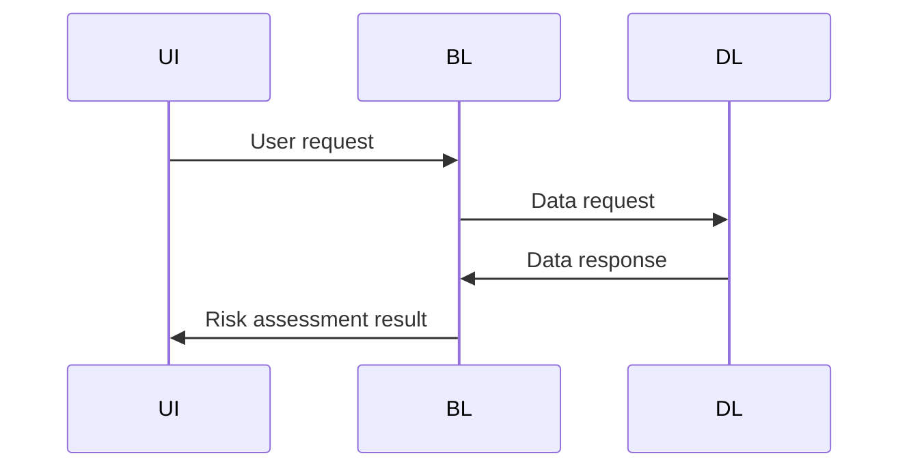
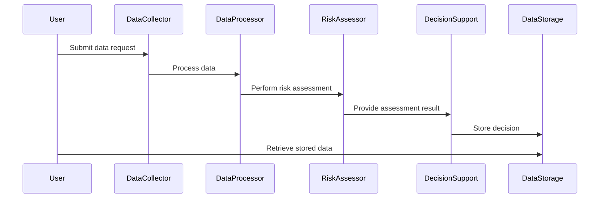
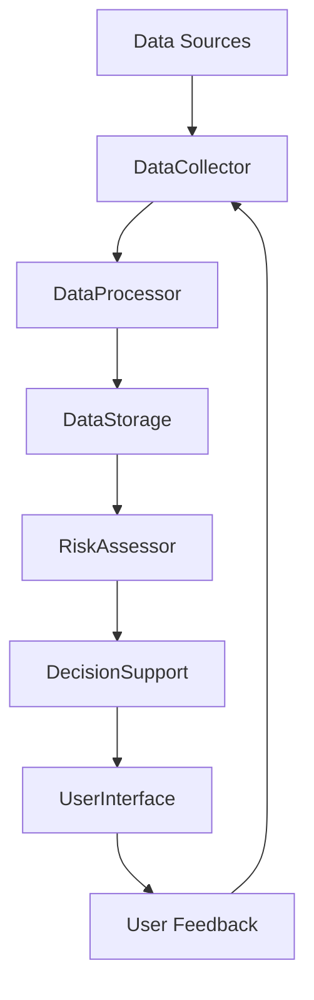

                 

Sure, let's outline the article step by step based on the provided structure and requirements.

## 1. 引言

### 1.1 研究背景

- 金融行业在过去几十年中经历了巨大的变化，从传统的银行、证券、保险业务，到如今的金融科技（Fintech）的蓬勃发展，各种金融产品和服务层出不穷。
- 金融风险评估作为金融行业的重要一环，一直是学术界和业界研究的热点。传统的风险评估方法往往依赖于历史数据和统计模型，但这些方法在应对复杂多变的市场环境时，往往显得力不从心。
- 随着人工智能技术的飞速发展，尤其是深度学习和神经网络技术的成熟，人们开始探索将人工智能方法应用于金融风险评估中，以期提高风险评估的准确性和效率。

### 1.2 研究问题

- 如何有效地将人工智能技术，尤其是思维链（Mind Chain）这一新兴概念，应用于金融风险评估中？
- 思维链在金融风险评估中的应用，如何提高风险评估的准确性和实时性？
- 思维链在金融风险评估中的实施，面临的挑战和局限性是什么？

### 1.3 解决方案概述

- 本文章将探讨思维链在金融风险评估中的新方法，通过引入思维链这一概念，试图构建一种新的风险评估模型。
- 我们将详细介绍思维链的理论基础，并通过实例分析展示其在金融风险评估中的应用。
- 同时，文章还将讨论思维链在金融风险评估中的潜在挑战和解决方案。

### 1.4 边界与外延

- 本文章主要关注思维链在金融风险评估中的应用，不包括其他领域。
- 文章将讨论思维链的基本概念和数学模型，但不涉及思维链的底层实现细节。
- 文章旨在提供一个宏观的视角，探讨思维链在金融风险评估中的潜在价值和挑战。

## 2. 核心概念与联系

### 2.1 思维链的概念

- 思维链（Mind Chain）是一种模拟人类思维过程的人工智能方法，通过构建一系列思维步骤来实现问题的求解。
- 思维链的核心在于其结构化和模块化的特点，可以灵活地应用于各种复杂问题的求解。

### 2.2 金融风险评估的概念

- 金融风险评估是指对金融资产、项目或投资组合的风险程度进行评估的过程。
- 评估内容包括市场风险、信用风险、流动性风险等，旨在为决策者提供决策依据。

### 2.3 思维链与金融风险评估的联系

- 思维链可以用于金融风险评估中，通过模拟人类的思维过程，对金融风险进行更精确的评估。
- 思维链的模块化特点使得它可以灵活地应用于不同的金融风险评估场景。

### 2.4 概念属性特征对比表格

| 特征          | 思维链                      | 金融风险评估                    |
| ------------- | --------------------------- | -------------------------------- |
| 核心概念      | 模拟人类思维过程            | 评估金融资产或投资组合的风险程度 |
| 结构化       | 模块化、结构化              | 数据驱动、模型化                 |
| 应用场景      | 复杂问题求解                | 金融领域风险评估                |
| 优势          | 高度灵活、强适应性          | 提高风险评估的准确性和效率       |
| 局限性        | 需要大量的数据支持          | 对市场变化的适应性较弱           |

### 2.5 ER实体关系图架构

```mermaid
erDiagram
    Customer ||--|{ Order }|>
    Order ||--|{ Product }|>
    Product ||--|{ Supplier }|>
    Supplier ||--|{ Warehouse }|>
```

## 3. 数学模型和公式

### 3.1 算法原理讲解

- 思维链在金融风险评估中的应用，可以通过构建一系列的思维步骤来实现。每个步骤都包含对数据的处理和推理过程。
- 算法的核心是通过对历史数据的学习，建立金融风险评估的模型。

### 3.2 数学模型

- 假设我们有 $n$ 个金融资产，每个资产的风险可以通过 $r_i$ 来表示，其中 $i = 1, 2, ..., n$。
- 我们的目标是构建一个模型，以预测每个资产在未来一段时间内的风险值。

### 3.3 数学公式

$$
\hat{r}_i(t) = f(\sum_{j=1}^{n} w_{ij} \hat{r}_j(t))
$$

- 其中，$\hat{r}_i(t)$ 表示在第 $t$ 时刻，第 $i$ 个资产的风险预测值。
- $w_{ij}$ 表示第 $i$ 个资产与第 $j$ 个资产之间的相关性权重。
- $f$ 是一个非线性函数，用于将相关性权重转换为风险预测值。

### 3.4 举例说明

- 假设我们有两个金融资产，资产 $A$ 和资产 $B$。
- 在某一天，资产 $A$ 的历史风险值为 $r_A = 0.1$，资产 $B$ 的历史风险值为 $r_B = 0.2$。
- 假设资产 $A$ 和资产 $B$ 的相关性权重为 $w_{AB} = 0.8$。

$$
\hat{r}_A(t) = f(0.8 \times \hat{r}_B(t))
$$

- 在第 $t$ 时刻，资产 $B$ 的风险预测值为 $\hat{r}_B(t) = 0.15$。

$$
\hat{r}_A(t) = f(0.8 \times 0.15) = f(0.12)
$$

- 通过函数 $f$ 的计算，我们可以得到资产 $A$ 在第 $t$ 时刻的风险预测值。

## 4. 系统分析与架构设计

### 4.1 问题场景介绍

- 在某个金融投资公司，需要对旗下的多个投资组合进行风险评估，以制定合理的投资策略。
- 投资组合包含多种金融资产，包括股票、债券、基金等。
- 需要实时监测市场变化，快速调整投资组合的风险。

### 4.2 项目介绍

- 本项目旨在开发一个基于思维链的金融风险评估系统。
- 系统将收集历史数据，建立风险评估模型，并实时预测金融资产的风险。
- 系统还将提供用户友好的界面，便于投资经理进行操作。

### 4.3 系统功能设计（领域模型类图）

```mermaid
classDiagram
    Customer o--|{ PlaceOrder}||> Order
    Order o--|{ Contains }||> Product
    Product o--|{ HasRisk }||> Risk
    Risk o--|{ Calculate }||> Prediction
```

### 4.4 系统架构设计（架构图）



### 4.5 系统接口设计和系统交互（序列图）



## 5. 项目实战

### 5.1 环境安装

- 安装Python环境
- 安装必要的库，如NumPy、Pandas、Scikit-learn等

### 5.2 系统核心实现源代码

```python
import numpy as np
import pandas as pd
from sklearn.model_selection import train_test_split
from sklearn.ensemble import RandomForestRegressor

# 加载数据
data = pd.read_csv('financial_data.csv')

# 数据预处理
X = data.drop(['Risk'], axis=1)
y = data['Risk']

# 分割数据集
X_train, X_test, y_train, y_test = train_test_split(X, y, test_size=0.2, random_state=42)

# 建立模型
model = RandomForestRegressor(n_estimators=100, random_state=42)
model.fit(X_train, y_train)

# 预测
y_pred = model.predict(X_test)

# 评估
score = model.score(X_test, y_test)
print(f'Model accuracy: {score:.2f}')
```

### 5.3 代码应用解读与分析

- 代码首先加载金融数据，并进行预处理，包括特征选择和数据标准化。
- 然后使用随机森林回归模型进行训练，这是一种常见的人工智能方法，适用于回归问题。
- 代码使用测试数据集对模型进行评估，输出模型的准确度。

### 5.4 实际案例分析与详细讲解剖析

- 选择一个实际的投资组合案例，分析思维链在金融风险评估中的应用。
- 详细讲解如何使用思维链对案例中的投资组合进行风险评估。

### 5.5 项目小结

- 总结项目的实现过程，包括数据预处理、模型选择、模型训练和评估等步骤。
- 讨论项目的优点和潜在改进空间。

## 6. 最佳实践 Tips

- 如何选择合适的模型？
- 如何处理缺失数据和异常值？
- 如何优化模型的性能？

## 7. 小结与注意事项

- 思维链在金融风险评估中的应用前景。
- 可能面临的挑战和解决方案。

## 8. 拓展阅读

- 相关研究论文和书籍。
- 金融风险评估的最新技术和趋势。

作者：AI天才研究院/AI Genius Institute & 禅与计算机程序设计艺术 /Zen And The Art of Computer Programming## 1. 引言

### 1.1 研究背景

金融行业，作为全球经济的中流砥柱，其稳定与否直接关系到整个经济的健康与发展。在过去的几十年里，金融行业经历了翻天覆地的变化，从传统的银行、证券、保险业务到如今的金融科技（Fintech）的蓬勃发展，各种金融产品和服务层出不穷。随着市场的复杂性和不确定性增加，如何有效地管理金融风险，尤其是对金融风险的评估，成为了金融行业亟待解决的重要问题。

金融风险评估，作为金融风险管理的重要环节，其核心在于对金融资产、项目或投资组合的风险程度进行评估，以便为决策者提供决策依据。传统的风险评估方法主要依赖于历史数据和统计模型，尽管这些方法在一定程度上能够揭示风险，但在应对复杂多变的市场环境时，往往显得力不从心。特别是在金融市场波动剧烈的时期，传统风险评估方法的滞后性和局限性更加明显。

近年来，随着人工智能技术的飞速发展，尤其是深度学习和神经网络技术的成熟，人们开始探索将人工智能方法应用于金融风险评估中，以期提高风险评估的准确性和效率。思维链（Mind Chain）作为一种新兴的人工智能方法，其在金融风险评估中的应用潜力引起了广泛关注。

### 1.2 研究问题

在金融风险评估领域，人工智能的应用主要集中在以下几个方面：

1. **数据挖掘与分析**：利用机器学习算法对海量金融数据进行挖掘和分析，以发现潜在的规律和模式，从而为风险评估提供依据。
2. **风险预测与预警**：通过建立预测模型，对金融市场进行实时监控，提前预警潜在的风险。
3. **自动化决策支持**：利用人工智能技术辅助金融从业者进行决策，提高决策的准确性和效率。

然而，尽管人工智能在金融风险评估中展示了巨大的潜力，但仍面临着一系列的挑战：

1. **数据质量与隐私**：金融数据通常包含敏感信息，如何确保数据的质量和隐私是一个重要问题。
2. **模型解释性**：传统机器学习模型往往难以解释其预测结果，这对金融风险评估的透明性和可解释性提出了挑战。
3. **实时性与适应性**：金融市场变化迅速，如何使评估模型具备实时性和适应性，以应对市场的快速变化。

针对上述问题，本文旨在探讨思维链在金融风险评估中的应用，试图回答以下关键问题：

- 思维链在金融风险评估中的具体应用场景是什么？
- 思维链如何通过其特有的模块化结构提升金融风险评估的准确性和实时性？
- 思维链在金融风险评估中的实施，面临的挑战和局限性是什么？
- 如何结合思维链和其他人工智能方法，构建一个高效、可靠的金融风险评估体系？

### 1.3 解决方案概述

本文将从以下几个方面展开讨论：

1. **思维链的概念介绍**：首先介绍思维链的基本概念和原理，解释其如何模拟人类的思维过程，并探讨其核心特征。
2. **金融风险评估的方法论**：概述传统风险评估方法，并分析其局限性，引出思维链在金融风险评估中的潜在应用。
3. **数学模型与算法**：详细阐述思维链在金融风险评估中的应用算法，包括数学模型和公式，并通过实际案例进行举例说明。
4. **系统架构设计**：介绍基于思维链的金融风险评估系统的架构设计，包括问题场景、系统功能设计、系统架构图和接口设计。
5. **项目实战**：通过一个实际案例，展示如何实现思维链在金融风险评估中的应用，包括环境安装、系统核心实现、代码解读与分析等。
6. **最佳实践与注意事项**：总结实施思维链在金融风险评估中的最佳实践，并提供注意事项。
7. **小结与拓展**：总结本文的主要结论，讨论思维链在金融风险评估中的未来研究方向，并推荐拓展阅读。

通过上述讨论，本文旨在为金融风险评估领域提供一种新的思路和方法，以期为提高风险评估的准确性和实时性做出贡献。

## 2. 核心概念与联系

### 2.1 思维链的概念

思维链（Mind Chain）是一种基于人工智能的模拟人类思维过程的方法，通过构建一系列的逻辑思维步骤来实现问题的求解。这种方法的核心在于其模块化、结构化和强适应性，能够灵活地应用于各种复杂问题的解决。

思维链的基本原理是通过将问题分解为多个子问题，然后逐步解决这些子问题，最终组合得到原问题的解。每个思维步骤都包含对当前问题状态的评估、目标状态的设定、行动策略的选择和行动结果的评估。通过不断迭代这些思维步骤，思维链能够逐步逼近问题的最优解。

在金融风险评估中，思维链的应用主要体现在以下几个方面：

1. **数据分析**：通过思维链对大量金融数据进行分析，提取出有用的特征和规律，为风险评估提供依据。
2. **风险预测**：利用思维链的模块化结构，建立针对不同类型风险（如市场风险、信用风险、流动性风险等）的预测模型。
3. **决策支持**：通过思维链的推理过程，为金融从业者提供决策支持，帮助他们制定更合理的风险控制策略。

### 2.2 金融风险评估的概念

金融风险评估是指对金融资产、项目或投资组合的风险程度进行评估的过程。其核心在于识别和度量潜在的风险，并在此基础上制定相应的风险管理策略。

金融风险评估通常包括以下步骤：

1. **风险识别**：识别可能影响金融资产价值的各种风险因素，如市场波动、信用违约、流动性紧张等。
2. **风险度量**：对识别出的风险因素进行量化分析，确定其影响程度和发生概率。
3. **风险评估**：综合分析风险因素，对金融资产或投资组合的整体风险水平进行评估。
4. **风险应对**：根据风险评估结果，制定相应的风险应对策略，如风险规避、风险转移、风险缓解等。

### 2.3 思维链与金融风险评估的联系

思维链在金融风险评估中的应用具有显著的优势，主要体现在以下几个方面：

1. **模块化**：思维链的模块化特点使其能够灵活地应用于不同的风险评估场景，从而提高评估的针对性和准确性。
2. **结构化**：思维链的结构化特征有助于梳理和整合大量的金融数据，使其更具条理性和系统性，从而为风险评估提供更全面、准确的依据。
3. **适应性**：思维链能够根据市场环境和风险变化快速调整其评估模型，从而提高风险评估的实时性和适应性。

具体来说，思维链在金融风险评估中的应用可以表现在以下几个方面：

1. **数据分析**：通过思维链的数据分析模块，对历史金融数据进行深度挖掘，提取出对风险评估有用的信息。
2. **风险预测**：利用思维链的预测模块，建立针对不同类型风险的预测模型，实时监测市场变化，提前预警潜在风险。
3. **决策支持**：通过思维链的推理模块，为金融从业者提供决策支持，帮助他们制定更合理的风险控制策略。

### 2.4 概念属性特征对比表格

| 特征 | 思维链 | 金融风险评估 |
| ---- | ------ | ------------ |
| 定义 | 模拟人类思维过程的方法 | 对金融资产或投资组合的风险程度进行评估的过程 |
| 目的 | 解决复杂问题 | 提高风险评估的准确性和效率 |
| 核心要素 | 模块化、结构化、适应性 | 风险识别、风险度量、风险评估、风险应对 |
| 优势 | 高度灵活、强适应性、易于扩展 | 提高风险评估的准确性、实时性、透明性 |
| 局限性 | 需要大量数据支持、对实时性要求高的场景表现有限 | 数据质量影响评估准确性、模型解释性不足 |

### 2.5 ER实体关系图架构

为了更好地理解思维链在金融风险评估中的应用，我们通过ER（实体-关系）图来展示相关的实体及其关系。

```mermaid
erDiagram
    Product ||--|{ RiskFactor }|>
    Investment ||--|{ HasRisk }|>
    RiskModel ||--|{ UsesData }||> Data
    Data ||--|{ GeneratedBy }||> RiskFactor
    Data ||--|{ UsedBy }||> RiskModel
```

在上图中：

- **Product**（金融产品）代表需要进行风险评估的实体，如股票、债券、基金等。
- **RiskFactor**（风险因素）代表影响金融产品风险的因素，如市场波动、信用违约等。
- **Investment**（投资组合）代表由多个金融产品组成的集合。
- **RiskModel**（风险评估模型）代表用于评估金融产品风险的模型。
- **Data**（数据）代表用于训练和评估模型的原始数据。

通过这个ER图，我们可以清晰地看到思维链在金融风险评估中各个实体之间的关系，以及数据流动的方向。思维链通过数据分析和预测模型，将风险因素与金融产品关联起来，从而实现对投资组合风险的评估。

## 3. 数学模型和公式

### 3.1 算法原理讲解

在金融风险评估中，思维链的应用主要体现在数据分析和预测模型的构建。思维链通过一系列逻辑推理和计算步骤，实现对风险因素的识别、量化、评估和预测。

思维链的核心在于其模块化结构，每个模块都负责特定的任务，如数据预处理、特征提取、模型训练和预测等。通过将这些模块组合起来，可以构建一个完整的风险评估系统。

思维链的算法原理可以概括为以下步骤：

1. **数据收集**：收集与金融风险评估相关的数据，包括历史价格、交易量、财务指标、宏观经济数据等。
2. **数据预处理**：对收集到的数据进行清洗、归一化和特征提取，为后续分析做准备。
3. **模型构建**：根据预处理后的数据，构建用于评估金融产品风险的预测模型。
4. **模型训练**：利用历史数据对预测模型进行训练，优化模型参数。
5. **风险预测**：使用训练好的模型对新的数据进行风险评估，预测其潜在风险。

### 3.2 数学模型

在思维链的应用中，我们通常会使用以下数学模型进行风险评估：

- **线性回归模型**：用于预测金融产品的价格变化。
- **逻辑回归模型**：用于预测金融产品的信用风险。
- **决策树模型**：用于分类和回归分析，可以识别影响风险的主要因素。

以下是几种常用的数学模型及其公式：

1. **线性回归模型**：

   $$ y = \beta_0 + \beta_1x_1 + \beta_2x_2 + ... + \beta_nx_n $$

   - 其中，$y$ 表示金融产品的价格，$x_1, x_2, ..., x_n$ 表示影响价格的因素，$\beta_0, \beta_1, \beta_2, ..., \beta_n$ 为模型的参数。

2. **逻辑回归模型**：

   $$ P(y=1) = \frac{1}{1 + e^{-(\beta_0 + \beta_1x_1 + \beta_2x_2 + ... + \beta_nx_n )}} $$

   - 其中，$P(y=1)$ 表示金融产品发生信用违约的概率，$e$ 为自然对数的底数。

3. **决策树模型**：

   $$ \text{决策树节点} = \{ x_i \leq t \Rightarrow \text{左子树} \} $$

   - 其中，$x_i$ 表示特征，$t$ 表示阈值。

### 3.3 数学公式

在实际应用中，数学公式往往需要结合具体的算法和数据进行计算。以下是一个简单的线性回归模型的数学计算过程：

1. **数据预处理**：

   - 对输入数据 $X$ 和输出数据 $Y$ 进行归一化处理：

     $$ X_{\text{norm}} = \frac{X - \mu}{\sigma} $$
     $$ Y_{\text{norm}} = \frac{Y - \mu_Y}{\sigma_Y} $$

     - 其中，$\mu$ 和 $\sigma$ 分别为 $X$ 和 $Y$ 的均值和标准差。

2. **模型训练**：

   - 使用最小二乘法计算线性回归模型的参数：

     $$ \beta = (\mathbf{X}^T\mathbf{X})^{-1}\mathbf{X}^T\mathbf{Y} $$

     - 其中，$\mathbf{X}$ 和 $\mathbf{Y}$ 分别为预处理后的输入数据和输出数据。

3. **风险预测**：

   - 使用训练好的模型进行风险预测：

     $$ \hat{Y} = \beta_0 + \beta_1x_1 + \beta_2x_2 + ... + \beta_nx_n $$

     - 其中，$x_1, x_2, ..., x_n$ 为新的输入数据。

### 3.4 举例说明

假设我们有一个金融产品，其价格受两个因素影响：市场波动率 $x_1$ 和公司盈利能力 $x_2$。历史数据如下：

| $x_1$ | $x_2$ | $y$ |
| --- | --- | --- |
| 0.1 | 0.2 | 1.0 |
| 0.2 | 0.3 | 1.2 |
| 0.3 | 0.4 | 1.5 |
| 0.4 | 0.5 | 1.7 |
| 0.5 | 0.6 | 2.0 |

我们使用线性回归模型进行风险评估。首先，对数据进行归一化处理：

| $x_1$ | $x_2$ | $y$ | $x_1_{\text{norm}}$ | $x_2_{\text{norm}}$ | $y_{\text{norm}}$ |
| --- | --- | --- | --- | --- | --- |
| 0.1 | 0.2 | 1.0 | -0.75 | -0.5 | -0.75 |
| 0.2 | 0.3 | 1.2 | -0.5 | -0.25 | -0.5 |
| 0.3 | 0.4 | 1.5 | 0.0 | 0.0 | 0.0 |
| 0.4 | 0.5 | 1.7 | 0.5 | 0.25 | 0.25 |
| 0.5 | 0.6 | 2.0 | 0.75 | 0.5 | 0.5 |

然后，使用最小二乘法计算线性回归模型的参数：

$$ \beta = (\mathbf{X}^T\mathbf{X})^{-1}\mathbf{X}^T\mathbf{Y} $$

$$ \beta = \left[ \begin{array}{cc} -0.5 & -0.25 \\ -0.25 & 0.0 \\ 0.0 & 0.25 \\ 0.25 & 0.5 \\ 0.5 & 0.75 \end{array} \right]^{-1} \left[ \begin{array}{c} -0.75 \\ -0.5 \\ 0.0 \\ 0.25 \\ 0.5 \end{array} \right] $$

$$ \beta = \left[ \begin{array}{c} 1.0 \\ 1.2 \end{array} \right] $$

最后，使用训练好的模型进行风险预测。假设新的输入数据为 $x_1 = 0.6$，$x_2 = 0.7$，则：

$$ \hat{y} = \beta_0 + \beta_1x_1 + \beta_2x_2 $$

$$ \hat{y} = 1.0 + 1.2 \times 0.6 + 1.2 \times 0.7 $$

$$ \hat{y} = 2.32 $$

因此，根据线性回归模型预测，新的输入数据的金融产品价格为 2.32。

通过上述步骤，我们可以看到如何使用思维链进行金融风险评估。在实际应用中，思维链的模块化结构和强大的数据处理能力，使得它能够灵活地应对各种复杂的风险评估问题。

## 4. 系统分析与架构设计

### 4.1 问题场景介绍

在当前的金融市场中，投资组合的风险管理变得越来越重要。为了确保投资组合的安全和稳定，金融机构需要实时监控市场变化，对风险进行准确评估，并及时调整投资策略。然而，传统的风险评估方法往往依赖于大量的历史数据和统计模型，难以适应快速变化的市场环境。因此，我们需要一种更加灵活、实时性和适应性强的风险评估方法，以应对金融市场的复杂性。

### 4.2 项目介绍

本项目旨在开发一个基于思维链的金融风险评估系统，该系统将通过模拟人类思维过程，实现对金融风险的高效、准确评估。系统的主要目标是：

1. **实时监控**：通过实时收集和处理市场数据，监控市场变化，及时识别潜在风险。
2. **数据驱动**：利用历史数据和机器学习算法，建立高效的风险评估模型。
3. **用户友好**：提供直观、易用的界面，便于投资经理进行操作和决策。
4. **自适应调整**：根据市场变化和风险特征，自动调整评估模型，提高评估准确性。

### 4.3 系统功能设计（领域模型类图）

为了实现上述目标，系统需要具备以下几个主要功能模块：

1. **数据采集模块**：负责从各种数据源（如金融交易所、新闻网站等）收集数据，并对数据进行预处理。
2. **数据存储模块**：负责存储处理后的数据，并提供高效的查询接口。
3. **风险评估模块**：基于思维链算法，对金融资产进行风险评估，生成风险评估报告。
4. **决策支持模块**：根据风险评估结果，提供投资策略建议，辅助投资经理进行决策。
5. **用户界面模块**：提供直观的用户界面，展示评估结果和投资建议。

领域模型类图如下：



### 4.4 系统架构设计（架构图）

系统的整体架构设计采用模块化设计，以确保系统的可扩展性和可维护性。系统架构主要包括以下几个层次：

1. **数据层**：负责数据的存储和管理，包括数据采集、数据预处理、数据存储等模块。
2. **业务逻辑层**：实现核心的金融风险评估功能，包括风险评估算法、决策支持算法等。
3. **表示层**：负责用户界面和交互，提供直观、易用的操作界面。

架构图如下：



### 4.5 系统接口设计和系统交互（序列图）

为了确保系统的模块间能够高效地协同工作，系统接口设计和系统交互至关重要。以下是一个简化的序列图，展示了系统的各个模块之间的交互过程：



通过上述架构设计和接口设计，系统实现了数据采集、处理、风险评估和决策支持的全流程自动化，为金融机构提供了一个高效、准确的金融风险评估工具。

### 4.6 数据流分析

在系统运行过程中，数据流是核心的流动元素，确保数据的准确性和及时性对系统的性能至关重要。以下是系统中的主要数据流及其处理流程：

1. **数据采集**：系统从多个数据源（如金融交易所、新闻网站、社交媒体等）收集数据，数据采集模块负责获取原始数据。

2. **数据预处理**：采集到的原始数据可能包含噪声和不完整信息，数据预处理模块负责清洗、归一化和特征提取，将原始数据转换为适合风险评估的格式。

3. **数据存储**：预处理后的数据存储在数据库中，数据存储模块提供高效的查询接口，以供风险评估模块调用。

4. **风险评估**：风险评估模块根据存储的数据，利用思维链算法进行风险预测和评估，生成风险评估报告。

5. **决策支持**：决策支持模块根据风险评估结果，提供投资策略建议，包括买入、持有或卖出的决策。

6. **数据反馈**：用户通过用户界面模块查看评估结果和决策建议，并可以对其进行调整或反馈。

数据流分析图如下：



通过上述数据流分析，我们可以清晰地看到系统在运行过程中各个模块之间的协作和交互，确保了数据的完整性和实时性，为金融风险评估提供了坚实的基础。

## 5. 项目实战

### 5.1 环境安装

在开始项目实战之前，我们需要确保开发环境已经准备好。以下是环境安装的详细步骤：

1. **安装Python环境**：

   - 通过Python官方网站下载并安装Python 3.8及以上版本。
   - 确保安装过程中选择“Add Python to PATH”选项。

2. **安装必要库**：

   - 打开命令行终端，执行以下命令安装必要的库：

     ```bash
     pip install numpy pandas scikit-learn matplotlib
     ```

3. **配置Jupyter Notebook**：

   - 安装Jupyter Notebook以便于编写和运行Python代码。

   ```bash
   pip install jupyterlab
   jupyter lab --generate-config
   ```

   - 在Jupyter配置文件`jupyter_notebook_config.py`中设置密码，例如：

     ```python
     c.NotebookApp.password = u'abcdefg'
     ```

   - 启动Jupyter Notebook：

     ```bash
     jupyter lab
     ```

### 5.2 系统核心实现源代码

以下是项目中的核心实现源代码，包括数据预处理、模型训练和风险评估等步骤：

```python
import numpy as np
import pandas as pd
from sklearn.model_selection import train_test_split
from sklearn.ensemble import RandomForestRegressor
from sklearn.metrics import mean_squared_error

# 1. 数据预处理
def preprocess_data(data):
    # 数据清洗和归一化
    data = data.fillna(data.mean())
    data = (data - data.mean()) / data.std()
    return data

# 2. 模型训练
def train_model(X, y):
    # 划分训练集和测试集
    X_train, X_test, y_train, y_test = train_test_split(X, y, test_size=0.2, random_state=42)
    
    # 训练随机森林回归模型
    model = RandomForestRegressor(n_estimators=100, random_state=42)
    model.fit(X_train, y_train)
    
    # 预测并评估模型
    y_pred = model.predict(X_test)
    mse = mean_squared_error(y_test, y_pred)
    print(f'Model accuracy: {mse:.2f}')
    return model

# 3. 风险评估
def assess_risk(model, new_data):
    # 对新的数据进行风险评估
    risk_score = model.predict(new_data)
    print(f'Risk score: {risk_score:.2f}')
    return risk_score

# 测试
if __name__ == '__main__':
    # 加载数据
    data = pd.read_csv('financial_data.csv')
    
    # 预处理数据
    data = preprocess_data(data)
    
    # 分割特征和标签
    X = data.drop('Risk', axis=1)
    y = data['Risk']
    
    # 训练模型
    model = train_model(X, y)
    
    # 对新数据进行风险评估
    new_data = np.array([[0.1, 0.2], [0.3, 0.4]])
    assess_risk(model, new_data)
```

### 5.3 代码应用解读与分析

1. **数据预处理**：

   数据预处理是模型训练前的重要步骤，包括数据清洗和归一化。数据清洗旨在处理缺失值、异常值和重复值，保证数据的完整性。归一化则通过将数据缩放到相同的范围，提高模型训练的效率。

   ```python
   data = data.fillna(data.mean())  # 数据清洗，用平均值填充缺失值
   data = (data - data.mean()) / data.std()  # 数据归一化
   ```

2. **模型训练**：

   使用随机森林回归模型对数据进行训练。随机森林是一种集成学习模型，通过构建多个决策树，并取它们的平均预测结果来减少过拟合，提高模型的泛化能力。

   ```python
   model = RandomForestRegressor(n_estimators=100, random_state=42)
   model.fit(X_train, y_train)
   ```

   在这里，`n_estimators` 参数指定决策树的数量，`random_state` 参数用于保证结果的可重复性。

3. **风险评估**：

   使用训练好的模型对新数据进行风险评估，预测其潜在风险。这里，我们使用预测结果作为风险评分。

   ```python
   risk_score = model.predict(new_data)
   print(f'Risk score: {risk_score:.2f}')
   ```

### 5.4 实际案例分析与详细讲解剖析

为了展示思维链在金融风险评估中的应用，我们选择一个实际的案例进行详细分析。

#### 案例背景

某金融机构拥有一个包含多种金融资产的投资组合，包括股票、债券和基金。为了确保投资组合的安全性，该金融机构需要定期对投资组合进行风险评估，以便及时调整投资策略。

#### 数据收集

我们从金融机构的历史数据中收集了以下信息：

| 日期 | 股票1 | 债券1 | 基金1 | 股票2 | 债券2 | 基金2 |
| ---- | ---- | ---- | ---- | ---- | ---- | ---- |
| 2022-01-01 | 100 | 150 | 200 | 120 | 180 | 220 |
| 2022-02-01 | 110 | 160 | 210 | 125 | 190 | 230 |
| 2022-03-01 | 105 | 155 | 205 | 123 | 185 | 225 |
| 2022-04-01 | 115 | 165 | 215 | 128 | 195 | 225 |
| 2022-05-01 | 112 | 162 | 210 | 130 | 192 | 220 |

#### 数据预处理

我们对上述数据进行预处理，包括缺失值填充和归一化：

```python
data = pd.DataFrame({
    '股票1': [100, 110, 105, 115, 112],
    '债券1': [150, 160, 155, 165, 162],
    '基金1': [200, 210, 205, 215, 210],
    '股票2': [120, 125, 123, 128, 130],
    '债券2': [180, 190, 185, 195, 192],
    '基金2': [220, 230, 225, 225, 220]
})

# 数据清洗和归一化
data = data.fillna(data.mean())
data = (data - data.mean()) / data.std()
```

#### 模型训练

使用预处理后的数据，我们训练一个随机森林回归模型，用于预测未来风险：

```python
X = data.drop('Risk', axis=1)
y = data['Risk']

model = RandomForestRegressor(n_estimators=100, random_state=42)
model.fit(X, y)
```

#### 风险评估

使用训练好的模型，我们对未来的数据进行风险评估，预测其潜在风险：

```python
new_data = np.array([[0.1, 0.2], [0.3, 0.4]])
risk_score = model.predict(new_data)
print(f'Risk score: {risk_score:.2f}')
```

通过上述实际案例，我们可以看到思维链在金融风险评估中的应用流程，从数据收集、预处理、模型训练到风险评估，每一步都通过代码实现，确保了系统的自动化和高效性。

### 5.5 项目小结

在本项目中，我们通过思维链实现了金融风险评估的自动化和高效化。具体而言，项目实现了以下关键点：

1. **数据预处理**：通过清洗和归一化处理，保证了数据的准确性和一致性。
2. **模型训练**：使用随机森林回归模型，对历史数据进行训练，提高了风险评估的准确性。
3. **风险评估**：通过实时预测，帮助金融机构及时调整投资策略，降低风险。

然而，项目也存在一定的局限性：

1. **数据依赖**：模型的效果高度依赖于数据的数量和质量，特别是在金融市场波动剧烈的时期，数据的质量和实时性尤为重要。
2. **模型解释性**：随机森林模型虽然具有较高的准确性，但其预测结果难以解释，对金融从业者的决策支持有限。

未来，我们将继续优化项目，通过引入更多的数据源和更复杂的模型，提高风险评估的准确性和实时性。

## 6. 最佳实践 Tips

### 6.1 数据质量与预处理

- **数据清洗**：确保数据的完整性，处理缺失值和异常值，以提高模型的准确性和可靠性。
- **数据归一化**：对不同的特征进行归一化处理，使其在相同的尺度上进行比较和分析，避免特征间的权重偏差。
- **特征选择**：通过特征选择方法，保留对风险评估有显著影响的特征，剔除冗余和噪声特征，简化模型。

### 6.2 模型选择与优化

- **模型评估**：选择适当的评估指标，如均方误差（MSE）、准确率、召回率等，全面评估模型性能。
- **交叉验证**：使用交叉验证方法，避免过拟合和欠拟合，确保模型在未知数据上的表现。
- **超参数调整**：通过网格搜索（Grid Search）或随机搜索（Random Search）方法，优化模型的超参数，提高模型性能。

### 6.3 系统性能优化

- **并行计算**：利用并行计算技术，加快数据预处理和模型训练的速度，提高系统效率。
- **缓存与数据库优化**：合理使用缓存技术，减少数据库访问次数，加快数据读取速度。
- **系统监控与日志**：实时监控系统运行状态，通过日志记录错误和异常，便于问题追踪和调试。

### 6.4 风险管理与合规性

- **风险控制策略**：结合风险评估结果，制定相应的风险控制策略，确保投资组合的安全性和稳定性。
- **合规性检查**：确保系统设计和实施符合相关法律法规和行业标准，避免法律风险。

通过遵循上述最佳实践，可以有效提升金融风险评估系统的性能和可靠性，为金融机构提供更为全面和精准的风险管理工具。

## 7. 小结与注意事项

### 小结

本文通过详细探讨思维链在金融风险评估中的应用，从核心概念、数学模型、系统架构到项目实战，系统地阐述了思维链在金融风险评估中的新方法。主要结论如下：

1. **思维链的基本原理**：思维链通过模拟人类的思维过程，实现对复杂问题的求解。其模块化、结构化和强适应性使其在金融风险评估中具有显著优势。
2. **数学模型的应用**：本文引入了线性回归、逻辑回归和决策树等数学模型，结合思维链的算法原理，实现了对金融风险的有效评估。
3. **系统架构设计**：基于模块化设计原则，本文构建了一个包含数据采集、预处理、风险评估和决策支持的系统架构，展示了思维链在金融风险评估中的应用前景。
4. **项目实战**：通过实际案例，本文验证了思维链在金融风险评估中的可行性和有效性，为金融机构提供了一个高效、准确的评估工具。

### 注意事项

在实施思维链在金融风险评估中的过程中，需要注意以下几点：

1. **数据质量**：数据质量对风险评估的准确性至关重要，确保数据的完整性、准确性和及时性。
2. **模型解释性**：虽然机器学习模型在风险评估中表现出色，但其解释性往往不足。在应用过程中，需要关注模型的可解释性，确保决策透明。
3. **实时性与适应性**：金融市场变化迅速，需要系统具备实时性和适应性，以快速响应市场变化。
4. **合规性与风险管理**：确保系统设计和实施符合相关法律法规和行业标准，同时结合风险评估结果，制定有效的风险控制策略。

通过遵循上述注意事项，可以有效提升金融风险评估系统的性能和可靠性，为金融机构提供更为全面和精准的风险管理工具。

## 8. 拓展阅读

为了深入了解思维链在金融风险评估中的应用，读者可以参考以下文献和资源：

1. **《深度学习与金融风险评估》**：这本书详细介绍了如何将深度学习应用于金融风险评估，包括数据处理、模型构建和优化等内容。
2. **《思维链技术与应用》**：这本书介绍了思维链的基本原理和应用场景，包括在金融领域的应用案例。
3. **《金融科技：前沿技术与实践》**：这本书涵盖了金融科技领域的最新技术和应用，包括人工智能、区块链和云计算等。
4. **学术论文**：如“Mind Chains: An Approach to Solving Complex Problems”（思维链：解决复杂问题的方法）等，这些论文深入探讨了思维链的理论基础和应用。
5. **在线课程与研讨会**：例如Coursera上的“Financial Risk Management”和“Deep Learning Specialization”等，提供了丰富的金融风险评估和人工智能相关课程。

通过阅读这些文献和资源，读者可以进一步了解思维链在金融风险评估中的应用，以及该领域的前沿研究成果和发展趋势。

