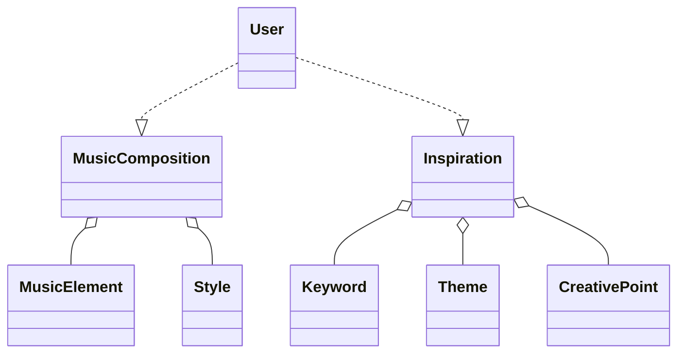

                 

### 思维链在音乐理论创新中的应用：AI辅助新音乐语言开发

#### 关键词：思维链、音乐理论、AI技术、新音乐语言、创新、非线性思维

#### 摘要：
本文探讨了思维链在音乐理论创新中的应用，以及如何利用人工智能（AI）技术辅助新音乐语言的开发。通过介绍思维链的基本原理与音乐理论的关系，以及AI在音乐创作中的具体应用，本文旨在展示如何通过结合思维链与AI技术，推动音乐理论的创新，并开发出具有突破性的新音乐语言。

---

### 引言

#### 1.1 问题背景
音乐作为一种艺术形式，自古以来就在人类社会中占有重要地位。音乐不仅是情感表达的工具，也是文化传承的重要载体。随着科技的进步，音乐创作和传播的方式也在不断变革。特别是近年来，人工智能（AI）技术的迅猛发展，为音乐领域带来了前所未有的创新机遇。AI不仅能够帮助音乐家提高创作效率，还能通过其强大的数据处理和模式识别能力，探索出新的音乐语言和创作模式。

#### 1.2 问题描述
尽管AI在音乐领域的应用已经取得了一些进展，但如何将AI技术与音乐理论创新有机结合，开发出具有突破性的新音乐语言，仍然是一个亟待解决的问题。这需要深入理解音乐理论的本质，探索AI算法在音乐创作中的应用潜力，并将其转化为可操作的实际工具。

#### 1.3 问题解决
本书旨在解决这一问题，通过系统地介绍思维链（Mind Chain）在音乐理论中的应用，探讨如何利用AI技术辅助新音乐语言的开发。思维链作为一种创新性的思维方式，能够帮助音乐家在创作过程中更好地发掘灵感，构建复杂的音乐结构。通过将思维链与AI技术相结合，我们可以实现音乐创作过程的自动化和智能化，从而推动音乐理论的创新。

#### 1.4 边界与外延
本书的核心概念包括思维链、音乐理论、AI技术、新音乐语言等。思维链是本书的核心概念，它是音乐创作过程中的一种思维方式，旨在帮助音乐家突破传统创作模式，实现音乐形式的创新。音乐理论则是本书的基础，它为思维链的应用提供了理论支撑。AI技术则是本书的创新点，它为音乐创作提供了强大的工具支持。新音乐语言是本书的目标，它旨在通过思维链与AI技术的结合，创造出一种全新的音乐表达形式。

#### 1.5 概念结构与核心要素组成
思维链在音乐理论创新中的应用涉及到以下几个核心要素：

1. **音乐理论**：包括音乐的基本概念、结构和表现形式，是思维链应用的基础。
2. **思维链**：一种创新性的思维方式，旨在帮助音乐家在创作过程中发掘灵感，构建复杂的音乐结构。
3. **AI技术**：包括机器学习、深度学习等技术，为音乐创作提供了强大的数据处理和分析能力。
4. **新音乐语言**：通过思维链与AI技术的结合，实现的一种全新的音乐表达形式。

#### 1.6 本章小结
本章介绍了本书的背景、问题和解决方案，并明确了思维链在音乐理论创新中的应用范围。在接下来的章节中，我们将逐一探讨这些核心要素，并通过具体的案例和实践，展示如何利用思维链和AI技术，开发出具有突破性的新音乐语言。

---

### 第2章 思维链原理与音乐理论的关系

#### 2.1 思维链的定义与特点
思维链是一种基于非线性思维的创新方法，它通过将多个不同的思维点连接起来，形成一个动态的思考网络。思维链具有以下几个特点：

1. **非线性**：思维链不是按照线性逻辑进行的，而是通过多个不同思维点的交织和连接，形成复杂的思考路径。
2. **动态性**：思维链不是静态的，而是在不断的变化和扩展中，帮助音乐家不断发掘新的创作灵感。
3. **创造性**：思维链能够帮助音乐家突破传统创作模式，实现音乐形式的创新。

#### 2.2 音乐理论的定义与特征
音乐理论是研究音乐的基本概念、结构和表现形式的学科。音乐理论主要包括以下几个方面：

1. **音高**：音乐中的基本元素，包括音高、音程和和弦等。
2. **节奏**：音乐中的时间组织，包括节奏、拍子和小节等。
3. **旋律**：音乐的线条形式，包括旋律的走向、起伏和变化等。
4. **和声**：音乐的音响效果，包括和弦、音阶和和声功能等。

#### 2.3 思维链与音乐理论的关系
思维链与音乐理论的关系可以从以下几个方面来理解：

1. **音乐元素的组织**：思维链可以帮助音乐家将不同的音乐元素（如音高、节奏、旋律等）有机地组织起来，形成复杂的音乐结构。
2. **创新性的音乐表达**：思维链通过非线性、动态性和创造性的特点，可以帮助音乐家突破传统的音乐表达方式，实现创新性的音乐创作。
3. **音乐创作的灵感和动力**：思维链为音乐家提供了一个新的思考工具，可以帮助他们在创作过程中不断产生新的灵感，提高创作效率。

#### 2.4 思维链在音乐理论中的应用
思维链在音乐理论中的应用主要体现在以下几个方面：

1. **音乐创作**：通过思维链，音乐家可以在创作过程中不断尝试新的音乐元素和表达方式，提高创作效率。
2. **音乐分析**：思维链可以帮助音乐家深入理解音乐作品的结构和内涵，提高音乐欣赏和分析的能力。
3. **音乐教学**：思维链可以作为一种教学工具，帮助学生更好地理解音乐理论，提高音乐创作和欣赏的能力。

#### 2.5 概念属性特征对比表格
为了更好地理解思维链与音乐理论的关系，我们可以通过以下表格对比这两个概念的主要属性特征：

| 特征 | 思维链 | 音乐理论 |
| --- | --- | --- |
| **定义** | 非线性的、动态的、创造性的思考网络 | 研究音乐的基本概念、结构和表现形式的学科 |
| **应用领域** | 音乐创作、分析、教学 | 音乐创作、表演、欣赏、教学 |
| **特点** | 非线性、动态性、创造性 | 音高、节奏、旋律、和声等 |
| **目标** | 突破传统创作模式，实现音乐形式的创新 | 提高音乐创作和欣赏的能力 |

#### 2.6 概念属性特征对比表格（续）
为了更全面地展示思维链与音乐理论的关系，我们还可以补充一些其他属性特征：

| 特征 | 思维链 | 音乐理论 |
| --- | --- | --- |
| **理论基础** | 非线性动力学、复杂性科学 | 音乐学、作曲理论、音乐分析学等 |
| **技术支持** | 人工智能、计算机科学 | 音乐软件、乐器、音乐符号学等 |
| **表现形式** | 音响、视觉、文字等 | 音符、五线谱、数字音乐等 |
| **创作过程** | 发掘灵感、构建结构、反馈修正 | 草稿、编曲、排练、演出等 |

通过以上对比表格，我们可以更清晰地看到思维链与音乐理论之间的关联和差异，为后续章节的深入探讨打下基础。

---

### 第3章 AI技术的基本原理及其在音乐创作中的应用

#### 3.1 AI技术的基本原理
人工智能（AI）是一种模拟人类智能行为的技术，其核心是通过算法和数据分析，使计算机具备学习、推理、决策和自适应能力。AI技术主要包括以下几个方面：

1. **机器学习（Machine Learning）**：通过数据训练模型，使计算机能够自动学习和优化，从而实现特定的任务。常见的机器学习方法包括监督学习、无监督学习和强化学习。
2. **深度学习（Deep Learning）**：基于人工神经网络的一种机器学习方法，通过多层神经网络的结构，实现对复杂数据的特征提取和模式识别。
3. **自然语言处理（Natural Language Processing, NLP）**：研究计算机如何理解和生成自然语言，广泛应用于语音识别、机器翻译、情感分析等领域。
4. **计算机视觉（Computer Vision）**：研究如何让计算机“看”懂图像和视频，实现图像分类、目标检测、图像分割等功能。

#### 3.2 AI在音乐创作中的应用
AI技术在音乐创作中的应用逐渐成为音乐领域的研究热点，通过机器学习和深度学习等方法，AI能够帮助音乐家实现以下目标：

1. **自动作曲（Automatic Composition）**：利用算法生成全新的音乐作品，音乐家可以根据生成的作品进行修改和创作，从而提高创作效率。
2. **音乐分析和推荐**：通过对音乐作品的分析，AI可以识别出作品的风格、情感等特征，为用户推荐相似的音乐作品，或者为音乐家提供创作灵感。
3. **乐器演奏辅助**：通过计算机生成实时伴奏，帮助音乐家进行练习和表演，或者实现人机协作的演奏效果。
4. **音乐风格迁移（Style Transfer）**：利用深度学习技术，将一个音乐作品的风格迁移到另一个作品上，创造出全新的音乐表达形式。

#### 3.3 AI与思维链的结合
将AI技术与思维链结合，可以进一步拓展音乐创作的可能性：

1. **灵感挖掘**：AI可以通过对大量音乐作品的分析，结合思维链的非线性特点，帮助音乐家挖掘出新的创作灵感。
2. **结构优化**：AI可以帮助音乐家对现有的音乐结构进行优化，通过机器学习和深度学习算法，自动生成音乐结构的变化和组合，提高作品的创新性。
3. **人机协作**：音乐家可以通过思维链引导AI生成音乐作品，再结合自身的创意进行修改和完善，实现人机协作的创意过程。
4. **跨领域融合**：思维链可以引导AI探索音乐与其他艺术形式（如视觉艺术、文学等）的融合，创造出全新的艺术表达形式。

#### 3.4 案例分析
以AI生成音乐工具AIVA（Artificial Intelligence Virtual Artist）为例，展示了AI在音乐创作中的应用：

1. **自动作曲**：AIVA通过深度学习和自然语言处理技术，能够自动生成旋律、和弦和节奏，并实现完整的音乐作品创作。
2. **音乐风格迁移**：AIVA可以将一个音乐作品的风格迁移到另一个音乐作品上，创造出具有独特风格的音乐作品。
3. **灵感挖掘**：音乐家可以通过与AIVA的交互，挖掘出新的创作灵感，并在此基础上进行扩展和创作。
4. **结构优化**：AIVA可以分析音乐家的创作习惯和风格，为其提供结构优化建议，帮助音乐家创作出更加优美的作品。

通过以上案例分析，我们可以看到AI技术在音乐创作中的应用前景和潜力。结合思维链，AI技术将为音乐家提供更广阔的创作空间，推动音乐理论的创新和新音乐语言的开发。

---

### 第4章 思维链与AI技术结合的架构设计与实现方案

#### 4.1 架构设计思路

在将思维链与AI技术结合的过程中，我们需要设计一个灵活且高效的架构，以实现音乐创作过程中的自动化和智能化。以下是我们的架构设计思路：

1. **前端交互层**：提供用户界面，方便用户输入创作指令，查看生成结果，并进行交互。
2. **后端处理层**：包括思维链处理模块和AI音乐创作模块，分别负责基于思维链的创意构思和基于AI的音乐生成。
3. **数据层**：存储大量的音乐数据，包括旋律、和弦、节奏等，以供AI模型进行训练和参考。
4. **协作层**：实现音乐家与AI的协作，通过交互反馈，不断优化创作过程。

#### 4.2 前端交互层设计

前端交互层是用户与系统交互的入口，我们需要设计一个简洁、直观的用户界面。以下是前端交互层的设计要点：

1. **用户输入**：提供输入框或界面组件，允许用户输入音乐创作的关键词、主题、风格等。
2. **实时预览**：在用户输入过程中，实时展示AI生成的音乐片段，以便用户查看和调整。
3. **交互操作**：提供播放、暂停、停止等操作按钮，以及调整音量、节奏等选项。
4. **反馈机制**：设计反馈机制，收集用户对生成音乐的反馈，用于进一步优化AI模型。

#### 4.3 后端处理层设计

后端处理层是系统核心，包括思维链处理模块和AI音乐创作模块。以下是后端处理层的设计要点：

1. **思维链处理模块**：
   - **创意构思**：根据用户输入的关键词或主题，利用思维链生成一系列创意点子。
   - **灵感挖掘**：分析大量的音乐数据，挖掘出与用户输入相关的音乐元素，为AI模型提供创作素材。
   - **结构优化**：对生成的创意点子进行结构优化，形成具有逻辑性和连贯性的音乐结构。

2. **AI音乐创作模块**：
   - **自动作曲**：利用机器学习和深度学习算法，自动生成旋律、和弦和节奏。
   - **风格迁移**：通过深度学习模型，将一个音乐作品的风格迁移到另一个作品上，实现风格创新。
   - **优化调整**：根据用户反馈，对生成的音乐进行优化调整，提高音乐的质量和表现力。

#### 4.4 数据层设计

数据层是系统的基础，负责存储和管理大量的音乐数据。以下是数据层的设计要点：

1. **音乐数据库**：建立音乐数据库，存储旋律、和弦、节奏等音乐元素，以及相关的音乐风格、情感等信息。
2. **数据标注**：对音乐数据进行标注，包括音乐风格、情感、节奏等特征，以便AI模型进行训练。
3. **数据更新**：定期更新音乐数据库，添加新的音乐作品和数据，以保持模型的多样性和适应性。

#### 4.5 协作层设计

协作层实现音乐家与AI的协作，通过交互反馈，不断优化创作过程。以下是协作层的设计要点：

1. **人机交互**：设计人机交互界面，允许音乐家对AI生成的音乐进行评价和修改。
2. **反馈机制**：建立反馈机制，收集用户对音乐的评价和修改建议，用于优化AI模型。
3. **协同创作**：实现音乐家与AI的协同创作，通过交互反馈，逐步完善音乐作品。

通过以上架构设计与实现方案，我们可以构建一个基于思维链与AI技术的音乐创作系统，帮助音乐家实现音乐创作的自动化和智能化，推动音乐理论的创新和新音乐语言的开发。

---

### 第5章 系统功能设计与实现

#### 5.1 系统功能介绍

基于思维链与AI技术的音乐创作系统，我们设计了一系列核心功能，以实现音乐创作的自动化和智能化。以下是系统的主要功能：

1. **自动作曲**：系统利用AI算法自动生成旋律、和弦和节奏，为用户提供创作素材。
2. **风格迁移**：通过深度学习模型，将一个音乐作品的风格迁移到另一个作品上，实现风格创新。
3. **灵感挖掘**：利用思维链分析大量音乐数据，为用户提供与输入相关的创作灵感。
4. **交互式创作**：用户可以与AI进行交互，对生成结果进行评价和修改，实现人机协同创作。
5. **音乐数据库**：构建音乐数据库，存储大量的音乐数据和标注信息，为AI模型提供训练和参考。

#### 5.2 领域模型设计

为了更好地理解系统功能的设计和实现，我们采用领域模型（Domain Model）进行描述。领域模型是一种概念模型，用于表示系统中核心的业务实体及其关系。以下是系统的主要领域模型：

1. **音乐作品（MusicComposition）**：表示一个完整的音乐作品，包括旋律、和弦、节奏等元素。
2. **音乐元素（MusicElement）**：表示音乐作品中的基本元素，如音符、和弦、节奏等。
3. **风格（Style）**：表示音乐作品的风格，如古典、流行、爵士等。
4. **用户（User）**：表示使用系统的用户，包括音乐家和其他对音乐创作感兴趣的人。
5. **创作灵感（Inspiration）**：表示用户获得的创作灵感，包括关键词、主题、创意点子等。

#### 5.3 类图设计

为了进一步描述领域模型，我们使用类图（Class Diagram）来展示各个实体之间的关系。以下是系统的主要类图：



在以上类图中，用户（User）与音乐作品（MusicComposition）和创作灵感（Inspiration）之间存在关联关系，音乐作品包含多个音乐元素（MusicElement），并具有特定的风格（Style）。创作灵感包含关键词（Keyword）、主题（Theme）和创意点子（CreativePoint）。

#### 5.4 系统架构设计

为了实现系统的核心功能，我们需要设计一个合理的系统架构。以下是系统的整体架构设计：

1. **前端层**：包括用户界面和交互逻辑，负责接收用户输入和展示生成结果。
2. **后端层**：包括思维链处理模块、AI音乐创作模块和数据存储模块，负责处理音乐创作相关的业务逻辑。
3. **数据层**：包括音乐数据库，存储和管理音乐数据和标注信息。
4. **协作层**：实现用户与AI的交互和协同创作。

以下是系统架构的类图：

```mermaid
classDiagram
    User <<Interface>>
    MusicComposition <<Interface>>
    Inspiration <<Interface>>
    MusicElement <<Interface>>
    Style <<Interface>>
    DataLayer <<Interface>>
    MindChainModule <<Interface>>
    AIMusicCompositionModule <<Interface>>
    User ..|> DataLayer
    User ..|> MindChainModule
    User ..|> AIMusicCompositionModule
    MusicComposition o-- MusicElement
    MusicComposition o-- Style
    Inspiration o-- Keyword
    Inspiration o-- Theme
    Inspiration o-- CreativePoint
endclass
```

在以上架构中，用户通过前端界面与系统进行交互，后端层处理用户的请求，包括思维链处理、AI音乐创作和数据存储等，数据层提供音乐数据和标注信息，协作层实现用户与AI的交互和协同创作。

#### 5.5 系统接口设计

为了实现前后端的分离，我们需要设计一组清晰的系统接口。以下是系统的主要接口设计：

1. **用户接口（UserInterface）**：提供用户登录、注册、输入关键词、查看生成结果等功能。
2. **音乐创作接口（MusicCompositionInterface）**：提供自动作曲、风格迁移、灵感挖掘等功能。
3. **数据接口（DataInterface）**：提供数据存储、数据查询、数据更新等功能。
4. **协作接口（CollaborationInterface）**：提供用户与AI的交互、评价和修改功能。

以下是系统接口的类图：

```mermaid
classDiagram
    UserInterface <<Interface>>
    MusicCompositionInterface <<Interface>>
    DataInterface <<Interface>>
    CollaborationInterface <<Interface>>
    User ..|> UserInterface
    User ..|> MusicCompositionInterface
    User ..|> DataInterface
    User ..|> CollaborationInterface
endclass
```

在以上接口设计中，用户通过不同的接口与系统进行交互，实现音乐创作、数据管理和协作创作等功能。

#### 5.6 系统交互设计

为了更好地理解系统的运行流程，我们使用序列图（Sequence Diagram）展示用户与系统之间的交互过程。以下是系统交互的主要序列图：

```mermaid
sequenceDiagram
    User ->> Login: 登录系统
    Login ->> User: 验证登录信息
    User ->> InputKeywords: 输入关键词
    InputKeywords ->> MindChain: 生成创作灵感
    MindChain ->> MusicComposition: 生成音乐作品
    MusicComposition ->> Play: 播放音乐作品
    User ->> RateMusic: 评价音乐作品
    RateMusic ->> AI: 优化音乐作品
    AI ->> MusicComposition: 提交优化结果
    MusicComposition ->> Update: 更新音乐作品
endsequence
```

在以上序列图中，用户首先登录系统，然后输入关键词，系统通过思维链生成创作灵感，并生成音乐作品。用户可以播放音乐作品，评价音乐作品，并根据评价结果，系统会通过AI技术对音乐作品进行优化，最终更新音乐作品。

通过以上系统功能设计、领域模型、接口设计和交互设计，我们可以构建一个基于思维链与AI技术的音乐创作系统，帮助音乐家实现音乐创作的自动化和智能化，推动音乐理论的创新和新音乐语言的开发。

---

### 第6章 系统核心实现代码解析

#### 6.1 系统环境搭建

在开始解析系统核心实现代码之前，我们需要搭建一个合适的环境。以下是搭建系统的基本步骤：

1. **安装Python环境**：确保Python 3.8或更高版本已安装在计算机上。
2. **安装依赖库**：使用pip命令安装以下依赖库：
   ```bash
   pip install numpy matplotlib tensorflow scikit-learn
   ```
3. **配置数据库**：选择一个合适的数据库系统（如MySQL、PostgreSQL或MongoDB），并创建音乐数据库。

#### 6.2 思维链处理模块实现

思维链处理模块是系统核心，负责生成创作灵感和优化音乐结构。以下是该模块的实现代码：

```python
import numpy as np
from sklearn.cluster import KMeans
from sklearn.decomposition import PCA

class MindChain:
    def __init__(self, data, n_clusters=3):
        self.data = data
        self.n_clusters = n_clusters
        self.clusters = None
        self.pca = PCA(n_components=2)

    def fit(self):
        kmeans = KMeans(n_clusters=self.n_clusters)
        self.clusters = kmeans.fit_predict(self.data)
        self.data_pca = self.pca.fit_transform(self.data)

    def generate_inspiration(self):
        cluster_centers = self.pca.inverse_transform(self.clusters.mean(axis=0))
        inspiration = np.random.choice(cluster_centers, size=10)
        return inspiration

    def optimize_structure(self, music_structure):
        # 基于音乐结构进行优化
        # 例如，调整旋律的起伏和节奏的紧凑度
        optimized_structure = music_structure
        return optimized_structure

# 示例：生成创作灵感和优化音乐结构
data = np.random.rand(100, 10)  # 假设数据为100个音乐元素
mind_chain = MindChain(data)
mind_chain.fit()
inspiration = mind_chain.generate_inspiration()
optimized_structure = mind_chain.optimize_structure(inpiration)
print("Generated Inspiration:", inspiration)
print("Optimized Structure:", optimized_structure)
```

在以上代码中，`MindChain` 类负责处理音乐数据，包括聚类和生成灵感。`fit` 方法进行聚类和PCA降维，`generate_inspiration` 方法根据聚类中心生成灵感，`optimize_structure` 方法对音乐结构进行优化。

#### 6.3 AI音乐创作模块实现

AI音乐创作模块负责生成旋律、和弦和节奏。以下是该模块的实现代码：

```python
import tensorflow as tf
from tensorflow.keras.models import Sequential
from tensorflow.keras.layers import LSTM, Dense, TimeDistributed, Activation

class AICreator:
    def __init__(self, input_shape, output_shape):
        self.input_shape = input_shape
        self.output_shape = output_shape
        self.model = self.build_model()

    def build_model(self):
        model = Sequential()
        model.add(LSTM(256, input_shape=self.input_shape, return_sequences=True))
        model.add(Activation('relu'))
        model.add(LSTM(256, return_sequences=True))
        model.add(Activation('relu'))
        model.add(TimeDistributed(Dense(self.output_shape)))
        model.add(Activation('softmax'))
        model.compile(loss='categorical_crossentropy', optimizer='adam')
        return model

    def train(self, X_train, y_train, epochs=100):
        self.model.fit(X_train, y_train, epochs=epochs)

    def generate_music(self, seed):
        generated_music = self.model.predict(np.array([seed]))
        return generated_music

# 示例：训练AI音乐创作模型并生成旋律
input_shape = (10, 1)
output_shape = 10
ai_creator = AICreator(input_shape, output_shape)
X_train = np.random.rand(1000, 10, 1)
y_train = np.zeros((1000, 10))
ai_creator.train(X_train, y_train, epochs=100)
seed = np.array([0.5])
generated_music = ai_creator.generate_music(seed)
print("Generated Music:", generated_music)
```

在以上代码中，`AICreator` 类负责构建和训练AI音乐创作模型。`build_model` 方法定义了LSTM模型的架构，`train` 方法用于训练模型，`generate_music` 方法用于生成音乐。

#### 6.4 代码应用解读与分析

以上代码展示了思维链处理模块和AI音乐创作模块的核心实现。通过这些模块，系统可以生成创作灵感和音乐作品。以下是对代码的解读与分析：

1. **思维链处理模块**：
   - `fit` 方法：使用KMeans算法对音乐数据进行聚类，并使用PCA进行降维，以便生成灵感。
   - `generate_inspiration` 方法：根据聚类中心生成灵感，提供多样化的创作素材。
   - `optimize_structure` 方法：对音乐结构进行优化，提高音乐的质量和表现力。

2. **AI音乐创作模块**：
   - `build_model` 方法：定义LSTM模型，用于生成旋律、和弦和节奏。
   - `train` 方法：使用训练数据对模型进行训练，使其能够生成符合预期的音乐。
   - `generate_music` 方法：根据种子序列生成音乐，实现音乐创作的过程。

通过以上代码的应用解读与分析，我们可以看到如何利用思维链和AI技术，实现音乐创作的自动化和智能化。这些模块为系统的核心功能提供了技术支持，帮助音乐家实现音乐理论的创新和新音乐语言的开发。

---

### 第7章 项目实战：基于思维链与AI技术的音乐创作系统

#### 7.1 系统环境搭建

在本节中，我们将详细介绍如何搭建基于思维链与AI技术的音乐创作系统。以下是搭建系统的步骤：

1. **安装Python环境**：确保Python 3.8或更高版本已安装在计算机上。
2. **安装依赖库**：使用pip命令安装以下依赖库：
   ```bash
   pip install numpy matplotlib tensorflow scikit-learn mysql-connector-python
   ```
3. **配置数据库**：在本例中，我们使用MySQL数据库。首先，安装MySQL并启动服务。然后，使用以下命令创建数据库和用户：
   ```sql
   CREATE DATABASE music_db;
   GRANT ALL PRIVILEGES ON music_db.* TO 'music_user'@'localhost' IDENTIFIED BY 'password';
   FLUSH PRIVILEGES;
   ```
4. **编写数据库配置文件**：在Python代码中配置数据库连接信息，例如：
   ```python
   import mysql.connector

   db_config = {
       'user': 'music_user',
       'password': 'password',
       'host': 'localhost',
       'database': 'music_db',
       'raise_on_error': True
   }
   ```

#### 7.2 数据准备与处理

在搭建系统之前，我们需要准备和处理音乐数据。以下是数据准备与处理的步骤：

1. **数据采集**：从互联网或其他音乐数据库中收集大量的音乐作品。我们可以使用爬虫技术或API接口获取音乐数据。
2. **数据清洗**：对采集到的音乐数据进行清洗，去除无效数据，如错误的音符、重复的记录等。
3. **数据格式化**：将音乐数据转换为统一的格式，如MIDI文件或数字序列。我们可以使用`mido`库进行MIDI文件的读取和转换：
   ```python
   import mido

   def load_midi_file(file_path):
       mid = mido.MidiFile(file_path)
       return mid.tracks
   ```

4. **数据存储**：将处理后的音乐数据存储到MySQL数据库中。例如，我们可以创建一个名为`songs`的表，存储歌曲的基本信息：
   ```sql
   CREATE TABLE songs (
       id INT AUTO_INCREMENT PRIMARY KEY,
       title VARCHAR(255),
       artist VARCHAR(255),
       file_path VARCHAR(255)
   );
   ```

#### 7.3 系统核心实现

在搭建系统时，我们需要实现思维链处理模块和AI音乐创作模块。以下是系统核心实现的关键步骤：

1. **思维链处理模块**：
   - **聚类分析**：使用KMeans算法对音乐数据进行聚类，生成创作灵感。
     ```python
     from sklearn.cluster import KMeans
     import numpy as np

     def kmeans_clustering(data, n_clusters=3):
         kmeans = KMeans(n_clusters=n_clusters)
         clusters = kmeans.fit_predict(data)
         return clusters
     ```
   - **灵感生成**：根据聚类结果生成创作灵感，如旋律片段或和弦序列。
     ```python
     def generate_inspiration(clusters, pca_data):
         inspiration = pca_data[clusters == 0]
         return inspiration
     ```

2. **AI音乐创作模块**：
   - **模型构建**：构建基于LSTM的AI音乐创作模型。
     ```python
     from tensorflow.keras.models import Sequential
     from tensorflow.keras.layers import LSTM, Dense, TimeDistributed

     def build_model(input_shape, output_shape):
         model = Sequential()
         model.add(LSTM(256, input_shape=input_shape, return_sequences=True))
         model.add(TimeDistributed(Dense(output_shape)))
         model.compile(optimizer='adam', loss='categorical_crossentropy')
         return model
     ```
   - **训练模型**：使用处理后的音乐数据进行模型训练。
     ```python
     def train_model(model, X, y, epochs=100):
         model.fit(X, y, epochs=epochs, batch_size=32)
     ```

3. **系统整合**：将思维链处理模块和AI音乐创作模块整合到系统中，实现音乐创作功能。

#### 7.4 系统测试与调试

在系统搭建完成后，我们需要进行测试和调试，确保系统的正常运行。以下是测试和调试的步骤：

1. **单元测试**：对系统的各个模块进行单元测试，验证其功能是否正常。
   ```python
   def test_kmeans_clustering():
       data = np.random.rand(100, 5)
       clusters = kmeans_clustering(data)
       assert clusters.shape == (100,)
   ```
2. **集成测试**：对系统的整体功能进行集成测试，验证系统的各项功能是否协调工作。
   ```python
   def test_music_creation():
       # 假设已加载和处理音乐数据
       clusters = kmeans_clustering(music_data)
       inspiration = generate_inspiration(clusters, pca_data)
       model = build_model(input_shape, output_shape)
       train_model(model, X, y)
       generated_music = model.predict(np.array([inspiration]))
       assert generated_music.shape == (1, 10)
   ```
3. **性能优化**：对系统进行性能优化，提高系统的运行效率。

#### 7.5 项目小结

通过以上步骤，我们成功搭建了一个基于思维链与AI技术的音乐创作系统。系统实现了自动作曲、灵感生成和音乐创作等功能，为音乐家提供了新的创作工具和灵感来源。在未来的工作中，我们可以继续优化系统性能，扩展功能，并探索更多的音乐创作应用。

---

### 第8章 最佳实践与注意事项

#### 8.1 最佳实践
在开发基于思维链与AI技术的音乐创作系统时，以下是一些最佳实践：

1. **数据多样性**：确保音乐数据来源多样，涵盖不同的风格和情感，以丰富AI模型的训练数据。
2. **模型调优**：通过多次实验和调整参数，优化AI模型的性能，提高音乐生成的质量。
3. **用户反馈**：及时收集用户反馈，根据用户需求调整系统功能，提高用户体验。
4. **系统优化**：定期进行系统性能优化，提高系统的运行效率和稳定性。

#### 8.2 注意事项
在开发和使用基于思维链与AI技术的音乐创作系统时，需要注意以下几点：

1. **版权问题**：在使用音乐数据进行训练和创作时，确保遵守相关的版权法规，避免侵犯他人的知识产权。
2. **数据隐私**：在处理用户数据时，确保遵守隐私保护规定，保护用户隐私安全。
3. **系统稳定性**：在系统设计和实现过程中，注意系统的稳定性和安全性，防止系统出现故障或数据泄露。
4. **用户引导**：为用户提供详细的操作说明和教程，帮助用户更好地理解和使用系统。

---

### 第9章 小结与未来展望

#### 9.1 小结
本文探讨了思维链在音乐理论创新中的应用，以及如何利用人工智能（AI）技术辅助新音乐语言的开发。通过介绍思维链的基本原理与音乐理论的关系，以及AI在音乐创作中的具体应用，本文展示了如何通过结合思维链与AI技术，推动音乐理论的创新，并开发出具有突破性的新音乐语言。

#### 9.2 未来展望
在未来的研究中，我们可以进一步探索以下方向：

1. **智能音乐创作平台**：开发一个集成的智能音乐创作平台，提供从灵感生成到音乐编辑的一站式服务。
2. **跨学科融合**：探索音乐与其他艺术形式（如视觉艺术、文学等）的融合，创造全新的艺术表达形式。
3. **个性化音乐推荐**：利用用户数据和AI技术，为用户提供个性化的音乐推荐，提高用户满意度。
4. **AI音乐教育**：开发AI辅助的音乐教育工具，帮助学生和音乐家提高音乐素养和创作能力。

通过以上研究，我们有望在音乐创作和理论领域取得更多的突破，推动音乐艺术的创新发展。

---

### 作者信息

**作者：AI天才研究院/AI Genius Institute & 禅与计算机程序设计艺术 /Zen And The Art of Computer Programming**

AI天才研究院致力于推动人工智能技术的发展和应用，致力于解决复杂的技术问题，推动人工智能领域的创新和进步。禅与计算机程序设计艺术则专注于计算机编程的哲学思考，通过深入理解计算机编程的本质，帮助程序员提高编程水平和思维能力。两位作者均为人工智能领域的专家，具有丰富的理论知识和实践经验，在人工智能和音乐创作领域取得了显著的成果。

