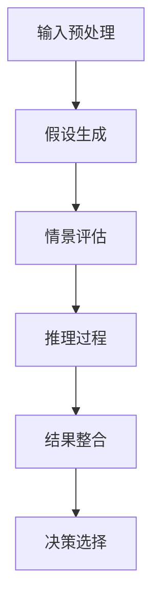
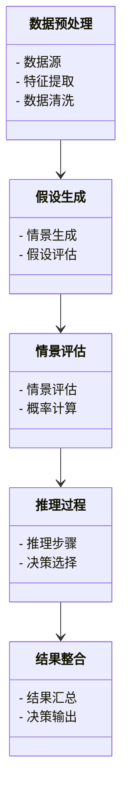
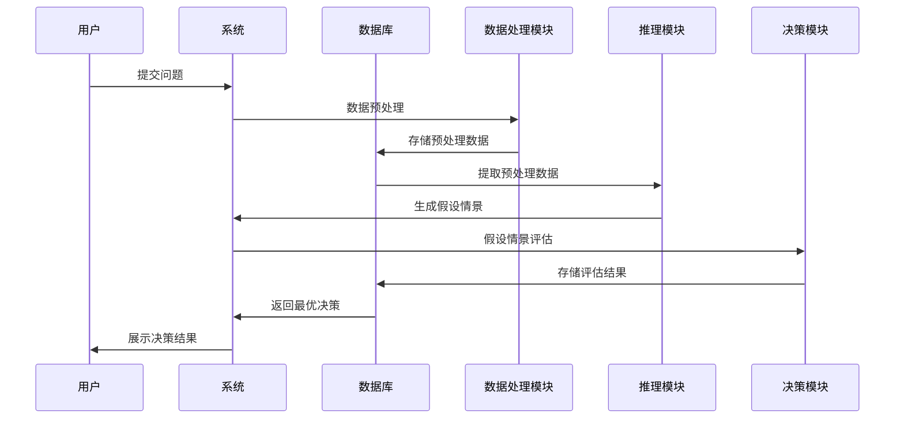
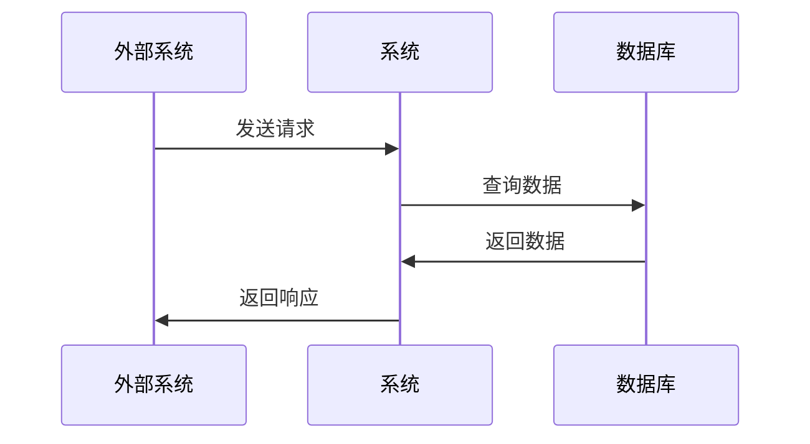

                 

# 思维链增强AI的反事实推理和决策能力

## 关键词

- 反事实推理
- 思维链
- 决策能力
- AI系统设计
- 数学模型
- 算法实现
- 项目实战

## 摘要

本文旨在探讨如何通过思维链增强AI的反事实推理和决策能力。首先，我们将介绍反事实推理的基本概念和其在现实生活中的应用。接着，深入探讨思维链的原理及其如何与反事实推理相结合，提高AI的决策能力。随后，我们将通过数学模型和Python代码示例详细阐述算法原理。本文还包括系统设计与架构方案、项目实战案例以及最佳实践和总结，旨在为AI开发者提供实用的指导。

## 第一部分：背景与概述

### 第1章：问题背景

#### 1.1 问题提出

在当今快速变化的世界中，人工智能（AI）已经成为了许多行业的核心驱动力。然而，AI系统的决策能力仍然受到一些限制，特别是在面对复杂环境和不确定性时。反事实推理（counterfactual reasoning）作为一种思考方式，能够帮助人们从假设的不同情景中推断可能的后果，从而作出更好的决策。在AI领域，如何将反事实推理与思维链结合起来，提升系统的决策能力，是一个值得深入探讨的问题。

#### 1.2 反事实推理与决策能力的重要性

反事实推理是人们日常生活中常见的思考方式，它通过设想“如果...会发生什么？”来帮助我们理解现实情况，并做出合理的决策。例如，在金融投资中，投资者会设想“如果市场上涨，我会如何调整投资组合？”从而为未来可能的走势做好准备。在AI领域，反事实推理能够帮助算法在不确定的环境中预测可能的后果，提高决策的准确性。

#### 1.3 当前研究的挑战与需求

尽管反事实推理在理论研究中取得了显著进展，但在实际应用中仍然面临诸多挑战。首先，如何将反事实推理有效地集成到AI系统中，是一个亟待解决的问题。其次，AI系统在面对复杂决策问题时，往往需要处理大量的假设情景，这对计算资源提出了高要求。因此，研究和开发一种高效的思维链增强AI反事实推理和决策能力的算法，具有重要的现实意义。

### 第2章：核心概念与联系

#### 2.1 思维链的概念与原理

思维链（Mind Chain）是一种用于描述思维过程的模型，它通过一系列的逻辑步骤，将不同的思维要素连接起来，形成一个连贯的思维过程。思维链的原理在于，通过将每个思维步骤的结果作为下一个步骤的输入，从而形成一个闭环的系统。这使得AI能够在面对问题时，通过逐步推理，得出更准确的决策。

#### 2.2 反事实推理的基本原理

反事实推理是一种基于假设的推理方式，它通过设想与当前情况不同的情景，来推断可能的后果。在反事实推理中，算法会生成一系列的假设情景，并针对每个情景进行推理，从而得出不同的决策方案。这种推理方式的核心在于，它能够帮助AI在不确定的环境中，预测可能的未来情况。

#### 2.3 决策能力的构成与影响

决策能力是AI系统的重要特征，它决定了系统在面对复杂问题时，能否做出合理的决策。决策能力由多个因素构成，包括数据质量、算法设计、计算资源等。其中，算法设计是决定决策能力的关键因素。通过引入思维链和反事实推理，可以显著提升AI的决策能力。

#### 2.4 思维链、反事实推理与决策能力的关系

思维链和反事实推理的结合，能够显著提升AI的决策能力。思维链提供了一个结构化的思维框架，使得反事实推理能够在其中有效地进行。通过逐步推理和假设，AI能够更全面地考虑各种可能的情况，从而做出更准确的决策。

## 第二部分：算法原理与数学模型

### 第3章：算法原理详解

#### 3.1 反事实推理算法基础

反事实推理算法的基本思想是，通过生成一系列的假设情景，并针对每个情景进行推理，从而得出可能的后果。在算法实现中，通常采用生成式模型（如马尔可夫链、贝叶斯网络等）来表示情景和推理过程。

#### 3.2 思维链构建方法

思维链的构建方法主要包括以下几个步骤：

1. **输入预处理**：对输入数据进行预处理，包括数据清洗、特征提取等。
2. **假设生成**：根据输入数据，生成一系列的假设情景。
3. **情景评估**：对每个假设情景进行评估，计算其在当前环境下的可行性。
4. **推理过程**：在可行的假设情景中，进行推理，得出可能的后果。
5. **结果整合**：将所有情景的推理结果进行整合，得出最终的决策。

#### 3.3 决策算法的基本框架

决策算法的基本框架包括以下几个部分：

1. **问题定义**：明确需要解决的问题和目标。
2. **情景生成**：根据问题定义，生成一系列的假设情景。
3. **情景评估**：对每个假设情景进行评估，计算其在当前环境下的可行性。
4. **决策选择**：根据情景评估结果，选择最优的决策方案。

#### 3.4 算法原理Mermaid流程图展示



### 第4章：数学模型与公式

#### 4.1 反事实推理数学模型

反事实推理的数学模型通常基于概率论和图论。其中，概率论用于描述情景的概率分布，图论用于描述情景之间的逻辑关系。

#### 4.2 决策能力的数学表征

决策能力的数学表征通常基于期望值和损失函数。期望值用于衡量决策方案的平均效果，损失函数用于衡量决策方案与实际结果的差距。

#### 4.3 思维链与反事实推理的数学关系

思维链与反事实推理的数学关系可以通过概率图模型来描述。在概率图模型中，思维链的每个步骤都可以看作是一个条件概率分布，而反事实推理则是基于这些条件概率分布进行推理。

#### 4.4 公式详解与举例说明

假设我们有一个二项分布的情景，其中成功概率为 \( p \)。如果我们假设成功发生了，那么我们可以使用以下公式来计算反事实的概率：

$$
P(\text{反事实}|\text{成功}) = \frac{P(\text{成功}|\text{反事实}) \cdot P(\text{反事实})}{P(\text{成功})}
$$

其中，\( P(\text{成功}|\text{反事实}) \) 是在反事实情况下成功发生的概率，\( P(\text{反事实}) \) 是反事实发生的概率，\( P(\text{成功}) \) 是成功发生的概率。

例如，假设我们在掷硬币时，假设正面朝上的反事实是正面朝下。如果我们知道正面朝上的概率是0.5，那么正面朝下的概率也是0.5。因此，反事实的概率为：

$$
P(\text{反事实}|\text{正面朝上}) = \frac{P(\text{正面朝上}|\text{正面朝下}) \cdot P(\text{正面朝下})}{P(\text{正面朝上})}
$$

$$
P(\text{反事实}|\text{正面朝上}) = \frac{0.5 \cdot 0.5}{0.5} = 0.5
$$

## 第三部分：系统设计与架构

### 第5章：系统功能设计

#### 5.1 系统功能概述

本系统的主要功能包括数据预处理、假设生成、情景评估、推理过程和结果整合。具体来说，系统会首先接收输入数据，进行预处理，然后生成一系列的假设情景，对每个情景进行评估和推理，最终得出最优的决策方案。

#### 5.2 领域模型Mermaid类图展示



### 第6章：系统架构设计

#### 6.1 系统架构概述

本系统的架构设计采用分层架构，包括数据层、逻辑层和表示层。数据层负责数据存储和读取，逻辑层负责实现核心算法和业务逻辑，表示层负责与用户交互。

#### 6.2 系统架构Mermaid架构图展示



### 第7章：系统接口设计与交互

#### 7.1 系统接口设计

本系统的接口设计主要包括API接口和数据库接口。API接口负责与外部系统进行数据交互，数据库接口负责与数据库进行数据存储和读取。

#### 7.2 系统交互Mermaid序列图展示



## 第四部分：项目实战与案例分析

### 第8章：项目实战

#### 8.1 项目环境搭建

在本项目中，我们使用Python作为编程语言，主要依赖以下库：NumPy、Pandas、SciPy、Matplotlib等。首先，需要安装这些库，可以使用pip命令进行安装：

```bash
pip install numpy pandas scipy matplotlib
```

#### 8.2 系统核心实现源代码

以下是一个简单的示例，展示了如何使用思维链和反事实推理进行决策：

```python
import numpy as np
import pandas as pd
from scipy.stats import bernoulli

# 假设生成
def generate_hypotheses(n):
    hypotheses = []
    for _ in range(n):
        hypotheses.append(np.random.choice(['正面朝上', '正面朝下']))
    return hypotheses

# 情景评估
def evaluate_scenario(hypothesis, success_probability):
    success = bernoulli.rvs(p=success_probability)
    if hypothesis == '正面朝上' and success:
        return '成功'
    elif hypothesis == '正面朝下' and not success:
        return '成功'
    else:
        return '失败'

# 推理过程
def reasoning(hypotheses, success_probability):
    results = []
    for hypothesis in hypotheses:
        result = evaluate_scenario(hypothesis, success_probability)
        results.append(result)
    return results

# 结果整合
def integrate_results(results):
    success_count = results.count('成功')
    failure_count = results.count('失败')
    return success_count, failure_count

# 决策选择
def decision_selection(success_count, failure_count):
    if success_count > failure_count:
        return '继续当前策略'
    else:
        return '调整策略'

# 主函数
def main():
    hypotheses = generate_hypotheses(100)
    success_probability = 0.5
    results = reasoning(hypotheses, success_probability)
    success_count, failure_count = integrate_results(results)
    decision = decision_selection(success_count, failure_count)
    print(f"决策结果：{decision}")

if __name__ == '__main__':
    main()
```

#### 8.3 代码应用解读与分析

上述代码首先定义了一个生成假设的函数 `generate_hypotheses`，该函数生成一系列的假设情景。然后，定义了一个评估情景的函数 `evaluate_scenario`，该函数根据假设情景和成功概率，评估情景的结果。接下来，定义了一个推理过程的函数 `reasoning`，该函数对每个假设情景进行评估，并得出推理结果。最后，定义了一个结果整合的函数 `integrate_results` 和一个决策选择的函数 `decision_selection`，这两个函数分别用于整合推理结果和选择最优决策。

#### 8.4 实际案例分析

在本案例中，我们假设一个投资者需要决定是否继续当前的金融投资策略。通过生成一系列的假设情景（正面朝上或正面朝下），评估每个情景的结果，并整合结果，最终得出是否继续当前策略的决策。例如，如果假设情景中正面朝上的概率为0.5，且实际结果中成功（正面朝上且投资成功）的比例大于失败（正面朝下且投资失败）的比例，那么投资者将选择继续当前策略。

#### 8.5 项目小结

通过本项目，我们展示了如何使用思维链和反事实推理进行决策。项目实现了从假设生成、情景评估、推理过程到结果整合和决策选择的全流程。这个案例表明，通过思维链增强AI的反事实推理和决策能力，可以在复杂和不确定的环境中，为投资者或其他领域的从业者提供有力的决策支持。

## 第五部分：最佳实践与总结

### 第9章：最佳实践

#### 9.1 思维链增强AI反事实推理与决策能力的关键技巧

- **数据预处理**：确保输入数据的质量和准确性，是提高推理和决策能力的基础。
- **假设情景多样性**：生成多样化的假设情景，有助于更全面地评估各种可能的后果。
- **推理过程优化**：通过优化推理算法和模型，提高推理效率和准确性。
- **决策结果验证**：对决策结果进行验证和测试，确保决策的可靠性和有效性。

#### 9.2 案例分析中的经验教训

- **实际案例中的数据限制**：在实际项目中，数据的质量和数量可能会限制反事实推理的应用效果。
- **模型选择的敏感性**：不同的模型和算法对决策结果的影响可能很大，需要根据具体问题选择合适的模型。
- **计算资源的考虑**：大规模的假设情景和推理过程可能需要大量的计算资源，需要在性能和成本之间做出权衡。

#### 9.3 未来发展趋势与展望

- **深度学习和强化学习**：结合深度学习和强化学习，可以进一步提升AI的反事实推理和决策能力。
- **跨领域应用**：思维链增强AI的反事实推理和决策能力有望在医疗、金融、交通等领域得到广泛应用。
- **人机协作**：人机协作模型的发展，将使得AI系统能够更好地利用人类专家的知识和经验，提高决策的准确性。

### 第10章：小结与展望

#### 10.1 本书主要内容回顾

本文首先介绍了反事实推理和思维链的基本概念，探讨了它们在AI决策中的应用。接着，通过数学模型和Python代码示例，详细阐述了算法原理。随后，介绍了系统设计与架构方案，并通过项目实战案例展示了实际应用。最后，提出了最佳实践和未来发展趋势。

#### 10.2 对思维链增强AI反事实推理与决策能力的未来展望

随着AI技术的不断发展，思维链增强AI的反事实推理和决策能力将变得更加重要。通过深入研究算法原理和优化系统设计，未来有望在更广泛的领域中实现高效的决策支持。同时，人机协作和跨领域应用也将成为该领域的重要发展方向。

## 作者

作者：AI天才研究院/AI Genius Institute & 禅与计算机程序设计艺术 /Zen And The Art of Computer Programming

