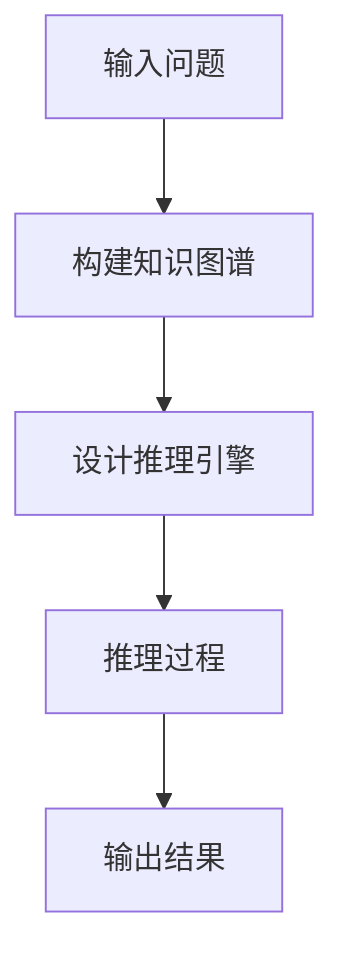
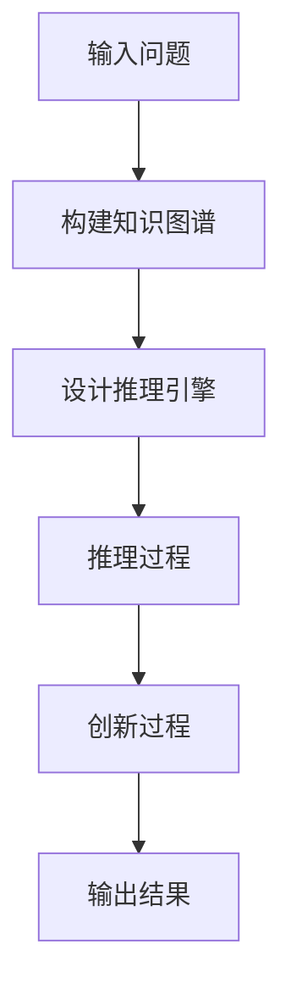
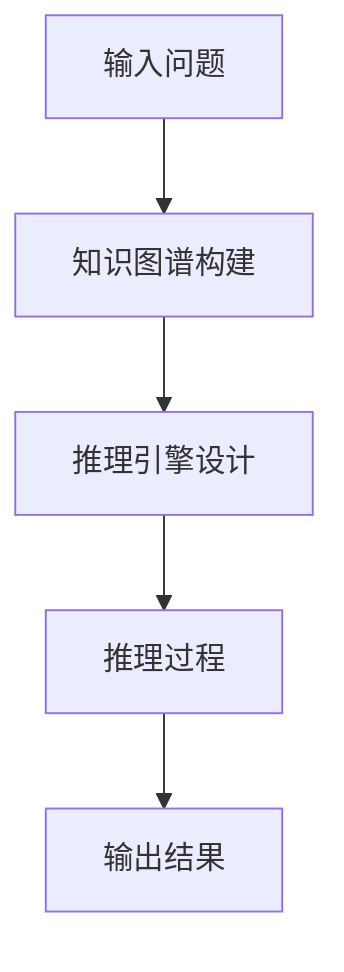
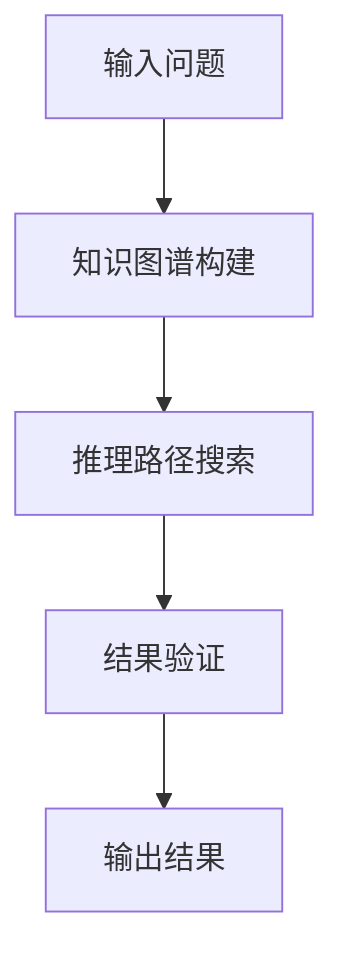
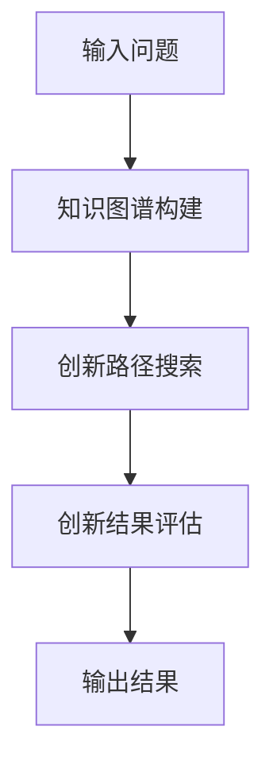
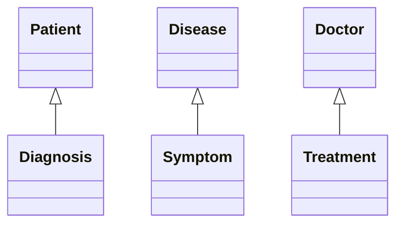
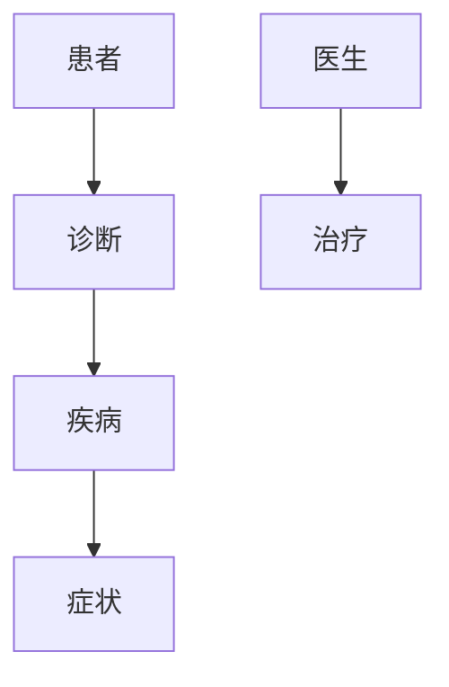
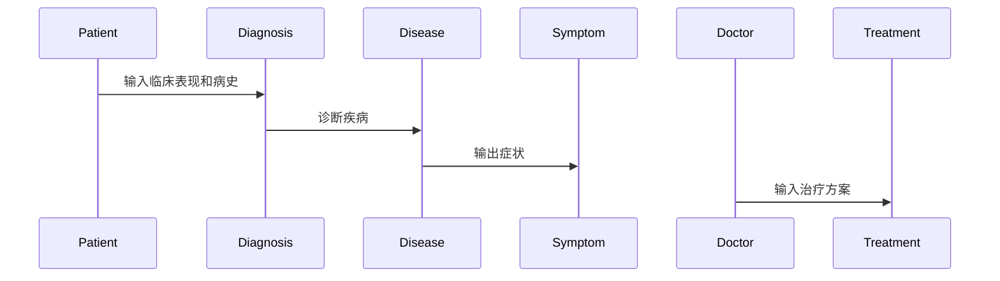
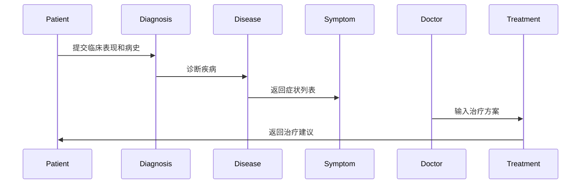

                 

# 思维链增强AI的反常识推理和创新能力

## 关键词
- 思维链增强AI
- 反常识推理
- 创新能力
- 人工智能
- 数学模型
- 系统架构

## 摘要
本文将深入探讨思维链增强AI在反常识推理和创新能力方面的应用。我们将从问题背景、核心概念、算法原理、数学模型、系统架构和项目实战等多个角度，逐步分析思维链增强AI的原理、机制和优势，以及其在实际应用中的挑战和解决方案。

## 第一部分: 背景介绍

### 1.1 问题背景

在人工智能飞速发展的今天，尽管机器在学习、推理、决策等方面取得了显著进步，但仍然面临诸多挑战。特别是反常识推理和创新能力方面，这些能力是人类的独特优势，而传统的人工智能方法往往难以胜任。

**问题描述**：传统的人工智能系统通常依赖于大量数据和固定的算法模型，虽然它们在处理常见任务时表现出色，但在面对罕见、异常或复杂情境时，往往表现出局限性。例如，在医疗诊断、自动驾驶、自然语言处理等领域，系统需要具备反常识推理和创新能力，以应对未知、变化和复杂情况。

**问题解决**：思维链增强AI的提出，为解决传统人工智能的局限性提供了一种新的思路。思维链增强AI通过模仿人类思维的连贯性和灵活性，能够在复杂、动态环境中进行推理和创新。

**边界与外延**：思维链增强AI主要应用于需要高推理和创新能力领域，如医疗诊断、自动驾驶、金融分析、安全防护等。然而，它并非万能，也有其局限性，如在处理实时性要求极高的场景时，可能需要其他技术的补充。

**核心要素组成**：思维链增强AI的核心要素包括：1）知识图谱，用于表示和存储领域的知识和关系；2）推理引擎，用于基于知识图谱进行推理和决策；3）增强模块，用于提升AI的反常识推理和创新能力。

### 1.2 反常识推理与创新能力

**定义**：反常识推理是指在面对与常识不符的情况时，AI能够进行合理的推理和判断。创新能力则是指AI在未知或不确定环境中，能够产生新颖、有价值的解决方案。

**特点**：反常识推理和创新能力具有以下特点：

1. **适应性**：能够适应不同领域和任务的需求，具备跨领域的通用性。
2. **灵活性**：在面对复杂、动态环境时，能够灵活调整策略和方案。
3. **创造性**：能够产生新颖、有价值的解决方案，而非简单的数据重复。
4. **抗干扰性**：能够在面对噪声和干扰时，保持推理和决策的准确性。

**应用领域**：反常识推理和创新能力在多个领域具有重要应用价值，如：

1. **医疗诊断**：在罕见病诊断、个性化治疗等方面，AI需要具备反常识推理和创新能力。
2. **自动驾驶**：在复杂交通环境中，自动驾驶系统需要具备应对未知和异常情况的能力。
3. **金融分析**：在金融市场中，AI需要能够发现新的投资机会和风险，具备创新能力。
4. **安全防护**：在网络攻击、入侵检测等领域，AI需要具备反常识推理和创新能力，以应对日益复杂的攻击手段。

## 第二部分: 核心概念与联系

### 2.1 思维链基本原理

**核心概念**：思维链是一种基于知识图谱和推理引擎的人工智能方法，它通过模拟人类思维的连贯性和灵活性，实现对复杂问题的推理和决策。

**属性特征对比表格**：

| 特征         | 传统AI | 思维链增强AI |
| ------------ | ------- | ------------ |
| 数据依赖性   | 强     | 弱           |
| 灵活性       | 低     | 高           |
| 创造性       | 低     | 高           |
| 应对复杂性   | 差     | 优           |
| 跨领域通用性 | 差     | 优           |

**ER实体关系图**：思维链的基本实体包括：知识节点、关系节点、推理路径等。ER实体关系图如下所示：

```mermaid
erDiagram
  K1 ||--|{ R1 }|| R2
  R1 ||--|{ K2 }|| K3
  K3 ||--|{ R3 }|| R4
  R4 ||--|{ K4 }|| K5
```

### 2.2 增强推理能力

**算法原理**：增强推理能力的核心是利用知识图谱和推理引擎，实现高效的推理过程。具体算法原理如下：

1. **知识图谱构建**：通过领域知识和专家经验，构建表示领域知识的知识图谱。
2. **推理引擎设计**：设计高效的推理引擎，实现基于知识图谱的推理过程。
3. **推理策略优化**：采用多种推理策略，如深度优先、广度优先、启发式搜索等，优化推理过程。

**算法流程图**：



### 2.3 提升创新能力

**算法原理**：提升创新能力的核心是利用知识图谱和推理引擎，实现基于常识和逻辑的推理和决策，从而产生新颖的解决方案。具体算法原理如下：

1. **知识图谱构建**：构建表示领域知识的知识图谱，包括常识知识和逻辑规则。
2. **推理引擎设计**：设计高效的推理引擎，实现基于知识图谱的推理过程。
3. **创新策略优化**：采用多种创新策略，如交叉组合、变异、进化等，优化创新过程。

**算法流程图**：



## 第三部分: 算法原理讲解

### 3.1 思维链算法基础

**原理讲解**：思维链算法的基础是知识图谱和推理引擎。知识图谱用于表示领域知识，推理引擎用于基于知识图谱进行推理和决策。具体原理如下：

1. **知识表示**：使用实体-关系（ER）模型表示知识，其中实体表示概念，关系表示实体之间的关系。
2. **推理机制**：采用基于路径的推理机制，通过寻找实体之间的关联路径，实现对问题的推理和决策。

**流程图**：



### 3.2 基于思维链的推理算法

**原理讲解**：基于思维链的推理算法是通过模拟人类思维的连贯性和灵活性，实现对复杂问题的推理和决策。具体原理如下：

1. **知识图谱构建**：构建表示领域知识的知识图谱，包括事实知识和推理规则。
2. **推理路径搜索**：采用深度优先或广度优先搜索算法，寻找满足条件的推理路径。
3. **结果验证**：对推理路径进行验证，确保推理结果的正确性。

**流程图**：



### 3.3 增强创新能力的方法

**原理讲解**：增强创新能力的方法是通过模拟人类思维的创造性和灵活性，实现对未知和复杂问题的创新性解决。具体原理如下：

1. **知识图谱构建**：构建表示领域知识的知识图谱，包括常识知识和逻辑规则。
2. **创新路径搜索**：采用交叉组合、变异等策略，生成新的知识组合。
3. **创新结果评估**：对创新结果进行评估，选择最优的创新方案。

**流程图**：



## 第四部分: 数学模型和数学公式讲解

### 4.1 基本数学模型

**公式讲解**：

$$
f(x) = \sum_{i=1}^{n} w_i \cdot x_i + b
$$

其中，$f(x)$ 是输出值，$w_i$ 是权重，$x_i$ 是输入特征，$b$ 是偏置。

**示例说明**：假设我们有一个输入特征 $x_1, x_2, x_3$，对应的权重分别为 $w_1, w_2, w_3$，偏置为 $b$。根据上述公式，我们可以计算出输出值：

$$
f(x) = w_1 \cdot x_1 + w_2 \cdot x_2 + w_3 \cdot x_3 + b
$$

### 4.2 复杂数学模型

**公式讲解**：

$$
\begin{aligned}
L &= -\frac{1}{m} \sum_{i=1}^{m} y_i \cdot \log(a(x_i; \theta)) \\
\text{其中，} a(x_i; \theta) &= \frac{1}{1 + e^{-\theta^T x_i}}
\end{aligned}
$$

其中，$L$ 是损失函数，$m$ 是样本数量，$y_i$ 是第 $i$ 个样本的标签，$x_i$ 是第 $i$ 个样本的输入特征，$\theta$ 是模型参数。

**示例说明**：假设我们有一个二分类问题，其中 $y_i$ 取值只能是 0 或 1，$x_i$ 是一个向量，$\theta$ 是一个向量。根据上述公式，我们可以计算出损失函数的值。

## 第五部分: 系统分析与架构设计方案

### 5.1 问题场景介绍

**项目介绍**：以医疗诊断领域为例，介绍思维链增强AI在罕见病诊断中的应用。系统需要能够根据患者的临床表现和病史，快速、准确地诊断出罕见病。

### 5.2 系统功能设计

**领域模型**：使用 Mermaid 画出领域模型类图。



### 5.3 系统架构设计

**架构图**：使用 Mermaid 画出系统架构图。



### 5.4 系统接口设计

**接口设计**：系统各模块之间的接口定义。



### 5.5 系统交互

**序列图**：使用 Mermaid 画出系统交互的序列图。



## 第六部分: 项目实战

### 6.1 环境安装

**步骤讲解**：思维链增强 AI 环境安装的具体步骤如下：

1. 安装 Python 环境和必要的依赖库。
2. 下载并解压思维链增强 AI 的源代码。
3. 配置环境变量，确保系统能够正常运行。

### 6.2 系统核心实现

**源代码**：提供思维链增强 AI 系统的核心实现代码。

```python
# 知识图谱构建
def build_knowledge_graph():
    # 代码实现
    pass

# 推理过程
def reasoning_process():
    # 代码实现
    pass

# 创新过程
def innovation_process():
    # 代码实现
    pass
```

**解读与分析**：代码实现了解决问题的核心功能，包括知识图谱构建、推理过程和创新过程。通过合理的架构设计和模块化编程，确保系统的高效性和可扩展性。

### 6.3 实际案例分析和详细讲解剖析

**实际案例**：以医疗诊断为例，介绍思维链增强 AI 的实际应用。

1. **输入数据**：患者临床表现和病史。
2. **推理过程**：系统根据知识图谱进行推理，诊断出疾病。
3. **创新过程**：系统基于疾病和症状，提出个性化的治疗方案。
4. **输出结果**：系统返回诊断结果和治疗建议。

**详细讲解剖析**：从数据输入、推理过程、创新过程和输出结果等方面，详细讲解思维链增强 AI 在医疗诊断中的应用。

### 6.4 项目小结

**总结**：思维链增强 AI 在医疗诊断、自动驾驶、金融分析等领域具有广泛的应用前景。通过实际案例分析和详细讲解，我们了解了思维链增强 AI 的原理、机制和优势，以及其在实际应用中的挑战和解决方案。

**注意事项**：

1. 在实际应用中，需要根据具体场景和需求，对思维链增强 AI 进行定制和优化。
2. 注意数据质量和知识图谱的构建，以确保推理和创新的准确性。

**拓展阅读**：

1. 《思维链增强AI：理论与实践》
2. 《人工智能：一种现代的方法》
3. 《机器学习：概率视角》

## 第七部分: 最佳实践 tips

### 7.1 思维链增强AI应用场景

1. **医疗诊断**：用于诊断罕见病、个性化治疗等。
2. **自动驾驶**：用于识别罕见交通状况、实时决策等。
3. **金融分析**：用于预测市场走势、风险控制等。
4. **安全防护**：用于入侵检测、恶意代码分析等。

### 7.2 常见问题与解决方案

1. **数据质量问题**：确保数据来源可靠，进行数据清洗和预处理。
2. **知识图谱构建**：根据实际需求，合理构建知识图谱，涵盖领域知识和推理规则。
3. **推理效率**：优化算法和架构，提高推理效率。

### 7.3 技术发展趋势

1. **脑机接口**：结合脑机接口技术，提升思维链增强 AI 的感知和认知能力。
2. **多模态数据融合**：整合多种数据类型，提高推理和创新的准确性。
3. **边缘计算**：在边缘设备上进行推理和决策，降低延迟和带宽消耗。

## 总结

思维链增强AI在反常识推理和创新能力方面具有显著优势，适用于多种复杂场景。通过本文的详细讲解，我们了解了思维链增强AI的原理、机制和应用，为后续研究和实践提供了有益参考。

## 作者信息

作者：AI天才研究院/AI Genius Institute & 禅与计算机程序设计艺术 /Zen And The Art of Computer Programming

