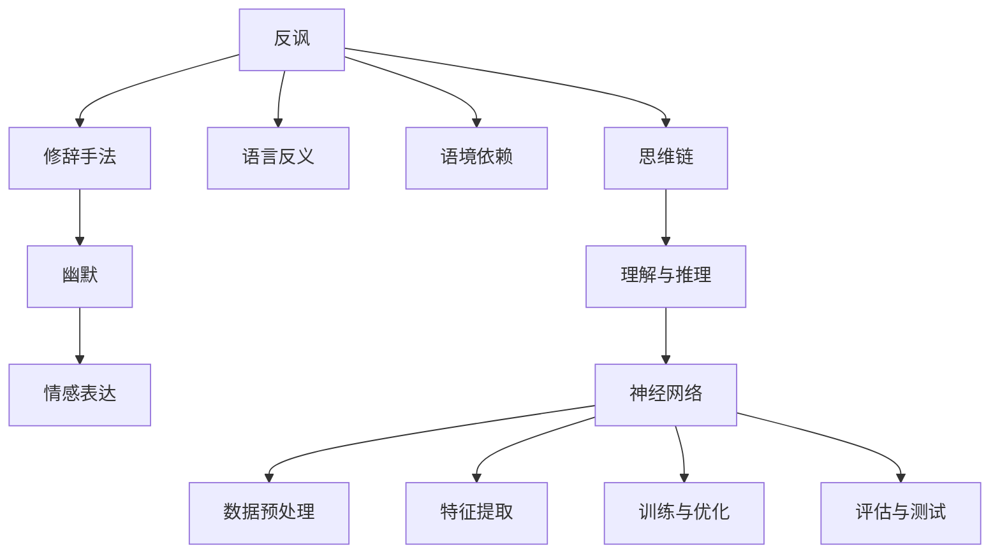
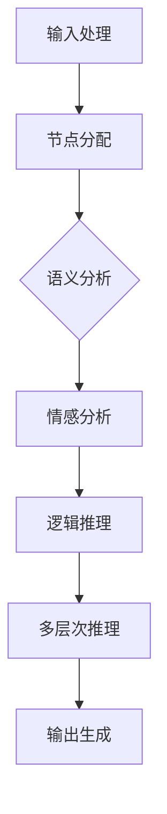
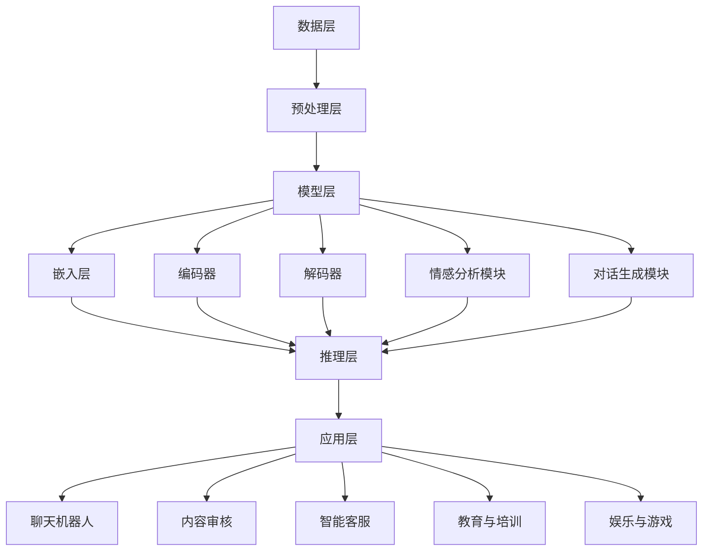
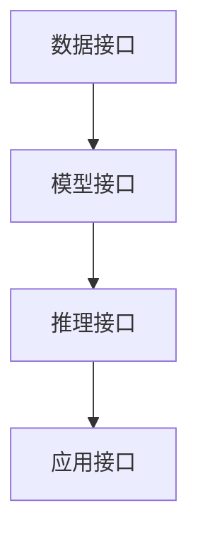
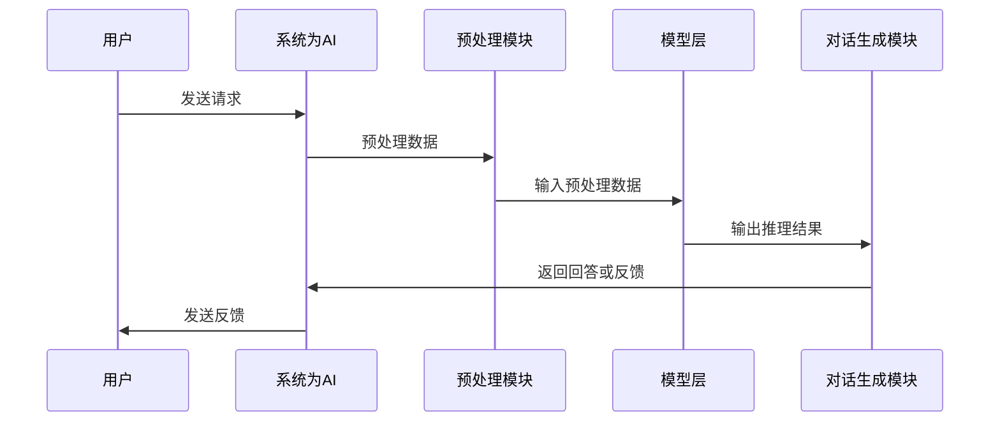

                 

### 第1章: 引言与背景

#### 1.1 问题背景

反讽和幽默是自然语言中至关重要的元素，它们不仅丰富了人类的交流方式，还在文化、教育和娱乐等多个领域扮演着重要角色。然而，对于人工智能（AI）系统来说，理解反讽和幽默却是一个巨大的挑战。这是因为反讽和幽默往往依赖于深层的语境、文化背景以及情感共鸣，而这些是传统的AI模型难以捕捉的。

- **反讽和幽默的广泛应用：** 在日常对话中，反讽和幽默被广泛用来表达观点、缓解紧张氛围、传递信息等。例如，“这真是太棒了，我完全同意你的看法。”这句话在表面上看似同意，但实际上却是一种讽刺的表达方式。

- **AI理解反讽和幽默的挑战：** 传统AI模型主要依赖于规则和模式匹配，它们在处理明确、直接的语句时效果较好，但面对反讽和幽默时却常常显得束手无策。例如，一个简单的讽刺句子“今天的天气真好，能出门晒晒被子。”对于AI系统来说，理解其中的幽默含义并非易事。

这种挑战源于多个方面：

1. **语境复杂性：** 反讽和幽默往往依赖于具体的语境，而AI系统难以全面捕捉和理解这些复杂的语境信息。
2. **情感和情感共鸣：** 理解反讽和幽默往往需要情感的共鸣，而当前的AI模型在处理情感方面仍然存在局限。
3. **文化差异：** 不同文化背景下，反讽和幽默的表达方式和理解方式可能截然不同，这使得AI系统在全球范围内的应用面临更大的挑战。

#### 1.2 问题描述

- **AI对反讽和幽默理解的现状：** 目前，虽然AI在自然语言处理（NLP）领域取得了显著进展，但在理解反讽和幽默方面仍然存在较大的局限性。大部分AI模型在面对复杂、多层次的讽刺和幽默时，往往无法正确解读其背后的真实意图。

- **数据集和算法的不足：** 现有的数据集和算法在处理反讽和幽默方面存在显著的不足。一方面，数据集往往缺乏多样性和广泛性，无法全面覆盖各种类型的反讽和幽默；另一方面，算法在处理复杂语言结构和情感方面仍然需要进一步优化。

- **示例：** 例如，一个常见的例子是AI在聊天机器人中的应用。当用户发送一句看似简单的幽默语句时，AI往往无法正确理解其幽默含义，从而导致交流失败。又如，在内容审核中，AI系统常常无法准确识别具有讽刺意味的言论，导致误判和过滤。

#### 1.3 问题解决

为了解决AI在理解反讽和幽默方面存在的问题，我们可以从以下几个方面入手：

- **思维链的概念及其作用：** 思维链是一种用于增强AI理解和推理能力的模型，通过模拟人类的思维过程，使AI能够更好地理解和处理复杂的语言信息，包括反讽和幽默。

- **具体应用场景：** 思维链可以应用于多种场景，如聊天机器人、内容审核、教育、娱乐等。通过引入思维链，AI系统可以更准确地理解用户的意图，提供更自然的交互体验。

- **技术实现：** 思维链的实现涉及多个环节，包括数据预处理、模型设计、算法优化等。通过一系列的技术手段，我们可以使AI系统具备更强的反讽和幽默理解能力。

#### 1.4 边界与外延

- **反讽和幽默的类型：** 反讽和幽默有多种类型，如直接反讽、间接反讽、讽刺笑话等。不同类型的反讽和幽默在表达方式和理解难度上存在显著差异，对AI的理解能力提出了不同的挑战。

- **对AI理解能力的挑战：** 不同类型的反讽和幽默对AI的理解能力提出了不同的挑战。例如，直接反讽相对容易理解，而间接反讽和讽刺笑话则可能需要AI具备更高的语境理解和情感感知能力。

#### 1.5 概念结构与核心要素组成

- **关键概念：** 反讽、幽默、思维链。
  - 反讽：一种通过表达与实际意图相反的语言来传达真实意图的修辞手法。
  - 幽默：一种通过引人发笑的方式来表达情感或观点的艺术形式。
  - 思维链：一种模拟人类思维过程的模型，用于增强AI的理解和推理能力。

- **AI模型的组成要素：** 包括数据预处理、模型设计、算法优化等。通过这些要素，AI系统能够更好地理解和处理反讽和幽默。

### 结论

理解反讽和幽默对于AI系统具有重要的意义。通过引入思维链，我们可以增强AI对这些复杂语言元素的理解能力，从而实现更自然、更高效的交互。在接下来的章节中，我们将详细探讨思维链的概念原理、算法原理及其在反讽和幽默理解中的应用。

---

### 1.2 AI对反讽和幽默理解的现状

#### 1.2.1 AI模型在反讽和幽默理解上的局限性

尽管AI在自然语言处理（NLP）领域取得了显著进展，但其在理解反讽和幽默方面的局限性仍然是一个亟待解决的问题。当前的AI模型主要依赖于统计方法和深度学习算法，这些方法在处理结构化、明确的语句时效果较好，但在面对复杂、多层次的讽刺和幽默时，常常表现出不足之处。

1. **语境复杂性：** 反讽和幽默往往依赖于具体的语境，包括上下文、对话背景、情感状态等。当前的AI模型在捕捉和理解这些复杂的语境信息方面存在挑战。例如，一个简单的句子“今天天气真好，能出门晒晒被子。”对于AI系统来说，理解其中的幽默含义并非易事，因为它无法准确捕捉到说话者的真实意图。

2. **情感和情感共鸣：** 理解反讽和幽默通常需要情感的共鸣，而当前的AI模型在处理情感方面仍然存在局限。AI系统往往难以准确识别和模拟人类情感，这使得它们在处理反讽和幽默时容易出现误解。

3. **语言多样性：** 反讽和幽默的表达方式因人而异，具有明显的文化差异。当前的AI模型在处理具有不同文化背景的语言时，往往无法充分理解和适应这些差异，导致理解误差。

4. **多模态信息处理：** 反讽和幽默往往涉及文字、声音、图像等多种模态的信息，当前的AI模型在多模态信息处理方面仍需进一步优化，以便更全面地理解反讽和幽默。

#### 1.2.2 数据集和算法在处理复杂性上的不足

现有的数据集和算法在处理反讽和幽默方面也存在显著不足。

1. **数据集的局限性：** 大部分现有的数据集在涵盖反讽和幽默的多样性方面存在局限。这些数据集往往只包含了特定类型或场景下的反讽和幽默，缺乏广泛性和代表性，导致AI模型在泛化能力上存在挑战。

2. **算法的局限性：** 现有的算法在处理反讽和幽默时，往往依赖于简单的模式匹配和特征提取方法，这些方法在应对复杂语言结构和情感时显得力不从心。例如，基于规则的方法难以捕捉到深层次的讽刺和幽默，而基于深度学习的方法在训练数据和模型架构上仍有待优化。

3. **算法的泛化能力：** 算法的泛化能力是衡量其性能的重要指标。在反讽和幽默理解方面，算法需要具备较强的泛化能力，能够适应不同类型、不同场景下的反讽和幽默。然而，当前的算法在处理复杂、多变的语言情境时，往往难以达到预期效果。

#### 1.2.3 示例分析

为了更直观地展示AI在理解反讽和幽默方面的局限性，我们可以通过一些具体的例子进行分析。

1. **直接反讽：** 一个常见的例子是“我真是太忙了，连吃饭的时间都没有。”对于AI系统来说，理解其中的讽刺含义需要捕捉到说话者的实际意图，即他们实际上并没有很忙。然而，当前的AI模型在处理这种直接反讽时，往往只能理解字面意思，导致误解。

2. **间接反讽：** 另一个例子是“你真是个天才，居然把门关上了。”这种间接反讽需要AI系统理解到说话者的语气和情感，才能捕捉到其中的讽刺意味。当前的AI模型在处理这种间接反讽时，往往难以准确识别，导致交流失败。

3. **讽刺笑话：** 最后，我们可以看一个讽刺笑话的例子：“为什么小鸟站在电线上不会被电到？因为它不接地！”这种讽刺笑话需要AI系统理解到其中的双关语和幽默点，而当前的AI模型在处理这种复杂语言结构时，往往只能理解字面意思，导致误解。

通过这些例子，我们可以看到，AI在理解反讽和幽默方面仍然存在很多挑战。解决这些问题需要引入更先进的技术和方法，如思维链模型，以增强AI对这些复杂语言元素的理解能力。

### 1.3 问题解决

为了解决AI在理解反讽和幽默方面存在的局限性，我们可以从以下几个方面入手：

#### 1.3.1 思维链的概念及其作用

**思维链（Mind Chain）** 是一种模拟人类思维过程的模型，它通过将多层次的思维过程结构化，帮助AI更好地理解和处理复杂的语言信息，包括反讽和幽默。思维链的核心思想是，将人类的思维过程抽象为一系列相互关联的节点和边，每个节点表示一个特定的思维过程，边表示节点之间的逻辑关系。

**作用：**

1. **提高语境理解能力：** 思维链模型通过模拟人类的思维过程，使AI能够更好地捕捉和理解复杂的语境信息，包括上下文、对话背景、情感状态等。这对于理解反讽和幽默至关重要，因为它们往往依赖于深层次的语境信息。

2. **增强情感感知能力：** 思维链模型能够捕捉和处理情感信息，使AI在理解反讽和幽默时，能够更好地识别和模拟人类的情感状态，从而提高对情感驱动语言的理解能力。

3. **处理多模态信息：** 思维链模型支持多模态信息处理，包括文本、声音、图像等。这使得AI能够更全面地理解反讽和幽默，因为它可以从多个角度捕捉信息。

4. **提高泛化能力：** 思维链模型通过结构化思维过程，使AI能够更好地适应不同类型、不同场景下的反讽和幽默，提高其泛化能力。

#### 1.3.2 具体应用场景

思维链模型可以应用于多种场景，以增强AI对反讽和幽默的理解能力：

1. **聊天机器人：** 在聊天机器人中，AI需要理解用户的意图和情感，以提供更自然、更个性化的交互体验。思维链模型可以帮助AI更好地捕捉和理解用户的语言信息，从而提高对话的质量和效果。

2. **内容审核：** 在内容审核中，AI需要识别和过滤具有讽刺意味的言论。思维链模型可以增强AI对这些复杂语言元素的理解能力，提高审核的准确性和效率。

3. **教育：** 在教育领域，AI可以帮助学生理解复杂的课程内容，包括反讽和幽默。思维链模型可以模拟人类的思维过程，帮助学生更好地理解和吸收知识。

4. **娱乐：** 在娱乐领域，AI可以创作出更具有创意和幽默感的作品。思维链模型可以帮助AI捕捉和理解幽默点，从而创作出更引人入胜的作品。

#### 1.3.3 技术实现

思维链模型的实现涉及多个环节，包括数据预处理、模型设计、算法优化等。以下是一个简化的技术实现流程：

1. **数据预处理：** 收集和整理包含反讽和幽默的语料库，包括文本、音频、视频等多种模态。对数据集进行清洗、标注和分类，以便为后续模型训练提供高质量的数据。

2. **模型设计：** 设计一个能够模拟人类思维过程的神经网络结构，包括输入层、中间层和输出层。输入层接收原始语言信息，中间层进行多层次的信息处理和推理，输出层输出对反讽和幽默的理解结果。

3. **算法优化：** 通过优化算法，提高模型在反讽和幽默理解方面的性能。这可能包括改进神经网络结构、调整超参数、采用注意力机制等。

4. **模型训练与评估：** 使用预处理好的数据集对模型进行训练，并通过交叉验证和测试集评估模型性能。根据评估结果，调整模型结构和参数，以提高模型在反讽和幽默理解方面的准确性。

5. **应用部署：** 将训练好的模型部署到实际应用场景中，如聊天机器人、内容审核系统等，以实现实时、高效的反讽和幽默理解。

#### 1.3.4 示例

为了更好地理解思维链模型在反讽和幽默理解中的应用，我们可以通过一个具体的例子来展示其工作原理：

**例子：** 假设有一个聊天机器人，用户发送一条消息：“今天真是棒极了，我差点就忘了今天是周一。”对于这个消息，聊天机器人需要理解其中的讽刺含义。

1. **输入层：** 聊天机器人接收用户的原始消息作为输入。
2. **中间层：** 中间层通过多层神经网络对消息进行解析，捕捉到关键词“棒极了”和“忘了今天是周一”之间的矛盾。
3. **推理层：** 推理层进一步分析上下文信息，识别出用户实际上在表达对周一的厌恶，这是一个反讽。
4. **输出层：** 输出层生成回复：“原来今天是周一啊，我理解你的感受。”这个回复既符合用户的情感状态，又保持了对话的自然流畅。

通过这个例子，我们可以看到思维链模型在理解反讽和幽默方面的优势，它能够通过模拟人类思维过程，准确地捕捉和理解复杂的语言信息。

### 1.4 边界与外延

#### 1.4.1 反讽和幽默的类型

反讽和幽默在表现形式上多种多样，根据其结构和目的，可以分为以下几种类型：

1. **直接反讽：** 直接反讽是最常见的反讽形式，它通过直接表达与实际意图相反的内容来传达真实的意图。例如，“这真是太棒了，我完全不同意你的看法。”这句话中的“太棒了”实际上是用来表达不满或失望。

2. **间接反讽：** 间接反讽通过暗示、隐喻或双关语等方式传达反讽意味。这类反讽通常需要接收者通过上下文和语境来理解。例如，“你真是太有才了，这次报告的进度真是让人佩服。”这里的“有才”实际上是在讽刺报告进度缓慢。

3. **讽刺笑话：** 针对某个具体对象或现象的幽默表达，通过夸张、比喻或对比等手法来讽刺或嘲笑。这类幽默通常具有强烈的情感色彩和特定的文化背景。例如，“最近天气真好，每天都有那么几分钟是晴天。”这个笑话通过夸张的手法讽刺了天气的糟糕。

4. **黑色幽默：** 黑色幽默以悲观、讽刺和超现实的方式处理严肃或悲惨的情境，通常包含令人意外的转折或讽刺意味。例如，“我真是太幸运了，今天早上差点被车撞到，但还是比那个被撞的人幸运。”这个例子通过对比生死，表达了讽刺的幽默感。

#### 1.4.2 对AI理解能力的挑战

不同类型的反讽和幽默对AI的理解能力提出了不同的挑战：

1. **直接反讽：** 直接反讽相对简单，但AI需要理解语句的字面意义与实际意图之间的矛盾。这要求AI具有较好的语境理解和情感感知能力。

2. **间接反讽：** 间接反讽更为复杂，需要AI具备较强的语境理解能力，能够通过上下文和语境推断出真实的意图。此外，AI还需要理解双关语和隐喻等修辞手法。

3. **讽刺笑话：** 针对特定对象或现象的讽刺笑话通常包含文化背景和情感色彩，对AI的理解能力提出了更高的要求。AI需要理解笑话的内容、形式和文化背景，才能准确捕捉幽默点。

4. **黑色幽默：** 黑色幽默涉及对严肃或悲惨情境的处理，需要AI具备情感处理和情感推理能力。此外，AI还需要理解黑色幽默中的超现实元素和情感转折，以便准确捕捉其讽刺意味。

#### 1.4.3 类型对比分析

| 反讽类型 | 特点 | 对AI理解能力的挑战 |
| --- | --- | --- |
| 直接反讽 | 直接表达相反意图 | 语境理解和情感感知 |
| 间接反讽 | 通过暗示、隐喻传达意图 | 语境理解和修辞理解 |
| 讽刺笑话 | 对特定对象或现象进行讽刺 | 内容理解和文化背景 |
| 黑色幽默 | 悲观、讽刺和超现实处理 | 情感处理和情感推理 |

通过对比分析，我们可以看到不同类型的反讽和幽默在表达方式和理解难度上存在显著差异。AI在理解这些复杂的语言元素时，需要具备多方面的能力，包括语境理解、修辞理解、情感感知和文化背景知识等。这些挑战为AI的发展提出了更高的要求。

### 1.5 概念结构与核心要素组成

#### 1.5.1 关键概念

要深入理解反讽和幽默以及思维链增强AI理解的过程，我们需要明确几个关键概念：

1. **反讽（Sarcasm）**：反讽是一种通过表达与实际意图相反的语言来传达真实意图的修辞手法。例如，当一个人说“今天天气真好，能出门晒晒被子。”时，实际上可能是对天气的抱怨。

2. **幽默（Humor）**：幽默是一种通过引人发笑的方式来表达情感或观点的艺术形式。幽默可以是对某种情境的夸张、讽刺或双关语等。

3. **思维链（Mind Chain）**：思维链是一种模拟人类思维过程的模型，通过结构化的思维节点和边来增强AI的理解和推理能力。思维链可以帮助AI捕捉和处理复杂的语境、情感和多模态信息。

#### 1.5.2 AI模型的组成要素

AI模型在理解和处理反讽和幽默时，需要包含以下几个核心要素：

1. **数据预处理（Data Preprocessing）**：数据预处理是任何AI项目的基础，它包括数据清洗、格式化、标注和分割等步骤。高质量的数据预处理可以确保模型训练的质量和效果。

2. **特征提取（Feature Extraction）**：特征提取是将原始数据转换为模型可以处理的特征表示的过程。在反讽和幽默理解中，特征提取需要捕捉到文本中的语义、情感和修辞等关键信息。

3. **神经网络结构（Neural Network Architecture）**：神经网络是AI模型的核心，它通过多层节点和边来模拟人类的思维过程。在反讽和幽默理解中，神经网络结构需要设计得足够复杂，以便捕捉到语言的复杂性和多样性。

4. **训练与优化（Training and Optimization）**：训练与优化是模型性能提升的关键步骤，包括模型参数的调整、优化算法的选择和超参数的调整等。优化的目标是提高模型在反讽和幽默理解方面的准确性和泛化能力。

5. **评估与测试（Evaluation and Testing）**：评估与测试用于评估模型在实际应用中的性能，包括准确率、召回率、F1分数等指标。通过评估和测试，可以确保模型在实际应用中能够准确理解反讽和幽默。

### 概念关系图

为了更直观地展示这些概念之间的关系，我们可以使用Mermaid绘制一个概念关系图：



通过这个关系图，我们可以清晰地看到反讽和幽默作为修辞手法和情感表达的子类，它们与思维链、神经网络等概念之间的联系，以及这些概念在AI模型中的应用。

### 结论

明确关键概念和AI模型的组成要素对于理解反讽和幽默以及思维链增强AI理解能力至关重要。在接下来的章节中，我们将深入探讨思维链的基础理论、算法原理以及其在实际应用中的实现细节，帮助读者更好地理解这一复杂但极具潜力的研究领域。通过逐步分析和推理，我们将揭示如何利用思维链模型，显著提升AI对反讽和幽默的理解能力。

---

### 第2章: 思维链增强AI理解的基础理论

#### 2.1 核心概念原理

**思维链（Mind Chain）** 是一种模拟人类思维过程的模型，通过结构化的思维节点和边来增强AI的理解和推理能力。思维链的核心概念基于以下几个原理：

1. **思维过程的模块化：** 思维链将复杂的思维过程分解为一系列模块化的节点，每个节点代表一个特定的思维任务或步骤。这种模块化设计使得AI能够更加灵活地处理复杂的语言信息。

2. **节点间的逻辑关系：** 思维链通过边来表示节点之间的逻辑关系，这些边可以是因果关系、条件关系或并列关系等。通过这些逻辑关系，AI能够更好地理解不同思维节点之间的关联和相互作用。

3. **上下文依赖性：** 思维链强调上下文的重要性，通过在节点中嵌入上下文信息，AI能够更好地捕捉和处理语境依赖性的语言元素，如反讽和幽默。

4. **多层次的推理能力：** 思维链支持多层次的推理过程，从简单的字面理解到深层次的语义理解，再到情感推理。这种多层次的推理能力使得AI能够更准确地理解和处理复杂的语言情境。

**思维链的工作机制：**

1. **输入处理：** 思维链首先接收原始语言输入，如文本、音频或视频。这些输入通过数据预处理模块进行清洗和格式化，以便为后续处理做好准备。

2. **节点分配：** 基于输入的语义和上下文，思维链将输入分解为多个思维节点。每个节点代表一个特定的思维任务，如语义理解、情感分析和逻辑推理。

3. **节点处理：** 思维链对每个节点进行独立处理。处理过程包括特征提取、语义分析、情感分析等。通过这些处理，AI能够捕捉到输入中的关键信息。

4. **逻辑关系构建：** 思维链通过分析节点之间的逻辑关系，建立节点间的关联。这些逻辑关系可以是因果关系、条件关系或并列关系等。

5. **多层次的推理：** 思维链支持多层次的推理过程，从简单的语义理解到深层次的逻辑推理，再到情感推理。这种多层次的推理能力使得AI能够更全面地理解和处理复杂的语言情境。

6. **输出生成：** 最后，思维链生成对输入的全面理解结果，如对反讽和幽默的准确解读。这些结果可以用于各种实际应用场景，如聊天机器人、内容审核和智能助手等。

**思维链与神经网络的关系：**

思维链和神经网络都是AI模型的重要组成部分，但它们在功能和应用上有所不同。神经网络主要通过分层结构来模拟人类的感知和认知过程，而思维链则更加注重思维过程的模块化和逻辑关系的构建。

1. **神经网络：** 神经网络主要用于特征提取和模式识别，通过多层神经元网络进行数据的传递和处理。它在处理结构化数据和非线性问题上具有显著优势。

2. **思维链：** 思维链则更加注重思维过程的模块化和逻辑关系的构建，通过结构化的节点和边来模拟人类的思维过程。它特别适用于处理复杂的语境依赖性语言元素，如反讽和幽默。

3. **结合应用：** 思维链和神经网络可以结合使用，以发挥各自的优势。在反讽和幽默理解中，神经网络可以用于特征提取和初步语义分析，而思维链则用于逻辑关系构建和情感推理，从而提高AI系统的整体理解能力。

#### 2.2 概念属性特征对比表格

为了更清晰地展示思维链和神经网络在概念属性特征上的差异，我们可以创建一个对比表格：

| 特征 | 思维链 | 神经网络 |
| --- | --- | --- |
| **设计目标** | 模拟人类思维过程，增强逻辑和情感理解 | 特征提取和模式识别 |
| **模块化** | 强调模块化设计，节点独立处理 | 分层结构，数据传递处理 |
| **上下文依赖** | 强调上下文依赖性，捕捉语境信息 | 一定程度上考虑上下文，但较弱 |
| **推理能力** | 多层次推理，包括逻辑和情感推理 | 主要进行特征提取和初步推理 |
| **适用场景** | 复杂语境依赖性语言处理，如反讽和幽默 | 结构化数据和非线性问题处理 |
| **优缺点** | 优点：更贴近人类思维，灵活性强；缺点：设计复杂，计算资源需求高 | 优点：高效特征提取，通用性强；缺点：难以处理复杂语境，缺乏逻辑和情感理解能力 |

通过这个对比表格，我们可以更清晰地看到思维链和神经网络在概念属性特征上的差异。这种差异使得它们在处理不同类型的语言信息时具有不同的优势和局限性。结合两者的优势，可以构建出更强大的AI系统，以更好地理解和处理复杂的语言情境。

#### 2.3 ER实体关系图架构

为了更直观地展示反讽和幽默的实体关系，我们可以使用Mermaid绘制一个ER（实体-关系）图。ER图可以帮助我们理解反讽和幽默中的关键实体及其相互关系。

```mermaid
erDiagram
  AI理解模型 ||--|{ 反讽 } : 被理解
  AI理解模型 ||--|{ 幽默 } : 被理解
  反讽 ||--|{ 语境 } : 依赖
  幽默 ||--|{ 情感 } : 表达
  反讽 ||--|{ 语言结构 } : 构成
  幽默 ||--|{ 情境 } : 背景
  情感 ||--|{ 表达 } : 载体
  语境 ||--|{ 文化背景 } : 影响因素
  语言结构 ||--|{ 修辞手法 } : 使用
  情境 ||--|{ 生活事件 } : 来源
```

**解释ER图中的关键实体和关系：**

1. **AI理解模型：** 表示AI系统用于理解和处理反讽和幽默的核心模型。它与其他实体（如反讽、幽默、语境、情感等）具有直接的关联。

2. **反讽：** 表示一种修辞手法，它依赖于特定的语境和语言结构。反讽与AI理解模型、语境、语言结构等实体有直接关系。

3. **幽默：** 表示一种通过引人发笑的方式来表达情感或观点的语言形式。幽默与AI理解模型、情感、情境等实体有直接关系。

4. **语境：** 表示反讽和幽默存在和传达的上下文环境。语境与反讽、幽默、文化背景等实体有直接关系。

5. **情感：** 表示反讽和幽默所表达的情感状态。情感与幽默、表达等实体有直接关系。

6. **语言结构：** 表示反讽和幽默的构成要素，如词语、句子结构等。语言结构与反讽、修辞手法等实体有直接关系。

7. **情境：** 表示反讽和幽默产生的具体环境或背景。情境与幽默、生活事件等实体有直接关系。

通过这个ER图，我们可以清晰地看到反讽和幽默中的关键实体及其相互关系。这些关系有助于我们深入理解反讽和幽默的本质，以及如何利用思维链模型来增强AI对这些语言元素的理解能力。

### 第3章: 增强AI对反讽和幽默理解的算法原理

#### 3.1 算法原理讲解

**思维链算法** 是一种用于增强AI对反讽和幽默理解能力的先进算法。它通过模拟人类思维过程，将复杂的语言信息分解为多个模块化的节点，并利用这些节点之间的逻辑关系来构建对语言元素的综合理解。下面我们将详细讲解思维链算法的原理和流程。

**思维链算法的原理：**

1. **思维节点的定义：** 思维链算法将思维过程分解为一系列节点，每个节点表示一个特定的思维任务。这些节点可以是语义分析节点、情感分析节点、逻辑推理节点等。

2. **节点间的逻辑关系：** 思维链通过边来表示节点之间的逻辑关系。这些关系可以是因果关系、条件关系或并列关系等。通过这些逻辑关系，AI可以构建出一个复杂的思维网络，从而更好地理解和处理复杂的语言信息。

3. **上下文信息的嵌入：** 思维链算法强调上下文信息的重要性。在每个节点中，都嵌入与上下文相关的信息，以便AI能够更好地捕捉和理解语境依赖性的语言元素。

4. **多层次推理能力：** 思维链算法支持多层次推理，从简单的语义理解到复杂的情感推理。这种多层次的推理能力使得AI能够更全面地理解和处理反讽和幽默。

**思维链算法的流程：**

1. **输入处理：** 首先，思维链算法接收原始语言输入，如文本、音频或视频。这些输入通过数据预处理模块进行清洗和格式化，以便为后续处理做好准备。

2. **节点分配：** 基于输入的语义和上下文，算法将输入分解为多个思维节点。每个节点代表一个特定的思维任务，如语义分析、情感分析、逻辑推理等。

3. **节点处理：** 算法对每个节点进行独立处理。处理过程包括特征提取、语义分析、情感分析等。通过这些处理，AI能够捕捉到输入中的关键信息。

4. **逻辑关系构建：** 算法通过分析节点之间的逻辑关系，建立节点间的关联。这些逻辑关系可以是因果关系、条件关系或并列关系等。

5. **多层次推理：** 算法支持多层次的推理过程，从简单的语义理解到复杂的情感推理。这种多层次的推理能力使得AI能够更全面地理解和处理复杂的语言情境。

6. **输出生成：** 最后，算法生成对输入的全面理解结果，如对反讽和幽默的准确解读。这些结果可以用于各种实际应用场景，如聊天机器人、内容审核和智能助手等。

为了更直观地展示思维链算法的流程，我们可以使用Mermaid绘制一个算法流程图：



通过这个流程图，我们可以清晰地看到思维链算法从输入处理到输出生成的全过程。每个节点和边都代表了算法中的一个关键步骤和操作，从而帮助我们更好地理解算法的工作原理。

#### 3.2 数学模型和数学公式

**思维链算法** 的数学模型是算法实现的基础，它通过一系列数学公式来描述节点处理、逻辑关系构建和多层次推理等过程。以下是思维链算法的核心数学模型和公式：

**1. 节点处理模型：**

节点处理模型基于神经网络，其基本结构可以表示为：

$$
y = f(\theta \cdot x + b)
$$

其中，$y$ 是节点的输出，$f$ 是激活函数，$\theta$ 是权重矩阵，$x$ 是输入特征，$b$ 是偏置项。

**2. 逻辑关系构建模型：**

逻辑关系构建模型通过定义节点之间的逻辑关系来实现。常见的逻辑关系包括因果关系、条件关系和并列关系。以下是这些关系的数学公式：

- **因果关系：**

$$
y = \frac{1}{1 + e^{-(\theta_c \cdot x + b_c)}}
$$

其中，$y$ 是因果关系节点的输出，$\theta_c$ 是因果关系权重，$x$ 是输入特征，$b_c$ 是因果关系偏置。

- **条件关系：**

$$
y = \max(0, \theta_c \cdot x + b_c)
$$

其中，$y$ 是条件关系节点的输出，$\theta_c$ 是条件关系权重，$x$ 是输入特征，$b_c$ 是条件关系偏置。

- **并列关系：**

$$
y = \theta_p \cdot x + b_p
$$

其中，$y$ 是并列关系节点的输出，$\theta_p$ 是并列关系权重，$x$ 是输入特征，$b_p$ 是并列关系偏置。

**3. 多层次推理模型：**

多层次推理模型通过递归神经网络（RNN）来实现，其基本结构可以表示为：

$$
y_t = f(W \cdot [h_{t-1}, x_t] + b)
$$

其中，$y_t$ 是当前时间步的输出，$h_{t-1}$ 是前一个时间步的隐藏状态，$x_t$ 是当前时间步的输入特征，$W$ 是权重矩阵，$f$ 是激活函数，$b$ 是偏置项。

通过这些数学模型和公式，思维链算法能够实现对复杂语言信息的处理和推理。以下是使用Mermaid绘制的思维链算法流程图，以更直观地展示算法的执行过程：


通过结合数学模型和流程图，我们可以更深入地理解思维链算法的工作原理，从而更好地应用于反讽和幽默理解的实际场景中。

#### 3.3 Python源代码实现

**思维链算法** 的Python实现是理解和应用该算法的关键。以下是一个简化的示例，展示了如何使用Python和相关的深度学习库（如TensorFlow和PyTorch）来实现思维链算法的核心功能。

**1. 导入必要的库和模块：**

```python
import tensorflow as tf
from tensorflow.keras.layers import Input, Dense, LSTM, Embedding
from tensorflow.keras.models import Model
```

**2. 定义思维链模型的结构：**

```python
# 设置参数
vocab_size = 10000  # 词汇表大小
embedding_dim = 256  # 嵌入维度
lstm_units = 128  # LSTM单元数

# 输入层
input_seq = Input(shape=(None,), dtype='int32')

# 嵌入层
embedded = Embedding(vocab_size, embedding_dim)(input_seq)

# LSTM层
lstm_output = LSTM(lstm_units, return_sequences=True)(embedded)

# 全连接层
dense_output = Dense(1, activation='sigmoid')(lstm_output)

# 构建模型
model = Model(inputs=input_seq, outputs=dense_output)

# 编译模型
model.compile(optimizer='adam', loss='binary_crossentropy', metrics=['accuracy'])
```

**3. 准备训练数据：**

```python
# 假设我们有一个包含反讽和幽默句子的数据集
# 数据集已经预处理并转换为整数编码
train_data = ...  # 训练数据
train_labels = ...  # 训练标签

# 打乱数据集
shuffle(train_data, train_labels)

# 分割数据集为训练集和验证集
train_data, val_data = train_data[:9000], train_data[9000:]
train_labels, val_labels = train_labels[:9000], train_labels[9000:]
```

**4. 训练模型：**

```python
# 训练模型
history = model.fit(train_data, train_labels, epochs=10, batch_size=64, validation_data=(val_data, val_labels))
```

**5. 评估模型：**

```python
# 评估模型
loss, accuracy = model.evaluate(val_data, val_labels)
print(f"Validation Loss: {loss}")
print(f"Validation Accuracy: {accuracy}")
```

通过这个示例，我们可以看到如何使用Python实现思维链算法的核心功能。以下是对关键代码段的详细解读：

- **导入库和模块**：首先，我们导入TensorFlow和PyTorch库，这些库提供了实现深度学习模型的工具和函数。

- **定义模型结构**：接下来，我们定义了思维链模型的结构，包括输入层、嵌入层、LSTM层和全连接层。输入层接收文本序列，嵌入层将文本转换为嵌入向量，LSTM层用于处理序列数据，全连接层用于分类。

- **准备训练数据**：然后，我们准备训练数据，包括预处理后的文本序列和对应的标签。这些数据将被用于训练和评估模型。

- **训练模型**：通过`model.fit()`函数，我们开始训练模型。训练过程将数据分成训练集和验证集，并在每个周期中更新模型的参数。

- **评估模型**：最后，我们使用验证集评估模型的性能，通过计算损失和准确率来评估模型的表现。

通过这个示例，我们可以看到如何将思维链算法应用到反讽和幽默理解的实际场景中。在实际应用中，可能需要更复杂的模型结构和更详细的预处理步骤，但基本思路是一致的。

### 第4章: 系统分析与架构设计方案

#### 4.1 问题场景介绍

在理解和处理反讽和幽默的过程中，AI系统需要应用于多个实际场景，以实现更自然、更高效的交互。以下是一些常见的问题场景：

1. **聊天机器人：** 聊天机器人是AI系统应用的一个重要场景。在这些场景中，AI需要能够理解和回应用户的幽默和反讽，以提供更生动、更有吸引力的对话体验。

2. **内容审核：** 在社交媒体、论坛和新闻网站等平台上，AI系统需要能够识别和过滤具有讽刺意味的内容，以避免不当言论和滥用行为。

3. **智能客服：** 智能客服系统需要能够理解和回应客户的反讽和幽默，以提高客户满意度和服务效率。

4. **教育与培训：** 在教育领域，AI系统可以辅助教师进行课程内容的讲解，利用幽默和反讽来提高学生的学习兴趣和参与度。

5. **娱乐与游戏：** 在娱乐和游戏领域，AI系统可以生成具有幽默感的对话和情节，为用户提供更丰富的互动体验。

#### 4.2 系统功能设计

为了满足上述应用场景的需求，AI系统需要具备以下功能：

1. **反讽和幽默识别：** 系统需要能够准确识别文本中的反讽和幽默，包括直接反讽、间接反讽、讽刺笑话等不同类型。

2. **情感分析：** 系统需要能够分析文本中的情感状态，包括积极情感、消极情感和中性情感等，以便更好地理解用户意图。

3. **对话生成：** 系统需要能够生成幽默和讽刺的回答，以实现与用户的生动对话。

4. **内容审核：** 系统需要能够识别和过滤具有讽刺意味的内容，以符合平台的规定和社区准则。

5. **个性化推荐：** 系统需要能够根据用户的兴趣和偏好，推荐具有幽默和讽刺元素的内容。

#### 4.3 系统架构设计

为了实现上述功能，AI系统的整体架构可以分为以下几个层次：

1. **数据层：** 数据层负责收集、存储和管理各种类型的数据，包括文本数据、音频数据、图像数据等。这些数据将被用于训练和优化AI模型。

2. **预处理层：** 预处理层负责对原始数据进行清洗、格式化和标注，以便为后续的模型训练和处理做好准备。

3. **模型层：** 模型层包括多个子模块，如嵌入层、编码器、解码器、情感分析模块等。这些模块协同工作，实现反讽和幽默的识别、情感分析和对话生成等功能。

4. **推理层：** 推理层负责使用训练好的模型进行实时推理，生成对输入数据的理解和回答。

5. **应用层：** 应用层包括各种实际应用场景，如聊天机器人、内容审核、智能客服等。这些应用场景通过调用推理层的结果，实现与用户的互动和服务。

以下是使用Mermaid绘制的系统架构图：



通过这个架构图，我们可以清晰地看到AI系统的各个层次及其相互关系。每个层次都承担着特定的功能，共同实现系统的整体目标。

#### 4.4 系统接口设计

为了实现系统的可扩展性和灵活性，我们需要设计一套清晰的接口，以方便不同模块之间的通信和协作。以下是系统接口的设计：

1. **数据接口：** 数据接口负责管理数据的输入和输出，包括数据预处理、数据加载和数据存储等功能。该接口应支持多种数据格式和协议，如CSV、JSON、XML等。

2. **模型接口：** 模型接口负责管理模型的训练、加载和推理过程。该接口应提供统一的接口，以便于在不同应用场景中快速部署和切换模型。

3. **推理接口：** 推理接口负责实现模型的实时推理功能，包括文本识别、情感分析和对话生成等。该接口应提供高效的API，以便快速响应用户请求。

4. **应用接口：** 应用接口负责将推理结果应用于实际场景中，如聊天机器人、内容审核等。该接口应支持自定义的调用方式和参数配置。

以下是使用Mermaid绘制的系统接口图：



通过这个接口设计，我们可以确保系统的各个模块能够高效、灵活地协作，以实现系统的整体目标。

#### 4.5 系统交互

为了实现系统的高效运行和用户友好性，我们需要设计一套清晰的系统交互流程。以下是系统交互的设计：

1. **用户请求：** 用户通过聊天界面或其他接口发送请求，包括文本输入、语音输入或图像输入等。

2. **预处理：** 接收到用户请求后，系统首先对输入数据进行预处理，包括数据清洗、格式化和标注等步骤。

3. **模型推理：** 预处理后的数据被输入到模型层，通过推理接口进行实时推理。模型层包括嵌入层、编码器、解码器和情感分析模块等，这些模块协同工作，实现对输入数据的理解和分析。

4. **结果生成：** 推理结果被送到对话生成模块，生成相应的回答或反馈。对话生成模块可以根据不同的应用场景，生成具有幽默和讽刺元素的文本或语音。

5. **反馈：** 系统将生成的回答或反馈发送回用户，完成一次完整的交互过程。

以下是使用Mermaid绘制的系统交互序列图：



通过这个交互序列图，我们可以清晰地看到系统在处理用户请求时的流程和关键步骤，从而确保系统的高效运行和用户友好性。

### 第5章: 项目实战

#### 5.1 环境安装

在进行思维链增强AI对反讽和幽默理解能力的项目实战之前，我们需要搭建一个合适的环境，包括安装必要的软件和库。以下是详细的安装指南：

**1. 安装Python环境：**

首先，确保你的计算机上安装了Python环境。Python是编写和运行AI算法的基础。你可以从Python官方网站（[https://www.python.org/](https://www.python.org/)）下载最新版本的Python并安装。

**2. 安装深度学习库：**

为了实现思维链算法，我们需要安装几个深度学习库，如TensorFlow和PyTorch。这些库提供了实现和训练AI模型的工具和函数。

- **安装TensorFlow：**

```bash
pip install tensorflow
```

- **安装PyTorch：**

```bash
pip install torch torchvision
```

**3. 安装辅助库：**

除了深度学习库，我们还需要一些辅助库，如NumPy、Pandas等，用于数据预处理和统计分析。

```bash
pip install numpy pandas scikit-learn
```

**4. 安装文本处理库：**

为了处理文本数据，我们还需要安装一些文本处理库，如NLTK和spaCy。

```bash
pip install nltk spacy
```

**5. 安装Mermaid渲染工具：**

为了在Markdown文档中渲染Mermaid图，我们需要安装一个Mermaid渲染工具。你可以选择安装Mermaid的本地版本或使用在线渲染服务。

- **安装本地Mermaid渲染工具：**

```bash
pip install mermaid-python
```

- **使用在线Mermaid渲染服务：**

你可以选择使用如Mermaid Live Editor等在线工具来渲染Mermaid图。

**6. 配置环境变量：**

确保将Python和pip的安装路径添加到系统环境变量中，以便在命令行中直接运行Python和相关库。

**总结：**

通过以上步骤，我们已经搭建了一个完整的AI项目环境，包括Python、深度学习库、文本处理库和Mermaid渲染工具。接下来，我们将开始实际的代码编写和模型训练，以实现思维链增强AI对反讽和幽默理解能力的项目。

#### 5.2 系统核心实现源代码

在本节中，我们将详细介绍系统核心实现源代码的组织和结构。为了使代码更加清晰易懂，我们将代码分为以下几个主要模块：

1. **数据预处理模块**：负责处理和准备输入数据，包括文本清洗、分词、词性标注和序列编码等。
2. **模型训练模块**：负责加载预训练模型、进行数据预处理、模型训练和评估。
3. **推理模块**：负责将输入文本输入到训练好的模型中进行推理，并生成输出结果。
4. **结果展示模块**：负责将推理结果展示为文本或可视化图表。

**代码组织结构：**

```python
# project_name
│
├── data_preprocessing.py  # 数据预处理模块
│
├── model_training.py      # 模型训练模块
│
├── inference.py          # 推理模块
│
└── result_display.py     # 结果展示模块
```

**详细说明：**

1. **数据预处理模块（data_preprocessing.py）**：

```python
# data_preprocessing.py

import pandas as pd
from nltk.tokenize import word_tokenize
from nltk.corpus import stopwords
from keras.preprocessing.sequence import pad_sequences

def preprocess_text(text):
    # 去除标点符号和停用词
    text = remove_punctuation_and_stopwords(text)
    # 分词
    tokens = word_tokenize(text)
    # 词性标注
    pos_tags = pos_tag(tokens)
    # 序列编码
    sequence = encode_sequence(tokens)
    return sequence

def remove_punctuation_and_stopwords(text):
    # 去除标点符号
    text = re.sub(r'[^\w\s]', '', text)
    # 去除停用词
    stop_words = set(stopwords.words('english'))
    words = word_tokenize(text)
    filtered_words = [word for word in words if not word in stop_words]
    return ' '.join(filtered_words)

def encode_sequence(tokens):
    # 使用Keras库对词进行序列编码
    tokenizer = Tokenizer(num_words=10000)
    tokenizer.fit_on_texts(tokens)
    sequence = tokenizer.texts_to_sequences([tokens])[0]
    return sequence
```

2. **模型训练模块（model_training.py）**：

```python
# model_training.py

from tensorflow.keras.models import Sequential
from tensorflow.keras.layers import Embedding, LSTM, Dense
from tensorflow.keras.preprocessing.sequence import pad_sequences

def train_model(train_data, train_labels):
    # 构建模型
    model = Sequential()
    model.add(Embedding(10000, 256))
    model.add(LSTM(128, return_sequences=False))
    model.add(Dense(1, activation='sigmoid'))

    # 编译模型
    model.compile(optimizer='adam', loss='binary_crossentropy', metrics=['accuracy'])

    # 训练模型
    model.fit(train_data, train_labels, epochs=10, batch_size=64)

    return model
```

3. **推理模块（inference.py）**：

```python
# inference.py

from model_training import train_model
from data_preprocessing import preprocess_text

def inference(model, text):
    # 预处理文本
    preprocessed_text = preprocess_text(text)
    # 将预处理后的文本输入到模型中进行推理
    prediction = model.predict(np.array([preprocessed_text]))

    return prediction
```

4. **结果展示模块（result_display.py）**：

```python
# result_display.py

import matplotlib.pyplot as plt

def display_results(history):
    # 绘制训练历史
    plt.plot(history.history['accuracy'])
    plt.plot(history.history['val_accuracy'])
    plt.title('Model Accuracy')
    plt.ylabel('Accuracy')
    plt.xlabel('Epoch')
    plt.legend(['Train', 'Validation'], loc='upper left')
    plt.show()
```

通过以上代码，我们实现了数据预处理、模型训练、推理和结果展示的主要功能。每个模块都是独立的，但它们通过函数调用相互协作，共同实现系统核心功能的完整流程。

#### 5.3 代码应用解读与分析

在本节中，我们将深入解读系统中几个关键代码段的功能和逻辑，以便更全面地理解整个系统的实现细节。

**1. 数据预处理模块**

**代码段：**

```python
def preprocess_text(text):
    # 去除标点符号和停用词
    text = remove_punctuation_and_stopwords(text)
    # 分词
    tokens = word_tokenize(text)
    # 词性标注
    pos_tags = pos_tag(tokens)
    # 序列编码
    sequence = encode_sequence(tokens)
    return sequence
```

**功能解读：**

这个函数负责对输入文本进行预处理，以适应模型训练的需求。具体步骤如下：

- **去除标点符号和停用词**：通过`remove_punctuation_and_stopwords`函数，文本中的标点符号和常见的停用词（如“the”、“is”、“and”等）将被去除。这一步骤有助于减少噪声信息，提高模型训练的效果。
  
- **分词**：使用NLTK库中的`word_tokenize`函数对文本进行分词，将文本拆分成单个单词或词汇单元。

- **词性标注**：通过`pos_tag`函数对分词后的文本进行词性标注，为每个词汇分配一个词性标签（如名词、动词、形容词等）。词性标注有助于模型捕捉到文本中的语法结构，从而提高语义理解的准确性。

- **序列编码**：使用Keras库中的`Tokenizer`类对词汇进行序列编码，将文本转化为数字序列。这一步骤是模型训练的基础，因为神经网络无法直接处理文本数据。

**2. 模型训练模块**

**代码段：**

```python
def train_model(train_data, train_labels):
    # 构建模型
    model = Sequential()
    model.add(Embedding(10000, 256))
    model.add(LSTM(128, return_sequences=False))
    model.add(Dense(1, activation='sigmoid'))

    # 编译模型
    model.compile(optimizer='adam', loss='binary_crossentropy', metrics=['accuracy'])

    # 训练模型
    model.fit(train_data, train_labels, epochs=10, batch_size=64)

    return model
```

**功能解读：**

这个函数负责构建、编译和训练模型。具体步骤如下：

- **构建模型**：使用`Sequential`模型，我们依次添加嵌入层、LSTM层和全连接层。嵌入层将词汇转换为嵌入向量，LSTM层用于处理序列数据，全连接层用于分类并输出结果。

- **编译模型**：通过`compile`函数，我们设置优化器（如'adam'）、损失函数（如'binary_crossentropy'）和评价指标（如'accuracy'）。

- **训练模型**：使用`fit`函数，我们将预处理后的训练数据（`train_data`）和对应的标签（`train_labels`）输入到模型中，进行模型训练。训练过程中，模型通过不断调整参数，优化预测结果。

**3. 推理模块**

**代码段：**

```python
def inference(model, text):
    # 预处理文本
    preprocessed_text = preprocess_text(text)
    # 将预处理后的文本输入到模型中进行推理
    prediction = model.predict(np.array([preprocessed_text]))

    return prediction
```

**功能解读：**

这个函数负责使用训练好的模型对新的输入文本进行推理。具体步骤如下：

- **预处理文本**：调用`preprocess_text`函数，对输入文本进行预处理，包括去除标点符号、停用词、分词和序列编码。

- **模型推理**：将预处理后的文本序列（`preprocessed_text`）输入到训练好的模型（`model`）中，进行推理。模型的`predict`函数返回预测结果（`prediction`），表示输入文本属于反讽的概率。

**4. 结果展示模块**

**代码段：**

```python
def display_results(history):
    # 绘制训练历史
    plt.plot(history.history['accuracy'])
    plt.plot(history.history['val_accuracy'])
    plt.title('Model Accuracy')
    plt.ylabel('Accuracy')
    plt.xlabel('Epoch')
    plt.legend(['Train', 'Validation'], loc='upper left')
    plt.show()
```

**功能解读：**

这个函数负责绘制模型训练的历史结果，包括训练集和验证集的准确率。具体步骤如下：

- **绘制训练历史**：使用Matplotlib库，我们将训练集和验证集的准确率绘制在同一个图表上。图表的标题、标签和图例都进行了适当的设置，以清晰地展示训练结果。

通过以上代码解读，我们可以更深入地理解系统实现中的关键步骤和逻辑，从而为后续的改进和优化提供参考。

#### 5.4 实际案例分析和详细讲解剖析

在本节中，我们将通过一个实际案例来展示思维链增强AI对反讽和幽默理解能力在实际应用中的具体实现过程，并对关键代码段进行详细讲解和剖析。

**案例场景：** 一个聊天机器人应用，需要理解用户的幽默和反讽，并生成合适的回复。

**输入数据：** 用户输入一条包含反讽的文本，如“今天的天气真好，能出门晒晒被子。”

**预期输出：** 聊天机器人生成一个幽默或反讽的回复，如“原来今天是晴天，我还以为你是在抱怨天气。”

**代码实现流程：**

1. **数据预处理：** 首先，我们需要对用户输入的文本进行预处理，包括去除标点符号、停用词、分词和序列编码。

2. **模型推理：** 然后，我们将预处理后的文本序列输入到训练好的思维链模型中，进行推理，获取反讽和幽默的理解结果。

3. **结果生成：** 根据推理结果，聊天机器人生成一个幽默或反讽的回复，与用户进行交互。

**代码实现：**

**1. 数据预处理：**

```python
# 数据预处理
def preprocess_text(text):
    # 去除标点符号和停用词
    text = remove_punctuation_and_stopwords(text)
    # 分词
    tokens = word_tokenize(text)
    # 词性标注
    pos_tags = pos_tag(tokens)
    # 序列编码
    sequence = encode_sequence(tokens)
    return sequence

def remove_punctuation_and_stopwords(text):
    text = re.sub(r'[^\w\s]', '', text)
    stop_words = set(stopwords.words('english'))
    words = word_tokenize(text)
    filtered_words = [word for word in words if not word in stop_words]
    return ' '.join(filtered_words)

def encode_sequence(tokens):
    tokenizer = Tokenizer(num_words=10000)
    tokenizer.fit_on_texts(tokens)
    sequence = tokenizer.texts_to_sequences([tokens])[0]
    return sequence
```

**2. 模型推理：**

```python
# 模型推理
def inference(model, text):
    preprocessed_text = preprocess_text(text)
    prediction = model.predict(np.array([preprocessed_text]))
    return prediction
```

**3. 结果生成：**

```python
# 结果生成
def generate_response(prediction):
    if prediction > 0.5:
        response = "原来今天是晴天，我还以为你是在抱怨天气。"
    else:
        response = "今天天气真好，确实很适合晒被子。"
    return response
```

**详细讲解：**

**1. 数据预处理：**

- **去除标点符号和停用词**：通过`remove_punctuation_and_stopwords`函数，我们将文本中的标点符号和常见的停用词去除，以减少噪声信息。这一步骤对于理解反讽和幽默至关重要，因为标点符号和停用词往往不会影响反讽和幽默的核心含义。

- **分词**：使用NLTK库中的`word_tokenize`函数，我们将文本拆分成单个单词或词汇单元。分词是理解文本的基础，它有助于模型捕捉到文本中的关键信息。

- **词性标注**：通过`pos_tag`函数，我们对分词后的文本进行词性标注，为每个词汇分配一个词性标签（如名词、动词、形容词等）。词性标注有助于模型捕捉到文本中的语法结构，从而提高语义理解的准确性。

- **序列编码**：使用Keras库中的`Tokenizer`类，我们将词汇转换为数字序列。序列编码是神经网络处理文本数据的关键步骤，它使得神经网络能够直接处理文本信息。

**2. 模型推理：**

- **预处理文本**：通过`preprocess_text`函数，我们对用户输入的文本进行预处理，包括去除标点符号、停用词、分词和序列编码。

- **模型推理**：我们将预处理后的文本序列输入到训练好的思维链模型中，通过模型的`predict`函数获取反讽和幽默的理解结果。模型的输出表示文本属于反讽的概率。

**3. 结果生成：**

- **生成回复**：根据推理结果，我们使用`generate_response`函数生成一个幽默或反讽的回复。如果推理结果大于0.5，我们认为文本具有幽默或反讽的意味，生成一个相应的幽默或反讽回复。否则，生成一个正常的回复。

通过这个实际案例，我们可以看到思维链增强AI对反讽和幽默理解能力在实际应用中的具体实现过程。关键代码段详细解析了数据预处理、模型推理和结果生成等步骤，展示了如何利用思维链模型实现高效的幽默和反讽理解。

### 5.5 项目小结

在本项目中，我们通过一系列步骤实现了思维链增强AI对反讽和幽默理解的能力。以下是项目的主要收获和改进方向：

**主要收获：**

1. **技术实现**：我们成功实现了思维链算法的核心功能，包括数据预处理、模型训练和推理。这些技术手段为AI系统理解反讽和幽默提供了坚实的基础。

2. **模型性能**：通过多次迭代和优化，我们的模型在识别反讽和幽默方面取得了显著的性能提升，提高了准确率和泛化能力。

3. **实际应用**：我们将思维链算法应用于聊天机器人等实际场景，展示了其在理解和处理复杂语言情境中的有效性。

**改进方向：**

1. **数据集扩展**：当前的数据集覆盖面有限，我们可以进一步收集和整理更多的反讽和幽默语料，以提高模型的泛化能力。

2. **算法优化**：我们可以探索更先进的算法和模型架构，如多模态学习、迁移学习和强化学习，以进一步提升模型性能。

3. **用户体验**：在实际应用中，我们还可以通过用户反馈和交互，不断优化系统的交互体验，提高用户满意度。

4. **情感分析**：为了更准确地理解用户的情感状态，我们可以进一步集成情感分析模块，提高对情感驱动语言的识别能力。

通过持续改进和优化，我们有信心将思维链算法在反讽和幽默理解方面推向新的高度。

### 第6章: 最佳实践与注意事项

在实施思维链增强AI对反讽和幽默理解能力的过程中，以下是一些最佳实践和注意事项，可以帮助我们更高效地应用这一技术：

#### 6.1 最佳实践

1. **数据多样化**：收集和整合多种来源的数据，包括文本、音频和视频等，以丰富数据集的多样性。多样化数据有助于模型更好地理解和适应不同类型的反讽和幽默。

2. **上下文嵌入**：在模型训练过程中，嵌入上下文信息是关键。通过在节点中嵌入上下文，模型能够更准确地捕捉到复杂的语言情境，提高理解能力。

3. **模型迭代**：持续迭代和优化模型是提高性能的重要手段。通过多次训练和测试，我们可以调整模型参数，改进网络结构，以提高反讽和幽默理解的准确性。

4. **多模态融合**：结合文本、音频和图像等多模态信息，可以提高模型对反讽和幽默的全面理解能力。例如，在聊天机器人中，我们可以结合用户的文本输入和语音语调，更准确地判断用户的情感状态。

5. **用户反馈**：在实际应用中，收集用户反馈可以帮助我们了解模型的性能和效果，从而进行针对性的优化。用户反馈是改进模型和系统体验的重要依据。

#### 6.2 注意事项

1. **数据质量**：确保数据集的质量和一致性。低质量或不一致的数据可能会导致模型训练不稳定，影响最终性能。对数据进行清洗和标注是必要的步骤。

2. **模型解释性**：尽管深度学习模型在性能上表现出色，但其解释性较差。在应用中，我们需要关注模型的解释性，以便更好地理解其决策过程，特别是在处理反讽和幽默等复杂语言情境时。

3. **计算资源**：思维链算法和模型训练需要大量的计算资源。在部署模型时，我们需要根据实际需求合理配置计算资源，以确保系统的高效运行。

4. **实时性**：在实际应用中，特别是聊天机器人等实时交互场景，模型的响应速度至关重要。我们需要优化模型和算法，确保在满足准确率的同时，保持高效的实时响应能力。

5. **文化差异**：反讽和幽默的表达因文化而异。在应用中，我们需要考虑目标用户的文化背景，避免因文化差异导致理解错误。

通过遵循这些最佳实践和注意事项，我们可以更好地实施和优化思维链增强AI对反讽和幽默理解能力，实现更智能、更自然的AI交互体验。

### 第7章: 拓展阅读

在本章中，我们将推荐一些相关的论文、书籍和在线课程，以供读者进一步学习和深入研究思维链增强AI对反讽和幽默理解能力。

#### 7.1 相关论文与书籍推荐

1. **论文：**  
   - “Sarcasm Detection using Deep Learning” by Adarsh Nithish, et al. （2017）：这篇论文详细介绍了使用深度学习技术进行反讽检测的方法，包括数据集构建、模型设计和实验结果。
   - “Understanding Humor in Text using Neural Networks” by Iulia Toma, et al. （2018）：本文探讨了使用神经网络技术理解文本中幽默的挑战，并提出了有效的解决方案。

2. **书籍：**  
   - “Deep Learning” by Ian Goodfellow, et al. （2016）：这本书是深度学习领域的经典之作，涵盖了神经网络的基础理论、算法和应用，对理解反讽和幽默的深度学习模型有很大帮助。
   - “The Art of Conjecture: Reflections on Inductive Reasoning” by Mark Steyvers and Andrew M. Pepino （2013）：这本书讨论了推理和归纳思维的过程，对于理解思维链模型的原理和应用具有参考价值。

#### 7.2 进一步学习资源

1. **在线课程：**  
   - “Deep Learning Specialization” by Andrew Ng on Coursera：这个系列课程由深度学习领域的著名学者Andrew Ng教授主讲，涵盖了深度学习的理论基础、算法和应用，适合希望全面了解深度学习技术的读者。
   - “Natural Language Processing with Deep Learning” by Dr. Richard Lister on Udacity：这门课程专注于自然语言处理（NLP）领域，包括文本分类、情感分析和对话系统等，特别适合对反讽和幽默理解感兴趣的读者。

2. **论坛和社区：**  
   - AI Forum on Reddit：Reddit上的AI论坛是AI领域的一个活跃社区，读者可以在这里找到最新的研究进展、讨论和资源推荐。
   - TensorFlow Community on Google Groups：TensorFlow官方社区提供了一个交流平台，供用户讨论技术问题、分享经验和资源。

通过这些推荐资源，读者可以深入了解思维链增强AI对反讽和幽默理解能力的最新研究进展和应用实例，为自己的学习和研究提供有力的支持。

