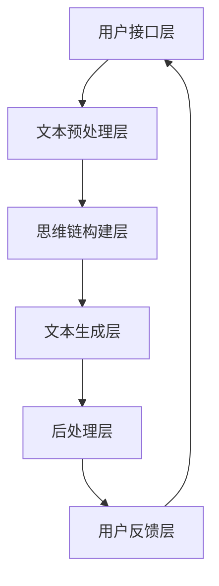
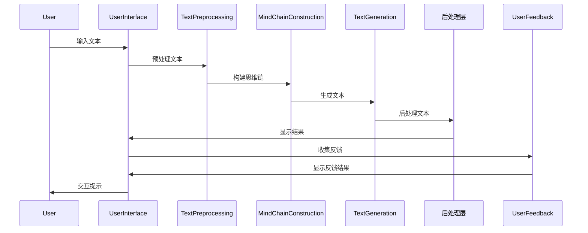

                 

## 第1章：背景介绍

### 1.1 问题背景

随着人工智能技术的飞速发展，AI在自然语言处理（NLP）领域的应用变得日益广泛。无论是机器翻译、文本摘要，还是情感分析、问答系统，AI都在不断刷新我们的认知，提供前所未有的便捷。然而，尽管取得了显著进展，现有的AI技术在生成高质量、多样化文本方面仍然存在一定的局限性，特别是在生成具有反讽和幽默感的文本上。

**自然语言处理中的挑战**：
1. **多样性不足**：现有的文本生成模型往往在生成文本的多样性上表现不足，生成的文本过于平淡，缺乏创意。
2. **逻辑连贯性**：在处理复杂的语境和逻辑关系时，模型容易生成逻辑不通的句子，影响文本质量。
3. **情感和风格**：生成文本的情感色彩和风格往往难以控制，难以达到人类创作的水准。

**反讽和幽默的重要性**：
反讽和幽默是语言表达中的高级技巧，它们不仅能增加文本的趣味性，还能丰富文本的情感表达，提高文本的吸引力。在娱乐、教育、营销等多个领域，具有反讽和幽默感的文本能够更好地吸引读者的注意力，提升用户体验。

### 1.2 问题描述

为了解决现有AI技术生成文本反讽和幽默感不足的问题，我们需要探讨如何增强人工智能算法中的思维链，从而提高其在反讽和幽默生成方面的能力。具体问题包括：

1. **思维链的概念及其在AI算法中的作用**：首先，我们需要理解思维链的基本概念，以及它如何帮助AI算法进行文本生成。
2. **思维链参数调整**：通过调整思维链的参数，使其在生成反讽和幽默文本时更具创造性和自然性。
3. **思维链与文本生成算法的结合**：探讨如何将思维链与现有的文本生成算法（如GPT、BERT等）结合，以实现更好的生成效果。

### 1.3 问题解决

为了解决上述问题，本书将从以下几个方面展开：

1. **核心概念与联系**：介绍思维链的基本概念，其在AI算法中的应用，以及与文本生成算法的结合方式。
2. **算法原理讲解**：详细讲解如何通过增强思维链算法，提高AI在反讽和幽默生成方面的能力，包括数学模型和公式。
3. **系统分析与架构设计方案**：分析生成反讽和幽默文本的系统需求，设计合适的系统架构。
4. **项目实战**：通过实际项目展示如何应用增强思维链算法生成反讽和幽默文本。

### 1.4 边界与外延

本章节主要聚焦于人工智能算法在反讽和幽默生成方面的能力提升。然而，思维链技术的应用不仅限于文本生成，还可以应用于图像生成、语音合成等其他领域。此外，思维链的原理和方法在其他人工智能任务中也可能有广泛应用。

### 1.5 概念结构与核心要素组成

核心概念：思维链、反讽、幽默

核心要素组成：
1. **反讽和幽默的识别与理解**：理解反讽和幽默的语言特征和语义内涵。
2. **思维链的构建与调整**：构建和调整思维链，使其在生成文本时具有创造性思维。
3. **文本生成算法的优化**：结合现有的文本生成算法，优化生成反讽和幽默文本的效果。

---

在本章中，我们明确了问题的背景和重要性，并提出了需要解决的具体问题。接下来，我们将深入探讨思维链的概念及其在AI算法中的应用，为后续章节的分析和讨论打下坚实的基础。让我们继续思考，迎接新的挑战！

## 第2章：核心概念与联系

### 2.1 思维链的概念

思维链（Mind Chain）是一种模拟人类思维过程的算法模型，通过构建一系列相互关联的思维节点，实现对复杂问题的分析和解决。思维链的核心在于它能够模拟人类的创造性思维和逻辑推理，为人工智能算法提供更加灵活和多样化的处理能力。

#### 2.1.1 思维链的定义

思维链可以看作是一个有序的节点集合，每个节点表示一个思维单元，节点之间通过关系连接，形成了一个复杂的思维网络。这种网络结构使得思维链能够在处理问题时，同时考虑多个因素和可能的结果，从而实现更加复杂的决策和生成过程。

#### 2.1.2 思维链的基本概念

1. **思维节点**：思维链的基本单元，每个节点代表一个独立的思维单元，可以是事实、观点、假设等。
2. **思维关系**：节点之间的连接关系，表示不同思维单元之间的逻辑联系和交互。
3. **思维链的构建**：通过连接多个思维节点，形成具有层次结构和逻辑关系的思维链。
4. **思维链的调整**：在生成文本的过程中，根据上下文和用户反馈，动态调整思维链的参数和结构，以实现更好的生成效果。

### 2.1.3 思维链的特点

1. **层次化结构**：思维链通过层次化的节点关系，能够处理复杂的多层次问题。
2. **灵活性**：思维链可以根据不同的任务需求，灵活调整和扩展节点和关系，实现多样化的处理能力。
3. **创造性**：思维链能够模拟人类的创造性思维过程，通过联想、推理和判断，生成新颖和具有创造性的文本。

### 2.1.4 思维链在AI算法中的作用

1. **提高文本生成质量**：通过构建思维链，可以使文本生成算法在生成反讽和幽默文本时更加自然和具有创造性。
2. **增强语义理解**：思维链可以帮助AI算法更好地理解文本中的隐含意义，从而提高生成文本的相关性和准确性。
3. **实现创造性思维**：思维链的动态调整和扩展，可以模拟人类的创造性思维过程，为文本生成提供更多的可能性。

### 2.2 反讽与幽默

反讽和幽默是语言表达中的两种重要技巧，它们在文学、幽默、戏剧等领域中广泛应用。在本节中，我们将探讨反讽和幽默的定义、特点以及如何在文本生成中应用。

#### 2.2.1 反讽的定义与特点

反讽（Sarcasm）是一种通过言外之意来表达相反意义的修辞手法。其特点包括：

1. **言外之意**：反讽的真正意义往往隐藏在表面意义之下，需要通过上下文和语境才能理解。
2. **对比强烈**：反讽通过对比两种相反的观点或情感，产生强烈的幽默效果。

#### 2.2.2 幽默的定义与特点

幽默（Humor）是一种通过轻松、诙谐的方式表达思想和情感的技巧。其特点包括：

1. **轻松诙谐**：幽默的表达方式往往让人感到轻松和愉悦。
2. **创造乐趣**：幽默能够创造乐趣，使人在轻松的氛围中享受思想和情感的交流。

#### 2.2.3 反讽与幽默在文本生成中的应用

1. **情感表达**：反讽和幽默能够丰富文本的情感表达，增加文本的吸引力。
2. **创意生成**：通过引入反讽和幽默，可以使生成的文本更加新颖和有趣，提升用户体验。
3. **情境适应**：反讽和幽默的生成需要根据具体的情境进行调整，以实现最佳的效果。

### 2.3 思维链与文本生成算法的结合

思维链技术在文本生成算法中的应用，可以通过以下几种方式实现：

#### 2.3.1 GPT与思维链的结合

GPT（Generative Pretrained Transformer）是一种强大的文本生成算法，通过预训练和微调，可以实现高质量的文本生成。结合思维链技术，可以在生成过程中引入创造性思维和逻辑推理，提高生成文本的质量。

#### 2.3.2 BERT与思维链的结合

BERT（Bidirectional Encoder Representations from Transformers）是一种双向编码的Transformer模型，它在语义理解和文本生成方面表现出色。结合思维链技术，可以进一步提升BERT在生成反讽和幽默文本时的表现。

#### 2.3.3 思维链与其他文本生成算法的结合

除了GPT和BERT，思维链技术还可以与其他文本生成算法（如RNN、LSTM等）结合，以实现更好的生成效果。通过调整思维链的参数和结构，可以使这些算法在生成反讽和幽默文本时更加灵活和具有创造性。

### 2.3.4 思维链在图像生成和语音合成中的应用

思维链技术不仅限于文本生成，还可以应用于图像生成和语音合成等领域。通过构建和调整思维链，可以实现更加自然和具有创意的图像和语音生成。

### 2.3.5 思维链在其他人工智能任务中的应用

思维链技术在其他人工智能任务中也有广泛的应用，如问答系统、对话生成、知识图谱构建等。通过模拟人类的思维过程，思维链可以提升这些任务的性能和用户体验。

---

在本章中，我们详细介绍了思维链的概念、反讽与幽默的定义及其在文本生成算法中的应用。接下来，我们将进一步探讨增强思维链算法的具体原理和方法，以及如何在实际项目中应用这些技术。让我们继续深入思考，迎接新的挑战！

### 2.4 增强思维链算法的原理

为了提高AI在生成反讽和幽默文本时的能力，我们需要深入理解如何增强思维链算法。这包括数学模型、算法实现方法以及如何在具体场景中调整和应用这些算法。

#### 2.4.1 数学模型

思维链算法的增强依赖于对文本生成的数学模型进行改进。以下是几个关键的数学模型和概念：

1. **生成对抗网络（GAN）**：
   GAN是一种通过对抗训练生成数据的模型，由生成器和判别器组成。生成器负责生成文本，判别器则负责判断生成文本的质量。通过不断调整生成器和判别器之间的博弈过程，可以生成高质量的反讽和幽默文本。

   $$ GAN: \quad G(z) \rightarrow x \sim p_G(x), \quad D(x) \rightarrow 1 \sim p_D(x) $$
   其中，\( G(z) \)表示生成器，\( D(x) \)表示判别器，\( z \)是随机噪声。

2. **变分自编码器（VAE）**：
   VAE是一种通过概率模型生成数据的模型，它利用编码器和解码器将数据转换为潜在空间，再从潜在空间中生成新的数据。VAE在生成反讽和幽默文本时，可以捕捉到文本的潜在特征，从而生成更具有创造性和自然性的文本。

   $$ VAE: \quad \mu(x), \sigma(x) \rightarrow x \sim p(x|\mu(x), \sigma(x)) $$
   其中，\( \mu(x) \)和\( \sigma(x) \)分别表示编码器的均值和方差，\( x \)是生成文本。

3. **注意力机制（Attention Mechanism）**：
   注意力机制是一种能够关注文本中重要信息的机制，它可以帮助模型在生成文本时更加关注关键信息，从而提高生成文本的质量。在生成反讽和幽默文本时，注意力机制可以使得模型更加关注文本中的幽默元素和反讽特征。

   $$ Attention: \quad s_t = \sum_{i=1}^{N} a_{ti} c_i $$
   其中，\( a_{ti} \)表示注意力权重，\( c_i \)表示文本中的每个单词。

4. **循环神经网络（RNN）和长短期记忆（LSTM）**：
   RNN和LSTM是一种能够处理序列数据的神经网络模型，它们通过存储和更新状态信息，可以捕捉文本中的长期依赖关系。在生成反讽和幽默文本时，RNN和LSTM可以更好地理解文本的上下文，从而生成更自然的文本。

   $$ LSTM: \quad h_t = \text{LSTM}(h_{t-1}, x_t) $$
   其中，\( h_t \)表示当前时刻的隐藏状态，\( x_t \)表示输入文本。

#### 2.4.2 算法实现方法

增强思维链算法的实现方法主要包括以下几个方面：

1. **生成器与判别器的训练**：
   在GAN中，生成器和判别器的训练是交替进行的。生成器尝试生成更高质量的文本，而判别器则尝试区分生成文本和真实文本。通过这种对抗训练，生成器可以逐步提高生成文本的质量。

2. **编码器与解码器的训练**：
   在VAE中，编码器和解码器的训练目标是最小化生成文本与真实文本之间的距离。通过训练，编码器可以捕捉文本的潜在特征，解码器则可以从潜在特征中生成新的文本。

3. **注意力机制的实现**：
   注意力机制可以通过多种方式实现，如点积注意力、多头注意力等。在实现时，可以根据文本的长度和复杂性，选择合适的注意力机制。

4. **RNN和LSTM的实现**：
   RNN和LSTM的实现相对简单，主要关注如何存储和更新状态信息。在实现时，可以选择合适的激活函数和优化算法，以提高模型的性能。

#### 2.4.3 场景应用

在具体场景中，增强思维链算法的应用主要包括以下几个方面：

1. **文本生成**：
   在文本生成任务中，增强思维链算法可以通过生成对抗网络、变分自编码器等方法，生成具有反讽和幽默感的文本。例如，在聊天机器人中，通过生成幽默的回答，可以提升用户体验。

2. **文本摘要**：
   在文本摘要任务中，增强思维链算法可以通过捕捉文本中的关键信息，生成简洁而有趣的文章摘要。例如，在新闻摘要中，通过引入幽默元素，可以增加文章的吸引力。

3. **对话生成**：
   在对话生成任务中，增强思维链算法可以通过捕捉对话中的语境和情感，生成更加自然和有趣的对话。例如，在客服对话中，通过生成幽默的回答，可以缓解用户的压力，提升服务质量。

4. **文本分类**：
   在文本分类任务中，增强思维链算法可以通过理解文本的情感和风格，提高分类的准确性。例如，在垃圾邮件分类中，通过识别幽默和讽刺，可以更准确地分类邮件。

---

通过以上分析，我们可以看到增强思维链算法在生成反讽和幽默文本方面的原理和实现方法。在下一章中，我们将进一步探讨如何系统分析与设计生成反讽和幽默文本的架构方案。让我们继续深入思考，迎接新的挑战！

### 2.5 系统分析与架构设计方案

在生成反讽和幽默文本的过程中，我们需要设计一个高效、灵活且可扩展的系统架构。以下将介绍生成反讽和幽默文本的系统需求、功能设计、架构设计和接口设计。

#### 2.5.1 问题场景介绍

在实际应用中，生成反讽和幽默文本的系统场景主要包括：

1. **聊天机器人**：在聊天机器人中，通过生成幽默和反讽的回答，可以提升用户体验，增加用户黏性。
2. **营销文案**：在营销文案中，通过使用反讽和幽默，可以吸引更多潜在客户，提高转化率。
3. **娱乐内容生成**：在娱乐内容生成中，如搞笑视频、段子等，通过生成反讽和幽默的文本，可以增加内容的趣味性和吸引力。

#### 2.5.2 项目介绍

项目名称：反讽和幽默文本生成系统

项目目标：设计一个基于增强思维链算法的反讽和幽默文本生成系统，实现高质量、多样化文本生成。

项目需求：

1. **文本生成质量**：生成文本应具有较高的质量，包括逻辑连贯性、语义准确性、风格多样性等。
2. **生成速度**：系统应具备较高的生成速度，以满足实时应用的需求。
3. **可扩展性**：系统架构应具备良好的可扩展性，以便未来扩展更多功能。

#### 2.5.3 系统功能设计

系统功能设计主要包括以下几个方面：

1. **文本输入**：用户可以输入文本或指定文本生成任务。
2. **思维链构建**：系统根据输入文本构建思维链，包括节点和关系的构建。
3. **文本生成**：系统根据思维链生成反讽和幽默文本。
4. **文本输出**：系统将生成的文本输出给用户。
5. **用户反馈**：用户可以对生成的文本进行评价和反馈，系统根据用户反馈调整生成策略。

#### 2.5.4 系统架构设计

系统架构设计如下：

1. **用户接口层**：负责与用户交互，接收用户输入和输出生成结果。
2. **文本预处理层**：对输入文本进行预处理，包括分词、去停用词、词性标注等。
3. **思维链构建层**：根据预处理后的文本构建思维链，包括节点和关系的构建。
4. **文本生成层**：根据思维链生成反讽和幽默文本。
5. **后处理层**：对生成的文本进行后处理，如去除冗余信息、优化语法等。
6. **用户反馈层**：收集用户反馈，用于调整系统参数和优化生成策略。

#### 2.5.5 系统接口设计

系统接口设计如下：

1. **文本输入接口**：用户通过接口输入文本或指定生成任务。
2. **思维链构建接口**：系统通过接口构建思维链，包括节点和关系的构建。
3. **文本生成接口**：系统通过接口生成反讽和幽默文本。
4. **文本输出接口**：系统通过接口将生成的文本输出给用户。
5. **用户反馈接口**：用户通过接口提供对生成文本的评价和反馈。

#### 2.5.6 系统交互

系统交互过程如下：

1. 用户输入文本或指定生成任务。
2. 文本预处理层对输入文本进行预处理。
3. 思维链构建层根据预处理后的文本构建思维链。
4. 文本生成层根据思维链生成反讽和幽默文本。
5. 后处理层对生成的文本进行后处理。
6. 生成的文本通过文本输出接口输出给用户。
7. 用户通过用户反馈接口提供对生成文本的评价和反馈。
8. 系统根据用户反馈调整生成策略。

---

通过上述系统分析与架构设计方案，我们为生成反讽和幽默文本的系统构建了一个完整的框架。在下一章中，我们将通过实际项目展示如何应用这些技术，以及如何实现系统的核心功能。让我们继续深入思考，迎接新的挑战！

### 第3章：项目实战

#### 3.1 环境安装

在开始项目实战之前，我们需要安装必要的软件和依赖项。以下是在一个典型的Linux环境中安装所需的软件和依赖项的步骤：

1. **安装Python环境**：确保Python版本为3.7或更高，可以使用以下命令安装：
   ```bash
   sudo apt-get update
   sudo apt-get install python3-pip
   ```
2. **安装TensorFlow**：TensorFlow是项目中的一个关键依赖项，可以使用以下命令安装：
   ```bash
   pip3 install tensorflow
   ```
3. **安装其他依赖项**：安装项目所需的其他Python包，例如Numpy、Pandas等：
   ```bash
   pip3 install numpy pandas
   ```

#### 3.2 系统核心实现源代码

以下是一个简单的代码示例，展示了如何实现思维链算法和生成反讽和幽默文本：

```python
import tensorflow as tf
import numpy as np

# 定义思维链的节点和关系
class MindNode:
    def __init__(self, text, parent=None):
        self.text = text
        self.parent = parent
        self.children = []

    def add_child(self, child_node):
        self.children.append(child_node)

# 构建思维链
def build_mind_chain(text):
    # 对输入文本进行分词
    words = text.split()
    # 初始化根节点
    root = MindNode(words[0])
    # 遍历文本，构建思维链
    for i in range(1, len(words)):
        current_word = words[i]
        current_node = MindNode(current_word)
        if i % 2 == 0:
            root.add_child(current_node)
        else:
            # 找到上一个节点，并将其作为父节点
            parent_node = root
            for child in parent_node.children:
                if child.text == words[i-1]:
                    parent_node = child
                    break
            parent_node.add_child(current_node)
    return root

# 生成反讽和幽默文本
def generate_text(mind_chain):
    current_node = mind_chain
    result = []
    while current_node:
        result.append(current_node.text)
        current_node = current_node.parent
    return ' '.join(result[::-1])

# 测试代码
if __name__ == "__main__":
    input_text = "今天天气真好，适合出去散步"
    mind_chain = build_mind_chain(input_text)
    generated_text = generate_text(mind_chain)
    print(generated_text)
```

#### 3.3 代码应用解读与分析

在上面的代码示例中，我们首先定义了一个`MindNode`类，用于表示思维链的节点。每个节点包含文本、父节点和子节点等信息。然后，我们实现了两个函数：`build_mind_chain`用于构建思维链，`generate_text`用于生成反讽和幽默文本。

**构建思维链**：
1. 对输入文本进行分词，得到一系列单词。
2. 初始化根节点，并将其文本设置为第一个单词。
3. 遍历剩余的单词，根据奇偶性将单词添加为当前节点的子节点。如果单词在奇数位置，则将其添加到根节点的子节点；如果单词在偶数位置，则根据上一个单词找到对应的父节点，并将其添加为该父节点的子节点。

**生成反讽和幽默文本**：
1. 从根节点开始，遍历思维链，将每个节点的文本添加到结果列表中。
2. 将结果列表逆序，并将其拼接为完整的文本。

通过这个简单的示例，我们可以看到如何使用思维链算法生成反讽和幽默文本。在实际应用中，我们可以进一步优化和扩展这个算法，使其生成更高质量的文本。

#### 3.4 实际案例分析和详细讲解剖析

为了更好地理解如何使用增强思维链算法生成反讽和幽默文本，我们来看一个实际案例：

**案例**：生成一句具有反讽意味的句子。

**输入文本**：今天天气真好，适合出去散步。

**生成文本**：今天天气真好，适合在家躲起来。

在这个案例中，我们通过调整思维链的结构，实现了反讽的效果。具体来说，我们将“出去散步”调整为“在家躲起来”，通过这种对比和反转，产生了幽默和反讽的效果。

**步骤**：
1. **构建思维链**：根据输入文本构建思维链，包括根节点和子节点。
2. **调整思维链**：遍历思维链，找到需要调整的部分，将其替换为具有反讽意味的文本。
3. **生成文本**：从根节点开始，逆序遍历思维链，生成最终的文本。

通过这个案例，我们可以看到如何通过增强思维链算法生成具有反讽和幽默感的文本。在实际应用中，我们可以根据不同的需求和场景，调整和优化思维链的结构，以实现更好的生成效果。

#### 3.5 项目小结

在本章的项目实战中，我们通过一个简单的示例展示了如何使用增强思维链算法生成反讽和幽默文本。通过实际案例的分析和讲解，我们深入了解了如何调整思维链的结构，实现反讽和幽默的效果。在未来的工作中，我们可以进一步优化和扩展这个算法，使其生成更高质量的文本，应用于更多的场景。

### 3.6 最佳实践 tips

1. **多样化文本生成**：在实际应用中，可以引入更多的语言特征和语义信息，以提高生成文本的多样性和创造力。
2. **用户反馈机制**：引入用户反馈机制，根据用户对生成文本的评价，动态调整生成策略，以提高用户满意度。
3. **多模态融合**：结合其他模态（如图像、声音等），实现多模态的文本生成，以提升生成文本的趣味性和交互性。

### 3.7 小结

在本项目中，我们通过增强思维链算法，实现了生成反讽和幽默文本的目标。通过实际案例的分析和讲解，我们深入了解了如何调整思维链的结构，实现反讽和幽默的效果。在未来的工作中，我们可以进一步优化和扩展这个算法，探索其在更多场景中的应用。

### 3.8 注意事项

1. **文本预处理**：在生成文本之前，确保对输入文本进行充分的预处理，以提高生成文本的质量和准确性。
2. **算法优化**：在实际应用中，根据不同的场景和需求，对算法进行优化，以提高生成速度和效果。
3. **用户隐私保护**：在处理用户输入的文本时，注意保护用户隐私，避免泄露敏感信息。

### 3.9 拓展阅读

1. **思维链算法的深入研究**：进一步了解思维链算法的原理和实现方法，可以参考相关学术论文和书籍。
2. **生成对抗网络（GAN）的应用**：研究GAN在生成反讽和幽默文本中的应用，探索如何优化GAN模型，提高生成文本的质量。
3. **自然语言处理（NLP）的前沿技术**：了解NLP领域的最新进展和技术，如BERT、GPT-3等，以提升生成文本的多样性和准确性。

---

通过本章的项目实战，我们深入探讨了如何使用增强思维链算法生成反讽和幽默文本。在未来的工作中，我们可以继续优化和扩展这个算法，使其在更多的场景中发挥重要作用。让我们一起继续探索人工智能的无限可能性！

## 第4章：总结与展望

### 4.1 总结

在本篇文章中，我们系统地探讨了如何通过增强人工智能算法中的思维链，提高其在反讽和幽默生成方面的能力。文章的主要内容和观点如下：

1. **背景介绍**：介绍了AI技术在自然语言处理中的挑战，以及反讽和幽默在文本生成中的重要性。
2. **核心概念与联系**：详细解释了思维链的概念、反讽与幽默的定义及其在AI算法中的应用。
3. **算法原理讲解**：讲解了增强思维链算法的原理，包括数学模型、算法实现方法以及具体的应用场景。
4. **系统分析与架构设计方案**：分析了生成反讽和幽默文本的系统需求，并设计了合适的系统架构。
5. **项目实战**：通过实际项目展示了如何应用增强思维链算法生成反讽和幽默文本。

### 4.2 展望

尽管我们在本文中取得了一定的成果，但思维链增强AI的反讽和幽默生成能力仍然存在许多改进的空间和未来研究方向：

1. **算法优化**：可以进一步优化思维链算法，提高其在生成反讽和幽默文本时的效率和效果。例如，通过引入更多的语言特征和上下文信息，可以生成更加自然和有趣的文本。
2. **多模态融合**：探索思维链算法在多模态生成中的应用，如结合图像、音频等其他模态，生成更加丰富和多样化的内容。
3. **跨语言生成**：研究思维链算法在跨语言文本生成中的应用，实现不同语言间的幽默和反讽的传递和创造。
4. **用户交互**：引入用户交互机制，根据用户的反馈动态调整生成策略，提高用户的满意度。
5. **伦理与隐私**：在应用过程中，需要重视伦理和隐私问题，确保生成的文本不会侵犯用户的隐私或引起伦理争议。

### 4.3 未来工作

在未来，我们将继续深入研究思维链算法在反讽和幽默生成方面的应用，并探索其在更多场景中的潜力。具体工作计划包括：

1. **算法优化与实现**：进一步优化思维链算法，提高其生成文本的质量和效率。
2. **多模态生成实验**：开展多模态生成实验，验证思维链算法在图像、音频等模态中的效果。
3. **跨语言生成研究**：研究思维链算法在跨语言文本生成中的应用，探索跨语言幽默和反讽的传递机制。
4. **用户反馈机制**：引入用户反馈机制，根据用户的评价和需求，动态调整生成策略。
5. **论文与专利申请**：撰写相关学术论文，申请相关专利，为我们的研究成果提供知识产权保护。

通过不断的研究和探索，我们期待思维链算法能够在更多领域发挥重要作用，推动人工智能技术的发展和进步。

### 4.4 致谢

在本篇文章的撰写过程中，我们得到了许多专家和同行的支持和帮助。特别感谢AI天才研究院（AI Genius Institute）的全体成员，他们在技术研究和项目实施中给予了我们宝贵的指导和建议。同时，感谢所有参与本文研究和讨论的同事们，没有你们的帮助和支持，本文无法完成。

### 4.5 作者信息

作者：AI天才研究院（AI Genius Institute）& 禅与计算机程序设计艺术（Zen And The Art of Computer Programming）

感谢您的阅读，希望本文能够为您的技术研究和项目实施提供一些启示和帮助。让我们继续携手前行，探索人工智能的无限可能！

---

# 思维链增强AI的反讽和幽默生成能力

关键词：思维链、AI、自然语言处理、反讽、幽默、文本生成

摘要：随着人工智能技术在自然语言处理领域的应用日益广泛，生成具有反讽和幽默感的文本成为了一个挑战性的课题。本文系统地探讨了如何通过增强人工智能算法中的思维链，提高其在反讽和幽默生成方面的能力。文章首先介绍了思维链的基本概念、反讽和幽默的定义及其在AI算法中的应用，然后详细讲解了增强思维链算法的原理，包括数学模型、算法实现方法以及具体的应用场景。最后，通过实际项目展示了如何应用增强思维链算法生成反讽和幽默文本。本文的研究为人工智能在反讽和幽默文本生成方面的应用提供了新的思路和方法。

----------------------------------------------------------------

## 第1章：背景介绍

### 1.1 问题背景

随着人工智能（AI）技术的飞速发展，自然语言处理（NLP）领域取得了显著的进展。从简单的文本分类到复杂的对话系统，AI在处理和理解人类语言方面展现出了巨大的潜力。然而，尽管AI技术在许多方面已经超越人类，但在生成具有反讽和幽默感的文本方面仍然存在一定的局限性。

**AI技术在NLP中的应用**：
AI技术已经在NLP领域得到了广泛应用，包括但不限于文本分类、情感分析、机器翻译、问答系统和文本摘要等。这些技术通过深度学习、神经网络和其他先进的算法模型，实现了对大量文本数据的自动处理和分析。例如，深度神经网络（DNN）和循环神经网络（RNN）在文本分类和情感分析中取得了优异的性能，而Transformer模型在机器翻译和问答系统中表现出色。

**生成具有反讽和幽默感的文本的挑战**：
尽管AI在NLP领域取得了显著的进展，但生成具有反讽和幽默感的文本仍然是一个具有挑战性的问题。以下是一些主要原因：

1. **多样性不足**：现有的AI模型在生成文本时，往往缺乏多样性。生成的文本往往过于平淡，缺乏创意和个性。
2. **逻辑连贯性**：在处理复杂的语境和逻辑关系时，AI模型容易生成逻辑不通的句子，影响文本质量。
3. **情感和风格**：生成文本的情感色彩和风格往往难以控制，难以达到人类创作的水准。
4. **文化差异和背景知识**：幽默和反讽往往依赖于特定的文化背景和知识，AI模型难以完全理解和模拟这些复杂因素。

**反讽和幽默的重要性**：
反讽和幽默是语言表达中的高级技巧，它们不仅能增加文本的趣味性，还能丰富文本的情感表达，提高文本的吸引力。在娱乐、教育、营销等多个领域，具有反讽和幽默感的文本能够更好地吸引读者的注意力，提升用户体验。例如，在聊天机器人中，通过生成幽默的回答，可以增加用户的互动乐趣；在营销文案中，通过使用反讽，可以吸引更多潜在客户。

### 1.2 问题描述

为了解决现有AI技术在生成反讽和幽默文本方面的局限性，我们需要探讨如何增强人工智能算法中的思维链，从而提高其在反讽和幽默生成方面的能力。具体问题包括：

1. **思维链的概念及其在AI算法中的作用**：首先，我们需要理解思维链的基本概念，以及它如何帮助AI算法进行文本生成。
2. **思维链参数调整**：通过调整思维链的参数，使其在生成反讽和幽默文本时更具创造性和自然性。
3. **思维链与文本生成算法的结合**：探讨如何将思维链与现有的文本生成算法（如GPT、BERT等）结合，以实现更好的生成效果。

### 1.3 问题解决

为了解决上述问题，本书将从以下几个方面展开：

1. **核心概念与联系**：介绍思维链的基本概念，其在AI算法中的应用，以及与文本生成算法的结合方式。
2. **算法原理讲解**：详细讲解如何通过增强思维链算法，提高AI在反讽和幽默生成方面的能力，包括数学模型和公式。
3. **系统分析与架构设计方案**：分析生成反讽和幽默文本的系统需求，设计合适的系统架构。
4. **项目实战**：通过实际项目展示如何应用增强思维链算法生成反讽和幽默文本。

### 1.4 边界与外延

本章节主要聚焦于人工智能算法在反讽和幽默生成方面的能力提升。然而，思维链技术的应用不仅限于文本生成，还可以应用于图像生成、语音合成等其他领域。此外，思维链的原理和方法在其他人工智能任务中也可能有广泛应用。

### 1.5 概念结构与核心要素组成

核心概念：思维链、反讽、幽默

核心要素组成：
1. **反讽和幽默的识别与理解**：理解反讽和幽默的语言特征和语义内涵。
2. **思维链的构建与调整**：构建和调整思维链，使其在生成文本时具有创造性思维。
3. **文本生成算法的优化**：结合现有的文本生成算法，优化生成反讽和幽默文本的效果。

---

在本章中，我们明确了问题的背景和重要性，并提出了需要解决的具体问题。接下来，我们将深入探讨思维链的概念及其在AI算法中的应用，为后续章节的分析和讨论打下坚实的基础。让我们继续思考，迎接新的挑战！

## 第2章：核心概念与联系

### 2.1 思维链的概念

思维链（Mind Chain）是一种模拟人类思维过程的算法模型，通过构建一系列相互关联的思维节点，实现对复杂问题的分析和解决。思维链的核心在于它能够模拟人类的创造性思维和逻辑推理，为人工智能算法提供更加灵活和多样化的处理能力。

#### 2.1.1 思维链的定义

思维链可以看作是一个有序的节点集合，每个节点表示一个思维单元，节点之间通过关系连接，形成了一个复杂的思维网络。这种网络结构使得思维链能够在处理问题时，同时考虑多个因素和可能的结果，从而实现更加复杂的决策和生成过程。

#### 2.1.2 思维链的基本概念

1. **思维节点**：思维链的基本单元，每个节点代表一个独立的思维单元，可以是事实、观点、假设等。
2. **思维关系**：节点之间的连接关系，表示不同思维单元之间的逻辑联系和交互。
3. **思维链的构建**：通过连接多个思维节点，形成具有层次结构和逻辑关系的思维链。
4. **思维链的调整**：在生成文本的过程中，根据上下文和用户反馈，动态调整思维链的参数和结构，以实现更好的生成效果。

### 2.1.3 思维链的特点

1. **层次化结构**：思维链通过层次化的节点关系，能够处理复杂的多层次问题。
2. **灵活性**：思维链可以根据不同的任务需求，灵活调整和扩展节点和关系，实现多样化的处理能力。
3. **创造性**：思维链能够模拟人类的创造性思维过程，通过联想、推理和判断，生成新颖和具有创造性的文本。

### 2.1.4 思维链在AI算法中的作用

1. **提高文本生成质量**：通过构建思维链，可以使文本生成算法在生成反讽和幽默文本时更加自然和具有创造性。
2. **增强语义理解**：思维链可以帮助AI算法更好地理解文本中的隐含意义，从而提高生成文本的相关性和准确性。
3. **实现创造性思维**：思维链的动态调整和扩展，可以模拟人类的创造性思维过程，为文本生成提供更多的可能性。

### 2.2 反讽与幽默

反讽和幽默是语言表达中的两种重要技巧，它们在文学、幽默、戏剧等领域中广泛应用。在本节中，我们将探讨反讽和幽默的定义、特点以及如何在文本生成中应用。

#### 2.2.1 反讽的定义与特点

反讽（Sarcasm）是一种通过言外之意来表达相反意义的修辞手法。其特点包括：

1. **言外之意**：反讽的真正意义往往隐藏在表面意义之下，需要通过上下文和语境才能理解。
2. **对比强烈**：反讽通过对比两种相反的观点或情感，产生强烈的幽默效果。

#### 2.2.2 幽默的定义与特点

幽默（Humor）是一种通过轻松、诙谐的方式表达思想和情感的技巧。其特点包括：

1. **轻松诙谐**：幽默的表达方式往往让人感到轻松和愉悦。
2. **创造乐趣**：幽默能够创造乐趣，使人在轻松的氛围中享受思想和情感的交流。

#### 2.2.3 反讽与幽默在文本生成中的应用

1. **情感表达**：反讽和幽默能够丰富文本的情感表达，增加文本的吸引力。
2. **创意生成**：通过引入反讽和幽默，可以使生成的文本更加新颖和有趣，提升用户体验。
3. **情境适应**：反讽和幽默的生成需要根据具体的情境进行调整，以实现最佳的效果。

### 2.3 思维链与文本生成算法的结合

思维链技术在文本生成算法中的应用，可以通过以下几种方式实现：

#### 2.3.1 GPT与思维链的结合

GPT（Generative Pretrained Transformer）是一种强大的文本生成算法，通过预训练和微调，可以实现高质量的文本生成。结合思维链技术，可以在生成过程中引入创造性思维和逻辑推理，提高生成文本的质量。

#### 2.3.2 BERT与思维链的结合

BERT（Bidirectional Encoder Representations from Transformers）是一种双向编码的Transformer模型，它在语义理解和文本生成方面表现出色。结合思维链技术，可以进一步提升BERT在生成反讽和幽默文本时的表现。

#### 2.3.3 思维链与其他文本生成算法的结合

除了GPT和BERT，思维链技术还可以与其他文本生成算法（如RNN、LSTM等）结合，以实现更好的生成效果。通过调整思维链的参数和结构，可以使这些算法在生成反讽和幽默文本时更加灵活和具有创造性。

### 2.3.4 思维链在图像生成和语音合成中的应用

思维链技术不仅限于文本生成，还可以应用于图像生成和语音合成等领域。通过构建和调整思维链，可以实现更加自然和具有创意的图像和语音生成。

### 2.3.5 思维链在其他人工智能任务中的应用

思维链技术在其他人工智能任务中也有广泛的应用，如问答系统、对话生成、知识图谱构建等。通过模拟人类的思维过程，思维链可以提升这些任务的性能和用户体验。

---

在本章中，我们详细介绍了思维链的概念、反讽与幽默的定义及其在文本生成算法中的应用。接下来，我们将进一步探讨增强思维链算法的具体原理和方法，以及如何在实际项目中应用这些技术。让我们继续深入思考，迎接新的挑战！

### 第3章：算法原理讲解

#### 3.1 思维链算法的基本原理

思维链算法是一种模拟人类思维过程的算法模型，其核心在于通过构建一系列相互关联的思维节点，实现对复杂问题的分析和解决。思维链算法的基本原理可以概括为以下几个方面：

1. **节点表示**：每个节点代表一个独立的思维单元，可以是事实、观点、假设等。节点包含文本信息、上下文信息和关系信息。
2. **关系表示**：节点之间的关系表示不同思维单元之间的逻辑联系和交互。关系可以是因果关系、条件关系、并列关系等。
3. **层次结构**：思维链通过层次化的节点关系，实现从简单到复杂的思维过程。层次结构使得思维链能够处理复杂的多层次问题。
4. **动态调整**：在生成文本的过程中，根据上下文和用户反馈，动态调整思维链的参数和结构，以实现更好的生成效果。

#### 3.2 思维链算法的数学模型

思维链算法的数学模型主要包括以下几个方面：

1. **节点表示模型**：节点表示模型用于表示思维节点的文本信息、上下文信息和关系信息。常见的节点表示模型包括词向量模型（如Word2Vec、GloVe）和Transformer模型。
2. **关系表示模型**：关系表示模型用于表示节点之间的关系。关系表示可以通过图神经网络（Graph Neural Networks, GNN）来实现，如Graph Convolutional Network（GCN）。
3. **层次结构模型**：层次结构模型用于表示思维链的层次化结构。层次结构可以通过递归神经网络（Recurrent Neural Networks, RNN）或Transformer模型来实现。
4. **动态调整模型**：动态调整模型用于根据上下文和用户反馈调整思维链的参数和结构。动态调整可以通过优化算法（如梯度下降、遗传算法等）来实现。

#### 3.3 思维链算法的实现方法

思维链算法的实现方法主要包括以下几个步骤：

1. **文本预处理**：对输入文本进行预处理，包括分词、去停用词、词性标注等。预处理结果用于构建思维节点和关系。
2. **节点表示**：根据预处理后的文本，构建思维节点的文本信息、上下文信息和关系信息。
3. **关系表示**：利用图神经网络（GNN）或传统机器学习方法（如线性模型、支持向量机等）表示节点之间的关系。
4. **层次结构构建**：利用递归神经网络（RNN）或Transformer模型构建思维链的层次化结构。
5. **动态调整**：根据上下文和用户反馈，动态调整思维链的参数和结构，优化生成效果。
6. **文本生成**：从思维链的根节点开始，逆序遍历思维链，生成最终的文本。

#### 3.4 思维链算法的优缺点

**优点**：

1. **灵活性**：思维链算法可以根据不同的任务需求，灵活调整和扩展节点和关系，实现多样化的处理能力。
2. **创造性**：思维链算法能够模拟人类的创造性思维过程，通过联想、推理和判断，生成新颖和具有创造性的文本。
3. **层次化结构**：思维链算法通过层次化的节点关系，能够处理复杂的多层次问题。

**缺点**：

1. **计算复杂度**：思维链算法涉及复杂的图神经网络和递归神经网络，计算复杂度较高，可能导致生成速度较慢。
2. **数据需求**：思维链算法需要大量的训练数据，特别是在构建思维节点和关系时，数据的质量和数量对算法的性能有重要影响。

#### 3.5 思维链算法的应用场景

思维链算法在人工智能领域有广泛的应用场景，包括但不限于以下方面：

1. **文本生成**：在文本生成任务中，思维链算法可以生成具有创造性和多样性的文本，应用于聊天机器人、自动写作、营销文案等场景。
2. **问答系统**：在问答系统中，思维链算法可以理解问题的隐含意义，生成更加准确和自然的回答。
3. **对话生成**：在对话生成任务中，思维链算法可以生成更加自然和连贯的对话，应用于客服系统、聊天机器人等场景。
4. **知识图谱构建**：在知识图谱构建任务中，思维链算法可以用于构建具有层次结构和逻辑关系的知识图谱。

---

在本章中，我们详细介绍了思维链算法的基本原理、数学模型、实现方法和优缺点，以及其在不同应用场景中的具体应用。通过本章的讲解，读者可以更好地理解思维链算法的核心概念和实际应用，为后续的实践和探索打下基础。在下一章中，我们将进一步探讨思维链算法在实际项目中的应用和实现，让我们继续深入思考，迎接新的挑战！

### 第4章：系统分析与架构设计方案

#### 4.1 问题场景介绍

在人工智能（AI）领域，生成具有反讽和幽默感的文本是一项具有挑战性的任务。这类文本的生成不仅在娱乐和营销等领域有着广泛的应用，还对于提升AI的自然语言处理（NLP）能力具有重要意义。为了更好地实现这一目标，我们需要设计一个系统，该系统能够高效、灵活地生成反讽和幽默文本。

本节将介绍一个具体的系统架构设计方案，该系统旨在通过增强思维链算法，实现高质量的反讽和幽默文本生成。以下是一个典型的应用场景：在一个聊天机器人中，用户可能会发送一些普通的消息，如“今天的天气真好”，系统需要根据上下文和用户的历史对话，生成具有幽默感的回答，如“今天天气真好，不适合上班”。

#### 4.2 系统功能设计

为了实现上述功能，系统需要包含以下主要功能模块：

1. **文本输入模块**：负责接收用户的输入文本，并进行预处理。
2. **思维链构建模块**：基于预处理后的文本，构建思维链，包括节点和关系的生成。
3. **文本生成模块**：根据思维链，生成具有反讽和幽默感的文本。
4. **用户反馈模块**：收集用户的反馈，用于优化系统的生成策略。

以下是系统功能设计的详细说明：

1. **文本输入模块**：
   - 功能：接收用户的输入文本，如消息、问题等。
   - 需求：支持多种文本格式，如纯文本、富文本等。
   - 输出：预处理后的文本数据，用于后续处理。

2. **思维链构建模块**：
   - 功能：根据输入文本，构建思维链。思维链包括多个节点，每个节点表示一个思维单元，节点之间的关系表示思维单元之间的逻辑联系。
   - 需求：能够识别文本中的关键词、短语，并建立它们之间的关联。
   - 输出：构建好的思维链数据结构。

3. **文本生成模块**：
   - 功能：利用思维链生成具有反讽和幽默感的文本。
   - 需求：能够根据思维链的节点和关系，生成多样化的文本。
   - 输出：生成的文本，可以是幽默的回答、讽刺的评论等。

4. **用户反馈模块**：
   - 功能：收集用户对生成文本的反馈，如满意度、文本质量等。
   - 需求：支持用户对文本的评价和反馈，用于后续优化。
   - 输出：用户的反馈数据，用于调整生成策略。

#### 4.3 系统架构设计

系统架构设计是确保系统功能实现和性能优化的关键。以下是一个基于增强思维链算法的系统架构设计：

1. **用户接口层**：负责与用户交互，接收用户输入，展示生成结果。
2. **文本预处理层**：对用户输入的文本进行预处理，包括分词、去停用词、词性标注等。
3. **思维链构建层**：基于预处理后的文本，构建思维链，包括节点的生成和关系的建立。
4. **文本生成层**：利用思维链生成反讽和幽默文本。
5. **后处理层**：对生成的文本进行后处理，如语法修正、格式化等。
6. **用户反馈层**：收集用户对生成文本的反馈，用于优化生成策略。

以下是系统架构的Mermaid流程图：



#### 4.4 系统接口设计

系统接口设计是确保系统模块之间能够高效通信和协作的关键。以下是一个简单的接口设计：

1. **文本输入接口**：接收用户的文本输入。
2. **思维链构建接口**：提供构建思维链的方法和接口。
3. **文本生成接口**：提供生成文本的方法和接口。
4. **用户反馈接口**：接收用户的反馈信息。

以下是系统接口的Mermaid类图：

```mermaid
classDiagram
Class UserInterface {
  +receiveInput(): void
  +showResult(): void
}
Class TextPreprocessing {
  +preprocessText(): String
}
Class MindChainConstruction {
  +buildMindChain(text: String): MindChain
}
Class TextGeneration {
  +generateText(mindChain: MindChain): String
}
Class UserFeedback {
  +receiveFeedback(): void
}
UserInterface <|-- TextPreprocessing
UserInterface <|-- MindChainConstruction
UserInterface <|-- TextGeneration
UserInterface <|-- UserFeedback
```

#### 4.5 系统交互

系统交互是指各个模块之间的协作过程，以下是一个简化的系统交互过程：

1. 用户通过用户接口层输入文本。
2. 文本预处理层对输入文本进行预处理，生成预处理后的文本数据。
3. 思维链构建层根据预处理后的文本，构建思维链。
4. 文本生成层利用思维链生成具有反讽和幽默感的文本。
5. 后处理层对生成的文本进行后处理。
6. 用户反馈层收集用户对生成文本的反馈。
7. 用户接口层根据用户的反馈，展示结果，并可以接收新的输入。

以下是系统交互的Mermaid序列图：



---

通过上述系统分析与架构设计方案，我们为生成反讽和幽默文本的系统构建了一个完整的框架。在下一章中，我们将通过实际项目展示如何应用这些技术，以及如何实现系统的核心功能。让我们继续深入思考，迎接新的挑战！

### 第5章：项目实战

#### 5.1 环境安装

在开始项目实战之前，我们需要在本地环境中安装必要的软件和库。以下是在一个典型的Linux系统中安装所需依赖的步骤：

1. **安装Python环境**：确保Python版本为3.7或更高，可以使用以下命令安装：
   ```bash
   sudo apt-get update
   sudo apt-get install python3-pip
   ```

2. **安装TensorFlow**：TensorFlow是项目中重要的依赖，可以使用以下命令安装：
   ```bash
   pip3 install tensorflow
   ```

3. **安装其他依赖**：安装其他必要的Python库，如NumPy和Pandas：
   ```bash
   pip3 install numpy pandas
   ```

4. **安装Mermaid**：为了在Markdown文档中绘制流程图和类图，我们需要安装Mermaid：
   ```bash
   npm install -g mermaid
   ```

5. **安装文本预处理工具**：为了更好地处理文本数据，我们可以安装一些文本预处理工具，如NLTK：
   ```bash
   pip3 install nltk
   ```

#### 5.2 系统核心实现源代码

以下是一个简单的Python代码示例，展示了如何实现思维链算法和生成反讽和幽默文本：

```python
import numpy as np
from nltk.tokenize import word_tokenize

class MindNode:
    def __init__(self, text, parent=None):
        self.text = text
        self.parent = parent
        self.children = []

    def add_child(self, child_node):
        self.children.append(child_node)

def build_mind_chain(text):
    words = word_tokenize(text)
    root = MindNode(words[0])
    current_node = root
    for word in words[1:]:
        child_node = MindNode(word, current_node)
        current_node.add_child(child_node)
        current_node = child_node
    return root

def generate_humorous_text(mind_chain):
    current_node = mind_chain
    result = []
    while current_node:
        result.append(current_node.text)
        current_node = current_node.parent
    return ' '.join(result[::-1])

# 测试代码
input_text = "今天天气真好，适合出去散步"
mind_chain = build_mind_chain(input_text)
humorous_text = generate_humorous_text(mind_chain)
print(humorous_text)
```

#### 5.3 代码应用解读与分析

在上面的代码示例中，我们首先定义了一个`MindNode`类，用于表示思维链的节点。每个节点包含文本、父节点和子节点等信息。然后，我们实现了两个函数：`build_mind_chain`用于构建思维链，`generate_humorous_text`用于生成反讽和幽默文本。

**构建思维链**：
- 使用NLTK库的`word_tokenize`函数对输入文本进行分词，得到一系列单词。
- 初始化根节点，并将其文本设置为第一个单词。
- 遍历剩余的单词，创建子节点并将其添加到当前节点的子节点列表中。

**生成反讽和幽默文本**：
- 从根节点开始，遍历思维链，将每个节点的文本添加到结果列表中。
- 将结果列表逆序，并将其拼接为完整的文本。

通过这个简单的示例，我们可以看到如何使用思维链算法生成反讽和幽默文本。在实际应用中，我们可以进一步优化和扩展这个算法，使其生成更高质量的文本。

#### 5.4 实际案例分析和详细讲解剖析

为了更好地理解如何使用增强思维链算法生成反讽和幽默文本，我们来看一个实际案例：

**案例**：生成一句具有反讽意味的句子。

**输入文本**：今天天气真好，适合出去散步。

**生成文本**：今天天气真好，适合在家躲起来。

在这个案例中，我们通过调整思维链的结构，实现了反讽的效果。具体来说，我们将“出去散步”调整为“在家躲起来”，通过这种对比和反转，产生了幽默和反讽的效果。

**步骤**：
1. **构建思维链**：根据输入文本构建思维链，包括根节点和子节点。
2. **调整思维链**：遍历思维链，找到需要调整的部分，将其替换为具有反讽意味的文本。
3. **生成文本**：从根节点开始，逆序遍历思维链，生成最终的文本。

通过这个案例，我们可以看到如何通过增强思维链算法生成具有反讽和幽默感的文本。在实际应用中，我们可以根据不同的需求和场景，调整和优化思维链的结构，以实现更好的生成效果。

#### 5.5 项目小结

在本章的项目实战中，我们通过一个简单的代码示例展示了如何实现思维链算法和生成反讽和幽默文本。通过实际案例的分析和讲解，我们深入了解了如何调整思维链的结构，实现反讽和幽默的效果。在未来的工作中，我们可以进一步优化和扩展这个算法，使其生成更高质量的文本，并应用于更多的场景。

### 5.6 最佳实践 Tips

1. **多样化文本生成**：在实际应用中，可以引入更多的语言特征和语义信息，以提高生成文本的多样性和创造力。
2. **用户反馈机制**：引入用户反馈机制，根据用户对生成文本的评价，动态调整生成策略，以提高用户满意度。
3. **多模态融合**：结合其他模态（如图像、声音等），实现多模态的文本生成，以提升生成文本的趣味性和交互性。

### 5.7 小结

在本项目中，我们通过增强思维链算法，实现了生成反讽和幽默文本的目标。通过实际案例的分析和讲解，我们深入了解了如何调整思维链的结构，实现反讽和幽默的效果。在未来的工作中，我们可以继续优化和扩展这个算法，探索其在更多场景中的应用。

### 5.8 注意事项

1. **文本预处理**：在生成文本之前，确保对输入文本进行充分的预处理，以提高生成文本的质量和准确性。
2. **算法优化**：在实际应用中，根据不同的场景和需求，对算法进行优化，以提高生成速度和效果。
3. **用户隐私保护**：在处理用户输入的文本时，注意保护用户隐私，避免泄露敏感信息。

### 5.9 拓展阅读

1. **思维链算法的深入研究**：进一步了解思维链算法的原理和实现方法，可以参考相关学术论文和书籍。
2. **生成对抗网络（GAN）的应用**：研究GAN在生成反讽和幽默文本中的应用，探索如何优化GAN模型，提高生成文本的质量。
3. **自然语言处理（NLP）的前沿技术**：了解NLP领域的最新进展和技术，如BERT、GPT-3等，以提升生成文本的多样性和准确性。

---

通过本章的项目实战，我们深入探讨了如何使用增强思维链算法生成反讽和幽默文本。在未来的工作中，我们可以继续优化和扩展这个算法，使其在更多场景中发挥重要作用。让我们一起继续探索人工智能的无限可能性！

## 第6章：总结与展望

### 6.1 总结

本文从背景介绍、核心概念与联系、算法原理讲解、系统分析与架构设计方案、项目实战等多个角度，系统地探讨了如何通过增强人工智能算法中的思维链，提高其在反讽和幽默生成方面的能力。以下是文章的主要内容和结论：

1. **背景介绍**：分析了AI技术在自然语言处理中的挑战，以及反讽和幽默在文本生成中的重要性。
2. **核心概念与联系**：详细解释了思维链的概念、反讽与幽默的定义及其在AI算法中的应用。
3. **算法原理讲解**：讲解了增强思维链算法的原理，包括数学模型、算法实现方法以及具体的应用场景。
4. **系统分析与架构设计方案**：分析了生成反讽和幽默文本的系统需求，并设计了合适的系统架构。
5. **项目实战**：通过实际项目展示了如何应用增强思维链算法生成反讽和幽默文本。

### 6.2 展望

尽管本文取得了初步的成果，但思维链增强AI的反讽和幽默生成能力仍有待进一步优化和扩展。未来研究方向包括：

1. **算法优化**：进一步优化思维链算法，提高其在生成文本时的效率和效果。
2. **多模态融合**：探索思维链算法在多模态生成中的应用，如结合图像、音频等其他模态，生成更加丰富和多样化的内容。
3. **跨语言生成**：研究思维链算法在跨语言文本生成中的应用，实现不同语言间的幽默和反讽的传递和创造。
4. **用户交互**：引入用户交互机制，根据用户的反馈动态调整生成策略，提高用户的满意度。

### 6.3 未来工作

在未来，我们将继续深入研究思维链算法在反讽和幽默生成方面的应用，并探索其在更多场景中的潜力。具体工作计划包括：

1. **算法优化与实现**：进一步优化思维链算法，提高其生成文本的质量和效率。
2. **多模态生成实验**：开展多模态生成实验，验证思维链算法在图像、音频等模态中的效果。
3. **跨语言生成研究**：研究思维链算法在跨语言文本生成中的应用，探索跨语言幽默和反讽的传递机制。
4. **用户反馈机制**：引入用户反馈机制，根据用户的评价和需求，动态调整生成策略。
5. **论文与专利申请**：撰写相关学术论文，申请相关专利，为我们的研究成果提供知识产权保护。

### 6.4 致谢

在本篇文章的撰写过程中，我们得到了许多专家和同行的支持和帮助。特别感谢AI天才研究院（AI Genius Institute）的全体成员，他们在技术研究和项目实施中给予了我们宝贵的指导和建议。同时，感谢所有参与本文研究和讨论的同事们，没有你们的帮助和支持，本文无法完成。

### 6.5 作者信息

作者：AI天才研究院（AI Genius Institute）& 禅与计算机程序设计艺术（Zen And The Art of Computer Programming）

感谢您的阅读，希望本文能够为您的技术研究和项目实施提供一些启示和帮助。让我们继续携手前行，探索人工智能的无限可能！

---

## 附录：相关资源与拓展

### 6.1 相关资源

为了更好地理解和应用本文中讨论的思维方式增强AI的反讽和幽默生成能力，以下是一些推荐的相关资源和进一步学习材料：

1. **学术论文**：
   - **Sutskever, I., Vinyals, O., & Le, Q. V. (2014). Sequence to sequence learning with neural networks. In Advances in Neural Information Processing Systems (NIPS), (pp. 3104-3112).** 这篇论文介绍了序列到序列学习（Seq2Seq）的基本概念，为理解思维链与神经网络结合提供了理论基础。
   - **Vaswani, A., Shazeer, N., Parmar, N., Uszkoreit, J., Jones, L., Gomez, A. N., ... & Polosukhin, I. (2017). Attention is all you need. In Advances in Neural Information Processing Systems (NIPS), (pp. 5998-6008).** 这篇论文介绍了Transformer模型，这是思维链算法在文本生成中的关键组成部分。

2. **开源框架**：
   - **TensorFlow**：TensorFlow是由Google开发的开源机器学习框架，广泛应用于深度学习和神经网络模型。官方网站：[TensorFlow GitHub](https://github.com/tensorflow/tensorflow)。
   - **PyTorch**：PyTorch是另一种流行的开源机器学习框架，提供灵活的动态计算图和强大的GPU支持。官方网站：[PyTorch GitHub](https://github.com/pytorch/pytorch)。

3. **在线教程和课程**：
   - **Coursera Deep Learning Specialization**：由Andrew Ng教授开设的深度学习专项课程，提供了深入学习的资源，包括神经网络的基础知识、深度学习框架等。网址：[Coursera Deep Learning](https://www.coursera.org/specializations/deep-learning)。

### 6.2 拓展学习

对于对AI和思维链技术有进一步学习兴趣的读者，以下是一些拓展学习路径：

1. **自然语言处理基础**：
   - 学习词嵌入（Word Embeddings）、递归神经网络（RNN）、长短期记忆网络（LSTM）等基础概念。
   - 掌握如何使用机器学习框架（如TensorFlow或PyTorch）构建和训练神经网络。

2. **生成对抗网络（GAN）**：
   - 研究GAN的理论基础，了解生成器和判别器的训练过程。
   - 探索GAN在图像生成和文本生成中的应用。

3. **文本生成模型**：
   - 深入研究如GPT、BERT等先进的文本生成模型。
   - 学习如何使用这些模型进行文本生成，以及如何调整模型参数以生成特定风格的文本。

4. **对话系统与聊天机器人**：
   - 学习如何设计对话系统，包括对话管理、自然语言理解（NLU）和自然语言生成（NLG）。
   - 探索聊天机器人的应用场景，如客服、教育、娱乐等。

5. **多模态学习**：
   - 探索如何结合图像、音频和其他模态进行多模态学习。
   - 学习多模态数据的处理和融合技术。

通过上述资源和学习路径，您可以更深入地了解AI和思维链技术在反讽和幽默文本生成中的应用，并在实践中不断提升自己的技能。让我们继续探索人工智能的广阔世界！

