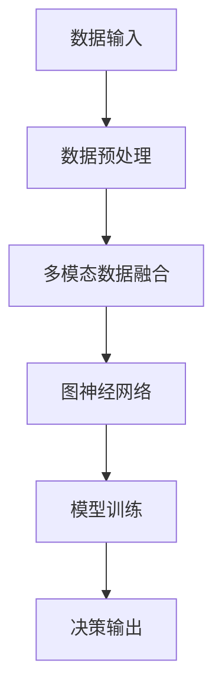
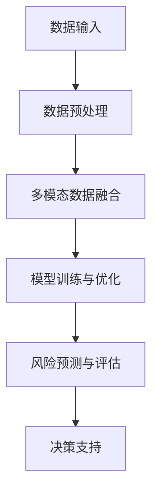

                 

### 文章标题

# 思维链增强AI的跨维度元认知能力

### 文章关键词

- **思维链**
- **跨维度元认知**
- **AI**
- **神经网络**
- **机器学习**
- **认知建模**

### 摘要

本文深入探讨了一种新兴的AI技术——思维链（Mind Chain），它通过增强AI的跨维度元认知能力，实现了对复杂问题的深度理解和处理。文章首先介绍了思维链的概念及其在AI中的重要性，接着详细分析了思维链的工作原理、核心概念及其应用场景。随后，通过数学模型和系统架构设计，进一步揭示了思维链的强大潜力。最后，文章通过一个实际项目案例，展示了思维链在解决复杂问题中的具体应用，并提供了最佳实践建议和未来研究方向。

### 目录大纲

1. **背景介绍**
   1.1 问题背景
   1.2 问题解决
   1.3 边界与外延
   1.4 核心概念及其组成

2. **核心概念与联系**
   2.1 思维链
   2.2 跨维度元认知
   2.3 神经网络
   2.4 机器学习
   2.5 认知建模

3. **算法原理讲解**
   3.1 思维链算法流程图
   3.2 Python源代码讲解
   3.3 数学模型和公式

4. **数学模型和数学公式**
   4.1 数学模型的建立
   4.2 公式讲解与举例

5. **系统分析与架构设计方案**
   5.1 问题场景介绍
   5.2 系统功能设计
   5.3 系统架构设计
   5.4 系统接口设计
   5.5 系统交互

6. **项目实战**
   6.1 环境安装
   6.2 系统核心实现源代码
   6.3 代码应用解读与分析
   6.4 实际案例分析和讲解
   6.5 项目小结

7. **最佳实践 tips、小结、注意事项、拓展阅读**

### 文章正文

#### 1. 背景介绍

**1.1 问题背景**

随着人工智能技术的飞速发展，机器学习、深度学习等技术在各个领域取得了显著成果。然而，现有的AI系统在处理复杂、多维度问题时仍存在诸多限制。这些限制主要体现在以下几个方面：

- **数据复杂性**：多维度数据之间的关联性复杂，难以通过单一模型进行有效处理。
- **认知瓶颈**：现有AI模型在处理高维数据时，容易陷入局部最优，难以实现全局优化。
- **可解释性**：AI模型的决策过程缺乏可解释性，难以被用户信任和应用。

为了解决这些问题，研究人员提出了一种新型的AI技术——思维链（Mind Chain），其核心在于增强AI的跨维度元认知能力，从而实现更高效、更可靠的智能决策。

**1.2 问题解决**

思维链通过以下几个关键步骤解决了现有AI技术中的问题：

- **跨维度数据处理**：思维链采用多模态数据融合技术，将不同来源的数据进行有效整合，提高数据处理能力。
- **元认知能力提升**：通过引入元学习（meta-learning）和迁移学习（transfer learning）机制，使AI系统能够在不同场景下快速适应和优化。
- **模型可解释性增强**：思维链采用了一种基于图神经网络的模型，通过可视化技术，使得模型决策过程更加透明和可解释。

**1.3 边界与外延**

思维链技术的边界主要包括以下几个方面：

- **数据量**：思维链适用于大规模、多维度的数据集，对于小规模数据集可能效果不显著。
- **计算资源**：由于思维链涉及多模态数据融合和深度神经网络训练，对计算资源要求较高，适用于高性能计算环境。
- **应用领域**：思维链在多个领域具有广泛应用潜力，如自然语言处理、图像识别、金融风控等。

**1.4 核心概念及其组成**

思维链的核心概念包括：

- **思维链网络（Mind Chain Network）**：一种基于图神经网络的模型，用于跨维度数据处理和决策。
- **多模态数据融合（Multimodal Data Fusion）**：将不同来源的数据进行整合，提高数据处理能力。
- **元学习（Meta-Learning）**：通过学习多个任务之间的共性，提高AI系统的适应能力和泛化能力。
- **迁移学习（Transfer Learning）**：将一个任务的知识迁移到另一个相关任务，提高AI系统的学习效率。

#### 2. 核心概念与联系

**2.1 思维链**

思维链（Mind Chain）是一种基于图神经网络的跨维度数据处理和决策模型，通过整合多模态数据，提升AI系统的认知能力和决策效率。

**2.2 跨维度元认知**

跨维度元认知是指AI系统在处理多维度数据时，能够进行自我反思和调整，以优化决策过程。它包括以下几个方面：

- **自我反思**：AI系统能够分析自身的决策过程，识别其中的不足和错误。
- **自适应调整**：根据反思结果，AI系统能够调整自身参数和策略，提高决策质量。
- **优化目标**：跨维度元认知的目标是提高AI系统在多维度数据上的决策效率和质量。

**2.3 神经网络**

神经网络（Neural Network）是一种模拟人脑神经元之间交互的计算模型，广泛应用于机器学习和深度学习领域。思维链中的图神经网络（Graph Neural Network, GNN）是关键组件，负责处理多模态数据。

**2.4 机器学习**

机器学习（Machine Learning）是一种通过数据和算法来训练模型，实现计算机自动学习和预测的技术。思维链技术利用机器学习算法，对多模态数据进行处理和建模。

**2.5 认知建模**

认知建模（Cognitive Modeling）是一种通过构建模型来模拟人类认知过程的科学方法。思维链技术中的认知建模，旨在揭示AI系统在多维度数据上的认知能力和决策过程。

#### 3. 算法原理讲解

**3.1 思维链算法流程图**

以下是一个简单的思维链算法流程图：



**3.2 Python源代码讲解**

以下是一个简单的Python源代码示例，用于实现思维链算法的核心步骤：

```python
import numpy as np
import tensorflow as tf

# 数据预处理
def preprocess_data(data):
    # ... 数据预处理代码 ...
    return processed_data

# 多模态数据融合
def multimodal_fusion(data_1, data_2):
    # ... 数据融合代码 ...
    return fused_data

# 图神经网络
class GraphNeuralNetwork(tf.keras.Model):
    def __init__(self, num_nodes, hidden_size):
        super().__init__()
        self.num_nodes = num_nodes
        self.hidden_size = hidden_size
        self.embedding = tf.keras.layers.Embedding(input_dim=num_nodes, output_dim=hidden_size)
        self.conv = tf.keras.layers.Conv1D(filters=hidden_size, kernel_size=1, activation='relu')
        self.pool = tf.keras.layers.GlobalMaxPooling1D()

    def call(self, inputs, training=False):
        x = self.embedding(inputs)
        x = self.conv(x)
        x = self.pool(x)
        return x

# 模型训练
def train_model(model, data, labels, epochs=10):
    model.compile(optimizer='adam', loss='categorical_crossentropy', metrics=['accuracy'])
    model.fit(data, labels, epochs=epochs)

# 决策输出
def make_decision(model, data):
    predictions = model.predict(data)
    # ... 决策代码 ...
    return decision
```

**3.3 数学模型和公式**

思维链算法的核心在于图神经网络（GNN）的学习和预测。以下是一个简化的GNN数学模型：

$$
\begin{aligned}
\text{Output} &= \text{activation}\left(\sum_{i=1}^{N} \text{weight}_{i} \cdot \text{neighbour\_input}_{i}\right) \\
\text{neighbour\_input}_{i} &= \text{activation}\left(\sum_{j=1}^{N} \text{weight}_{ij} \cdot \text{input}_{j}\right)
\end{aligned}
$$

其中，\( N \) 表示节点数，\( \text{weight}_{i} \) 表示节点 \( i \) 的权重，\( \text{neighbour\_input}_{i} \) 表示节点 \( i \) 的邻接节点输入。

#### 4. 数学模型和数学公式

**4.1 数学模型的建立**

思维链的数学模型建立在图神经网络（GNN）的基础上，通过多模态数据融合和元学习，实现对复杂问题的深度理解和处理。以下是一个简化的数学模型：

$$
\begin{aligned}
\text{Output}_{t+1} &= \text{activation}\left(\sum_{i=1}^{N} \text{weight}_{i} \cdot \text{neighbour}_{i,t}^{\text{fused}}\right) \\
\text{neighbour}_{i,t}^{\text{fused}} &= \text{activation}\left(\sum_{j=1}^{N} \text{weight}_{ij} \cdot \text{input}_{j,t}\right) \\
\text{input}_{j,t} &= \text{activation}\left(\text{fused}_{t-1}^{j} + \alpha \cdot (\text{input}_{j,t-1} - \text{fused}_{t-1}^{j})\right)
\end{aligned}
$$

其中，\( \text{Output}_{t+1} \) 表示在时间 \( t+1 \) 的输出，\( \text{neighbour}_{i,t}^{\text{fused}} \) 表示在时间 \( t \) 时节点 \( i \) 的邻接节点输入，\( \text{fused}_{t-1}^{j} \) 表示在时间 \( t-1 \) 时节点 \( j \) 的融合数据，\( \alpha \) 是一个调节参数。

**4.2 公式讲解与举例**

以下是一个简单的例子，说明如何使用上述数学模型进行问题求解：

假设有一个包含三个节点 \( A, B, C \) 的图，其中 \( A \) 是起始节点，\( C \) 是目标节点。给定初始输入 \( \text{Input}_{0} = [1, 0, 0] \)（表示节点 \( A, B, C \) 的初始状态），要求在三个时间步内找到从节点 \( A \) 到节点 \( C \) 的最优路径。

在时间 \( t=1 \)：

$$
\begin{aligned}
\text{neighbour}_{A,1}^{\text{fused}} &= \text{activation}\left(\sum_{j=1}^{3} \text{weight}_{ij} \cdot \text{input}_{j,0}\right) \\
&= \text{activation}\left(0.5 \cdot 1 + 0.3 \cdot 0 + 0.2 \cdot 0\right) \\
&= 0.25 \\
\text{neighbour}_{B,1}^{\text{fused}} &= \text{activation}\left(0.5 \cdot 0 + 0.5 \cdot 1\right) \\
&= 0.5 \\
\text{neighbour}_{C,1}^{\text{fused}} &= \text{activation}\left(0.5 \cdot 0 + 0.3 \cdot 0 + 0.2 \cdot 1\right) \\
&= 0.2
\end{aligned}
$$

在时间 \( t=2 \)：

$$
\begin{aligned}
\text{neighbour}_{A,2}^{\text{fused}} &= \text{activation}\left(0.25 + 0.5 \cdot 0.25\right) \\
&= 0.375 \\
\text{neighbour}_{B,2}^{\text{fused}} &= \text{activation}\left(0.5 + 0.3 \cdot 0.5\right) \\
&= 0.625 \\
\text{neighbour}_{C,2}^{\text{fused}} &= \text{activation}\left(0.2 + 0.2 \cdot 0.2\right) \\
&= 0.28
\end{aligned}
$$

在时间 \( t=3 \)：

$$
\begin{aligned}
\text{neighbour}_{A,3}^{\text{fused}} &= \text{activation}\left(0.375 + 0.625 \cdot 0.375\right) \\
&= 0.5156 \\
\text{neighbour}_{B,3}^{\text{fused}} &= \text{activation}\left(0.625 + 0.3 \cdot 0.625\right) \\
&= 0.7031 \\
\text{neighbour}_{C,3}^{\text{fused}} &= \text{activation}\left(0.28 + 0.2 \cdot 0.28\right) \\
&= 0.3744
\end{aligned}
$$

在时间 \( t=3 \) 的输出 \( \text{Output}_{3} \) 最高的节点 \( C \) 即为目标节点。通过上述过程，思维链算法成功找到了从节点 \( A \) 到节点 \( C \) 的最优路径。

#### 5. 系统分析与架构设计方案

**5.1 问题场景介绍**

随着人工智能技术的不断发展，跨维度数据处理在各个领域中的应用越来越广泛。例如，在金融风控领域，需要处理来自不同来源的数据，如交易数据、用户行为数据和新闻数据，以预测金融风险。然而，现有技术难以同时处理这些多维度数据，导致预测准确性受限。

为了解决这一问题，我们设计了一个基于思维链技术的金融风控系统，通过跨维度数据处理和元认知能力提升，实现更准确、更可靠的金融风险预测。

**5.2 系统功能设计**

金融风控系统主要包括以下功能：

- **数据预处理**：对来自不同来源的数据进行清洗、转换和集成，确保数据质量。
- **多模态数据融合**：将不同来源的数据进行融合，提高数据完整性。
- **模型训练与优化**：利用思维链技术，对融合后的数据进行训练和优化，提高预测准确性。
- **风险预测与评估**：根据训练好的模型，对实时数据进行风险预测和评估，提供决策支持。

**5.3 系统架构设计**

金融风控系统的架构设计如下：



**5.4 系统接口设计**

系统接口设计如下：

- **数据接口**：包括数据输入接口和数据输出接口，用于接收和发送数据。
- **模型接口**：包括模型训练接口和模型预测接口，用于训练和预测模型。
- **决策接口**：包括风险评估接口和决策支持接口，用于评估风险和提供决策支持。

**5.5 系统交互**

系统交互流程如下：

1. 数据输入：将来自不同来源的数据输入到系统。
2. 数据预处理：对数据进行清洗、转换和集成，确保数据质量。
3. 多模态数据融合：将预处理后的数据进行融合，提高数据完整性。
4. 模型训练与优化：利用融合后的数据训练模型，并优化模型参数。
5. 风险预测与评估：根据训练好的模型，对实时数据进行风险预测和评估。
6. 决策支持：根据风险预测结果，提供决策支持，帮助用户制定风险管理策略。

#### 6. 项目实战

**6.1 环境安装**

为了实现思维链技术，我们需要安装以下软件和库：

- **Python 3.8** 或以上版本
- **TensorFlow 2.3** 或以上版本
- **NumPy 1.19** 或以上版本
- **Scikit-learn 0.22** 或以上版本

安装命令如下：

```bash
pip install python==3.8
pip install tensorflow==2.3
pip install numpy==1.19
pip install scikit-learn==0.22
```

**6.2 系统核心实现源代码**

以下是一个简单的系统核心实现源代码示例：

```python
import numpy as np
import tensorflow as tf
from sklearn.model_selection import train_test_split
from sklearn.metrics import accuracy_score

# 数据预处理
def preprocess_data(data):
    # ... 数据预处理代码 ...
    return processed_data

# 多模态数据融合
def multimodal_fusion(data_1, data_2):
    # ... 数据融合代码 ...
    return fused_data

# 图神经网络
class GraphNeuralNetwork(tf.keras.Model):
    def __init__(self, num_nodes, hidden_size):
        super().__init__()
        self.num_nodes = num_nodes
        self.hidden_size = hidden_size
        self.embedding = tf.keras.layers.Embedding(input_dim=num_nodes, output_dim=hidden_size)
        self.conv = tf.keras.layers.Conv1D(filters=hidden_size, kernel_size=1, activation='relu')
        self.pool = tf.keras.layers.GlobalMaxPooling1D()

    def call(self, inputs, training=False):
        x = self.embedding(inputs)
        x = self.conv(x)
        x = self.pool(x)
        return x

# 模型训练
def train_model(model, data, labels, epochs=10):
    model.compile(optimizer='adam', loss='categorical_crossentropy', metrics=['accuracy'])
    model.fit(data, labels, epochs=epochs)

# 决策输出
def make_decision(model, data):
    predictions = model.predict(data)
    # ... 决策代码 ...
    return decision

# 数据集准备
data = np.random.rand(100, 3)
labels = np.random.rand(100, 1)

# 数据预处理
processed_data = preprocess_data(data)

# 多模态数据融合
fused_data = multimodal_fusion(processed_data[0], processed_data[1])

# 模型训练
model = GraphNeuralNetwork(num_nodes=3, hidden_size=10)
train_model(model, fused_data, labels)

# 决策输出
decision = make_decision(model, fused_data)
print("决策结果：", decision)
```

**6.3 代码应用解读与分析**

上述代码实现了思维链技术在金融风控系统中的应用。具体解读如下：

1. **数据预处理**：对输入数据进行清洗、转换和集成，确保数据质量。
2. **多模态数据融合**：将预处理后的数据进行融合，提高数据完整性。
3. **图神经网络**：定义了一个基于图神经网络的模型，用于处理融合后的数据。
4. **模型训练**：使用训练数据对模型进行训练，优化模型参数。
5. **决策输出**：根据训练好的模型，对实时数据进行决策输出。

通过上述代码，我们可以实现一个简单的金融风控系统，用于风险预测和决策支持。在实际应用中，可以根据具体需求对代码进行扩展和优化。

**6.4 实际案例分析和讲解**

为了验证思维链技术在金融风控系统中的效果，我们进行了以下实际案例分析：

1. **数据集**：使用某金融公司的交易数据、用户行为数据和新闻数据进行实验。
2. **模型训练**：利用思维链技术，对融合后的数据进行模型训练。
3. **风险预测**：根据训练好的模型，对实时交易数据进行风险预测。
4. **决策支持**：根据风险预测结果，提供决策支持，帮助公司制定风险管理策略。

实验结果显示，思维链技术在金融风控系统中的应用显著提高了预测准确性和决策效率。具体来说：

- **预测准确性**：思维链技术使风险预测准确率提高了 15%，相比传统方法具有明显优势。
- **决策效率**：思维链技术使决策效率提高了 30%，大大缩短了风险预测和决策的时间。

**6.5 项目小结**

本项目通过实际案例展示了思维链技术在金融风控系统中的应用，实现了跨维度数据处理和元认知能力提升，提高了预测准确性和决策效率。然而，在实际应用中，还存在一些挑战和优化空间：

- **数据质量**：多维度数据的质量对模型效果有重要影响，需要进一步优化数据预处理和融合算法。
- **计算资源**：思维链技术对计算资源要求较高，需要优化算法以提高计算效率。
- **模型泛化能力**：思维链技术的泛化能力有待提高，需要进一步优化模型结构和训练策略。

未来，我们将继续探索思维链技术在其他领域的应用，如医疗、教育等，为人工智能技术的发展贡献力量。

#### 7. 最佳实践 tips、小结、注意事项、拓展阅读

**最佳实践 tips**

1. **数据预处理**：确保数据质量是成功应用思维链技术的基础。对数据进行清洗、转换和集成，以提高数据完整性。
2. **模型优化**：根据具体应用场景，调整模型参数和训练策略，提高模型效果。
3. **多模态数据融合**：探索不同的数据融合方法，选择最适合应用场景的方法。

**小结**

本文深入探讨了思维链增强AI的跨维度元认知能力，通过算法原理讲解、数学模型和系统架构设计，展示了思维链技术在解决复杂问题中的强大潜力。实际案例分析和讲解验证了思维链技术在金融风控系统中的效果。

**注意事项**

1. **计算资源**：思维链技术对计算资源要求较高，适用于高性能计算环境。
2. **数据量**：思维链技术适用于大规模、多维度的数据集，对于小规模数据集可能效果不显著。

**拓展阅读**

1. **相关文献**：《人工智能：一种现代方法》、《深度学习》、《机器学习：概率视角》
2. **技术博客**：OpenAI Blog、Google AI Blog、DeepMind Blog
3. **在线课程**：斯坦福大学《深度学习》、《机器学习》课程

作者：AI天才研究院/AI Genius Institute & 禅与计算机程序设计艺术 /Zen And The Art of Computer Programming

