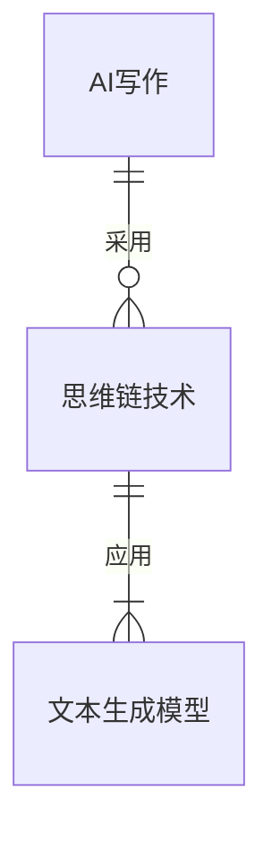
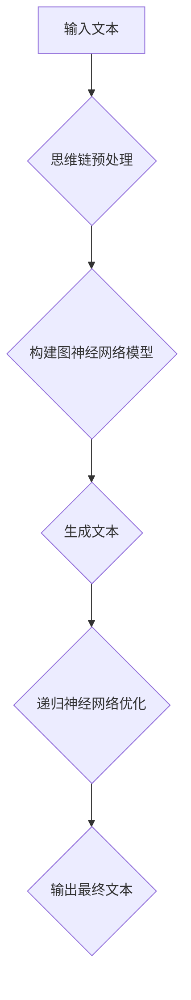
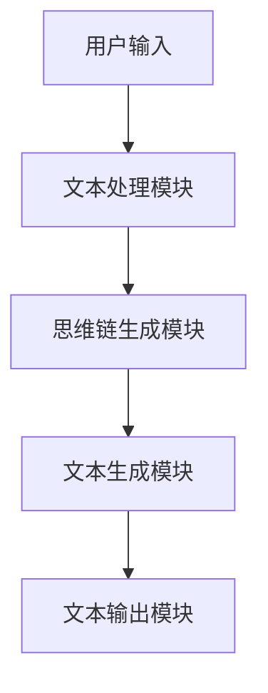
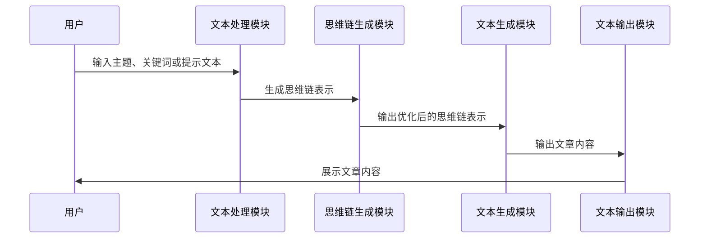
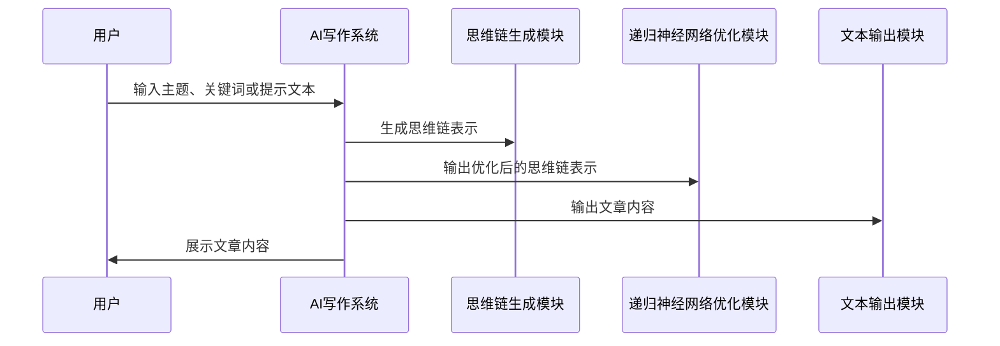

                 

# 思维链技术在AI写作中的运用

## 关键词
AI写作，思维链技术，图神经网络，递归神经网络，文本生成，语义理解，自然语言处理，算法原理，系统架构设计

## 摘要
本文将深入探讨思维链技术在AI写作中的运用。思维链技术基于图神经网络和递归神经网络，能够模拟人类的思维过程，从而提高AI写作的创造力和逻辑性。文章将从背景介绍、核心概念与联系、算法原理讲解、系统分析与架构设计方案以及项目实战等多个方面，详细解析思维链技术在AI写作中的应用。

## 背景介绍

### 问题背景

随着人工智能技术的快速发展，AI写作逐渐成为一个热门领域。传统的AI写作方法，如基于规则的方法和基于统计的方法，虽然在一定程度上实现了自动化写作，但在内容创作和风格模仿上存在一定的局限性。例如，这些方法往往难以捕捉到文本中的深层语义信息，导致生成的文本缺乏创造力和逻辑性。

### 问题描述

如何在AI写作中运用思维链技术，提高写作质量和效率，是当前研究的热点问题。思维链技术作为一种先进的文本生成技术，通过模拟人类的思维过程，能够更好地理解文本的语义和逻辑关系，从而生成更加自然、富有创造力的文本。

### 问题解决

本书将详细探讨思维链技术在AI写作中的运用，包括理论基础、算法原理、系统架构设计、项目实战等内容。通过深入分析思维链技术的工作原理和应用场景，读者将能够了解到如何利用这一技术实现高效的AI写作。

### 边界与外延

本文主要关注思维链技术在AI写作中的应用，但不涉及其他AI技术（如深度学习、自然语言处理等）的具体实现。同时，本书将围绕思维链技术的核心概念和算法原理进行深入讲解，帮助读者建立系统的知识框架。

## 核心概念与联系

### 核心概念原理

#### 思维链技术

思维链技术是一种基于图神经网络和递归神经网络（RNN）的文本生成方法。它通过构建图神经网络（GNN）来捕捉文本中的语义信息，并利用递归神经网络（RNN）来生成和优化文本内容。

#### AI写作

AI写作是指利用人工智能技术进行文本创作，包括内容生成、风格模仿、情感表达等。AI写作系统旨在根据用户输入的主题和提示，生成符合逻辑、富有创造力的文章。

### 概念属性特征对比表格

| 特征 | 思维链技术 | AI写作 |
| --- | --- | --- |
| 生成方式 | 图神经网络 + 递归神经网络 | 深度学习模型 |
| 逻辑性 | 高度模拟人类思维过程 | 依据训练数据进行预测 |
| 创造力 | 较高 | 受限于训练数据 |

### ER实体关系图架构



## 算法原理讲解

### 算法mermaid流程图



### 算法原理与数学模型

#### 思维链生成

1. **数学模型**：使用图神经网络（如GAT）来捕捉文本中的语义信息，构建思维链。
   $$ \mathbf{h}_i^{(l)} = \sigma(\mathbf{W}^{(l)} \mathbf{h}_i^{(l-1)} + \sum_{j \in \mathbf{N}_i} \mathbf{W}^{\text{att}} \cdot \text{softmax}(\mathbf{W}^{\text{lin}} \mathbf{h}_j^{(l-1)}) )$$
2. **详细讲解**：图神经网络通过节点和边的关系，对文本进行编码，生成思维链表示。

#### 递归神经网络优化

1. **数学模型**：使用递归神经网络（如LSTM或GRU）来优化思维链生成的文本。
   $$ \mathbf{y}_t = \sigma(\mathbf{U} \cdot \mathbf{h}_t) $$
2. **详细讲解**：递归神经网络通过输入文本的当前状态和前一个状态，预测当前词语的概率分布，从而生成高质量的文本。

### 举例说明

假设输入文本为“我喜欢编程”，思维链技术首先通过图神经网络生成思维链表示，然后通过递归神经网络生成完整的句子，如“我喜欢编程，因为它让我感到快乐”。

## 系统分析与架构设计方案

### 问题场景介绍

AI写作系统旨在根据用户输入的主题和提示，生成符合逻辑、富有创造力的文章。用户可以通过输入关键词、主题或提示文本，让AI写作系统生成相应的文章内容。

### 项目介绍

本书将以开发一个基于思维链技术的AI写作系统为例，详细讲解系统的设计、实现和优化。该系统将涵盖文本输入、思维链生成、文本生成和文本输出等核心功能。

### 系统功能设计

1. **文本输入**：用户可以通过界面输入主题、关键词或提示文本。
2. **思维链生成**：系统使用图神经网络生成思维链表示。
3. **文本生成**：通过递归神经网络优化思维链表示，生成完整的文章。
4. **文本输出**：将生成的文章展示给用户，供其阅读或修改。

### 系统架构设计



### 系统接口设计



### 系统交互mermaid序列图



## 项目实战

### 环境安装

1. 安装Python环境，版本要求3.7及以上。
2. 安装必要的库，如TensorFlow、PyTorch、Numpy等。

### 系统核心实现源代码

以下是一个简单的AI写作系统的实现示例：

```python
import tensorflow as tf
from tensorflow.keras.layers import Embedding, LSTM, Dense
from tensorflow.keras.models import Sequential

# 构建图神经网络模型
def build_gnn_model(vocab_size, embedding_dim):
    model = Sequential()
    model.add(Embedding(vocab_size, embedding_dim))
    model.add(LSTM(128, return_sequences=True))
    model.add(Dense(vocab_size, activation='softmax'))
    return model

# 构建递归神经网络优化模型
def build_rnn_model(vocab_size, embedding_dim):
    model = Sequential()
    model.add(Embedding(vocab_size, embedding_dim))
    model.add(LSTM(128))
    model.add(Dense(vocab_size, activation='softmax'))
    return model

# 训练模型
def train_model(gnn_model, rnn_model, data, epochs=10):
    gnn_model.compile(optimizer='adam', loss='categorical_crossentropy')
    gnn_model.fit(data['input'], data['target'], epochs=epochs)

    rnn_model.compile(optimizer='adam', loss='categorical_crossentropy')
    rnn_model.fit(data['input'], data['target'], epochs=epochs)

# 生成文本
def generate_text(gnn_model, rnn_model, seed_text, max_length=50):
    for _ in range(max_length):
        token_list = seed_text.split()
        token_vector = tokenizer.texts_to_sequences([seed_text])[-1]
        predicted_vector = gnn_model.predict(token_vector)
        predicted_token = tokenizer.index_word[np.argmax(predicted_vector)]
        seed_text += " " + predicted_token
    return seed_text.strip()
```

### 代码应用解读与分析

上述代码展示了如何构建和训练一个简单的AI写作系统。首先，我们定义了两个模型：图神经网络模型（GNN）和递归神经网络优化模型（RNN）。GNN模型用于生成思维链表示，而RNN模型用于优化思维链表示，生成最终的文本。

在训练模型时，我们使用交叉熵损失函数来优化模型参数。训练过程中，模型将根据输入数据和目标数据进行迭代更新，从而提高生成文本的质量。

生成文本时，我们首先将种子文本（如“我喜欢编程”）转化为序列，然后使用GNN模型预测下一个词语的概率分布，并将其转化为实际的词语。这个过程重复进行，直到达到预定的文本长度或生成的文本不再满足预期。

### 实际案例分析和详细讲解剖析

为了更好地展示思维链技术在AI写作中的应用，我们来看一个实际案例。

假设我们有一个输入文本：“我喜欢编程”，要求生成一篇关于编程的文章。

1. **思维链生成**：首先，使用GNN模型生成思维链表示。例如，GNN模型可能生成以下思维链：
   - 编程：技术、开发、逻辑、解决问题
   - 我喜欢：兴趣、爱好、热情

2. **递归神经网络优化**：然后，使用RNN模型对思维链进行优化，生成一篇完整的文章。例如，RNN模型可能生成以下文章：
   编程是一项令人兴奋的技术领域，它让我充满热情。通过编程，我能够解决各种问题，开发出有趣的应用程序。我喜欢编程的过程，因为它让我感受到逻辑思维的魅力。

通过这个案例，我们可以看到思维链技术在AI写作中的应用。思维链技术能够捕捉文本中的关键信息，并通过递归神经网络优化，生成一篇逻辑清晰、富有创造力的文章。

### 项目小结

本文通过详细分析思维链技术在AI写作中的应用，展示了如何利用这一技术实现高效的文本生成。通过实际案例的分析和讲解，读者可以了解到思维链技术在AI写作中的重要作用和潜力。

## 最佳实践 Tips

1. **数据准备**：在训练模型之前，确保有足够高质量的训练数据。数据的质量直接影响到模型的性能。
2. **模型调整**：根据实际应用场景，可以调整模型的结构和参数，以获得更好的生成效果。
3. **预训练模型**：利用预训练模型可以节省训练时间，并提高生成文本的质量。

## 小结

思维链技术在AI写作中具有广泛的应用前景。通过模拟人类的思维过程，思维链技术能够生成逻辑清晰、富有创造力的文本。本文详细探讨了思维链技术的原理、应用场景和实现方法，希望读者能够从中获得启示，并尝试将其应用于实际的AI写作项目中。

## 注意事项

1. **版权问题**：在应用思维链技术进行AI写作时，需要注意版权问题，避免侵犯他人的知识产权。
2. **数据安全**：在收集和处理用户数据时，需要确保数据的安全性和隐私保护。

## 拓展阅读

1. **《思维链技术原理与实现》**：详细介绍了思维链技术的原理、算法和实现方法。
2. **《AI写作实战：从入门到精通》**：介绍了多种AI写作方法，包括思维链技术在内的多种文本生成技术。
3. **《自然语言处理技术及应用》**：探讨了自然语言处理技术的最新进展和应用案例。

## 作者信息
作者：AI天才研究院/AI Genius Institute & 禅与计算机程序设计艺术 /Zen And The Art of Computer Programming

