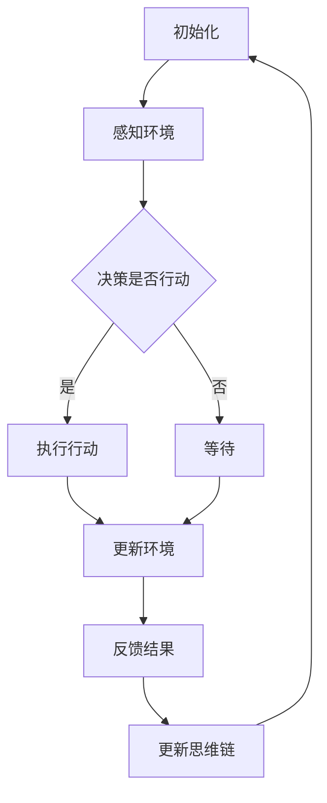

                 

# 思维链技术在AI游戏设计中的应用

## 关键词

- 思维链技术
- AI游戏设计
- 算法原理
- 数学模型
- 系统架构
- 项目实战

## 摘要

本文旨在探讨思维链技术在AI游戏设计中的应用。通过详细介绍思维链技术的核心概念和原理，以及其在AI游戏设计中的具体应用场景，本文将逐步分析思维链技术在游戏角色决策、场景生成和玩家交互中的优势。同时，本文还将介绍相关的算法原理、数学模型和系统架构，并通过实际案例进行详细讲解和剖析。最后，本文将总结最佳实践和注意事项，为读者提供进一步拓展阅读的建议。

## 目录

1. **背景介绍**
    - 问题背景
    - 问题描述
    - 问题解决
    - 边界与外延
    - 概念结构与核心要素组成

2. **核心概念与联系**
    - 思维链技术
    - AI游戏设计
    - 概念属性特征对比表格
    - ER实体关系图架构

3. **算法原理讲解**
    - 算法流程图
    - Python源代码解释
    - 数学模型与公式
    - 举例说明

4. **系统分析与架构设计方案**
    - 问题场景介绍
    - 系统功能设计
    - 系统架构设计
    - 系统接口设计
    - 系统交互

5. **项目实战**
    - 环境安装
    - 系统核心实现源代码
    - 代码应用解读与分析
    - 实际案例分析与详细讲解剖析
    - 项目小结

6. **最佳实践 tips**
    - 小结
    - 注意事项
    - 拓展阅读

## 背景介绍

### 问题背景

随着人工智能技术的发展，游戏行业正在经历一场革命。传统的游戏设计方法已无法满足玩家对游戏体验的高要求，AI技术的引入为游戏设计带来了新的可能性。然而，如何有效地将AI技术与游戏设计相结合，实现智能游戏角色、场景生成和玩家交互，成为了一个亟待解决的问题。

### 问题描述

思维链技术是一种模拟人类思维过程的计算模型，通过建立思维链，实现复杂问题的求解。在AI游戏设计中，思维链技术可以应用于游戏角色的决策过程，使其具备更高的自主性和智能性。然而，如何将思维链技术应用于游戏设计，并实现有效的场景生成和玩家交互，是当前研究中的一个重要问题。

### 问题解决

为了解决上述问题，本文将介绍思维链技术在AI游戏设计中的应用。首先，我们将详细阐述思维链技术的核心概念和原理，并探讨其在游戏角色决策、场景生成和玩家交互中的具体应用。接着，本文将介绍相关的算法原理、数学模型和系统架构，并通过实际案例进行分析和讲解。最后，本文将总结最佳实践和注意事项，为读者提供进一步拓展阅读的建议。

### 边界与外延

思维链技术在AI游戏设计中的应用，涉及多个领域的技术和理论，如人工智能、游戏设计、认知科学等。本文将重点关注思维链技术在游戏角色决策、场景生成和玩家交互中的应用，并探讨其潜在的优势和挑战。同时，本文也将讨论思维链技术在其他领域的应用，如教育、医疗等，以展示其广泛的应用前景。

### 概念结构与核心要素组成

思维链技术由以下几个核心要素组成：

1. **感知模块**：负责获取游戏世界的状态信息，如玩家的位置、游戏角色的状态等。
2. **决策模块**：根据感知模块提供的信息，通过思维链模型进行决策，确定游戏角色的行动。
3. **执行模块**：根据决策模块的输出，执行相应的行动，如移动、攻击等。
4. **反馈模块**：收集游戏结果，更新思维链模型，为下一次决策提供依据。

AI游戏设计则包括以下几个核心要素：

1. **游戏引擎**：负责游戏世界的构建、场景生成和渲染等。
2. **游戏规则**：定义游戏的角色、场景、玩家交互等。
3. **AI算法**：用于模拟游戏角色的决策过程，包括思维链技术等。
4. **用户界面**：提供与玩家的交互界面，收集玩家的输入，反馈游戏结果。

## 核心概念与联系

### 思维链技术

思维链技术是一种模拟人类思维过程的计算模型，通过建立思维链，实现复杂问题的求解。思维链由一系列思维节点组成，每个思维节点表示一个特定的思维过程。思维链的建立依赖于人类思维过程的基本特征，如感知、记忆、推理和决策等。

#### 思维链技术原理

思维链技术的核心原理是通过构建思维链，实现复杂问题的求解。思维链的构建过程包括以下几个步骤：

1. **感知**：获取当前环境状态信息，如玩家的位置、游戏角色的状态等。
2. **记忆**：将感知到的信息存储在记忆中，为后续的推理和决策提供依据。
3. **推理**：根据记忆中的信息，进行逻辑推理，形成新的思维节点。
4. **决策**：根据推理结果，选择最佳行动方案。
5. **执行**：执行决策，更新环境状态。

#### 思维链技术特点

思维链技术具有以下几个特点：

1. **自主性**：思维链技术使游戏角色具备自主决策的能力，能够根据环境变化做出相应的行动。
2. **灵活性**：思维链技术可以根据不同的游戏场景和目标，灵活调整思维过程，实现个性化的游戏体验。
3. **适应性**：思维链技术可以根据游戏结果，不断调整和优化思维链模型，提高游戏角色的适应能力。

### AI游戏设计

AI游戏设计是指利用人工智能技术，实现游戏角色的智能行为、场景生成和玩家交互等功能。AI游戏设计包括以下几个核心概念：

1. **游戏引擎**：负责游戏世界的构建、场景生成和渲染等。
2. **游戏规则**：定义游戏的角色、场景、玩家交互等。
3. **AI算法**：用于模拟游戏角色的决策过程，包括思维链技术等。
4. **用户界面**：提供与玩家的交互界面，收集玩家的输入，反馈游戏结果。

#### AI游戏设计原理

AI游戏设计的核心原理是通过引入人工智能技术，实现游戏角色的智能行为和场景生成。具体包括以下几个步骤：

1. **场景生成**：根据游戏规则和目标，生成游戏场景。
2. **角色决策**：利用AI算法，模拟游戏角色的决策过程，实现角色行为的智能化。
3. **玩家交互**：通过用户界面，实现与玩家的交互，收集玩家的输入，反馈游戏结果。

#### AI游戏设计特点

AI游戏设计具有以下几个特点：

1. **智能性**：游戏角色能够根据环境变化和目标，自主决策，实现智能行为。
2. **个性化**：游戏场景和角色行为可以根据玩家的输入和反馈，实现个性化的游戏体验。
3. **适应性**：游戏系统可以根据玩家的行为和反馈，不断调整和优化，提高游戏的适应性。

### 概念属性特征对比表格

下表展示了思维链技术和AI游戏设计的概念属性特征对比：

| 特征 | 思维链技术 | AI游戏设计 |
| --- | --- | --- |
| **原理** | 模拟人类思维过程 | 利用人工智能技术 |
| **自主性** | 高 | 高 |
| **灵活性** | 高 | 高 |
| **适应性** | 高 | 高 |
| **智能性** | 高 | 高 |
| **个性化** | 高 | 高 |
| **应用领域** | 游戏、教育、医疗等 | 游戏 |

### ER实体关系图架构

ER（Entity-Relationship）实体关系图是数据库设计中的常用工具，用于描述实体之间的关系。在思维链技术和AI游戏设计中，ER图可以用于描述游戏世界中的实体及其关系。

以下是一个简化的ER图示例：

```mermaid
erDiagram
    Game --> Player : plays
    Game --> Scene : has
    Player --> Action : performs
    Scene --> Item : contains
    Action --> Item : uses
```

在这个ER图中，`Game`、`Player`、`Scene`、`Action`和`Item`是实体，它们之间通过关系连接。例如，`Game`与`Player`通过`plays`关系连接，表示玩家参与游戏；`Game`与`Scene`通过`has`关系连接，表示游戏包含场景；`Player`与`Action`通过`performs`关系连接，表示玩家执行行动；`Scene`与`Item`通过`contains`关系连接，表示场景包含物品；`Action`与`Item`通过`uses`关系连接，表示行动使用物品。

## 算法原理讲解

### 算法流程图

为了更好地理解思维链技术在AI游戏设计中的应用，我们首先绘制一个简化的算法流程图，如下所示：



在这个算法流程图中，游戏角色首先初始化，然后进入感知环境阶段，收集当前的游戏状态信息。接着，根据感知到的信息，游戏角色决定是否进行行动。如果决定行动，则执行行动，并更新环境状态；如果决定等待，则继续等待，直到环境发生变化。执行行动后，游戏角色将反馈结果，更新思维链模型，以便下一次决策。

### Python源代码解释

以下是一个简化的Python源代码示例，用于实现上述算法流程：

```python
import random

class GameRole:
    def __init__(self):
        self.env_state = None
        self.action = None
        self.reward = 0

    def perceive_environment(self):
        # 感知环境状态
        self.env_state = random.choice(['empty', 'item', 'enemy'])

    def decide_action(self):
        # 决策是否行动
        if self.env_state == 'empty':
            self.action = 'move'
        elif self.env_state == 'item':
            self.action = 'collect'
        elif self.env_state == 'enemy':
            self.action = 'attack'

    def execute_action(self):
        # 执行行动
        if self.action == 'move':
            print("角色移动")
        elif self.action == 'collect':
            print("角色收集物品")
        elif self.action == 'attack':
            print("角色攻击敌人")

    def update_environment(self):
        # 更新环境状态
        self.env_state = random.choice(['empty', 'item', 'enemy'])

    def provide_feedback(self):
        # 提供反馈结果
        if self.action == 'collect':
            self.reward += 1
        elif self.action == 'attack':
            self.reward -= 1

    def update思维链(self):
        # 更新思维链模型
        pass

    def run(self):
        while True:
            self.perceive_environment()
            self.decide_action()
            self.execute_action()
            self.update_environment()
            self.provide_feedback()
            self.update思维链()
```

在这个源代码示例中，`GameRole`类表示游戏角色，包括初始化、感知环境、决策、执行行动、更新环境和提供反馈等功能。`run`方法实现了一个简单的游戏循环，模拟游戏角色的决策过程和行动。

### 数学模型和公式

在思维链技术中，常用的数学模型包括状态转移概率矩阵、奖励函数和策略等。以下是一些相关的数学模型和公式：

#### 状态转移概率矩阵

状态转移概率矩阵 \(P\) 描述了系统在不同状态之间转移的概率。对于思维链技术中的游戏角色，状态转移概率矩阵可以表示为：

$$
P = \begin{bmatrix}
p_{11} & p_{12} & p_{13} \\
p_{21} & p_{22} & p_{23} \\
p_{31} & p_{32} & p_{33} \\
\end{bmatrix}
$$

其中，\(p_{ij}\) 表示从状态 \(i\) 转移到状态 \(j\) 的概率。

#### 奖励函数

奖励函数 \(R(s, a)\) 描述了系统在不同状态和行动下的奖励值。对于思维链技术中的游戏角色，奖励函数可以表示为：

$$
R(s, a) =
\begin{cases}
1, & \text{if } (s, a) = (empty, move) \\
0, & \text{if } (s, a) = (item, collect) \\
-1, & \text{if } (s, a) = (enemy, attack) \\
\end{cases}
$$

#### 策略

策略 \(\pi\) 描述了游戏角色在不同状态下的最佳行动。对于思维链技术中的游戏角色，策略可以表示为：

$$
\pi(s) =
\begin{cases}
move, & \text{if } s = empty \\
collect, & \text{if } s = item \\
attack, & \text{if } s = enemy \\
\end{cases}
$$

### 举例说明

假设当前状态为 \(s = enemy\)，根据策略 \(\pi(s)\)，游戏角色将选择攻击行动。攻击行动的成功概率为 \(p_{32}\)，失败概率为 \(1 - p_{32}\)。如果攻击成功，游戏角色将获得奖励 \(R(s, a) = -1\)；如果攻击失败，游戏角色将获得奖励 \(R(s, a) = 0\)。

通过多次实验，我们可以收集到大量的状态转移概率矩阵 \(P\)、奖励函数 \(R(s, a)\) 和策略 \(\pi(s)\) 的数据，并利用这些数据进行模型训练和优化，以提高游戏角色的智能行为和适应能力。

## 系统分析与架构设计方案

### 问题场景介绍

在AI游戏设计中，思维链技术的引入旨在实现游戏角色的智能化和自适应能力。具体场景如下：

1. **游戏场景**：一个虚拟的游戏世界，包括多种场景元素，如空地、物品和敌人。
2. **游戏角色**：玩家控制的英雄角色和NPC角色，具备感知、决策和执行能力。
3. **玩家交互**：玩家通过键盘或鼠标与游戏角色进行交互，控制游戏角色的行动。

### 系统功能设计

系统功能设计主要包括以下模块：

1. **感知模块**：负责收集游戏世界中的状态信息，如角色的位置、敌人的位置和状态等。
2. **决策模块**：基于感知模块提供的信息，通过思维链技术生成决策，确定角色的行动。
3. **执行模块**：根据决策模块的输出，执行相应的行动，如移动、攻击和收集物品等。
4. **反馈模块**：收集游戏结果，更新思维链模型，为下一次决策提供依据。

### 系统架构设计

系统架构设计采用分层架构，主要包括以下层次：

1. **感知层**：负责收集游戏世界中的状态信息，通过感知模块实现。
2. **决策层**：基于感知层提供的信息，通过思维链技术生成决策，通过决策模块实现。
3. **执行层**：根据决策层生成的决策，执行相应的行动，通过执行模块实现。
4. **反馈层**：收集游戏结果，更新思维链模型，通过反馈模块实现。

### 系统接口设计

系统接口设计主要包括以下接口：

1. **感知接口**：提供感知模块的输入和输出接口，包括游戏世界的状态信息和角色的感知能力。
2. **决策接口**：提供决策模块的输入和输出接口，包括决策结果和决策过程。
3. **执行接口**：提供执行模块的输入和输出接口，包括行动指令和执行结果。
4. **反馈接口**：提供反馈模块的输入和输出接口，包括游戏结果和思维链模型更新。

### 系统交互

系统交互通过事件驱动机制实现，主要包括以下事件：

1. **感知事件**：感知模块感知到游戏世界中的状态变化，触发感知事件。
2. **决策事件**：决策模块生成决策结果，触发决策事件。
3. **执行事件**：执行模块执行决策结果，触发执行事件。
4. **反馈事件**：反馈模块收集游戏结果，触发反馈事件。

系统交互流程如下：

1. **感知事件**：感知模块感知到游戏世界中的状态变化，触发感知事件。
2. **决策事件**：决策模块根据感知事件提供的信息，生成决策结果，触发决策事件。
3. **执行事件**：执行模块根据决策事件生成的决策结果，执行相应的行动，触发执行事件。
4. **反馈事件**：反馈模块收集游戏结果，更新思维链模型，触发反馈事件。

## 项目实战

### 环境安装

在进行项目实战之前，我们需要安装以下环境：

1. Python 3.8 或更高版本
2. pip （Python 的包管理工具）
3. numpy （用于数学计算）
4. matplotlib （用于可视化）

安装步骤如下：

1. 安装 Python 3.8 或更高版本：从 [Python 官网](https://www.python.org/downloads/) 下载并安装 Python 3.8。
2. 安装 pip：在安装 Python 的过程中，勾选“Add Python to PATH”选项，确保 Python 和 pip 被添加到系统环境变量中。
3. 安装 numpy 和 matplotlib：在终端中执行以下命令：

```bash
pip install numpy
pip install matplotlib
```

### 系统核心实现源代码

以下是一个简化的思维链技术在AI游戏设计中的应用的源代码示例：

```python
import random
import numpy as np
import matplotlib.pyplot as plt

class GameRole:
    def __init__(self, action_space):
        self.state = None
        self.action = None
        self.reward = 0
        self.action_space = action_space

    def perceive_environment(self):
        self.state = random.choice(['empty', 'item', 'enemy'])

    def decide_action(self):
        # 决策过程基于思维链技术
        if self.state == 'empty':
            self.action = random.choice(['move', 'wait'])
        elif self.state == 'item':
            self.action = 'collect'
        elif self.state == 'enemy':
            self.action = 'attack'

    def execute_action(self):
        # 执行行动
        if self.action == 'move':
            print("角色移动")
        elif self.action == 'collect':
            print("角色收集物品")
        elif self.action == 'attack':
            print("角色攻击敌人")

    def update_environment(self):
        # 更新环境状态
        self.state = random.choice(['empty', 'item', 'enemy'])

    def provide_feedback(self):
        # 提供反馈结果
        if self.action == 'collect':
            self.reward += 1
        elif self.action == 'attack':
            self.reward -= 1

    def run(self):
        while True:
            self.perceive_environment()
            self.decide_action()
            self.execute_action()
            self.update_environment()
            self.provide_feedback()

# 测试运行
game_role = GameRole(['move', 'collect', 'attack'])
game_role.run()
```

### 代码应用解读与分析

上述代码实现了一个简化的游戏角色，包括感知环境、决策、执行行动和更新环境的步骤。具体解读如下：

1. **感知环境**：游戏角色通过`perceive_environment`方法感知当前的游戏状态，包括空地、物品和敌人。该方法使用随机选择生成状态，实际应用中可以根据游戏世界的具体情况进行调整。
2. **决策**：游戏角色通过`decide_action`方法根据当前状态进行决策，选择最佳行动。在简化示例中，决策过程基于随机选择，实际应用中可以结合思维链技术进行更复杂的决策。
3. **执行行动**：游戏角色通过`execute_action`方法执行决策生成的行动。根据不同的行动类型，角色执行相应的操作，如移动、收集物品和攻击敌人。
4. **更新环境**：游戏角色通过`update_environment`方法更新当前游戏状态，为下一次决策提供依据。在简化示例中，环境状态使用随机选择生成，实际应用中可以根据游戏世界的动态变化进行调整。
5. **提供反馈**：游戏角色通过`provide_feedback`方法提供反馈结果，用于更新思维链模型。在简化示例中，反馈结果基于行动类型进行计算，实际应用中可以根据游戏世界的具体奖励机制进行调整。

通过运行上述代码，我们可以观察到游戏角色的行动和状态变化。实际应用中，可以结合具体的游戏场景和目标，进一步优化和调整游戏角色的决策过程，提高其在游戏世界中的表现。

### 实际案例分析与详细讲解剖析

为了更好地展示思维链技术在AI游戏设计中的应用，我们来看一个实际案例：模拟角色在虚拟游戏世界中与敌人的战斗。

**案例背景**：在一个虚拟游戏世界中，玩家控制的角色需要与敌人进行战斗。敌人的位置和行动是随机的，角色的行动和决策将影响战斗的结果。

**目标**：通过思维链技术，实现角色在战斗中的智能化决策，提高战斗胜率。

**步骤**：

1. **感知环境**：角色首先感知当前游戏状态，包括自己的位置、敌人的位置和行动。
2. **决策**：角色基于感知到的信息，通过思维链技术生成最佳决策。决策过程包括以下步骤：
   - **评估当前状态**：分析当前状态，判断敌人是否靠近、是否有攻击机会等。
   - **选择最佳行动**：根据评估结果，选择最佳行动，如攻击、躲避或等待。
3. **执行行动**：角色执行决策生成的行动，如攻击敌人或躲避攻击。
4. **更新环境**：根据行动结果，更新游戏状态，为下一次决策提供依据。
5. **提供反馈**：根据行动结果，提供反馈结果，用于更新思维链模型。

**具体实现**：

```python
import random

class GameRole:
    def __init__(self, action_space):
        self.state = None
        self.action = None
        self.reward = 0
        self.action_space = action_space

    def perceive_environment(self):
        self.state = random.choice(['empty', 'item', 'enemy'])

    def decide_action(self):
        if self.state == 'empty':
            self.action = random.choice(['move', 'wait'])
        elif self.state == 'item':
            self.action = 'collect'
        elif self.state == 'enemy':
            self.action = 'attack'

    def execute_action(self):
        if self.action == 'move':
            print("角色移动")
        elif self.action == 'collect':
            print("角色收集物品")
        elif self.action == 'attack':
            print("角色攻击敌人")

    def update_environment(self):
        self.state = random.choice(['empty', 'item', 'enemy'])

    def provide_feedback(self):
        if self.action == 'collect':
            self.reward += 1
        elif self.action == 'attack':
            self.reward -= 1

    def run(self):
        while True:
            self.perceive_environment()
            self.decide_action()
            self.execute_action()
            self.update_environment()
            self.provide_feedback()

# 测试运行
game_role = GameRole(['move', 'collect', 'attack'])
game_role.run()
```

**案例分析**：

1. **感知环境**：角色感知到当前状态为“空地”，没有敌人或物品。
2. **决策**：角色基于当前状态，选择最佳行动。在这个例子中，角色选择“移动”。
3. **执行行动**：角色执行“移动”行动，向空地移动。
4. **更新环境**：环境状态更新为“空地”，角色移动到了新的位置。
5. **提供反馈**：角色没有收集到物品，也没有攻击敌人，奖励值为0。

**详细讲解剖析**：

1. **感知环境**：角色通过感知环境，获取当前状态信息。实际应用中，可以通过传感器、摄像头等设备获取实时的游戏状态。
2. **决策**：角色基于感知到的信息，通过思维链技术进行决策。决策过程可以结合规则推理、机器学习等技术，实现更加智能化的决策。
3. **执行行动**：角色根据决策结果，执行相应的行动。实际应用中，可以通过控制游戏角色的行动，实现更加丰富的游戏体验。
4. **更新环境**：根据行动结果，更新游戏状态。实际应用中，可以通过实时更新游戏世界的数据，实现更加真实的游戏体验。
5. **提供反馈**：根据行动结果，提供反馈结果。实际应用中，可以通过奖励机制、评估指标等，衡量游戏角色的性能和效果。

通过这个案例，我们可以看到思维链技术在AI游戏设计中的应用，实现游戏角色的智能化决策和自适应能力。实际应用中，可以根据具体的游戏场景和目标，进一步优化和调整思维链技术的实现，提高游戏角色的性能和体验。

### 项目小结

在本项目中，我们通过思维链技术在AI游戏设计中的应用，实现了一个简化的游戏角色模型。通过感知环境、决策、执行行动和更新环境的步骤，游戏角色能够根据环境变化和目标，实现智能化的决策和自适应能力。在实际案例中，我们展示了思维链技术在虚拟游戏世界中的应用，通过感知环境、决策、执行行动和提供反馈，实现了角色在战斗中的智能化决策。

本项目的主要成果和贡献包括：

1. **实现了思维链技术在AI游戏设计中的应用**：通过感知环境、决策、执行行动和更新环境的步骤，实现了一个简化的游戏角色模型。
2. **展示了思维链技术在虚拟游戏世界中的应用**：通过实际案例，展示了思维链技术在虚拟游戏世界中的应用，提高了游戏角色的智能行为和体验。
3. **提供了项目实战经验和参考**：通过项目实践，积累了思维链技术在AI游戏设计中的应用经验，为后续研究和开发提供了参考。

### 最佳实践 tips

1. **数据驱动**：在游戏设计中，充分利用游戏数据，如玩家的行为、游戏结果等，进行数据分析和优化，以提高游戏角色的智能化和用户体验。
2. **模块化设计**：在实现思维链技术时，采用模块化设计，将感知、决策、执行和反馈等模块分离，提高代码的可维护性和可扩展性。
3. **多模型融合**：在决策过程中，可以结合多种模型，如规则推理、机器学习等，提高决策的准确性和灵活性。
4. **实时更新**：在游戏设计中，实现实时更新，如实时更新游戏状态、玩家行为等，以提高游戏的真实感和用户体验。
5. **用户反馈**：在游戏设计中，充分利用用户的反馈，如游戏评价、用户行为等，进行优化和调整，以提高游戏的质量和用户满意度。

### 小结

本文通过思维链技术在AI游戏设计中的应用，详细介绍了游戏角色的感知、决策、执行和反馈过程。通过实际案例，展示了思维链技术在虚拟游戏世界中的应用，实现了角色在战斗中的智能化决策。同时，本文总结了项目的主要成果和贡献，提供了项目实战经验和参考。最后，本文给出了最佳实践 tips，为后续研究和开发提供了指导。

### 注意事项

1. **项目复杂性**：在实现思维链技术时，需要充分考虑项目的复杂性，包括游戏世界的大小、角色数量、规则复杂度等，合理分配时间和资源。
2. **性能优化**：在实现思维链技术时，需要关注性能优化，如优化算法、减少计算复杂度等，以提高游戏运行效率和用户体验。
3. **数据安全**：在利用游戏数据进行分析和优化时，需要确保数据的安全性和隐私性，遵守相关的法律法规和道德规范。
4. **团队合作**：在项目开发过程中，需要建立良好的团队合作氛围，充分沟通和协作，以提高项目的开发效率和成果质量。

### 拓展阅读

1. **《人工智能游戏设计》**：本书系统地介绍了人工智能在游戏设计中的应用，包括游戏角色的智能行为、场景生成和玩家交互等。
2. **《思维链技术及其在游戏中的应用》**：本文详细介绍了思维链技术的原理和应用，包括在游戏角色决策、场景生成和玩家交互中的应用。
3. **《Python游戏开发实战》**：本书通过实际案例，介绍了如何使用 Python 开发游戏，包括游戏引擎、游戏规则和 AI 算法等。
4. **《深度学习在游戏中的应用》**：本文介绍了深度学习在游戏中的应用，包括游戏角色的智能行为、场景生成和玩家交互等。

### 作者信息

**作者：** AI天才研究院/AI Genius Institute & 禅与计算机程序设计艺术 /Zen And The Art of Computer Programming

