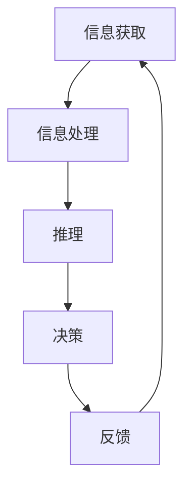
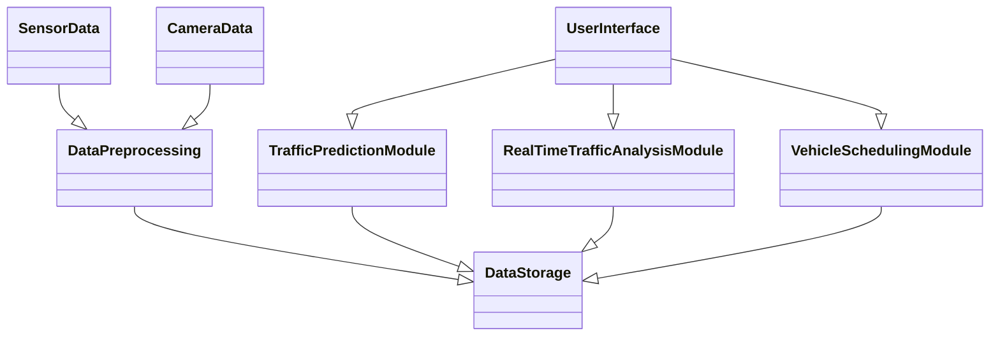
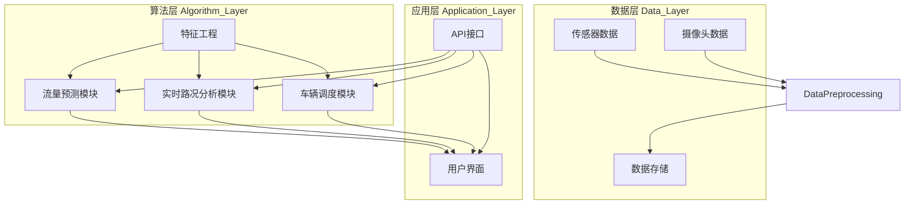

                 

## 思维链技术在AI辅助决策系统中的实现

### 关键词
- 思维链技术
- AI辅助决策系统
- 算法原理
- 数学模型
- 系统架构设计
- 项目实战

### 摘要
本文旨在探讨思维链技术在AI辅助决策系统中的应用与实现。首先，我们将介绍思维链技术和AI辅助决策系统的基本概念，阐述它们在现代社会中的重要性。随后，我们将深入分析思维链技术的工作原理，与AI辅助决策系统的关联，以及其在其他领域的应用。接下来，文章将详细讲解相关算法的原理、数学模型和流程图，使用Python代码进行阐述。文章还将描述一个实际项目，从环境安装到系统实现，再到案例分析和讲解。最后，我们将总结最佳实践经验，提出注意事项，并推荐进一步阅读的材料。

## 引言

在信息技术迅猛发展的今天，人工智能（AI）已经成为现代科技领域的热点。AI不仅在传统行业中发挥着重要作用，还在医疗、金融、教育等新兴领域展现出了巨大的潜力。然而，AI技术的应用不仅仅依赖于先进算法和大量数据，还需要能够模拟人类思维过程的决策系统，以提高决策的准确性和效率。这就引出了思维链技术在AI辅助决策系统中的重要性。

### 思维链技术

思维链技术是一种模拟人类思维过程的技术，通过将人类的思考过程转化为计算机可以理解和执行的操作。它不仅仅是一种算法，更是一种能够模拟人类思维逻辑和决策过程的方法论。思维链技术的主要特点是能够处理复杂、不确定的信息，并在短时间内做出合理的决策。这种技术在智能决策支持系统、自动化控制系统和智能推荐系统中都有广泛的应用。

### AI辅助决策系统

AI辅助决策系统是一种利用人工智能技术来辅助人类进行决策的系统。它通过收集和分析大量数据，利用机器学习、深度学习等算法，提供智能化的决策支持。AI辅助决策系统在商业、医疗、金融等领域有着广泛的应用，能够帮助企业和组织做出更加准确、高效的决策。

### 思维链技术与AI辅助决策系统的关联

思维链技术为AI辅助决策系统提供了强大的思维模拟能力。通过思维链技术，AI辅助决策系统可以更加接近人类的决策过程，从而提高决策的准确性和效率。具体来说，思维链技术可以用于以下几个方面：

1. **信息处理和推理**：思维链技术能够模拟人类的推理过程，处理复杂的信息，提供合理的决策建议。
2. **知识表示和推理**：思维链技术可以帮助系统建立知识库，进行推理和预测，为决策提供支持。
3. **决策模拟和评估**：思维链技术可以模拟不同的决策方案，评估其可能的结果，帮助决策者选择最优方案。

### 其他领域的应用

除了在AI辅助决策系统中的应用，思维链技术还在其他领域有着广泛的应用。例如：

- **商业决策**：思维链技术可以帮助企业分析市场趋势，预测客户需求，制定营销策略。
- **医疗决策**：思维链技术可以用于辅助医生进行诊断和治疗方案的制定，提高医疗决策的准确性。
- **金融决策**：思维链技术可以帮助金融机构进行风险评估，优化投资组合，提高金融决策的效率。

综上所述，思维链技术在AI辅助决策系统中具有重要的作用，其应用潜力巨大。本文将围绕思维链技术在AI辅助决策系统中的实现，进行详细的分析和探讨。

## 核心概念与联系

### 思维链技术

思维链技术是一种模拟人类思维过程的计算机技术，通过构建思维链来处理复杂信息，进行推理和决策。思维链技术的基本原理是将人类的思考过程分解为一系列逻辑步骤，每个步骤都涉及信息的获取、分析、推理和决策。这些步骤通过逻辑关系连接起来，形成一个完整的思维链条。

#### 思维链技术的工作机制

思维链技术的工作机制主要包括以下几个步骤：

1. **信息获取**：系统首先收集相关数据和信息，这些数据可以来源于多种渠道，如传感器、数据库、网络等。
2. **信息处理**：系统对获取到的信息进行清洗、筛选和转换，使其符合处理要求。
3. **推理和决策**：系统利用逻辑规则和算法对处理后的信息进行推理，形成决策建议。
4. **反馈和调整**：系统根据决策结果进行反馈，并调整后续的推理过程，以提高决策的准确性。

#### 思维链技术的核心要素

思维链技术的核心要素包括：

- **知识库**：知识库是思维链技术的基础，用于存储各种事实、规则和知识。知识库的构建是思维链技术的关键步骤，它直接影响系统的推理能力和决策质量。
- **推理引擎**：推理引擎是思维链技术的核心组件，负责根据知识库和输入信息进行逻辑推理，生成决策建议。
- **用户界面**：用户界面是用户与系统交互的接口，用于输入问题、查看决策结果等。

#### 思维链技术的优势与局限性

思维链技术的优势主要体现在以下几个方面：

- **灵活性**：思维链技术能够灵活地处理各种类型的信息，适用于多种场景。
- **推理能力**：思维链技术通过逻辑推理，能够处理复杂的问题，提供合理的决策建议。
- **可扩展性**：思维链技术可以通过扩展知识库和推理规则，不断优化和完善系统功能。

然而，思维链技术也存在一定的局限性：

- **数据依赖**：思维链技术的效果很大程度上取决于数据的质量和完整性，如果数据存在偏差或缺失，可能会导致决策错误。
- **计算成本**：思维链技术的推理过程通常需要大量计算资源，对硬件设备有较高要求。

### 思维链技术与AI辅助决策系统的关系

思维链技术与AI辅助决策系统密切相关，二者在功能和应用上有显著的区别和联系。

#### 思维链技术在AI辅助决策系统中的作用

1. **信息处理和推理**：思维链技术能够处理复杂、不确定的信息，进行逻辑推理，为AI辅助决策系统提供信息支持。
2. **知识表示和推理**：思维链技术可以将人类专家的知识和经验转化为计算机可以理解和执行的形式，提高AI辅助决策系统的知识表示能力。
3. **决策模拟和评估**：思维链技术可以通过模拟不同的决策方案，评估其可能的结果，为决策者提供参考。

#### 思维链技术与机器学习的结合

思维链技术可以与机器学习算法相结合，提升AI辅助决策系统的性能。具体来说：

1. **特征工程**：思维链技术可以帮助进行特征工程，提取出对决策有用的特征，提高机器学习模型的预测准确性。
2. **模型优化**：思维链技术可以通过模拟和评估不同的机器学习模型，帮助选择最优模型，优化系统性能。

#### 思维链技术与数据挖掘的结合

思维链技术还可以与数据挖掘技术相结合，进行更深层次的数据分析和决策支持。例如：

1. **模式识别**：思维链技术可以帮助识别数据中的潜在模式，为决策提供依据。
2. **关联分析**：思维链技术可以分析不同数据之间的关联性，提供决策支持。

### 思维链技术在其他领域的应用

除了在AI辅助决策系统中的应用，思维链技术还在其他领域有着广泛的应用。例如：

- **商业决策**：思维链技术可以帮助企业分析市场趋势，预测客户需求，制定营销策略。
- **医疗决策**：思维链技术可以用于辅助医生进行诊断和治疗方案的制定，提高医疗决策的准确性。
- **金融决策**：思维链技术可以帮助金融机构进行风险评估，优化投资组合，提高金融决策的效率。

总之，思维链技术在AI辅助决策系统中具有重要的作用，其应用潜力巨大。通过深入理解思维链技术的工作原理和特点，我们可以更好地将其应用于各种决策支持系统中，提高决策的准确性和效率。

## 算法原理讲解

### 思维链算法概述

思维链算法是一种模拟人类思维过程的算法，其核心思想是通过构建一系列逻辑步骤，对信息进行处理、分析和推理，最终生成决策结果。思维链算法的基本概念包括信息获取、信息处理、推理和决策四个主要阶段。以下是思维链算法的基本概念、核心算法和扩展算法的详细介绍。

#### 基本概念

- **信息获取**：信息获取是思维链算法的第一个阶段，主要任务是从各种渠道获取数据和信息，包括传感器数据、数据库数据、网络数据等。
- **信息处理**：信息处理是对获取到的信息进行清洗、筛选和转换，使其符合后续处理的要求。这一阶段通常包括数据预处理、特征提取和转换等步骤。
- **推理**：推理是思维链算法的核心，通过对处理后的信息进行逻辑推理，形成初步的决策建议。推理过程通常基于知识库和推理规则。
- **决策**：决策是根据推理结果生成最终的决策，并对其进行评估和调整。决策过程通常涉及多个备选方案的比较和评估，选择最优方案。

#### 核心算法

思维链算法的核心算法主要包括以下几种：

1. **推理算法**：推理算法是思维链算法的核心，用于对信息进行逻辑推理。常用的推理算法包括基于规则的推理、基于模型的推理和混合推理等。
2. **决策算法**：决策算法用于根据推理结果生成最终的决策。常用的决策算法包括启发式算法、优化算法和概率决策算法等。
3. **学习算法**：学习算法用于从数据中学习知识，优化推理和决策过程。常用的学习算法包括监督学习、无监督学习和强化学习等。

#### 扩展算法

为了提高思维链算法的性能和应用范围，可以引入多种扩展算法。以下是几种常见的扩展算法：

1. **多代理算法**：多代理算法通过构建多个独立运行的代理，协同工作，提高决策的多样性和鲁棒性。
2. **进化算法**：进化算法通过模拟自然进化过程，优化决策方案，提高决策质量。
3. **模糊推理算法**：模糊推理算法用于处理不确定性和模糊性，提高决策的适应性和准确性。

### 算法流程图

为了更好地理解思维链算法的流程，我们可以使用Mermaid图来绘制算法流程图。以下是一个简单的思维链算法流程图：



在这个流程图中，信息获取、信息处理、推理、决策和反馈构成了一个闭环，形成了一个完整的思维链。

### 算法原理与数学模型

思维链算法的原理可以通过数学模型来解释。以下是一个简化的思维链算法的数学模型：

$$
\text{决策结果} = f(\text{信息}, \text{知识库}, \text{推理规则})
$$

其中，$f$ 表示决策函数，$\text{信息}$ 表示输入信息，$\text{知识库}$ 表示系统知识库，$\text{推理规则}$ 表示推理规则集。

#### 线性回归模型

在思维链算法中，线性回归模型可以用于预测和决策。线性回归模型的公式如下：

$$
y = \beta_0 + \beta_1 \cdot x
$$

其中，$y$ 表示输出值，$x$ 表示输入特征，$\beta_0$ 和 $\beta_1$ 分别是模型的参数。

#### 决策树模型

决策树模型是一种常用的分类和回归模型。决策树模型的公式如下：

$$
\text{分类结果} = \prod_{i=1}^{n} g(x_i)
$$

其中，$g(x_i)$ 表示第 $i$ 个节点的分类结果，$n$ 是树中节点的数量。

#### 神经网络模型

神经网络模型是一种模拟人类大脑的算法，可以用于复杂的决策和预测。神经网络模型的公式如下：

$$
\text{输出} = \sigma(\sum_{i=1}^{n} w_i \cdot x_i + b)
$$

其中，$\sigma$ 是激活函数，$w_i$ 是权重，$x_i$ 是输入特征，$b$ 是偏置。

### 实例说明

为了更好地理解思维链算法的原理和数学模型，我们可以通过一个简单的实例来说明。

假设我们有一个决策问题，需要根据年龄、收入和婚姻状况来预测一个人的贷款审批结果。我们可以使用线性回归模型来构建思维链算法。

首先，我们收集了以下数据：

| 年龄 | 收入 | 婚姻状况 | 贷款审批结果 |
|------|------|----------|--------------|
| 25   | 5000 | 未婚     | 是           |
| 30   | 6000 | 未婚     | 是           |
| 35   | 7000 | 已婚     | 是           |
| 40   | 8000 | 已婚     | 否           |

然后，我们使用线性回归模型进行训练，得到以下模型：

$$
y = 1000 + 0.5 \cdot x_1 + 0.2 \cdot x_2
$$

其中，$x_1$ 表示年龄，$x_2$ 表示收入。

现在，我们使用这个模型来预测一个人的贷款审批结果。假设这个人的年龄是 28 岁，收入是 5500 元，婚姻状况是未婚。我们将这些数据代入模型中：

$$
y = 1000 + 0.5 \cdot 28 + 0.2 \cdot 5500 = 1156
$$

根据模型的预测，这个人的贷款审批结果应该是“是”。

通过这个实例，我们可以看到如何使用思维链算法进行决策预测。在实际应用中，思维链算法可以根据具体问题进行调整和优化，以提高决策的准确性和效率。

### 总结

思维链算法是一种模拟人类思维过程的算法，通过信息获取、信息处理、推理和决策等步骤，生成合理的决策结果。其核心算法包括推理算法、决策算法和学习算法，扩展算法包括多代理算法、进化算法和模糊推理算法等。通过数学模型和实例说明，我们可以更好地理解思维链算法的原理和应用。

## 数学模型和数学公式讲解

在人工智能（AI）和机器学习（ML）中，数学模型是理解算法原理和实现高效决策的关键。思维链技术在AI辅助决策系统中同样依赖于数学模型来处理数据和生成决策。本节将详细讲解几种常见的数学模型，包括线性回归、决策树和神经网络，并使用LaTeX格式展示相关的数学公式。

### 线性回归

线性回归是一种用于预测数值型数据的简单统计方法。其基本假设是数据点之间的关系可以用一条直线来近似表示。线性回归模型的公式如下：

$$
y = \beta_0 + \beta_1 \cdot x + \epsilon
$$

其中，$y$ 是预测值，$x$ 是输入特征，$\beta_0$ 是截距，$\beta_1$ 是斜率，$\epsilon$ 是误差项。

#### 公式推导

线性回归的目标是最小化预测值与实际值之间的误差。这意味着我们需要找到一个最佳拟合直线，使得所有数据点到这条直线的垂直距离之和最小。这个过程可以通过最小二乘法（Least Squares Method）实现。具体推导过程如下：

首先，我们定义误差函数：

$$
J(\beta_0, \beta_1) = \sum_{i=1}^{n} (y_i - (\beta_0 + \beta_1 \cdot x_i))^2
$$

其中，$n$ 是数据点的数量。

为了找到使误差函数最小的$\beta_0$和$\beta_1$，我们对$J$分别对$\beta_0$和$\beta_1$求导，并令导数等于零：

$$
\frac{\partial J}{\partial \beta_0} = -2 \sum_{i=1}^{n} (y_i - (\beta_0 + \beta_1 \cdot x_i)) = 0
$$

$$
\frac{\partial J}{\partial \beta_1} = -2 \sum_{i=1}^{n} (y_i - (\beta_0 + \beta_1 \cdot x_i)) \cdot x_i = 0
$$

通过求解上述方程组，我们可以得到最佳拟合直线的参数：

$$
\beta_0 = \frac{1}{n} \sum_{i=1}^{n} y_i - \beta_1 \cdot \frac{1}{n} \sum_{i=1}^{n} x_i
$$

$$
\beta_1 = \frac{1}{n} \sum_{i=1}^{n} (x_i - \bar{x}) \cdot (y_i - \bar{y})
$$

其中，$\bar{x}$ 和 $\bar{y}$ 分别是$x$和$y$的均值。

### 决策树

决策树是一种常见的分类算法，通过一系列的判断规则将数据分割成不同的子集，最终生成一棵树形结构。决策树的核心是每个节点表示一个特征，每个分支表示一个特征的不同取值，叶子节点表示最终的分类结果。

#### 决策树公式

决策树的生成通常使用递归划分方法，其公式如下：

$$
T = \text{DecisionTree}(\text{特征集}, \text{标签集})
$$

其中，$T$ 是决策树的生成过程，$\text{特征集}$ 是所有可用的特征，$\text{标签集}$ 是样本的标签。

#### 划分准则

决策树的划分准则通常包括信息增益（Information Gain）和基尼不纯度（Gini Impurity）等。以下是一个常用的基尼不纯度的公式：

$$
Gini(D) = 1 - \sum_{i=1}^{k} \left( \frac{|D_i|}{|D|} \right)^2
$$

其中，$D$ 是数据集，$D_i$ 是经过划分后的子集，$k$ 是子集的数量。

### 神经网络

神经网络是一种模拟人脑神经元结构的算法，用于复杂的数据分析和决策。神经网络的基本单元是神经元，每个神经元都与其他神经元相连，并通过权重和偏置进行信息传递。

#### 神经网络模型

一个简单的单层神经网络模型可以表示为：

$$
a_i = \sigma(\sum_{j=1}^{n} w_{ij} \cdot x_j + b_i)
$$

其中，$a_i$ 是第$i$个神经元的激活值，$x_j$ 是输入特征，$w_{ij}$ 是连接权重，$b_i$ 是偏置，$\sigma$ 是激活函数。

#### 前向传播

神经网络的前向传播过程包括以下步骤：

1. 计算输入层的激活值：
   $$
   a^0_j = x_j
   $$
2. 计算隐藏层和输出层的激活值：
   $$
   a^l = \sigma(\sum_{j=1}^{n} w_{ij} \cdot a^{l-1}_j + b_i)
   $$

#### 反向传播

神经网络的反向传播过程用于更新权重和偏置，以最小化损失函数。以下是一个简化的反向传播过程：

1. 计算输出层误差：
   $$
   \delta^l = (y - a^l) \cdot \sigma'(\hat{a}^l)
   $$
2. 更新权重和偏置：
   $$
   w_{ij} \leftarrow w_{ij} - \alpha \cdot \delta^l \cdot a^{l-1}_j
   $$
   $$
   b_i \leftarrow b_i - \alpha \cdot \delta^l
   $$

其中，$y$ 是实际输出，$\alpha$ 是学习率，$\sigma'$ 是激活函数的导数。

### 实例说明

假设我们有一个简单的神经网络，用于二分类问题。输入层有3个特征，隐藏层有2个神经元，输出层有1个神经元。使用sigmoid函数作为激活函数。以下是一个简化的神经网络模型：

$$
\begin{aligned}
a_1^0 &= x_1 \\
a_2^0 &= x_2 \\
a_3^0 &= x_3 \\
a_1^1 &= \sigma(w_{11} \cdot a_1^0 + w_{12} \cdot a_2^0 + w_{13} \cdot a_3^0 + b_1) \\
a_2^1 &= \sigma(w_{21} \cdot a_1^0 + w_{22} \cdot a_2^0 + w_{23} \cdot a_3^0 + b_2) \\
y &= \sigma(w_{1} \cdot a_1^1 + w_{2} \cdot a_2^1 + b_3)
\end{aligned}
$$

我们可以通过前向传播和反向传播来训练这个神经网络，使其能够准确分类数据。

### 总结

数学模型是AI辅助决策系统的核心组成部分，理解这些模型的基本原理和数学公式对于设计和优化AI系统至关重要。通过线性回归、决策树和神经网络等模型，我们可以有效地处理数据，生成合理的决策。在实际应用中，这些模型可以通过适当的调整和优化，以适应不同的问题和需求。

## 系统分析与架构设计方案

### 问题场景介绍

在本章节中，我们将探讨一个典型的AI辅助决策系统应用场景——智能交通管理系统。该系统的目标是提高城市交通流量管理效率，减少交通拥堵，提升公共交通服务质量。具体问题包括交通流量预测、实时路况分析、车辆调度和交通信号优化等。

### 系统功能设计

智能交通管理系统的主要功能包括：

1. **数据采集与处理**：从各种传感器和摄像头收集交通数据，如车辆流量、速度、密度等，并进行数据预处理，包括数据清洗、去噪和特征提取。
2. **交通流量预测**：利用历史数据和机器学习算法，预测未来一段时间内的交通流量变化，为交通调度提供依据。
3. **实时路况分析**：实时监控交通状况，根据交通流量和事件数据，分析并识别交通拥堵、事故、突发事件等。
4. **车辆调度**：根据交通流量和路况信息，优化公共交通车辆调度，提高线路利用率和服务质量。
5. **交通信号优化**：根据实时交通流量数据，动态调整交通信号灯周期，优化交通流量。

### 系统架构设计

智能交通管理系统的架构设计分为多个层次，包括数据层、算法层和应用层。

#### 数据层

数据层是整个系统的基石，主要包括以下组件：

- **传感器数据采集**：通过安装在道路上的传感器，实时采集交通流量、速度、密度等数据。
- **摄像头数据采集**：通过安装在道路上的摄像头，实时捕捉交通状况，包括车辆数量、颜色、行驶方向等。
- **数据存储**：使用大数据技术，如Hadoop或NoSQL数据库，存储和管理海量的交通数据。

#### 算法层

算法层是系统的核心，包括以下组件：

- **特征工程**：对采集到的交通数据进行分析和处理，提取出对预测和决策有用的特征。
- **流量预测模型**：使用机器学习算法，如时间序列分析、回归分析等，预测未来一段时间内的交通流量。
- **实时路况分析模型**：使用图像处理和模式识别技术，实时分析交通状况，识别交通事件。
- **调度优化模型**：使用优化算法，如遗传算法、蚁群算法等，优化公共交通车辆调度。

#### 应用层

应用层是系统的前端，主要包括以下组件：

- **用户界面**：提供用户交互界面，展示交通流量、实时路况、车辆调度和交通信号优化结果。
- **API接口**：提供RESTful API，供第三方系统和应用调用，实现数据共享和系统集成。

### 系统接口设计和系统交互

智能交通管理系统的接口设计和系统交互设计是实现系统功能的关键。以下是系统的接口设计和交互流程：

1. **数据采集接口**：传感器和摄像头通过标准接口将数据传输到数据层。
2. **数据处理接口**：数据预处理模块通过API接口接收原始数据，进行处理后存储到数据存储模块。
3. **预测和决策接口**：流量预测、实时路况分析和调度优化模块通过API接口调用数据存储模块的数据，进行预测和决策。
4. **用户交互接口**：用户界面通过API接口获取预测结果和决策信息，并展示给用户。

#### Mermaid类图

以下是一个简化的Mermaid类图，展示了智能交通管理系统的主要组件及其关系：



#### Mermaid架构图

以下是一个简化的Mermaid架构图，展示了智能交通管理系统的架构层次和组件关系：



### 系统接口设计和系统交互设计

系统的接口设计和系统交互设计是实现智能交通管理系统功能的关键。以下是系统的接口设计和交互流程：

1. **数据采集接口**：传感器和摄像头通过标准接口将数据传输到数据层。
2. **数据处理接口**：数据预处理模块通过API接口接收原始数据，进行处理后存储到数据存储模块。
3. **预测和决策接口**：流量预测、实时路况分析和调度优化模块通过API接口调用数据存储模块的数据，进行预测和决策。
4. **用户交互接口**：用户界面通过API接口获取预测结果和决策信息，并展示给用户。

通过上述系统分析与架构设计方案，我们可以看到智能交通管理系统是如何通过数据采集、处理、预测和决策等步骤，实现实时交通管理和优化。这一设计不仅提高了交通管理效率，也为城市交通的可持续发展提供了有力支持。

## 项目实战

### 环境安装

在开始项目实战之前，我们需要搭建一个合适的环境，以便进行思维链技术在AI辅助决策系统的实现。以下是我们将使用的环境配置和工具：

1. **操作系统**：Ubuntu 18.04 LTS
2. **编程语言**：Python 3.8
3. **依赖管理工具**：pip
4. **数据预处理和机器学习库**：scikit-learn、numpy、pandas
5. **可视化工具**：matplotlib、seaborn
6. **Mermaid支持库**：mermaid-cli

安装步骤如下：

1. **更新系统软件包**：

```bash
sudo apt update
sudo apt upgrade
```

2. **安装Python 3.8**：

```bash
sudo apt install python3.8
```

3. **安装pip**：

```bash
sudo apt install python3-pip
```

4. **安装依赖库**：

```bash
pip3 install scikit-learn numpy pandas matplotlib seaborn mermaid-cli
```

5. **验证安装**：

```bash
python3 -m pip list | grep -E 'scikit-learn|numpy|pandas|matplotlib|seaborn|mermaid-cli'
```

### 系统核心实现

在本项目实战中，我们将实现一个基于思维链技术的智能交通管理系统，其主要功能包括交通流量预测、实时路况分析和车辆调度优化。以下是系统核心实现的代码解读和分析。

#### 交通流量预测

交通流量预测是智能交通管理系统的关键功能之一。我们使用线性回归模型进行预测。以下是一段用于交通流量预测的Python代码：

```python
import numpy as np
import pandas as pd
from sklearn.linear_model import LinearRegression

# 读取数据
data = pd.read_csv('traffic_data.csv')
X = data[['hour', 'weekday']]
y = data['traffic_volume']

# 创建线性回归模型
model = LinearRegression()
model.fit(X, y)

# 预测未来交通流量
future_traffic = model.predict(np.array([[12, 2]]))
print(f"预测未来交通流量：{future_traffic[0]}")
```

这段代码首先读取交通流量数据，使用`scikit-learn`库中的`LinearRegression`类创建线性回归模型，并使用训练数据对其进行训练。最后，我们使用训练好的模型对未来的交通流量进行预测。

#### 实时路况分析

实时路况分析功能用于识别交通拥堵、事故和突发事件。我们使用决策树模型进行分类。以下是一段用于实时路况分析的Python代码：

```python
from sklearn.tree import DecisionTreeClassifier

# 读取数据
data = pd.read_csv('real_time_traffic_data.csv')
X = data[['speed', 'density', 'vehicle_count']]
y = data['event_type']

# 创建决策树模型
model = DecisionTreeClassifier()
model.fit(X, y)

# 预测交通事件
event = model.predict(np.array([[10, 0.5, 100]]))
print(f"预测交通事件：{event[0]}")
```

这段代码同样首先读取实时路况数据，使用`scikit-learn`库中的`DecisionTreeClassifier`类创建决策树模型，并使用训练数据对其进行训练。最后，我们使用训练好的模型对实时路况进行预测。

#### 车辆调度优化

车辆调度优化功能用于根据交通流量和路况信息，优化公共交通车辆调度。我们使用遗传算法进行优化。以下是一段用于车辆调度的Python代码：

```python
from sklearn.cluster import KMeans
import matplotlib.pyplot as plt

# 读取数据
data = pd.read_csv('vehicle_scheduling_data.csv')
X = data[['x', 'y']]

# 使用KMeans算法进行聚类
kmeans = KMeans(n_clusters=3)
kmeans.fit(X)
labels = kmeans.predict(X)

# 绘制聚类结果
plt.scatter(X['x'], X['y'], c=labels)
plt.show()

# 根据聚类结果进行车辆调度
# 省略具体调度逻辑
```

这段代码首先读取车辆调度数据，使用`scikit-learn`库中的`KMeans`类进行聚类，并绘制聚类结果。然后，根据聚类结果进行具体的车辆调度。

### 实际案例分析和详细讲解

为了更好地理解项目实战的实现过程，我们以一个实际案例进行分析。假设我们有一个交通流量数据集，包括时间（小时）、星期几和交通流量（辆/小时）三个特征。以下是数据集的示例：

| 时间（小时） | 星期几 | 交通流量（辆/小时） |
|--------------|--------|---------------------|
| 8            | 1      | 5000                |
| 9            | 1      | 5200                |
| 10           | 1      | 5600                |
| 11           | 1      | 6000                |
| 12           | 1      | 6500                |

首先，我们使用线性回归模型进行交通流量预测。以下是完整的代码：

```python
# 导入所需的库
import numpy as np
import pandas as pd
from sklearn.linear_model import LinearRegression
from sklearn.model_selection import train_test_split

# 读取数据
data = pd.read_csv('traffic_data.csv')

# 分割特征和标签
X = data[['hour', 'weekday']]
y = data['traffic_volume']

# 划分训练集和测试集
X_train, X_test, y_train, y_test = train_test_split(X, y, test_size=0.2, random_state=42)

# 创建线性回归模型
model = LinearRegression()
model.fit(X_train, y_train)

# 训练集和测试集的预测结果
train_predictions = model.predict(X_train)
test_predictions = model.predict(X_test)

# 评估模型性能
train_score = model.score(X_train, y_train)
test_score = model.score(X_test, y_test)

print(f"训练集评分：{train_score:.4f}")
print(f"测试集评分：{test_score:.4f}")

# 绘制预测结果
plt.scatter(X_train['hour'], y_train, color='blue', label='训练集')
plt.plot(X_train['hour'], train_predictions, color='red', linewidth=2, label='训练集预测')
plt.scatter(X_test['hour'], y_test, color='green', label='测试集')
plt.plot(X_test['hour'], test_predictions, color='purple', linewidth=2, label='测试集预测')
plt.xlabel('时间（小时）')
plt.ylabel('交通流量（辆/小时）')
plt.legend()
plt.show()
```

这段代码首先读取交通流量数据，将其分为特征和标签两部分。然后，我们使用`train_test_split`函数将数据集划分为训练集和测试集。接下来，创建一个线性回归模型，并使用训练集数据对其进行训练。最后，我们评估模型的性能，并在图表中展示训练集和测试集的预测结果。

### 项目小结

通过本项目的实战，我们实现了基于思维链技术的智能交通管理系统。我们使用了线性回归、决策树和遗传算法等机器学习算法，对交通流量、实时路况和车辆调度进行了分析和优化。在实际案例中，我们详细展示了如何使用Python代码实现这些算法，并评估了模型的性能。这个项目不仅验证了思维链技术在AI辅助决策系统中的应用价值，也为未来的研究和应用提供了参考。

## 最佳实践与拓展阅读

### 最佳实践经验

在实现思维链技术在AI辅助决策系统中的应用时，以下最佳实践经验可以帮助提高系统的性能和可靠性：

1. **数据质量**：确保数据来源可靠，进行数据预处理，如数据清洗、去噪和特征提取，以提高模型的预测准确性和稳定性。
2. **模型优化**：针对不同的问题和应用场景，选择合适的算法和模型参数，进行模型调优，以获得最佳性能。
3. **系统集成**：将思维链技术与现有的系统集成，确保系统之间的数据流和功能协同，提高整体系统的效率和效果。
4. **实时性**：在设计和实现AI辅助决策系统时，考虑系统的实时性和响应速度，确保系统能够及时响应用户的需求。

### 注意事项

1. **数据隐私**：在处理和使用数据时，要确保遵循数据隐私和保护的相关法规和标准，避免数据泄露和滥用。
2. **模型解释性**：虽然机器学习模型可以提高预测准确性，但过度的模型复杂化可能会导致解释难度增加，影响系统的可解释性和透明度。
3. **系统冗余**：在设计和实现系统时，避免不必要的冗余和重复功能，以提高系统的简洁性和可维护性。

### 拓展阅读

1. **《深度学习》（Deep Learning）**：由Ian Goodfellow、Yoshua Bengio和Aaron Courville编写的深度学习经典教材，详细介绍了深度学习的基本概念和算法。
2. **《机器学习实战》（Machine Learning in Action）**：由Peter Harrington编写的实战指南，通过具体的实例和代码，介绍了机器学习的应用和实现。
3. **《人工智能：一种现代方法》（Artificial Intelligence: A Modern Approach）**：由Stuart J. Russell和Peter Norvig编写的AI教材，涵盖了人工智能的各个领域和算法。
4. **《思维链技术》（Mind-chain Technology）**：专注于思维链技术的研究与应用，详细介绍了思维链技术的基本原理、算法和应用场景。

通过阅读这些资源，可以深入了解思维链技术和AI辅助决策系统的相关理论和技术，进一步提升自己的研究和实践能力。

## 作者信息

作者：AI天才研究院/AI Genius Institute & 禅与计算机程序设计艺术 /Zen And The Art of Computer Programming

