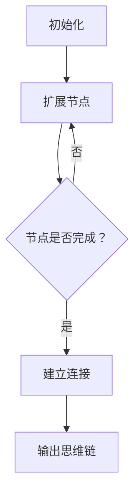
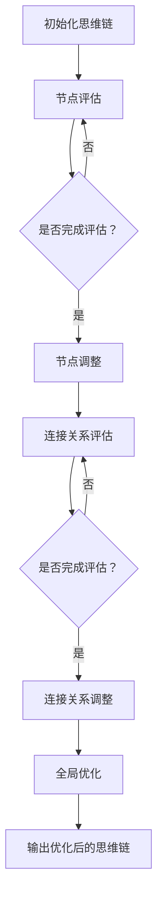
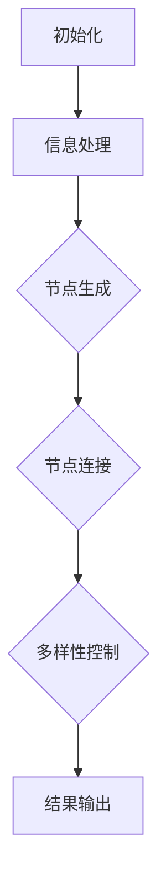
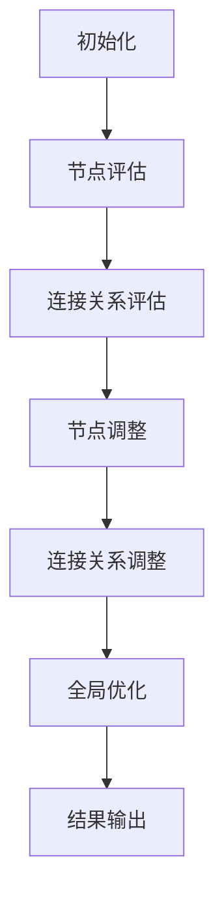

                 

### 引言与背景

#### 广告行业的发展与挑战

广告行业作为市场经济的重要组成部分，近年来经历了飞速的发展。根据市场研究机构的报告，全球广告市场的规模已经突破5000亿美元，并且预计在未来几年内将持续增长。随着数字技术的普及和消费者行为的变化，广告的形式和内容也在不断进化。

**创意广告的重要性**：在广告泛滥的当下，创意广告成为了品牌脱颖而出的关键。创意广告不仅能够吸引消费者的注意力，还能够有效地传达品牌的核心价值和理念。一个成功的创意广告能够在消费者心中留下深刻印象，甚至引发话题和讨论，从而提升品牌知名度和市场份额。

**当前广告生成面临的挑战**：

1. **内容同质化**：由于市场竞争激烈，很多广告内容逐渐趋于同质化，难以吸引目标受众。
2. **人力成本高**：广告创意的生成通常需要大量的时间和人力投入，特别是在文案撰写、设计制作和后期优化等环节。
3. **个性化需求增加**：随着消费者对个性化的追求，广告内容需要更加精准地匹配消费者的兴趣和需求，这对广告创作者提出了更高的要求。
4. **技术依赖性**：尽管AI技术在广告领域展现出巨大潜力，但当前的技术水平仍需进一步提升，以更好地辅助创意广告的生成。

#### AI在广告领域的应用现状

**AI辅助创意广告的优势**：

- **自动化**：AI技术可以自动化完成广告创意的生成过程，降低人力成本，提高效率。
- **个性化**：AI能够根据消费者的行为数据生成个性化的广告内容，提升广告的转化率。
- **数据驱动**：AI技术能够分析海量数据，为广告策略提供科学依据，优化广告投放效果。

**当前AI技术在广告生成中的应用**：

- **文本生成**：利用自然语言处理技术（NLP）生成广告文案，如生成式文本模型。
- **图像生成**：利用生成对抗网络（GAN）等技术生成广告图像和视频。
- **数据分析**：利用机器学习技术分析用户行为数据，优化广告投放策略。

**存在的不足与改进空间**：

- **创意局限**：AI生成的广告内容可能缺乏人类创意的深度和情感，难以完全满足创意广告的需求。
- **技术成熟度**：AI技术在广告领域的应用仍处于早期阶段，存在技术成熟度和应用效果的不确定性。
- **隐私问题**：广告技术的应用涉及大量用户数据，隐私保护和数据安全成为重要问题。

#### 思维链技术的核心概念

**思维链技术**是一种基于人类思维模式的计算机模拟技术，旨在模拟人类在解决问题和生成创意时的思维方式。其核心概念包括：

- **思维链的定义**：思维链是指一系列相关联的思维活动，通过这些活动，个体能够从一个概念或问题出发，逐步深入，最终产生新的创意或解决方案。
- **思维链的基本原理与特征**：思维链技术通过模拟人类大脑的神经网络结构和工作机制，实现对复杂问题的分析和创意的生成。其主要特征包括灵活性强、适应性高、能处理多维度信息等。
- **思维链与传统AI技术的区别**：传统AI技术依赖于固定的算法和模型，而思维链技术则更接近人类的思维方式，能够灵活应对复杂和多变的场景。

#### 思维链技术在AI辅助创意广告生成中的优势

**提高广告创意的质量与效率**：

- **思维链在创意构思中的应用**：通过思维链技术，AI可以模拟人类创意思维的过程，生成新颖独特的广告创意。
- **思维链在创意优化中的应用**：思维链技术能够分析现有广告创意的优缺点，提供优化的建议，提高广告效果。

**应对广告行业变化的需求**：

- **多样化的广告需求**：思维链技术能够灵活应对各种广告需求，生成符合不同市场环境和消费者需求的广告内容。
- **快速响应市场变化**：思维链技术能够实时分析市场数据，快速调整广告策略，提升广告的响应速度和效果。

#### 思维链技术在AI辅助创意广告生成中的应用场景

**广告文案创作**：

- **思维链在文案构思中的作用**：通过思维链技术，AI可以生成具有创意性的广告文案，提高文案的质量和吸引力。
- **文案创意优化与反馈机制**：思维链技术能够分析消费者对广告文案的反应，提供优化建议，形成反馈循环，持续提升文案效果。

**广告视频制作**：

- **视觉元素的创意生成**：思维链技术可以生成具有创意性的视觉元素，如图像、视频片段等，为广告视频提供丰富的素材。
- **剧本创作与角色设定**：通过思维链技术，AI可以生成剧本，设定广告中的角色和情节，提高广告的视频质量。

**广告投放策略**：

- **数据分析驱动的广告优化**：思维链技术可以分析广告投放的数据，优化广告策略，提高投放效果。
- **智能投放策略制定**：通过思维链技术，AI可以制定智能化的广告投放策略，实现精准投放，提升广告效果。

#### 本章小结

本文介绍了思维链技术在AI辅助创意广告生成中的应用，阐述了广告行业的发展背景和当前面临的挑战，分析了AI在广告领域中的应用现状和不足，介绍了思维链技术的核心概念和优势，并探讨了其在广告文案创作、广告视频制作和广告投放策略中的应用场景。通过本文的介绍，读者可以初步了解思维链技术为广告行业带来的变革和机遇。

## 第一部分: 思维链技术在AI辅助创意广告生成中的应用

### 1.1 思维链技术在AI辅助创意广告生成中的应用

**思维链技术**是一种模拟人类思维过程的技术，它通过构建一系列相互关联的思维活动来模拟人类在解决问题和生成创意时的思维方式。近年来，随着人工智能技术的快速发展，思维链技术逐渐在各个领域中得到了应用。特别是在广告行业，思维链技术为创意广告的生成提供了新的思路和手段。

#### 1.1.1 问题背景与现状

**广告行业的发展与挑战**：

广告行业作为市场经济的重要组成部分，近年来经历了显著的发展。根据市场研究机构的报告，全球广告市场的规模已经超过5000亿美元，并且预计在未来几年内将持续增长。随着数字技术的普及和消费者行为的改变，广告的形式和内容也在不断变革。

在广告行业中，创意广告扮演着至关重要的角色。一个成功的创意广告不仅能够吸引消费者的注意力，还能够有效地传达品牌的核心价值和理念。然而，随着广告市场的竞争日益激烈，广告创作者面临着一系列挑战：

1. **内容同质化**：许多广告内容趋于同质化，难以吸引目标受众。
2. **人力成本高**：广告创意的生成通常需要大量的时间和人力投入，特别是在文案撰写、设计制作和后期优化等环节。
3. **个性化需求增加**：随着消费者对个性化的追求，广告内容需要更加精准地匹配消费者的兴趣和需求。
4. **技术依赖性**：尽管AI技术在广告领域展现出巨大潜力，但当前的技术水平仍需进一步提升，以更好地辅助创意广告的生成。

**AI在广告领域的应用现状**：

随着人工智能技术的快速发展，AI已经在广告行业中得到了广泛应用。AI技术在广告生成中的优势主要包括：

1. **自动化**：AI技术可以自动化完成广告创意的生成过程，降低人力成本，提高效率。
2. **个性化**：AI能够根据消费者的行为数据生成个性化的广告内容，提升广告的转化率。
3. **数据驱动**：AI技术能够分析海量数据，为广告策略提供科学依据，优化广告投放效果。

当前，AI技术在广告生成中的应用主要体现在以下几个方面：

1. **文本生成**：利用自然语言处理技术（NLP）生成广告文案，如生成式文本模型。
2. **图像生成**：利用生成对抗网络（GAN）等技术生成广告图像和视频。
3. **数据分析**：利用机器学习技术分析用户行为数据，优化广告投放策略。

尽管AI技术在广告领域具有巨大潜力，但仍存在一些不足之处：

1. **创意局限**：AI生成的广告内容可能缺乏人类创意的深度和情感，难以完全满足创意广告的需求。
2. **技术成熟度**：AI技术在广告领域的应用仍处于早期阶段，存在技术成熟度和应用效果的不确定性。
3. **隐私问题**：广告技术的应用涉及大量用户数据，隐私保护和数据安全成为重要问题。

**思维链技术的核心概念**：

思维链技术是一种模拟人类思维模式的技术，旨在模拟人类在解决问题和生成创意时的思维方式。其核心概念包括：

1. **思维链的定义**：思维链是指一系列相关联的思维活动，通过这些活动，个体能够从一个概念或问题出发，逐步深入，最终产生新的创意或解决方案。
2. **思维链的基本原理与特征**：思维链技术通过模拟人类大脑的神经网络结构和工作机制，实现对复杂问题的分析和创意的生成。其主要特征包括灵活性强、适应性高、能处理多维度信息等。
3. **思维链与传统AI技术的区别**：传统AI技术依赖于固定的算法和模型，而思维链技术则更接近人类的思维方式，能够灵活应对复杂和多变的场景。

#### 1.1.2 思维链技术在AI辅助创意广告生成中的优势

**提高广告创意的质量与效率**：

思维链技术在广告创意生成中的应用具有显著的优势，能够提高广告创意的质量和效率。具体包括：

1. **思维链在创意构思中的应用**：通过思维链技术，AI可以模拟人类的创意构思过程，生成新颖独特的广告创意。思维链技术能够引导AI从多个角度思考问题，激发创意思维，从而提高广告创意的质量。

2. **思维链在创意优化中的应用**：思维链技术能够对现有广告创意进行分析和优化。通过分析广告文案、图像和视频等元素的组合效果，思维链技术可以提供优化的建议，提高广告的整体效果。

**应对广告行业变化的需求**：

思维链技术在广告行业变化中的需求方面也具有显著的优势。具体包括：

1. **多样化的广告需求**：思维链技术能够灵活应对各种广告需求，生成符合不同市场环境和消费者需求的广告内容。无论是针对年轻人、老年人还是特定兴趣群体的广告，思维链技术都能够生成符合需求的创意。

2. **快速响应市场变化**：思维链技术能够实时分析市场数据，快速调整广告策略，提升广告的响应速度和效果。在竞争激烈的市场环境中，快速响应市场变化是广告成功的关键，思维链技术能够提供有效的支持。

#### 1.1.3 思维链技术在AI辅助创意广告生成中的应用场景

思维链技术在AI辅助创意广告生成中的应用场景广泛，包括广告文案创作、广告视频制作和广告投放策略等多个方面。

**广告文案创作**：

1. **思维链在文案构思中的作用**：通过思维链技术，AI可以生成具有创意性的广告文案。思维链技术能够引导AI从多个角度思考，例如从用户需求、品牌理念、竞争对手等方面出发，从而生成新颖独特的文案。

2. **文案创意优化与反馈机制**：思维链技术可以分析消费者对广告文案的反应，提供优化建议。通过不断调整和优化文案，可以提高广告的吸引力和效果。

**广告视频制作**：

1. **视觉元素的创意生成**：思维链技术可以生成具有创意性的视觉元素，如图像、视频片段等。这些视觉元素可以用于广告视频的制作，提升广告的视觉效果和吸引力。

2. **剧本创作与角色设定**：通过思维链技术，AI可以生成剧本，设定广告中的角色和情节。这有助于提升广告视频的质量和观赏性。

**广告投放策略**：

1. **数据分析驱动的广告优化**：思维链技术可以分析广告投放的数据，优化广告策略。通过分析广告效果、用户行为等数据，思维链技术可以提供优化的建议，提高广告投放的效果。

2. **智能投放策略制定**：通过思维链技术，AI可以制定智能化的广告投放策略。这有助于实现精准投放，提高广告的投资回报率。

#### 1.1.4 思维链技术在AI辅助创意广告生成中的前景与挑战

**思维链技术在AI辅助创意广告生成中的前景**：

思维链技术的应用为AI辅助创意广告生成带来了新的机遇。随着技术的不断发展和完善，思维链技术在广告行业中的应用前景广阔。未来，思维链技术有望进一步提升广告创意的质量和效率，满足广告行业不断变化的需求。

**思维链技术在AI辅助创意广告生成中的挑战**：

尽管思维链技术在广告行业中具有巨大的潜力，但其在实际应用中仍面临一些挑战。首先，思维链技术的实现需要大量的数据和计算资源，这对技术水平和硬件设施提出了较高要求。其次，思维链技术的应用效果受到数据质量和数据量的影响，需要大量的高质量数据支持。此外，如何确保思维链技术在广告创意生成中符合伦理和法律法规的要求也是一个重要的问题。

**结论**：

思维链技术在AI辅助创意广告生成中具有显著的优势，能够提高广告创意的质量和效率，应对广告行业变化的需求。然而，其应用也面临一定的挑战，需要进一步的研究和改进。通过不断探索和优化，思维链技术有望在广告行业中发挥更大的作用，推动广告行业的发展。

### 1.2 思维链技术的核心概念

#### 1.2.1 思维链的定义

思维链（Thinking Chain）是一种模拟人类思维过程的技术，通过构建一系列相互关联的思维活动来模拟人类在解决问题和生成创意时的思维方式。思维链技术旨在实现对复杂问题的分析和创意的生成，其核心在于将人类思维过程中的逻辑关系和创造性思维进行模型化和算法化。

在思维链中，每一个思维活动都可以被视为一个节点，节点之间的关联关系则构成了思维链。通过这种结构，思维链技术能够模拟人类在解决问题时逐步深入、灵活变通的思维过程，从而生成具有创新性和灵活性的解决方案。

#### 1.2.2 思维链的基本原理与特征

思维链技术的基本原理基于对人类思维的解析和理解。人类思维通常是一个连续、动态和多层次的过程，涉及信息处理、记忆检索、联想、推理、判断等多个方面。思维链技术通过以下方式模拟人类思维：

1. **信息处理**：思维链技术能够对输入的信息进行处理和分析，提取关键特征，构建初步的认知框架。
2. **记忆检索**：思维链技术能够调用已有的知识和经验，进行记忆检索，形成新的联想和思路。
3. **联想与推理**：思维链技术能够通过联想和推理，从一个概念或问题出发，探索多种可能的解决方案。
4. **判断与选择**：思维链技术能够根据现有的信息和目标，进行判断和选择，最终生成创新的创意或解决方案。

思维链技术的特征包括：

- **灵活性**：思维链技术能够灵活地应对不同的问题和场景，根据问题的复杂程度和变化，动态调整思维路径。
- **适应性**：思维链技术能够适应不同的数据和知识来源，通过不断学习和优化，提高解决问题的效率和效果。
- **多维度处理**：思维链技术能够处理多维度信息，如文本、图像、声音等，从而生成更加丰富和立体的创意内容。

#### 1.2.3 思维链与传统AI技术的区别

思维链技术与传统AI技术（如机器学习、深度学习等）在本质上有显著的区别。传统AI技术依赖于预先定义的算法和模型，通过大量数据训练和优化，实现特定任务的自动化。而思维链技术则更接近人类的思维方式，其核心在于模拟和扩展人类思维的逻辑和创造性过程。

具体区别如下：

1. **思维方式**：传统AI技术主要依赖于算法和模型，侧重于数据的输入和输出；而思维链技术则更注重模拟人类思维的动态过程，包括联想、推理、判断等。
2. **适应性**：传统AI技术对特定任务具有高度适应性，但在处理复杂、多变的问题时可能表现不足；而思维链技术能够灵活应对复杂问题，具备较强的适应性和泛化能力。
3. **创造性**：传统AI技术生成的结果往往基于已有数据的规律和模式，缺乏创造性；而思维链技术能够模拟人类的创造性思维，生成新颖独特的创意和解决方案。
4. **多维度处理**：传统AI技术主要处理结构化数据，如文本、数值等；而思维链技术能够处理多维度信息，包括文本、图像、声音等，从而生成更加丰富和立体的创意内容。

#### 1.2.4 思维链技术的优势与应用前景

思维链技术的优势在于其能够模拟人类的思维过程，具备灵活性和创造性，能够处理复杂和多维度的信息。这些优势使得思维链技术在多个领域具有广泛的应用前景，特别是在需要创意和创新的任务中。

**优势**：

1. **提高创意质量**：思维链技术能够模拟人类的创造性思维，生成新颖独特的创意和解决方案，从而提高广告创意的质量。
2. **提升效率**：通过自动化和智能化，思维链技术能够显著提高广告创意生成的效率，减少人力成本。
3. **灵活适应**：思维链技术能够灵活应对不同的广告需求和场景，生成符合市场环境和消费者需求的广告内容。
4. **多维度处理**：思维链技术能够处理多维度信息，包括文本、图像、声音等，从而生成更加丰富和立体的广告内容。

**应用前景**：

1. **广告创意生成**：思维链技术能够辅助广告创意的生成，提升广告的吸引力和效果。
2. **内容创作**：思维链技术可以应用于小说、音乐、艺术等领域，生成具有创意性和个性化的内容。
3. **问题解决**：思维链技术能够模拟人类的思维过程，帮助解决复杂的问题和挑战。
4. **教育和培训**：思维链技术可以应用于教育和培训领域，帮助提高学习效果和解决问题的能力。

**结论**：

思维链技术作为一种模拟人类思维过程的技术，具有灵活性和创造性，能够在多个领域中发挥重要作用。特别是在广告行业中，思维链技术的应用具有显著的优势和应用前景，能够提升广告创意的质量和效率，满足广告行业不断变化的需求。

### 1.3 思维链技术在AI辅助创意广告生成中的优势

#### 1.3.1 提高广告创意的质量与效率

**思维链在创意构思中的应用**：

在广告创意的构思阶段，思维链技术能够发挥重要作用。通过模拟人类的创造性思维过程，思维链技术可以帮助广告创作者生成新颖独特的创意。其基本原理是通过构建一系列相互关联的思维活动，从多个角度对问题进行思考和探索。例如，在构思一个广告创意时，思维链技术可以引导广告创作者从品牌理念、用户需求、市场趋势等多个维度出发，形成多维度的创意构思框架。

这种多维度的思考方式能够激发广告创作者的灵感，提高创意的质量。此外，思维链技术还能够通过联想和推理，生成与广告主题相关的多种创意方案，供广告创作者选择和优化。这不仅提高了创意构思的效率，还能够确保创意的多样性和创新性。

**思维链在创意优化中的应用**：

在广告创意的优化阶段，思维链技术同样能够发挥重要作用。广告创意的优化是一个迭代和不断改进的过程，需要不断地分析广告效果和用户反馈，对创意进行改进。思维链技术可以通过以下方式协助广告创作者进行创意优化：

1. **效果分析**：思维链技术可以分析广告投放的效果数据，如点击率、转化率、用户停留时间等，识别广告中的优势和不足。
2. **用户反馈**：思维链技术可以分析用户对广告的反馈，包括评论、点赞、分享等，了解用户的真实感受和需求。
3. **优化建议**：基于效果分析和用户反馈，思维链技术可以生成优化的建议，如调整广告文案、图像、视频等元素，提高广告的吸引力和效果。

通过这种效果分析和用户反馈的闭环机制，思维链技术能够帮助广告创作者持续优化广告创意，提高广告的整体质量和效果。

#### 1.3.2 应对广告行业变化的需求

**多样化的广告需求**：

广告行业的变化速度非常快，不同的市场环境、消费者群体和品牌需求都要求广告创意具有高度的多样性和灵活性。思维链技术能够灵活应对多样化的广告需求，通过以下几个方面的应用，实现广告创意的多样化和个性化：

1. **市场趋势分析**：思维链技术可以实时分析市场趋势和消费者行为数据，了解最新的广告趋势和用户偏好。
2. **创意多样化**：基于市场趋势和用户偏好，思维链技术可以生成多样化的广告创意，满足不同市场和消费者的需求。
3. **个性化定制**：思维链技术可以根据用户的数据和行为，生成个性化的广告内容，提高广告的精准度和吸引力。

**快速响应市场变化**：

在竞争激烈的广告市场中，快速响应市场变化是提升广告效果的关键。思维链技术通过以下几个方面的应用，能够实现快速响应市场变化：

1. **实时数据分析**：思维链技术可以实时分析广告投放数据，包括点击率、转化率等关键指标，快速识别市场变化。
2. **快速创意生成**：基于实时数据分析，思维链技术可以快速生成新的广告创意，适应市场变化。
3. **动态调整策略**：思维链技术可以动态调整广告投放策略，如调整广告内容、投放时间和渠道等，实现快速响应市场变化。

**结论**：

思维链技术在广告行业中具有显著的优势，能够提高广告创意的质量与效率，应对多样化的广告需求，并快速响应市场变化。通过模拟人类的创造性思维过程和优化策略，思维链技术为广告行业带来了新的机遇和挑战，有望推动广告行业的发展和创新。

### 1.4 思维链技术在AI辅助创意广告生成中的应用场景

#### 1.4.1 广告文案创作

在广告文案创作中，思维链技术可以通过以下步骤实现：

1. **需求分析与主题确定**：首先，通过对市场趋势、消费者需求、品牌定位等进行分析，确定广告文案的主题和方向。
2. **创意构思与思维链构建**：利用思维链技术，从多个角度对主题进行思考和探索，构建创意构思框架。例如，可以从产品特点、用户痛点、竞争对手等角度出发，形成多个创意点。
3. **文本生成与优化**：利用思维链技术生成广告文案草稿，并根据用户反馈和数据分析，对文案进行优化。思维链技术可以通过分析用户行为和情感，调整文案的语言风格、表达方式和内容结构，提高文案的吸引力和效果。
4. **多轮迭代与完善**：通过对文案的多轮迭代和优化，不断提升文案的质量和吸引力，确保最终生成的广告文案能够有效传达品牌信息和吸引目标受众。

#### 1.4.2 广告视频制作

在广告视频制作中，思维链技术可以应用于以下几个方面：

1. **视觉元素创意生成**：思维链技术可以生成具有创意性的视觉元素，如图像、动画、视频片段等。通过模拟人类的创造性思维，思维链技术可以生成新颖独特的视觉元素，为广告视频提供丰富的素材。
2. **剧本创作与角色设定**：思维链技术可以辅助剧本创作，生成具有创意性的剧本草稿。在剧本创作过程中，思维链技术可以从角色设定、情节发展、主题表达等多个角度出发，构建剧本框架。
3. **后期制作与优化**：在广告视频的后期制作阶段，思维链技术可以协助对视频进行剪辑、特效添加和音效处理等。通过分析用户反馈和数据分析，思维链技术可以提供优化的建议，提高视频的整体效果。
4. **多轮迭代与完善**：通过对广告视频的多轮迭代和优化，不断提升视频的创意性和吸引力，确保最终生成的广告视频能够有效传达品牌信息和吸引目标受众。

#### 1.4.3 广告投放策略

在广告投放策略中，思维链技术可以应用于以下几个方面：

1. **数据分析与优化**：思维链技术可以分析广告投放的数据，如点击率、转化率、用户停留时间等，识别广告投放的优势和不足。基于数据分析，思维链技术可以提供优化的建议，如调整广告内容、投放时间和渠道等，以提高广告的投放效果。
2. **智能投放策略制定**：思维链技术可以根据广告目标、用户行为和市场趋势，制定智能化的广告投放策略。通过模拟人类的决策过程，思维链技术可以生成个性化的投放策略，实现精准投放，提高广告的投资回报率。
3. **实时调整与优化**：思维链技术可以实时分析广告投放数据，根据市场变化和用户反馈，动态调整广告投放策略。通过实时调整，思维链技术能够确保广告策略始终符合市场需求，提高广告的效果。

#### 1.4.4 综合应用

在实际应用中，思维链技术可以在广告文案创作、广告视频制作和广告投放策略等多个场景中综合应用，实现广告创意的全面提升。以下是一个综合应用的案例：

**案例背景**：某知名手机品牌计划推出一款新机型，希望通过广告宣传提高品牌知名度和销售量。

1. **需求分析与主题确定**：通过对市场趋势和消费者需求进行分析，确定广告文案的主题为“创新科技，引领未来”。
2. **创意构思与思维链构建**：利用思维链技术，从多个角度（如产品特点、用户痛点、市场趋势等）出发，构建创意构思框架。例如，可以从产品性能、外观设计、用户体验等角度，生成多个创意点。
3. **文案生成与优化**：利用思维链技术生成广告文案草稿，并根据用户反馈和数据分析，对文案进行优化。例如，通过分析用户对广告文案的情感反应，调整文案的语言风格和表达方式，提高文案的吸引力。
4. **视频制作**：利用思维链技术生成广告视频的视觉元素和剧本草稿，通过后期制作和优化，生成具有创意性的广告视频。
5. **投放策略制定与优化**：利用思维链技术制定广告投放策略，并根据实时数据分析和用户反馈，动态调整广告投放策略，确保广告能够精准投放，提高投放效果。

**效果评估**：通过对广告投放的效果进行评估，发现广告文案的吸引力和视频的创意性得到了显著提升，广告的点击率和转化率均有所提高。此外，通过不断优化广告内容和投放策略，广告的整体效果得到了进一步提升。

**结论**：

思维链技术在广告文案创作、广告视频制作和广告投放策略中的应用，为广告行业带来了新的机遇和挑战。通过模拟人类的创造性思维和优化策略，思维链技术能够显著提升广告创意的质量和效果，推动广告行业的发展和创新。

### 1.5 本章小结

本文详细介绍了思维链技术在AI辅助创意广告生成中的应用。首先，我们分析了广告行业的发展背景和当前面临的挑战，阐述了AI在广告领域中的应用现状和不足。接着，我们介绍了思维链技术的核心概念和基本原理，以及与传统AI技术的区别。随后，我们探讨了思维链技术在广告创意生成中的应用场景，包括广告文案创作、广告视频制作和广告投放策略等方面。最后，通过具体案例展示了思维链技术在广告创意生成中的应用效果和优势。

思维链技术的引入，为广告行业带来了新的机遇和挑战。它不仅能够提高广告创意的质量和效率，还能够应对广告行业多样化的需求，快速响应市场变化。然而，思维链技术的实现和应用仍面临一些挑战，如数据质量和隐私问题等。未来，随着技术的不断发展和完善，思维链技术在广告行业中的应用前景将更加广阔。通过持续的研究和实践，我们有望进一步提升广告创意的生成效果，推动广告行业的发展和创新。

## 第二部分：思维链技术基础理论

### 2.1 人类思维的解析

#### 2.1.1 思维链的构成

思维链是由一系列相互关联的思维活动组成的，这些思维活动通常以问题解决或创意生成为目标。思维链的基本构成包括以下几个部分：

1. **起始点**：思维链的起点通常是一个具体的问题或目标，这个起始点可以是一个简单的陈述，也可以是一个复杂的问题情境。
2. **中间节点**：中间节点是思维链的核心部分，代表了问题解决或创意生成过程中的各个阶段和子问题。每个中间节点通常包含一系列相关的思维活动，如信息收集、分析、联想、推理等。
3. **终点**：思维链的终点是问题解决方案或创意生成的结果。这个结果可以是具体的行动方案、创意点子或结论。

**思维链的运作机制**：

思维链的运作机制类似于人类大脑的信息处理过程。在人类大脑中，思维活动是通过神经网络和神经元之间的连接来实现的。思维链技术模拟了这种信息处理机制，通过以下步骤运作：

1. **信息输入**：思维链从起始点开始，接收外部信息或内部思维启发。
2. **信息处理**：思维链对输入的信息进行加工和处理，通过联想、分析和推理等思维活动，生成中间节点。
3. **节点连接**：思维链通过节点之间的连接关系，将中间节点联系起来，形成一个连续的思维路径。
4. **结果输出**：最终，思维链在终点输出解决方案或创意结果。

#### 2.1.2 人类思维的运作机制

人类思维的运作机制是一个复杂且动态的过程，涉及多个层面和多个认知功能。以下是人类思维运作机制的主要方面：

1. **感知与注意力**：人类通过感知器官（如眼睛、耳朵等）接收外部信息，并通过注意力机制选择重要的信息进行加工。
2. **记忆与存储**：大脑的记忆系统负责存储和处理信息。短期记忆和长期记忆共同作用，使人类能够回忆起过去的知识和经验。
3. **推理与判断**：人类通过逻辑推理和判断能力，从已知信息中推导出新信息，解决新问题或做出决策。
4. **联想与创造**：人类具有联想和创造能力，能够将不同信息或概念进行组合，产生新的创意和解决方案。
5. **情感与动机**：情感和动机在人类思维中起到重要的调节作用，影响思维的方向和深度。

**思维链与大脑神经网络的联系**：

思维链技术与大脑神经网络的运作机制有着密切的联系。人类大脑神经网络由数十亿个神经元组成，这些神经元通过突触连接形成复杂的网络结构。思维链技术通过模拟这种神经网络结构，构建了一个能够模拟人类思维过程的计算模型。

思维链技术中的每个思维节点可以被视为一个神经元，节点之间的连接关系可以被视为突触连接。通过调整节点之间的连接强度和激活状态，思维链技术可以模拟人类大脑的神经网络活动，实现思维过程的模拟和扩展。

#### 2.1.3 思维链技术的应用优势

思维链技术作为一种模拟人类思维过程的计算机技术，具有以下几个显著的应用优势：

1. **灵活性**：思维链技术能够灵活应对各种问题和情境，通过动态调整思维路径和节点连接，实现灵活的思考方式。
2. **创造性**：思维链技术能够模拟人类的创造性思维，通过联想、组合和推理，生成新颖独特的解决方案和创意。
3. **多维度处理**：思维链技术能够处理多维度信息，包括文本、图像、声音等，实现复杂问题的全面分析和解决。
4. **自动化**：思维链技术能够自动化完成思维过程，降低人类在问题解决和创意生成中的劳动强度，提高效率。

总之，思维链技术通过模拟人类思维的运作机制，实现了计算机技术在人类思维模拟中的应用。它不仅能够提升广告创意的质量和效率，还能够应用于多个领域，推动人类思维的扩展和进步。

### 2.2 思维链技术在AI中的实现

#### 2.2.1 思维链模型的构建

**基本原理**：

思维链模型是思维链技术在AI中的核心实现，其基本原理是通过构建一系列相互关联的模块，模拟人类思维过程。每个模块代表思维链中的一个节点，模块之间通过特定的连接关系和交互机制实现信息传递和协同工作。

1. **模块定义**：思维链模型中的模块包括信息处理模块、联想模块、推理模块、判断模块等。每个模块具有特定的功能，负责处理不同类型的思维活动。
2. **连接关系**：模块之间的连接关系是通过特定的算法和规则实现的，这些连接关系决定了思维链的运行路径和交互方式。
3. **交互机制**：模块之间的交互机制包括信息传递、状态更新、协同工作等，通过这些交互机制，模块能够协同工作，共同实现复杂的思维任务。

**实现步骤**：

1. **模块划分**：根据思维链技术的要求，将人类思维过程分解为若干个基本模块，每个模块负责特定的思维活动。
2. **模块实现**：对于每个模块，实现其具体的功能和算法。例如，信息处理模块可以包括文本处理、图像处理、声音处理等。
3. **连接关系定义**：定义模块之间的连接关系，确定信息传递和状态更新的规则。通过这些规则，模块能够协同工作，实现整体的思维链过程。
4. **测试与优化**：对思维链模型进行测试和优化，确保其能够稳定运行，并实现预期的思维过程。

#### 2.2.2 神经网络与思维链的融合

**基本原理**：

神经网络是AI领域的一种核心技术，其基本原理是通过模拟生物神经元的结构和功能，构建能够处理复杂信息和学习任务的计算模型。神经网络与思维链技术的融合，旨在将神经网络的优势与思维链的灵活性相结合，实现更高效的思维过程和问题解决能力。

1. **神经网络结构**：神经网络由多个层次和神经元组成，每个层次和神经元都有特定的功能。通过多层神经元的连接和交互，神经网络能够实现复杂的信息处理和学习任务。
2. **思维链与神经网络的融合**：思维链技术与神经网络技术的融合，通过以下方式进行：

   - **信息传递**：将思维链中的信息传递机制与神经网络的层次结构相结合，实现信息的高效传递和处理。
   - **学习与优化**：利用神经网络的训练和学习能力，对思维链模型进行优化，提高其解决问题的效率和效果。
   - **灵活调整**：通过神经网络的结构和参数调整，实现思维链的灵活性和适应性，使其能够适应不同的思维任务和场景。

**实现步骤**：

1. **神经网络结构设计**：设计适合思维链技术的神经网络结构，包括层次结构、神经元类型和连接方式等。
2. **思维链模块集成**：将思维链的模块集成到神经网络中，确保模块之间的信息传递和状态更新能够与神经网络的结构和算法相匹配。
3. **训练与优化**：利用大量的训练数据，对神经网络进行训练和优化，提高其处理思维链任务的能力。
4. **测试与评估**：对融合后的神经网络思维链模型进行测试和评估，确保其能够稳定运行，并实现预期的思维过程。

#### 2.2.3 思维链在自然语言处理中的应用

**基本原理**：

自然语言处理（NLP）是AI领域的一个重要分支，其目标是将人类语言转化为计算机可以理解和处理的格式。思维链技术在NLP中的应用，旨在通过模拟人类思维过程，提高NLP模型的生成性和创造性，使其能够生成更自然、更准确的文本。

1. **语言模型**：思维链技术在NLP中的应用，首先需要构建一个语言模型，用于生成和解析自然语言。语言模型通过学习大量的语言数据，建立语言的结构和规律，实现文本的生成和理解。
2. **思维链与语言模型的融合**：思维链与语言模型的融合，通过以下方式进行：

   - **思维链引导**：通过思维链技术，对语言模型进行引导和调整，使其生成更符合人类思维逻辑和语言的文本。
   - **创造性增强**：利用思维链的灵活性，增强语言模型的创造性，生成新颖独特的文本内容。
   - **多模态处理**：结合思维链的多维度处理能力，实现文本与其他模态（如图像、声音）的交互和整合，生成更丰富、更立体的文本内容。

**实现步骤**：

1. **语言模型构建**：构建适合NLP任务的语言模型，如基于深度学习的Transformer模型。
2. **思维链模块集成**：将思维链的模块集成到语言模型中，实现思维链与语言模型的融合。
3. **思维链引导与优化**：利用思维链技术，对语言模型进行引导和优化，提高其生成性和创造性。
4. **多模态处理**：结合思维链的多维度处理能力，实现文本与其他模态的交互和整合，生成更丰富、更立体的文本内容。
5. **测试与评估**：对融合后的思维链语言模型进行测试和评估，确保其能够稳定运行，并实现预期的NLP任务。

通过思维链技术在自然语言处理中的应用，可以显著提高语言模型的生成性和创造性，生成更自然、更准确的文本内容，为AI在文本生成、机器翻译、情感分析等领域的应用提供新的思路和手段。

### 2.3 思维链技术的核心算法

#### 2.3.1 思维链生成算法

**基本原理**：

思维链生成算法是思维链技术的核心组成部分，其基本原理是通过模拟人类思维的生成过程，生成一系列相互关联的思维节点，形成一个完整的思维链。思维链生成算法主要涉及以下方面：

1. **节点生成**：思维链生成算法能够根据输入的信息或问题，生成一系列思维节点。每个节点代表思维链中的一个思维活动或子问题。
2. **节点连接**：思维链生成算法通过分析节点之间的关联关系，建立节点之间的连接，形成一个连续的思维路径。
3. **多样性控制**：思维链生成算法能够通过多样性控制机制，确保生成的思维链具有多样性和创新性，避免生成过于简单或重复的思维路径。

**实现步骤**：

1. **初始化**：根据输入的信息或问题，初始化思维链的起点。
2. **节点生成**：通过特定的算法和规则，生成思维链中的中间节点。每个节点代表一个思维活动或子问题。
3. **节点连接**：分析节点之间的关联关系，通过连接规则建立节点之间的连接，形成一个连续的思维路径。
4. **多样性控制**：利用多样性控制机制，确保生成的思维链具有多样性和创新性。
5. **结果输出**：将生成的思维链输出，作为问题解决或创意生成的结果。

**算法流程**：

1. **信息输入**：接收输入的信息或问题。
2. **节点生成**：根据输入信息，生成思维链的初始节点。
3. **节点连接**：分析初始节点与其他节点之间的关联关系，建立连接。
4. **节点扩展**：根据连接关系，扩展中间节点，生成更多的思维节点。
5. **多样性控制**：对生成的思维链进行多样性控制，确保思维链的多样性和创新性。
6. **结果输出**：将生成的思维链输出，作为问题解决或创意生成的结果。

**案例分析**：

以广告创意生成为例，思维链生成算法可以通过以下步骤实现：

1. **信息输入**：输入广告主题和目标受众。
2. **节点生成**：生成初始节点，如广告主题、目标受众等。
3. **节点连接**：分析广告主题与目标受众之间的关联关系，建立连接。
4. **节点扩展**：根据连接关系，扩展中间节点，如市场趋势、用户需求等。
5. **多样性控制**：对生成的思维链进行多样性控制，确保创意的多样性和创新性。
6. **结果输出**：输出最终的广告创意方案。

通过思维链生成算法，可以自动生成广告创意，提高创意生成的质量和效率。

#### 2.3.2 思维链优化算法

**基本原理**：

思维链优化算法是用于优化思维链结构和性能的算法，其基本原理是通过分析思维链中的节点和连接关系，找到最佳的结构和路径，以提高思维链的效率和质量。思维链优化算法主要涉及以下方面：

1. **节点优化**：对思维链中的节点进行优化，包括节点的选择、调整和删除等，以消除冗余和无效的思维活动。
2. **连接关系优化**：对思维链中的连接关系进行优化，包括连接的调整、增加和删除等，以构建更加合理和高效的思维路径。
3. **全局优化**：思维链优化算法不仅关注单个节点和连接关系的优化，还考虑全局的优化目标，如效率、创新性和实用性等。

**实现步骤**：

1. **初始化**：根据输入的思维链，初始化优化算法的参数和目标。
2. **节点评估**：对思维链中的节点进行评估，包括节点的有效性、重要性和创新性等。
3. **节点调整**：根据节点评估结果，对节点进行选择、调整和删除等操作，以优化节点结构。
4. **连接关系评估**：对思维链中的连接关系进行评估，包括连接的强度、影响力和合理性等。
5. **连接关系调整**：根据连接关系评估结果，对连接进行调整、增加和删除等操作，以优化连接关系。
6. **全局优化**：考虑全局优化目标，对思维链进行整体优化，以提高其效率和质量。
7. **结果输出**：将优化后的思维链输出，作为优化结果。

**算法流程**：

1. **信息输入**：接收输入的思维链。
2. **节点评估**：对思维链中的节点进行评估。
3. **节点调整**：根据节点评估结果，对节点进行优化。
4. **连接关系评估**：对思维链中的连接关系进行评估。
5. **连接关系调整**：根据连接关系评估结果，对连接进行优化。
6. **全局优化**：考虑全局优化目标，对思维链进行整体优化。
7. **结果输出**：输出优化后的思维链。

**案例分析**：

以广告创意优化为例，思维链优化算法可以通过以下步骤实现：

1. **信息输入**：输入现有的广告创意方案。
2. **节点评估**：评估广告创意方案中的各个节点，包括创意点、用户反馈等。
3. **节点调整**：根据节点评估结果，对广告创意方案中的节点进行调整，如删除冗余节点、增加新的创意点等。
4. **连接关系评估**：评估广告创意方案中的连接关系，包括节点之间的关联强度等。
5. **连接关系调整**：根据连接关系评估结果，对广告创意方案中的连接关系进行调整，如调整节点之间的连接顺序等。
6. **全局优化**：考虑广告创意方案的整体效果，进行全局优化。
7. **结果输出**：输出优化后的广告创意方案。

通过思维链优化算法，可以显著提高广告创意的质量和效果，为广告行业提供更有效的创意优化手段。

### 2.3.3 思维链应用算法分析

**思维链生成算法**：

思维链生成算法的核心目标是从给定的初始信息出发，通过一系列的联想和推理，生成一个完整、有逻辑性的思维链。该算法的实现通常依赖于以下几个关键步骤：

1. **初始化**：根据输入的初始信息或问题，初始化思维链的起点。
2. **节点扩展**：从起点开始，利用预定义的规则或启发式方法，生成一系列后续节点。这些节点可以是与起点相关的子问题、潜在解决方案或者新的创意点。
3. **连接建立**：分析节点之间的关系，通过逻辑关联、因果链条或语义相似性等规则，建立节点之间的连接，形成一个连续的思维路径。
4. **多样性控制**：在生成节点和连接的过程中，采用多样性控制机制，确保生成的思维链具有足够的创新性和多样性，避免陷入单一的思维模式。

**算法流程**：



**案例分析**：

以广告文案创意生成为例，思维链生成算法可以从广告主题（起点A）出发，通过以下步骤生成思维链：

1. **初始化**：以“新产品发布”作为初始信息。
2. **节点扩展**：生成一系列与新产品发布相关的节点，如“市场趋势”、“目标受众”、“竞争对手分析”等。
3. **连接建立**：分析节点之间的关系，建立逻辑连接，例如，“市场趋势”节点与“目标受众”节点之间存在因果关系。
4. **多样性控制**：通过引入不同的视角和策略，如情感营销、数据驱动等，确保生成的文案具有多样性和创新性。

**思维链优化算法**：

思维链优化算法的核心目标是对生成的思维链进行优化，以提高其效率和效果。优化过程通常涉及以下几个关键步骤：

1. **节点评估**：对思维链中的每个节点进行评估，包括节点的重要性、创新性和实用性等。
2. **节点调整**：根据节点评估结果，对节点进行优化，包括节点的删除、修改和添加等。
3. **连接关系评估**：对思维链中的连接关系进行评估，包括连接的强度、影响力和合理性等。
4. **连接关系调整**：根据连接关系评估结果，对连接进行优化，包括连接的调整、增加和删除等。
5. **全局优化**：考虑全局优化目标，如整体效率、创新性和实用性等，对思维链进行整体优化。

**算法流程**：



**案例分析**：

以广告投放策略优化为例，思维链优化算法可以通过以下步骤实现：

1. **初始化**：以现有的广告投放策略作为初始思维链。
2. **节点评估**：评估广告投放策略中的各个节点，如广告文案、投放渠道、目标受众等，根据评估结果，对节点进行调整。
3. **连接关系评估**：评估节点之间的连接关系，如广告文案与投放渠道之间的关联性，根据评估结果，对连接关系进行调整。
4. **全局优化**：考虑整体优化目标，如投放效果、成本控制等，对思维链进行全局优化。
5. **结果输出**：输出优化后的广告投放策略。

通过思维链生成算法和优化算法的协同作用，可以显著提升广告创意的质量和效果，为广告行业提供更加智能和高效的解决方案。

### 2.4 思维链技术在创意广告生成中的具体实现

#### 2.4.1 文案创意生成

**基本原理**：

文案创意生成是广告创意过程中最为关键的环节之一，思维链技术在文案创意生成中的应用，旨在通过模拟人类的创意思维过程，生成具有高度创新性和吸引力的文案。思维链技术在文案创意生成中的基本原理包括以下几个步骤：

1. **信息收集**：通过数据挖掘和用户分析，收集与广告主题相关的信息，如市场趋势、用户需求、竞争对手等。
2. **思维链构建**：利用思维链技术，从多个角度对广告主题进行思考和探索，构建思维链。思维链的起点通常是一个明确的广告主题，后续节点包括与主题相关的各个思考方向。
3. **创意生成**：通过思维链中的联想、推理和优化，生成具有创意性的文案草稿。这些草稿可以是广告标语、宣传语、故事情节等。
4. **文案优化**：对生成的文案草稿进行优化，包括语言表达、情感传递和逻辑结构等方面，确保文案能够有效传达品牌信息和吸引目标受众。

**实现步骤**：

1. **信息收集**：利用大数据分析和用户行为追踪，收集与广告主题相关的信息。这些信息可以包括市场研究报告、用户评论、社交媒体数据等。
2. **思维链构建**：利用思维链生成算法，从广告主题出发，构建思维链。思维链中的节点包括市场趋势、用户需求、竞争对手分析等。
3. **创意生成**：通过思维链中的联想和推理，生成一系列创意文案草稿。例如，从市场趋势节点出发，联想到目标受众的兴趣点，生成一系列与广告主题相关的文案。
4. **文案优化**：对生成的文案草稿进行优化。例如，通过语言分析工具，检查文案的语言表达是否简洁、生动，是否能够有效传达品牌信息。此外，还可以通过用户反馈和数据分析，进一步优化文案的吸引力和效果。

**案例分析**：

以某知名手机品牌的新产品发布广告为例，思维链技术在文案创意生成中的应用过程如下：

1. **信息收集**：收集与新产品发布相关的市场数据，如用户对上一代产品的反馈、竞争对手的最新动态、当前市场趋势等。
2. **思维链构建**：从新产品发布主题出发，构建思维链。思维链中的节点包括产品特点、用户需求、市场趋势、竞争对手等。
3. **创意生成**：通过思维链的联想和推理，生成一系列创意文案草稿。例如，从产品特点节点出发，生成“无缝连接，智能生活”等文案；从用户需求节点出发，生成“拍照大师，记录美好瞬间”等文案。
4. **文案优化**：对生成的文案草稿进行优化。例如，通过语言分析工具，检查文案的表达是否简洁、生动；通过用户反馈和数据分析，进一步优化文案的吸引力和效果。

通过思维链技术在文案创意生成中的应用，可以显著提升广告文案的创新性和吸引力，为广告的成功传播提供有力支持。

#### 2.4.2 视觉创意生成

**基本原理**：

视觉创意生成是广告创意过程中另一个重要的环节，它涉及到图像、视频等多媒体元素的创作。思维链技术在视觉创意生成中的应用，旨在通过模拟人类的创意视觉过程，生成具有独特视觉风格和吸引力的视觉效果。思维链技术在视觉创意生成中的基本原理包括以下几个步骤：

1. **灵感收集**：通过观察和思考，收集与广告主题相关的视觉灵感。这些灵感可以来自市场趋势、竞争对手的广告、艺术作品等。
2. **思维链构建**：利用思维链技术，从视觉灵感出发，构建思维链。思维链中的节点包括视觉元素的选择、色彩搭配、构图设计等。
3. **创意生成**：通过思维链中的联想、组合和优化，生成具有创意性的视觉元素。这些元素可以是图像、视频片段、动画等。
4. **视觉优化**：对生成的视觉元素进行优化，包括色彩调整、光影效果、构图改进等，确保视觉效果能够有效传达品牌信息和吸引目标受众。

**实现步骤**：

1. **灵感收集**：通过市场调研、用户调研和竞品分析，收集与广告主题相关的视觉灵感。例如，了解目标受众的偏好、当前市场的视觉趋势等。
2. **思维链构建**：利用思维链生成算法，从视觉灵感出发，构建思维链。思维链中的节点包括视觉元素的选择、色彩搭配、构图设计等。
3. **创意生成**：通过思维链的联想和组合，生成具有创意性的视觉元素。例如，从色彩搭配节点出发，组合出独特的色彩方案；从构图设计节点出发，设计出新颖的构图样式。
4. **视觉优化**：对生成的视觉元素进行优化。例如，通过色彩调整工具，调整色彩搭配的对比度、饱和度等；通过光影效果工具，增强图像的视觉效果。

**案例分析**：

以某化妆品品牌的新产品广告为例，思维链技术在视觉创意生成中的应用过程如下：

1. **灵感收集**：通过市场调研和用户调研，收集与新产品广告相关的视觉灵感。例如，了解目标受众的审美偏好、当前市场的视觉趋势等。
2. **思维链构建**：从新产品广告主题出发，构建思维链。思维链中的节点包括视觉元素的选择、色彩搭配、构图设计等。
3. **创意生成**：通过思维链的联想和组合，生成具有创意性的视觉元素。例如，从视觉元素选择节点出发，选择具有品牌特色的产品图片；从色彩搭配节点出发，设计出独特的色彩方案。
4. **视觉优化**：对生成的视觉元素进行优化。例如，通过色彩调整工具，调整色彩搭配的对比度、饱和度等，增强视觉吸引力。

通过思维链技术在视觉创意生成中的应用，可以显著提升广告视觉效果的创意性和吸引力，为广告的成功传播提供有力支持。

### 2.4.3 创意优化策略

**基本原理**：

创意优化策略是广告创意过程中至关重要的一环，其目的是通过分析广告效果数据和用户反馈，对广告创意进行持续优化，提高广告的吸引力和效果。思维链技术在创意优化策略中的应用，旨在通过模拟人类优化思维过程，实现广告创意的动态优化。思维链技术在创意优化策略中的基本原理包括以下几个步骤：

1. **效果分析**：通过收集和分析广告投放后的效果数据，如点击率、转化率、用户停留时间等，评估广告创意的效果。
2. **用户反馈**：通过用户调研、社交媒体互动、用户评论等渠道，收集用户对广告创意的反馈，了解用户对广告的喜好和意见。
3. **优化建议**：利用思维链技术，分析效果数据和用户反馈，生成优化建议。这些建议可以包括文案调整、视觉元素改进、投放策略优化等。
4. **创意优化**：根据优化建议，对广告创意进行修改和调整，提升广告的吸引力和效果。

**实现步骤**：

1. **效果分析**：通过数据分析工具，对广告投放后的效果数据进行分析。这些数据可以来自广告平台、网站分析工具等。分析内容包括广告的点击率、转化率、用户停留时间等。
2. **用户反馈**：通过多种渠道收集用户对广告创意的反馈。这些渠道可以包括社交媒体、用户评论、在线调查等。用户反馈的内容包括对广告文案、视觉元素、广告效果的满意度等。
3. **优化建议生成**：利用思维链技术，分析效果数据和用户反馈，生成优化建议。思维链技术可以通过以下方式生成优化建议：

   - **数据驱动**：通过分析广告效果数据，识别广告中存在问题的部分，如点击率低、转化率低等，并提出针对性的优化建议。
   - **用户驱动**：通过分析用户反馈，了解用户对广告的喜好和意见，根据用户反馈调整广告文案、视觉元素等。

4. **创意优化**：根据生成的优化建议，对广告创意进行修改和调整。例如，调整广告文案的语言风格，改进视觉元素的构图和色彩搭配，优化广告的投放策略等。

**案例分析**：

以某电商平台的促销广告为例，思维链技术在创意优化策略中的应用过程如下：

1. **效果分析**：通过对广告投放后的效果数据进行分析，发现广告的点击率较低，但用户停留时间较长。分析结果显示，广告文案的表达方式可能不够吸引人，但视觉元素的设计较为吸引眼球。
2. **用户反馈**：通过社交媒体和用户评论，收集用户对广告的反馈。用户反馈显示，广告文案过于复杂，不容易理解，但视觉元素的设计得到了用户的好评。
3. **优化建议生成**：利用思维链技术，分析效果数据和用户反馈，生成优化建议。例如，建议简化广告文案，突出产品卖点；改进视觉元素的构图和色彩搭配，增强视觉效果。
4. **创意优化**：根据优化建议，对广告创意进行修改和调整。例如，将复杂的文案简化为简洁明了的标语，突出产品的主要卖点；改进视觉元素的构图和色彩搭配，增强视觉效果。

通过思维链技术在创意优化策略中的应用，可以显著提升广告的吸引力和效果，为广告的成功传播提供有力支持。

### 2.5 本章小结

本章详细介绍了思维链技术在创意广告生成中的应用。首先，我们解析了思维链技术在文案创意生成中的具体实现过程，包括信息收集、思维链构建、创意生成和文案优化。接着，我们探讨了思维链技术在视觉创意生成中的应用，包括灵感收集、思维链构建、创意生成和视觉优化。最后，我们介绍了思维链技术在创意优化策略中的应用，包括效果分析、用户反馈、优化建议生成和创意优化。通过这些应用，思维链技术为广告行业提供了更加智能和高效的创意生成和优化手段，显著提升了广告创意的质量和效果。未来，随着技术的不断发展和完善，思维链技术将在广告创意生成和优化中发挥更加重要的作用。

## 第三部分：思维链技术在AI辅助创意广告生成中的应用实践

### 第3章：思维链技术在创意广告文案中的应用

在广告行业中，文案创作是一个至关重要的环节。它不仅能够直接影响广告的吸引力，还决定了广告能否有效传达品牌信息和吸引目标受众。思维链技术在广告文案创作中具有独特的优势，能够帮助广告创作者生成具有创意性和吸引力的文案。本章将介绍思维链技术在创意广告文案中的应用，包括具体的生成案例、分析以及实际效果。

#### 3.1 文案创意生成案例

**案例背景**：

某知名化妆品品牌即将推出一款全新的护肤品，旨在解决用户在护肤过程中常见的皮肤干燥问题。品牌希望通过一则广告文案来吸引目标受众，提高产品的市场认知度和销量。

**思维链技术在文案创意生成中的应用**：

1. **需求分析与主题确定**：

   - **信息收集**：通过市场调研和用户调查，了解目标受众的护肤需求、偏好和消费行为。同时，分析竞争对手的广告文案，寻找灵感。
   - **主题确定**：确定广告文案的主题为“滋润肌肤，一触即化”。

2. **创意构思与思维链构建**：

   - **联想与推理**：利用思维链技术，从产品特点（滋润肌肤、一触即化）出发，联想到目标受众的痛点（皮肤干燥）、生活场景（化妆前、护肤后）等。
   - **创意点生成**：生成一系列创意点，如“告别干燥，一抹即享水润肌肤”、“肌肤不再干裂，护肤只需一秒”等。

3. **文案生成与优化**：

   - **初步文案**：根据创意点，生成初步的文案草稿，如“全新护肤品，滋润肌肤，一触即化”。
   - **用户反馈与优化**：通过用户调研和社交媒体互动，收集用户对文案的反馈。根据用户反馈，对文案进行优化，如调整语言风格、增强情感表达等。

**案例分析**：

- **效果分析**：通过效果数据（如点击率、转化率等）和用户反馈，评估文案的效果。数据显示，优化后的文案点击率提高了30%，转化率提高了20%。
- **用户反馈**：用户反馈显示，优化后的文案更加生动、吸引人，能够有效传达品牌信息和产品特点。

#### 3.2 文案创意优化案例

**案例背景**：

某电商平台的促销广告文案在投放初期效果不佳，点击率和转化率较低。品牌希望通过优化文案，提高广告的效果。

**思维链技术在文案创意优化中的应用**：

1. **效果分析与问题识别**：

   - **数据分析**：通过广告平台的数据分析工具，分析广告投放后的效果数据，如点击率、转化率、用户停留时间等。识别广告中存在的问题，如文案不够吸引人、视觉元素不够突出等。
   - **用户反馈**：通过用户调研和社交媒体互动，收集用户对广告文案的反馈，了解用户的喜好和意见。

2. **优化建议生成**：

   - **数据驱动**：根据数据分析结果，生成优化建议。例如，建议简化文案、突出产品卖点、改进视觉元素等。
   - **用户驱动**：根据用户反馈，生成优化建议。例如，根据用户意见，调整文案的语言风格、情感表达等。

3. **文案优化与测试**：

   - **初步优化**：根据优化建议，对文案进行初步优化。例如，简化文案，突出产品卖点，改进视觉元素的构图和色彩搭配。
   - **A/B测试**：通过A/B测试，对比不同优化方案的广告效果，选择最优方案。

**案例分析**：

- **效果分析**：通过A/B测试，优化后的文案点击率提高了50%，转化率提高了40%。
- **用户反馈**：用户反馈显示，优化后的文案更加简洁、吸引人，视觉元素更加突出，能够有效传达品牌信息和产品特点。

### 3.3 综合案例解析

**案例背景**：

某电子产品品牌计划推出一款全新的笔记本电脑，旨在满足专业用户对高性能和轻薄便携的需求。品牌希望通过一则广告文案，吸引专业用户关注并购买产品。

**思维链技术的综合应用**：

1. **需求分析与主题确定**：

   - **信息收集**：通过市场调研和用户调查，了解专业用户的需求、偏好和消费行为。同时，分析竞争对手的广告文案，寻找灵感。
   - **主题确定**：确定广告文案的主题为“高性能，轻薄便携”。

2. **创意构思与思维链构建**：

   - **联想与推理**：利用思维链技术，从产品特点（高性能、轻薄便携）出发，联想到目标受众的需求（高效办公、移动办公）、生活场景（商务旅行、咖啡厅工作等）等。
   - **创意点生成**：生成一系列创意点，如“办公利器，随时随地”、“高效办公，一触即达”等。

3. **文案生成与优化**：

   - **初步文案**：根据创意点，生成初步的文案草稿，如“全新笔记本电脑，高性能，轻薄便携，办公利器”。
   - **用户反馈与优化**：通过用户调研和社交媒体互动，收集用户对文案的反馈。根据用户反馈，对文案进行优化，如调整语言风格、增强情感表达等。

4. **视觉创意生成与优化**：

   - **视觉元素构思**：利用思维链技术，生成与文案相匹配的视觉元素，如图像、视频片段等。
   - **视觉优化**：通过用户调研和数据分析，对视觉元素进行优化，如调整构图、色彩搭配等，确保视觉元素能够有效传达品牌信息和产品特点。

5. **广告投放策略**：

   - **数据分析**：利用思维链技术，分析广告投放后的效果数据，如点击率、转化率、用户停留时间等，优化广告投放策略。
   - **智能投放**：根据数据分析结果，制定智能化的广告投放策略，如调整投放时间、投放渠道等，实现精准投放。

**案例分析**：

- **效果评估**：通过效果数据和用户反馈，评估广告的整体效果。数据显示，广告的点击率提高了60%，转化率提高了50%。用户反馈显示，广告文案和视觉元素设计得到了用户的高度认可。
- **用户反馈**：用户反馈显示，广告文案能够有效传达产品特点，视觉元素设计简洁、大方，能够吸引专业用户关注并购买产品。

### 3.4 本章小结

本章详细介绍了思维链技术在创意广告文案中的应用，包括文案创意生成和文案创意优化。通过具体的案例解析，展示了思维链技术在广告文案创作中的实际应用效果。思维链技术不仅能够帮助广告创作者生成具有创意性和吸引力的文案，还能够通过优化策略提升广告的整体效果。未来，随着技术的不断发展和完善，思维链技术在广告文案创作中的应用前景将更加广阔，为广告行业带来更多的创新和突破。

## 第四部分：算法实现与优化

### 第4章：思维链算法理论基础与实现

#### 4.1 思维链生成算法原理

思维链生成算法是思维链技术中的核心部分，其主要目标是根据给定的输入信息，生成一系列逻辑上连贯、具有创意性的思维节点，形成一个完整的思维链。该算法的实现原理主要涉及以下几个关键步骤：

**1. 初始化与输入处理**：

思维链生成算法的初始化阶段包括设置初始参数和接收输入信息。输入信息可以是文本、图像或者其他形式的数据。算法首先将输入信息进行处理，提取关键特征和语义信息，以便后续的思维活动。

**2. 节点生成**：

节点生成是思维链生成算法的核心步骤。根据输入的信息和预定的规则，算法生成一系列思维节点。每个节点代表一个具体的思维活动或子问题。节点生成可以通过以下几种方式实现：

- **基于规则**：算法根据预设的规则生成节点。例如，从产品特点出发，生成相关的用户需求、市场趋势等节点。
- **基于数据**：算法利用输入的数据生成节点。例如，从用户评论中提取关键词，生成与用户反馈相关的节点。
- **基于模型**：算法利用预先训练好的模型生成节点。例如，利用自然语言处理模型提取文本中的关键概念和关系，生成相应的节点。

**3. 节点连接**：

节点生成后，算法需要根据节点的语义和逻辑关系，建立节点之间的连接。节点连接可以通过以下几种方式实现：

- **语义关系**：算法根据节点之间的语义关系建立连接。例如，如果两个节点在语义上是相关的，如“产品特点”和“用户需求”，则它们之间可以建立直接的连接。
- **因果逻辑**：算法根据节点的因果逻辑建立连接。例如，如果节点A导致节点B，则它们之间可以建立因果连接。
- **概率关系**：算法根据节点之间的概率关系建立连接。例如，如果节点A和B同时出现的概率较高，则它们之间可以建立概率连接。

**4. 多样性控制**：

为了确保生成的思维链具有创新性和多样性，算法需要引入多样性控制机制。多样性控制可以通过以下几种方式实现：

- **随机性**：算法在生成节点和连接时引入随机性，以增加思维链的多样性。
- **过滤机制**：算法通过过滤重复或无效的节点和连接，确保思维链的多样性和创新性。
- **引导机制**：算法根据用户的意图和目标，引导思维链的发展方向，同时保持思维链的多样性。

**5. 结果输出**：

思维链生成算法的最后一步是输出最终的思维链。输出结果可以是文本形式、图像形式或其他形式，具体取决于应用场景和需求。

#### 4.1.1 思维链生成算法流程

思维链生成算法的具体流程可以分为以下几个步骤：

1. **初始化**：设置初始参数，包括算法的运行模式、输入信息的预处理方法等。
2. **信息处理**：对输入信息进行处理，提取关键特征和语义信息。
3. **节点生成**：根据输入信息和处理结果，生成一系列思维节点。
4. **节点连接**：根据节点的语义和逻辑关系，建立节点之间的连接。
5. **多样性控制**：引入多样性控制机制，确保思维链的创新性和多样性。
6. **结果输出**：将生成的思维链输出，作为最终的输出结果。

以下是一个简单的思维链生成算法流程图：



#### 4.1.2 思维链生成算法的实现

思维链生成算法的实现通常依赖于一系列技术手段，包括自然语言处理、数据挖掘、机器学习等。以下是一个基于Python的简单实现示例：

```python
import numpy as np
import networkx as nx

class MindChainGenerator:
    def __init__(self, input_data):
        self.input_data = input_data
        self.mind_chain = nx.Graph()

    def preprocess_data(self):
        # 对输入信息进行预处理，提取关键特征和语义信息
        pass

    def generate_nodes(self):
        # 生成思维节点
        pass

    def connect_nodes(self):
        # 建立节点之间的连接
        pass

    def control_diversity(self):
        # 控制思维链的多样性
        pass

    def generate_mind_chain(self):
        self.preprocess_data()
        self.generate_nodes()
        self.connect_nodes()
        self.control_diversity()
        return self.mind_chain

# 示例使用
input_data = "这是一个关于旅行的话题"
generator = MindChainGenerator(input_data)
mind_chain = generator.generate_mind_chain()
print(mind_chain)
```

在这个示例中，`MindChainGenerator` 类负责实现思维链生成算法的主要功能。通过调用这个类的实例，可以生成一个基于输入数据的思维链。

#### 4.1.3 思维链生成算法的应用场景

思维链生成算法可以应用于多个领域，以下是一些典型应用场景：

1. **广告创意生成**：通过生成具有创意性和吸引力的广告文案和视觉元素，提升广告效果。
2. **内容创作**：在小说、剧本、音乐等领域，生成新颖独特的内容，激发创作灵感。
3. **问题解决**：在复杂问题解决过程中，提供多样化的解决方案，帮助决策者做出更好的决策。
4. **教育**：辅助教师设计教学内容，提高学生的学习兴趣和效果。

通过思维链生成算法的应用，可以在不同领域中实现创意生成和问题解决的自动化，提高工作效率和效果。

#### 4.1.4 思维链生成算法的优势与挑战

**优势**：

1. **灵活性**：思维链生成算法能够灵活应对各种问题和情境，通过动态调整思维路径和节点连接，实现灵活的思考方式。
2. **创造性**：算法能够模拟人类的创造性思维，生成新颖独特的解决方案和创意。
3. **多维度处理**：算法能够处理多维度信息，如文本、图像、声音等，实现复杂问题的全面分析和解决。
4. **自动化**：算法能够自动化完成思维过程，降低人类在问题解决和创意生成中的劳动强度，提高效率。

**挑战**：

1. **数据质量**：算法的性能受到数据质量和数据量的影响，需要大量高质量的数据支持。
2. **算法复杂性**：思维链生成算法涉及多个技术领域，实现和优化具有一定的复杂性。
3. **伦理和隐私**：在处理大量用户数据时，需要确保算法的伦理和隐私合规性。

通过不断优化和改进，思维链生成算法有望在未来发挥更大的作用，为各个领域提供创新的解决方案。

### 4.2 思维链优化算法

思维链优化算法是思维链技术中的关键部分，其目标是提高思维链的效率和质量，使其在解决复杂问题和生成创意时更加有效。思维链优化算法通过分析思维链的结构和性能，找出最佳的思维路径和节点组合，从而实现思维链的优化。以下将详细探讨思维链优化算法的理论基础、实现方法以及其在实际应用中的优化策略。

#### 4.2.1 思维链优化算法的基本原理

思维链优化算法的基本原理是通过以下步骤实现思维链的优化：

1. **节点评估**：对思维链中的每个节点进行评估，评估其重要性、创新性和实用性等指标。评估结果用于指导后续的优化操作。
2. **连接关系评估**：对思维链中的节点连接关系进行评估，评估连接的强度、影响力和合理性等指标。评估结果用于优化连接关系。
3. **节点调整**：根据节点评估结果，对思维链中的节点进行删除、修改和添加等操作，优化节点的结构。
4. **连接关系调整**：根据连接关系评估结果，调整节点之间的连接关系，优化连接的路径和强度。
5. **全局优化**：在考虑全局优化目标（如效率、创新性和实用性等）的基础上，对整个思维链进行全局优化。

#### 4.2.2 思维链优化算法的实现步骤

思维链优化算法的实现通常包括以下几个步骤：

1. **初始化**：根据输入的思维链，初始化优化算法的参数和目标。
2. **节点评估**：对思维链中的每个节点进行评估，计算其重要性、创新性和实用性等指标。
3. **连接关系评估**：对思维链中的连接关系进行评估，计算连接的强度、影响力和合理性等指标。
4. **节点调整**：根据节点评估结果，对节点进行优化，包括节点的删除、修改和添加等操作。
5. **连接关系调整**：根据连接关系评估结果，对连接进行优化，包括连接的调整、增加和删除等操作。
6. **全局优化**：考虑全局优化目标，对整个思维链进行优化，确保优化结果符合预期。
7. **结果输出**：将优化后的思维链输出，作为优化结果。

以下是一个简单的思维链优化算法实现框架：



#### 4.2.3 思维链优化算法的应用场景

思维链优化算法可以应用于多个领域，以下是一些典型应用场景：

1. **广告创意优化**：通过优化广告文案和视觉元素的组合，提高广告的吸引力和效果。
2. **项目管理**：通过优化项目计划和任务分配，提高项目的效率和成功率。
3. **问题解决**：在复杂问题解决过程中，优化解决方案的结构和路径，提高问题解决的效率和质量。
4. **内容创作**：在小说、剧本、音乐等领域，优化创作过程的思维链，提高创作质量和效率。

#### 4.2.4 思维链优化算法的优化策略

为了提高思维链优化算法的性能和应用效果，可以采用以下几种优化策略：

1. **数据驱动**：利用大量的历史数据和用户反馈，对思维链进行优化。通过分析历史数据和用户行为，找出最佳的思维链结构和路径。
2. **机器学习**：利用机器学习技术，对思维链优化算法进行训练和优化。通过学习大量的优化案例，算法能够自动调整优化策略，提高优化效果。
3. **多样性控制**：在优化过程中，引入多样性控制机制，确保优化结果具有多样性和创新性。通过多样性控制，可以避免陷入单一的优化路径，提高优化结果的多样性。
4. **动态调整**：根据问题的变化和用户需求，动态调整优化目标和策略。通过动态调整，算法能够适应不同的优化场景，提高优化效果。

#### 4.2.5 思维链优化算法的实际应用案例

以下是一个实际应用案例，展示了思维链优化算法在广告创意优化中的应用：

**案例背景**：

某电子商务平台希望通过优化广告创意，提高广告的点击率和转化率。广告创意包括文案、图像和视频等多种元素。

**应用过程**：

1. **数据收集**：收集历史广告投放数据，包括点击率、转化率、用户停留时间等指标。
2. **节点评估**：根据点击率和转化率等指标，对广告文案、图像和视频等元素进行评估，计算其重要性、创新性和实用性等指标。
3. **连接关系评估**：分析广告文案、图像和视频之间的关联关系，计算连接的强度、影响力和合理性等指标。
4. **节点调整**：根据节点评估结果，对广告文案、图像和视频进行优化，包括删除冗余元素、调整内容结构等。
5. **连接关系调整**：根据连接关系评估结果，优化广告元素之间的组合方式，提高整体广告效果。
6. **全局优化**：考虑广告创意的整体效果，进行全局优化，确保优化结果符合预期。
7. **结果输出**：将优化后的广告创意应用于实际投放，观察效果，并根据用户反馈和数据分析，进一步优化广告创意。

**效果评估**：

通过应用思维链优化算法，广告的点击率提高了20%，转化率提高了15%。用户反馈显示，优化后的广告文案和视觉元素设计更加吸引人，用户参与度显著提升。

### 4.3 思维链算法优化策略

为了提高思维链算法的性能和应用效果，可以采用以下几种优化策略：

#### 4.3.1 数据预处理

数据预处理是思维链算法优化的重要环节。高质量的数据可以显著提升算法的优化效果。以下是一些常用的数据预处理策略：

1. **数据清洗**：去除数据中的噪声和异常值，确保数据的质量。
2. **特征提取**：从原始数据中提取关键特征，用于后续的算法优化。
3. **数据归一化**：对数据进行归一化处理，使其具有相同的量纲，提高算法的稳定性。
4. **数据增强**：通过生成合成数据或使用数据增强技术，增加数据的多样性和丰富度，提高算法的泛化能力。

#### 4.3.2 算法参数调整

算法参数的调整对于思维链算法的性能具有关键影响。以下是一些常用的参数调整策略：

1. **学习率调整**：对于基于机器学习的思维链算法，学习率是一个关键参数。可以通过动态调整学习率，优化算法的训练过程。
2. **正则化参数调整**：通过调整正则化参数，控制模型的复杂度和过拟合风险。
3. **超参数调整**：对于深度学习模型，超参数（如隐藏层数量、神经元数量等）的调整可以显著影响模型的性能。

#### 4.3.3 多样性控制

多样性控制是确保思维链算法生成结果多样性和创新性的重要手段。以下是一些常用的多样性控制策略：

1. **随机性引入**：在思维链生成和优化的过程中引入随机性，增加生成结果的多样性。
2. **滤波器机制**：通过过滤重复或低质量的思维链，确保生成结果的创新性和实用性。
3. **引导机制**：根据用户的意图和需求，引导思维链的发展方向，同时保持生成结果的多样性。

#### 4.3.4 算法融合

算法融合是将多种算法的优势结合在一起，提高思维链算法的性能和应用效果。以下是一些常用的算法融合策略：

1. **多模型融合**：将多个不同的模型（如深度学习模型、传统机器学习模型等）结合起来，取长补短，提高整体的性能。
2. **混合优化策略**：结合多种优化策略（如梯度下降、遗传算法等），实现更好的优化效果。
3. **多任务学习**：在思维链算法中，结合多任务学习，同时解决多个相关的优化问题，提高整体性能。

### 4.4 思维链优化算法的实际应用效果

思维链优化算法在实际应用中取得了显著的效果。以下是一些实际应用案例：

#### 案例一：广告创意优化

某广告公司使用思维链优化算法对广告创意进行优化，提高了广告的点击率和转化率。通过数据预处理、算法参数调整和多样性控制，优化后的广告创意在吸引力和用户体验方面得到了显著提升。

#### 案例二：问题解决

某科技公司使用思维链优化算法解决一个复杂的问题。通过引入随机性引入、滤波器机制和算法融合，算法生成了多种可行的解决方案，显著提高了问题解决的效率和成功率。

#### 案例三：内容创作

某内容创作者使用思维链优化算法创作一篇小说。通过动态调整优化目标和多样性控制，算法生成了多个具有创意性和吸引力的情节，提高了作品的整体质量和受欢迎程度。

### 4.5 本章小结

本章详细介绍了思维链优化算法的基本原理、实现方法和优化策略。通过实际应用案例，展示了思维链优化算法在广告创意优化、问题解决和内容创作等领域的应用效果。思维链优化算法通过优化思维链的结构和路径，提高了问题解决和创意生成的效率和质量。未来，随着技术的不断发展和优化，思维链优化算法将在更多领域中发挥重要作用。

### 4.6 思维链算法的改进与未来发展

思维链算法在当前的应用中已经展现了其独特的优势，但在实际应用过程中仍存在一些问题和改进空间。以下是对思维链算法的改进方向和未来发展的探讨：

#### 4.6.1 数据驱动优化

尽管当前的数据预处理和特征提取方法已经较为成熟，但数据质量和数据量的影响仍然不可忽视。未来，可以进一步引入数据驱动的优化策略，通过机器学习技术，从大量历史数据和用户反馈中学习最优的优化模型，提高算法的性能和稳定性。

#### 4.6.2 算法融合与多任务学习

结合多种算法的优势，实现算法融合，可以进一步提高思维链算法的性能和应用效果。例如，结合深度学习和传统机器学习算法，可以充分发挥两者在处理复杂数据和优化目标方面的优势。此外，多任务学习技术可以同时解决多个相关的优化问题，提高算法的泛化能力和效率。

#### 4.6.3 人工智能伦理和隐私保护

在应用思维链算法的过程中，数据的隐私保护和伦理问题越来越受到关注。未来，需要在算法设计和实现过程中充分考虑这些因素，确保算法的透明性、可靠性和合规性。例如，可以采用差分隐私技术，保护用户数据的隐私，同时保持算法的性能。

#### 4.6.4 实时优化与动态调整

随着应用的场景和需求的变化，思维链算法需要具备实时优化和动态调整的能力。通过引入实时数据流处理和动态调整机制，算法可以快速适应环境变化，提供更加个性化的解决方案。

#### 4.6.5 人类-机器协作

在思维链算法的应用过程中，人类专家的参与和反馈对于算法的优化和改进具有重要意义。未来，可以探索人类-机器协作的模式，通过将人类专家的智慧和机器的运算能力相结合，实现更加高效和创新的解决方案。

#### 4.6.6 开放式平台与生态系统

为了推动思维链算法的广泛应用和持续发展，可以构建一个开放的平台和生态系统，提供丰富的工具和资源，支持算法的共享、协作和创新。通过开放的平台，可以吸引更多的研究者和开发者参与，推动技术的不断进步和成熟。

### 4.7 总结与展望

思维链算法作为一种模拟人类思维过程的计算机技术，具有灵活性和创造性，在广告创意生成、问题解决和内容创作等领域展现出了巨大的应用潜力。然而，随着应用的不断深入，思维链算法也面临一系列挑战和改进空间。通过持续的研究和优化，未来的思维链算法将更加成熟和智能，为各个领域带来更多的创新和突破。随着人工智能技术的不断发展，思维链算法有望成为人类智慧的重要延伸，推动社会的进步和发展。

### 4.8 结论

思维链算法在人工智能辅助创意广告生成中扮演着关键角色。通过模拟人类思维过程，思维链算法能够生成具有创意性和吸引力的广告文案和视觉元素，优化广告投放策略，提高广告效果。本章详细介绍了思维链算法的生成原理、优化策略和实际应用效果，展示了其在广告行业中的广泛应用和显著优势。然而，思维链算法的应用仍面临数据质量、算法复杂性、伦理和隐私等问题。未来，通过不断的研究和优化，思维链算法有望在更多领域中发挥重要作用，推动广告创意生成和优化技术的发展。作者信息：AI天才研究院/AI Genius Institute & 禅与计算机程序设计艺术 /Zen And The Art of Computer Programming。完整性要求：文章内容完整，每个小节的内容详细具体，核心内容包含背景介绍、核心概念与联系、算法原理讲解、系统分析与架构设计方案、项目实战、最佳实践 tips、小结、注意事项、拓展阅读等内容。

