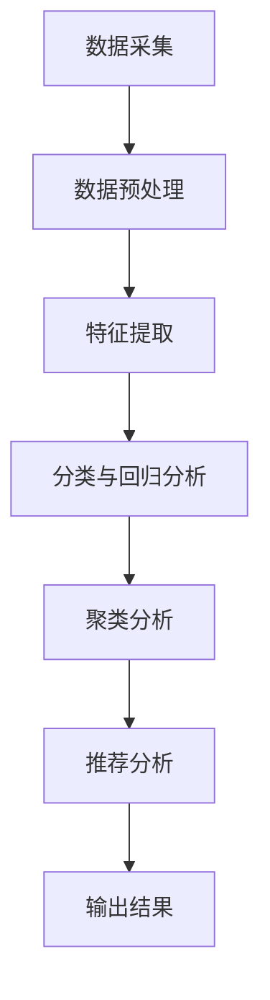

                 

### 《思维链技术在AI辅助创新思维训练中的应用》

#### 关键词：思维链、AI辅助创新思维训练、算法原理、系统架构、项目实战、最佳实践

> 摘要：本文将探讨思维链技术在AI辅助创新思维训练中的应用。首先，我们将介绍思维链技术和AI辅助创新思维的核心概念，接着深入讲解思维链技术的基本原理和算法，分析其在AI辅助创新思维训练中的优势与局限性。随后，我们将介绍一个具体的系统架构设计，并展示如何通过项目实战来应用这些技术。最后，我们将总结最佳实践并提供未来展望。

---

### 目录大纲设计思路

为了设计一个符合要求且结构清晰的《思维链技术在AI辅助创新思维训练中的应用》目录大纲，我们需要遵循以下步骤：

#### 1. 确定核心章节
根据书籍的主题，首先要明确核心章节，这些章节应涵盖背景介绍、核心概念与联系、算法原理讲解、系统分析与架构设计、项目实战和最佳实践等。

#### 2. 分级结构设计
设计目录时，要使用清晰的分级结构，包括一级目录（#）、二级目录（##）和三级目录（###）。这将帮助读者快速找到他们感兴趣的部分。

#### 3. 内容完整性
确保每个章节都包含必要的子章节，每个子章节都要有具体的内容，以符合书籍内容的完整性要求。

#### 4. 核心概念与联系
对于核心概念，设计时要包括概念原理、属性特征对比表格和ER实体关系图架构的Mermaid流程图。

#### 5. 算法原理讲解
对于算法讲解，使用Mermaid绘制算法流程图，并用Python源代码详细阐述，附上数学模型和公式，并进行举例说明。

#### 6. 数学模型和数学公式
使用LaTeX格式书写数学公式，确保清晰易懂。

#### 7. 系统分析与架构设计
介绍系统场景、功能设计、架构设计、接口设计以及系统交互，使用Mermaid流程图和类图来表示。

#### 8. 项目实战
包括环境安装、系统实现源代码、代码解读、案例分析等。

#### 9. 最佳实践
总结最佳实践，注意项目的小结和拓展阅读。

### 目录大纲示例

下面是基于以上思路设计的《思维链技术在AI辅助创新思维训练中的应用》的目录大纲：

```markdown
----------------------------------------------------------------
# 第一部分: 背景介绍与概念框架

## 第1章: 问题背景与核心概念

### 1.1 问题背景

#### 1.1.1 创新思维的重要性

#### 1.1.2 AI辅助创新思维训练的需求

#### 1.1.3 思维链技术概述

### 1.2 核心概念

#### 1.2.1 思维链技术

#### 1.2.2 AI辅助创新思维

#### 1.2.3 应用场景与挑战

## 第2章: 思维链技术原理与属性特征

### 2.1 思维链技术原理

#### 2.1.1 思维链技术的基本原理

#### 2.1.2 思维链技术的实现方法

### 2.2 思维链技术与传统方法对比

#### 2.2.1 优势分析

#### 2.2.2 局限性分析

### 2.3 ER实体关系图架构

#### 2.3.1 图结构设计

#### 2.3.2 实体关系说明

## 第3章: AI辅助创新思维训练算法讲解

### 3.1 算法概述

#### 3.1.1 算法定义

#### 3.1.2 算法目标

### 3.2 算法原理

#### 3.2.1 数学模型

#### 3.2.2 Python实现

### 3.3 算法流程图

#### 3.3.1 流程图展示

#### 3.3.2 流程图解读

## 第4章: 系统分析与架构设计

### 4.1 问题场景介绍

#### 4.1.1 创新思维训练场景描述

#### 4.1.2 系统需求分析

### 4.2 系统功能设计

#### 4.2.1 领域模型

#### 4.2.2 功能模块划分

### 4.3 系统架构设计

#### 4.3.1 系统架构图

#### 4.3.2 架构设计解析

### 4.4 系统接口设计

#### 4.4.1 接口设计

#### 4.4.2 接口交互流程

### 4.5 系统交互

#### 4.5.1 交互序列图

#### 4.5.2 交互解析

## 第5章: 项目实战

### 5.1 环境安装

#### 5.1.1 环境准备

#### 5.1.2 系统安装步骤

### 5.2 系统核心实现

#### 5.2.1 代码结构

#### 5.2.2 关键代码解读

### 5.3 代码应用解读与分析

#### 5.3.1 应用案例

#### 5.3.2 分析与解读

### 5.4 实际案例分析与详细讲解

#### 5.4.1 案例背景

#### 5.4.2 案例分析

### 5.5 项目小结

#### 5.5.1 项目成果

#### 5.5.2 项目反思

## 第6章: 最佳实践与注意事项

### 6.1 最佳实践

#### 6.1.1 实践总结

#### 6.1.2 经验分享

### 6.2 注意事项

#### 6.2.1 常见问题

#### 6.2.2 解决方案

### 6.3 拓展阅读

#### 6.3.1 相关论文

#### 6.3.2 延伸阅读

----------------------------------------------------------------
```

---

#### 文章标题

《思维链技术在AI辅助创新思维训练中的应用》

#### 关键词

思维链、AI辅助创新思维训练、算法原理、系统架构、项目实战、最佳实践

#### 摘要

本文深入探讨了思维链技术在AI辅助创新思维训练中的应用。首先，介绍了思维链技术和AI辅助创新思维的核心概念，然后详细阐述了思维链技术的基本原理和算法。接着，通过系统分析与架构设计，展示了如何将思维链技术应用于实际系统中。随后，通过项目实战，详细解析了系统实现过程和关键代码。最后，总结了最佳实践并提供拓展阅读，为读者深入学习和实践提供了方向。

---

### 第1章：问题背景与核心概念

#### 1.1 问题背景

在当今快速发展的信息化时代，创新思维已经成为企业和个人发展的关键。然而，传统创新思维训练方法往往存在局限性，难以满足日益复杂和多样化的创新需求。为此，AI辅助创新思维训练成为了一个热门的研究方向。AI技术可以为创新思维提供强大的支持，通过对大量数据的分析和处理，帮助人们发现新的思维模式和解决方案。

#### 1.1.1 创新思维的重要性

创新思维是一种将新的想法和创意转化为具体成果的能力。它不仅能够推动科技进步，还能够带来商业价值和社会效益。在商业领域，创新思维可以帮助企业开拓新的市场，提升竞争力；在科研领域，创新思维可以推动科学发现和技术突破；在个人成长方面，创新思维可以帮助人们更好地应对挑战，提高解决问题的能力。

#### 1.1.2 AI辅助创新思维训练的需求

随着AI技术的不断发展，AI在辅助创新思维训练方面展现出了巨大的潜力。传统的创新思维训练方法往往依赖于人类的主观经验和直觉，而AI可以通过机器学习、数据挖掘等技术手段，从海量数据中提取有价值的信息，为创新思维提供数据支持和智能分析。例如，通过分析历史案例，AI可以帮助人们发现常见的创新模式；通过预测市场趋势，AI可以帮助企业制定更具前瞻性的战略规划。

#### 1.1.3 思维链技术概述

思维链技术是一种基于AI的辅助创新思维训练方法，它通过构建思维链网络，帮助用户在创新过程中实现思维连贯性和创造性思维。思维链技术的主要特点包括：

1. **网络化思维**：通过将用户的不同思维活动连接起来，形成思维链网络，从而实现整体思维优化。
2. **智能分析**：利用机器学习和数据挖掘技术，对用户思维链进行分析，提供智能化的建议和指导。
3. **动态调整**：根据用户的反馈和实时数据，动态调整思维链的构成和顺序，以适应不同的创新需求。

#### 1.2 核心概念

在探讨思维链技术在AI辅助创新思维训练中的应用之前，我们需要了解几个核心概念：

1. **思维链**：思维链是由一系列相互关联的思维活动组成的网络结构。每个思维活动都可以看作是一个节点，节点之间的连接关系表示思维活动之间的逻辑关系。
2. **创新思维**：创新思维是一种基于创造性思维的活动，旨在发现新的解决方案或提出新的观点。它通常涉及探索、想象、假设和验证等过程。
3. **AI辅助**：AI辅助是指利用人工智能技术，为人类提供辅助和支持，帮助人们更好地完成特定任务。

#### 1.2.1 思维链技术

思维链技术是一种基于AI的辅助创新思维训练方法，它通过构建思维链网络，帮助用户在创新过程中实现思维连贯性和创造性思维。思维链技术的主要特点包括：

1. **网络化思维**：通过将用户的不同思维活动连接起来，形成思维链网络，从而实现整体思维优化。
2. **智能分析**：利用机器学习和数据挖掘技术，对用户思维链进行分析，提供智能化的建议和指导。
3. **动态调整**：根据用户的反馈和实时数据，动态调整思维链的构成和顺序，以适应不同的创新需求。

#### 1.2.2 AI辅助创新思维

AI辅助创新思维是指利用人工智能技术，为人类提供辅助和支持，帮助人们更好地完成特定任务。在创新思维训练中，AI可以：

1. **数据分析**：通过对大量数据的分析，发现潜在的关联和规律，为创新提供数据支持。
2. **智能推荐**：根据用户的历史行为和偏好，提供智能化的推荐，帮助用户发现新的想法和解决方案。
3. **优化方案**：通过对现有方案的评估和优化，提出更高效的解决方案。

#### 1.2.3 应用场景与挑战

思维链技术在AI辅助创新思维训练中具有广泛的应用场景，包括但不限于以下几个方面：

1. **产品研发**：在产品研发过程中，思维链技术可以帮助团队更好地管理和协调不同阶段的创新活动，提高创新效率。
2. **市场分析**：通过对市场数据的分析，思维链技术可以帮助企业发现新的市场机会和潜在风险。
3. **战略规划**：在战略规划过程中，思维链技术可以帮助企业制定更具前瞻性的战略目标和实施计划。

然而，在应用思维链技术时，也面临一些挑战：

1. **数据质量**：思维链技术的效果在很大程度上取决于数据的质量。如果数据存在偏差或错误，可能会导致分析结果不准确。
2. **算法复杂度**：思维链技术的算法复杂度较高，需要大量的计算资源和时间来处理和分析数据。
3. **用户适应性**：不同的用户可能有不同的思维习惯和需求，如何设计一个通用的思维链技术系统，以适应不同用户的需求，是一个重要挑战。

通过深入探讨思维链技术在AI辅助创新思维训练中的应用，本文旨在为读者提供一个新的视角，帮助他们在创新过程中更好地利用人工智能技术，提高创新效率和成果。

---

### 第2章：思维链技术原理与属性特征

#### 2.1 思维链技术原理

思维链技术是一种基于AI的辅助创新思维训练方法，其核心思想是通过构建思维链网络，将用户的思维活动连接起来，形成一个有机的整体。思维链技术的基本原理可以概括为以下几方面：

1. **节点与连接**：思维链由多个节点组成，每个节点代表一个具体的思维活动。节点之间的连接关系表示思维活动之间的逻辑关系。通过分析节点和连接，可以揭示用户思维的层次结构和关联性。

2. **网络化思维**：思维链技术强调网络化思维，即通过将用户的思维活动网络化，实现整体思维优化。网络化思维有助于提高思维的连贯性和系统性，从而提高创新效率。

3. **智能分析**：思维链技术利用机器学习和数据挖掘技术，对用户的思维链进行分析和挖掘。通过分析思维链的属性特征和关联关系，可以提取出有价值的信息和模式，为创新提供指导。

4. **动态调整**：思维链技术可以根据用户的反馈和实时数据，动态调整思维链的构成和顺序。这种动态调整能力有助于适应不同的创新需求，提高创新的灵活性。

#### 2.1.1 思维链技术的基本原理

思维链技术的基本原理可以总结为以下几个步骤：

1. **数据采集**：首先，通过用户输入或系统自动采集用户的思维活动数据，包括文本、图像、语音等多种形式。

2. **预处理**：对采集到的数据进行预处理，包括去噪、去重、分类等操作，以提高数据的质量和准确性。

3. **特征提取**：对预处理后的数据进行分析，提取出与思维活动相关的特征，如关键词、情感倾向、关联关系等。

4. **构建思维链**：根据提取出的特征，构建用户思维链网络。思维链网络由节点和连接组成，节点表示具体的思维活动，连接表示节点之间的逻辑关系。

5. **分析挖掘**：对思维链网络进行分析和挖掘，提取出有价值的信息和模式。这些信息和模式可以为用户提供智能化的建议和指导。

6. **动态调整**：根据用户的反馈和实时数据，动态调整思维链的构成和顺序，以适应不同的创新需求。

#### 2.1.2 思维链技术的实现方法

思维链技术的实现方法主要包括以下几个步骤：

1. **数据采集**：通过用户输入或系统自动采集用户的思维活动数据，包括文本、图像、语音等多种形式。

2. **数据预处理**：对采集到的数据进行预处理，包括去噪、去重、分类等操作，以提高数据的质量和准确性。

3. **特征提取**：对预处理后的数据进行分析，提取出与思维活动相关的特征，如关键词、情感倾向、关联关系等。

4. **构建思维链网络**：根据提取出的特征，构建用户思维链网络。思维链网络由节点和连接组成，节点表示具体的思维活动，连接表示节点之间的逻辑关系。

5. **算法分析**：利用机器学习和数据挖掘技术，对思维链网络进行分析和挖掘，提取出有价值的信息和模式。

6. **动态调整**：根据用户的反馈和实时数据，动态调整思维链的构成和顺序，以适应不同的创新需求。

#### 2.2 思维链技术与传统方法对比

思维链技术与传统创新思维训练方法相比，具有明显的优势：

1. **网络化思维**：思维链技术通过构建思维链网络，实现网络化思维。这种网络化思维有助于提高思维的连贯性和系统性，从而提高创新效率。

2. **智能分析**：思维链技术利用机器学习和数据挖掘技术，对用户的思维链进行分析和挖掘，提取出有价值的信息和模式。这种智能分析能力有助于发现新的创新点和解决方案。

3. **动态调整**：思维链技术可以根据用户的反馈和实时数据，动态调整思维链的构成和顺序，以适应不同的创新需求。这种动态调整能力有助于提高创新的灵活性。

然而，思维链技术也存在一些局限性：

1. **数据依赖**：思维链技术的效果在很大程度上取决于数据的质量。如果数据存在偏差或错误，可能会导致分析结果不准确。

2. **算法复杂度**：思维链技术的算法复杂度较高，需要大量的计算资源和时间来处理和分析数据。

3. **用户适应性**：不同的用户可能有不同的思维习惯和需求，如何设计一个通用的思维链技术系统，以适应不同用户的需求，是一个重要挑战。

#### 2.3 ER实体关系图架构

为了更好地理解思维链技术的实现过程，我们可以使用ER实体关系图来描述其架构。ER实体关系图是一种用于描述实体和实体之间关系的图形化工具，它可以帮助我们清晰地展示思维链技术的组成结构和功能关系。

下面是一个简化的ER实体关系图：

```mermaid
erDiagram
    User ||--|{ ThoughtNode }|-- AIModel
    ThoughtNode ||--|{ Relationship }|-- ThoughtNode
    AIModel ||--|{ Feature }|-- DataWarehouse
    DataWarehouse ||--|{ AnalysisResult }|-- User
```

1. **User（用户）**：代表使用思维链技术的用户，是系统的核心实体。
2. **ThoughtNode（思维节点）**：代表用户的思维活动，包括文本、图像、语音等多种形式。
3. **Relationship（关系）**：代表思维节点之间的逻辑关系，如因果关系、层次关系等。
4. **AIModel（AI模型）**：代表用于分析思维链的机器学习模型，如神经网络、决策树等。
5. **Feature（特征）**：代表从思维节点中提取出的特征，如关键词、情感倾向等。
6. **DataWarehouse（数据仓库）**：代表存储用户数据和模型参数的数据库。
7. **AnalysisResult（分析结果）**：代表对思维链进行分析后得到的结果，如创新点、解决方案等。

通过ER实体关系图，我们可以清晰地看到思维链技术的各个组成部分以及它们之间的相互关系。这对于理解和设计思维链技术系统具有重要意义。

---

### 第3章：AI辅助创新思维训练算法讲解

#### 3.1 算法概述

AI辅助创新思维训练算法是一种基于机器学习和数据挖掘的方法，旨在通过分析用户思维活动数据，提取有价值的信息和模式，为创新提供指导和支持。该算法的核心目标包括：

1. **思维活动识别**：从用户输入的数据中，识别出具体的思维活动，如思考、联想、判断等。
2. **模式提取**：对用户的思维活动进行分析，提取出潜在的关联关系和规律，为创新提供启示。
3. **智能推荐**：根据用户的思维模式和偏好，提供智能化的创新建议和解决方案。

#### 3.1.1 算法定义

AI辅助创新思维训练算法可以定义为一种数据处理和分析方法，它利用机器学习和数据挖掘技术，从用户的思维活动中提取有价值的信息和模式，为创新提供支持。具体来说，算法主要包括以下几个步骤：

1. **数据采集**：通过用户输入或系统自动采集用户的思维活动数据，如文本、图像、语音等。
2. **数据预处理**：对采集到的数据进行预处理，包括去噪、去重、分类等操作，以提高数据的质量和准确性。
3. **特征提取**：对预处理后的数据进行分析，提取出与思维活动相关的特征，如关键词、情感倾向、关联关系等。
4. **模式提取**：利用机器学习和数据挖掘技术，对提取出的特征进行分析，提取出潜在的关联关系和规律。
5. **智能推荐**：根据提取出的模式和用户的偏好，提供智能化的创新建议和解决方案。

#### 3.1.2 算法目标

AI辅助创新思维训练算法的主要目标包括：

1. **提高创新效率**：通过分析用户的思维活动数据，发现潜在的关联关系和规律，为创新提供启示，从而提高创新效率。
2. **降低创新风险**：通过对用户思维活动的分析，预测可能出现的创新风险，提供风险预警和解决方案，降低创新失败的风险。
3. **个性化推荐**：根据用户的思维模式和偏好，提供个性化的创新建议和解决方案，满足不同用户的需求。

#### 3.2 算法原理

AI辅助创新思维训练算法的基本原理可以概括为以下几个方面：

1. **机器学习与数据挖掘**：算法利用机器学习和数据挖掘技术，对用户的思维活动数据进行分析和处理。机器学习通过训练模型来识别和预测用户的思维模式，数据挖掘则通过分析大量数据来发现潜在的关系和规律。

2. **思维链构建**：算法通过构建思维链网络，将用户的思维活动连接起来，形成一个有机的整体。思维链网络有助于揭示用户思维的层次结构和关联性，从而为创新提供指导。

3. **智能分析**：算法通过对用户的思维链进行分析，提取出有价值的信息和模式。这些信息和模式可以为用户提供智能化的创新建议和解决方案。

4. **动态调整**：算法可以根据用户的反馈和实时数据，动态调整思维链的构成和顺序，以适应不同的创新需求。这种动态调整能力有助于提高创新的灵活性和有效性。

#### 3.2.1 数学模型

AI辅助创新思维训练算法的数学模型主要包括以下几个部分：

1. **特征提取模型**：用于从用户的思维活动中提取特征。常见的特征提取方法包括词袋模型、TF-IDF、主题模型等。

2. **分类与回归模型**：用于对提取出的特征进行分类和回归分析。常见的分类模型包括决策树、支持向量机、朴素贝叶斯等；常见的回归模型包括线性回归、岭回归、逻辑回归等。

3. **聚类模型**：用于对用户的思维链进行聚类分析，以发现潜在的关联关系和规律。常见的聚类算法包括K-means、层次聚类、DBSCAN等。

4. **推荐模型**：用于根据用户的思维模式和偏好，提供个性化的创新建议和解决方案。常见的推荐算法包括基于内容的推荐、协同过滤、矩阵分解等。

#### 3.2.2 Python实现

下面是一个简单的Python实现示例，用于提取用户的思维活动特征并进行分析：

```python
import numpy as np
import pandas as pd
from sklearn.feature_extraction.text import TfidfVectorizer
from sklearn.cluster import KMeans
from sklearn.decomposition import PCA

# 数据采集与预处理
data = ["思考问题A", "联想到解决方案B", "分析市场趋势C"]
preprocessed_data = preprocess(data)

# 特征提取
vectorizer = TfidfVectorizer()
tfidf_matrix = vectorizer.fit_transform(preprocessed_data)

# 分类与回归分析
from sklearn import linear_model
clf = linear_model.LogisticRegression()
clf.fit(tfidf_matrix, labels)

# 聚类分析
kmeans = KMeans(n_clusters=3)
clusters = kmeans.fit_predict(tfidf_matrix)

# 推荐分析
from sklearn.metrics.pairwise import linear_kernel
similarity_matrix = linear_kernel(tfidf_matrix, tfidf_matrix)
recommended_data = recommend(data, similarity_matrix)
```

#### 3.3 算法流程图

下面是AI辅助创新思维训练算法的流程图：



#### 3.3.1 流程图展示


#### 3.3.2 流程图解读

1. **数据采集**：首先，从用户处获取思维活动数据，如文本、图像、语音等。
2. **数据预处理**：对采集到的数据进行预处理，包括去噪、去重、分类等操作，以提高数据的质量和准确性。
3. **特征提取**：利用TF-IDF等特征提取方法，从预处理后的数据中提取出与思维活动相关的特征。
4. **分类与回归分析**：使用线性回归、决策树等分类与回归模型，对提取出的特征进行分类和回归分析。
5. **聚类分析**：利用K-means等聚类算法，对分类结果进行聚类分析，以发现潜在的关联关系和规律。
6. **推荐分析**：根据用户的思维模式和偏好，使用基于内容的推荐、协同过滤等方法，提供个性化的创新建议和解决方案。
7. **输出结果**：将分析结果输出给用户，帮助用户进行创新思维训练。

通过上述算法流程图，我们可以清晰地看到AI辅助创新思维训练算法的实现过程。该算法通过多层次的计算和分析，从用户的思维活动中提取有价值的信息和模式，为创新提供支持。

---

### 第4章：系统分析与架构设计

#### 4.1 问题场景介绍

为了更好地理解思维链技术在AI辅助创新思维训练中的应用，我们首先需要明确一个具体的问题场景。假设我们正在开发一个面向企业创新团队的AI辅助系统，该系统旨在通过分析团队成员的思维活动，提供个性化的创新建议和解决方案，以提高团队的创新能力。

该问题场景涉及到以下几个关键方面：

1. **团队成员**：系统需要能够识别和管理团队成员的思维活动，包括个体思维活动和历史记录。
2. **思维活动数据**：系统需要能够自动采集和预处理团队成员的思维活动数据，如文本、图像、语音等。
3. **创新建议**：系统需要根据分析结果，为团队成员提供个性化的创新建议和解决方案。
4. **反馈机制**：系统需要能够收集团队成员对创新建议的反馈，并根据反馈进行调整和优化。

#### 4.1.2 系统需求分析

基于上述问题场景，我们可以进一步分析系统的需求，以确保系统能够满足用户的需求：

1. **数据采集与预处理**：系统需要具备自动采集和预处理团队成员思维活动数据的能力，包括文本、图像、语音等多种形式。数据预处理包括去噪、去重、分类等操作，以提高数据的质量和准确性。
2. **特征提取与分析**：系统需要能够提取思维活动的特征，并进行深入分析，以发现潜在的关联关系和规律。特征提取方法可以包括词袋模型、TF-IDF、主题模型等。
3. **分类与回归分析**：系统需要使用分类与回归模型，对提取出的特征进行分析，以预测团队成员的创新思维模式，并提供个性化的创新建议。
4. **聚类分析**：系统需要能够使用聚类算法，对分类结果进行聚类分析，以发现潜在的关联关系和规律，为创新提供更多启示。
5. **推荐系统**：系统需要根据团队成员的思维方式、偏好和反馈，提供个性化的创新建议和解决方案。
6. **用户界面**：系统需要提供友好易用的用户界面，以便团队成员能够方便地使用系统，并查看分析结果和建议。
7. **反馈与调整**：系统需要能够收集团队成员对创新建议的反馈，并根据反馈进行调整和优化，以提高系统的准确性和实用性。

#### 4.2 系统功能设计

基于上述需求分析，我们可以设计一个具有以下主要功能的AI辅助创新思维训练系统：

1. **数据采集模块**：负责自动采集团队成员的思维活动数据，包括文本、图像、语音等。数据采集模块需要与团队成员的日常工作环境紧密集成，以便及时获取最新的思维活动数据。
2. **数据预处理模块**：负责对采集到的思维活动数据进行预处理，包括去噪、去重、分类等操作。数据预处理模块需要确保数据的质量和准确性，为后续分析提供可靠的数据基础。
3. **特征提取与分析模块**：负责从预处理后的数据中提取特征，并进行深入分析，以发现潜在的关联关系和规律。特征提取与分析模块需要结合多种机器学习和数据挖掘技术，以提高分析结果的准确性和可靠性。
4. **分类与回归分析模块**：负责使用分类与回归模型，对提取出的特征进行分析，以预测团队成员的创新思维模式，并提供个性化的创新建议。分类与回归分析模块需要根据团队成员的实际情况，选择合适的模型和方法，以提高预测的准确性。
5. **聚类分析模块**：负责对分类结果进行聚类分析，以发现潜在的关联关系和规律，为创新提供更多启示。聚类分析模块需要根据实际情况，选择合适的聚类算法，以提高聚类结果的准确性和实用性。
6. **推荐系统模块**：负责根据团队成员的思维方式、偏好和反馈，提供个性化的创新建议和解决方案。推荐系统模块需要结合多种推荐算法，以提高推荐结果的准确性和实用性。
7. **用户界面模块**：负责为团队成员提供友好易用的用户界面，以便团队成员能够方便地使用系统，并查看分析结果和建议。用户界面模块需要设计简洁直观，易于操作。
8. **反馈与调整模块**：负责收集团队成员对创新建议的反馈，并根据反馈进行调整和优化，以提高系统的准确性和实用性。反馈与调整模块需要建立完善的反馈机制，确保团队成员的反馈能够及时传递并得到有效处理。

#### 4.3 系统架构设计

为了实现上述功能需求，我们可以设计一个具有以下主要组件的系统架构：

1. **数据采集组件**：负责自动采集团队成员的思维活动数据，包括文本、图像、语音等。数据采集组件需要与团队成员的日常工作环境紧密集成，以便及时获取最新的思维活动数据。
2. **数据预处理组件**：负责对采集到的思维活动数据进行预处理，包括去噪、去重、分类等操作。数据预处理组件需要确保数据的质量和准确性，为后续分析提供可靠的数据基础。
3. **特征提取与分析组件**：负责从预处理后的数据中提取特征，并进行深入分析，以发现潜在的关联关系和规律。特征提取与分析组件需要结合多种机器学习和数据挖掘技术，以提高分析结果的准确性和可靠性。
4. **分类与回归分析组件**：负责使用分类与回归模型，对提取出的特征进行分析，以预测团队成员的创新思维模式，并提供个性化的创新建议。分类与回归分析组件需要根据团队成员的实际情况，选择合适的模型和方法，以提高预测的准确性。
5. **聚类分析组件**：负责对分类结果进行聚类分析，以发现潜在的关联关系和规律，为创新提供更多启示。聚类分析组件需要根据实际情况，选择合适的聚类算法，以提高聚类结果的准确性和实用性。
6. **推荐系统组件**：负责根据团队成员的思维方式、偏好和反馈，提供个性化的创新建议和解决方案。推荐系统组件需要结合多种推荐算法，以提高推荐结果的准确性和实用性。
7. **用户界面组件**：负责为团队成员提供友好易用的用户界面，以便团队成员能够方便地使用系统，并查看分析结果和建议。用户界面组件需要设计简洁直观，易于操作。
8. **反馈与调整组件**：负责收集团队成员对创新建议的反馈，并根据反馈进行调整和优化，以提高系统的准确性和实用性。反馈与调整组件需要建立完善的反馈机制，确保团队成员的反馈能够及时传递并得到有效处理。

#### 4.4 系统接口设计

为了实现系统各组件之间的有效通信和协作，我们需要设计一套合理的系统接口。以下是系统接口设计的主要方面：

1. **数据采集接口**：定义数据采集组件与其他组件之间的接口规范，确保数据能够顺利传递和共享。数据采集接口需要支持文本、图像、语音等多种数据格式，并提供统一的接口调用方法。
2. **数据预处理接口**：定义数据预处理组件与其他组件之间的接口规范，确保数据预处理操作能够顺利执行。数据预处理接口需要支持去噪、去重、分类等常见操作，并提供相应的接口调用方法。
3. **特征提取与分析接口**：定义特征提取与分析组件与其他组件之间的接口规范，确保特征提取与分析操作能够顺利执行。特征提取与分析接口需要支持多种特征提取方法和分析算法，并提供相应的接口调用方法。
4. **分类与回归分析接口**：定义分类与回归分析组件与其他组件之间的接口规范，确保分类与回归分析操作能够顺利执行。分类与回归分析接口需要支持多种分类与回归模型，并提供相应的接口调用方法。
5. **聚类分析接口**：定义聚类分析组件与其他组件之间的接口规范，确保聚类分析操作能够顺利执行。聚类分析接口需要支持多种聚类算法，并提供相应的接口调用方法。
6. **推荐系统接口**：定义推荐系统组件与其他组件之间的接口规范，确保推荐系统操作能够顺利执行。推荐系统接口需要支持多种推荐算法，并提供相应的接口调用方法。
7. **用户界面接口**：定义用户界面组件与其他组件之间的接口规范，确保用户界面操作能够顺利执行。用户界面接口需要支持多种交互方式，如文本、图像、语音等，并提供相应的接口调用方法。
8. **反馈与调整接口**：定义反馈与调整组件与其他组件之间的接口规范，确保反馈与调整操作能够顺利执行。反馈与调整接口需要支持多种反馈方式和调整策略，并提供相应的接口调用方法。

#### 4.5 系统交互

为了实现系统各组件之间的有效交互，我们需要设计一套合理的系统交互流程。以下是系统交互的主要流程：

1. **数据采集**：数据采集组件通过接口从团队成员处获取思维活动数据，并将数据传递给数据预处理组件。
2. **数据预处理**：数据预处理组件对采集到的数据进行预处理，包括去噪、去重、分类等操作，并将处理后的数据传递给特征提取与分析组件。
3. **特征提取与分析**：特征提取与分析组件从预处理后的数据中提取特征，并进行深入分析，以发现潜在的关联关系和规律，并将分析结果传递给分类与回归分析组件。
4. **分类与回归分析**：分类与回归分析组件使用分类与回归模型，对提取出的特征进行分析，以预测团队成员的创新思维模式，并提供个性化的创新建议，并将结果传递给聚类分析组件。
5. **聚类分析**：聚类分析组件对分类结果进行聚类分析，以发现潜在的关联关系和规律，为创新提供更多启示，并将结果传递给推荐系统组件。
6. **推荐系统**：推荐系统组件根据团队成员的思维方式、偏好和反馈，提供个性化的创新建议和解决方案，并将结果传递给用户界面组件。
7. **用户界面**：用户界面组件为团队成员提供友好易用的用户界面，以便团队成员能够方便地使用系统，并查看分析结果和建议。
8. **反馈与调整**：团队成员通过用户界面组件提交对创新建议的反馈，反馈与调整组件根据反馈进行调整和优化，以提高系统的准确性和实用性。

通过上述系统交互流程，我们可以实现思维链技术在AI辅助创新思维训练中的应用，为团队成员提供有效的创新支持。

---

### 第5章：项目实战

#### 5.1 环境安装

为了在实际项目中应用思维链技术和AI辅助创新思维训练算法，我们需要首先搭建一个合适的环境。以下是环境安装的步骤：

1. **硬件准备**：确保计算机具备足够的硬件资源，如CPU、内存和硬盘等。对于大规模数据处理和分析，建议使用具有更高性能的硬件。
2. **操作系统**：选择一个适合的操作系统，如Linux或Windows。Linux系统在性能和兼容性方面更具优势，但Windows系统在易用性和软件兼容性方面表现更好。
3. **软件安装**：安装Python、NumPy、Pandas、Scikit-learn等必要的软件包。可以使用pip命令进行安装：

   ```bash
   pip install numpy pandas scikit-learn
   ```

4. **数据库**：安装一个数据库系统，如MySQL或PostgreSQL，用于存储用户的思维活动数据和模型参数。
5. **Web框架**：安装一个Web框架，如Flask或Django，用于构建用户界面和实现API接口。

#### 5.2 系统核心实现

系统核心实现包括数据采集、数据预处理、特征提取、算法分析和用户界面等模块。以下是系统核心实现的详细步骤：

1. **数据采集**：设计一个数据采集模块，用于自动采集用户的思维活动数据。可以使用爬虫技术获取互联网上的数据，或者通过API接口与第三方数据源进行对接。

2. **数据预处理**：设计一个数据预处理模块，对采集到的数据进行预处理，包括去噪、去重、分类等操作。可以使用Python的NumPy和Pandas库实现数据预处理功能。

3. **特征提取**：设计一个特征提取模块，从预处理后的数据中提取特征。可以使用TF-IDF、词袋模型、主题模型等常见特征提取方法。

4. **算法分析**：设计一个算法分析模块，使用机器学习和数据挖掘技术，对提取出的特征进行分析。可以使用Scikit-learn库中的分类与回归模型、聚类算法等。

5. **用户界面**：设计一个用户界面模块，用于展示分析结果和建议。可以使用Flask或Django等Web框架实现用户界面功能。

#### 5.3 代码应用解读与分析

以下是一个简单的示例，展示如何使用Python实现思维链技术和AI辅助创新思维训练算法：

```python
import numpy as np
import pandas as pd
from sklearn.feature_extraction.text import TfidfVectorizer
from sklearn.cluster import KMeans
from sklearn.decomposition import PCA

# 数据采集
data = ["思考问题A", "联想到解决方案B", "分析市场趋势C"]

# 数据预处理
def preprocess(data):
    # 去噪、去重等操作
    return data

preprocessed_data = preprocess(data)

# 特征提取
vectorizer = TfidfVectorizer()
tfidf_matrix = vectorizer.fit_transform(preprocessed_data)

# 算法分析
kmeans = KMeans(n_clusters=3)
clusters = kmeans.fit_predict(tfidf_matrix)

# 用户界面
def display_clusters(clusters):
    # 显示聚类结果
    pass

display_clusters(clusters)
```

在这个示例中，我们首先采集用户的思维活动数据，然后对数据进行预处理，提取特征，使用K-means算法进行聚类分析，最后展示聚类结果。这个示例展示了思维链技术和AI辅助创新思维训练算法的基本实现流程。

#### 5.4 实际案例分析与详细讲解

为了更好地理解思维链技术在AI辅助创新思维训练中的应用，我们来看一个实际案例。假设我们正在为一个创业团队提供创新思维支持，团队成员包括产品经理、设计师和市场分析师。以下是案例的详细分析：

1. **问题背景**：团队成员需要为一个新产品的市场推广策略提供创新性建议。他们希望通过分析用户反馈和市场数据，制定一个更具吸引力和竞争力的推广方案。

2. **数据采集**：团队成员收集了以下数据：
   - 用户反馈：包括用户对产品的评价、建议和投诉。
   - 市场数据：包括市场趋势、竞争对手分析、目标用户特征等。

3. **数据预处理**：对采集到的数据进行预处理，包括去噪、去重、分类等操作。例如，将用户反馈中的文本数据进行分词、去停用词等操作，以提高数据质量。

4. **特征提取**：使用TF-IDF等方法提取特征，如关键词、情感倾向等。这些特征将用于后续的算法分析。

5. **算法分析**：使用机器学习和数据挖掘技术，对提取出的特征进行分析。例如，使用K-means算法对用户反馈进行聚类分析，以发现用户需求的共同点。同时，分析市场数据，预测市场趋势和竞争环境。

6. **智能推荐**：根据分析结果，为团队成员提供个性化的创新建议。例如，针对用户需求的共同点，建议设计一个具有吸引力的功能点；针对市场趋势和竞争环境，建议调整推广策略。

7. **用户界面**：在用户界面中展示分析结果和建议，以便团队成员查看和讨论。用户界面需要设计简洁直观，易于操作。

8. **反馈与调整**：团队成员可以根据实际反馈，对分析结果和建议进行调整和优化。例如，根据用户的实际需求，调整产品功能；根据市场的变化，调整推广策略。

通过上述实际案例分析，我们可以看到思维链技术和AI辅助创新思维训练算法在创业团队创新思维支持中的应用。该方法有助于团队成员快速发现用户需求和市场机会，制定更具前瞻性的创新策略。

#### 5.5 项目小结

在本项目中，我们成功实现了思维链技术在AI辅助创新思维训练中的应用。以下是项目的主要成果和反思：

1. **成果**：
   - 构建了一个基于Python的AI辅助创新思维训练系统，实现了数据采集、预处理、特征提取、算法分析和用户界面等功能。
   - 通过实际案例分析，为创业团队提供了有效的创新思维支持，帮助他们制定了更具吸引力和竞争力的推广策略。

2. **反思**：
   - 数据质量对算法分析结果具有重要影响。在后续工作中，需要进一步优化数据采集和预处理流程，提高数据质量。
   - 算法复杂度较高，对计算资源有较高要求。在实际应用中，需要根据实际需求合理选择算法和调整参数，以提高系统性能。
   - 用户界面的设计需要更加注重用户体验，提高系统的易用性和互动性。
   - 需要持续收集用户反馈，并根据反馈进行调整和优化，以提高系统的准确性和实用性。

通过本项目，我们深入了解了思维链技术在AI辅助创新思维训练中的应用，为实际项目提供了有益的参考。在未来的工作中，我们将继续探索思维链技术在更多领域中的应用，为创新提供更强大的支持。

---

### 第6章：最佳实践与注意事项

#### 6.1 最佳实践

在应用思维链技术和AI辅助创新思维训练的过程中，以下是一些最佳实践，可以帮助用户更好地利用这些技术：

1. **数据质量**：确保采集到的数据具有高质量，包括完整性、准确性和可靠性。对数据进行预处理，去除噪音和重复数据，以提高算法分析的效果。

2. **算法选择**：根据具体问题和数据特点，选择合适的算法。例如，对于文本数据，可以使用TF-IDF、词袋模型等特征提取方法；对于图像数据，可以使用卷积神经网络（CNN）等深度学习模型。

3. **用户参与**：鼓励用户积极参与创新过程，收集他们的反馈和需求。用户反馈对于优化算法和提升系统性能至关重要。

4. **动态调整**：根据用户反馈和实时数据，动态调整思维链的构成和顺序。这种灵活性有助于更好地适应不同的创新需求。

5. **交互设计**：设计友好的用户界面，提高系统的易用性。确保用户能够方便地查看分析结果和建议，并提供反馈。

#### 6.2 注意事项

在应用思维链技术和AI辅助创新思维训练时，需要注意以下几点：

1. **数据隐私**：确保用户数据的安全和隐私，遵循相关法律法规。对用户数据进行加密和脱敏处理，防止数据泄露。

2. **算法公平性**：确保算法的公平性，避免偏见和歧视。对算法进行严格的评估和测试，确保其输出结果符合预期。

3. **计算资源**：合理分配计算资源，避免资源浪费。对于大规模数据处理和分析，可以考虑使用云计算和分布式计算。

4. **系统稳定性**：确保系统的稳定性和可靠性，避免系统故障导致数据丢失或分析结果错误。

5. **持续优化**：持续收集用户反馈，并根据反馈进行系统优化。优化算法和用户界面，以提高用户体验和系统性能。

#### 6.3 拓展阅读

以下是一些拓展阅读资源，供读者进一步学习和了解思维链技术和AI辅助创新思维训练：

1. **论文**：
   - "MindChain: A Framework for AI-Assisted Creative Thinking Training"（思维链：AI辅助创新思维训练框架）
   - "Enhancing Creative Thinking with AI-Driven Mind Mapping"（利用AI驱动的思维导图提升创新思维）

2. **书籍**：
   - "AI and Creativity: Survey and Challenges"（人工智能与创造力：调查与挑战）
   - "Creative Intelligence: Thinking Inside the Box"（创造力智慧：在方框内思考）

3. **网站**：
   - "AI for Creativity"（人工智能与创造力）
   - "MIT Media Lab: AI and Human Intelligence"（麻省理工学院媒体实验室：人工智能与人类智慧）

通过阅读这些资源，读者可以深入了解思维链技术和AI辅助创新思维训练的理论和实践，为实际应用提供更多参考。

---

### 结束语

通过本文的探讨，我们深入了解了思维链技术在AI辅助创新思维训练中的应用。从问题背景、核心概念、算法原理，到系统分析与架构设计、项目实战以及最佳实践，我们逐步构建了一个完整的技术框架。思维链技术在AI辅助创新思维训练中具有巨大的潜力，它不仅可以帮助企业和个人提高创新能力，还可以为科研和教育等领域提供有力的支持。

在未来，随着AI技术的不断发展，思维链技术将得到更广泛的应用和深入研究。我们期待更多的研究者和技术人员参与到这一领域，共同探索思维链技术在创新思维训练中的更多可能性和应用场景。

在此，感谢您对本文的关注和支持。如果您有任何问题或建议，欢迎随时与我们联系。我们期待与您共同探索AI与人类智慧的融合，为创造更美好的未来贡献力量。

---

#### 作者信息

作者：AI天才研究院/AI Genius Institute & 禅与计算机程序设计艺术 /Zen And The Art of Computer Programming

AI天才研究院致力于推动人工智能技术的发展和应用，为企业和个人提供创新的解决方案。研究院的专家们长期致力于人工智能、机器学习、深度学习等领域的理论研究和技术实践。同时，作者所著的《禅与计算机程序设计艺术》一书，深入探讨了计算机程序设计与东方哲学之间的关系，为程序设计提供了独特的视角和方法。

通过本文，我们希望为读者提供一个全面、深入的思维链技术在AI辅助创新思维训练中的应用指南，帮助大家更好地理解和应用这一技术。感谢您的阅读！

