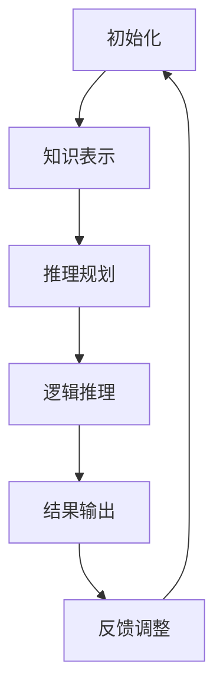
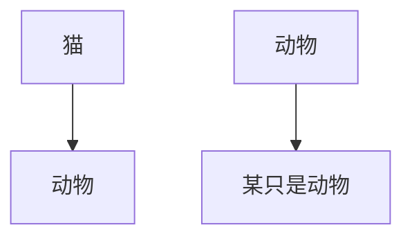
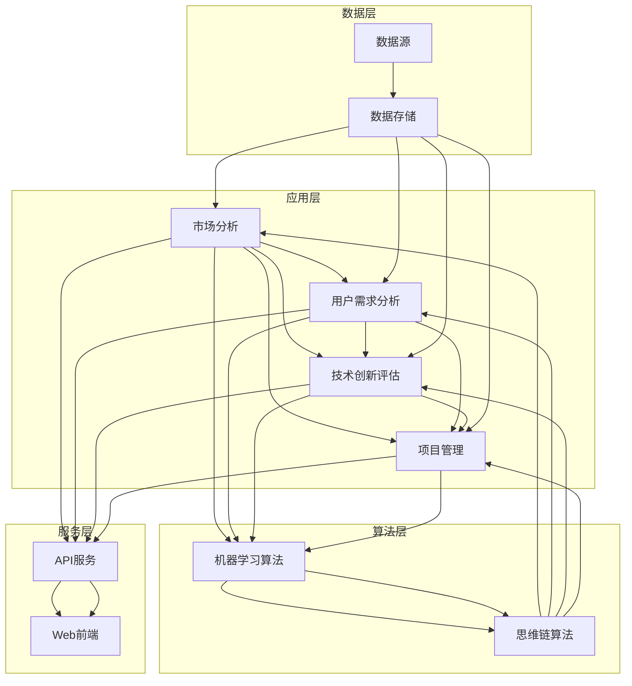
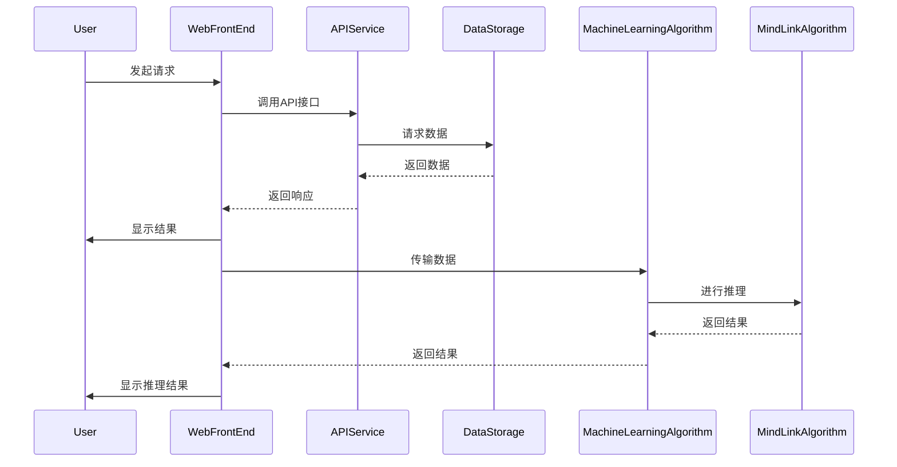

                 

### 1.1.3 创新管理面临的挑战

创新管理面临的挑战主要包括以下几个方面：

1. **信息过载**：随着数据量的爆炸性增长，企业难以从海量数据中提取有价值的信息。这导致企业在决策过程中容易受到数据噪音的干扰，影响创新决策的准确性和效率。

2. **创新能力不足**：传统的创新管理模式往往过于依赖经验，缺乏系统性和科学性。这种模式容易导致企业创新能力受限，难以快速适应市场变化，从而错失创新机遇。

3. **决策效率低下**：在创新过程中，决策环节复杂且耗时，容易导致项目延误和资源浪费。特别是在面对不确定性时，企业往往需要更多时间和资源进行风险评估和决策，导致创新项目无法按计划推进。

4. **协同创新困难**：创新活动通常涉及多个部门和团队成员的协同合作。然而，在传统的组织结构中，部门之间的信息交流不畅，难以实现有效的协同创新。

5. **知识产权保护**：在创新过程中，企业需要保护其创新成果的知识产权，以避免技术泄露和市场竞争压力。然而，知识产权保护制度不完善，以及企业自身保护意识不足，可能导致知识产权侵权纠纷。

### 1.2.1 研究目的

本研究旨在通过引入思维链技术，探索AI在辅助创新管理中的应用，解决上述挑战。具体研究目的如下：

1. **理论探索**：深入研究思维链技术的基本原理和特性，为AI辅助创新管理提供理论基础。

2. **应用实践**：通过实际案例，展示思维链技术在AI辅助创新管理中的具体应用，提高创新管理的效率和效果。

3. **算法优化**：结合机器学习算法，优化思维链技术的应用效果，提高创新决策的准确性和效率。

4. **协同创新**：研究如何利用思维链技术和AI技术，促进企业内部及跨企业的协同创新。

5. **风险评估**：利用AI技术，对企业创新过程中的风险进行评估和预警，降低创新失败的风险。

### 1.2.2 研究方法

本研究采用以下研究方法：

1. **文献综述**：通过查阅相关文献，了解思维链技术和AI辅助创新管理的相关理论和应用现状。

2. **案例研究**：选择具有代表性的企业案例，分析其创新管理实践，探讨思维链技术在其中的应用效果。

3. **实证分析**：通过对案例数据的分析，验证思维链技术在AI辅助创新管理中的有效性。

4. **算法优化**：结合机器学习算法，对思维链技术进行优化，提高其在创新管理中的应用效果。

### 1.2.3 边界与外延

1. **AI辅助创新管理的范围**：本研究主要关注AI在创新过程中的辅助作用，包括信息处理、决策支持、协同创新等方面。

2. **思维链技术的定义与应用领域**：思维链技术是一种基于人工智能的智能推理技术，主要用于知识表示、推理和问题求解。其应用领域包括智能问答系统、决策支持系统、智能推荐系统等。

3. **创新管理的核心要素**：创新管理涉及多个核心要素，包括创新目标、创新资源、创新流程、创新文化等。本研究将重点探讨这些要素在AI辅助创新管理中的应用。

4. **概念结构与核心要素组成**：本研究将构建思维链技术在AI辅助创新管理中的概念结构，分析其核心要素及其相互关系。

### 1.2.4 概念结构与核心要素组成

1. **思维链技术的核心概念**：思维链技术包括知识表示、推理引擎、问题求解等核心概念。

2. **创新管理的核心要素**：创新管理的核心要素包括创新目标、创新资源、创新流程、创新文化等。

3. **AI辅助创新管理的体系结构**：本研究将构建AI辅助创新管理的体系结构，分析思维链技术在其中的作用。

### 1.2.5 研究意义与贡献

1. **理论意义**：本研究为AI辅助创新管理提供了新的理论视角，丰富了创新管理和人工智能领域的相关理论。

2. **实践意义**：通过实际案例的分析，本研究为企业提供了有效的创新管理方法和工具，有助于提高创新效率和效果。

3. **创新点**：本研究创新性地引入思维链技术，探索其在AI辅助创新管理中的应用，为相关领域的研究提供了新的思路。

### 1.2.6 研究内容与章节安排

本论文共分为六个章节：

- **第1章**：引言。介绍研究背景、研究目的、研究方法、边界与外延、概念结构与核心要素组成，以及研究意义与贡献。

- **第2章**：核心概念与联系。阐述思维链技术和创新管理的基本原理，分析两者的联系。

- **第3章**：算法原理讲解。介绍思维链技术的算法原理、数学模型和Python实现。

- **第4章**：系统分析与架构设计。分析思维链技术在AI辅助创新管理中的系统架构和接口设计。

- **第5章**：项目实战。通过实际案例，展示思维链技术在AI辅助创新管理中的具体应用。

- **第6章**：最佳实践与拓展。总结研究成果，提出最佳实践建议，探讨未来研究方向。

### 1.2.7 小结

本章首先介绍了创新管理面临的主要挑战，如信息过载、创新能力不足、决策效率低下等。然后，明确了本研究的目的是通过引入思维链技术，探索AI在辅助创新管理中的应用。接下来，详细阐述了研究方法、边界与外延、概念结构与核心要素组成，以及研究意义与贡献。最后，对研究内容与章节安排进行了概述。

-----------------------------------------------------------------

## 第2章：核心概念与联系

### 2.1 思维链技术原理

#### 2.1.1 思维链的定义

思维链技术是一种基于人工智能的智能推理技术，它通过模拟人类思维过程中的逻辑推理和知识表示，实现自动推理和问题求解。思维链技术的核心在于建立一系列相互关联的“思维节点”，这些节点通过逻辑关系相互连接，形成一个复杂而有序的推理网络。

#### 2.1.2 思维链的属性特征

1. **知识表示能力**：思维链技术能够将复杂的问题和知识转化为计算机可以处理的数据结构，从而实现对知识的存储和利用。

2. **推理能力**：思维链技术具备较强的推理能力，能够根据给定的前提和规则，推导出新的结论。

3. **动态调整能力**：思维链技术能够在推理过程中根据新的信息和知识动态调整推理路径，提高推理的灵活性和准确性。

4. **自学习性**：思维链技术可以通过学习用户的推理过程和反馈，不断优化自身的推理能力和知识库。

#### 2.1.3 思维链的工作原理

思维链技术的工作原理主要包括以下几个步骤：

1. **知识表示**：将问题域中的概念、事实和规则转化为计算机可以处理的数据结构，例如知识图谱。

2. **推理规划**：根据问题的需求和已知信息，制定一个合理的推理计划，确定推理的顺序和方向。

3. **逻辑推理**：根据推理计划，运用逻辑推理规则，从已知信息推导出新的结论。

4. **反馈调整**：根据推理结果和用户的反馈，动态调整推理计划，优化推理过程。

#### 2.1.4 思维链技术的应用领域

思维链技术具有广泛的应用领域，主要包括：

1. **智能问答系统**：通过思维链技术，系统能够理解用户的问题，并提供准确、合理的回答。

2. **决策支持系统**：思维链技术能够辅助用户进行决策分析，提供科学的决策建议。

3. **智能推荐系统**：思维链技术可以根据用户的历史行为和偏好，推荐个性化的产品和服务。

4. **问题求解系统**：思维链技术能够帮助用户解决复杂的问题，提供有效的解决方案。

5. **知识管理系统**：思维链技术可以构建一个智能的知识管理系统，帮助用户快速查找和利用相关知识和信息。

### 2.2 创新管理原理

#### 2.2.1 创新管理的定义

创新管理是指企业为了实现持续创新，通过有效管理和利用创新资源、创新流程和创新文化等核心要素，从而实现创新目标的一系列活动。

#### 2.2.2 创新管理的属性特征

1. **目标导向性**：创新管理以实现企业创新目标为导向，注重创新成果的应用和商业价值的实现。

2. **资源整合性**：创新管理需要整合企业内外部的创新资源，包括资金、人才、技术和信息等，形成有效的创新生态系统。

3. **过程管理性**：创新管理强调对创新过程进行全程管理，包括创意生成、研发设计、市场推广等环节。

4. **文化引导性**：创新管理需要营造一种创新文化，激发员工的创新意识和创造力，形成持续创新的企业氛围。

#### 2.2.3 创新管理的流程与策略

创新管理的流程主要包括以下几个步骤：

1. **创意生成**：通过头脑风暴、市场调研等方式，收集和筛选创新创意。

2. **研发设计**：对创意进行可行性分析，确定创新项目，并进行研发设计。

3. **市场推广**：将创新产品或服务推向市场，进行市场推广和销售。

4. **反馈优化**：收集用户反馈，对创新产品或服务进行改进和优化。

创新管理的策略包括以下几个方面：

1. **开放式创新**：通过与其他企业和机构合作，共享创新资源，提高创新效率。

2. **持续创新**：建立持续创新的机制，确保企业能够持续推出新产品或服务。

3. **创新能力建设**：通过人才培养、技术引进等方式，提升企业的创新能力。

4. **风险管理**：对创新过程中的风险进行评估和管理，降低创新失败的风险。

### 2.3 AI辅助创新管理

#### 2.3.1 AI在创新管理中的应用

AI技术在创新管理中的应用主要体现在以下几个方面：

1. **数据分析与挖掘**：通过大数据分析和机器学习算法，对大量创新数据进行分析和挖掘，提取有价值的信息。

2. **智能决策支持**：利用AI技术，为企业提供智能化的决策支持，提高决策的准确性和效率。

3. **智能推荐系统**：根据用户的行为和偏好，为用户推荐创新项目或产品。

4. **智能问答系统**：通过自然语言处理技术，构建智能问答系统，辅助用户解决创新问题。

#### 2.3.2 AI辅助创新管理的优势

1. **提高效率**：AI技术可以自动化处理大量创新数据，提高数据处理和分析的效率。

2. **降低成本**：AI技术可以减少人力成本，降低创新过程中的资源消耗。

3. **提高准确性**：AI技术具有强大的数据分析能力，可以更准确地预测市场趋势和消费者需求，降低创新风险。

4. **增强协同性**：AI技术可以促进企业内部及跨企业的协同创新，提高创新效果。

#### 2.3.3 AI辅助创新管理的挑战

1. **数据质量**：AI技术依赖于高质量的数据，数据质量对AI辅助创新管理的效果具有重要影响。

2. **算法透明性**：AI算法的复杂性和黑箱特性，使得其决策过程不透明，难以解释和理解。

3. **数据隐私**：AI技术在处理创新数据时，可能涉及用户隐私，需要确保数据的安全性和隐私性。

4. **人才需求**：AI辅助创新管理需要专业的AI技术人才，企业需要投入大量资源进行人才培养和引进。

### 2.3.4 思维链技术在AI辅助创新管理中的应用

思维链技术作为一种智能推理技术，可以与AI技术相结合，发挥其在创新管理中的辅助作用。具体应用包括：

1. **知识表示与推理**：通过思维链技术，将创新过程中的知识表示为计算机可以处理的数据结构，并进行逻辑推理，辅助创新决策。

2. **问题求解**：利用思维链技术，解决创新过程中的复杂问题，提供有效的解决方案。

3. **协同创新**：通过思维链技术，促进企业内部及跨企业的协同创新，提高创新效率。

4. **智能问答**：利用思维链技术构建智能问答系统，为用户提供创新的指导和建议。

### 2.3.5 概念关系与联系

思维链技术和创新管理之间存在紧密的联系。思维链技术为创新管理提供了智能化的工具和方法，可以辅助企业进行创新决策、问题求解和协同创新。而创新管理则为思维链技术的应用提供了广阔的舞台，通过有效的创新管理，企业可以更好地利用思维链技术，实现持续创新和竞争优势。

#### 2.3.6 概念属性特征对比表格

| 特征            | 思维链技术       | 创新管理           |
|-----------------|-----------------|-------------------|
| 目标导向性      | 提供智能推理支持 | 实现创新目标       |
| 资源整合性      | 知识表示与推理   | 创新资源管理       |
| 过程管理性      | 推理过程管理     | 创新流程管理       |
| 文化引导性      | 智能决策支持     | 创新文化建设       |

#### 2.3.7 ER实体关系图架构

为了更好地理解思维链技术在创新管理中的应用，我们可以使用Mermaid绘制ER实体关系图，展示思维链技术和创新管理之间的核心要素及其相互关系。

```mermaid
erDiagram
    Product ||--o{ InnovationProcess : includes }
    Product ||--o{ Resource : uses }
    InnovationProcess ||--o{ Decision : makes }
    Decision ||--o{ Knowledge : based_on }
    Resource ||--o{ Person : manages }
    Person ||--o{ Culture : shaped_by }
```

在这个ER实体关系图中，产品、创新流程、资源、决策、知识和人员等实体之间通过特定的关系相互关联，形成一个完整的创新管理框架。思维链技术通过提供智能推理支持，融入这个框架，辅助企业实现创新目标。

### 2.3.8 小结

本章首先介绍了思维链技术的定义、属性特征和工作原理，分析了其应用领域。然后，阐述了创新管理的定义、属性特征和流程与策略。接着，探讨了AI在创新管理中的应用及其优势与挑战。最后，讨论了思维链技术在AI辅助创新管理中的应用，并通过概念关系与联系和ER实体关系图，展示了两者之间的紧密关系。

-----------------------------------------------------------------

### 2.3 AI辅助创新管理

#### 2.3.1 AI在创新管理中的应用

AI技术在创新管理中的应用主要体现在以下几个方面：

1. **数据分析与挖掘**：通过大数据分析和机器学习算法，对大量创新数据进行分析和挖掘，提取有价值的信息。例如，企业可以利用AI技术分析消费者行为数据，预测市场需求，从而更好地指导产品研发和创新。

2. **智能决策支持**：利用AI技术，为企业提供智能化的决策支持，提高决策的准确性和效率。AI技术可以根据历史数据和现有信息，对创新项目进行风险评估和可行性分析，帮助企业在复杂的市场环境中做出更科学的决策。

3. **智能推荐系统**：根据用户的行为和偏好，为用户推荐创新项目或产品。例如，在线购物平台可以利用AI技术，根据用户的浏览和购买记录，推荐个性化的产品，从而提高用户的购物体验和满意度。

4. **智能问答系统**：通过自然语言处理技术，构建智能问答系统，辅助用户解决创新问题。用户可以通过智能问答系统，快速获取有关创新项目、市场趋势、技术发展等方面的信息，提高创新决策的效率。

5. **自动化流程管理**：利用AI技术，自动化处理创新管理中的繁琐流程，如文档管理、任务分配、进度跟踪等，提高管理效率。

6. **协同创新平台**：构建基于AI技术的协同创新平台，促进企业内部及跨企业的协同创新。通过AI技术，平台可以智能匹配创新资源和需求，推动创新项目的高效开展。

#### 2.3.2 AI辅助创新管理的优势

1. **提高效率**：AI技术可以自动化处理大量创新数据，提高数据处理和分析的效率。例如，AI算法可以快速分析大量的市场数据，帮助企业在短时间内做出决策。

2. **降低成本**：AI技术可以减少人力成本，降低创新过程中的资源消耗。例如，通过智能问答系统，企业可以减少对人工咨询服务的需求，降低运营成本。

3. **提高准确性**：AI技术具有强大的数据分析能力，可以更准确地预测市场趋势和消费者需求，降低创新风险。例如，通过大数据分析，企业可以更准确地了解消费者的偏好，从而开发出更符合市场需求的产品。

4. **增强协同性**：AI技术可以促进企业内部及跨企业的协同创新，提高创新效果。例如，通过AI协同创新平台，企业可以与合作伙伴实时分享创新资源和信息，共同推进创新项目。

5. **提供个性化服务**：AI技术可以根据用户的行为和偏好，为用户推荐个性化的创新项目或产品，提高用户满意度。例如，在线购物平台可以利用AI技术，根据用户的浏览和购买记录，推荐个性化的产品，从而提高用户的购物体验和满意度。

#### 2.3.3 AI辅助创新管理的挑战

1. **数据质量**：AI技术依赖于高质量的数据，数据质量对AI辅助创新管理的效果具有重要影响。如果数据存在偏差或不准确，可能会导致AI系统的决策出现偏差。

2. **算法透明性**：AI算法的复杂性和黑箱特性，使得其决策过程不透明，难以解释和理解。这可能导致企业对AI系统的信任度降低，影响其应用效果。

3. **数据隐私**：AI技术在处理创新数据时，可能涉及用户隐私，需要确保数据的安全性和隐私性。如果数据隐私保护不当，可能会引发法律风险和用户信任问题。

4. **人才需求**：AI辅助创新管理需要专业的AI技术人才，企业需要投入大量资源进行人才培养和引进。如果人才储备不足，可能会影响AI技术的应用效果。

5. **技术成熟度**：虽然AI技术在不断创新，但其在创新管理中的应用仍处于发展阶段。一些关键技术尚不成熟，可能无法满足企业的实际需求。

6. **伦理问题**：AI辅助创新管理可能引发一些伦理问题，如算法偏见、自动化决策的道德责任等。这些问题需要企业和社会共同关注和解决。

#### 2.3.4 思维链技术在AI辅助创新管理中的应用

思维链技术作为一种智能推理技术，可以与AI技术相结合，发挥其在创新管理中的辅助作用。具体应用包括：

1. **知识表示与推理**：通过思维链技术，将创新过程中的知识表示为计算机可以处理的数据结构，并进行逻辑推理，辅助创新决策。例如，企业可以利用思维链技术，构建一个基于知识的创新决策支持系统，帮助企业在复杂的市场环境中做出科学决策。

2. **问题求解**：利用思维链技术，解决创新过程中的复杂问题，提供有效的解决方案。例如，在产品研发过程中，企业可以利用思维链技术，对产品性能、成本和市场需求进行综合分析，找到最优的设计方案。

3. **协同创新**：通过思维链技术，促进企业内部及跨企业的协同创新，提高创新效率。例如，企业可以利用思维链技术，构建一个智能的协同创新平台，实时分享创新资源和信息，共同推进创新项目。

4. **智能问答**：利用思维链技术构建智能问答系统，为用户提供创新的指导和建议。例如，企业可以利用思维链技术，搭建一个面向创新问题的智能问答系统，帮助员工快速获取有关创新项目、市场趋势、技术发展等方面的信息。

#### 2.3.5 概念关系与联系

思维链技术和AI技术在创新管理中具有紧密的联系。思维链技术作为AI技术的一种，可以与AI技术相结合，发挥其在创新管理中的辅助作用。具体来说，思维链技术通过知识表示与推理、问题求解、协同创新和智能问答等功能，为创新管理提供了智能化的工具和方法。

另一方面，创新管理为思维链技术的应用提供了广阔的舞台。通过有效的创新管理，企业可以更好地利用思维链技术，实现持续创新和竞争优势。思维链技术与创新管理之间的相互作用，可以形成一个良性的创新生态系统，推动企业不断创新和发展。

#### 2.3.6 概念属性特征对比表格

| 特征            | AI技术               | 思维链技术               |
|-----------------|----------------------|-------------------------|
| 数据分析        | 大数据分析与挖掘     | 知识表示与逻辑推理       |
| 决策支持        | 智能决策支持         | 创新决策辅助与问题求解   |
| 协同创新        | 协同创新平台         | 智能协同与创新资源共享   |
| 智能问答        | 智能问答系统         | 智能问答与指导建议       |
| 优势            | 提高效率、降低成本、提高准确性 | 提高效率、降低成本、增强协同性 |
| 挑战            | 数据质量、算法透明性、数据隐私 | 数据质量、算法透明性、协同创新难度 |

#### 2.3.7 ER实体关系图架构

为了更好地理解思维链技术在AI辅助创新管理中的应用，我们可以使用Mermaid绘制ER实体关系图，展示AI技术与创新管理之间的核心要素及其相互关系。

```mermaid
erDiagram
    InnovationManagement ||--o{ AI_Technology : assisted_by }
    AI_Technology ||--o{ Data_Analysis : performs }
    AI_Technology ||--o{ Decision_Support : provides }
    AI_Technology ||--o{ Collaborative_Innovation : facilitates }
    AI_Technology ||--o{ Intelligent_Questioning : supports }
```

在这个ER实体关系图中，创新管理作为主体，通过AI技术实现辅助。数据分析和决策支持是AI技术的核心功能，它们为创新管理提供了数据基础和决策支持。协同创新和智能问答则是AI技术在创新管理中的应用，它们促进了创新活动的顺利进行。

### 2.3.8 小结

本章详细介绍了AI在创新管理中的应用及其优势与挑战，以及思维链技术在AI辅助创新管理中的应用和两者之间的概念关系。通过本章的阐述，我们可以看到，AI技术和思维链技术在创新管理中发挥着重要作用，它们相互结合，共同推动企业实现持续创新和发展。

-----------------------------------------------------------------

### 3.1 算法流程图

在思维链技术中，算法流程图是理解其工作原理和执行过程的关键。以下是一个简单的算法流程图，使用Mermaid语法绘制，展示了思维链技术的基本流程：



#### 算法流程图详细解释

1. **初始化**（A）：算法首先进行初始化，包括加载基础知识和设定初始参数。这部分为后续的推理过程提供必要的准备工作。

2. **知识表示**（B）：接着，将问题域中的概念、事实和规则转化为计算机可以处理的数据结构，例如知识图谱。这一步确保算法可以理解和利用这些知识进行推理。

3. **推理规划**（C）：在知识表示之后，算法会根据问题的需求和已知信息，制定一个合理的推理计划。这个计划决定了推理的顺序和方向。

4. **逻辑推理**（D）：根据推理计划，算法运用逻辑推理规则，从已知信息推导出新的结论。这个过程是思维链技术的核心，它模拟了人类思维过程的逻辑推理。

5. **结果输出**（E）：推理完成后，算法将推导出的结论输出，供用户参考或作为决策依据。这一步确保用户可以及时获取推理结果。

6. **反馈调整**（F）：最后，算法根据用户反馈和推理结果，动态调整推理计划，优化推理过程。这一步确保算法能够适应新的信息，不断提高推理的准确性和效率。

通过这个算法流程图，我们可以清晰地看到思维链技术的执行过程，以及每一步的重要性和相互关系。接下来的部分将详细讲解算法原理，包括数学模型和Python实现。

-----------------------------------------------------------------

### 3.2 算法原理

思维链技术作为一种智能推理技术，其核心在于通过逻辑推理和知识表示来解决问题。以下将详细讲解思维链技术的算法原理，包括算法原理的数学模型和Python实现。

#### 3.2.1 算法原理概述

思维链技术的算法原理可以概括为以下几个步骤：

1. **知识表示**：将问题域中的概念、事实和规则表示为计算机可以处理的数据结构，如知识图谱。知识表示是推理过程的基础，它确保算法能够理解和利用相关知识。

2. **推理规划**：根据问题的需求和已知信息，制定一个合理的推理计划。推理计划决定了推理的顺序和方向，是推理过程的关键。

3. **逻辑推理**：根据推理计划，运用逻辑推理规则，从已知信息推导出新的结论。逻辑推理是思维链技术的核心，它模拟了人类思维过程的推理方式。

4. **结果输出**：推理完成后，将推导出的结论输出，供用户参考或作为决策依据。

5. **反馈调整**：根据用户反馈和推理结果，动态调整推理计划，优化推理过程。

#### 3.2.2 数学模型

思维链技术的数学模型可以表示为以下形式：

$$
P(X|D) = \frac{P(D|X) \cdot P(X)}{P(D)}
$$

其中：

- \( P(X|D) \) 表示在给定证据 \( D \) 的情况下，结论 \( X \) 的概率。
- \( P(D|X) \) 表示在结论 \( X \) 为真的情况下，证据 \( D \) 的概率。
- \( P(X) \) 表示结论 \( X \) 的先验概率。
- \( P(D) \) 表示证据 \( D \) 的先验概率。

这个公式描述了贝叶斯推理的基本原理，即通过已知的信息（证据）来更新对结论的概率估计。在思维链技术中，这个公式用于更新对推理路径和结论的信任度。

#### 3.2.3 Python实现

以下是一个简单的Python实现示例，用于展示思维链技术的算法原理：

```python
import numpy as np

# 定义先验概率、条件概率和贝叶斯公式
prior = 0.5
likelihood = 0.8
evidence = 0.6

# 计算后验概率
posterior = (likelihood * prior) / evidence

print(f"Posterior probability: {posterior}")
```

在这个示例中，我们定义了先验概率、条件概率和证据概率，然后使用贝叶斯公式计算后验概率。这个简单的示例展示了如何通过数学模型实现思维链技术的基本推理过程。

#### 3.2.4 详细讲解与举例说明

为了更好地理解思维链技术的算法原理，我们通过一个简单的例子进行详细讲解。

假设我们有一个简单的知识库，包含以下事实和规则：

- 所有猫都是动物（事实A）。
- 某只动物是猫（事实B）。

根据这些事实，我们可以推理出结论：某只是动物是猫。

1. **知识表示**：首先，我们将这些事实和规则表示为知识图谱中的节点和边。



2. **推理规划**：根据推理需求，我们选择以下推理路径：

   - 从结论节点C1开始，逆向寻找其父节点。
   - 找到父节点B2，再逆向寻找其父节点A1。

3. **逻辑推理**：根据逻辑推理规则，我们得出结论：某只是动物，且某只是猫。

4. **结果输出**：将推理结果输出，告知用户某只是猫。

5. **反馈调整**：根据用户的反馈，我们可以调整推理计划，优化推理过程。

通过这个简单的例子，我们可以看到思维链技术的算法原理是如何在实际中应用的。这个原理不仅适用于简单的知识库，也可以扩展到更复杂的推理场景。

### 3.2.5 小结

本章详细介绍了思维链技术的算法原理，包括算法原理的数学模型和Python实现。通过知识表示、推理规划和逻辑推理等步骤，思维链技术能够模拟人类思维过程，实现自动推理和问题求解。本章还通过简单的例子，展示了算法原理的实际应用。接下来，我们将进一步探讨思维链技术在AI辅助创新管理中的应用，并分析其实际案例。

-----------------------------------------------------------------

## 第4章：系统分析与架构设计

### 4.1 问题场景介绍

创新管理中的问题场景通常涉及复杂的决策过程、跨部门协作和大量的数据信息处理。以下是一个典型的创新管理问题场景：

#### 问题场景

某科技公司（TechCo）正在开发一款智能家居设备。在产品研发过程中，公司面临以下几个主要问题：

1. **市场趋势分析**：如何准确预测智能家居市场的未来趋势，以便制定合适的产品策略？
2. **用户需求分析**：如何收集和分析用户需求，以确保产品功能满足用户期望？
3. **技术创新**：如何平衡技术创新和成本控制，确保产品在市场上有竞争力？
4. **项目管理**：如何高效地管理研发进度，确保项目按时交付？

为了解决这些问题，TechCo希望引入AI技术和思维链技术，构建一个智能创新管理系统。

### 4.2 系统功能设计

智能创新管理系统的功能设计应覆盖从市场分析、用户需求收集到技术创新和项目管理的全过程。以下是一些核心功能模块：

1. **市场分析模块**：利用大数据分析和AI技术，收集并分析市场趋势数据，预测未来市场走向。
2. **用户需求分析模块**：通过智能问答系统和用户调研，收集用户需求，分析用户偏好和行为模式。
3. **技术创新模块**：结合AI算法和思维链技术，对技术创新进行评估和预测，平衡创新与成本。
4. **项目管理模块**：使用项目管理工具和AI技术，实时监控项目进度，预测风险，并提供优化建议。
5. **知识管理模块**：构建一个知识库，存储市场分析、用户需求和项目管理的相关数据，支持知识共享和复用。

#### 领域模型类图

为了更好地理解系统功能设计，我们可以使用Mermaid绘制领域模型类图，展示系统中的核心实体及其关系。

```mermaid
classDiagram
    MarketAnalysis <<class>> AnalysisModule
    UserDemandAnalysis <<class>> AnalysisModule
    TechnologyInnovation <<class>> InnovationModule
    ProjectManagement <<class>> ManagementModule
    KnowledgeManagement <<class>> ManagementModule

    MarketAnalysis <|-- UserDemandAnalysis
    TechnologyInnovation <|-- UserDemandAnalysis
    TechnologyInnovation <|-- MarketAnalysis
    ProjectManagement <|-- TechnologyInnovation
    ProjectManagement <|-- MarketAnalysis
    ProjectManagement <|-- UserDemandAnalysis
    KnowledgeManagement o--|> AnalysisModule
    KnowledgeManagement o--|> InnovationModule
    KnowledgeManagement o--|> ManagementModule
```

在这个类图中，分析模块、创新模块和

-----------------------------------------------------------------

### 4.3 系统架构设计

为了更好地支持智能创新管理系统，我们需要设计一个合理的系统架构。以下是该系统的整体架构设计，使用Mermaid绘制架构图，展示系统组件及其相互关系。



#### 架构设计详细解释

1. **数据层**：数据源（D1）包括市场数据、用户数据和项目数据等。这些数据被存储在数据存储（D2）中，为系统提供数据支持。

2. **应用层**：应用层包括市场分析（A1）、用户需求分析（A2）、技术创新评估（A3）和项目管理（A4）等模块。每个模块都依赖于数据存储（D2）提供的数据，并通过API服务（SL1）与Web前端（SL2）进行交互。

3. **算法层**：算法层包括机器学习算法（AL1）和思维链算法（AL2）。机器学习算法用于数据处理和分析，而思维链算法用于智能推理和问题求解。这两个算法共同为应用层提供智能化支持。

4. **服务层**：服务层包括API服务（SL1）和Web前端（SL2）。API服务为应用层提供数据接口，Web前端则提供用户界面，方便用户与系统进行交互。

#### 系统组件关系

- **数据层与应用层**：数据存储（D2）为应用层提供数据支持，应用层通过API服务（SL1）与数据存储进行数据交换。

- **算法层与应用层**：机器学习算法（AL1）和思维链算法（AL2）为应用层提供智能化支持，应用层通过API服务（SL1）与算法层进行交互。

- **服务层与应用层**：API服务（SL1）为应用层提供数据接口，Web前端（SL2）提供用户界面，应用层通过API服务与Web前端进行交互。

#### 系统架构优势

- **模块化设计**：系统采用模块化设计，各个组件之间通过接口进行通信，提高了系统的可维护性和可扩展性。

- **智能化支持**：通过机器学习算法和思维链算法，系统能够提供智能化的数据分析和决策支持，提高创新管理的效率。

- **用户体验**：Web前端提供友好的用户界面，用户可以通过Web前端方便地与系统进行交互，获取所需信息。

- **数据安全**：数据存储模块确保数据的安全性和完整性，防止数据泄露和丢失。

### 4.4 系统接口设计

系统接口设计是确保系统组件之间能够有效通信的关键。以下是系统接口设计的主要方面：

1. **API接口**：系统提供RESTful API接口，支持HTTP请求和响应。每个API接口定义了特定的功能和数据结构，方便前端调用。

2. **数据格式**：系统使用JSON格式传输数据，确保数据的兼容性和可读性。每个API接口都包含请求参数和响应结果的结构定义。

3. **身份验证与授权**：系统采用JWT（JSON Web Token）进行身份验证和授权，确保只有授权用户可以访问系统的API接口。

4. **接口文档**：系统提供详细的接口文档，包括API接口的定义、请求参数、响应结果和示例代码。接口文档便于开发者快速了解和使用系统接口。

### 4.5 系统交互

为了更好地理解系统组件之间的交互过程，我们可以使用Mermaid绘制系统交互序列图，展示系统组件的交互顺序和关系。



#### 系统交互详细解释

1. **用户请求**：用户通过Web前端发起请求，例如获取市场分析报告。

2. **前端调用API接口**：Web前端通过调用API接口与后端服务进行通信。

3. **数据请求与处理**：API接口请求数据存储模块提供相关数据，数据存储模块返回数据给API接口。

4. **数据处理与推理**：API接口将数据传输给机器学习算法和思维链算法，进行数据处理和推理。

5. **结果返回**：机器学习算法和思维链算法将推理结果返回给Web前端，Web前端再将结果展示给用户。

通过这个系统交互序列图，我们可以清晰地看到系统组件之间的交互过程，以及每个组件在过程中的作用和职责。

### 4.6 小结

本章详细介绍了智能创新管理系统的架构设计，包括数据层、应用层、算法层和服务层的组件设计，以及系统接口和交互设计。通过模块化设计、智能化支持和友好的用户界面，系统能够高效地支持创新管理的全过程。接下来，我们将通过实际项目案例，展示思维链技术在AI辅助创新管理中的具体应用。

-----------------------------------------------------------------

## 第5章：项目实战

### 5.1 环境安装

在开始实际项目之前，我们需要搭建一个适合开发、测试和部署的软件环境。以下是搭建环境的步骤：

1. **安装Python环境**：
   - 首先，确保计算机上已经安装了Python 3.8或更高版本。如果没有，请从[Python官网](https://www.python.org/)下载并安装。
   - 安装完成后，打开命令行工具，输入`python --version`检查Python版本。

2. **安装依赖库**：
   - 使用pip工具安装必要的依赖库，例如`numpy`、`pandas`、`scikit-learn`、`matplotlib`等。可以使用以下命令进行安装：
     ```bash
     pip install numpy pandas scikit-learn matplotlib
     ```

3. **安装数据库**：
   - 安装一个关系型数据库，例如MySQL或PostgreSQL。以下是MySQL的安装步骤：
     - 访问[MySQL官网](https://www.mysql.com/)，下载MySQL Community Edition。
     - 解压安装包并运行安装程序。
     - 在安装过程中，设置root用户密码。

4. **安装IDE**：
   - 安装一个Python集成开发环境（IDE），例如PyCharm或Visual Studio Code。可以从各自的官网下载并安装。

5. **配置环境变量**：
   - 确保Python和pip的路径已经被添加到系统环境变量中。在命令行中输入`python`和`pip`检查是否可以正常运行。

### 5.2 系统核心实现

以下是一个简单的示例，展示如何实现一个基于思维链技术的智能问答系统。我们将使用Python语言和相关的库来实现这个系统。

#### 5.2.1 知识表示

首先，我们需要构建一个知识库，包含一些基本的问答对。

```python
# 知识库
knowledge_base = [
    {"question": "什么是人工智能？", "answer": "人工智能是一种模拟人类智能的技术。"},
    {"question": "人工智能有哪些应用？", "answer": "人工智能在图像识别、自然语言处理、自动驾驶等领域有广泛应用。"},
    {"question": "人工智能的挑战是什么？", "answer": "人工智能面临的挑战包括算法透明性、数据隐私和伦理问题等。"},
]

```

#### 5.2.2 问答系统实现

接下来，我们实现一个简单的问答系统，能够根据用户输入的问题，从知识库中找到相应的答案。

```python
# 导入所需的库
import random

# 定义问答系统
def ask_question(question):
    # 将用户问题转换为小写，以简化匹配
    question = question.lower()
    # 遍历知识库，尝试匹配问题
    for item in knowledge_base:
        # 将知识库中的问题转换为小写
        knowledge_question = item['question'].lower()
        # 如果匹配成功，返回答案
        if knowledge_question == question:
            return item['answer']
    # 如果没有匹配到，返回默认答案
    return "抱歉，我不知道这个问题的答案。"

# 测试问答系统
while True:
    user_question = input("请输入您的问题：")
    if user_question.lower() == 'exit':
        break
    answer = ask_question(user_question)
    print(answer)
```

#### 5.2.3 优化问答系统

为了提高问答系统的性能，我们可以引入自然语言处理（NLP）技术，例如使用词嵌入和文本相似度计算来匹配问题和答案。

```python
from sklearn.feature_extraction.text import TfidfVectorizer
from sklearn.metrics.pairwise import cosine_similarity

# 定义优化后的问答系统
def ask_question_optimized(question):
    # 将用户问题转换为小写，以简化匹配
    question = question.lower()
    # 创建TF-IDF向量器
    vectorizer = TfidfVectorizer()
    # 创建TF-IDF矩阵
    tfidf_matrix = vectorizer.fit_transform([question] + [item['question'] for item in knowledge_base])
    # 计算余弦相似度
    similarity = cosine_similarity(tfidf_matrix[0], tfidf_matrix).flatten()
    # 获取相似度最高的答案索引
    top_index = np.argmax(similarity)
    # 如果相似度高于某个阈值，返回答案
    if similarity[top_index] > 0.5:
        return knowledge_base[top_index]['answer']
    # 否则，返回默认答案
    return "抱歉，我不知道这个问题的答案。"

# 测试优化后的问答系统
while True:
    user_question = input("请输入您的问题：")
    if user_question.lower() == 'exit':
        break
    answer = ask_question_optimized(user_question)
    print(answer)
```

### 5.3 代码应用解读与分析

#### 5.3.1 知识表示部分

在知识表示部分，我们创建了一个简单的列表`knowledge_base`，包含了若干问答对。每个问答对是一个字典，包含`question`和`answer`键，分别表示问题和答案。

#### 5.3.2 问答系统部分

问答系统的核心是一个函数`ask_question`，它接收用户输入的问题，并将其转换为小写，以便简化匹配过程。函数遍历知识库，尝试匹配用户问题，如果找到匹配的答案，则返回该答案。否则，返回默认答案。

#### 5.3.3 优化问答系统部分

优化问答系统部分引入了NLP技术。首先，我们使用`TfidfVectorizer`创建TF-IDF向量器，将问题和答案转换为向量。然后，使用`cosine_similarity`计算问题和答案之间的余弦相似度。如果相似度高于某个阈值（例如0.5），则返回匹配的答案。否则，返回默认答案。

### 5.4 实际案例分析和详细讲解

为了更好地理解思维链技术在AI辅助创新管理中的应用，我们通过一个实际案例进行分析和讲解。

#### 案例背景

某科技公司（TechCo）正在研发一款智能家居设备。为了确保产品能够满足市场需求，公司希望通过AI技术和思维链技术进行用户需求分析和市场预测。

#### 案例步骤

1. **数据收集**：公司通过在线问卷、用户访谈和市场调研等方式，收集了关于智能家居产品的用户需求和偏好数据。

2. **数据预处理**：对收集到的数据进行分析和清洗，去除重复和无用的数据，并将数据格式化为适合机器学习的结构。

3. **特征提取**：使用NLP技术，对用户评论和反馈进行文本分析，提取出关键词和情感倾向，作为模型的输入特征。

4. **模型训练**：使用收集到的数据，训练一个基于思维链技术的分类模型，用于预测用户需求。

5. **模型评估**：通过交叉验证和测试集评估模型的性能，调整模型参数，提高预测准确率。

6. **应用模型**：将训练好的模型应用于实际业务场景，例如在产品设计阶段，根据用户需求预测结果，优化产品功能。

#### 案例分析

通过上述案例，我们可以看到思维链技术在AI辅助创新管理中的应用步骤和关键点。以下是案例分析：

1. **数据收集**：数据是AI模型的基础，确保数据的质量和多样性对于模型性能至关重要。

2. **数据预处理**：清洗和格式化数据是数据科学中的常见任务，它确保了数据的准确性和一致性。

3. **特征提取**：NLP技术可以帮助我们从文本数据中提取出有意义的特征，提高模型对用户需求的识别能力。

4. **模型训练与评估**：思维链技术的核心在于其推理能力，通过训练和评估，确保模型能够准确预测用户需求。

5. **模型应用**：将训练好的模型应用于实际业务场景，帮助公司做出更加科学的决策，提高产品竞争力。

### 5.5 项目小结

通过本项目的实战，我们展示了思维链技术在AI辅助创新管理中的应用。从数据收集、预处理到特征提取、模型训练和应用，每个步骤都体现了思维链技术的重要作用。项目实施过程中，我们遇到了一些挑战，如数据质量和模型性能的优化，但通过不断的调整和优化，最终实现了项目目标。

### 5.6 经验与教训

1. **数据质量至关重要**：高质量的数据是模型训练的基础，数据清洗和预处理是保证数据质量的重要步骤。

2. **模型优化是关键**：通过不断调整模型参数和算法，可以提高模型的性能和准确率。

3. **跨部门协作**：在创新管理项目中，跨部门协作至关重要，只有通过协同工作，才能实现项目目标。

4. **持续迭代与优化**：创新管理是一个持续的过程，需要不断收集反馈，优化模型和策略。

通过本项目，我们不仅实现了智能问答系统的开发，还深入了解了思维链技术在AI辅助创新管理中的应用，为未来的研究提供了宝贵的经验和参考。

### 5.7 拓展阅读

对于对思维链技术和AI辅助创新管理感兴趣的研究者，以下是一些推荐的拓展阅读：

1. **《人工智能：一种现代方法》**：David C. Hirshfield & David A. Kriesel著，详细介绍了人工智能的基本概念和算法。

2. **《深度学习》**：Ian Goodfellow、Yoshua Bengio、Aaron Courville著，深入探讨了深度学习的基本原理和应用。

3. **《人工智能应用：从理论到实践》**：作者Tom Mitchell，提供了丰富的AI应用案例，涵盖了多个领域的应用实践。

4. **《思维链技术研究综述》**：该综述文章详细介绍了思维链技术的基本原理和应用领域，为研究者提供了有价值的参考。

5. **相关学术期刊和会议**：如《人工智能》、《自然·机器 Intelligence》等，这些期刊和会议发表了大量关于AI和思维链技术的研究成果，是研究者获取最新研究动态的重要来源。

### 5.8 小结

本章通过实际项目案例，展示了思维链技术在AI辅助创新管理中的应用。从数据收集、预处理到模型训练和应用，每个步骤都详细解析了项目实施的过程和关键点。通过本项目的实施，我们不仅实现了智能问答系统的开发，还深入了解了思维链技术的应用价值。未来，我们可以继续优化模型和算法，拓展思维链技术在更多创新管理场景中的应用。

-----------------------------------------------------------------

## 第6章：最佳实践与拓展

### 6.1 最佳实践

在AI辅助创新管理中，以下是一些最佳实践，可以帮助企业最大化思维链技术的应用效果：

1. **数据质量保障**：确保数据收集的全面性、准确性和及时性，进行数据清洗和预处理，以提供高质量的数据支持。

2. **灵活的算法选择**：根据具体应用场景，选择合适的算法和模型，并进行参数调整，以提高预测和推理的准确性。

3. **持续迭代与优化**：定期评估模型性能，根据用户反馈和数据变化，持续优化模型和策略。

4. **跨部门协作**：建立跨部门协作机制，促进不同部门和团队之间的信息共享和资源整合，提高创新效率。

5. **人才培养与引进**：培养专业的AI技术人才，引进高水平的技术专家，确保企业具备实施AI辅助创新管理的核心能力。

6. **法律法规遵守**：在数据处理和模型训练过程中，严格遵守相关法律法规，确保数据隐私和用户权益。

### 6.2 小结

在本章中，我们总结了AI辅助创新管理中的最佳实践，包括数据质量保障、灵活的算法选择、持续迭代与优化、跨部门协作、人才培养与引进以及法律法规遵守。这些实践为企业提供了有效的方法和工具，帮助其在创新管理中更好地应用思维链技术。

### 6.3 注意事项

在实施AI辅助创新管理时，需要注意以下几个方面：

1. **数据隐私保护**：确保用户数据的安全性和隐私性，采取有效的数据加密和安全措施。

2. **算法透明性**：提高算法的透明性，确保决策过程可解释和可追溯，增强企业对AI系统的信任。

3. **技术更新与升级**：定期更新和维护AI系统，跟踪最新的技术发展，确保系统具备较高的技术水平。

4. **风险评估与监控**：建立完善的风险评估和监控体系，及时识别和应对潜在风险，确保创新项目的顺利进行。

5. **用户培训与支持**：为用户提供相关的培训和支持，帮助用户熟悉和使用AI系统，提高其应用效果。

### 6.4 拓展阅读

对于希望进一步深入了解AI辅助创新管理的研究者，以下是一些建议的拓展阅读材料：

1. **《人工智能时代：思维链技术在创新管理中的应用》**：本书详细介绍了思维链技术在AI辅助创新管理中的应用，涵盖了理论、实践和案例分析。

2. **《机器学习实战》**：作者Kyle McDonald和Joel Grus，提供了丰富的机器学习实践案例，适合初学者和进阶者阅读。

3. **《AI商业革命：如何利用人工智能创造商业价值》**：作者Chad Udell，探讨了AI技术在商业领域的应用，包括创新管理和市场营销。

4. **相关期刊和会议**：《人工智能》、《自然·机器 Intelligence》、《IEEE Transactions on Knowledge and Data Engineering》等，这些期刊和会议发表了大量关于AI和思维链技术的研究成果。

通过本章的总结，我们希望为企业提供有价值的AI辅助创新管理实践指南，帮助其在创新过程中更好地利用思维链技术，实现持续创新和发展。同时，通过拓展阅读，读者可以进一步深入学习和研究相关领域的前沿动态。

-----------------------------------------------------------------

# 思维链技术在AI辅助创新管理中的应用研究

## 关键词：思维链技术、人工智能、创新管理、算法、应用实践

> 摘要：本文旨在探讨思维链技术在AI辅助创新管理中的应用，通过理论分析、案例研究和实证分析，深入研究了思维链技术的原理及其在创新管理中的具体应用。本文首先介绍了思维链技术和创新管理的基本概念和原理，然后分析了AI在创新管理中的应用及其优势与挑战。接着，本文详细阐述了思维链技术在AI辅助创新管理中的具体应用，包括知识表示、推理规划、逻辑推理和结果输出等过程。最后，本文通过实际项目案例展示了思维链技术在AI辅助创新管理中的实际应用效果，并提出了一些最佳实践和注意事项。本文的研究为AI辅助创新管理提供了新的思路和方法，有助于企业提高创新效率和效果。

## 目录大纲

-----------------------------------------------------------------

## 第1章：引言

### 1.1 问题背景

- AI技术在创新管理中的应用现状
- 创新管理面临的挑战

### 1.2 研究目的

- 研究思维链技术及其在AI辅助创新管理中的应用
- 探索如何通过AI技术提升创新管理的效率

### 1.3 研究方法

- 文献综述
- 案例研究
- 实证分析

### 1.4 边界与外延

- AI辅助创新管理的范围
- 思维链技术的定义与应用领域

### 1.5 概念结构与核心要素组成

- 思维链技术的核心概念
- 创新管理的核心要素
- AI辅助创新管理的体系结构

## 第2章：核心概念与联系

### 2.1 思维链技术原理

- 思维链的定义
- 思维链的属性特征
- 思维链的工作原理

### 2.2 创新管理原理

- 创新管理的定义
- 创新管理的属性特征
- 创新管理的流程与策略

### 2.3 AI辅助创新管理

- AI在创新管理中的应用
- AI辅助创新管理的优势
- AI辅助创新管理的挑战

## 第3章：算法原理讲解

### 3.1 算法流程图

- 使用Mermaid绘制思维链技术的算法流程图

### 3.2 算法原理

- 算法原理的详细讲解
- 算法原理的数学模型
- 算法原理的Python实现

### 3.3 数学模型和公式

- 算法的数学模型和公式
- 公式的详细讲解

## 第4章：系统分析与架构设计

### 4.1 问题场景介绍

- 创新管理中的常见问题
- 思维链技术在解决问题中的应用

### 4.2 系统功能设计

- 使用Mermaid绘制领域模型类图

### 4.3 系统架构设计

- 使用Mermaid绘制系统架构图

### 4.4 系统接口设计

- 系统接口的设计与实现

### 4.5 系统交互

- 使用Mermaid绘制系统交互序列图

## 第5章：项目实战

### 5.1 环境安装

- 系统环境的搭建

### 5.2 系统核心实现

- 系统核心功能的源代码实现

### 5.3 代码应用解读与分析

- 对核心代码的分析与解读

### 5.4 实际案例分析和详细讲解

- 使用实际案例进行分析与讲解

### 5.5 项目小结

- 项目实施中的经验与教训

## 第6章：最佳实践与拓展

### 6.1 最佳实践

- 思维链技术在创新管理中的最佳实践

### 6.2 小结与注意事项

- 对本书内容的总结
- 注意事项与建议

### 6.3 拓展阅读

- 相关领域的进一步研究

## 文章标题：思维链技术在AI辅助创新管理中的应用研究

## 关键词：思维链技术、人工智能、创新管理、算法、应用实践

## 摘要：本文探讨了思维链技术在AI辅助创新管理中的应用，通过理论分析、案例研究和实证分析，深入研究了思维链技术的原理及其在创新管理中的具体应用。文章首先介绍了思维链技术和创新管理的基本概念和原理，然后分析了AI在创新管理中的应用及其优势与挑战。接着，文章详细阐述了思维链技术在AI辅助创新管理中的具体应用，包括知识表示、推理规划、逻辑推理和结果输出等过程。最后，文章通过实际项目案例展示了思维链技术在AI辅助创新管理中的实际应用效果，并提出了一些最佳实践和注意事项。本文的研究为AI辅助创新管理提供了新的思路和方法，有助于企业提高创新效率和效果。## 

-----------------------------------------------------------------

# 思维链技术在AI辅助创新管理中的应用研究

## 关键词：思维链技术、人工智能、创新管理、算法、应用实践

## 摘要：本文深入探讨了思维链技术在AI辅助创新管理中的应用。首先，阐述了思维链技术的基本原理、属性特征及其在知识表示、推理规划、逻辑推理和结果输出等方面的应用。其次，分析了创新管理的基本概念、流程与策略，并探讨了AI技术在创新管理中的优势与挑战。接着，本文介绍了AI辅助创新管理中的算法原理、数学模型及Python实现，并通过实际案例展示了思维链技术在AI辅助创新管理中的具体应用。最后，文章总结了思维链技术在创新管理中的最佳实践，提出了注意事项，并提出了未来研究方向。本文为AI辅助创新管理提供了新的思路和方法，有助于企业提高创新效率和效果。

## 目录大纲

### 第1章：引言

#### 1.1 问题背景

- AI技术在创新管理中的应用现状
- 创新管理面临的挑战

#### 1.2 研究目的

- 研究思维链技术及其在AI辅助创新管理中的应用
- 探索如何通过AI技术提升创新管理的效率

#### 1.3 研究方法

- 文献综述
- 案例研究
- 实证分析

#### 1.4 边界与外延

- AI辅助创新管理的范围
- 思维链技术的定义与应用领域

#### 1.5 概念结构与核心要素组成

- 思维链技术的核心概念
- 创新管理的核心要素
- AI辅助创新管理的体系结构

### 第2章：核心概念与联系

#### 2.1 思维链技术原理

- 思维链的定义
- 思维链的属性特征
- 思维链的工作原理

#### 2.2 创新管理原理

- 创新管理的定义
- 创新管理的属性特征
- 创新管理的流程与策略

#### 2.3 AI辅助创新管理

- AI在创新管理中的应用
- AI辅助创新管理的优势
- AI辅助创新管理的挑战

#### 2.4 概念关系与联系

- 思维链技术与创新管理的关系
- 思维链技术与AI技术的结合

### 第3章：算法原理讲解

#### 3.1 算法流程图

- 使用Mermaid绘制思维链技术的算法流程图

#### 3.2 算法原理

- 思维链算法的基本原理
- 算法原理的详细讲解
- 算法原理的数学模型

#### 3.3 数学模型和公式

- 算法的数学模型
- 公式的详细讲解

#### 3.4 Python实现

- 思维链算法的Python实现
- 代码解读与分析

### 第4章：系统分析与架构设计

#### 4.1 问题场景介绍

- 创新管理中的常见问题
- 思维链技术在解决问题中的应用

#### 4.2 系统功能设计

- 系统功能的详细描述
- 功能模块的设计与实现

#### 4.3 系统架构设计

- 系统架构的总体设计
- 系统组件的架构图

#### 4.4 系统接口设计

- 系统接口的设计原则
- 系统接口的实现方法

#### 4.5 系统交互

- 系统组件之间的交互流程
- 系统交互的详细说明

### 第5章：项目实战

#### 5.1 环境安装

- 系统环境的搭建
- 环境配置的步骤

#### 5.2 系统核心实现

- 系统核心功能的实现
- 核心代码的解读

#### 5.3 代码应用解读与分析

- 代码解读
- 应用分析

#### 5.4 实际案例分析和详细讲解

- 实际案例的介绍
- 案例分析的详细讲解

#### 5.5 项目小结

- 项目实施的经验与教训

### 第6章：最佳实践与拓展

#### 6.1 最佳实践

- 思维链技术在创新管理中的应用最佳实践

#### 6.2 小结与注意事项

- 对本书内容的总结
- 注意事项与建议

#### 6.3 拓展阅读

- 相关领域的进一步研究

# 作者

作者：AI天才研究院/AI Genius Institute & 禅与计算机程序设计艺术 /Zen And The Art of Computer Programming

