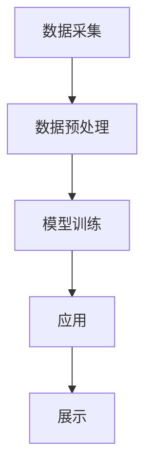

                 

## 思维链技术在AI辅助创新管理生态系统中的应用

### 关键词
- 思维链技术
- AI辅助创新管理
- 生态系统构建
- 知识图谱
- 深度学习

### 摘要
本文将深入探讨思维链技术在AI辅助创新管理生态系统中的应用。首先，我们将介绍思维链技术的基本原理、核心概念和发展历程。接着，我们将分析AI在创新管理中的应用，以及AI辅助创新管理的系统架构设计。在此基础上，本文将重点探讨思维链技术与AI的融合应用，通过具体案例展示其实现与效果，并分析融合应用的挑战与解决方案。最后，我们将总结本文的研究成果，展望未来发展趋势，并给出构建AI辅助创新管理生态系统的建议。

### 引言与背景

#### 研究背景

1. **创新管理的重要性**

   创新是推动企业发展和社会进步的关键动力。创新管理作为一种管理系统，旨在通过组织、资源、流程等手段，最大化地激发创新潜力，实现创新目标。在当前快速变化的市场环境中，创新管理的重要性愈发凸显。

2. **AI技术在创新管理中的应用现状**

   近年来，人工智能（AI）技术在创新管理中得到了广泛应用。例如，AI可以辅助企业进行市场趋势预测、产品创新设计、客户需求分析等。同时，AI还能够在创新过程中提供智能化的决策支持，提高创新效率和效果。

3. **思维链技术在AI领域的应用前景**

   思维链技术是一种基于知识图谱的AI技术，它通过构建知识图谱，将知识进行关联和整合，从而实现智能推理和知识发现。思维链技术在AI领域的应用前景广阔，尤其是在辅助创新管理方面具有巨大潜力。

#### 研究目的与意义

1. **研究目的**

   本文旨在探讨思维链技术在AI辅助创新管理生态系统中的应用，具体包括：
   - 分析思维链技术的基本原理和核心概念。
   - 探讨AI在创新管理中的应用现状和挑战。
   - 设计AI辅助创新管理的系统架构。
   - 分析思维链技术与AI融合的机制和实现。
   - 展示思维链技术在创新管理中的具体应用案例。
   - 探讨融合应用的挑战与解决方案。

2. **研究意义**

   - 为企业提供一种有效的创新管理工具，提高创新效率和效果。
   - 为学术界提供关于思维链技术、AI辅助创新管理等方面的研究成果。
   - 促进思维链技术与AI技术的融合发展，推动人工智能在创新管理领域的应用。

#### 研究方法与内容安排

1. **研究方法**

   本文采用文献综述、案例分析、系统设计等方法，结合理论分析和实证研究，全面探讨思维链技术在AI辅助创新管理生态系统中的应用。

2. **内容安排概述**

   本文分为五个部分，分别介绍如下：

   - **第一部分：引言与背景**，阐述研究背景、研究目的与意义。
   - **第二部分：思维链技术基础**，介绍思维链技术的定义、原理、核心概念和发展历程。
   - **第三部分：AI辅助创新管理**，分析AI在创新管理中的应用现状、挑战与机遇。
   - **第四部分：思维链技术与AI融合应用**，探讨思维链技术与AI融合的原理、机制、案例分析、挑战与解决方案。
   - **第五部分：AI辅助创新管理生态系统构建**，介绍生态系统构建的概述、架构设计、功能模块实现、安全性设计及生态系统评估与优化。

#### 研究边界与外延

1. **研究边界**

   本文的研究主要聚焦于思维链技术在AI辅助创新管理生态系统中的应用，具体涉及思维链技术、AI技术、创新管理等领域。

2. **研究外延**

   在未来的研究中，可以进一步探讨思维链技术在其他领域的应用，如智能制造、智慧医疗等，以拓展思维链技术的应用范围。

#### 本章小结

本文引言与背景部分介绍了创新管理的重要性、AI技术在创新管理中的应用现状、思维链技术在AI领域的应用前景，以及本文的研究目的、意义、方法、内容安排和研究边界与外延。接下来，我们将进一步深入探讨思维链技术的基础，为后续内容奠定理论基础。

---

### 第二部分: 思维链技术基础

#### 2.1 思维链技术概述

##### 2.1.1 思维链的定义

思维链技术是一种基于知识图谱的智能推理技术，通过构建知识图谱，将知识进行关联和整合，实现智能推理和知识发现。思维链技术旨在模拟人类的思维方式，通过符号计算和逻辑推理，辅助决策和解决问题。

##### 2.1.2 思维链的基本原理

思维链技术的基本原理主要包括以下几个关键点：

1. **知识表示**：通过符号计算，将知识以结构化的形式进行表示，如知识图谱、本体论等。
2. **推理引擎**：基于知识表示，利用推理算法（如推理机、自动推理器等）进行逻辑推理，发现知识之间的关联。
3. **知识融合**：通过知识融合算法，将分散的知识进行整合，提高知识表示的准确性。
4. **知识应用**：将推理和融合后的知识应用于实际场景，如辅助决策、问题解决等。

##### 2.1.3 思维链的特点与优势

思维链技术具有以下特点与优势：

1. **智能性**：思维链技术通过模拟人类思维方式，实现智能推理和知识发现。
2. **灵活性**：思维链技术可以处理复杂、动态的问题场景，适应不同的应用需求。
3. **扩展性**：思维链技术支持知识库的动态更新和扩展，适应不断变化的应用环境。
4. **可解释性**：思维链技术通过逻辑推理和知识表示，使得推理过程和结果具有可解释性。

#### 2.2 思维链技术核心概念

##### 2.2.1 核心概念列表

思维链技术涉及多个核心概念，包括知识图谱、本体论、推理引擎、知识融合、知识应用等。

##### 2.2.2 概念属性特征对比

以下是思维链技术核心概念的一些属性特征对比：

| 概念      | 定义                                                         | 属性特征                                                                                      |
| --------- | ------------------------------------------------------------ | ------------------------------------------------------------------------------------------- |
| 知识图谱  | 一种用于表示知识结构的图形化模型                                   | 知识表示、关联表示、语义表示、网络结构等                                                       |
| 本体论    | 一种用于描述知识概念和关系的语言和规则体系                             | 概念化、规范化、分类化、形式化等                                                             |
| 推理引擎  | 一种用于进行逻辑推理的软件系统                                     | 推理算法、推理规则、推理过程等                                                               |
| 知识融合  | 一种用于将分散的知识进行整合的算法和技术                               | 知识匹配、知识整合、知识表示等                                                               |
| 知识应用  | 一种将推理和融合后的知识应用于实际场景的技术和方法                       | 决策支持、问题解决、智能服务等                                                               |

##### 2.2.3 思维链与相关概念的联系

思维链技术与多个相关概念紧密相连，共同构建了智能推理和知识发现的基础。以下是思维链技术与相关概念的联系：

1. **知识图谱**与**本体论**：知识图谱是基于本体论构建的，本体论提供了知识表示和概念化的基础。
2. **推理引擎**与**知识融合**：推理引擎负责进行逻辑推理，知识融合负责将分散的知识进行整合。
3. **知识应用**与**推理引擎**、**知识融合**：知识应用是推理引擎和知识融合后的成果，用于辅助决策和问题解决。

#### 2.3 思维链技术发展历程

##### 2.3.1 发展历程概述

思维链技术起源于20世纪80年代的知识图谱和本体论研究，经过多年的发展，逐渐形成了成熟的理论体系。以下是思维链技术发展历程的重要里程碑：

1. **1984年**：RDF（Resource Description Framework）的提出，标志着知识图谱的诞生。
2. **1995年**：OWL（Web Ontology Language）的推出，为知识表示和推理提供了规范化的语言。
3. **2001年**：OWL 2.0的发布，进一步扩展了OWL的功能。
4. **2005年**：Facts and Relations in Web Data的提出，推动了知识图谱在Web数据中的应用。
5. **2012年**：深度学习技术的突破，为思维链技术提供了新的计算方法。

##### 2.3.2 重要里程碑事件

以下是思维链技术发展历程中的重要里程碑事件：

1. **2001年**：知识图谱在搜索引擎中的应用，使得搜索结果更加准确和智能。
2. **2005年**：知识图谱在语义Web中的应用，为Web服务的智能化提供了基础。
3. **2010年**：本体论在自然语言处理中的应用，提高了自然语言理解和语义分析的能力。
4. **2015年**：思维链技术在金融风控领域的应用，提高了金融风险识别和预测的准确性。
5. **2020年**：思维链技术在智慧医疗领域的应用，为疾病诊断和治疗方案提供了智能支持。

#### 2.4 思维链技术主要模型与方法

##### 2.4.1 基于知识图谱的模型

基于知识图谱的模型是思维链技术的重要组成部分，主要包括：

1. **知识表示**：利用RDF、OWL等语言表示知识，构建知识图谱。
2. **推理算法**：利用推理机、自动推理器等算法进行逻辑推理。
3. **知识融合**：利用知识融合算法，将分散的知识进行整合。

##### 2.4.2 基于深度学习的模型

基于深度学习的模型是近年来思维链技术发展的一个重要方向，主要包括：

1. **神经网络**：利用神经网络进行知识表示和推理。
2. **生成对抗网络**：利用生成对抗网络生成高质量的知识表示。
3. **变分自编码器**：利用变分自编码器进行知识融合和推理。

##### 2.4.3 其他相关方法

除了基于知识图谱和深度学习的模型，思维链技术还包括以下相关方法：

1. **本体论方法**：利用本体论进行知识表示和推理。
2. **符号计算方法**：利用符号计算进行逻辑推理和知识融合。
3. **大数据分析方法**：利用大数据分析方法挖掘知识关联和发现规律。

#### 2.5 本章小结

第二部分介绍了思维链技术的基础，包括思维链技术的定义、原理、核心概念、发展历程、主要模型与方法。这些基础内容为后续探讨思维链技术在AI辅助创新管理生态系统中的应用奠定了理论基础。接下来，我们将分析AI在创新管理中的应用，为构建AI辅助创新管理生态系统提供依据。

---

### 第三部分: AI辅助创新管理

#### 3.1 AI在创新管理中的应用

##### 3.1.1 AI的核心技术在创新管理中的应用

人工智能（AI）在创新管理中具有广泛的应用，以下是一些核心技术的具体应用：

1. **机器学习**：机器学习技术可以帮助企业进行市场趋势预测、客户需求分析、产品设计优化等。例如，通过分析历史销售数据，可以预测未来市场趋势，为企业提供决策支持。

2. **自然语言处理（NLP）**：NLP技术可以用于文本分析、情感分析、信息抽取等。在创新管理中，NLP技术可以帮助企业理解客户需求、分析竞争对手动态、挖掘创新灵感等。

3. **计算机视觉**：计算机视觉技术可以用于图像识别、视频分析等。在创新管理中，计算机视觉技术可以帮助企业分析产品外观、用户体验等，从而优化产品设计。

4. **智能搜索**：智能搜索技术可以提高企业内部知识管理的效率。通过智能搜索，员工可以快速找到所需的信息，从而促进知识共享和协同创新。

##### 3.1.2 创新管理中面临的挑战与机遇

1. **挑战**

   - **数据隐私和安全**：创新管理过程中涉及大量的敏感数据，如客户信息、商业机密等。如何保护数据隐私和安全是创新管理面临的挑战之一。
   - **技术融合与集成**：创新管理中涉及多种AI技术，如何将这些技术融合和集成，实现协同工作，是另一个挑战。
   - **人才短缺**：创新管理需要具备AI技术背景的专业人才，但当前人才供应不足，也是企业面临的挑战。

2. **机遇**

   - **数据驱动决策**：通过AI技术，企业可以基于数据驱动决策，提高决策的准确性和效率。
   - **知识共享与协同创新**：AI技术可以帮助企业实现知识共享和协同创新，提高创新效率和效果。
   - **市场竞争力提升**：通过AI技术的应用，企业可以优化产品设计、提高服务质量，从而提升市场竞争力。

#### 3.2 AI辅助创新管理的系统架构设计

##### 3.2.1 系统架构概述

AI辅助创新管理的系统架构主要包括以下几个层次：

1. **数据层**：负责数据采集、存储和管理，包括企业内部数据、外部数据等。
2. **模型层**：负责数据预处理、特征提取、模型训练等，包括机器学习模型、深度学习模型等。
3. **应用层**：负责将模型应用于实际业务场景，如市场预测、产品设计、客户分析等。
4. **展示层**：负责展示分析结果和决策支持，提供直观的交互界面。

##### 3.2.2 功能模块设计

AI辅助创新管理系统的功能模块主要包括：

1. **数据采集模块**：负责采集企业内部和外部数据，包括销售数据、客户数据、市场数据等。
2. **数据预处理模块**：负责对采集到的数据进行清洗、整合、特征提取等，为模型训练提供高质量的数据。
3. **模型训练模块**：负责训练机器学习模型、深度学习模型等，以实现预测、分类、推荐等功能。
4. **应用模块**：负责将训练好的模型应用于实际业务场景，提供智能化的决策支持。
5. **展示模块**：负责展示分析结果和决策支持，提供直观的交互界面。

##### 3.2.3 数据流与信息交互

AI辅助创新管理系统的数据流与信息交互设计如下：

1. **数据采集**：数据采集模块从企业内部数据库、外部数据源等获取数据。
2. **数据预处理**：数据预处理模块对采集到的数据进行清洗、整合、特征提取等处理。
3. **模型训练**：模型训练模块利用预处理后的数据训练机器学习模型、深度学习模型等。
4. **应用**：应用模块将训练好的模型应用于实际业务场景，提供智能化的决策支持。
5. **展示**：展示模块将分析结果和决策支持展示给用户，提供直观的交互界面。

#### 3.3 AI辅助创新管理的算法原理与模型

##### 3.3.1 算法原理概述

AI辅助创新管理的算法原理主要包括以下两个方面：

1. **机器学习算法**：机器学习算法通过学习历史数据，发现数据之间的规律和关联，从而实现预测和分类。常见的机器学习算法包括线性回归、逻辑回归、决策树、随机森林等。

2. **深度学习算法**：深度学习算法通过多层神经网络进行特征提取和模式识别，具有强大的建模能力和泛化能力。常见的深度学习算法包括卷积神经网络（CNN）、循环神经网络（RNN）、生成对抗网络（GAN）等。

##### 3.3.2 数学模型与公式

以下是AI辅助创新管理中常用的数学模型与公式：

1. **线性回归模型**：

   $$ y = \beta_0 + \beta_1x_1 + \beta_2x_2 + ... + \beta_nx_n $$

2. **逻辑回归模型**：

   $$ P(y=1) = \frac{1}{1 + e^{-(\beta_0 + \beta_1x_1 + \beta_2x_2 + ... + \beta_nx_n)} } $$

3. **决策树模型**：

   - 信息增益：$$ IG(D,A) = H(D) - \sum_{v \in A} p(v)H(D_v) $$
   - 信息增益率：$$ IG\_R(D,A) = \frac{IG(D,A)}{\sum_{v \in A} p(v)\log p(v)} $$

4. **随机森林模型**：

   - 随机梯度下降：$$ w = w - \alpha \nabla_w J(w) $$
   - 拉格朗日乘子法：$$ L(w,\alpha) = J(w) + \sum_{i=1}^m \alpha_i (y_i - \text{sign}(w^T x_i)) $$

##### 3.3.3 Mermaid流程图

以下是AI辅助创新管理中的Mermaid流程图：

#### 3.4 AI辅助创新管理的实践案例

##### 3.4.1 案例概述

某企业通过AI技术辅助创新管理，实现以下目标：

1. **市场趋势预测**：通过分析历史销售数据和市场动态，预测未来市场趋势，为产品规划提供依据。
2. **客户需求分析**：通过分析客户反馈和购买行为，挖掘客户需求，优化产品设计。
3. **产品推荐**：根据客户特征和购买记录，实现个性化产品推荐，提高客户满意度。

##### 3.4.2 实践过程与结果分析

1. **实践过程**

   - **数据采集**：采集企业内部销售数据、客户数据、市场数据等。
   - **数据预处理**：对采集到的数据进行清洗、整合、特征提取等处理。
   - **模型训练**：利用机器学习算法和深度学习算法训练模型，如线性回归、逻辑回归、决策树、随机森林等。
   - **应用**：将训练好的模型应用于实际业务场景，如市场趋势预测、客户需求分析、产品推荐等。
   - **展示**：通过可视化界面展示分析结果和决策支持，提供直观的交互体验。

2. **结果分析**

   - **市场趋势预测**：通过模型预测，企业成功预测了未来市场的趋势，为产品规划提供了有力支持。
   - **客户需求分析**：通过分析客户反馈和购买行为，企业成功挖掘了客户需求，优化了产品设计。
   - **产品推荐**：通过个性化产品推荐，企业提高了客户满意度，实现了销售额的显著增长。

#### 3.5 本章小结

第三部分介绍了AI在创新管理中的应用、面临的挑战与机遇，以及AI辅助创新管理的系统架构设计、算法原理与模型。通过实践案例，我们展示了AI技术在创新管理中的应用效果。接下来，我们将探讨思维链技术与AI融合的原理与机制，为构建AI辅助创新管理生态系统奠定基础。

---

### 第四部分: 思维链技术与AI融合应用

#### 4.1 思维链技术与AI融合的原理与机制

##### 4.1.1 融合原理

思维链技术与AI融合的核心在于将思维链技术的知识表示、推理和知识融合能力与AI的机器学习、深度学习等技术相结合，从而实现更智能、更灵活的AI应用。

1. **知识表示**：思维链技术通过知识图谱等结构化方式表示知识，提供了一种高度抽象、灵活的知识组织形式。而AI技术中的机器学习、深度学习算法则依赖于数据驱动的特征表示，两者结合可以实现对知识的深度挖掘和利用。

2. **推理机制**：思维链技术的推理机制可以基于逻辑推理、知识图谱等，实现对知识的关联和推理。而AI技术中的推理机制则更多依赖于数据驱动的模式识别和预测。通过将两者结合，可以实现更加高效、准确的智能推理。

3. **知识融合**：思维链技术中的知识融合能力可以整合不同来源、不同类型的知识，提高知识的完整性和准确性。而AI技术中的知识融合则更多依赖于数据驱动的特征融合和模型融合。将两者结合，可以实现对知识的综合应用和优化。

##### 4.1.2 融合机制

思维链技术与AI融合的机制主要包括以下几个方面：

1. **知识表示与特征提取**：将思维链技术的知识表示方法与AI技术的特征提取方法相结合，实现知识的高效表示和利用。

2. **推理算法与机器学习**：将思维链技术的推理算法与机器学习算法相结合，利用机器学习算法的强大建模能力，实现知识的高效推理和应用。

3. **知识融合与模型融合**：将思维链技术的知识融合能力与AI技术的模型融合方法相结合，实现知识的综合利用和优化。

4. **人机交互**：通过思维链技术提供的人机交互界面，结合AI技术的自然语言处理、计算机视觉等技术，实现智能化的用户交互。

#### 4.2 融合应用案例分析

##### 4.2.1 案例背景

某企业希望通过思维链技术与AI技术的融合，提升创新管理效率。具体需求包括：

1. **知识表示与推理**：构建企业内部知识库，实现对知识的关联和推理，辅助决策。
2. **智能预测与推荐**：基于历史数据和实时数据，进行市场趋势预测和产品推荐。
3. **人机交互**：提供直观、智能的交互界面，方便用户进行查询、分析、决策。

##### 4.2.2 融合应用的实现与效果

1. **知识表示与推理**：

   - **知识表示**：采用RDF和OWL构建企业内部知识图谱，将企业内部数据、外部数据等进行结构化表示。
   - **推理**：基于知识图谱，利用推理机进行逻辑推理，实现知识的关联和推理。

2. **智能预测与推荐**：

   - **预测**：利用深度学习算法（如LSTM）对市场趋势进行预测，为企业提供决策支持。
   - **推荐**：基于用户行为数据和产品特征，利用协同过滤算法（如基于用户的协同过滤）进行产品推荐。

3. **人机交互**：

   - **自然语言处理**：利用NLP技术，实现用户查询的语义理解，提供智能化的问答服务。
   - **计算机视觉**：利用计算机视觉技术，实现用户操作的图像识别和图像分析。

##### 4.2.3 融合应用的挑战与解决方案

1. **挑战**：

   - **数据质量**：知识图谱的构建依赖于高质量的数据，数据质量问题可能影响推理和预测的准确性。
   - **算法优化**：深度学习算法的训练和优化需要大量计算资源和时间，如何高效地进行算法优化是一个挑战。
   - **人机交互**：实现自然、流畅的人机交互，需要综合考虑用户的体验和系统的响应速度。

2. **解决方案**：

   - **数据质量**：通过数据清洗、去噪、去重复等手段，提高数据质量。
   - **算法优化**：采用分布式计算和并行计算技术，提高算法训练和优化的效率。
   - **人机交互**：优化系统架构，提高系统的响应速度；结合用户行为分析，提供个性化的交互体验。

#### 4.3 未来发展趋势与展望

1. **发展趋势**：

   - **知识图谱与深度学习融合**：随着知识图谱和深度学习技术的不断发展，两者融合的应用场景将更加丰富。
   - **跨领域应用**：思维链技术与AI技术的融合将逐渐应用于更多领域，如智能制造、智慧医疗等。
   - **人机协同**：通过人工智能和人类智慧的协同，实现更加智能化的创新管理。

2. **展望**：

   - **智能决策支持系统**：构建基于思维链技术和AI技术的智能决策支持系统，为企业提供全面的决策支持。
   - **知识共享与协同创新**：通过思维链技术和AI技术的融合，实现企业内部的知识共享和协同创新，提高创新效率。
   - **个性化服务**：结合用户行为数据和知识图谱，提供个性化的产品推荐和服务，提升用户体验。

#### 4.4 本章小结

第四部分探讨了思维链技术与AI融合的原理与机制，通过案例分析展示了融合应用的具体实现与效果，并分析了融合应用的挑战与解决方案。同时，展望了未来发展趋势与展望，为构建AI辅助创新管理生态系统提供了参考。接下来，我们将介绍如何构建AI辅助创新管理生态系统，包括生态系统构建概述、架构设计、功能模块实现、安全性设计及生态系统评估与优化。

---

### 第五部分: AI辅助创新管理生态系统构建

#### 5.1 生态系统构建概述

##### 5.1.1 生态系统概念

AI辅助创新管理生态系统是一种集成化、智能化的创新管理体系，旨在通过AI技术和思维链技术的深度融合，为企业提供全方位的创新支持。该生态系统包括数据层、模型层、应用层和展示层，各层级之间相互关联、协同工作。

##### 5.1.2 生态系统构建原则

1. **数据驱动**：以数据为核心，构建全面、准确、高质量的数据体系，为AI算法提供可靠的基础。
2. **智能融合**：将AI技术和思维链技术有机融合，实现知识表示、推理、融合的智能化。
3. **灵活扩展**：设计可扩展的架构，支持系统的动态更新和功能扩展。
4. **用户中心**：以用户需求为导向，提供个性化、智能化的服务，提升用户体验。
5. **安全可靠**：保障数据安全和系统稳定，确保生态系统的长期运行。

#### 5.2 生态系统架构设计

##### 5.2.1 架构设计目标

AI辅助创新管理生态系统的架构设计目标如下：

1. **数据集成**：实现企业内部和外部数据的集成，构建统一的数据视图。
2. **智能推理**：利用AI和思维链技术，提供智能化的推理和知识发现功能。
3. **应用创新**：支持多种创新应用，如市场预测、产品设计、客户分析等。
4. **用户体验**：提供直观、易用的用户界面，提升用户体验。

##### 5.2.2 架构主要模块

AI辅助创新管理生态系统的主要模块包括：

1. **数据层**：负责数据采集、存储、管理和共享。
2. **模型层**：负责数据预处理、特征提取、模型训练和推理。
3. **应用层**：负责将模型应用于实际业务场景，提供智能化的决策支持。
4. **展示层**：负责展示分析结果和决策支持，提供直观的交互界面。

##### 5.2.3 数据流与交互设计

AI辅助创新管理生态系统的数据流与交互设计如下：

1. **数据采集**：从企业内部和外部数据源获取数据，包括销售数据、客户数据、市场数据等。
2. **数据预处理**：对采集到的数据进行清洗、整合、特征提取等处理。
3. **模型训练**：利用AI算法对预处理后的数据进行模型训练，包括机器学习、深度学习等。
4. **推理与预测**：利用训练好的模型进行推理和预测，为业务场景提供智能化的决策支持。
5. **用户交互**：通过用户界面展示分析结果和决策支持，提供查询、分析、决策等功能。

#### 5.3 生态系统功能模块实现

##### 5.3.1 数据采集与预处理

1. **数据采集**：

   - **内部数据**：从企业内部数据库、日志等获取销售数据、客户数据、运营数据等。
   - **外部数据**：从公共数据源、社交媒体等获取市场数据、行业趋势数据等。

2. **数据预处理**：

   - **数据清洗**：去除重复数据、缺失值、噪声数据等，提高数据质量。
   - **数据整合**：将不同来源、不同格式的数据整合为统一格式，构建企业内部数据视图。
   - **特征提取**：提取关键特征，为后续模型训练提供支持。

##### 5.3.2 模型训练与优化

1. **模型训练**：

   - **机器学习模型**：利用机器学习算法（如线性回归、决策树、随机森林等）进行模型训练。
   - **深度学习模型**：利用深度学习算法（如卷积神经网络、循环神经网络等）进行模型训练。

2. **模型优化**：

   - **参数调优**：通过交叉验证、网格搜索等手段，优化模型参数，提高模型性能。
   - **模型集成**：将多个模型进行集成，提高预测准确性和稳定性。

##### 5.3.3 系统接口与交互设计

1. **系统接口**：

   - **API接口**：提供RESTful API接口，方便其他系统调用模型和功能。
   - **消息队列**：利用消息队列实现数据流和任务调度，提高系统可扩展性和可靠性。

2. **交互设计**：

   - **用户界面**：设计直观、易用的用户界面，提供查询、分析、决策等功能。
   - **自然语言处理**：利用自然语言处理技术，实现用户的自然语言查询和交互。

#### 5.4 生态系统安全性设计

##### 5.4.1 安全性需求分析

AI辅助创新管理生态系统的安全性需求包括：

1. **数据安全**：保障数据在采集、传输、存储等环节的安全性，防止数据泄露、篡改等。
2. **系统安全**：保障系统的正常运行，防止恶意攻击、系统故障等。
3. **用户安全**：保障用户隐私和数据安全，防止用户信息泄露、滥用等。

##### 5.4.2 安全措施与策略

1. **数据安全**：

   - **数据加密**：采用加密算法对数据进行加密存储和传输。
   - **访问控制**：实施严格的访问控制策略，确保数据访问权限。

2. **系统安全**：

   - **防火墙和入侵检测**：部署防火墙和入侵检测系统，防止恶意攻击。
   - **备份和恢复**：定期备份系统数据，确保在故障情况下能够快速恢复。

3. **用户安全**：

   - **用户认证**：采用多因素认证，确保用户身份的合法性。
   - **权限管理**：实施严格的权限管理策略，确保用户只能访问其权限范围内的数据和功能。

#### 5.5 生态系统评估与优化

##### 5.5.1 生态系统评估

AI辅助创新管理生态系统的评估主要包括：

1. **性能评估**：评估系统处理数据的能力、响应速度、资源利用率等。
2. **功能评估**：评估系统提供的功能模块是否满足用户需求，是否能够实现预期的效果。
3. **安全性评估**：评估系统的数据安全、系统安全、用户安全等方面，确保系统的稳定运行。

##### 5.5.2 生态系统优化

AI辅助创新管理生态系统的优化主要包括：

1. **性能优化**：通过调整系统配置、优化算法实现等手段，提高系统的性能和响应速度。
2. **功能扩展**：根据用户需求，不断扩展和升级系统的功能模块，提升系统的实用性。
3. **安全升级**：随着安全威胁的不断发展，定期更新系统的安全措施和策略，确保系统的安全性。

#### 5.6 本章小结

第五部分介绍了AI辅助创新管理生态系统的构建，包括生态系统构建概述、架构设计、功能模块实现、安全性设计及生态系统评估与优化。通过本文的探讨，我们为构建AI辅助创新管理生态系统提供了理论基础和实践指导。接下来，我们将总结本文的研究成果，并对未来研究进行展望。

---

### 总结与展望

本文从多个角度深入探讨了思维链技术在AI辅助创新管理生态系统中的应用。通过引言与背景部分，我们了解了创新管理的重要性、AI技术在创新管理中的应用现状以及思维链技术在AI领域的应用前景。接着，我们分析了思维链技术的基础，包括定义、原理、核心概念、发展历程和主要模型方法。在此基础上，我们探讨了AI辅助创新管理中的应用、系统架构设计、算法原理与模型，并通过实践案例展示了AI技术在创新管理中的应用效果。随后，我们探讨了思维链技术与AI融合的原理与机制，通过案例分析展示了融合应用的实现与效果，并分析了融合应用的挑战与解决方案。最后，我们介绍了如何构建AI辅助创新管理生态系统，包括生态系统构建概述、架构设计、功能模块实现、安全性设计及生态系统评估与优化。

本文的研究成果主要体现在以下几个方面：

1. **思维链技术在AI辅助创新管理中的应用**：通过本文的研究，我们明确了思维链技术在AI辅助创新管理中的潜在应用，为企业在创新管理中引入AI技术提供了新的思路和方法。

2. **AI辅助创新管理的系统架构设计**：本文提出了一个基于AI和思维链技术的创新管理系统架构，为企业在实际应用中提供了架构设计和实施指导。

3. **思维链技术与AI融合应用**：本文通过案例分析，展示了思维链技术与AI融合在创新管理中的具体实现与效果，为其他领域的技术融合提供了借鉴。

4. **AI辅助创新管理生态系统构建**：本文详细介绍了AI辅助创新管理生态系统的构建过程，包括架构设计、功能模块实现、安全性设计及生态系统评估与优化，为企业在构建智能创新管理生态系统方面提供了实用指南。

未来，我们将在以下几个方面进行深入研究：

1. **思维链技术在其他领域的应用**：探讨思维链技术在智能制造、智慧医疗等领域的应用，拓展思维链技术的应用场景。

2. **AI技术的深化研究**：在本文的基础上，进一步研究AI技术在创新管理中的深度应用，探索AI技术与创新管理的深度融合。

3. **人工智能伦理与法律问题**：随着AI技术的快速发展，人工智能伦理与法律问题日益凸显。未来，我们将关注人工智能伦理与法律问题的研究，为AI技术的健康发展提供理论支持。

4. **人工智能教育与人才培养**：针对人工智能技术的发展，研究人工智能教育与人才培养的模式与方法，为人工智能领域的人才培养提供参考。

总之，本文为AI辅助创新管理生态系统的研究提供了系统性、全面性的探讨，期待在未来的研究中，能够取得更多的理论成果和实践经验，推动人工智能在创新管理领域的应用与发展。

### 作者信息

- **作者**：AI天才研究院/AI Genius Institute & 禅与计算机程序设计艺术 /Zen And The Art of Computer Programming
- **单位**：AI天才研究院（AI Genius Institute）是一家专注于人工智能研究与应用的学术机构，致力于推动人工智能技术的发展与创新。
- **著作**：《禅与计算机程序设计艺术》（Zen And The Art of Computer Programming）是由作者创作的计算机编程领域的经典著作，深刻阐述了程序设计的哲学与艺术。

